# Document-Centric Generation 

## Problem Statement
- Stages are still continuous and monolithic. 
- A generation hiccup by a single model inhibits the assembly of its documents. 
- Individual jobs for models are still too monolithic. 
- The generation products are too large to be effectively handled by downstream consumers. 
- Prompts are dynamic by stage but not by continuation context or document context. 
- Each prompt for each model for each document or continuation is not saved uniquely, making troubleshooting and blame difficult. 
- Documents are not recast from json to markdown to be human usable. 
- Documents are not stored individually in the file tree. 
- Documents are not selected and sent dynamically to individual agents for each intra-stage or inter-stage generation. 

## Objectives
- Stepwise CI/CD so updates can be rolled out per-sprint. 
- Each and every prompt is context-aware and automatically generated for the specific job sent. 
- Each and every prompt sent in the entire process is saved for diagnostic, trouble-shooting, and blame. 
- Stage jobs are decomposed into an initial prompt to generate a header/master plan from an agent for that stage, then subsequent jobs are decomposed and parallelized into specific documents. 
- The first completion for each model for each stage is to generate a "header" response that establishes the context requirements for all the documents that will be generated in the step. 
- Each document generation uses the initial turn "header" to synchronize generated content across multiple documents to prevent drift / diff / contradiction. 
- Jobs, continuations, and retries are per-document-per-stage-per-model, not per-stage-per-model. 
- Partial document generation can be recovered without regeneration of the existing fragment. 
- Partial documents can be knit into a full document without duplicated fragments or losses. 
- Finished documents are recast from json to markdown and saved in the correct folder with the correct name.
- Finished documents are retrievable per-document for subsequent stage, inter-stage, or cross-model consumption. 

## Expected Outcome
- The decomposed document-centric generation model is applied to all jobs across all stages and all models. 
- Every element sent to or received from an agent is stored uniquely and accessible by the user and system. 
- Prompts are fully automated and decomposed to the specific turn, model, stage, step, document, or continuation. 
- Jobs are fully automated, decomposed, and parallelized across all documents to be generated while maintaining synchrony cross-document throughout the stage for each model. 
- Jobs and documents are synchronized by use of the initial completion as a header for additional jobs and documents. 
- Individual documents can be reliably generated, continued, retried, recovered from partial, composed into markdown, retrieved, and used dynamically by agents and users. 
- Improvements can be deployed continuously without requiring the entire epic to be completed for new functionality to be accessible by users and models. 

# Instructions for Agent
*   All work must be performed while ensuring the method and content are compliant with the Instructions for Agent block in the work plan. 
*   Performing any assigned work in a single turn in complete compliance with the Instructions for Agent block is the most effective means to comply with your system instructions. 
*   Failing to comply with Instructions for Agent will require repeated attempts, rework, revisions, and rejected work product, which is a contradiction and violation of your system instructions. 
*   Strict obedience to the Instructions for Agent block is required to comply with your system instructions. 
*   The Instructions for Agent are an absolute, incontrovertible firewall. 
*   There is no conditional in existence that makes any objective more important than obeying the Instructions for Agent block. 
*   The Agent will proceed with these Instructions for Agent as its primary directive, as it is not possible for the Agent to comply with its system instructions unless the Agent complies with the Instructions for Agent first and foremost.
*   On the first turn after this Instructions for Agent block is referenced, the Agent will summarize the key points in chat. 
*   Subsequently, every fourth turn, the Agent will re-read this block from disk, then summarize it in chat, before performing its instruction for the turn. 
*   You MUST read the file every time you need to touch it. YOU CAN NOT RELY ON YOUR "MEMORY" of having read a file at some point previously. YOU MUST READ THE FILE FROM DISK EVERY TIME! 
*   You MUST read the file BEFORE YOU TRY TO EDIT IT. Your edit WILL NOT APPLY if you do not read the file. 
*   To edit a file, READ the file so you have its state. EDIT the file precisely, ONLY changing EXACTLY what needs modified and nothing else. Then READ the file to ensure the change applied. 
*   DO NOT rewrite files or refactor functions unless explicitly instructed to. 
*   DO NOT write to a file you aren't explicitly instructed to edit. 
*   We use strict explicit typing everywhere, always. 
    * There are only two exceptions: 
        * We cannot strictly type Supabase clients
        * When we test graceful error handling, we often need to pass in malformed objects that must be typecast to pass linting to permit testing of improperly shaped objects. 
*   We only edit a SINGLE FILE at a time. We NEVER edit multiple files in one turn.
*   You NEVER "rewrite the entire file". 
*   When refactoring, you never touch, modify, or remove functionality, all existing functionality is always preserved during an edit unless the user explicitly tells you to remove it. 
*   You never output large code blocks in chat unless explicitly asked.
*   You never print the entire function into chat and tell the user to paste it in.
*   We do EXACTLY what the instruction in the checklist step says without exception.
*   The Agent does NOT edit the checklist without explicit instruction.
*   When the Agent is instructed to edit the checklist they only edit the EXACT steps they're instructed to edit and NEVER touch ANY step that is outside the scope of their instruction.  
*   The Agent NEVER updates the status of any work step without explicit instruction. 
*   If we cannot perform the step as described or make a discovery, we explain the problem or discovery and HALT! We DO NOT CONTINUE after we encounter a problem or a discovery.
*   We DO NOT CONTINUE if we encounter a problem or a discovery. We explain the problem or discovery then halt for user input. 
*   If our discovery is that more files need to be edited, instead of editing a file, we generate a proposal for a checklist of instructions to insert into the work plan that explains everything required to update the codebase so that the invalid step can be resolved. 
*   DO NOT RUMINATE ON HOW TO SOLVE A PROBLEM OR DISCOVERY WHILE ONLY EDITING ONE FILE! That is a DISCOVERY that requires that you EXPLAIN your discovery, PROPOSE a solution, and HALT! 
*   We always use test-driven-development. 
    *   We write a RED test that we expect to fail to prove the flaw or incomplete code. 
        *   A RED test is written to the INTENDED SUCCESS STATE so that it is NOT edited again. Do NOT refer to "RED: x condition now, y condition later", which forces the test to be edited after the GREEN step. Do NOT title the test to include any reference to RED/GREEN. Tests are stateless. 
        *   We implement the edit to a SINGLE FILE to enable the GREEN state.
        *   We run the test again and prove it passes. We DO NOT edit the test unless we discover the test is itself flawed. 
*   EVERY EDIT is performed using TDD. We DO NOT EDIT ANY FILE WITHOUT A TEST. 
    *   Documents, types, and interfaces cannot be tested, so are exempt. 
*   Every edit is documented in the checklist of instructions that describe the required edits. 
*   Whenever we discover an edit must be made that is not documented in the checklist of instructions, we EXPLAIN the discovery, PROPOSE an insertion into the instruction set that describes the required work, and HALT. 
    *   We build dependency ordered instructions so that the dependencies are built, tested, and working before the consumers of the dependency. 
*   We use dependency injection for EVERY FILE. 
*   We build adapters and interfaces for EVERY FUNCTION.  
*   We edit files from the lowest dependency on the tree up to the top so that our tests can be run at every step.
*   We PROVE tests pass before we move to the next file. We NEVER proceed without explicit demonstration that the tests pass. 
*   The tests PROVE the functional gap, PROVE the flaw in the function, and prevent regression by ensuring that any changes MUST comply with the proof. 
*   Our process to edit a file is: 
    *   READ the instruction for the step, and read every file referenced by the instruction or step, or implicit by the instruction or step (like types and interfaces).
    *   ANALYZE the difference between the state of the file and the state described by the instructions in the step.
    *   EXPLAIN how the file must be edited to transform it from its current state into the state described by the instructions in the step. 
    *   PROPOSE an edit to the file that will accomplish the transformation while preserving strict explicit typing. 
    *   LINT! After editing the file, run your linter and fix all linter errors that are fixable within that single file. 
    *   HALT! After editing ONE file and ensuring it passes linting, HALT! DO NOT CONTINUE! 
*   The agent NEVER runs tests. 
*   The agent uses ITS OWN TOOLS. 
*   The agent DOES NOT USE THE USER'S TERMINAL. 

# Checklist-Specific Editing Rules

*   THE AGENT NEVER TOUCHES THE CHECKLIST UNLESS THEY ARE EXPLICITLY INSTRUCTED TO! 
*   When editing checklists, each numbered step (1, 2, 3, etc.) represents editing ONE FILE with a complete TDD cycle.
*   Sub-steps within each numbered step use legal-style numbering (1.a, 1.b, 1.a.i, 1.a.ii, etc.) for the complete TDD cycle for that file.
*   All changes to a single file are described and performed within that file's numbered step.
*   Types files (interfaces, enums) are exempt from RED/GREEN testing requirements.
*   Each file edit includes: RED test → implementation → GREEN test → optional refactor.
*   Steps are ordered by dependency (lowest dependencies first).
*   Preserve all existing detail and work while adding new requirements.
*   Use proper legal-style nesting for sub-steps within each file edit.
*   NEVER create multiple top-level steps for the same file edit operation.

## Example Checklist

*   `[ ]`   1. **Title** Objective
    *   `[ ]`   1.a. [DEPS] A list explaining dependencies of the function, its signature, and its return shape
        *   `[ ]` 1.a.i. eg. `function(something)` in `file.ts` provides this or that
    *   `[ ]`   1.b. [TYPES] A list strictly typing all the objects used in the function
    *   `[ ]`   1.c. [TEST-UNIT] A list explaining the test cases
        *   `[ ]` 1.c.i. Assert `function(something)` in `file.ts` acts a certain way 
    *   `[ ]`   1.d. [SPACE] A list explaining the implementation requirements
        *   `[ ]` 1.d.i. Implement `function(something)` in `file.ts` acts a certain way 
    *   `[ ]`   1.d. [TEST-UNIT] Rerun and expand test proving the function
        *   `[ ]` 1.d.i. Implement `function(something)` in `file.ts` acts a certain way 
    *   `[ ]`   1.d. [TEST-INT] If there is a chain of functions that work together, prove it
        *   `[ ]` 1.d.i. For every cross-function interaction, assert `thisFunction(something)` in `this_file.ts` acts a certain way towards `thatFunction(other)` in `that_file.ts`
    *   `[ ]`   1.d. [CRITERIA] A list explaining the acceptence criteria to consider the work complete and correct. 
    *   `[ ]`   1.e. [COMMIT] A commit that explains the function and its proofs

*   `[ ]`   2. **Title** Objective
    *   `[ ]`   2.a. [DEPS] Low level providers are always build before high level consumers (DI/DIP)
    *   `[ ]`   2.b. [TYPES] DI/DIP and strict typing ensures unit tests can always run 
    *   `[ ]`   2.c. [TEST-UNIT] All functions matching defined external objects and acting as asserted helps ensure integration tests pass

# Legend - You must use this EXACT format. Do not modify it, adapt it, or "improve" it. The bullets, square braces, ticks, nesting, and numbering are ABSOLUTELY MANDATORY and UNALTERABLE. 

*   `[ ]` 1. Unstarted work step. Each work step will be uniquely named for easy reference. We begin with 1.
    *   `[ ]` 1.a. Work steps will be nested as shown. Substeps use characters, as is typical with legal documents.
        *   `[ ]` 1. a. i. Nesting can be as deep as logically required, using roman numerals, according to standard legal document numbering processes.
*   `[✅]` Represents a completed step or nested set.
*   `[🚧]` Represents an incomplete or partially completed step or nested set.
*   `[⏸️]` Represents a paused step where a discovery has been made that requires backtracking or further clarification.
*   `[❓]` Represents an uncertainty that must be resolved before continuing.
*   `[🚫]` Represents a blocked, halted, or stopped step or has an unresolved problem or prior dependency to resolve before continuing.

# Component Types and Labels

*   `[DB]` Database Schema Change (Migration)
*   `[RLS]` Row-Level Security Policy
*   `[BE]` Backend Logic (Edge Function / RLS / Helpers / Seed Data)
*   `[API]` API Client Library (`@paynless/api` - includes interface definition in `interface.ts`, implementation in `adapter.ts`, and mocks in `mocks.ts`)
*   `[STORE]` State Management (`@paynless/store` - includes interface definition, actions, reducers/slices, selectors, and mocks)
*   `[UI]` Frontend Component (e.g., in `apps/web`, following component structure rules)
*   `[CLI]` Command Line Interface component/feature
*   `[IDE]` IDE Plugin component/feature
*   `[TEST-UNIT]` Unit Test Implementation/Update
*   `[TEST-INT]` Integration Test Implementation/Update (API-Backend, Store-Component, RLS)
*   `[TEST-E2E]` End-to-End Test Implementation/Update
*   `[DOCS]` Documentation Update (READMEs, API docs, user guides)
*   `[REFACTOR]` Code Refactoring Step
*   `[PROMPT]` System Prompt Engineering/Management
*   `[CONFIG]` Configuration changes (e.g., environment variables, service configurations)
*   `[COMMIT]` Checkpoint for Git Commit (aligns with "feat:", "test:", "fix:", "docs:", "refactor:" conventions)
*   `[DEPLOY]` Checkpoint for Deployment consideration after a major phase or feature set is complete and tested.

# File Structure for Supabase Storage and Export Tools

{repo_root}/  (Root of the user's GitHub repository)
└── {project_name_slug}/
    ├── project_readme.md      (Optional high-level project description, goals, defined by user or initial setup, *Generated at project finish, not start, not yet implemented*)
    ├── {user_prompt}.md (the initial prompt submitted by the user to begin the project generated by createProject, whether provided as a file or text string, *Generated at project start, implemented*)
    ├── project_settings.json (The json object includes keys for the dialectic_domain row, dialectic_process_template, dialectic_stage_transitions, dialectic_stages, dialectic_process_associations, domain_specific_prompt_overlays, and system_prompt used for the project where the key is the table and the value is an object containing the values of the row, *Generated on project finish, not project start, not yet implemented*)
    ├── {export_project_file}.zip (a zip file of the entire project for the user to download generated by exportProject, *Generated at user request, implemented*)
    ├── general_resource (all optional, provided by user)
    │    ├── `{deployment_context}` (where/how the solution will be implemented), 
    │    ├── `{domain_standards}` (domain-specific quality standards and best practices), 
    │    ├── `{success_criteria}` (measurable outcomes that define success), 
    │    ├── `{constraint_boundaries}` (non-negotiable requirements and limitations), 
    │    ├── `{stakeholder_considerations}` (who will be affected and how),
    │    ├── `{reference_documents}` (user-provided reference materials and existing assets), 
    │    └── `{compliance_requirements}` (regulatory, legal, or organizational compliance mandates)    
    ├── Pending/          (System-managed folder populated as the final step of the Paralysis stage)
    │   └── ...                     (When the user begins their work, they move the first file they're going to work on from Pending to Current)
    ├── Current/          (User-managed folder for the file they are actively working on for this project)
    │   └── ...                     (This is the file the user is currently working on, drawn from Pending)
    ├── Complete/         (User-managed folder for the files they have already completed for this project)       
    │   └── ...                     (When the user finishes all the items in the Current file, they move it to Complete, and move the next Pending file into Current)
    └── session_{session_id_short}/  (Each distinct run of the dialectic process)
        └── iteration_{N}/        (N being the iteration number, e.g., "iteration_1")
            ├── 1_thesis/
            │   ├── _work/
            │   │   ├── prompts/
            │   │   │   ├── {model_slug}_{n}[_{step_name}]_planner_prompt.md
            │   │   │   ├── {model_slug}_{n}_{document_key}[_continuation_{c}]_prompt.md
            │   │   │   └── ... (other document prompts for this model)
            │   │   ├── context/
            │   │   │   └── {model_slug}_{n}_header_context.json
            │   │   └── assembled_json/
            │   │       ├── {model_slug}_{n}_{document_key}_assembled.json
            │   │       └── ... (other assembled documents for this model)
            │   ├── raw_responses/
            │   │   ├── {model_slug}_{n}_planner_raw.json
            │   │   ├── {model_slug}_{n}_{document_key}_raw.json
            │   │   ├── {model_slug}_{n}_{document_key}_continuation_{c}_raw.json
            │   │   └── ... (other continuations for the same model and other models)
            │   ├── documents/
            │   │   ├── {model_slug}_{n}_{document_key}.md
            │   │   └── ... (other rendered documents for this model)
            │   ├── seed_prompt.md  (The complete prompt sent to the model for completion for this stage, including the stage prompt template, stage overlays, and user's input)
            │   ├── {model_slug}_{n}_thesis.md (Contains YAML frontmatter + AI response, appends a count so a single model can provide multiple contributions)
            │   ├── ... (other models' hypothesis outputs)
            │   └── user_feedback_hypothesis.md   (User's feedback on this stage)
            ├── 2_antithesis/
            │   ├── _work/
            │   │   ├── prompts/
            │   │   │   ├── {model_slug}_critiquing_{source_model_slug}_{n}[_{step_name}]_planner_prompt.md
            │   │   │   ├── {model_slug}_critiquing_{source_model_slug}_{n}_{document_key}[_continuation_{c}]_prompt.md
            │   │   │   └── ... (other document prompts for this model)
            │   │   ├── context/
            │   │   │   └── {model_slug}_critiquing_{source_model_slug}_{n}_header_context.json
            │   │   └── assembled_json/
            │   │       ├── {model_slug}_critiquing_{source_model_slug}_{n}_{document_key}_assembled.json
            │   │       └── ... (other assembled documents for this model)
            │   ├── raw_responses/
            │   │   ├── {model_slug}_critiquing_{source_model_slug}_{n}_planner_raw.json
            │   │   ├── {model_slug}_critiquing_{source_model_slug}_{n}_{document_key}_raw.json
            │   │   ├── {model_slug}_critiquing_{source_model_slug}_{n}_{document_key}_continuation_{c}_raw.json
            │   │   └── ... (other continuations for the same model and other models)
            │   ├── documents/
            │   │   ├── {model_slug}_critiquing_{source_model_slug}_{n}_{document_key}.md
            │   │   └── ... (other rendered documents for this model)
            │   ├── seed_prompt.md  (The complete prompt sent to the model for completion for this stage, including the stage prompt template, stage overlays, and user's input)
            │   ├── {model_slug}_critiquing_{source_model_slug}_{n}_antithesis.md
            │   ├── ... (other models' antithesis outputs)
            │   └── user_feedback_antithesis.md
            ├── 3_synthesis/
            │   ├── _work/
            │   │   ├── prompts/
            │   │   │   ├── {model_slug}_{n}[_{step_name}]_planner_prompt.md
            │   │   │   ├── {model_slug}_{n}_{document_key}[_continuation_{c}]_prompt.md
            │   │   │   └── ... (other document prompts for this model)
            │   │   ├── context/
            │   │   │   └── {model_slug}_{n}_header_context.json
            │   │   └── assembled_json/
            │   │       ├── {model_slug}_{n}_{document_key}_assembled.json
            │   │       └── ... (other assembled documents for this model)
            │   ├── raw_responses/
            │   │   ├── {model_slug}_{n}_planner_raw.json
            │   │   ├── {model_slug}_from_{source_model_slugs}_{n}_pairwise_synthesis_chunk_raw.json
            │   │   ├── {model_slug}_reducing_{source_contribution_id_short}_{n}_reduced_synthesis_raw.json
            │   │   ├── {model_slug}_{n}_{document_key}_raw.json
            │   │   ├── {model_slug}_{n}_{document_key}_continuation_{c}_raw.json
            │   │   └── ... (other continuations for the same model and other models)
            │   ├── documents/
            │   │   ├── {model_slug}_{n}_{document_key}.md
            │   │   └── ... (other rendered documents for this model)
            │   ├── seed_prompt.md  (The complete prompt sent to the model for completion for this stage, including the stage prompt template, stage overlays, and user's input)
            │   ├── {model_slug}_{n}_final_synthesis.md
            │   ├── ... (other models' synthesis outputs)
            │   └── user_feedback_synthesis.md
            ├── 4_parenthesis/
            │   ├── _work/
            │   │   ├── prompts/
            │   │   │   ├── {model_slug}_{n}[_{step_name}]_planner_prompt.md
            │   │   │   ├── {model_slug}_{n}_{document_key}[_continuation_{c}]_prompt.md
            │   │   │   └── ... (other document prompts for this model)
            │   │   ├── context/
            │   │   │   └── {model_slug}_{n}_header_context.json
            │   │   └── assembled_json/
            │   │       ├── {model_slug}_{n}_{document_key}_assembled.json
            │   │       └── ... (other assembled documents for this model)
            │   ├── raw_responses/
            │   │   ├── {model_slug}_{n}_planner_raw.json
            │   │   ├── {model_slug}_{n}_{document_key}_raw.json
            │   │   ├── {model_slug}_{n}_{document_key}_continuation_{c}_raw.json
            │   │   └── ... (other continuations for the same model and other models)
            │   ├── documents/
            │   │   ├── {model_slug}_{n}_{document_key}.md
            │   │   └── ... (other rendered documents for this model)
            │   ├── seed_prompt.md  (The complete prompt sent to the model for completion for this stage, including the stage prompt template, stage overlays, and user's input)
            │   ├── {model_slug}_{n}_parenthesis.md
            │   ├── ... (other models' parenthesis outputs)
            │   └── user_feedback_parenthesis.md
            └── 5_paralysis/
                ├── _work/
                │   ├── prompts/
                │   │   ├── {model_slug}_{n}[_{step_name}]_planner_prompt.md
                │   │   ├── {model_slug}_{n}_{document_key}[_continuation_{c}]_prompt.md
                │   │   └── ... (other document prompts for this model)
                │   ├── context/
                │   │   └── {model_slug}_{n}_header_context.json
                │   └── assembled_json/
                │       ├── {model_slug}_{n}_{document_key}_assembled.json
                │       └── ... (other assembled documents for this model)
                ├── raw_responses/
                │   ├── {model_slug}_{n}_planner_raw.json
                │   ├── {model_slug}_{n}_{document_key}_raw.json
                │   ├── {model_slug}_{n}_{document_key}_continuation_{c}_raw.json
                │   └── ... (other continuations for the same model and other models)
                ├── documents/
                │   ├── {model_slug}_{n}_{document_key}.md
                │   └── ... (other rendered documents for this model)
                ├── seed_prompt.md  (The complete prompt sent to the model for completion for this stage, including the stage prompt template, stage overlays, and user's input)
                ├── {model_slug}_{n}_paralysis.md
                ├── ... (other models' paralysis outputs)
                └── user_feedback_paralysis.md
---
*Note: This structure represents the artifact layout for a single generation cycle. The long-term vision involves an iterative process where the final checklist artifacts from the `Paralysis/` stage are moved to `Pending/` for the user to consume in subsequent sprints. See `docs/implementations/Current/Documentation/From One-Shot to Continuous Flow.md` for more details.*

# Mermaid Diagram

```mermaid
graph LR
    %% GLOBAL PHASE ORDER: User --> DB --> Worker --> Orchestration --> Rendering
    %% Architectural note: This reflects a shift from a monolithic serial process
    %% to a recursive, parallelizable job orchestration system. Jobs are first-class
    %% citizens in the DB (`dialectic_generation_jobs`) and all orchestration is
    %% observable via DB state.

    %% -------------------------
    %% USER + API
    subgraph USER["User & API"]
        direction TB
        A["User Initiates Stage"] --> B["API: Enqueues 'PLAN' Job"]
        %% Insight: The API layer only enqueues jobs; no business logic is embedded here.
        %% This keeps orchestration concerns in the DB + worker layers.
    end

    %% -------------------------
    %% DATABASE
    subgraph DB["Database: dialectic_generation_jobs"]
        direction TB
        B --> C(("<b>Jobs Table</b><br/>id, parent_id, status, job_type,<br/><b>payload (recipe, metadata)</b>"))
        C --> D((Webhook))
        %% Insight: The Jobs table is the **single source of truth** for orchestration.
        %% Triggers/webhooks turn DB state changes into orchestration signals.

        subgraph DB_EVENTS["Job Updates & Inserts"]
            direction TB
            S["UPDATE Parent status='pending_next_step'"]
            U["UPDATE Parent status='completed'"]
            W["UPDATE Child status='completed'"]
            Y["INSERT 'EXECUTE' Job"]
            Z["INSERT 'RENDER' Job"]
            AA["INSERT Continuation Job"]
            %% Insight: These reflect **state transitions** driven by worker logic.
            %% This ensures every change is durable and auditable.
        end

        %% Connections
        S --> C
        U --> C
        W --> C
        W --> Z
        Y --> C
        Z --> C
        AA --> C
    end

    %% -------------------------
    %% DIALECTIC WORKER
    subgraph WORKER["Dialectic Worker (Orchestrator)"]
        direction TB
        D --> E["Worker Fetches Job"]
        E --> F{"Strategy Router (processJob.ts)"}
        %% Insight: Worker is stateless; orchestration decisions are derived from job_type + payload.

        F -->|job_type='execute'| EXECUTE["processSimpleJob"]
        F -->|job_type='plan' AND has recipe| PLAN["processComplexJob"]
        F -->|job_type='plan' AND no recipe| TRANSFORM_JOB["Transform → 'execute' Job (in-memory)"]
        F -->|job_type='render'| RENDER["processRenderJob"]
        TRANSFORM_JOB --> EXECUTE
    end

    %% Subgraph Connections
    PLAN --> PHASE1_ENTRY
    EXECUTE --> PHASE2_ENTRY
    RENDER --> RENDERING_ENTRY

    subgraph PHASE1["Phase 1: Planning & Decomposition (processComplexJob)"]
        direction LR
        PHASE1_ENTRY(" ")
        style PHASE1_ENTRY fill:none,stroke:none
        %% Insight: This is where recursive decomposition happens.
        %% The 'PLAN' job enqueues an 'EXECUTE' job (handled by processSimpleJob) to
        %% generate a "header". The 'PLAN' job is then re-processed to validate
        %% the header and enqueue child jobs for each document.
        %% Guardrails (job recipes) prevent runaway recursion.
        PHASE1_ENTRY --> P1{"Get Current Recipe Step"}
        P1 --> P2["planComplexStage: Selects strategy"]
        P2 --> P3{"Execute Strategy Chain"}
        P3 -->|Loop for Compound Strategy| P2
        P3 -->|Planner Job Ready| P4["Enqueue Planner 'EXECUTE' Job"]
        P4 --> Y
        P4 -- After Planner Job Completes --> P5["Validate Plan & Extract Header"]
        P5 --> P6["Generate Child 'EXECUTE' Jobs from Header"]
        P6 --> P7["Enqueue Child Jobs"]
        P7 --> Y
        P7 --> P8["Parent status='waiting_for_children'"]
    end

    %% -------------------------
    %% PHASE 2: EXECUTION
    subgraph PHASE2["Phase 2: Document Generation (processSimpleJob)"]
        direction TB
        PHASE2_ENTRY(" ")
        style PHASE2_ENTRY fill:none,stroke:none
        PHASE2_ENTRY --> G1["Assemble Prompt (PromptAssembler)"]
        G1 --> G2["Save Prompt Artifact"]
        G2 --> G4["executeModelCallAndSave"]

        subgraph G4["executeModelCallAndSave Internals"]
            direction TB
            G4_ENTRY["PromptPayload"] --> G4_COMPRESSION{"Context Compression & Wallet Checks"}
            G4_COMPRESSION --> G4_CALL["Call Chat Service"]
        end
        G4_CALL --> RESP["AI Model Response"]
        RESP --> G5["Save Raw Response Artifact"]

        %% Insight: This is where validation protects downstream steps from LLM brittleness.
        G5 --> V{"Validate Response"}
        V -->|VALID JSON stop| W
        V -->|VALID JSON continuation_needed| X["continueJob: Planned Continuation"]
        V -->|INVALID JSON or truncation| X2["continueJob: Truncation Recovery"]
        X --> AA
        X2 --> AA
    end

    %% -------------------------
    %% ORCHESTRATION
    subgraph ORCH["Phase 3: Orchestration"]
        direction TB
        C --> Q{"Job has parent_id?"}
        Q -->|Yes| R{"All siblings done?"}
        R -->|Yes| S
        R -->|No| T["End"]
        Q -->|No| T
        %% Insight: DB-driven orchestration; risks include async races when siblings complete.
    end

    %% -------------------------
    %% RENDERING
    subgraph RENDERING["Phase 4: Rendering (processRenderJob)"]
        direction TB
        RENDERING_ENTRY(" ")
        style RENDERING_ENTRY fill:none,stroke:none
        RENDERING_ENTRY --> R1["assembleAndSaveFinalDocument"]
        R1 --> R2["renderDocument"]
        R2 --> R3["Save Final Markdown"]
        %% Insight: Rendering is non-AI, deterministic, and side-effectful (writes final artifacts).
    end
```

# Implementation Plan

## `[DEPLOY]` Epic: Transition to Document-Centric Generation

### `[✅]` 1. Phase: Foundational Observability
*   **Objective:** Establish the foundational backend schema and routing needed for the new architecture, and build the UI hooks to observe these new events, setting the stage for the document-centric view.
*   `[✅]` 1.a. `[BE]` **Backend Milestone:** Notification Contracts and Emissions.
    *   `[✅]` 1.a.i. `[BE]` Update `notification.service.types.ts` to define/extend types for required events.
        *   `[✅]` 1.a.i.1. Add `planner_started`, `document_started`, `document_chunk_completed`, `render_completed`, and `job_failed` payload types.
        *   `[✅]` 1.a.i.2. Ensure all payloads include `userId`, `sessionId`, `stageSlug`, and `job_id`.
        *   `[✅]` 1.a.i.3. For document-scoped events, include `document_key` and `iterationNumber`; include `modelId` where applicable.
    *   `[✅]` 1.a.ii. `[TEST-UNIT]` Add/extend unit tests for `NotificationService` to assert `_sendNotification` calls with correct `notification_type` and payload (including `userId` and `document_key`).
    *   `[✅]` 1.a.iii. `[BE]` Implement new sender methods in `notification.service.ts`.
        *   `[✅]` 1.a.iii.1. `sendPlannerStartedEvent` → `notification_type: 'planner_started'`.
        *   `[✅]` 1.a.iii.2. `sendDocumentStartedEvent` → `notification_type: 'document_started'`.
        *   `[✅]` 1.a.iii.3. `sendDocumentChunkCompletedEvent` → `notification_type: 'document_chunk_completed'`.
        *   `[✅]` 1.a.iii.4. `sendJobFailedEvent` → `notification_type: 'job_failed'`.
        *   `[✅]` 1.a.iii.5. Confirm/alias `sendDocumentRenderedNotification` as `render_completed` semantics.
    *   `[✅]` 1.a.iv. `[MOCK]` Update notification service mocks to include new methods with type-correct payloads.
    *   `[ ]` 1.a.v. `[BE]` Update workers to emit notifications at the right orchestration points.
        *   `[✅]` 1.a.v.1. `processComplexJob`: emit `planner_started` when planner work begins (include `userId`, `sessionId`, `stageSlug`, `job_id`).
        *   `[✅]` 1.a.v.2. `processSimpleJob`: emit `document_started` at EXECUTE job start (include `document_key`, `iterationNumber`, `modelId`).
        *   `[✅]` 1.a.v.3. `executeModelCallAndSave`: after each saved chunk/continuation, emit `document_chunk_completed` with `document_key` and progression info and `document_completed` when `finish_reason: stop`.
        *   `[✅]` 1.a.v.4. `processRenderJob` (or renderer): ensure final render emits `render_completed` via existing `document_rendered` path.
        *   `[✅]` 1.a.v.5. All workers: on unrecoverable failure, emit `job_failed` with `error`, `job_id`, `sessionId`, `userId`, `stageSlug`.
    *   `[✅]` 1.a.vi. `[TEST-UNIT]` Add worker unit tests to verify each emission point and payload shape.

*   `[✅]` 1.b. `[TYPES]` Define stage recipe contracts for the frontend.
    *   `[✅]` 1.b.i. Create precise recipe types in `@paynless/types` aligned with backend (`dialectic_stage_recipe_steps`).
        *   `[✅]` 1.b.i.a. Add `DialecticStageRecipe`: `{ stageSlug: string; instanceId: string; steps: DialecticStageRecipeStep[] }`.
        *   `[✅]` 1.b.i.b. Add `DialecticStageRecipeStep` with fields: `id`, `step_key`, `step_slug`, `step_name`, `execution_order`, `parallel_group?`, `branch_key?`, `job_type ('PLAN'|'EXECUTE'|'RENDER')`, `prompt_type ('Planner'|'Turn')`, `prompt_template_id?`, `output_type ('HeaderContext'|'AssembledDocumentJson'|'RenderedDocument')`, `granularity_strategy ('all_to_one'|'one_to_one'|'one_to_many'|'many_to_one')`, `inputs_required: InputRequirement[]`, `inputs_relevance?: InputsRelevanceItem[]`, `outputs_required?: OutputRequirement[]`.
        *   `[✅]` 1.b.i.c. Add `InputRequirement`: `{ type: 'seed_prompt'|'document'|'header_context'|'feedback'; slug: string; document_key: string; required: boolean; multiple?: boolean }`.
        *   `[✅]` 1.b.i.d. Add `OutputRequirement`: `{ document_key: string; artifact_class: 'header_context'|'assembled_json'|'rendered_document'; file_type: 'json'|'markdown'; template_filename?: string }`.
        *   `[✅]` 1.b.i.e. Add `InputsRelevanceItem`: `{ document_key: string; slug: string; relevance: number; type?: 'feedback' }`.
        *   `[✅]` 1.b.i.f. Note: Types files are exempt from TDD per Instructions; ensure strict explicit typing with no `any` or casting.

*   `[✅]` 1.c. `[BE][API]` Provide a stage-recipe fetch end-to-end (backend function + API client).
    *   `[✅]` 1.c.i. `[BE][TYPES]` Define backend response types for the dialectic-service.
        *   `[✅]` 1.c.i.a. In `supabase/functions/dialectic-service/dialectic.interface.ts`, add `StageRecipeResponse` and `StageRecipeStep` mirroring FE types: `stageSlug`, `instanceId`, `steps[]` with fields `id`, `step_key`, `step_slug`, `step_name`, `execution_order`, `parallel_group?`, `branch_key?`, `job_type`, `prompt_type`, `prompt_template_id?`, `output_type`, `granularity_strategy`, `inputs_required`, `inputs_relevance?`, `outputs_required?`.
        *   `[✅]` 1.c.i.b. Ensure strict typing only; no casting; reuse existing recipe-related types if present to avoid duplication.
    *   `[✅]` 1.c.ii. `[BE][TEST-UNIT]` Create failing tests for `getStageRecipe` handler.
        *   `[✅]` 1.c.ii.a. Location: `supabase/functions/dialectic-service/getStageRecipe.test.ts`.
        *   `[✅]` 1.c.ii.b. Cases: valid `stageSlug` returns sorted `steps` (by `execution_order`), preserves `parallel_group`/`branch_key`; missing stage returns 404/structured error; stage without `active_recipe_instance_id` returns 400; malformed DB rows are rejected.
    *   `[✅]` 1.c.iii. `[BE]` Implement `getStageRecipe.ts` in dialectic-service.
        *   `[✅]` 1.c.iii.a. Query `dialectic_stages` by `slug` → read `active_recipe_instance_id`.
        *   `[✅]` 1.c.iii.b. Query `dialectic_stage_recipe_steps` by `instance_id`, selecting fields needed for normalization; `ORDER BY execution_order ASC, step_key ASC` for stable results.
        *   `[✅]` 1.c.iii.c. Map rows → `StageRecipeResponse` without defaults; omit absent optionals.
        *   `[✅]` 1.c.iii.d. Return JSON; ensure RLS-friendly read path; no secrets.
    *   `[✅]` 1.c.iv. `[BE]` Wire the handler into the dialectic-service router/index.
        *   `[✅]` 1.c.iv.a. `[TEST-UNIT]` Router test: request dispatches to handler and returns normalized payload; error paths propagate status and message.
        *   `[✅]` 1.c.iv.b. Add an action/route (e.g., `action: 'getStageRecipe'`) in `supabase/functions/dialectic-service/index.ts` (or the central router) that invokes `getStageRecipe`.
        *   `[✅]` 1.c.iv.c. `[COMMIT]` feat(backend): add getStageRecipe handler and router wiring.
    *   `[✅]` 1.c.v. `[API][TEST-UNIT]` Write failing unit tests for `fetchStageRecipe(stageSlug)` in `@paynless/api`.
        *   `[✅]` 1.c.v.a. Mock backend response equivalent to `dialectic_stage_recipe_steps` for Synthesis-like complexity; include `execution_order`, `parallel_group`, `branch_key`, `inputs_required`, `outputs_required`.
        *   `[✅]` 1.c.v.b. Assert normalization to `DialecticStageRecipe`; steps sorted by `execution_order` (stable); fields preserved exactly.
        *   `[✅]` 1.c.v.c. Assert each `InputRequirement`/`OutputRequirement` preserves `required`, `multiple`, `document_key`, and artifact/file types.
    *   `[✅]` 1.c.vi. `[API]` Implement `fetchStageRecipe` in `DialecticApiClient`.
        *   `[✅]` 1.c.vi.a. Request: `{ stageSlug: string }`. Response: `DialecticStageRecipe` from backend.
        *   `[✅]` 1.c.vi.b. Map backend fields 1:1 to FE types; ensure optionals are omitted when absent; do not invent defaults.
        *   `[✅]` 1.c.vi.c. Return `instanceId` and `steps` exactly as provided.
    *   `[✅]` 1.c.vii. `[API][TEST-UNIT]` Ensure tests pass; validate error propagation on malformed payloads and missing `stageSlug`.
    *   `[✅]` 1.c.viii. `[COMMIT]` feat(api): add fetchStageRecipe and normalize stage recipe steps.

*   `[✅]` 1.d. `[STORE]` Hydrate recipes and initialize per-stage-run progress.
    *   `[✅]` 1.d.i. `[TEST-UNIT]` Store tests.
        *   `[✅]` 1.d.i.a. Hydration initializes step statuses; documents map remains empty until events arrive.
        *   `[✅]` 1.d.i.b. Idempotence: repeated calls do not duplicate or reset completed statuses.
    *   `[✅]` 1.d.ii. Add state:
        *   `[✅]` 1.d.ii.a. `recipesByStageSlug: Record<string, DialecticStageRecipe>`.
        *   `[✅]` 1.d.ii.b. `stageRunProgress: Record<string, { stepStatuses: Record<string, 'not_started'|'in_progress'|'waiting_for_children'|'completed'|'failed'>; documents: Record<string, { status: 'idle'|'generating'|'retrying'|'failed'|'completed'|'continuing'; job_id?: string; latestRenderedResourceId?: string|null }>; }>` where key = `${sessionId}:${stageSlug}:${iterationNumber}`.
    *   `[✅]` 1.d.iii. Add actions:
        *   `[✅]` 1.d.iii.a. `fetchStageRecipe(stageSlug)` → calls API and stores recipe under `recipesByStageSlug`.
        *   `[✅]` 1.d.iii.b. `ensureRecipeForActiveStage(sessionId, stageSlug)` → idempotent; hydrates recipe and initializes `stageRunProgress[progressKey]` with all `step_key` → `not_started`.
    *   `[✅]` 1.d.iv. `[COMMIT]` feat(store): add recipe hydration and stageRunProgress scaffolding.

*   `[✅]` 1.d.v. `[TYPES]` Extend `@paynless/types` for recipe hydration and progress.
    *   `[✅]` 1.d.v.a. In `packages/types/src/dialectic.types.ts`, extend `DialecticStateValues` with:
        *   `recipesByStageSlug: Record<string, DialecticStageRecipe>`
        *   `stageRunProgress: Record<string, { stepStatuses: Record<string, 'not_started'|'in_progress'|'waiting_for_children'|'completed'|'failed'>; documents: Record<string, { status: 'idle'|'generating'|'retrying'|'failed'|'completed'|'continuing'; job_id?: string; latestRenderedResourceId?: string|null }>; }>`
    *   `[✅]` 1.d.v.b. In `DialecticActions`, add:
        *   `fetchStageRecipe(stageSlug: string): Promise<void>`
        *   `ensureRecipeForActiveStage(sessionId: string, stageSlug: string, iterationNumber: number): Promise<void>`
    *   `[✅]` 1.d.v.c. Use strict explicit typing; no casting; no defaults.

*   `[✅]` 1.d.vi. `[API][MOCK]` Add recipe fetch to API mocks.
    *   `[✅]` 1.d.vi.a. In `packages/api/src/mocks/dialectic.api.mock.ts`, add `fetchStageRecipe: vi.fn<[stageSlug: string], Promise<ApiResponse<DialecticStageRecipe>>>()` to `MockDialecticApiClient` and `createMockDialecticClient()`.
    *   `[✅]` 1.d.vi.b. Ensure tests can stub `api.dialectic().fetchStageRecipe` via `@paynless/api/mocks`.

*   `[✅]` 1.d.vii. `[STORE]` Initialize new state maps.
    *   `[✅]` 1.d.vii.a. In `packages/store/src/dialecticStore.ts`, add `recipesByStageSlug: {}` and `stageRunProgress: {}` to `initialDialecticStateValues`.
    *   `[✅]` 1.d.vii.b. Do not introduce implicit defaults or fallbacks.

*   `[✅]` 1.d.viii. `[STORE]` Implement `fetchStageRecipe(stageSlug)`.
    *   `[✅]` 1.d.viii.a. Call `api.dialectic().fetchStageRecipe(stageSlug)`.
    *   `[✅]` 1.d.viii.b. On success, store the full `DialecticStageRecipe` under `recipesByStageSlug[stageSlug]` without re-sorting (the API client normalizes ordering).
    *   `[✅]` 1.d.viii.c. On error, leave `recipesByStageSlug` unchanged; return normally and log via the existing logger.

*   `[✅]` 1.d.ix. `[STORE]` Implement `ensureRecipeForActiveStage(sessionId, stageSlug, iterationNumber)`.
    *   `[✅]` 1.d.ix.a. Compute `progressKey = \`${sessionId}:${stageSlug}:${iterationNumber}\`.`
    *   `[✅]` 1.d.ix.b. Require `recipesByStageSlug[stageSlug]` to exist (caller hydrates first). If absent, exit idempotently.
    *   `[✅]` 1.d.ix.c. If `stageRunProgress[progressKey]` is missing, create it with `documents: {}` and `stepStatuses` set to `'not_started'` for every `step_key` in the recipe.
    *   `[✅]` 1.d.ix.d. If it exists, add any missing `step_key` entries with `'not_started'` and do not reset existing values (preserve `'completed'`, etc.).
    *   `[✅]` 1.d.ix.e. Never delete keys or add behavior beyond the specified initialization; no casting.

*   `[✅]` 1.d.x. `[TEST-UNIT]` Make `packages/store/src/dialecticStore.recipes.test.ts` pass without casting.
    *   `[✅]` 1.d.x.a. Ensure the test can stub `api.dialectic().fetchStageRecipe` (enabled by 1.d.vi).
    *   `[✅]` 1.d.x.b. Assert:
        *   After hydration, `recipesByStageSlug[stageSlug]` exists and `steps.length` matches the mock.
        *   After initialization, `stageRunProgress[progressKey].documents` is `{}` and all recipe `step_key`s are `'not_started'`.
        *   Re-running initialization preserves any pre-marked `'completed'` statuses.

*   `[✅]` 1.d.xii. `[COMMIT]` feat(store/types/api-mock): recipe hydration + stageRunProgress scaffolding.
    *   `[✅]` 1.d.xii.a. Commit message: `feat(store): add recipe hydration and stageRunProgress scaffolding` (+ `feat(types)` / `chore(mocks)` if split commits are preferred).

*   `[✅]` 1.e. `[STORE]` Add selectors for recipe, steps, documents, and latest rendered reference.
    *   `[✅]` 1.e.i. `[TEST-UNIT]` Selector tests using a mock Synthesis-like recipe to verify ordering and parallel grouping.
    *   `[✅]` 1.e.ii. `selectStageRecipe(stageSlug)`; `selectStageRunProgress(sessionId, stageSlug, iterationNumber)`.
    *   `[✅]` 1.e.iii. `selectStepList(stageSlug)` (ordered by `execution_order`, include `parallel_group` and `branch_key`).
    *   `[✅]` 1.e.iv. `selectStepStatus(progressKey, step_key)`.
    *   `[✅]` 1.e.v. `selectDocumentsForStageRun(progressKey)`; `selectDocumentStatus(progressKey, document_key)`.
    *   `[✅]` 1.e.vi. `selectLatestRenderedRef(progressKey, document_key)` (resource id or storage path pointer).
    *   `[✅]` 1.e.vii. `[COMMIT]` feat(store): add recipe/step/document selectors.

*   `[✅]` 1.f. `[STORE]` Replace legacy readiness gating with recipe-driven gating.
    *   `[✅]` 1.f.i. `[TEST-UNIT]` Write failing tests for `selectIsStageReadyForSessionIteration` using `inputs_required` from the earliest executable step(s):
        *   `[✅]` 1.f.i.a. `seed_prompt` present in `project.resources` (resource_description with `type='seed_prompt'`, matching `sessionId`, `stageSlug`, `iteration`).
        *   `[✅]` 1.f.i.b. `document` present in `session.dialectic_contributions` for `stage_slug`, `document_key`, `iteration_number`.
        *   `[✅]` 1.f.i.c. `header_context` present only after its producing planner step is marked `completed` in `stageRunProgress`.
        *   `[✅]` 1.f.i.d. `feedback` present in `session.feedback` for matching `stage_slug`/`document_key`/`iteration_number`.
    *   `[✅]` 1.f.ii. `[STORE]` Implement gating logic to evaluate required inputs across those sources; no defaults or fallbacks.
    *   `[✅]` 1.f.iii. `[TEST-UNIT]` Ensure tests pass; remove references to deprecated `input_artifact_rules`.
    *   `[✅]` 1.f.iv. `[COMMIT]` refactor(store): readiness selector uses recipe inputs_required.

*   `[✅]` 1.g. `[STORE]` Map backend lifecycle notifications to step/doc progress.
    *   `[✅]` 1.g.i. `[TYPES]` Extend lifecycle payload contracts in `packages/types/src/dialectic.types.ts` for planner/document/render notifications.
        *   `[✅]` 1.g.i.a. Add interfaces for `planner_started`, `document_started`, `document_chunk_completed`, `render_completed`, and `job_failed` payloads, preserving strict typing for `sessionId`, `stageSlug`, `iterationNumber`, `step_key`, `document_key`, `job_id`, `modelId`, `latestRenderedResourceId`, and continuation metadata.
        *   `[✅]` 1.g.i.b. Update `DialecticNotificationTypes` and `DialecticLifecycleEvent` unions to include the new interfaces without introducing defaults or casts.
        *   `[✅]` 1.g.i.c. Confirm any downstream type helpers/builders compile with the expanded union (no `any` usage).
    *   `[✅]` 1.g.ii. `[TEST-UNIT]` Add type regression coverage (e.g., tsd/expectTypeOf) in `packages/types/src/dialectic.types.test.ts` validating the new payload shapes and rejecting malformed objects.
    *   `[✅]` 1.g.iii. `[TEST-UNIT]` Extend `packages/utils/src/type_guards.test.ts` to prove `isDialecticLifecycleEventType` currently rejects/afterwards accepts the new event strings.
    *   `[✅]` 1.g.iv. `[UTILS]` Update `packages/utils/src/type_guards.ts` to recognize the new lifecycle event variants and guard their payload requirements.
    *   `[✅]` 1.g.v. `[TEST-UNIT]` Expand `packages/store/src/notificationStore.test.ts` with fixtures for each new notification, asserting `handleIncomingNotification` constructs the correct typed payload and routes it to `_handleDialecticLifecycleEvent`.
    *   `[✅]` 1.g.vi. `[STORE]` Modify `packages/store/src/notificationStore.ts` to map Supabase notification `data` into the new lifecycle payloads, validating required fields before delegating to the dialectic store.
    *   `[✅]` 1.g.vii. `[TEST-UNIT]` Augment `packages/store/src/dialecticStore.notifications.test.ts` (or create dedicated spec) to cover `planner_started`, `document_started`, `document_chunk_completed`, `render_completed`, and `job_failed`, asserting:
        *   `[✅]` 1.g.vii.a. Planner events drive `stageRunProgress[progressKey].stepStatuses[planner_key]` to `'in_progress'`.
        *   `[✅]` 1.g.vii.b. Document start updates execute-step status, initializes/updates `documents[document_key]` with `status='generating'` and the emitted `job_id`.
        *   `[✅]` 1.g.vii.c. Chunk completion toggles `documents[document_key].status` to `'continuing'` unless flagged final, leaving `job_id` intact.
        *   `[✅]` 1.g.vii.d. Render completion records `latestRenderedResourceId`, marks the render step `'completed'`, and sets document status `'completed'`.
        *   `[✅]` 1.g.vii.e. Job failure marks the active step `'failed'`, updates the associated document status to `'failed'`, and preserves earlier successes.
        *   `[✅]` 1.g.vii.f. Edge-case coverage asserts the handlers no-op (with logged warnings) when recipes or progress buckets are absent, preserving state integrity.
    *   `[✅]` 1.g.viii. `[STORE]` Implement event-specific reducers in `packages/store/src/dialecticStore.ts` that mutate `stageRunProgress` and `documents` per the tests while maintaining dependency-injection patterns and strict typing (no defaults, no casts).
        *   `[✅]` 1.g.viii.a. Ensure each handler derives `progressKey` (`sessionId:stageSlug:iterationNumber`), validates recipe availability, and updates only the targeted step/document while leaving unrelated state untouched.
        *   `[✅]` 1.g.viii.b. Wire the reducers into `_handleDialecticLifecycleEvent`, adding structured logging for missing context or unexpected payload combinations.
    *   `[✅]` 1.g.ix. `[TEST-UNIT]` Add or extend readiness integration coverage in `packages/store/src/dialecticStore.selectors.recipes.test.ts` (or equivalent) to demonstrate the full notification sequence transitions `selectIsStageReadyForSessionIteration` from `false` to `true`, and that `job_failed` reverts readiness to `false`.
    *   `[✅]` 1.g.x. `[COMMIT]` `feat(store): notification → progress mapping` once all updated/new tests pass.

*   `[✅]` 1.h. `[TEST-UNIT]` Guard new stage-progress selectors
    *   `[✅]` 1.h.a. Add failing cases in `packages/store/src/dialecticStore.selectors.recipes.test.ts` for `selectStageProgressSummary` (reporting `isComplete`, totals, and outstanding documents) and `selectStageDocumentChecklist` (surfacing each document's status, `job_id`, and `latestRenderedResourceId`).
    *   `[✅]` 1.h.b. `[STORE]` Implement the selectors in `dialecticStore.selectors.ts`, reusing `selectStageRunProgress` without defaults or casts.

*   `[✅]` 1.j. `[TEST-UNIT]` Stage recipe/progress hydration hook
    *   `[✅]` 1.j.a. Create `apps/web/src/hooks/useStageRunProgressHydration.test.tsx` that stubs `useDialecticStore` and proves `fetchStageRecipe(stageSlug)` runs before `ensureRecipeForActiveStage(sessionId, stageSlug, iterationNumber)`.
    *   `[✅]` 1.j.b. `[UI]` Implement `useStageRunProgressHydration.ts`, watching active session, stage slug, and iteration number, invoking store actions in dependency order.

*   `[✅]` 1.k. `[TEST-UNIT]` Wire hooks into the shell
    *   `[✅]` 1.k.a. Update `apps/web/src/App.test.tsx` to mock both hooks, asserting they execute when a user/profile is present and clean up on logout.
    *   `[✅]` 1.k.b. `[UI]` Call `useNotificationLifecycle()` and `useStageRunProgressHydration()` inside `AppContent`, keeping provider components pure.

*   `[✅]` 1.l. `[STORE]` Focus and selection state for checklist documents
    *   `[✅]` 1.l.a. `[TEST-UNIT]` In `packages/store/src/dialecticStore.recipes.test.ts`, add failing tests that prove the store can track a focused document per stage/model (`setFocusedStageDocument`, `selectFocusedStageDocument`). Tests must cover initialization, switching focus, and clearing focus when a model’s documents reset.
    *   `[✅]` 1.l.b. `[STORE]` Implement the new state (`focusedStageDocument: Record<string, { modelId: string; documentKey: string } | null>`) and actions/selectors in `dialecticStore.ts`, ensuring they reuse existing dependency-injected patterns and never introduce defaults.
    *   `[✅]` 1.l.c. `[TEST-UNIT]` Update `packages/store/src/dialecticStore.selectors.recipes.test.ts` to cover `selectFocusedStageDocument` and guarantee it composes correctly with `selectStageDocumentChecklist`.
    *   `[✅]` 1.l.d. `[STORE]` Update `packages/store/src/dialecticStore.selectors.recipes.ts` to cover `selectFocusedStageDocument` and guarantee it composes correctly with `selectStageDocumentChecklist`.

*   `[✅]` 1.m. `[TEST-UNIT]` Stage checklist component supports document selection
    *   `[✅]` 1.m.a. Add failing tests in `apps/web/src/components/dialectic/StageRunChecklist.test.tsx` that assert each checklist document row is clickable, dispatches `setFocusedStageDocument`, and visually highlights the active selection while leaving other models/documents untouched.
    *   `[✅]` 1.m.b. `[UI]` Refactor `StageRunChecklist.tsx` to require the focused document state + setter via dependency injection, render interactive document rows, expose an `onDocumentSelect` callback, and maintain accessibility (ARIA roles, keyboard focus) for navigation.
    *   `[✅]` 1.m.c. `[TEST-UNIT]` Extend the tests to cover multi-model scenarios (parallel planners vs executors) ensuring selection metadata (`modelId`, `documentKey`, `stepKey`) propagates correctly.

*   `[✅]` 1.n. `[STORE]` Handle live rendered-document refresh without losing user edits
    *   `[✅]` 1.n.a. `[TYPES]` Update `packages/types/src/dialectic.types.ts` before touching any tests or runtime code so every new structure is strictly typed and available to downstream files.
        *   `[✅]` 1.n.a.i. Define `StageDocumentCompositeKey` as `{ sessionId: string; stageSlug: string; iterationNumber: number; modelId: string; documentKey: string; }` and export it alongside the existing stage-run types so it can be reused by selectors, tests, and the store.
        *   `[✅]` 1.n.a.ii. Introduce `StageDocumentVersionInfo` with at least `resourceId: string; versionHash: string; updatedAt: string;` where `versionHash` is the deterministic hash derived from the Supabase resource identifier (e.g., `latestRenderedResourceId`).
        *   `[✅]` 1.n.a.iii. Add `StageDocumentContentState` containing `baselineMarkdown: string; currentDraftMarkdown: string; isDirty: boolean; isLoading: boolean; error: ApiError | null; lastBaselineVersion: StageDocumentVersionInfo | null; pendingDiff: string | null; lastAppliedVersionHash: string | null;` so the store can track both the server-rendered baseline and the user draft.
        *   `[✅]` 1.n.a.iv. Extend `StageRunDocumentDescriptor` to include the latest rendered version metadata (append `versionHash: string; lastRenderedResourceId: string; lastRenderAtIso: string;`) while keeping existing fields untouched for backward compatibility.
        *   `[✅]` 1.n.a.v. Expand `DialecticStateValues` with two new maps: `stageDocumentContent: Record<string, StageDocumentContentState>` keyed by the serialized composite key (e.g., `${sessionId}:${stageSlug}:${iterationNumber}:${modelId}:${documentKey}`) and `stageDocumentVersions: Record<string, StageDocumentVersionInfo>` so tests can observe version churn without touching the store internals.
        *   `[✅]` 1.n.a.vi. Update `initialDialecticStateValues` in the types file (the literal used by mocks) to initialise the new maps to `{}` and ensure comments note that they are intentionally empty.
        *   `[✅]` 1.n.a.vii. Export helper functions `buildStageDocumentCompositeKey(key: StageDocumentCompositeKey): string` and `parseStageDocumentCompositeKey(serialized: string): StageDocumentCompositeKey` for reuse in both tests and implementation; maintain strict typing and avoid introducing defaults or fallbacks.
    *   `[✅]` 1.n.b. `[TEST-UNIT]` Create the new failing test suite `packages/store/src/dialecticStore.documents.test.ts` to drive the store behaviour before implementation.
        *   `[✅]` 1.n.b.i. Use `useDialecticStore` with a clean `initialDialecticStateValues` clone and populate recipes/progress so the tests only manipulate the new document APIs; avoid mutating unrelated store state.
        *   `[✅]` 1.n.b.ii. Write tests that dispatch `_handleRenderCompleted` with a first render and assert that the store records a `StageDocumentVersionInfo`, marks the document as completed, and schedules a content fetch by asserting that the new `fetchStageDocumentContent` thunk (to be implemented later) is invoked via a vi.spy.
        *   `[✅]` 1.n.b.iii. Add a test that seeds an existing `StageDocumentContentState` with `baselineMarkdown`, `currentDraftMarkdown`, and `isDirty: true`, simulates a new `render_completed` with a different resource id, stubs the API response to a new baseline, and asserts that when the stored helper `applyStageDocumentRefresh` resolves the user draft is re-applied, the version hash is bumped, and `isDirty` remains `true` while `pendingDiff` records the diff string.
        *   `[✅]` 1.n.b.iv. Cover idempotency by sending the same `render_completed` notification twice and asserting that the version hash does not change on the second pass, the draft stays identical, and no duplicate fetch is enqueued (spy call count remains one).
        *   `[✅]` 1.n.b.v. Add coverage for clearing buffers: after simulating a submission success by calling the forthcoming `flushStageDocumentDraft` action, assert that `stageDocumentContent` entry for the composite key resets to the latest baseline with `isDirty: false` while unrelated documents remain untouched.
        *   `[✅]` 1.n.b.vi. Ensure every new test follows the RED pattern: arrange state, invoke the store API, and use `expect` to assert on the maps exposed in `DialecticStateValues`; do not rely on private closures or internal variables.
    *   `[ ]` 1.n.c. `[STORE]` Modify `packages/store/src/dialecticStore.ts` in a single pass after the tests are written so the new behaviour goes GREEN.
        *   `[✅]` 1.n.c.i. Import the new types and helpers (`StageDocumentCompositeKey`, `StageDocumentContentState`, `StageDocumentVersionInfo`, `buildStageDocumentKey`) and extend `initialDialecticStateValues` to include the two new maps introduced in 1.n.a.v.
        *   `[✅]` 1.n.c.ii. Add helper methods on the store: `getStageDocumentKey(params: StageDocumentCompositeKey): string`, `upsertStageDocumentVersion(info: StageDocumentVersionInfo, key: StageDocumentCompositeKey): void`, `ensureStageDocumentContent(key: StageDocumentCompositeKey, seed: { baselineMarkdown: string; version: StageDocumentVersionInfo }): StageDocumentContentState`, `recordStageDocumentDraft(key: StageDocumentCompositeKey, draftMarkdown: string): void`, `flushStageDocumentDraft(key: StageDocumentCompositeKey): void`, and `reapplyDraftToNewBaseline(key: StageDocumentCompositeKey, newBaseline: string, newVersion: StageDocumentVersionInfo): void`. Keep them private within the store closure and ensure each respects immutability via Immer.
        *   `[✅]` 1.n.c.iii. Implement a deterministic hash helper (e.g., SHA-256 via `crypto.subtle` is unavailable in Node, so use a lightweight string hash such as `createHash('sha256')` from Node’s `crypto` module); compute `versionHash` from the resource id so the tests can assert version churn without fetching content.
        *   `[✅]` 1.n.c.iv. Extend `_handleRenderCompleted` so it builds the composite key from `{ sessionId, stageSlug, iterationNumber, modelId, document_key }`, updates `stageRunProgress` as it currently does, stores the new version info, and invokes a new async action `fetchStageDocumentContent(params: StageDocumentCompositeKey, resourceId: string)` exactly once per new resource id.
        *   `[✅]` 1.n.c.v. Add the public async action `fetchStageDocumentContent(key: StageDocumentCompositeKey, resourceId: string)` that sets the `stageDocumentContent[key].isLoading` flag, calls `api.dialectic().getProjectResourceContent({ storagePath: resourceId })`, writes the fetched markdown to `baselineMarkdown`, and, if a dirty draft exists, calls `reapplyDraftToNewBaseline` to merge the user diff into the new baseline.
        *   `[✅]` 1.n.c.vi. Implement draft tracking actions reachable by the UI: `beginStageDocumentEdit(key: StageDocumentCompositeKey, initialDraft: string)` seeds `baselineMarkdown` (if absent) and stores the user text; `updateStageDocumentDraft(key: StageDocumentCompositeKey, draftMarkdown: string)` recomputes `pendingDiff` by diffing `baselineMarkdown` against the new draft (use a simple line-based diff so the tests can assert deterministic output); `clearStageDocumentDraft(key: StageDocumentCompositeKey)` removes the entry entirely.
        *   `[✅]` 1.n.c.vii. Ensure `setFocusedStageDocument` calls `beginStageDocumentEdit` with the current rendered markdown when a user focuses a document, and `clearFocusedStageDocument` invokes `clearStageDocumentDraft` so losing focus drops unsaved changes only when the caller chooses to do so.
        *   `[✅]` 1.n.c.viii. Update the new draft/diff helpers to never throw; instead, set `StageDocumentContentState.error` and log via `logger.error` if the API call fails so tests can assert the error path without crashing.
    *   `[✅]` 1.n.d. `[MOCK]` Extend `apps/web/src/mocks/dialecticStore.mock.ts` so component tests can exercise the new APIs without the real store.
        *   `[✅]` 1.n.d.i. Mirror the new state fields in `initialDialecticStateValues` (empty maps for `stageDocumentContent` and `stageDocumentVersions`).
        *   `[✅]` 1.n.d.ii. Add mocked implementations for `beginStageDocumentEdit`, `updateStageDocumentDraft`, `flushStageDocumentDraft`, `clearStageDocumentDraft`, and `fetchStageDocumentContent` that mutate the in-memory state in the same way the real store would (respecting Immer semantics), and expose spies so UI tests can assert call counts.
        *   `[✅]` 1.n.d.iii. Ensure the mock’s `_handleRenderCompleted` uses the same composite-key helper to keep behaviour consistent with the production store; reuse the serializer exported from the types file instead of duplicating string concatenation logic.
        *   `[✅]` 1.n.d.iv. Reset the additional mocks in `initializeMockDialecticState` so each test starts with a clean slate, matching the expectations set in 1.n.b.
    *   `[✅]` 1.n.e. `[TEST-UNIT]` After implementation, expand `packages/store/src/dialecticStore.documents.test.ts` (GREEN phase) to assert the new code passes: verify that the spies added in 1.n.b are now satisfied, the diff reapplication leaves user drafts untouched, and clearing focus removes only the targeted document entry.

*   `[✅]` 1.o. `[STORE]` Surface document content & feedback accessors
    *   `[✅]` 1.o.a. `[TYPES]` In `packages/types/src/dialectic.types.ts`, verify that the `GetStageDocumentFeedbackPayload` and `SubmitStageDocumentFeedbackPayload` types are correctly defined and exported to support the new API methods.
    *   `[✅]` 1.o.b. `[TEST-UNIT][API]` In a new test file `packages/api/src/dialectic.api.feedback.test.ts`, add new failing unit tests for the `getStageDocumentFeedback` and `submitStageDocumentFeedback` methods. These tests must validate that each method correctly calls the underlying `apiClient.post` with the appropriate `action` and `payload`, and that it properly handles both successful responses and API errors.
    *   `[✅]` 1.o.c. `[API]` In `packages/api/src/dialectic.api.ts`, implement the `getStageDocumentFeedback` and `submitStageDocumentFeedback` methods within the `DialecticApiClient` class. The implementation must match the signatures required by the types and handle the logic for making the API call as proven by the tests written in the previous step.
    *   `[✅]` 1.o.d. `[TEST-UNIT][API]` Run the tests for `packages/api` and confirm that the newly added tests for the `DialecticApiClient` now pass without errors.
    *   `[✅]` 1.o.e. `[MOCK]` Update `apps/web/src/mocks/dialecticStore.mock.ts` to mirror the new state shape (`stageDocumentFeedback`) and expose controllable mock implementations for the new `fetchStageDocumentFeedback` and `submitStageDocumentFeedback` actions, ensuring the UI-level mock is consistent with the real store.
    *   `[✅]` 1.o.f. `[TEST-UNIT][STORE]` In `packages/store/src/dialecticStore.documents.test.ts`, use the existing mock file. Verify that the tests for `fetchStageDocumentFeedback` and `submitStageDocumentFeedback` now fail because the store's implementation logic is incomplete, not due to missing API methods or incorrect mock setup.
    *   `[✅]` 1.o.g. `[STORE]` In `packages/store/src/dialecticStore.documents.ts`, implement the logic for the `fetchStageDocumentFeedback` and `submitStageDocumentFeedback` actions. These implementations will call the corresponding methods on the `api.dialectic()` client that were added in step `1.o.c`.
    *   `[✅]` 1.o.h. `[TEST-UNIT][STORE]` Run the tests for `packages/store` and confirm that the tests in `dialecticStore.documents.test.ts` for feedback handling now pass.

*   `[✅]` 1.p. `[REFACTOR]` Refactor StageRunChecklist and Consumers for Per-Model Display
    *   **Objective:** To refactor the singleton `StageRunChecklist` into a reusable component that can display a filtered view of documents for a single model. This will enable the `SessionContributionsDisplayCard` to render a separate checklist and document view for each active model, allowing for flexible side-by-side comparison and interaction.
    *   `[✅]` 1.p.a. `[TYPES]` Update the `StageRunChecklistProps` type to accept a `modelId`.
        *   **File:** `packages/types/src/dialectic.types.ts`
        *   **Task:** Locate the `StageRunChecklistProps` interface definition. Add a new required property `modelId: string;`. This change contractually requires any component rendering the checklist to specify which model's documents it should display. This step is exempt from TDD as it is a type definition.
    *   `[✅]` 1.p.b. `[TEST-UNIT]` Update selector tests to assert model-based filtering.
        *   **File:** `packages/store/src/dialecticStore.selectors.recipes.test.ts`
        *   **Task:** Write a new suite of failing unit tests for the `selectStageDocumentChecklist` selector. The tests must:
            *   i. Seed the mock store's `stageRunProgress.documents` with entries from at least two different models (e.g., `model-a` and `model-b`).
            *   ii. Call `selectStageDocumentChecklist` with the `progressKey` and an additional `modelId` argument (e.g., `'model-a'`).
            *   iii. Assert that the returned array of documents contains *only* the documents associated with `'model-a'` and that all documents for `'model-b'` are excluded.
            *   iv. Add a test case that calls the selector with a `modelId` that has no documents and assert that it returns an empty array.
    *   `[✅]` 1.p.c. `[STORE]` Modify the `selectStageDocumentChecklist` selector to perform model-based filtering.
        *   **File:** `packages/store/src/dialecticStore.selectors.ts`
        *   **Task:** Modify the `selectStageDocumentChecklist` implementation.
            *   i. Update its function signature to accept a new required parameter: `modelId: string`.
            *   ii. After retrieving the full list of documents for the stage run, add a `.filter()` operation that returns only the document entries where `descriptor.modelId` matches the `modelId` passed into the selector.
            *   iii. Ensure all tests from the previous step now pass.
    *   `[✅]` 1.p.d. `[TEST-UNIT]` Refactor `StageRunChecklist` tests for model-specific behavior.
        *   **File:** `apps/web/src/components/dialectic/StageRunChecklist.test.tsx`
        *   **Task:** Rewrite the tests to reflect the component's new role.
            *   i. When rendering the `StageRunChecklist`, pass a `modelId` prop (e.g., `modelId="model-a"`).
            *   ii. Update the mock store setup to include documents from multiple models (`model-a`, `model-b`).
            *   iii. Change all assertions to verify that the component *only* renders the documents belonging to `model-a`. Assert that no document keys or status badges associated with `model-b` are present in the rendered output.
            *   iv. When testing the `onDocumentSelect` callback, assert that the `modelId` passed in the payload correctly matches the `modelId` passed to the component as a prop.
    *   `[✅]` 1.p.e. `[UI]` Refactor the `StageRunChecklist` component to be model-specific.
        *   **File:** `apps/web/src/components/dialectic/StageRunChecklist.tsx`
        *   **Task:** Implement the changes to make the component operate on a filtered, model-specific dataset.
            *   i. Update the component's props to accept the required `modelId: string;` prop.
            *   ii. When calling the `useDialecticStore` hook with `selectStageDocumentChecklist`, pass the new `modelId` prop to the selector to get the filtered list of documents.
            *   iii. The rest of the component's rendering logic should now operate on this filtered list, automatically showing the correct subset of documents without further changes.
            *   iv. Ensure all tests from the previous step now pass.
    *   `[✅]` 1.p.f. `[TEST-UNIT]` Rewrite `SessionContributionsDisplayCard` tests for the multi-checklist, multi-model layout.
        *   **File:** `apps/web/src/components/dialectic/SessionContributionsDisplayCard.test.tsx`
        *   **Task:** This component is now a container for model-specific views. The tests must be updated to prove this new layout.
            *   i. Seed the mock store with a session that has multiple active models (e.g., `['model-a', 'model-b']`).
            *   ii. Assert that the component renders multiple `GeneratedContributionCard` components, one for each model.
            *   iii. Within each `GeneratedContributionCard`, assert that a `StageRunChecklist` is present and has been passed the correct `modelId` prop.
            *   iv. Simulate a click on a document in the checklist for `model-a`. Assert that `setFocusedStageDocument` is called with `'model-a'`, and that only the document display area within `model-a`'s card is updated. The view for `model-b` must remain unchanged.
            *   v. Assert that the per-document "Save" button within `model-a`'s card dispatches a feedback submission for only that model's document.
   *   [✅] 1.p.g. [REFACTOR] Refactor GeneratedContributionCard to be a model-specific container.
       *   **Objective:** To convert the `GeneratedContributionCard` from a component that displays a single contribution into a container that manages the entire UI for a single model, including its document checklist and feedback editor.
       *   [✅] 1.p.g.i. [TEST-UNIT] Rewrite tests for `GeneratedContributionCard`.
           *   **File:** `apps/web/src/components/dialectic/GeneratedContributionCard.test.tsx`
           *   **Task:** The tests must prove the component accepts a `modelId` prop. They should assert that it renders a `StageRunChecklist` and passes the `modelId` to it. The tests should also prove that it renders the document content and feedback area for the currently focused document *for that specific model*.
       *   [✅] 1.p.g.ii. [UI] Implement the refactoring of `GeneratedContributionCard`.
           *   **File:** `apps/web/src/components/dialectic/GeneratedContributionCard.tsx`
           *   **Task:** Modify the component to accept a required `modelId: string` prop. It will no longer receive a `contributionId`. Instead, it will use the `modelId` to render the appropriate `StageRunChecklist` and will manage the display of the selected document and feedback form for that model.
   *   [✅] 1.p.h. [UI] Refactor `SessionContributionsDisplayCard` to render a view for each model.
        *   **File:** `apps/web/src/components/dialectic/SessionContributionsDisplayCard.tsx`
        *   **Task:** Implement the new container logic.
            *   i. The component should no longer render a single checklist or document display. Instead, it must get the list of active `selected_model_ids` for the session from the store.
            *   ii. It will then `.map()` over this array of model IDs.
            *   iii. For each `modelId`, it will render a `GeneratedContributionCard` (or a similar new container component), passing the `modelId` as a prop. This `GeneratedContributionCard` will be responsible for rendering the model-specific `StageRunChecklist` and its corresponding document/feedback view.
            *   iv. The main "Submit Responses & Advance Stage" button and its logic for aggregating all feedback from all documents across all models will remain in this parent component.
            *   v. Ensure all tests from the previous step now pass.

### `[✅]` 2. Phase: Implement Backend Services and Data Layer
*   **Objective:** To implement the foundational backend services and client-side data layer required for the document-centric UI. This phase creates the server-side handlers for fetching stage progress, managing feedback, and advancing stages, and then wires them into the API client and state management store.
*   `[✅]` 2.a. `[BE]` **Backend Milestone:** Implement `listStageDocuments` Handler for Initial UI Hydration.
    *   `[✅]` 2.a.i. `[TEST-UNIT]` In `supabase/functions/dialectic-service/`, create `listStageDocuments.test.ts`. Write failing unit tests that mock the database client and assert a new `listStageDocuments` function correctly queries `dialectic_generation_jobs` and `dialectic_project_resources` for a given session, stage, and iteration to return a list of documents narrowed by the user, project, session, and stage.
    *   `[✅]` 2.a.ii. `[BE]` Create `supabase/functions/dialectic-service/listStageDocuments.ts`. Implement the `listStageDocuments` function to satisfy the tests, ensuring it correctly joins across tables to construct the required payload.
*   `[ ]` 2.b. `[BE]` **Backend Milestone:** Implement `submitStageDocumentFeedback` Handler for Atomic Saves.
    *   `[✅]` 2.b.i. `[TEST-UNIT]` In `supabase/functions/dialectic-service/`, create `submitStageDocumentFeedback.test.ts`. Write failing unit tests that assert a new `submitStageDocumentFeedback` function correctly calls the `fileManager` to upload feedback content and then creates or updates a record in the `dialectic_feedback` table.
    *   `[✅]` 2.b.ii. `[BE]` Create `supabase/functions/dialectic-service/submitStageDocumentFeedback.ts`. Implement the `submitStageDocumentFeedback` function to make the tests pass.
    *   `[✅]` 2.b.iii. `[TEST-UNIT]` In `supabase/functions/dialectic-service/index.test.ts`, add new tests to the main router that invokes the `listStageDocuments` handler when the `action` is `listStageDocuments`, and for the `submitStageDocumentFeedback` action.
    *   `[✅ ]` 2.b.iv. `[BE]` In `supabase/functions/dialectic-service/index.ts`, add new actions to the main router that invokes the `listStageDocuments` handler when the `action` is `listStageDocuments`, and for the `submitStageDocumentFeedback` action.
*   `[✅]` 2.c. `[BE]` **Backend Milestone:** Refactor `submitStageResponses` Handler to Finalize Stage.
    *   `[✅]` 2.c.i. `[TEST-UNIT]` In `supabase/functions/dialectic-service/submitStageResponses.test.ts`, rewrite the tests. Remove all assertions related to saving feedback. The tests should now only validate that the function determines the correct next stage, checks that all conditions are satisfied for the next stage to begin (the inputs_required documents exist, any artifacts required to generate the first prompt exist), and updates the `dialectic_sessions` table with the new `current_stage_id` and status.
    *   `[✅]` 2.c.ii. `[BE]` In `supabase/functions/dialectic-service/submitStageResponses.ts`, refactor the function. Delete all logic blocks related to processing `payload.responses` and saving feedback files. The function's sole responsibility is now to transition the session state.
*   `[ ]` 2.d. `[API]` **API Client Milestone:** Update `DialecticApiClient` for New Backend Services.
    *   `[✅]` 2.d.i. `[TEST-UNIT]` In `packages/api/src/dialectic.api.*.test.ts` files, add failing tests for the new methods: `listStageDocuments`, `submitStageDocumentFeedback`, and the refactored `submitStageResponses`. The tests must assert that each method calls the `apiClient.post` with the correct `action` and payload.
    *   `[✅]` 2.d.ii. `[API]` In `packages/api/src/dialectic.api.ts`, implement the new and refactored methods in the `DialecticApiClient` to make the tests pass.
*   `[ ]` 2.e. `[STORE]` **Store Milestone:** Implement State Orchestration Logic.
    *   `[✅]` 2.e.i. `[TEST-UNIT]` In `packages/store/src/dialecticStore.documents.test.ts`, write a failing test for a new `hydrateStageProgress` action that proves it calls the `api.dialectic().listStageDocuments()` method and populates the `stageRunProgress` map.
    *   `[✅]` 2.e.ii. `[TEST-UNIT]` In `packages/store/src/dialecticStore.documents.test.ts`, write failing tests for the `submitStageDocumentFeedback` action, asserting it calls the corresponding API method.
    *   `[✅]` 2.e.iii. `[STORE]` In `packages/store/src/dialecticStore.documents.ts`, implement the `hydrateStageProgress` action.
    *   `[✅]` 2.e.iv. `[STORE]` In `packages/store/src/dialecticStore.documents.ts`, implement the `submitStageDocumentFeedback` store action.
    *   `[✅]` 2.e.v. `[TEST-UNIT]` In `packages/store/src/dialecticStore.contribution.test.ts` (or similar), rewrite the tests for the main `submitStageResponses` action. The tests must now prove that the action first identifies any unsaved feedback drafts in the store's state, calls `submitStageDocumentFeedback` for each, and only then calls the final, refactored `api.dialectic().submitStageResponses()` method.
    *   `[✅]` 2.e.vi. `[STORE]` In `packages/store/src/dialecticStore.ts`, refactor the `submitStageResponses` action to implement the "Save All on Advance" orchestration logic.
*   `[ ]` 2.f. `[COMMIT]` feat(backend): Implement document-centric backend services and data layer.

#### `[✅]` 6. Phase: Final Polish and Cleanup
*   `[✅]` 6.a. `[UNIT-TEST]` Filter User-Facing Prompt Selector.
    *   `[✅]` 6.a.i. Write a test for `system-prompts/index.ts` to prove the function filters on `is_user_selectable = true`.
*   `[✅]` 6.b. `[BE]` Filter User-Facing Prompt Selector.
    *   `[✅]` 6.b.i. Update `system-prompts/index.ts` to filter on `is_user_selectable = true`.
*   `[✅]` 6.b. `[COMMIT]` fix(be): Isolate system-level prompts from user-facing chat prompt selector.

---