```mermaid
graph TD
    subgraph "User & API"
        A["User Clicks 'Generate'"] --> B["API: Creates 'Parent' Job"]
    end

    subgraph "Database (dialectic_generation_jobs)"
        B -- "INSERT" --> C(("<font size=5><b>Jobs Table</b></font><br/>id, parent_id, status,<br/><b>payload (prompt, metadata)</b>"))
        L -- "UPDATE status='completed'" --> C
        M -- "INSERT new job<br/>(status='pending_continuation')" --> C
        L2 -- "UPDATE status='waiting_for_children'" --> C
        S -- "UPDATE status='pending_next_step'" --> C
        D((Webhook)) -- "triggers on INSERT/UPDATE" --> E
        C -- "triggers" --> D
    end

    subgraph "Dialectic Worker (Orchestrator)"
        E["Worker Fetches Job"] --> F{"Strategy Router"}
        
        F -- "Simple Stage" --> G["<b>processSimpleJob</b>"]
        F -- "Complex Stage" --> H["<b>Plan Job</b><br/>(Task Isolator)"]

        G --> G1{"Is this a<br/>Continuation Job?"}
        G1 -- No --> G2["<b>Assemble PromptPayload for New Job</b><br/>- currentUserPrompt<br/>- resourceDocuments"]
        G1 -- Yes --> G3["<b>Assemble PromptPayload for Continuation</b><br/>- currentUserPrompt ('continue')<br/>- resourceDocuments<br/>- conversationHistory"]
        
        G2 --> G4_PAYLOAD["PromptPayload Object"]
        G3 --> G4_PAYLOAD

        G4_PAYLOAD -- " " --> G4_ENTRY
        
        subgraph "G4: executeModelCallAndSave (Central Assembler)"
            direction TB
            G4_ENTRY["PromptPayload"] --> TOKEN_CHECK_1{"Initial Token Check"}
            TOKEN_CHECK_1 -- "Fits" --> FINAL_ASSEMBLY["<b>Final Assembly Stage</b>"]
            TOKEN_CHECK_1 -- "Oversized" --> COMPRESSION_LOOP["<b>Context Compression Loop</b>"]

            subgraph COMPRESSION_LOOP
                direction TB
                LOOP_START("Start Loop") --> BUILD_CANDIDATES["<b>2. Build & Score RAG Candidates</b><br/>- Isolate Middle History (by index)<br/>- Score Resources (by relevance)"]
                BUILD_CANDIDATES --> PICK_CANDIDATE{"<b>3. Pick Lowest-Value<br/>Un-indexed Candidate</b>"}
                PICK_CANDIDATE -- "None Left" --> G5_FAIL["Fail Job<br/>(ContextWindowError)"]
                PICK_CANDIDATE -- "Candidate Found" --> RAG_PREFLIGHT["<b>4. Financial Pre-flight</b><br/>- Estimate embedding cost<br/>- Check wallet balance"]
                RAG_PREFLIGHT -- "Insufficient Balance" --> G5_FAIL
                RAG_PREFLIGHT -- "Checks Pass" --> RAG_EMBED["<b>5. rag_service (on single candidate)</b>"]
                RAG_EMBED --> RAG_DEBIT["<b>6. debitTokens</b><br/>- Charge wallet for embedding"]
                RAG_DEBIT --> RECONSTRUCT["<b>7. Reconstruct Context</b><br/>- Replace original item with summary"]
                RECONSTRUCT --> TOKEN_CHECK_LOOP{"<b>8. Recalculate Tokens</b>"}
                TOKEN_CHECK_LOOP -- "Still Oversized" --> LOOP_START
            end

            TOKEN_CHECK_LOOP -- "Fits" --> FINAL_ASSEMBLY
            
            subgraph FINAL_ASSEMBLY
                direction TB
                FA_1["<b>9. Assemble Final User Message</b><br/>(currentUserPrompt + Compressed Resource Context)"] --> FA_2
                FA_2["<b>10. Construct Final Message Array</b><br/>(Compressed History + Final User Message)"] --> FA_3
                FA_3["<b>11. Wrap with System Prompt</b><br/>Creates final 'AssembledRequest' object"] --> FA_4
                FA_4{"<b>12. Final Sanity Check</b><br/>(Should always pass if loop is correct)"}
            end
        end

        FA_4 -- "Checks Pass" --> G7_CALL["Call Chat Service for AI Response"]
        FA_4 -- "Checks Fail" --> G5_FAIL


        I2 -- "Success (finish_reason='stop')" --> L["<b>Finalize Job</b><br/>- Save full contribution<br/>- Mark job 'completed'"]
        
        I2 -- "Needs Continuation<br/>(finish_reason='length'/'max_tokens')" --> I1["<b>Save Partial Result</b><br/>- Append new content to existing contribution"]
        I1 --> M["<b>continueJob</b><br/>Enqueues NEW job with<br/>target_contribution_id pointing<br/>to the updated contribution"]
        
        H --> J["<b>1. Generate Child Job Payloads</b><br/>- Calls refactored PromptAssembler<br/>- <u>Dynamically generates a specific prompt for each child</u>"]
        J --> K["<b>2. Enqueue Child Jobs</b><br/>(Each with its own custom prompt)"]
        K --> L2["Finalize Parent Job"]
    end

    subgraph "Chat Service (/chat endpoint)"
        G7["<b>handleDialecticPath<br/>- Pre-flight: Check Wallet Balance<br/>- AI Model Call"]
        G7 --> I["<b>debitTokens (for AI Call)</b><br/>- Post-flight: Charge Wallet"]
    end
    
    G7_CALL -- " " --> G7
    I -- " " --> I2

    subgraph "DB Trigger (on Job status='completed')"
        C -- on UPDATE --> Q{"Job has a parent_id?"}
        Q -- Yes --> R{"Are all sibling jobs done?"}
        R -- Yes --> S["Wake up Parent Job"]
        R -- No --> T["End"]
        Q -- No --> T
    end
```

# Job Continuation Repair and Idemopotent RAG

Continuations are not sending the correct datum to the assistant for the assistant to continue the message. This document explains how to resolve the problem to ensure that assistant responses in a continuation properly continue the generation of documents without restarting.  

The RAG is not context aware and does not have a clear process for determining which segments to RAG, charging for RAG, or performing RAG at each turn as may be required. This document explains how to implement the RAG to ensure that it is idemopotent and charges users for its expense. 

## Legend

*   `[ ]` 1. Unstarted work step. Each work step will be uniquely named for easy reference. We begin with 1.
    *   `[ ]` 1.a. Work steps will be nested as shown. Substeps use characters, as is typical with legal documents.
        *   `[ ]` 1. a. i. Nesting can be as deep as logically required, using roman numerals, according to standard legal document numbering processes.
*   `[✅]` Represents a completed step or nested set.
*   `[🚧]` Represents an incomplete or partially completed step or nested set.
*   `[⏸️]` Represents a paused step where a discovery has been made that requires backtracking or further clarification.
*   `[❓]` Represents an uncertainty that must be resolved before continuing.
*   `[🚫]` Represents a blocked, halted, or stopped step or has an unresolved problem or prior dependency to resolve before continuing.

## Component Types and Labels

The implementation plan uses the following labels to categorize work steps:

*   `[DB]` Database Schema Change (Migration)
*   `[RLS]` Row-Level Security Policy
*   `[BE]` Backend Logic (Edge Function / RLS / Helpers / Seed Data)
*   `[API]` API Client Library (`@paynless/api` - includes interface definition in `interface.ts`, implementation in `adapter.ts`, and mocks in `mocks.ts`)
*   `[STORE]` State Management (`@paynless/store` - includes interface definition, actions, reducers/slices, selectors, and mocks)
*   `[UI]` Frontend Component (e.g., in `apps/web`, following component structure rules)
*   `[CLI]` Command Line Interface component/feature
*   `[IDE]` IDE Plugin component/feature
*   `[TEST-UNIT]` Unit Test Implementation/Update
*   `[TEST-INT]` Integration Test Implementation/Update (API-Backend, Store-Component, RLS)
*   `[TEST-E2E]` End-to-End Test Implementation/Update
*   `[DOCS]` Documentation Update (READMEs, API docs, user guides)
*   `[REFACTOR]` Code Refactoring Step
*   `[PROMPT]` System Prompt Engineering/Management
*   `[CONFIG]` Configuration changes (e.g., environment variables, service configurations)
*   `[COMMIT]` Checkpoint for Git Commit (aligns with "feat:", "test:", "fix:", "docs:", "refactor:" conventions)
*   `[DEPLOY]` Checkpoint for Deployment consideration after a major phase or feature set is complete and tested.

---

## File Structure for Supabase Storage and Export Tools

{repo_root}/  (Root of the user's GitHub repository)
└── {project_name_slug}/
    ├── project_readme.md      (Optional high-level project description, goals, defined by user or initial setup, *Generated at project finish, not start, not yet implemented*)
    ├── {user_prompt}.md (the initial prompt submitted by the user to begin the project generated by createProject, whether provided as a file or text string, *Generated at project start, implemented*)
    ├── project_settings.json (The json object includes keys for the dialectic_domain row, dialectic_process_template, dialectic_stage_transitions, dialectic_stages, dialectic_process_associations, domain_specific_prompt_overlays, and system_prompt used for the project where the key is the table and the value is an object containing the values of the row, *Generated on project finish, not project start, not yet implemented*)
    ├── {export_project_file}.zip (a zip file of the entire project for the user to download generated by exportProject)
    ├── general_resource (all optional)
    │    ├── `{deployment_context}` (where/how the solution will be implemented), 
    │    ├── `{domain_standards}` (domain-specific quality standards and best practices), 
    │    ├── `{success_criteria}` (measurable outcomes that define success), 
    │    ├── `{constraint_boundaries}` (non-negotiable requirements and limitations), 
    │    ├── `{stakeholder_considerations}` (who will be affected and how),
    │    ├── `{reference_documents}` (user-provided reference materials and existing assets), 
    │    └── `{compliance_requirements}` (regulatory, legal, or organizational compliance mandates)    
    ├── Pending/          (System-managed folder populated as the final step of the Paralysis stage)
    │   └── ...                     (When the user begins their work, they move the first file they're going to work on from Pending to Current)
    ├── Current/          (User-managed folder for the file they are actively working on for this project)
    │   └── ...                     (This is the file the user is currently working on, drawn from Pending)
    ├── Complete/         (User-managed folder for the files they have already completed for this project)       
    │   └── ...                     (When the user finishes all the items in the Current file, they move it to Complete, and move the next Pending file into Current)
    └── session_{session_id_short}/  (Each distinct run of the dialectic process)
        └── iteration_{N}/        (N being the iteration number, e.g., "iteration_1")
            ├── 1_thesis/
            │   ├── raw_responses
            │   │   ├── {model_slug}_{n}_thesis_raw.json
            |   |   └── {model_slug}_{n}_{stage_slug}_continuation_{n}_raw.json
            │   ├── _work/                              (Storage for intermediate, machine-generated artifacts that are not final outputs)
            │   │   ├── {model_slug}_{n}_{stage_slug}_continuation_{n}.md
            │   │   └── ... (other continuations for the same model and other models)
            │   ├── seed_prompt.md  (The complete prompt sent to the model for completion for this stage, including the stage prompt template, stage overlays, and user's input)
            │   ├── {model_slug}_{n}_thesis.md (Contains YAML frontmatter + AI response, appends a count so a single model can provide multiple contributions)
            │   ├── ... (other models' hypothesis outputs)
            │   ├── user_feedback_hypothesis.md   (User's feedback on this stage)
            │   └── documents/                      (Optional refined documents, e.g., PRDs from each model)
            │       └── (generated from .json object located at Database['dialectic_stages']['row']['expected_output_artifacts'])
            ├── 2_antithesis/
            │   ├── raw_responses
            │   |   ├── {model_slug}_critiquing_{source_model_slug}_{n}_antithesis_raw.json
            |   |   └── {model_slug}_{n}_{stage_slug}_continuation_{n}_raw.json
            │   ├── _work/                              (Storage for intermediate, machine-generated artifacts that are not final outputs)
            │   │   ├── {model_slug}_{n}_{stage_slug}_continuation_{n}.md
            │   │   └── ... (other continuations for the same model and other models)
            │   ├── seed_prompt.md  (The complete prompt sent to the model for completion for this stage, including the stage prompt template, stage overlays, and user's input)
            │   ├── {model_slug}_critiquing_{source_model_slug}_{n}_antithesis.md
            │   ├── ...
            │   ├── user_feedback_antithesis.md
            │   └── documents/                    (Optional refined documents, e.g., PRDs from each model)
            │       └── (generated from .json object located at Database['dialectic_stages']['row']['expected_output_artifacts'])                
            ├── 3_synthesis/
            │   ├── raw_responses/
            │   │   ├── {model_slug}_from_{source_model_slugs}_{n}_pairwise_synthesis_chunk_raw.json
            │   │   ├── {model_slug}_reducing_{source_contribution_id_short}_{n}_reduced_synthesis_raw.json
            │   │   ├── {model_slug}_{n}_final_synthesis_raw.json
            |   |   └── {model_slug}_{n}_{stage_slug}_continuation_{n}_raw.json
            │   ├── _work/                              (Storage for intermediate, machine-generated artifacts that are not final outputs)
            │   │   ├── {model_slug}_from_{source_model_slugs}_{n}_pairwise_synthesis_chunk.md
            │   │   ├── {model_slug}_reducing_{source_contribution_id_short}_{n}_reduced_synthesis.md
            │   │   ├── {model_slug}_{n}_{stage_slug}_continuation_{n}.md
            │   │   └── ... (other continuations for the same model and other models)
            │   ├── seed_prompt.md  (The complete prompt sent to the model for completion for this stage, including the stage prompt template, stage overlays, and user's input)
            │   ├── {model_slug}_{n}_final_synthesis.md
            │   ├── ...
            │   ├── user_feedback_synthesis.md
            │   └── documents/                      (Optional refined documents, e.g., PRDs from each model)
            │        └── (generated from .json object located at Database['dialectic_stages']['row']['expected_output_artifacts'])
            ├── 4_parenthesis/
            │   ├── raw_responses
            │   │   ├── {model_slug}_{n}_{stage_slug}_raw.json
            |   |   └──{model_slug}_{n}_{stage_slug}_continuation_{n}_raw.json
            │   ├── _work/                              (Storage for intermediate, machine-generated artifacts that are not final outputs)
            │   │   ├── {model_slug}_{n}_{stage_slug}_continuation_{n}.md
            │   │   └── ... (other continuations for the same model and other models)
            │   ├── seed_prompt.md  (The complete prompt sent to the model for completion for this stage, including the stage prompt template, stage overlays, and user's input)
            │   ├── {model_slug}_{n}_{stage_slug}.md
            │   ├── ...
            │   ├── user_feedback_parenthesis.md
            │   └── documents/                      (Optional refined documents, e.g., PRDs from each model)
            │       └── (generated from .json object located at Database['dialectic_stages']['row']['expected_output_artifacts'])
            └── 5_paralysis/
                ├── raw_responses
                │   ├──{model_slug}_{n}_{stage_slug}_raw.json
                |   └──{model_slug}_{n}_{stage_slug}_continuation_{n}_raw.json
                ├── _work/                              (Storage for intermediate, machine-generated artifacts that are not final outputs)
                │   ├── {model_slug}_{n}_{stage_slug}_continuation_{n}.md
                │   └── ... (other continuations for the same model and other models)
                ├── seed_prompt.md  (The complete prompt sent to the model for completion for this stage, including the stage prompt template, stage overlays, and user's input)
                ├── {model_slug}_{n}_{stage_slug}.md
                ├── ...
                └── documents/                      (Optional refined documents, e.g., PRDs from each model)
                    └── (generated from .json object located at Database['dialectic_stages']['row']['expected_output_artifacts'])

---



---

## Implementation Plan

### Problem Statement

The current implementation of long-form document generation is critically flawed, resulting in incorrect, repetitive output and architectural instability. The root causes are sixfold:

1.  **Incorrect Message History:** Continuation jobs do not build a proper conversational history. Instead, they re-assemble the entire original seed prompt on every turn, causing the AI model to restart the generation from the beginning, leading to corrupted, repetitive documents.
2.  **Architectural Short-Circuit:** The `/chat` service (`handleDialecticPath.ts`) contains a synchronous continuation loop (`continue.ts`) that bypasses the intended asynchronous, job-based architecture of the `/dialectic-worker`, creating a brittle and unscalable process.
3.  **Monolithic Document Storage:** The system saves AI responses by appending text to a single, growing file. This prevents atomic, addressable access to individual turns ("chunks") of the document, making intelligent context management and stateful RAG processing unnecessarily complex and inefficient.
4.  **Flawed Financial Safeguards:** Because of the architectural short-circuit, the user's token balance is only checked once at the beginning of the entire generation, not before each individual continuation turn, creating a risk of financial overdraft.
5.  **Ineffective Context Window Management:** The pre-flight check for context window size is performed on the incorrectly assembled prompt, rendering it ineffective at preventing model errors on long continuations.
6.  **Non-Idempotent RAG Logic:** The conceptual RAG process is not stateful. It lacks a mechanism to remember which chunks have already been summarized, leading to inefficiency and the risk of re-processing the same data repeatedly.

### Objective Statement

To refactor the document generation and continuation process into a robust, scalable, and financially secure system. When this implementation is complete, the system will correctly generate long-form, coherent documents by adhering to the following principles:

*   **Atomic Chunk Storage:** Each turn of a generation is saved as a discrete, addressable "chunk" in storage, represented by its own row in the `dialectic_contributions` table.
*   **Correct Conversational History:** Continuation jobs construct a valid, ordered conversational history from the previously generated chunks before making the next AI model call.
*   **Transactional Integrity:** Each turn of a continuation is processed as an independent job, ensuring that the user's token balance is checked and their wallet is billed for that specific turn's cost.
*   **Stateful, Idempotent RAG:** The system intelligently manages the model's context window. When the history exceeds the limit, it performs a RAG operation on the oldest, un-summarized "middle" chunk of the document. The first agent response is always maintained to ensure the "header" of the document being generated is preserved, helping the model maintain context across a long generation. The state of the RAG summary is persisted, ensuring the RAG operation is idempotent and minimal work is performed on subsequent turns.
*   **Final Document Assembly:** Upon successful completion of the entire generation chain, a final job assembles the individual chunks into a single, coherent document for the user.

---

### Phase 1: Data Model & File Management Refactor (Atomic Chunk Storage)

*   `[ ]` 1.a. `[REFACTOR]` **Update Path Utilities to Support Chunked Storage**
    *   `[✅]` 1.a.i. **Context:** The `file_manager` relies on `path_constructor.ts` to generate file paths. Before we can fix `file_manager`, we must first empower `path_constructor` to create the new chunk-aware paths. We must also update its counterpart, `path_deconstructor.ts`, to ensure these new paths can be correctly parsed back into their constituent parts, maintaining system integrity.
    *   `[✅]` 1.a.ii. `[REFACTOR]` **Update `path_constructor` to generate chunk paths**
        *   `[✅]` 1.a.ii.1. `[TEST-UNIT]` **RED: Prove flawed path generation:** In `path_constructor.test.ts`, write a new test. Call `constructStoragePath` with a `PathContext` object containing `isContinuation: true` and `turnIndex: 1`. Assert that the resulting `storagePath` contains a `/_work/` directory and the `fileName` contains a `_continuation_1` suffix. This test **must fail**.
        *   `[✅]` 1.a.ii.2. `[BE]` **GREEN: Implement chunk-aware path logic:** In `path_constructor.ts`, modify the logic. If the `PathContext` contains `isContinuation: true`, the function must inject `/_work/` into the directory path just before the final stage directory, and append `_continuation_{turnIndex}` to the base filename before the extension.
        *   `[✅]` 1.a.ii.3. `[TEST-UNIT]` **PROVE: Confirm fix:** Rerun the **unmodified test** from the RED step. It should now **pass**.
    *   `[✅]` 1.a.iii. `[REFACTOR]` **Update `path_deconstructor` to parse chunk paths**
        *   `[✅]` 1.a.iii.1. `[TEST-UNIT]` **RED: Prove flawed path parsing:** In `path_deconstructor.test.ts`, write a new test. Call `deconstructStoragePath` with a path string representing a new continuation chunk (e.g., `.../3_synthesis/_work/claude-opus_..._continuation_1.md`). Assert that the returned info object correctly identifies the `turnIndex` as `1` and correctly parses the other path components. This test **must fail**.
        *   `[✅]` 1.a.iii.2. `[BE]` **GREEN: Implement chunk-aware deconstruction logic:** In `path_deconstructor.ts`, add a new, high-priority regex that specifically matches the continuation chunk path format. Ensure it correctly captures the `turnIndex` and other components from the path.
        *   `[✅]` 1.a.iii.3. `[TEST-UNIT]` **PROVE: Confirm fix:** Rerun the **unmodified test** from the RED step. It should now **pass**.
*   `[✅]` 1.b. `[REFACTOR]` **Update `file_manager` to support chunked storage**
    *   `[✅]` 1.b.i. `[TEST-UNIT]` **RED: Prove flawed file path generation:** In a relevant test file for `file_manager`, write a new test that calls the `uploadAndRegisterFile` function (or its equivalent) with a `contributionMetadata` object indicating a continuation (e.g., `isContinuation: true`, `turnIndex: 1`). Assert that the underlying call to `storage.upload` uses a path that **correctly includes** the `_work/` directory and the `_continuation_{n}` suffix. This test **must fail** initially, and will pass once the `path_constructor` is fixed and the `file_manager` is correctly wired to use it.
    *   `[✅]` 1.b.ii. `[BE]` **GREEN: Implement chunk-aware path logic:** In `file_manager.ts`, refactor the `uploadAndRegisterFile` function. It must inspect the `contributionMetadata` from the `UploadContext`. If `isContinuation` is true, it must construct a new `PathContext` containing the `isContinuation` and `turnIndex` flags and pass this to the `constructStoragePath` utility to generate the final upload path. The old, overwriting logic must be removed in favor of a unified "upload and insert" flow.
    *   `[✅]` 1.b.iii. `[TEST-UNIT]` **PROVE: Confirm fix:** Rerun the **unmodified test** from the RED step. It should now **pass**, confirming the `file_manager` correctly orchestrates the generation of the path for continuation chunks.
*   `[✅]` 1.c. `[REFACTOR]` **Update `executeModelCallAndSave` to add an isContinuation: true kvp to any job returned with a ContinueReason, and save chunks instead of appending**
    *   `[✅]` 1.c.i. `[TEST-UNIT]` **RED: Prove isContinuation flag is set for all jobs that are returned with ContinueReason:** In `executeModelCallAndSave.test.ts`, write a new test for a non-continuation job. Mock the dependencies. Assert that when a non-continuation job is returned from a model with a ContinueReason, `executeModelCallAndSave.ts` updates the document the job produced to mark it as a continuation job. The job that produced the document does not need to be updated to a continuation job, only its product, so that the job's product is saved correctly. This test **must fail** as `executeModelCallAndSave` only reads the job status before executing and does not currently change any job status to continuation after executing. 
    *   `[✅]` 1.c.ii `[TEST-UNIT]` **RED: Prove monolithic save behavior:** In `executeModelCallAndSave.test.ts`, write a new test for a continuation job. Mock the database and `file_manager` dependencies. Assert the following correct behaviors: 1. The function does **not** attempt to download previous content. 2. The `file_manager` is called with content that includes **only the new text** from the AI. 3. The database `insert` method is called with a correctly formed `document_relationships` object. This test **must fail**, as the current implementation will violate all three assertions.
    *   `[✅]` 1.c.iii. `[BE]` **GREEN: Implement atomic chunk insertion and continuation status updating:**
        *   In `executeModelCallAndSave.ts`, when a job is returned from a model with a ContinueReason, it has been discovered to be a continuation job. Mark it as a continuation job so that the model contribution can be saved correctly as a continuation chunk. 
        *   In `executeModelCallAndSave.ts`, remove all logic related to downloading and prepending `previousContent`.
        *   The function must now always perform an `INSERT` of a new `dialectic_contributions` row.
        *   It must correctly construct the `document_relationships` object for the new chunk. For the first chunk (not a continuation), it creates the root object (e.g., `{"thesis": "self-id"}`). For a continuation, it copies the root object from the previous chunk and sets the `continuation_number` to the `turnIndex` passed into the function.
        *   It must call the refactored `file_manager` with the correct `isContinuation` and `turnIndex` parameters inside the `contributionMetadata`.
    *   `[✅]` 1.c.iv. `[TEST-UNIT]` **PROVE: Confirm fix:** Rerun the **unmodified test** from the RED step. It should now **pass**.

### Phase 2: Architectural Refactor & Correct History Assembly

**Objective:** To refactor the entire `dialectic-worker` data pipeline to use a centralized, payload-driven architecture, ensuring that continuation jobs build a correct, ordered conversational history.

*   **2.a. `[BE]` [PREREQUISITE] Define Core Data Structures**
    *   `[✅]` 2.a.i. **Task:** In `supabase/functions/dialectic-service/dialectic.interface.ts`, define the new `PromptConstructionPayload` interface. This object will serve as the standardized "raw ingredients" package that flows from the job processor to the central assembler. `SystemInstruction` and `Prompt` types will be defined as string initially, but typing them from the beginning will make future changes easier. 
        ```typescript
        // Add to: supabase/functions/dialectic-service/dialectic.interface.ts
        export interface PromptConstructionPayload {
          systemInstruction?: SystemInstruction; // Or appropriate type for system prompts
          conversationHistory: Messages[]; //Currently `MessagesForTokenCounting` in executeModelCallAndSave 
          resourceDocuments: SourceDocument[];
          currentUserPrompt: Prompt; 
        }
        ```
    *   `[✅]` 2.a.ii. **Task:** In `supabase/functions/_shared/types.ts`, ensure the `ChatApiRequest` interface, which represents the *final, assembled* request, can accommodate a system instruction.
        ```typescript
        // Modify in: supabase/functions/_shared/types.ts
        export interface ChatApiRequest {
          // ... existing properties like model, messages, etc.
          systemInstruction?: SystemInstruction; // Ensure this or a similar property exists
        }
        ```
    *   `[✅]` 2.a.iii. **Justification:** All subsequent refactoring depends on these data structures being defined. They create the formal contract that the rest of the refactored code will adhere to.
*   **2.b. `[REFACTOR-PIPELINE]` Execute Bottom-Up Pipeline Refactoring**
    *   `[✅]` 2.b.i. **Context:** We will refactor the service call chain from the end to the beginning (bottom-up) to ensure each component correctly handles the new data payloads.
    *   `[✅]` 2.b.ii. **Refactor `handleDialecticPath` (Endpoint)**
        *   `[✅]` 2.b.ii.1. `[TEST-UNIT]` **RED: Prove flawed architecture:** In `supabase/functions/chat/handleDialecticPath.test.ts`, create a test where the AI adapter is mocked to return a `finish_reason` of `'length'`. Assert that the AI adapter's `sendMessage` method is called **only once**. This test **must fail**, as the current implementation contains a synchronous loop that will call it multiple times.
        *   `[✅]` 2.b.ii.2. `[BE]` **GREEN: Remove synchronous loop:** In `supabase/functions/chat/handleDialecticPath.ts`, completely remove the call to `handleContinuationLoop` and any internal looping logic. The function should now expect a full `ChatApiRequest` in the request body, make a single call to the AI adapter, and return the response payload directly, regardless of the `finish_reason`.
        *   `[✅]` 2.b.ii.3. `[TEST-UNIT]` **PROVE: Confirm fix:** Rerun the unmodified test from the RED step. It **must now pass**.
    *   `[✅]` 2.b.iii. **Refactor `callModel` (Service Invoker)**
        *   `[✅]` 2.b.iii.1. `[TEST-UNIT]` **RED: Force compile failure:** In `supabase/functions/dialectic-service/callModel.test.ts`, change the signature of the `callUnifiedAiModel` function in the tests to accept a single `ChatApiRequest` object as its primary argument. The test suite **must fail to compile**.
        *   `[✅]` 2.b.iii.2. `[BE]` **GREEN: Implement new signature:** In `supabase/functions/dialectic-service/callModel.ts`, update the function's signature to match the test. Modify the implementation to take the received `ChatApiRequest` object and pass it directly into the `body` of the `supabase.functions.invoke('chat', ...)` call. Update the unit tests to correctly use the new signature.
        *   `[✅]` 2.b.iii.3. `[TEST-UNIT]` **PROVE: Confirm fix:** The tests in `callModel.test.ts` **must now compile and pass**.
    *   `[✅]` 2.b.iv. **Refactor `executeModelCallAndSave` (Central Assembler)**
        *   `[✅]` 2.b.iv.1. `[TEST-UNIT]` **RED: Prove signature and logic mismatch:** In `supabase/functions/dialectic-worker/executeModelCallAndSave.test.ts`, write a new unit test. **Arrange** by creating a sample `PromptConstructionPayload` object. **Act** by calling `executeModelCallAndSave` with this payload. **Assert** using a spy on the mock `callModel` dependency that `callUnifiedAiModel` is invoked with a correctly formed `ChatApiRequest`. This test **must fail to compile** because the signature of `executeModelCallAndSave` is incorrect.
        *   `[✅]` 2.b.iv.2. `[BE]` **GREEN: Implement Central Assembly Logic:** In `supabase/functions/dialectic-worker/executeModelCallAndSave.ts`:
            *   Change the function signature to accept a single `PromptConstructionPayload` object.
            *   Move all prompt assembly logic into this function. It will be responsible for combining `conversationHistory` and `currentUserPrompt` into a final `messages` array.
            *   It will construct the complete `ChatApiRequest` object (including the system prompt) and pass this single object to `callModel`.
            *   Remove any now-unused parameters and logic related to receiving pre-assembled prompt strings.
        *   `[✅]` 2.b.iv.3. `[TEST-UNIT]` **PROVE: Confirm fix:** Rerun the unmodified test from the RED step. It **must now pass**.
    *   `[✅]` 2.b.v. **Refactor `processSimpleJob` (Dispatcher)**
        *   `[✅]` 2.b.v.1. `[TEST-UNIT]` **RED: Prove incorrect payload dispatch:** In `supabase/functions/dialectic-worker/processSimpleJob.test.ts`, adapt an existing test. Spy on the `executeModelCallAndSave` dependency. For a continuation job, assert that `executeModelCallAndSave` is called with a single `PromptConstructionPayload` object containing a `conversationHistory` built by `promptAssembler.gatherContinuationInputs`. This test **must fail**.
        *   `[✅]` 2.b.v.2. `[BE]` **GREEN: Implement Dispatcher Logic:** In `supabase/functions/dialectic-worker/processSimpleJob.ts`:
            *   Remove all logic related to downloading content and assembling prompts directly.
            *   **Retrieve Stage Context:** Retain the existing logic that fetches the `stageResult` (including `system_prompts`) from the `dialectic_stages` table. This is the source of the system instruction.
            *   **For new jobs:** Construct a `PromptConstructionPayload`. Populate its `currentUserPrompt` with the initial user prompt and fill `resourceDocuments` with the results from the `promptAssembler`. The `conversationHistory` will be an empty array.
            *   **For continuation jobs:** Call `promptAssembler.gatherContinuationInputs` using the `target_contribution_id`. Use the returned `messages` array to populate the `conversationHistory` property of the `PromptConstructionPayload`. The `currentUserPrompt` will be the standard continuation instruction (e.g., "Please continue.").
            *   **Populate System Instruction:** In both new and continuation job paths, populate the `systemInstruction` property of the `PromptConstructionPayload` using the `system_prompts` data retrieved from the stage context. This creates the stub for the Central Assembler to use.
            *   Call `executeModelCallAndSave` with the single, fully constructed `PromptConstructionPayload` object.
        *   `[✅]` 2.b.v.3. `[TEST-UNIT]` **PROVE: Confirm fix:** Rerun the unmodified test from the RED step. It **must now pass**.

### Phase 3: Orchestrate Existing RAG Service with Financial Controls

**Context:** The refactor will now integrate the project's existing, sophisticated RAG and Indexing services into the Central Assembler (`executeModelCallAndSave`). The new work is to build the *orchestration layer* within the Central Assembler that sits *in front of* the RAG service. This layer will be responsible for performing financial pre-flight checks and post-flight debiting, ensuring that expensive embedding operations are controlled and paid for.

*   `[✅]` 3.a. **[PREREQUISITE] Refactor Data Pipeline for State & Financial Tracking**
    *   `[✅]` 3.a.i. **Add State Tracking ID to `Messages` Type**
        *   `[✅]` 3.a.i.1. `[BE]` **GREEN: Update interface:** In `supabase/functions/_shared/types.ts`, the `Messages` interface already includes an optional `id` property of type `string`. This step was previously completed.
    *   `[✅]` 3.a.ii. **Refactor `prompt-assembler` to Produce Atomic Messages**
        *   `[✅]` 3.a.ii.1. `[TEST-UNIT]` **RED: Prove flawed history assembly:** In `supabase/functions/_shared/prompt-assembler.test.ts`, a test was written to assert that `gatherContinuationInputs` returns a separate `assistant` message for each contribution chunk, each with the correct `id`. The test failed as expected.
        *   `[✅]` 3.a.ii.2. `[BE]` **GREEN: Implement atomic message creation:** In `supabase/functions/_shared/prompt-assembler.ts`, `gatherContinuationInputs` was refactored to create an array of atomic `assistant` messages, mapping the chunk's `id` to each.
        *   `[✅]` 3.a.ii.3. `[TEST-UNIT]` **PROVE: Confirm fix:** The test from the RED step was rerun and passed.
    *   `[✅]` 3.a.iii. **Correct `AiProviderAdapter` Contract for Embeddings**
        *   `[✅]` 3.a.iii.1. `[DISCOVERY]` A type error in `openai_adapter.test.ts` revealed that the shared `AiProviderAdapter` contract in `types.ts` incorrectly defined the `getEmbedding` return type as the provider-specific `CreateEmbeddingResponse`.
        *   `[✅]` 3.a.iii.2. `[BE]` **GREEN: Fix the adapter contract:** In `supabase/functions/_shared/types.ts`, the `AiProviderAdapter` type definition was corrected. The `getEmbedding` method's return type was changed to the provider-agnostic `Promise<EmbeddingResponse>`.
    *   `[✅]` 3.a.iv. **Refactor `OpenAiAdapter` to Adhere to `IEmbeddingClient` Contract**
        *   `[✅]` 3.a.iv.1. `[TEST-UNIT]` **RED: Prove adapter returns incorrect type:** In `supabase/functions/_shared/ai_service/openai_adapter.test.ts`, the test for `getEmbedding` was modified to assert against the internal `EmbeddingResponse` type, causing a type error.
        *   `[✅]` 3.a.iv.2. `[BE]` **GREEN: Implement response transformation:** In `supabase/functions/_shared/ai_service/openai_adapter.ts`, the `getEmbedding` method was modified to transform the raw OpenAI response into the internal `EmbeddingResponse` type.
        *   `[✅]` 3.a.iv.3. `[TEST-UNIT]` **PROVE: Confirm fix:** After correcting the contract, the test was rerun and passed.
    *   `[✅]` 3.a.v. **Correct `EmbeddingClient` Wrapper**
        *   `[✅]` 3.a.v.1. `[DISCOVERY]` The contract change caused a new type error in `supabase/functions/_shared/services/indexing_service.ts`, revealing redundant transformation logic in the `EmbeddingClient`.
        *   `[✅]` 3.a.v.2. `[BE]` **GREEN: Simplify client wrapper:** In `indexing_service.ts`, the redundant logic was removed from `EmbeddingClient`, which now correctly passes through the already-transformed `EmbeddingResponse` from the adapter.
        *   `[✅]` 3.a.v.3. `[TEST-UNIT]` **PROVE: Confirm fix:** A stale mock in `openai_adapter.mock.ts` was updated, and the `indexing_service.test.ts` suite was rerun and passed.
    *   `[✅]` 3.a.vi. **Refactor `RagService` to Return Indexing Tokens Used**
        *   `[✅]` 3.a.vi.1. `[TEST-UNIT]` **RED: Prove financial data is not propagated:** In `supabase/functions/_shared/services/rag_service.test.ts`, a test was written to prove that `getContextForModel` did not return the `tokensUsed` from the indexing service. The test failed as expected.
        *   `[✅]` 3.a.vi.2. `[BE]` **GREEN: Propagate financial data:** In `rag_service.ts`, the logic was updated to aggregate `tokensUsed` from the `IndexingService` and return it. The `IRagContextResult` interface was also updated.
        *   `[✅]` 3.a.vi.3. `[TEST-UNIT]` **PROVE: Confirm fix:** The test from the RED step was rerun and passed.
*   `[ ]` 3.b. **Implement Unified, Value-Ordered RAG Orchestration**
    *   `[ ]` 3.b.i. **Context:** This phase replaces the previous tiered RAG logic with a single, sophisticated compression loop that reflects the updated Mermaid diagram. This unified orchestrator identifies the single lowest-value context item—whether from the middle of the conversation history or from the resource documents—and iteratively compresses them one by one until the prompt fits the context window.
    *   `[ ]` 3.b.ii. **Implement the Core Orchestration Loop**
        *   `[✅]` 3.b.ii.1. `[TEST-UNIT]` **RED: Prove the holistic pre-flight check is missing:** In `supabase/functions/dialectic-worker/executeModelCallAndSave.test.ts`, modify the existing test and add a new one to prove the new logic is absent.
            *   `[✅]` **Test Case 1: The "Rationality Check Failure" Test**
                1.  `[✅]` **Arrange:**
                    *   `[✅]` Set up an oversized prompt.
                    *   `[✅]` Mock the `tokenWalletService.getBalance` to return a balance that is high enough to afford the total estimated input cost, but low enough that this cost exceeds 20% of the balance.
                    *   `[✅]` Mock the `deps.countTokens` to return predictable values.
                2.  `[✅]` **Act:** Call `executeModelCallAndSave`.
                3.  `[✅]` **Assert:**
                    *   `[✅]` Assert that the function throws an `Error`.
                    *   `[✅]` Assert that the error message specifically mentions that the cost is too high relative to the balance.
                    *   `[✅]` Assert that the `ragService` was **never** called.
                    *   `[✅]` This test **must fail** initially because the logic doesn't exist.
            *   `[✅]` **Test Case 2: The "Affordable Compression" Test (Refactor of existing test)**
                1.  `[✅]` **Arrange:**
                    *   `[✅]` Set up an oversized prompt that requires multiple compression steps.
                    *   `[✅]` Mock `tokenWalletService.getBalance` to return a very large balance, ensuring the rationality check will pass.
                2.  `[✅]` **Mock:**
                    *   `[✅]` Mock the embedding client and `ragService` as before to control which candidate is selected for compression.
                3.  `[✅]` **Act:** Call `executeModelCallAndSave`.
                4.  `[✅]` **Assert:**
                    *   `[✅]` Assert that `getBalance` was called once at the beginning.
                    *   `[✅]` Assert that the `ragService` and `recordTransaction` were called the expected number of times (for each compression step).
                    *   `[✅]` This test **must fail** initially because the old logic doesn't perform the correct upfront check.
        *   `[ ]` 3.b.ii.2. `[BE]` **GREEN: Implement candidate scoring and the main compression loop:** In `supabase/functions/dialectic-worker/executeModelCallAndSave.ts`, implement the full orchestration logic inside the `if (token count is oversized)` block.
            1.  `[✅]` **Implement Scoring Helpers:** Create new helper functions in `vector_utils.ts` that build a unified, value-sorted list of all potential compression candidates.
                *   `[✅]` **Define Immutable Context:** Before scoring, identify and exclude parts of the conversation that are never eligible for compression: the `systemInstruction`, the first user message (`conversationHistory[0]`), the first agent message (`conversationHistory[1]`), and the system instructions, the prompt, and the first agent response (first 3 elements in the array) and last 2 agent responses (last 3 elements in the array, including the intermediate user request to continue) to preserve immediate context.
                *   `[✅]` **Implement Resource Document Scoring:** Create a helper that takes the `resourceDocuments` and, for each document, calculates a `valueScore` by generating embeddings for the document's content and the `currentUserPrompt` and finding their cosine similarity.
                *   `[✅]` **Implement History Scoring:** Create a helper that takes the `conversationHistory`, isolates the "middle" messages (those not in the immutable context), and assigns each a `valueScore` based on its index (older messages get lower scores).
                *   `[✅]` **Synthesize and Sort:** The helpers should return a single, combined list of all candidates, sorted in ascending order by `valueScore`.
            2.  `[✅]` Select the top candidate from the list. If no candidates are left, throw a `ContextWindowError`.
            3.  `[ ]` **Implement Holistic Pre-Flight Sanity Check:** Before starting any compression work, perform a single, comprehensive check to ensure the entire operation is rational for the user's token balance. This check happens once, before the `while` loop.
                *   `[✅]` Calculate the total number of tokens that need to be removed to fit the context window: `tokens_to_be_removed = initialTokenCount - maxTokens`.
                *   `[✅]` Estimate the total cost for all the RAG compression work required: `estimated_total_rag_cost = tokens_to_be_removed * modelConfig.input_token_cost_rate`.
                *   `[✅]` Estimate the cost of submitting the final, compressed prompt after the RAG work is complete: `estimated_final_prompt_cost = maxTokens * modelConfig.input_token_cost_rate`.
                *   `[✅]` Calculate the total estimated input cost for the entire end-to-end operation: `total_estimated_input_cost = estimated_total_rag_cost + estimated_final_prompt_cost`.
                *   `[✅]` Fetch the user's current balance from the wallet service once.
                *   `[✅]` **Perform a Two-Stage Financial Check:**
                    *   `[✅]` **Stage 1: Absolute Affordability:** If the `currentUserBalance` is less than the `total_estimated_input_cost`, throw a new `Error`. The user does not have enough tokens to even cover the inputs for the process.
                    *   `[✅]` **Stage 2: Rationality Check:** If the `total_estimated_input_cost` is greater than 20% of the `currentUserBalance`, throw a new `Error`. This acts as a safeguard, preventing the system from automatically spending a disproportionately large portion of a user's balance on a single, non-interactive operation.
            4.  `[✅]` **Implement Main Compression Loop:** Only if the holistic pre-flight check passes, create and enter the `while (isOversized)` loop.
            5.  `[✅]` **Inside the loop:**
                *   `[✅]` **Handle "Out of Options" Edge Case:** Before selecting a candidate, check if the `candidates` list is empty. If it is, it means all possible compressions have been attempted and the prompt is still too large. In this case, throw a `ContextWindowError`.
                *   `[✅]` Select the lowest-value candidate (the `victim`) from the top of the sorted list (`candidates[0]`).
                *   `[✅]` Call `ragService.getContextForModel` with the single `victim` to generate its summary.
                *   `[✅]` Using the actual `tokensUsedForIndexing` from the RAG result, perform the post-RAG wallet debit using `recordTransaction`. This is an incremental debit for each summarization step.
                *   `[✅]` Update the source array (`conversationHistory` or `resourceDocuments`) by replacing the original `victim` with its new summary.
                *   `[✅]` Recalculate the total token count and continue the loop if necessary.            7.  Call `ragService.getContextForModel` with the single candidate.
        *   `[✅]` 3.b.ii.3. `[TEST-UNIT]` **PROVE: Confirm fix:** Rerun the unmodified, comprehensive test from the RED step. It **must now pass**.

### Phase 4: Final Document Assembly

*   `[ ]` 4. **Context:** The final step is to create the mechanism that assembles the now-separate chunks into a single, final document for the user once the entire generation process is complete. This logic will be encapsulated in a new `file_manager` method and triggered directly by `executeModelCallAndSave` upon completion.
    *   `[✅ ]` 4.a. `[REFACTOR]` **Add assembly logic to `FileManagerService`**
            *   `[✅]` 4.a.i. `[TEST-UNIT]` **RED: Prove assembly method is missing:** In the test file for `file_manager.ts`, write a new test. Mock the database to return metadata for a series of contribution chunks and mock the storage downloader to return content for each. Call a new, non-existent method like `fileManager.assembleAndSaveFinalDocument(rootContributionId)`. Assert that the storage `upload` method is called with the correctly concatenated content and the final, root-level file path. This test will fail as the method does not exist.
            *   `[✅]` 4.a.ii. `[BE]` **GREEN: Implement `assembleAndSaveFinalDocument`:** In `file_manager.ts`, create the new public method. It will accept a root contribution ID or similar context. Inside, it will perform the logic to query for all ordered chunks, download the full content of each, concatenate them, and then upload the final, single document to the correct root stage directory as defined in the file structure.
            *   `[✅]` 4.a.iii. `[TEST-UNIT]` **PROVE: Confirm fix:** Rerun the test from the RED step. It should now pass, proving the `file_manager` can correctly assemble a final document.
    *   `[✅]` 4.b. `[BE]` **Trigger assembly from `executeModelCallAndSave`**
            *   `[✅]` 4.b.i. `[TEST-UNIT]` **RED: Prove assembly is not triggered:** In `executeModelCallAndSave.test.ts`, write a test for a job that is a continuation and receives a `finish_reason: 'stop'`. Mock the `fileManager` dependency. Assert that the new `assembleAndSaveFinalDocument` method is called on the `fileManager` mock. This test will fail.
            *   `[✅]` 4.b.ii. `[BE]` **GREEN: Add the final assembly trigger:** In `executeModelCallAndSave.ts`, add the conditional logic. After successfully saving the final chunk for a continuation job that has a `finish_reason` of `'stop'`, it will then make a call to `deps.fileManager.assembleAndSaveFinalDocument()`, passing the necessary context.
            *   `[✅]` 4.b.iii. `[TEST-UNIT]` **PROVE: Confirm fix:** Rerun the test from the RED step. It should now pass, confirming that the final assembly process is correctly triggered.
