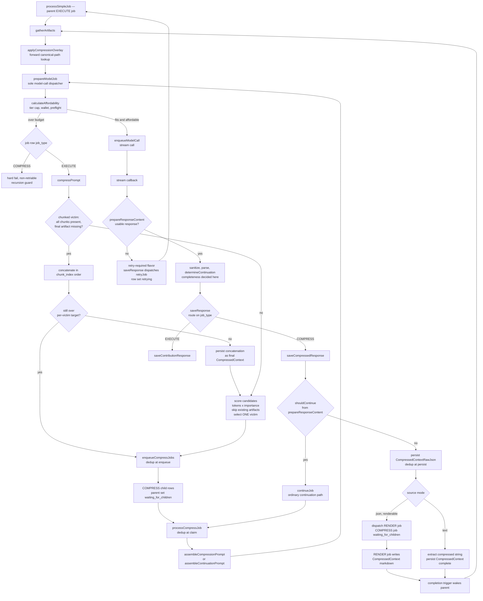

# Plan: Compression Jobs (Scope & Order)

## TARGET ARCHITECTURE — end-to-end flow for an oversized model input

* Parent EXECUTE job: `processSimpleJob` → `gatherArtifacts` (already-compressed victims are
  overlaid via `applyCompressionOverlay`) → `prepareModelJob` counts tokens and asks
  `calculateAffordability`. Fits and affordable → enqueue the stream call, done.
* Over budget → `prepareModelJob` branches on the job row's `job_type`; an EXECUTE job calls
  `compressPrompt`: score candidates (resource documents + the compressible history window) by
  `tokens × (1 − relevanceWeight)`; exclude candidates whose `CompressedContext` artifact for THIS
  compression target already exists; select the ONE victim with the lowest score.
* `enqueueCompressJobs`: dedup at enqueue — skip if the canonical artifact exists. Contribution
  victims resolve their completed source JSON and take `mode:'json'`; feedback and history victims
  take `mode:'text'`. Victim plus prompt envelope fits the window → ONE COMPRESS child; else split →
  N chunk children. The caller sets the parent `status='waiting_for_children'` and returns a pending
  SUCCESS; the existing DB completion trigger wakes it. Deferral is success, not error.
* `processCompressJob` per child: validate the payload; dedup at claim — re-check the canonical
  artifact and complete without spending if it appeared; assemble via `assembleCompressionPrompt`, or
  `assembleContinuationPrompt` when the payload carries a continuation count; call `prepareModelJob`
  with that prompt and the parent's model. The dispatcher's `job_type` branch is the recursion guard:
  a COMPRESS job over budget hard-fails rather than compressing. Nothing names an artifact type at
  dispatch.
* The stream callback returns → the shared front half runs before any routing.
  `prepareResponseContent` sanitizes, parses, reports a retry-required outcome on malformed or empty
  output, and decides completeness against the source via `determineContinuation`, the repo's only
  call; the orchestrator dispatches the retry on that outcome. `saveResponse` then routes on the job
  row's `job_type`, and the COMPRESS arm CONSUMES that completeness verdict rather than computing
  one — incomplete continues through the ordinary continuation path
  and is not a failure. On a complete result persist `CompressedContextRawJson` at the canonical
  `_work/raw_responses` path, idempotently (dedup at persist). A renderable json-mode source
  dispatches a RENDER job and sets the COMPRESS job `waiting_for_children`; a text-mode source has
  the compressed string extracted and persisted as `CompressedContext`, dispatches no RENDER job, and
  completes. `saveResponse` holds no renderer dependency and sends no notification.
* Parent resumes. `compressPrompt` reduce check: a chunked victim with all chunk artifacts but no
  final artifact concatenates in `chunk_index` order; still over the per-victim target → ONE
  re-compress child and pause again; else persist the concatenation as the victim's final artifact.
  External model call = async job; a transform such as rendering is also a job; only an internal
  DB or storage call is synchronous.
* `gatherArtifacts` → `applyCompressionOverlay` swaps victim content — resource documents AND history
  messages — with the persisted `CompressedContext`, preserving identity. Lookup is FORWARD: each
  candidate carries its own identity, so the overlay builds that candidate's canonical path with
  `constructStoragePath` and does one existence read. Nothing is reverse-parsed from a stored path.
* Recount. Still over → next victim. Fits → enqueue the real stream call.

**Key reuse:** `parent_job_id`, `waiting_for_children` and the completion trigger are existing
infrastructure. The entire model-call transport is the production stream path; COMPRESS adds a
routing case, not a transport.

## COMMIT MAP

Each workstream terminates at a seam where the application builds, runs and passes tests, and that
seam is its commit. Transient non-compilable states are permitted WITHIN a workstream and never
across a seam. Workstreams are addressed by name and by what they depend on, never by ordinal.

| Workstream | Depends on | Commit seam (app builds + runs + tests green) |
|---|---|---|
| Payload, transport & provenance | nothing in the compression machinery | every job payload inherits one base with one guard family; arms are selected by the job row's column and narrowed inside the arm; the prompt's resource id is recorded in one column on both artifact tables |
| saveResponse decomposition | Payload, transport & provenance | `retryJob` canonical and surfacing both its failures; `saveResponse` is a thin orchestrator over the modules it routes to, each holding only the collaborators its own branches invoke. `netlifyResponse/index.ts` is the composition root for every module the orchestrator routes to and assembles each one's deps itself; a COMPRESS response persists, continues when incomplete, dispatches its render for a renderable source and writes its extracted artifact for a text source |
| Compression cutover | saveResponse decomposition | compression loop live; one function dispatches every model call, so one tier cap, one wallet read and one affordability preflight govern compression and contribution alike; RAG core gone; every deps object in the worker assembled at its boundary by the context factory, which produces nothing for a function outside that process; every production tokenizer real; full-chain test green |

---

## PAYLOAD, TRANSPORT & PROVENANCE (depends on nothing in the compression machinery)

Every job payload inherits `DialecticBaseJobPayload`, validated by one guard family: the base guard
holds the base member checks and the base allowed-key set, and each arm's guard delegates to it and
declares only its own members. Guards throw a per-member diagnostic rather than returning `false`,
so no branch is ever selected by one. Where a job row is in hand, the arm is selected by the
`job_type` column and the payload guard narrows inside it; where no row exists, or where two arms
share one `job_type`, the arm is selected by a named non-throwing structural predicate owned by the
payload's own module. A selection predicate answers a question and returns a boolean; a guard proves
a type and throws, and the two are never the same symbol.

A payload redeclares a base member only to narrow an optional base member to required on the arm
that requires it; it never redeclares one to change its type or to restate it unchanged. No payload
carries a fact the job row already owns — the job's type is the row's column and the owner is the
row's `user_id`. What a payload does carry is `user_jwt`, which moves a call across the gateway and
is derivable from nothing else.

`preflight_input_tokens`, `document_key` and `context_for_documents` are members of
`DialecticBaseJobPayload`, optional on all arms, because the object must be initialized and handled
before any of the three holds a value. `preflight_input_tokens` is written onto the job payload by
`enqueueModelCall`, in the update that sets `status: 'queued'`, from the count the dispatcher
computed for the affordability preflight; a reader that needs the count and does not find it returns
its error arm, and no reader supplies a default. `document_key` is a `FileType`, so no
consumer re-narrows it and no reader reaches it through a property descriptor.

continueJob is lifted into its own module and provided its full support system. The function is made compliant to the repo standard and all callers are updated to call the corrected file. 

The prompt's resource id is written once onto the job row's own
payload and recorded in one column of one name on both artifact tables. Every function this
workstream touches returns a discriminated `Success | Error` union, except `processRenderJob`, whose
outcome contract closes in the cutover alongside the runner that reads it.

Strict node order: `enqueueCompressJobs` → `enqueueRenderJob` → `processRenderJob` →
provenance migration → `file_manager` → `buildUploadContext` →
`prompt-assembler` → `assembleContinuationPrompt` → `continueJob`. The payload family lands first
because every guard and consumer below reads it, and because the guards it makes throwing are what
force the selector nodes that follow; the migration precedes the type that carries its column, and
the type precedes the arm that sets it.

* `supabase/functions/dialectic-worker/enqueueCompressJobs/enqueueCompressJobs.ts` — the payload
  family's landing node.
* `supabase/functions/dialectic-worker/enqueueRenderJob/enqueueRenderJob.ts`
* `supabase/functions/dialectic-worker/processRenderJob.ts`
* `supabase/migrations/<ts>_compression_prompt_provenance.sql`
* `supabase/functions/_shared/services/file_manager.ts`
* `supabase/functions/_shared/utils/buildUploadContext/buildUploadContext.ts`
* `supabase/functions/_shared/prompt-assembler/prompt-assembler.ts`
* `supabase/functions/_shared/prompt-assembler/assembleContinuationPrompt/assembleContinuationPrompt.ts`
* `supabase/functions/dialectic-worker/continueJob/continueJob.ts`
* **COMMIT**

---

## saveResponse DECOMPOSITION (depends on Payload, transport & provenance)

`saveResponse.ts` becomes a thin orchestrator over function-folder modules, not one body carrying
every responsibility in a straight line. The COMPRESS tail is a module beside the contribution one
rather than a branch inside it, so the two persistence models are never interleaved.

The cut follows the axis the data flow already has. A shared front half — job and provider
resolution, response assembly, debit, content preparation — serves both arms. Job and provider
resolution, response assembly and debit are job-type agnostic; content preparation reads arm
members, so the arm is selected and its payload proven before it runs.
The debit precedes content preparation because the spend it records precedes everything the
function can still decide, and because `saveResponse` runs on the stream callback, where the money
is already gone. The assistant message records the raw assembled content: the spend is real whether
or not the response is usable, and the application does not subsidize an incomplete model response. A contribution back half — canonical identity, upload, relationship persistence,
render dispatch, notifications, continuation, final status — is anchored on `dialectic_contributions`
end to end and is what a COMPRESS response has no use for.

`netlifyResponse/index.ts` is the composition root for this function and the single assembler of its
graph. `saveResponse` runs in the `netlifyResponse` process, on the stream callback, so its graph is
that function's graph; a factory inside `dialectic-worker` producing deps for a separate Edge
Function is a layer violation, and the worker's context factory therefore assembles nothing here.
Each module is bound at that root into a `Bound<Module>Fn`, and a composing module receives bound closures, never another module's deps to pass down. An orchestrator that receives one wide deps object and hands each sub-module
a subset of it is prop drilling and a second assembler; it also carries the monolith's coupling forward under the name of narrowing.

A module's deps are exactly the collaborators its `interaction.spec` branches invoke, checked against
that spec. A member no branch invokes is inherited coupling and is removed. `dbClient` is a
per-invocation param, never a dep.

Params carry only what the payload cannot: the `dbClient` handle, `job_id`, rows fetched this
invocation, and values an earlier module produced this invocation. The payload is the job payload,
whole, and each module reads what it needs from it at the point of use — no payload member is ever
hoisted into params. The orchestrator selects the arm on the job row's `job_type` column and proves
the payload once with that arm's guard; every module below receives the proven object and re-guards
nothing. A payload slot is typed at the level its module reads: `DialecticBaseJobPayload` for a
module that reads base members, the arm type for a module that reads arm members. No function slot
is typed `DialecticJobPayload` — that union types the job row's column, the only place an arm is
still undetermined.

| Module | Deps | Params | Payload |
|---|---|---|---|
| `retryJob` | `logger`, `notificationService` | `dbClient`, job row | the failed attempts |
| `assembleAiResponse` | bound `countTokens` | `processingTimeMs`, model config, the stream result | `DialecticBaseJobPayload` |
| `loadJobContext` | — | `dbClient`, `job_id` | `{}` |
| `prepareResponseContent` | `logger`, `resolveFinishReason`, `isIntermediateChunk`, `sanitizeJsonContent`, `determineContinuation` | `job_id`, and the continuation inputs each arm derives from its own proven payload | the assembled response |
| `debitForResponse` | bound `debitTokens` | `dbClient`, job row, provider row, model config, the assembled response | `DialecticBaseJobPayload` |
| `resolveContributionIdentity` | `logger` | `dbClient`, job row, provider row | `DialecticExecuteJobPayload` |
| `persistContributionRelationships` | — | `dbClient`, job row, the contribution | `DialecticExecuteJobPayload` |
| `finalizeContributionJob` | `logger`, `notificationService`, `fileManager`, bound `continueJob`, bound `enqueueRenderJob` | `dbClient`, job row, the contribution, the assembled response, the prepared content result, the storage file type | `DialecticExecuteJobPayload` |
| `saveContributionResponse` | `fileManager`, `buildUploadContext`, bound `resolveContributionIdentity`, bound `persistContributionRelationships`, bound `finalizeContributionJob` | `dbClient`, job row, provider row, model config, the assembled response, the prepared content result | `DialecticExecuteJobPayload` |
| `saveCompressedResponse` | `fileManager`, `buildUploadContext`, bound `enqueueRenderJob` | `dbClient`, job row, provider row, the assembled response, the prepared content result | `DialecticCompressJobPayload` |
| `saveResponse` | `logger`, bound `retryJob`, bound `loadJobContext`, bound `assembleAiResponse`, bound `debitForResponse`, bound `prepareResponseContent`, bound `saveContributionResponse`, bound `saveCompressedResponse` | `dbClient`, `job_id` | the stream result |

`resolveContributionIdentity` returns only what it derives — the assembled `restOfCanonicalPathParams`,
`storageFileType`, `sourceGroupFragment`, `isContinuationForStorage`, `targetContributionId` and
`description`. It re-emits no payload member; a consumer needing `document_key`, `contributionType`,
`stageSlug` or `document_relationships` reads it from the payload.

The payload is the payload, you DO NOT FUCK WITH THE GOD DAMNED PAYLOAD. You determine the payload type from job_type and prove it with the guard. You READ FROM THE PAYLOAD WHAT YOU NEED TO DO YOUR WORK. Then you PASS THE PAYLOAD ALONG WITHOUT FUCKING WITH IT! 

There are VERY FEW reasons to mutate the payload, and every mutation reason is ALREADY ESTABLISHED IN THE CODE. You DO NOT remove mutations unless you can Chesterton's Fence them and get approval. You do NOT ADD mutations. YOU DO NOT pack the payload into params, or wrap the payload into the payload again. TAKE IT, READ IT, PASS IT ALONG! 

`SaveResponseDeps` is shrunk to the actual deps for the orchestrator, and none of the deps for the extracted functions. 

Every failure a module observes is RETURNED on its error arm — propagated unchanged
when its producer already typed it, and as a new typed error the module owns when the failure is its
own — and execution stops at the failure. A module that logs an error and continues is defective
however the monolith behaved.

Modules land as copies with their own tests while `saveResponse.ts` stays untouched, and the single
refactoring node at the end removes the functions that were extracted and replaces them with calls to the extracted functions. The existing test suites are the 
regression oracle, pinned to the unchanged public signature, then retained IN FULL as the
orchestrator's integration tier. The suites are renamed to integration tests and no case is deleted. The repo does compiles continually because the decomposition does not touch the existing implementation until all collaborators can be called; every module is authored and tested against its own copy.

`retryJob` mutates job lifecycle state — it sets the row `retrying`, advances `attempt_count` from
the row's own value to that value plus one, writes `error_details` and notifies. Advancing the count
is the executor's job, never the caller's: no caller computes an attempt number, and `RetryJobParams`
carries no slot for one. No branch of preparing a response's content invokes it. Every retry
condition resolves instead to ONE retry-required success flavor carrying the condition's
reason and no content members, and the orchestrator — which holds the provider row — builds the
`FailedAttemptError[]` around that reason and dispatches. One retry call site in the workstream.

The orchestrator consumes `retryJob`'s return, and a producer precedes its consumer.
It lands as a new function-folder module at `dialectic-worker/retryJob/`, so the legacy
`dialectic-worker/retryJob.ts` is untouched here and every current consumer keeps compiling.
`netlifyResponse/index.ts` binds the canonical module when it assembles this graph; the worker root
is the last consumer to switch, and retires the legacy file in the cutover. Only the file retires —
the capability does not. A job queue that cannot retry is not a job queue.

Strict node order: `retryJob` → `assembleAiResponse` → `loadJobContext` → `prepareResponseContent` →
`debitForResponse` → `resolveContributionIdentity` → `persistContributionRelationships` →
`finalizeContributionJob` → `saveContributionResponse` → `saveCompressedResponse` → `saveResponse` →
`netlifyResponse/index.ts`. This is the authoring order — producers before consumers — and it is not
the order the orchestrator calls them in at runtime. `debitForResponse` and `prepareResponseContent`
depend on neither each other nor each other's output, which is what lets the debit run first at
runtime while either may be authored first. The shared modules precede both arms; the contribution modules precede the
arm that composes them; both arms precede the orchestrator that routes to them; and
`netlifyResponse/index.ts` closes the seam because it consumes every module above and a consumer
follows its producers. It is the sole assembler of that graph: it binds each module's deps itself, in
one place, so the graph is constructed once, in one shape. It gains each module as that module lands
and reaches its final shape when the last of them is authored.

* `supabase/functions/dialectic-worker/retryJob/retryJob.ts`
* `supabase/functions/dialectic-worker/assembleAiResponse/assembleAiResponse.ts`
* `supabase/functions/dialectic-worker/loadJobContext/loadJobContext.ts`
* `supabase/functions/dialectic-worker/prepareResponseContent/prepareResponseContent.ts`
* `supabase/functions/dialectic-worker/debitForResponse/debitForResponse.ts`
* `supabase/functions/dialectic-worker/resolveContributionIdentity/resolveContributionIdentity.ts`
* `supabase/functions/dialectic-worker/persistContributionRelationships/persistContributionRelationships.ts`
* `supabase/functions/dialectic-worker/finalizeContributionJob/finalizeContributionJob.ts`
* `supabase/functions/dialectic-worker/saveContributionResponse/saveContributionResponse.ts`
* `supabase/functions/dialectic-worker/saveCompressedResponse/saveCompressedResponse.ts`
* `supabase/functions/dialectic-worker/saveResponse.ts` — the relocation node.
* `supabase/functions/netlifyResponse/index.ts` — the composition root for this process; binds the
  deps of every module above.
* **COMMIT**

---

## COMPRESSION CUTOVER (depends on saveResponse decomposition)

The machinery lands in its final, embedding-free form, together with everything that binds it and
everything that consumes it, because a contract and its composition root cannot straddle a seam and
neither can a contract and its call sites. One function dispatches every model call, so every model
call resolves the same tier cap, reads the same wallet balance and passes the same affordability
preflight, and the recursion guard is a branch on the job row's own column rather than a withheld
collaborator.

Victim selection becomes pure computation — `candidateTokens × importance`, sorted ascending, lowest
first — with no embeddings anywhere. The pluggable-strategy seam retires with the retrieval it
existed to make swappable; what survives is the scorer itself, under a contract carrying no
`embeddingClient`, no `dbClient` and no `currentUserPrompt`. There is no correct intermediate
contract for it, so its contract and its body land together in one node, and so do
`compressPrompt`'s. Every live reference into the RAG core is severed by those two nodes, so the
deletions close this workstream rather than trailing it.

Every deps object in the WORKER is assembled at its boundary by the context factory. No call site
inside the worker constructs one inline: for that process the factory is the single assembler, the
worker root supplies unbound implementations to it, and the graph is constructed once, in one shape.
The factory's reach stops at the worker process. `netlifyResponse` is a separate function and
assembles its own graph, per the workstream above, so the factory produces nothing for it:
`createSaveResponseContext` and `ISaveResponseContext` retire, and every member the context carries
solely for `saveResponse` — `continueJob`, `resolveFinishReason`, `isIntermediateChunk`,
`determineContinuation`, `buildUploadContext`, `sanitizeJsonContent`, `debitTokens` and
`computeJobSig` — leaves `IJobContext`, `JobContextParams` and the context guard with them.
`fileManager` and `retryJob` stay: worker code reads both. Params remain per-invocation and are constructed by the
caller, which is why the consumers holding params literals share this seam with the contracts they
name.

Retry becomes the runner's, once, for every job type. `handleJob` in `dialectic-worker/index.ts`
already claims the job and writes its terminal failure; it gains the branch between them —
`attempt_count < max_retries` dispatches `retryJob`, otherwise the row fails terminally — so the
`max_retries` and `attempt_count` columns govern PLAN, EXECUTE, RENDER and COMPRESS alike instead of
EXECUTE alone. No processor writes a terminal or retrying status: `processSimpleJob` loses its
`retryJob` call, its `failed` write and its `retry_loop_failed` write; `processComplexJob` loses its
six `failed` writes and keeps every `waiting_for_children`, `waiting_for_prerequisite` and
`completed` write, those being a planner's own outcomes rather than a failure verdict;
`processRenderJob` loses its two `failed` writes; and `processJob` stops writing `failed` for its
COMPRESS arm. Each reports its outcome on a `Success | Error` return, so `IJobProcessors` carries one
outcome shape and the runner reads a value instead of catching a throw. 

Dispatching a retry means constructing its payload, and the runner cannot construct the one it has.
`RetryJobPayload.failedAttempts` is a non-empty `FailedAttemptError[]` whose every element carries a
required `api_identifier`; the runner's present `failedAttempts: []` fails `isRetryJobPayload` on the
emptiness check alone, and `api_identifier` lives on the provider row, not the job row. So `handleJob`
resolves `ai_providers` from the job payload's `model_id` — a required member of
`DialecticBaseJobPayload`, and therefore present for every job type, planning and rendering included —
and builds a one-element array from that row, the model id and the failure's message. The provider
read happens on the failure path only. `RetryJobPayload` itself does not change: it is already landed
and already satisfied by the response process's dispatcher, which holds a provider row for reasons of
its own, and reopening a committed contract to spare one caller a query is the worse trade.

Every production tokenizer becomes real. A character-indexing encoder and a `text.length` token count
make a preflight read high and misclassify affordable requests as unaffordable; the epic does not ship
with known-broken token accounting at any site that produces a token count.

Strict node order: `applyCompressionOverlay` → `gatherArtifacts` → `vector_utils` →
`enqueueCompressJobs` → `compressPrompt` → `calculateAffordability` → `StreamChat` →
`streamRewind` → `streamRequest` → `chat/index.ts` → `retryJob` → `prepareModelJob` →
`processCompressJob` → `createJobContext` → `processSimpleJob` → `processComplexJob` →
`processRenderJob` → `processJob` → `dialectic-worker/index.ts` → RAG deletions → RAG-removal
migration. The overlay precedes
`gatherArtifacts` because that function injects it and constructs its params, and its literal
comparisons compile against the untightened type; `gatherArtifacts` is the sole producer of the
tightened `ResourceDocument.type` and lands it before any consumer assumes a conformant value; the
scorer and the enqueuer both precede the loop that invokes them; the loop precedes the dispatcher
that composes it; the dispatcher precedes its two callers; the canonical retry module precedes the
runner that becomes its sole dispatcher; the factory precedes every consumer that reads a member off
the context it assembles; the consumer chain then runs producers first, every processor before the
`processJob` that dispatches it; the worker root follows the chain it wires, because a root closes a graph rather than
opening one; and the deletions follow the severing of their last references. `StreamChat` and
`streamRewind` both narrow `CountTokensFn` to `BoundCountTokensFn`, eliminating their inline fake
tokenizer constructions; `streamRequest` is a pure pass-through that narrows its own
`StreamRequestDeps.countTokens` to match; `chat/index.ts` is the composition root where the real
`countTokens` is bound with real `CountTokensDeps` and the bound function is assigned to `ChatDeps`,
so the binding happens once at the top and every consumer below receives the bound version.

A node's position is fixed by the dependency graph, never by which test it carries. The full-chain
compression test rides the worker root, the node that closes the chain it exercises.

* `supabase/functions/dialectic-worker/applyCompressionOverlay/applyCompressionOverlay.ts`
* `supabase/functions/dialectic-worker/gatherArtifacts/gatherArtifacts.ts`
* `supabase/functions/_shared/utils/vector_utils.ts`
* `supabase/functions/dialectic-worker/enqueueCompressJobs/enqueueCompressJobs.ts`
* `supabase/functions/dialectic-worker/compressPrompt/compressPrompt.ts`
* `supabase/functions/dialectic-worker/calculateAffordability/calculateAffordability.ts`
* `supabase/functions/chat/streamChat/StreamChat.ts`
* `supabase/functions/chat/streamRewind/streamRewind.ts`
* `supabase/functions/chat/streamRequest/streamRequest.ts` — narrows
  `StreamRequestDeps.countTokens` from `CountTokensFn` to `BoundCountTokensFn`; pure pass-through,
  no implementation change.
* `supabase/functions/chat/index.ts` — the chat composition root; binds real `countTokens` with real
  `CountTokensDeps` and assigns the `BoundCountTokensFn` to `ChatDeps.countTokens`.
* `supabase/functions/dialectic-worker/retryJob/retryJob.ts`
* `supabase/functions/dialectic-worker/prepareModelJob/prepareModelJob.ts`
* `supabase/functions/dialectic-worker/processCompressJob/processCompressJob.ts`
* `supabase/functions/dialectic-worker/createJobContext/createJobContext.ts` — the single assembler
  of every deps object the WORKER constructs.
* `supabase/functions/dialectic-worker/processSimpleJob.ts` — supplies the dispatcher its narrowed
  params and payload, `gatherArtifacts` its two overlay params, narrows the dispatcher's return, and
  reports its outcome rather than writing a retrying, failed or terminal status.
* `supabase/functions/dialectic-worker/processComplexJob.ts` — reports its outcome rather than
  writing a failed status, keeping every deferral and completion write it owns.
* `supabase/functions/dialectic-worker/processRenderJob.ts` — returns a discriminated
  `Success | Error` union in place of `Promise<void>` and reports its outcome rather than writing a
  failed status, on its contribution arm and its compressed arm alike.
* `supabase/functions/dialectic-worker/processJob.ts` — stops constructing `ProcessCompressJobDeps`
  inline and stops writing a failed status for its COMPRESS arm.
* `supabase/functions/dialectic-worker/index.ts` — the root supplies unbound implementations and
  composes nothing; `handleJob` gains the retry branch between its claim and its terminal write and
  becomes the worker process's sole retry dispatcher; the root retires the legacy
  `dialectic-worker/retryJob.ts` and its suite as the last consumer to switch off it, and carries
  the full-chain compression integration test: real internals, only true external boundaries mocked,
  no repo-owned function mocked.
* **COMMIT**

## Remove RAG Machinery 

* DELETE `supabase/functions/_shared/services/rag_service.ts` and its support system.
* DELETE `supabase/functions/_shared/services/indexing_service.ts` and its support system, including
  `EmbeddingClient`.
* `supabase/migrations/<ts>_compression_jobs_remove_rag.sql` — drops `match_dialectic_chunks` and
  `dialectic_memory`.
* **COMMIT**
