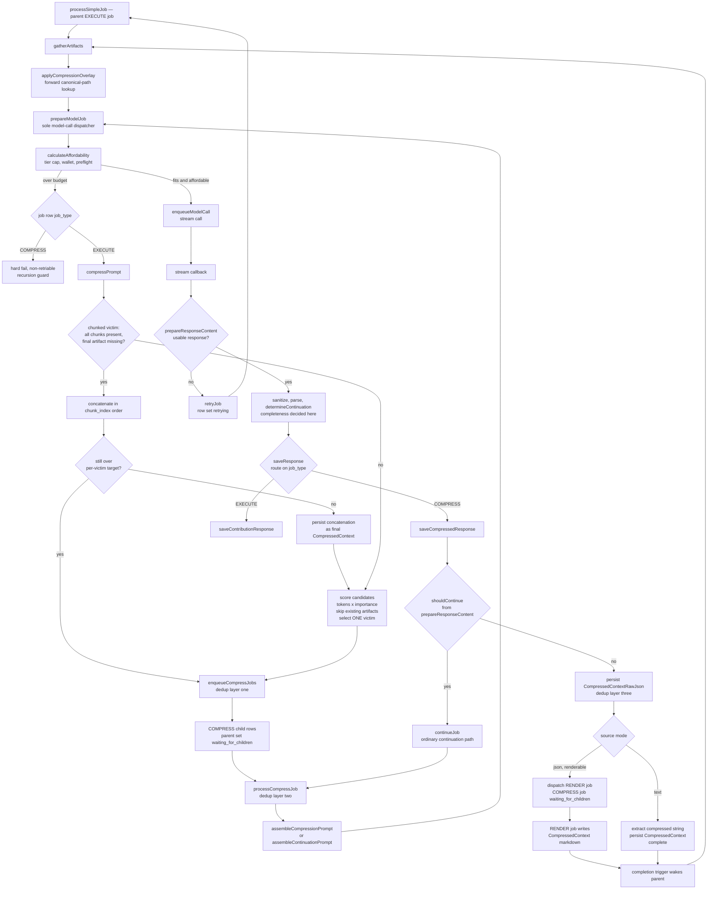

# Plan: Compression Jobs (Scope & Order)

## TARGET ARCHITECTURE — end-to-end flow for an oversized model input

* Parent EXECUTE job: `processSimpleJob` → `gatherArtifacts` (already-compressed victims are
  overlaid via `applyCompressionOverlay`) → `prepareModelJob` counts tokens and asks
  `calculateAffordability`. Fits and affordable → enqueue the stream call, done.
* Over budget → `prepareModelJob` branches on the job row's `job_type`; an EXECUTE job calls
  `compressPrompt`: score candidates (resource documents + the compressible history window) by
  `tokens × (1 − relevanceWeight)`; exclude candidates whose `CompressedContext` artifact for THIS
  compression target already exists; select the ONE victim with the lowest score.
* `enqueueCompressJobs`: dedup layer one — skip if the canonical artifact exists. Contribution
  victims resolve their completed source JSON and take `mode:'json'`; feedback and history victims
  take `mode:'text'`. Victim plus prompt envelope fits the window → ONE COMPRESS child; else split →
  N chunk children. The caller sets the parent `status='waiting_for_children'` and returns a pending
  SUCCESS; the existing DB completion trigger wakes it. Deferral is success, not error.
* `processCompressJob` per child: validate the payload; dedup layer two — re-check the canonical
  artifact and complete without spending if it appeared; assemble via `assembleCompressionPrompt`, or
  `assembleContinuationPrompt` when the payload carries a continuation count; call `prepareModelJob`
  with that prompt and the parent's model. The dispatcher's `job_type` branch is the recursion guard:
  a COMPRESS job over budget hard-fails rather than compressing. Nothing names an artifact type at
  dispatch.
* The stream callback returns → the shared front half runs before any routing.
  `prepareResponseContent` sanitizes, parses, reports a retry-required outcome on malformed or empty
  output, and decides completeness against the source via `determineContinuation`, the repo's only
  call; the orchestrator dispatches the retry on that outcome. `saveResponse` then routes on the job
  row's `job_type`, and the COMPRESS arm CONSUMES that completeness verdict rather than computing
  one — incomplete continues through the ordinary continuation path
  and is not a failure. On a complete result persist `CompressedContextRawJson` at the canonical
  `_work/raw_responses` path, idempotently (dedup layer three). A renderable json-mode source
  dispatches a RENDER job and sets the COMPRESS job `waiting_for_children`; a text-mode source has
  the compressed string extracted and persisted as `CompressedContext`, dispatches no RENDER job, and
  completes. `saveResponse` holds no renderer dependency and sends no notification.
* Parent resumes. `compressPrompt` reduce check: a chunked victim with all chunk artifacts but no
  final artifact concatenates in `chunk_index` order; still over the per-victim target → ONE
  re-compress child and pause again; else persist the concatenation as the victim's final artifact.
  External model call = async job; a transform such as rendering is also a job; only an internal
  DB or storage call is synchronous.
* `gatherArtifacts` → `applyCompressionOverlay` swaps victim content — resource documents AND history
  messages — with the persisted `CompressedContext`, preserving identity. Lookup is FORWARD: each
  candidate carries its own identity, so the overlay builds that candidate's canonical path with
  `constructStoragePath` and does one existence read. Nothing is reverse-parsed from a stored path.
* Recount. Still over → next victim. Fits → enqueue the real stream call.

**Key reuse:** `parent_job_id`, `waiting_for_children` and the completion trigger are existing
infrastructure. The entire model-call transport is the production stream path; COMPRESS adds a
routing case, not a transport.

## COMMIT MAP

Each workstream terminates at a seam where the application builds, runs and passes tests, and that
seam is its commit. Transient non-compilable states are permitted WITHIN a workstream and never
across a seam. Workstreams are addressed by name and by what they depend on, never by ordinal.

| Workstream | Depends on | Commit seam (app builds + runs + tests green) |
|---|---|---|
| Payload, transport & provenance | nothing in the compression machinery | every job payload inherits one base with one guard family; arms are selected by the job row's column and narrowed inside the arm; the prompt's resource id is recorded in one column on both artifact tables |
| saveResponse decomposition | Payload, transport & provenance | `retryJob` canonical and surfacing both its failures; `saveResponse` is a thin orchestrator over the modules it routes to, each holding only the collaborators its own branches invoke. Each element of the decomposition is built by the deps factory in `dialectic-worker` and supplied in the worker's handler; `netlifyResponse` does not bind any deps for decomposed collaborators; a COMPRESS response persists, continues when incomplete, dispatches its render for a renderable source and writes its extracted artifact for a text source |
| Compression cutover | saveResponse decomposition | compression loop live; one function dispatches every model call, so one tier cap, one wallet read and one affordability preflight govern compression and contribution alike; RAG core gone; every deps object assembled at the boundary by the context factory; every production tokenizer real; full-chain test green |

Every file in this epic takes exactly ONE node. A file whose contract and whose consumers would
otherwise straddle a seam is placed in the seam that closes both.

---

## PAYLOAD, TRANSPORT & PROVENANCE (depends on nothing in the compression machinery)

Every job payload inherits `DialecticBaseJobPayload`, validated by one guard family: the base guard
holds the base member checks and the base allowed-key set, and each arm's guard delegates to it and
declares only its own members. Guards throw a per-member diagnostic rather than returning `false`,
so no branch is ever selected by one. Where a job row is in hand, the arm is selected by the
`job_type` column and the payload guard narrows inside it; where no row exists, or where two arms
share one `job_type`, the arm is selected by a named non-throwing structural predicate owned by the
payload's own module. A selection predicate answers a question and returns a boolean; a guard proves
a type and throws, and the two are never the same symbol.

No payload redeclares a base member, and no payload carries a fact the job row already owns — the
job's type is the row's column and the owner is the row's `user_id`. What a payload does carry is
`user_jwt`, which moves a call across the gateway and is derivable from nothing else.

continueJob is lifted into its own module and provided its full support system. The function is made compliant to the repo standard and all callers are updated to call the corrected file. 

The prompt's resource id is written once onto the job row's own
payload and recorded in one column of one name on both artifact tables. Every function this
workstream touches returns a discriminated `Success | Error` union.

Strict node order: `enqueueCompressJobs` → `enqueueRenderJob` → `processRenderJob` →
provenance migration → `file_manager` → `buildUploadContext` →
`prompt-assembler` → `assembleContinuationPrompt` → `continueJob`. The payload family lands first
because every guard and consumer below reads it, and because the guards it makes throwing are what
force the selector nodes that follow; the migration precedes the type that carries its column, and
the type precedes the arm that sets it.

* `supabase/functions/dialectic-worker/enqueueCompressJobs/enqueueCompressJobs.ts` — the payload
  family's landing node.
* `supabase/functions/dialectic-worker/enqueueRenderJob/enqueueRenderJob.ts`
* `supabase/functions/dialectic-worker/processRenderJob.ts`
* `supabase/migrations/<ts>_compression_prompt_provenance.sql`
* `supabase/functions/_shared/services/file_manager.ts`
* `supabase/functions/_shared/utils/buildUploadContext/buildUploadContext.ts`
* `supabase/functions/_shared/prompt-assembler/prompt-assembler.ts`
* `supabase/functions/_shared/prompt-assembler/assembleContinuationPrompt/assembleContinuationPrompt.ts`
* `supabase/functions/dialectic-worker/continueJob/continueJob.ts`
* **COMMIT**

---

## saveResponse DECOMPOSITION (depends on Payload, transport & provenance)

`saveResponse.ts` becomes a thin orchestrator over function-folder modules, not one body carrying
every responsibility in a straight line. The COMPRESS tail is a module beside the contribution one
rather than a branch inside it, so the two persistence models are never interleaved.

The cut follows the axis the data flow already has. A shared front half — job and provider
resolution, response assembly, debit, content preparation — is job-type agnostic and serves both
arms; the debit precedes content preparation because the spend it records precedes everything the
function can still decide, and because `saveResponse` runs on the stream callback, where the money
is already gone. A contribution back half — canonical identity, upload, relationship persistence,
render dispatch, notifications, continuation, final status — is anchored on `dialectic_contributions`
end to end and is what a COMPRESS response has no use for.

`dialectic-worker/index.ts` is the composition root for this function. Each module is bound in the factory into a `Bound<Module>Fn`, and a composing module receives bound closures, never another module's deps to pass down. An orchestrator that receives one wide deps object and hands each sub-module
a subset of it is prop drilling and a second assembler; it also carries the monolith's coupling forward under the name of narrowing.

A module's deps are exactly the collaborators its `interaction.spec` branches invoke, checked against
that spec. A member no branch invokes is inherited coupling and is removed. `dbClient` is a
per-invocation param, never a dep.

| Module | Deps | Params carry |
|---|---|---|
| `retryJob` | `logger`, `notificationService` | `dbClient`, job row, attempt, failed attempts, owner id |
| `assembleAiResponse` | — | `processingTimeMs`, `preflightInputTokens` |
| `loadJobContext` | — | `dbClient` |
| `prepareResponseContent` | `logger`, `resolveFinishReason`, `isIntermediateChunk`, `sanitizeJsonContent`, `determineContinuation` | `continueUntilComplete`, `documentKey`, `contextForDocuments`, `sourceObject` |
| `debitForResponse` | `debitTokens` | `dbClient`, wallet id, provider row, model config, owner id |
| `resolveContributionIdentity` | `logger` | `dbClient`, job row, provider row |
| `persistContributionRelationships` | — | `dbClient`, contribution, stage slug |
| `finalizeContributionJob` | `logger`, `notificationService`, `fileManager`, `continueJob`, `enqueueRenderJob` | `dbClient`, job row, contribution, owner id |
| `saveContributionResponse` | `fileManager`, `buildUploadContext`, bound `resolveContributionIdentity`, bound `persistContributionRelationships`, bound `finalizeContributionJob` | `dbClient`, resolved context |
| `saveCompressedResponse` | `fileManager`, `buildUploadContext`, `enqueueRenderJob` | `dbClient`, narrowed payload |
| `saveResponse` | `logger`, `retryJob`, bound `loadJobContext`, bound `assembleAiResponse`, bound `debitForResponse`, bound `prepareResponseContent`, bound `saveContributionResponse`, bound `saveCompressedResponse` | `dbClient`, `job_id` |

`SaveResponseDeps` is shrunk to the actual deps for the orchestrator, and none of the deps for the extracted functions. 

Every failure a module observes is RETURNED on its error arm — propagated unchanged
when its producer already typed it, and as a new typed error the module owns when the failure is its
own — and execution stops at the failure. A module that logs an error and continues is defective
however the monolith behaved.

Modules land as copies with their own tests while `saveResponse.ts` stays untouched, and the single
refactoring node at the end removes the functions that were extracted and replaces them with calls to the extracted functions. The existing test suites are the 
regression oracle, pinned to the unchanged public signature, then retained IN FULL as the
orchestrator's integration tier. The suites are renamed to integration tests and no case is deleted. The repo does compiles continually because the decomposition does not touch the existing implementation until all collaborators can be called; every module is authored and tested against its own copy.

`retryJob` mutates job lifecycle state — it sets the row `retrying`, advances `attempt_count`, writes
`error_details` and notifies. No branch of preparing a response's content invokes it. Every retry
condition resolves instead to ONE retry-required success flavor carrying the condition's
reason and no content members, and the orchestrator — which holds the provider row — builds the
`FailedAttemptError[]` around that reason and dispatches. One retry call site in the workstream.

The orchestrator consumes `retryJob`'s return, and a producer precedes its consumer.
It lands as a new function-folder module at `dialectic-worker/retryJob/`, so the legacy
`dialectic-worker/retryJob.ts` is untouched here and every current consumer keeps compiling. That
legacy file is retired by the last consumer to switch, in the cutover.

Strict node order: `retryJob` → `assembleAiResponse` → `loadJobContext` → `prepareResponseContent` →
`debitForResponse` → `resolveContributionIdentity` → `persistContributionRelationships` →
`finalizeContributionJob` → `saveContributionResponse` → `saveCompressedResponse` → `saveResponse` →
`netlifyResponse/index.ts`. The shared modules precede both arms; the contribution modules precede the
arm that composes them; both arms precede the orchestrator that routes to them; and
`netlifyResponse/index.ts` closes the seam because it is the root that binds every module in this
workstream and is the only file that can retire the inline literal it builds today. The worker root is not touched here:
`saveResponse` does not run in the worker, and the worker's factory does not reach its final shape
until the cutover.

* `supabase/functions/dialectic-worker/retryJob/retryJob.ts`
* `supabase/functions/dialectic-worker/assembleAiResponse/assembleAiResponse.ts`
* `supabase/functions/dialectic-worker/loadJobContext/loadJobContext.ts`
* `supabase/functions/dialectic-worker/prepareResponseContent/prepareResponseContent.ts`
* `supabase/functions/dialectic-worker/debitForResponse/debitForResponse.ts`
* `supabase/functions/dialectic-worker/resolveContributionIdentity/resolveContributionIdentity.ts`
* `supabase/functions/dialectic-worker/persistContributionRelationships/persistContributionRelationships.ts`
* `supabase/functions/dialectic-worker/finalizeContributionJob/finalizeContributionJob.ts`
* `supabase/functions/dialectic-worker/saveContributionResponse/saveContributionResponse.ts`
* `supabase/functions/dialectic-worker/saveCompressedResponse/saveCompressedResponse.ts`
* `supabase/functions/dialectic-worker/saveResponse.ts` — the relocation node.
* `supabase/functions/netlifyResponse/index.ts` — the root binds every module above into its
  `Bound<Module>Fn` and stops building a wide deps literal for the orchestrator to subset.
* **COMMIT**

---

## COMPRESSION CUTOVER (depends on saveResponse decomposition)

The machinery lands in its final, embedding-free form, together with everything that binds it and
everything that consumes it, because a contract and its composition root cannot straddle a seam and
neither can a contract and its call sites. One function dispatches every model call, so every model
call resolves the same tier cap, reads the same wallet balance and passes the same affordability
preflight, and the recursion guard is a branch on the job row's own column rather than a withheld
collaborator.

Victim selection becomes pure computation — `candidateTokens × importance`, sorted ascending, lowest
first — with no embeddings anywhere. The pluggable-strategy seam retires with the retrieval it
existed to make swappable; what survives is the scorer itself, under a contract carrying no
`embeddingClient`, no `dbClient` and no `currentUserPrompt`. There is no correct intermediate
contract for it, so its contract and its body land together in one node, and so do
`compressPrompt`'s. Every live reference into the RAG core is severed by those two nodes, so the
deletions close this workstream rather than trailing it.

Every deps object in the WORKER is assembled at its boundary by the context factory. No call site
inside the worker constructs one inline: for that process the factory is the single assembler, the
worker root supplies unbound implementations to it, and the graph is constructed once, in one shape.
The factory's reach is its own process — `netlifyResponse` is a separate function and assembles at
its own root, per the workstream above. Params remain per-invocation and are constructed by the
caller, which is why the consumers holding params literals share this seam with the contracts they
name.

Every production tokenizer becomes real. A character-indexing encoder and a `text.length` token count
make a preflight read high and misclassify affordable requests as unaffordable; the epic does not ship
with known-broken token accounting at any of the three sites.

Strict node order: `applyCompressionOverlay` → `gatherArtifacts` → `vector_utils` → `compressPrompt`
→ `calculateAffordability` → `StreamChat` → `streamRewind` → `prepareModelJob` → `processCompressJob`
→ `createJobContext` → `processSimpleJob` → `processJob` → `dialectic-worker/index.ts` → RAG
deletions → RAG-removal migration. The overlay precedes `gatherArtifacts` because that function
injects it and constructs its params, and its literal comparisons compile against the untightened
type; `gatherArtifacts` is the sole producer of the tightened `ResourceDocument.type` and lands it
before any consumer assumes a conformant value; the scorer precedes the loop that invokes it; the loop
precedes the dispatcher that composes it; the dispatcher precedes its two callers; the factory
precedes every consumer that reads a member off the context it assembles; the consumer chain then runs
producers first, `processSimpleJob` before `processJob`; the worker root follows the chain it wires,
because a root closes a graph rather than opening one; and the deletions follow the severing of their
last references.

A node's position is fixed by the dependency graph, never by which test it carries. The full-chain
compression test rides the worker root, the node that closes the chain it exercises.

* `supabase/functions/dialectic-worker/applyCompressionOverlay/applyCompressionOverlay.ts`
* `supabase/functions/dialectic-worker/gatherArtifacts/gatherArtifacts.ts`
* `supabase/functions/_shared/utils/vector_utils.ts`
* `supabase/functions/dialectic-worker/compressPrompt/compressPrompt.ts`
* `supabase/functions/dialectic-worker/calculateAffordability/calculateAffordability.ts`
* `supabase/functions/chat/streamChat/StreamChat.ts`
* `supabase/functions/chat/streamRewind/streamRewind.ts`
* `supabase/functions/dialectic-worker/prepareModelJob/prepareModelJob.ts`
* `supabase/functions/dialectic-worker/processCompressJob/processCompressJob.ts`
* `supabase/functions/dialectic-worker/createJobContext/createJobContext.ts` — the single assembler
  of every deps object the WORKER constructs.
* `supabase/functions/dialectic-worker/processSimpleJob.ts` — supplies the dispatcher its narrowed
  params and payload, `gatherArtifacts` its two overlay params, and narrows the dispatcher's and the
  retry dispatcher's returns.
* `supabase/functions/dialectic-worker/processJob.ts` — stops constructing `ProcessCompressJobDeps`
  inline.
* `supabase/functions/dialectic-worker/index.ts` — the root supplies unbound implementations and
  composes nothing, retires the legacy `dialectic-worker/retryJob.ts` and its suite as the last
  consumer to switch off it, and carries the full-chain compression integration test: real internals,
  only true external boundaries mocked, no repo-owned function mocked.
* **COMMIT**

## Remove RAG Machinery 

* DELETE `supabase/functions/_shared/services/rag_service.ts` and its support system.
* DELETE `supabase/functions/_shared/services/indexing_service.ts` and its support system, including
  `EmbeddingClient`.
* `supabase/migrations/<ts>_compression_jobs_remove_rag.sql` — drops `match_dialectic_chunks` and
  `dialectic_memory`.
* **COMMIT**
