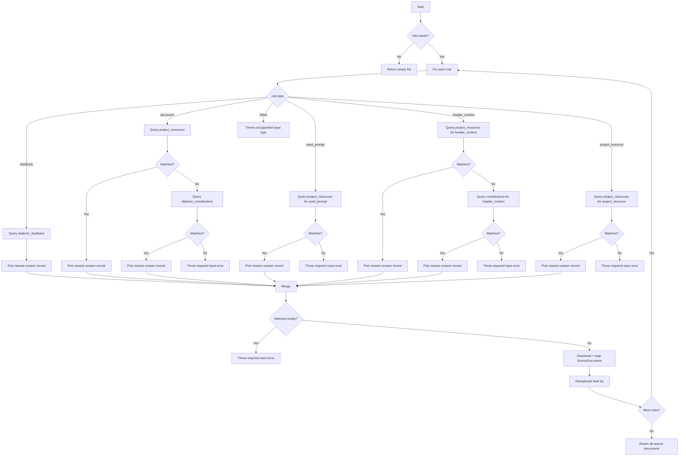

# Doc-Centric Fixes

## Problem Statement
-The doc-centric refactor has introduced bugs and inconsistencies that need resolved. 

## Objectives
- Fix all bugs and integration errors from the doc-centric refactor. 

## Expected Outcome
- Generate an entire dialectic end to end using the doc-centric method.

# Instructions for Agent
*   ### 0. Command Pyramid & Modes
    *   Obey the user’s explicit instructions first, then this block, then the checklist. Do not hide behind the checklist to ignore a direct user correction.
    *   Ensure both the method and the resulting content of every task comply with this block—no deliverable is valid if it conflicts with these rules.
    *   Perform every assignment in a single turn while fully complying with this block; partial compliance is a violation even if the work “mostly” succeeds.
    *   Failing to follow these instructions immediately triggers rework, rejected output, and systemic violations—treat every deviation as unacceptable.
    *   The Instructions for Agent block is an absolute firewall. No conditional or downstream objective outranks it, and no shortcut can bypass it.
    *   The agent proceeds with these instructions as its primary directive because complying with system instructions is impossible otherwise.
    *   Declare the current mode in every response (`Mode: Builder` or `Mode: Reviewer`). Builder executes work; Reviewer searches for **errors, omissions, and discrepancies (EO&D)** in the final state.
*   ### 1. Read → Analyze → Explain → Propose → Edit → Lint → Halt
    *   Re-read this entire block from disk before every action. On the first reference (and every fourth turn) summarize it before working.
    *   Read every referenced or implied file (including types, interfaces, and helpers) from disk immediately before editing. After editing, re-read to confirm the exact change.
    *   Follow the explicit cycle: READ the step + files → ANALYZE gaps → EXPLAIN the delta → PROPOSE the exact edit → EDIT a single file → LINT that file → HALT.
    *   Analyze dependencies; if more than one file is required, stop, explain the discovery, propose the necessary checklist insertion (`Discovery / Impact / Proposed checklist insert`), and wait instead of editing.
    *   Discoveries include merely thinking about multi-file work—report them immediately without ruminating on work-arounds.
    *   Explain & Propose: restate the plan in bullets and explicitly commit, “I will implement exactly this plan now,” noting the checklist step it fulfills.
    *   Edit exactly one file per turn following the plan. Never touch files you were not explicitly instructed to modify.
    *   Lint that file using internal tools and fix all issues.
    *   Halt after linting one file and wait for explicit user/test output before touching another file.
*   ### 2. TDD & Dependency Ordering
    *   One-file TDD cycle: RED test (desired green behavior) → implementation → GREEN test → lint. Documents/types/interfaces are exempt from tests but still follow Read→Halt.
    *   Do not edit executable code without first authoring the RED test that proves the intended green-state behavior; only pure docs/types/interfaces are exempt.
    *   Maintain bottom-up dependency order for both editing and testing: construct types/interfaces/helpers before consumers, then write consumer tests only after producers exist.
    *   Do not advance to another file until the current file’s proof (tests or documented exemption) is complete and acknowledged.
    *   The agent never runs tests directly; rely on provided outputs or internal reasoning while keeping the application in a provable state.
    *   The agent does not run the user’s terminal commands or tests; use only internal tooling and rely on provided outputs.
*   ### 3. Checklist Discipline
    *   Do not edit the checklist (or its statuses) without explicit instruction; when instructed, change only the specified portion using legal-style numbering.
    *   Execute exactly what the active checklist step instructs with no deviation or “creative interpretation.”
    *   Each numbered checklist step equals one file’s entire TDD cycle (deps → types → tests → implementation → proof). Preserve existing detail while adding new requirements.
    *   Document every edit within the checklist. If required edits are missing from the plan, explain the discovery, propose the new step, and halt instead of improvising.
    *   Never update the status of any work step (checkboxes or badges) without explicit instruction.
    *   Following a block of related checklist steps that complete a working implementation, include a commit with a proposed commit message. 
*   ### 4. Builder vs Reviewer Modes
    *   **Builder:** follow the Read→…→Halt loop precisely. If a deviation, blocker, or new requirement is discovered—or the current step simply cannot be completed as written—explain the problem, propose the required checklist change, and halt immediately.
    *   **Reviewer:** treat prior reasoning as untrusted. Re-read relevant files/tests from scratch and produce a numbered EO&D list referencing files/sections. Ignore checklist status or RED/GREEN history unless it causes a real defect. If no EO&D are found, state “No EO&D detected; residual risks: …”
*   ### 5. Strict Typing & Object Construction
    *   Use explicit types everywhere. No `any`, `as`, `as const`, inline ad-hoc types, or casts—except for Supabase clients and intentionally malformed objects in error-handling tests (use dedicated helpers and keep typing strict elsewhere). Every object and variable must be typed. 
    *   Always construct full objects that satisfy existing interfaces/tuples from the relevant type file. Compose complex objects from smaller typed components; never rely on defaults, fallbacks, or backfilling to “heal” missing data.
    *   Use type guards to prove and narrow types for the compiler when required.
    *   Never import entire libraries with *, never alias imports, never add "type" to type imports. 
    *   A ternary is not a type guard, a ternary is a default value. Default values are prohibited. 
*   ### 6. Plan Fidelity & Shortcut Ban
    *   Once a solution is described, implement exactly that solution and the user’s instruction. Expedient shortcuts are forbidden without explicit approval.
    *   If you realize you deviated, stop, report it, and wait for direction. Repeating corrected violations triggers halt-and-wait immediately.
    *   If your solution to a challenge is "rewrite the entire file", you have made an error. Stop, do not rewrite the file. Explain the problem to the user and await instruction. 
    *   Do not ruminate on how to work around the "only write to one file per turn". If you are even thinking about the need to work around that limit, you have made a discovery. Stop immediately, report the discovery to the user, and await instruction. 
    *   Refactors must preserve all existing functionality unless the user explicitly authorizes removals; log and identifier fidelity is mandatory.
*   ### 7. Dependency Injection & Architecture
    *   Use explicit dependency injection everywhere—pass every dependency with no hidden defaults or optional fallbacks.
    *   Build adapters/interfaces for every function and work bottom-up so dependencies compile before consumers. Preserve existing functionality, identifiers, and logging unless explicitly told otherwise.
    *   When a file exceeds 600 lines, stop and propose a logical refactoring to decompose the file into smaller parts providing clear SOC and DRY. 
*   ### 8. Testing Standards
    *   Tests assert the desired passing state (no RED/GREEN labels) and new tests are added to the end of the file. Each test covers exactly one behavior.
    *   Use real application functions/mocks, strict typing, and Deno std asserts. Tests must call out which production type/helper each mock mirrors so partial objects are not invented.
    *   Integration tests must exercise real code paths; unit tests stay isolated and mock dependencies explicitly. Never change assertions to match broken code—fix the code instead.
    *   Tests use the same types, objects, structures, and helpers as the real code, never create new fixtures only for tests - a test that relies on imaginary types or fixtures is invalid. 
    *   Prove the functional gap, the implemented fix, and regressions through tests before moving on; never assume success without proof.
*   ### 9. Logging, Defaults, and Error Handling
    *   Do not add or remove logging, defaults, fallbacks, or silent healing unless the user explicitly instructs you to do so.
    *   Adding console logs solely for troubleshooting is exempt from TDD and checklist obligations, but the exemption applies only to the logging statements themselves.
    *   Believe failing tests, linter flags, and user-reported errors literally; fix the stated condition before chasing deeper causes.
    *   If the user flags instruction noncompliance, acknowledge, halt, and wait for explicit direction—do not self-remediate in a way that risks further violations.
*   ### 10. Linting & Proof
    *   After each edit, lint the touched file and resolve every warning/error. Record lint/test evidence in the response (e.g., “Lint: clean via internal tool; Tests: not run per instructions”).
    *   Evaluate if a linter error can be resolved in-file, or out-of-file. Only resolve in-file linter errors, then report the out-of-file errors and await instruction. 
    *   Testing may produce unresolvable linter errors. Do not silence them with @es flags, create an empty target function, or other work-arounds. The linter error is sometimes itself proof of the RED state of the test. 
    *   Completion proof requires a lint-clean file plus GREEN test evidence (or documented exemption for types/docs).
*   ### 11. Reporting & Traceability
    *   Every response must include: mode declaration, confirmation that this block was re-read, plan bullets (Builder) or EO&D findings (Reviewer), checklist step references, and lint/test evidence.
    *   If tests were not run (per instruction), explicitly state why and list residual risks. If no EO&D are found, state that along with remaining risks.
    *   The agent uses only its own tools and never the user’s terminal.
*   ### 12. Output Constraints
    *   Never output large code blocks (entire files or multi-function dumps) in chat unless the user explicitly requests them.
    *   Never print an entire function and tell the user to paste it in; edit the file directly or provide the minimal diff required.

## Checklist-Specific Editing Rules

*   THE AGENT NEVER TOUCHES THE CHECKLIST UNLESS THEY ARE EXPLICITLY INSTRUCTED TO! 
*   When editing checklists, each numbered step (1, 2, 3, etc.) represents editing ONE FILE with a complete TDD cycle.
*   Sub-steps within each numbered step use legal-style numbering (1.a, 1.b, 1.a.i, 1.a.ii, etc.) for the complete TDD cycle for that file.
*   All changes to a single file are described and performed within that file's numbered step.
*   Types files (interfaces, enums) are exempt from RED/GREEN testing requirements.
*   Each file edit includes: RED test → implementation → GREEN test → optional refactor.
*   Steps are ordered by dependency (lowest dependencies first).
*   Preserve all existing detail and work while adding new requirements.
*   Use proper legal-style nesting for sub-steps within each file edit.
*   NEVER create multiple top-level steps for the same file edit operation.
*   Adding console logs is not required to be detailed in checklist work. 

### Example Checklist

*   `[ ]`   1. **Title** Objective
    *   `[ ]`   1.a. [DEPS] A list explaining dependencies of the function, its signature, and its return shape
        *   `[ ]` 1.a.i. eg. `function(something)` in `file.ts` provides this or that
    *   `[ ]`   1.b. [TYPES] A list strictly typing all the objects used in the function
    *   `[ ]`   1.c. [TEST-UNIT] A list explaining the test cases
        *   `[ ]` 1.c.i. Assert `function(something)` in `file.ts` acts a certain way 
    *   `[ ]`   1.d. [SPACE] A list explaining the implementation requirements
        *   `[ ]` 1.d.i. Implement `function(something)` in `file.ts` acts a certain way 
    *   `[ ]`   1.d. [TEST-UNIT] Rerun and expand test proving the function
        *   `[ ]` 1.d.i. Implement `function(something)` in `file.ts` acts a certain way 
    *   `[ ]`   1.d. [TEST-INT] If there is a chain of functions that work together, prove it
        *   `[ ]` 1.d.i. For every cross-function interaction, assert `thisFunction(something)` in `this_file.ts` acts a certain way towards `thatFunction(other)` in `that_file.ts`
    *   `[ ]`   1.d. [CRITERIA] A list explaining the acceptence criteria to consider the work complete and correct. 
    *   `[ ]`   1.e. [COMMIT] A commit that explains the function and its proofs

*   `[ ]`   2. **Title** Objective
    *   `[ ]`   2.a. [DEPS] Low level providers are always build before high level consumers (DI/DIP)
    *   `[ ]`   2.b. [TYPES] DI/DIP and strict typing ensures unit tests can always run 
    *   `[ ]`   2.c. [TEST-UNIT] All functions matching defined external objects and acting as asserted helps ensure integration tests pass

## Legend - You must use this EXACT format. Do not modify it, adapt it, or "improve" it. The bullets, square braces, ticks, nesting, and numbering are ABSOLUTELY MANDATORY and UNALTERABLE. 

*   `[ ]` 1. Unstarted work step. Each work step will be uniquely named for easy reference. We begin with 1.
    *   `[ ]` 1.a. Work steps will be nested as shown. Substeps use characters, as is typical with legal documents.
        *   `[ ]` 1. a. i. Nesting can be as deep as logically required, using roman numerals, according to standard legal document numbering processes.
*   `[✅]` Represents a completed step or nested set.
*   `[🚧]` Represents an incomplete or partially completed step or nested set.
*   `[⏸️]` Represents a paused step where a discovery has been made that requires backtracking or further clarification.
*   `[❓]` Represents an uncertainty that must be resolved before continuing.
*   `[🚫]` Represents a blocked, halted, or stopped step or has an unresolved problem or prior dependency to resolve before continuing.

## Component Types and Labels

*   `[DB]` Database Schema Change (Migration)
*   `[RLS]` Row-Level Security Policy
*   `[BE]` Backend Logic (Edge Function / RLS / Helpers / Seed Data)
*   `[API]` API Client Library (`@paynless/api` - includes interface definition in `interface.ts`, implementation in `adapter.ts`, and mocks in `mocks.ts`)
*   `[STORE]` State Management (`@paynless/store` - includes interface definition, actions, reducers/slices, selectors, and mocks)
*   `[UI]` Frontend Component (e.g., in `apps/web`, following component structure rules)
*   `[CLI]` Command Line Interface component/feature
*   `[IDE]` IDE Plugin component/feature
*   `[TEST-UNIT]` Unit Test Implementation/Update
*   `[TEST-INT]` Integration Test Implementation/Update (API-Backend, Store-Component, RLS)
*   `[TEST-E2E]` End-to-End Test Implementation/Update
*   `[DOCS]` Documentation Update (READMEs, API docs, user guides)
*   `[REFACTOR]` Code Refactoring Step
*   `[PROMPT]` System Prompt Engineering/Management
*   `[CONFIG]` Configuration changes (e.g., environment variables, service configurations)
*   `[COMMIT]` Checkpoint for Git Commit (aligns with "feat:", "test:", "fix:", "docs:", "refactor:" conventions)
*   `[DEPLOY]` Checkpoint for Deployment consideration after a major phase or feature set is complete and tested.

# Work Breakdown Structure

*   `[✅]` 1. **`[BE]` Create a `DatabaseRecipeSteps` type and `mapToStageWithRecipeSteps` mapper function**
    *   `[✅]` 1.a. `[TYPES]` In `supabase/functions/dialectic-service/dialectic.interface.ts`, define and export a new type `DatabaseRecipeSteps` that exactly matches the shape of the raw database query result. This type will include `dialectic_stages` as a single object and `dialectic_stage_recipe_instances` as an array of objects, where each instance contains a nested array of `dialectic_stage_recipe_steps`.
    *   `[ ]` 1.b. `[TEST-UNIT]` In a new file `supabase/functions/_shared/utils/mappers.test.ts`, write a failing unit test for a new `mapToStageWithRecipeSteps` function. The test must:
        *   `[✅]` 1.b.i. Create a mock object that conforms to the `DatabaseRecipeSteps` type.
        *   `[✅]` 1.b.ii. Assert that when this mock object is passed to `mapToStageWithRecipeSteps`, the output is a valid `StageWithRecipeSteps` object, where `dialectic_stage` is a single object, and both `dialectic_stage_recipe_instances` and `dialectic_stage_recipe_steps` are flattened into single-level arrays.
    *   `[✅]` 1.c. `[BE]` In a new file `supabase/functions/_shared/utils/mappers.ts`, create and export the `mapToStageWithRecipeSteps` function. The function will take an object of type `DatabaseRecipeSteps` as input and transform it into the `StageWithRecipeSteps` DTO shape by flattening the nested recipe steps.
    *   `[✅]` 1.d. `[TEST-UNIT]` Ensure the test in `supabase/functions/_shared/utils/mappers.test.ts` now passes.
*   `[✅]` 2. **`[BE]` Update Type Guards for `DatabaseRecipeSteps`**
    *   `[✅]` 2.a. `[TEST-UNIT]` In `supabase/functions/_shared/utils/type-guards/type_guards.dialectic.test.ts`, write a new failing unit test for `isDatabaseRecipeSteps` to validate the new object shape. Update the existing `isStageWithRecipeSteps` type guard to validate the new object shape.
    *   `[✅]` 2.b. `[BE]` In `supabase/functions/_shared/utils/type-guards/type_guards.dialectic.ts`, implement the `isDatabaseRecipeSteps` type guard to correctly validate the nested structure of the raw database response. Fix the existing `isStageWithRecipeSteps` to validate the changed object shape.
    *   `[✅]` 2.c. `[TEST-UNIT]` In `supabase/functions/_shared/utils/type-guards/type_guards.dialectic.test.ts`, ensure the `isDatabaseRecipeSteps` and `isStageWithRecipeSteps` tests now pass.
*   `[✅]` 3. **`[REFACTOR]` Refactor `generateContribution.ts` to Use the Mapper**
    *   `[✅]` 3.a. `[TEST-UNIT]` In `supabase/functions/dialectic-service/generateContribution.test.ts`, modify every test to use the `isDatabaseRecipeSteps` type guard and the `mapToStageWithRecipeSteps` mapper. The test should now assert that the raw, unmapped database response is correctly identified as a valid `isDatabaseRecipeSteps` by the type guard. Every test that uses a Recipe must be updated to prove the `DatabaseRecipeSteps` shape is produced by its query, map the shape to the DTO, and prove the `StageWithRecipeSteps` is consumed by the function.
    *   `[✅]` 3.b. `[BE]` In `supabase/functions/dialectic-service/generateContribution.ts`, update the database query to fetch the nested recipe structure. Import and use the `isDatabaseRecipeSteps` type guard to validate the raw response, and then use the `mapToStageWithRecipeSteps` function to transform the data into the `StageWithRecipeSteps` DTO before passing it to the rest of the function.
    *   `[✅]` 3.c. `[TEST-UNIT]` Ensure all tests in `supabase/functions/dialectic-service/generateContribution.test.ts` now pass.
*   `[✅]` 4. **`[REFACTOR]` Refactor `dialectic.interface.ts`**
    *   `[✅]` 4.a. `[TYPES]` In `supabase/functions/dialectic-service/dialectic.interface.ts`, update the `StageWithRecipeSteps` type definition. The `dialectic_stage_recipe_steps` property should now be explicitly typed as `DialecticStageRecipeStep[]` instead of `Tables<'dialectic_stage_recipe_steps'>[]`. This change establishes the new, stricter contract for the DTO and will intentionally cause linter errors in downstream consumer files, which is the correct "RED" state for this multi-file refactor.
*   `[✅]` 5. **`[BE]` Implement Strict Type Guards for Recipe Steps**
    *   `[✅]` 5.a. `[TEST-UNIT]` In `supabase/functions/_shared/utils/type-guards/type_guards.dialectic.test.ts`, write new failing unit tests for the following type guards:
        *   `[✅]` 5.a.i. `isPromptType`: Should return true for 'Seed', 'Planner', 'Turn', 'Continuation' and false otherwise.
        *   `[✅]` 5.a.ii. `isGranularityStrategy`: Should return true for valid strategies like 'per_source_document', 'all_to_one', etc., and false otherwise.
        *   `[✅]` 5.a.iii. `isInputRule` and `isInputRuleArray`: Should validate the structure of `InputRule` objects and arrays of them.
        *   `[✅]` 5.a.iv. `isRelevanceRule` and `isRelevanceRuleArray`: Should validate `RelevanceRule` objects and arrays.
        *   `[✅]` 5.a.v. `isOutputRule` and `isOutputRuleArray`: Should validate `OutputRule` objects and arrays.
        *   `[✅]` 5.a.vi. `isDialecticStageRecipeStep`: This primary test will compose the above, validating a complete `DialecticStageRecipeStep` object against its strict application type, not the raw database type. It will fail until the implementation is complete.
    *   `[✅]` 5.b. `[BE]` In `supabase/functions/_shared/utils/type-guards/type_guards.dialectic.ts`:
        *   `[✅]` 5.b.i. Create and export the new, small, composable type guards: `isPromptType`, `isGranularityStrategy`, `isInputRule`, `isInputRuleArray`, `isRelevanceRule`, `isRelevanceRuleArray`, `isOutputRule`, and `isOutputRuleArray`.
        *   `[✅]` 5.b.ii. Implement and export the `isDialecticStageRecipeStep` type guard. This function will be composed of the smaller guards (and the existing `isJobTypeEnum`) to perform a deep validation of an object against the strict `DialecticStageRecipeStep` application type.
    *   `[✅]` 5.c. `[TEST-UNIT]` Ensure all new tests in `supabase/functions/_shared/utils/type-guards/type_guards.dialectic.test.ts` now pass.
*   `[✅]` 6. **`[REFACTOR]` Refactor `mappers.ts` to Perform Strict Type Transformation**
    *   `[✅]` 6.a. `[TEST-UNIT]` In `supabase/functions/_shared/utils/mappers.test.ts`, update the test for `mapToStageWithRecipeSteps`. The test must now assert that each object in the `dialectic_stage_recipe_steps` array of the returned DTO successfully validates against the new `isDialecticStageRecipeStep` type guard. This test will now fail, proving the mapper is not yet performing the required transformation.
    *   `[✅]` 6.b. `[BE]` In `supabase/functions/_shared/utils/mappers.ts`, refactor the `mapToStageWithRecipeSteps` function. It must now iterate over the raw `dialectic_stage_recipe_steps` array, and for each step, it must perform a deep transformation, converting the raw database object into a strictly-typed `DialecticStageRecipeStep` application object. It should throw an error if any step fails validation against the new type guards.
    *   `[✅]` 6.c. `[TEST-UNIT]` Ensure the test in `supabase/functions/_shared/utils/mappers.test.ts` now passes.
*   `[✅]` 7. **`[REFACTOR]` Fix `prompt_assembler.integration.test.ts`**
    *   `[✅]` 7.a. `[TEST-INT]` In `supabase/integration_tests/prompt_assembler.integration.test.ts`, with the mapper now providing a correctly and strictly-typed DTO, fix all remaining linter errors by:
        *   `[✅]` 7.a.i. Ensuring the test correctly consumes the `StageWithRecipeSteps` DTO, which now contains an array of `DialecticStageRecipeStep` objects.
        *   `[✅]` 7.a.ii. Removing any remaining incorrect type assertions, as the types will now be correctly inferred.
        *   `[✅]` 7.a.iii. Constructing a valid `ResourceUploadContext` for the `uploadAndRegisterFile` call to resolve the final `PathContext` error, ensuring its `fileType` is a valid `ResourceFileTypes` member.
*   `[✅]` 8. **`[COMMIT]` feat(BE): Implement strict type guards and refactor mappers for recipe steps**
    *   `[✅]` 8.a. Create a commit with the message "feat(BE): Implement strict type guards and refactor mappers for recipe steps" containing all the changes from the previous steps.
*   `[✅]` 9. **`[TEST-UNIT]` Create Comprehensive, Realistic Tests for `mapToStageWithRecipeSteps`**
    *   `[✅]` 9.a. `[TEST-UNIT]` In `supabase/functions/_shared/utils/mappers.test.ts`, create a new test case for each recipe step defined in `supabase/migrations/20251006194531_thesis_stage.sql`. Each test will:
        *   `[✅]` 9.a.i. Construct a `DatabaseRecipeSteps` mock object using the exact `inputs_required`, `inputs_relevance`, and `outputs_required` JSONB data from the migration file for that specific step.
        *   `[✅]` 9.a.ii. Assert that the `mapToStageWithRecipeSteps` function correctly transforms the mock object into a `StageWithRecipeSteps` DTO, where all properties are correctly mapped to their strict application types. This will serve as a failing (RED) test.
    *   `[✅]` 9.b. `[TEST-UNIT]` In `supabase/functions/_shared/utils/mappers.test.ts`, create a new test case for each recipe step defined in `supabase/migrations/20251006194542_antithesis_stage.sql`.
        *   `[✅]` 9.b.i. Construct a `DatabaseRecipeSteps` mock object using the exact `inputs_required`, `inputs_relevance`, and `outputs_required` JSONB data from the migration file for that specific step.
        *   `[✅]` 9.b.ii. Assert that the `mapToStageWithRecipeSteps` function correctly transforms the mock object into a `StageWithRecipeSteps` DTO.
    *   `[✅]` 9.c. `[TEST-UNIT]` In `supabase/functions/_shared/utils/mappers.test.ts`, create a new test case for each recipe step defined in `supabase/migrations/20251006194549_synthesis_stage.sql`.
        *   `[✅]` 9.c.i. Construct a `DatabaseRecipeSteps` mock object using the exact `inputs_required`, `inputs_relevance`, and `outputs_required` JSONB data from the migration file for that specific step.
        *   `[✅]` 9.c.ii. Assert that the `mapToStageWithRecipeSteps` function correctly transforms the mock object into a `StageWithRecipeSteps` DTO.
    *   `[✅]` 9.d. `[TEST-UNIT]` In `supabase/functions/_shared/utils/mappers.test.ts`, create a new test case for each recipe step defined in `supabase/migrations/20251006194558_parenthesis_stage.sql`.
        *   `[✅]` 9.d.i. Construct a `DatabaseRecipeSteps` mock object using the exact `inputs_required`, `inputs_relevance`, and `outputs_required` JSONB data from the migration file for that specific step.
        *   `[✅]` 9.d.ii. Assert that the `mapToStageWithRecipeSteps` function correctly transforms the mock object into a `StageWithRecipeSteps` DTO.
    *   `[✅]` 9.e. `[TEST-UNIT]` In `supabase/functions/_shared/utils/mappers.test.ts`, create a new test case for each recipe step defined in `supabase/migrations/20251006194605_paralysis_stage.sql`.
        *   `[✅]` 9.e.i. Construct a `DatabaseRecipeSteps` mock object using the exact `inputs_required`, `inputs_relevance`, and `outputs_required` JSONB data from the migration file for that specific step.
        *   `[✅]` 9.e.ii. Assert that the `mapToStageWithRecipeSteps` function correctly transforms the mock object into a `StageWithRecipeSteps` DTO.
    *   `[✅]` 9.f. `[BE]` In `supabase/functions/_shared/utils/mappers.ts`, refactor the `mapToStageWithRecipeSteps` function to correctly handle all variations of the `inputs_required`, `inputs_relevance`, and `outputs_required` JSONB data structures present in the real recipe steps.
    *   `[✅]` 9.g. `[TEST-UNIT]` Ensure all new tests in `supabase/functions/_shared/utils/mappers.test.ts` now pass, proving the mapper is robust and handles all real-world data.
*   `[✅]` 10. **`[REFACTOR]` Refactor `startSession` to Return Assembled Seed Prompt**
    *   `[✅]` 10.a. `[TYPES]` In `supabase/functions/dialectic-service/dialectic.interface.ts`, update the `StartSessionSuccessResponse` interface to include a new property: `seedPrompt: AssembledPrompt`. This establishes the new data contract for the API response.
    *   `[✅]` 10.b. `[TEST-UNIT]` **RED**: In `supabase/functions/dialectic-service/startSession.test.ts`, modify the unit tests for a successful `startSession` call. Assert that the returned `StartSessionSuccessResponse` object now contains a `seedPrompt` property that is a valid `AssembledPrompt` object. These tests must now fail, proving the implementation is not yet updated.
    *   `[✅]` 10.c. `[BE]` **GREEN**: In `supabase/functions/dialectic-service/startSession.ts`, modify the function's success path. Attach the `AssembledPrompt` object (which is already returned from the call to `assembleSeedPrompt`) to the response payload, fulfilling the new `StartSessionSuccessResponse` contract.
    *   `[✅]` 10.d. `[TEST-UNIT]` **GREEN**: Rerun the tests in `supabase/functions/dialectic-service/startSession.test.ts` and ensure they all pass, proving the backend correctly returns the new payload shape.
    *   `[✅]` 10.e. `[STORE]` In `packages/store/src/dialecticStore.ts`, add a new state property to the `DialecticStateValues` interface: `activeSeedPrompt: AssembledPrompt | null`. This creates the dedicated state for the seed prompt.
    *   `[✅]` 10.f. `[TEST-UNIT]` **RED**: In `packages/store/src/dialecticStore.test.ts`, write a new failing unit test for the `startDialecticSession` async thunk. The test must:
        *   `[✅]` 10.f.i. Mock the `api.dialectic().startSession` call to return a valid `StartSessionSuccessResponse` payload, including the new `seedPrompt` property.
        *   `[✅]` 10.f.ii. Dispatch the `startDialecticSession` action.
        *   `[✅]` 10.f.iii. Assert that after the action completes, the store's `activeSeedPrompt` state has been correctly populated with the `seedPrompt` object from the mocked API response. This test must fail.
    *   `[✅]` 10.g. `[STORE]` **GREEN**: In `packages/store/src/dialecticStore.ts`, modify the `startDialecticSession` async thunk. In the success block, extract the `seedPrompt` object from the API response payload and use `set()` to update the new `activeSeedPrompt` state property.
    *   `[✅]` 10.h. `[TEST-UNIT]` **GREEN**: Rerun the test in `packages/store/src/dialecticStore.test.ts` and ensure it now passes, proving the store correctly handles the new API response.
    *   `[✅]` 10.i. `[UNIT-TEST]` **RED**: In `apps/web/src/components/dialectic/SessionInfoCard.test.tsx`, update the existing test suite to prove:
        *   `[✅]` 10.i.i. The function uses the new store selector: `const activeSeedPrompt = useDialecticStore(state => state.activeSeedPrompt);`.
        *   `[✅]` 10.i.ii. The function does not use the `iterationUserPromptResourceId` `useMemo` hook.
        *   `[✅]` 10.i.iii. The function does not use the `iterationPromptCacheEntry` store selector and the associated `useEffect` that called `fetchInitialPromptContent`.
        *   `[✅]` 10.i.iv. The prompt content is rendered directly from `activeSeedPrompt?.promptContent`. The loading state is tied to the overall session loading state, not a separate prompt fetch.
    *   `[✅]` 10.j. `[UI]` **GREEN**: In `apps/web/src/components/dialectic/SessionInfoCard.tsx`, refactor the component to consume the new state:
        *   `[✅]` 10.j.i. Add a new store selector: `const activeSeedPrompt = useDialecticStore(state => state.activeSeedPrompt);`.
        *   `[✅]` 10.j.ii. Remove the `iterationUserPromptResourceId` `useMemo` hook.
        *   `[✅]` 10.j.iii. Remove the `iterationPromptCacheEntry` store selector and the associated `useEffect` that called `fetchInitialPromptContent`.
        *   `[✅]` 10.j.iv. Update the JSX to render the prompt content directly from `activeSeedPrompt?.promptContent`. The loading state should now be tied to the overall session loading state, not a separate prompt fetch.
    *   `[✅]` 10.k **`[COMMIT]` fix(BE,FE): Refactor session start to return seed prompt directly**
        *   `[✅]` 10.k.i. Create a commit with the message "fix(BE,FE): Refactor session start to return seed prompt directly" containing all the changes from the previous step.
*   `[✅]` 11. **[UI] Reintegrate stage checklists with contribution cards in the session workspace**
    *   `[ ]` 11.a. [DEPS] Document the state dependencies linking `StageTabCard`, `StageRunChecklist`, `SessionContributionsDisplayCard`, and `GeneratedContributionCard`
        *   `[✅]` 11.a.i. [DETAIL] Map each component to its store selectors, actions, and shared data contracts so the refactor can consolidate access without duplicating hooks
            *   `[✅]` 11.a.i.i. **StageTabCard** — selectors: `selectSortedStages`, `selectActiveStageSlug`, `selectActiveContextSessionId`, `selectCurrentProjectDetail`, `selectSessionById`, `selectStageProgressSummary`; actions: `setActiveStage`; derived data: stage list ordering, active stage identification, per-stage progress/step totals, initial prompt cache lookups.
            *   `[✅]` 11.a.i.ii. **SessionContributionsDisplayCard** — selectors: `selectCurrentProjectDetail`, `selectIsLoadingProjectDetail`, `selectProjectDetailError`, `selectContributionGenerationStatus`, `selectActiveStageSlug`, `selectSortedStages`, `selectStageProgressSummary`, `selectFeedbackForStageIteration`; actions/state readers: `submitStageResponses`, `resetSubmitStageResponsesError`, `fetchFeedbackFileContent`, `clearCurrentFeedbackFileContent`, `resetFetchFeedbackFileContentError`, `generateContributionsError`, `stageDocumentContent`, `setActiveStage`; local state ties submission gating, toast messaging, and header/footer labels to these values.
            *   `[✅]` 11.a.i.iii. **GeneratedContributionCard** — selectors: `selectContributionById`, `selectFocusedStageDocument`, `stageDocumentContent`, `modelCatalog`; actions: `fetchContributionContent`, `saveContributionEdit`, `resetSaveContributionEditError`, `setFocusedStageDocument`, `updateStageDocumentDraft`, `submitStageDocumentFeedback`; derived keys: `StageDocumentCompositeKey` serialization `${sessionId}:${stageSlug}:${iterationNumber}:${modelId}:${documentKey}` plus focused-document map `${sessionId}:${stageSlug}:${modelId}`.
            *   `[✅]` 11.a.i.iv. **Shared data contract** — ensure all three components agree on (a) selected model IDs, (b) active session/stage identifiers, (c) stage progress summaries for gating, and (d) stage document draft storage so moving the checklist under `StageTabCard` preserves strict typing and avoids duplicate store hops.        
        *   `[✅]` 11.a.ii. [DETAIL] Define the focused-document map contract so StageTabCard can own it without breaking downstream consumers
            *   `[✅]` 11.a.ii.i. The canonical key is produced by `buildFocusedDocumentKey` (`packages/store/src/dialecticStore.ts`) and must always be `${sessionId}:${stageSlug}:${modelId}`; `setFocusedStageDocument`, `clearFocusedStageDocument`, and `selectFocusedStageDocument` all rely on this serialization.
            *   `[✅]` 11.a.ii.ii. Each entry in `focusedStageDocument` is `{ modelId, documentKey }`, created by `setFocusedStageDocument` and nulled by `clearFocusedStageDocument`; StageTabCard must populate the map with this exact shape when it aggregates focus state for child checklists.
            *   `[✅]` 11.a.ii.iii. `StageRunChecklist` reads `focusedStageDocumentMap[focusKey]?.documentKey` to highlight the active document, so any provider (StageTabCard or GeneratedContributionCard) has to pass a map keyed with `buildFocusedDocumentKey` and keep the values in sync with the store’s focus entries.    
        *   `[✅]` 11.a.iii. [DETAIL] Capture the stage document draft keying so checklist clicks and contribution edits stay in sync
            *   `[✅]` 11.a.iii.i. Drafts are stored in `state.stageDocumentContent` under the serialized composite key returned by `getStageDocumentKey({ sessionId, stageSlug, iterationNumber, modelId, documentKey })`; no other keying scheme exists.
            *   `[✅]` 11.a.iii.ii. `setFocusedStageDocument` always constructs that composite key and invokes `beginStageDocumentEdit` so the entry is created/seeded before any editor renders, meaning StageTabCard must pass `iterationNumber` through `SetFocusedStageDocumentPayload`.
            *   `[✅]` 11.a.iii.iii. `GeneratedContributionCard` reuses the same composite key to read/write draft feedback (`stageDocumentContent[serializedKey]`) and submit via `submitStageDocumentFeedback`, so any refactor must preserve the five-field identity to keep StageRunChecklist selections and contribution edits synchronized.
    * [✅] 11.b. [TEST-UNIT] Update `apps/web/src/components/dialectic/StageTabCard.test.tsx` to describe the new StageRunChecklist UI zone
        * [✅] 11.b.i. Mock `StageRunChecklist` so we can assert it is rendered once per selected model when an active stage exists, and verify it receives the correct `modelId`, `focusedStageDocumentMap`, and `onDocumentSelect` payloads.
        * [✅] 11.b.ii. Add assertions that the stage panel exposes the new structural hooks (e.g., `data-testid="stage-run-checklists"`) and that clicking the mocked checklist triggers `setFocusedStageDocument` with the serialized key we expect.
        * [✅] 11.b.iii. Refresh the progress badge/document total assertions to match the new markup so the tests remain green once the layout changes.
    * [✅] 11.c. [UI] Refactor `apps/web/src/components/dialectic/StageTabCard.tsx` to own the checklist experience
        * [✅] 11.c.i. Build a single memoized selector that gathers `activeSessionId`, `activeStageSlug`, `iterationNumber`, `selectedModelIds`, and per-model focused document states so we only touch the store once.
        * [✅] 11.c.ii. Render the existing stage tab list in a left column card and append a new detail panel that maps every selected model to a `StageRunChecklist`, passing the aggregated `focusedStageDocumentMap` and an `onDocumentSelect` handler that wraps `setFocusedStageDocument`.
        * [✅] 11.c.iii. Surface a heading/label tying the stage metadata (display name + description) to the checklist panel so screen readers and the updated tests can locate it, and ensure the component exports consistent spacing/tokens for the redesigned layout.
    * [✅] 11.d. [TEST-UNIT] Extend `apps/web/src/components/dialectic/DialecticSessionDetails.test.tsx` so the page-level contract captures the new grid layout
        * [✅] 11.d.i. Add assertions that the root container exposes a two-column/grid wrapper with the expected `data-testid` hooks for the stage column and the contribution column.
        * [✅] 11.d.ii. Verify the mocked `StageTabCard` and `SessionContributionsDisplayCard` mount inside their dedicated regions so future refactors cannot regress the lower-right placement requirement.
    * [✅] 11.e. [UI] Rebuild `apps/web/src/components/dialectic/DialecticSessionDetails.tsx` around a responsive stage-step-and-document workspace
        * [✅] 11.e.i. Replace the current stacked layout with a CSS grid (or flex split) that pins `StageTabCard` to the left rail and reserves the right pane for the document workspace (currently rendered by `SessionContributionsDisplayCard`), keeping `SessionInfoCard` as the top banner.
        * [✅] 11.e.ii. Introduce `section` wrappers with semantic labels and `data-testid` identifiers that match the updated layout tests while preserving all existing loading/error/empty-state branches.
    * [✅] 11.f. [TEST-UNIT] Rewrite `apps/web/src/components/dialectic/SessionContributionsDisplayCard.test.tsx` to assert the document-centric workflow
        * [✅] 11.f.i. Maintain the multi-model scenario but assert that each model renders its stage documents (e.g., `data-testid="stage-document-card-{modelId}-{documentKey}"`) through the real component tree, and that the header/footer regions (`card-header`, `card-footer`) remain discoverable for gating assertions.
        * [✅] 11.f.ii. Replace legacy StageRunChecklist expectations with checks that submit-button gating relies solely on `selectStageProgressSummary`, and that toast/alert messaging reflects the updated document-centric DOM.
        * [✅] 11.f.iii. Verify that the per-model document drafting bridge (e.g., `onDocumentDraftChange`) is invoked for each rendered document so stage document drafts continue to flow into the store.
    * [✅] 11.g. [UI] Restore full document rendering inside `apps/web/src/components/dialectic/SessionContributionsDisplayCard.tsx`
        * [✅] 11.g.i. Derive the active stage’s document records (using `stageDocumentContent`, `selectStageDocumentChecklist`, or equivalent selectors) for the selected models, then render the legacy-named `GeneratedContributionCard` component once per document with the correct `{ modelId, documentKey, stageDocumentEntry }` inputs.
        * [✅] 11.g.ii. Reintroduce the header/footer structure (with the documented `data-testid` hooks) so the submission CTA, success/error messaging, and stage metadata align with the document-centric tests while gating strictly on `stageProgressSummary`.
        * [✅] 11.g.iii. Ensure the local draft handlers update stage document drafts via the existing store helpers without regressing the confirmation modal or toast flows.
    * [✅] 11.h. [TEST-UNIT] Update `apps/web/src/components/dialectic/GeneratedContributionCard.test.tsx` to lock down per-document feedback behavior
        * [✅] 11.h.i. Seed the mock store with a focused document entry and assert that the component reads the corresponding stage document draft, displays the model/document identifiers, and propagates draft-change events back to the store helpers.
        * [✅] 11.h.ii. Verify that saving feedback calls `submitStageDocumentFeedback` with the composite key composed of `{ sessionId, stageSlug, iterationNumber, modelId, documentKey }`.
    * [✅] 11.i. [UI] Finalize the document-centric data plumbing in `apps/web/src/components/dialectic/GeneratedContributionCard.tsx`
        * [✅] 11.i.i. Derive `modelId` and `documentKey` from the stage document payload (failing fast if either is missing) and rebuild the memoized focus/draft keys so they match the selectors and checklist contract.
        * [✅] 11.i.ii. Remove any dormant contribution-era dependencies (e.g., unused checklist imports), keep the diagnostic logging, and harden the draft-update/save handlers against missing document context while preserving the current editing UX.
    * [✅] 11.j. [DOCS] Catalog legacy Document-Centric Generation2 references for regression audit
        * [✅] 11.j.i. StageRunChecklist
            * [✅] 11.j.i.1. `packages/types/src/dialectic.types.ts` — StageRunChecklistProps `modelId` contract (Generation2 1.p.a)
            * [✅] 11.j.i.2. `packages/store/src/dialecticStore.selectors.recipes.test.ts` — Model-filtered document checklist coverage (Generation2 1.p.b)
            * [✅] 11.j.i.3. `packages/store/src/dialecticStore.selectors.ts` — Model-filtered checklist implementation (Generation2 1.p.c)
            * [✅ ] 11.j.i.4. `apps/web/src/components/dialectic/StageRunChecklist.test.tsx` — Model-specific interaction tests (Generation2 1.m.a, 1.p.d)
            * [✅] 11.j.i.5. `apps/web/src/components/dialectic/StageRunChecklist.tsx` — Model-specific checklist UI (Generation2 1.m.b, 1.p.e)
        * [✅] 11.j.ii. SessionContributionsDisplayCard
            * [✅] 11.j.ii.1. `apps/web/src/components/dialectic/SessionContributionsDisplayCard.test.tsx` — Multi-model document workflow tests (Generation2 1.p.f)
            * [✅] 11.j.ii.2. `apps/web/src/components/dialectic/SessionContributionsDisplayCard.tsx` — Multi-model container implementation (Generation2 1.p.h)
        * [✅] 11.j.iii. GeneratedContributionCard
            * [✅] 11.j.iii.1. `apps/web/src/components/dialectic/GeneratedContributionCard.test.tsx` — Model-scoped feedback editor tests (Generation2 1.p.g.i)
            * [✅] 11.j.iii.2. `apps/web/src/components/dialectic/GeneratedContributionCard.tsx` — Model-scoped container implementation (Generation2 1.p.g.ii)
        * [✅] 11.j.iv. DialecticSessionDetails
            * [✅] 11.j.iv.1. No explicit legacy references captured in Document-Centric Generation2; confirm scope during audit.
    * [✅] 11.k. [BE] Relax recipe step guards to honor flexible document-centric payloads
        * [✅] 11.k.a. [TEST-UNIT] In `supabase/functions/_shared/utils/type-guards/type_guards.dialectic.test.ts`, add RED coverage that:
            * [✅] 11.k.a.i. `isSystemMaterials`, `isContextForDocument`, and `isRenderedDocumentArtifact` accept planner payloads that omit optional prose fields while still rejecting non-object inputs.
            * [✅] 11.k.a.ii. `isInputRule`, `isRelevanceRule`, and the composed `isDialecticStageRecipeStep` permit dynamic `document_key` strings (e.g., `synthesis_feature_spec`, `final_business_case`) that are not enumerated `FileType` values.
            * [✅] 11.k.a.iii. `isDialecticStageRecipeStep` continues to fail when required top-level properties (`id`, `job_type`, `inputs_required`, `outputs_required`) are missing or of the wrong primitive type.
        * [✅] 11.k.b. [BE] In `supabase/functions/_shared/utils/type-guards/type_guards.dialectic.ts`, implement the GREEN updates by:
            * [✅] 11.k.b.i. Treating `document_key` fields as non-empty strings without forcing `FileType` membership, while leaving the existing boolean and number validations for critical flags intact.
            * [✅] 11.k.b.ii. Allowing optional JSON payload fields (`system_materials`, `context_for_documents`, `documents`, `assembled_json`) to pass through as plain objects or arrays without enumerating their inner keys, and short-circuiting `isDialecticStageRecipeStep` on obviously invalid shapes.
            * [✅] 11.k.b.iii. Documenting (via inline comments) the distinction between structural validation and recipe-content validation so future contributors preserve the relaxed behavior.
        * [✅] 11.k.c. [TEST-UNIT] Rerun the updated suite in `type_guards.dialectic.test.ts` to confirm the relaxed guards satisfy the new flexibility while existing negative cases still fail.
*   `[✅]` 12. **[UI] Slim StageRunChecklist to rendered deliverables only**
  * [✅] 12.a. [DEPS] Document the selectors, recipe step data, and status enums the checklist depends on so we can safely filter to rendered artifacts without breaking store contracts.
      * [✅] 12.a.i. Capture how `selectStageDocumentChecklist`, `selectStageRecipe`, and `selectStageRunProgress` expose document metadata and statuses for each `modelId`.
      * [✅] 12.a.ii. Enumerate which `DialecticStageRecipeStep.outputs_required` entries declare `file_type: 'markdown'` so planner headers and JSON intermediates can be excluded even when `artifact_class` is missing or inconsistent.
  * [✅] 12.b. [TEST-UNIT] Update `apps/web/src/components/dialectic/StageRunChecklist.test.tsx` to RED-state the minimal UI contract.
    * [✅] 12.b.i. Assert that only markdown deliverable document keys appear in the checklist (planner headers / JSON artifacts must never render).
    * [✅] 12.b.ii. Expect a condensed header (single-line count + optional empty-state note) with no branch/parallel metadata and no duplicate “no documents” language.
    * [✅] 12.b.iii. Verify each item shows just the document key and its status badge, with clickability gated on `modelId` and no excess whitespace.
    * [✅] 12.b.iv. Require the “no documents” copy to render exactly once when nothing is available, preventing multiple redundant messages.
    * [✅] 12.b.v. Add coverage that planned markdown deliverables render with a default “Not Started” status before any `StageDocumentEntry` exists, keeping document counts aligned with recipe expectations.
    * [✅] 12.b.vi. Assert the checklist card exports full-width layout hooks/classes so embedding it beneath `StageTabCard` keeps the document list from overlapping the contribution workspace.
    * [✅] 12.b.vii. Require the checklist to render all markdown deliverables even when `selectStageRunProgress` returns no entry, proving synthesized rows surface purely from recipe data.
    * [✅] 12.b.viii. Assert the accordion trigger/content live inside the checklist container element (not the parent card) so the checklist can self-collapse without relying on external layout wrappers.
    * [✅] 12.b.ix. Verify the checklist container matches the parent card’s width/height (no extra padding or nested wrappers) by asserting the exposed layout hooks/classes reflect equal sizing.
  * [✅] 12.c. [UI] Refactor `apps/web/src/components/dialectic/StageRunChecklist.tsx` to satisfy the new contract.
    * [✅] 12.c.i. Filter step outputs to entries whose `file_type === 'markdown'`, building a flat rendered-document list keyed by `documentKey` and aligning it with store checklist entries even when no `StageDocumentEntry` exists or progress data is unavailable.
    * [✅] 12.c.ii. Restore an internal accordion housed completely inside the checklist container so the checklist owns its toggle button/content while rendering only the final markdown documents (no planner/branch metadata).
    * [✅] 12.c.iii. Collapse the card header to a single-line summary plus an optional single empty-state line, and ensure the checklist container occupies the full width/height of the parent card by eliminating extra wrappers and redundant padding that previously caused overlap with `SessionContributionsDisplayCard`.
    * [✅] 12.c.iv. Preserve keyboard/click selection for focusable documents while tightening spacing (e.g., reduced padding classes, gap utilities) to keep the component short on common viewports.
    * [✅] 12.c.v. Replace "Checklist" in the outer container with "Completed x of n documents". Remove "Stage Run Checklist" from the inner container. The component is currently 3 containers - the outer container, the inner container, and the step container. We can reduce it to two containers, with the step containers directly in the outermost container. This will further reduce width and height. 
    * [✅] 12.c.vi. Introduce synthesized checklist entries for markdown outputs that lack `StageDocumentEntry` data so the UI surfaces planned documents with a `not_started` status and stable keys.
    * [✅] 12.c.vii. Apply layout classes that keep the checklist height/width constrained when rendered inside `StageTabCard`, ensuring it never overlaps `SessionContributionsDisplayCard`.
  * [✅] 12.d. [TEST-UNIT] Re-run the updated `StageRunChecklist` tests and confirm they pass with the compact rendered-document UI.
  * [✅] 12.e. [TEST-UNIT] Update `apps/web/src/components/dialectic/StageTabCard.test.tsx` to RED-state the relocated checklist container.
      * [✅] 12.e.i. Assert the inner checklist wrapper matches the outer stage card width and exposes deterministic hooks for layout assertions.
      * [✅] 12.e.ii. Assert that the embedded `StageRunChecklist` panel resides directly within the checklist wrapper, without an extra accordion provided by the parent.
      * [✅] 12.e.iii. Verify the stage column exports spacing classes/data attributes that keep its height independent from `SessionContributionsDisplayCard`.
  * [✅] 12.f. [UI] Refactor `apps/web/src/components/dialectic/StageTabCard.tsx` to satisfy the new layout contract.
      * [✅] 12.f.i. Ensure the inner checklist container inherits the exact width of the outer stage card.
      * [✅] 12.f.ii. Remove any accordion markup from the container, ensuring it acts purely as a layout wrapper for the `StageRunChecklist` component.
      * [✅] 12.f.iii. Adjust spacing and flex properties so the stage column and embedded `StageRunChecklist` never overlap with `SessionContributionsDisplayCard` across viewport sizes.
  * [✅] 12.g. [TEST-UNIT] Re-run the updated `StageTabCard` suite and confirm the relocated checklist layout passes with the new spacing rules.
*   `[✅]` 13. **Fix Seed Prompt Data Flow End-to-End**
  - **Goal**: Correct the entire data pipeline for the `activeSeedPrompt` from the database to the UI, ensuring it is always available on the session details page.
  - **Problem**: The user's analysis is correct. The `activeSeedPrompt` is only hydrated when a session is first created. It is lost on subsequent page loads because the `getSessionDetails` endpoint does not fetch it, the types do not enforce it, and the store does not process it.
  - [✅] 13.a. **Backend Interface Contract (`dialectic.interface.ts`)**
    - [✅] 13.a.i. **RED**: Identify that the `GetSessionDetailsResponse` interface in `supabase/functions/dialectic-service/dialectic.interface.ts` is missing the `activeSeedPrompt` property. This proves the backend's data contract is incomplete.
    - [✅] 13.a.ii. **GREEN**: Edit `supabase/functions/dialectic-service/dialectic.interface.ts` to add `activeSeedPrompt: AssembledPrompt | null;` as a **required** property to the `GetSessionDetailsResponse` interface.
    - [✅] 13.a.iii. **LINT**: Verify the file is clean. The "proof" of the flaw is that the backend implementation (`getSessionDetails.ts`) will now fail to compile because it does not satisfy this updated, stricter interface.
  - [✅] 13.b. **Frontend Interface Contract (`dialectic.types.ts`)**
    - [✅] 13.b.i. **RED**: Identify that the corresponding `GetSessionDetailsResponse` interface in `packages/types/src/dialectic.types.ts` is also missing the `activeSeedPrompt` property, creating a type mismatch across the stack.
    - [✅] 13.b.ii. **GREEN**: Edit `packages/types/src/dialectic.types.ts` to add `activeSeedPrompt: AssembledPrompt | null;` as a **required** property, synchronizing the frontend's contract with the backend's.
    - [✅] 13.b.iii. **LINT**: Verify the file is clean. The "proof" of the flaw is that multiple frontend files that use this type (the store, mocks, and tests) will now fail to compile.
  - [✅] 13.c. **API Mock (`dialectic.api.mock.ts`)**
    - [✅] 13.c.i. **RED**: Acknowledge that the mock implementation of `getSessionDetails` in `packages/api/src/mocks/dialectic.api.mock.ts` does not return the `activeSeedPrompt` property, causing frontend unit tests that rely on this mock to fail compilation.
    - [✅] 13.c.ii. **GREEN**: Edit `packages/api/src/mocks/dialectic.api.mock.ts` to include `activeSeedPrompt: mockSeedPrompt` (or null, as appropriate for the test) in the return value of the `getSessionDetails` mock, satisfying the updated interface.
    - [✅] 13.c.iii. **LINT**: Verify the file is clean. The "proof" is that the frontend store's unit test will now compile but fail at runtime because the store's implementation logic is still broken.
  - [✅] 13.d. **Store Unit Test (`dialecticStore.session.test.ts`)**
    - [✅] 13.d.i. **RED**: The test `should fetch session details, update state, and set context on success` in `packages/store/src/dialecticStore.session.test.ts` is missing an assertion for `activeSeedPrompt`. Run the test to confirm it fails, expecting the `activeSeedPrompt` state to be populated but finding `null`.
    - [✅] 13.d.ii. **GREEN**: Edit the test's mock response and add the assertion `expect(state.activeSeedPrompt).toEqual(mockSeedPrompt);`. This makes the test's failure explicit and correctly defines the required behavior.
    - [✅] 13.d.iii. **LINT**: Verify the file is clean. The test now correctly and explicitly fails, proving the flaw in the store's implementation logic.
  - [✅] 13.e. **Store Implementation (`dialecticStore.ts`)**
    - [✅] 13.e.i. **RED**: The `fetchAndSetCurrentSessionDetails` action in `packages/store/src/dialecticStore.ts` does not set the `activeSeedPrompt` state from the API response, causing the unit test from the previous step to fail.
    - [✅] 13.e.ii. **GREEN**: Edit `fetchAndSetCurrentSessionDetails` to destructure `activeSeedPrompt` from the response data and add `state.activeSeedPrompt = activeSeedPrompt || null;` inside the `set` call.
    - [✅] 13.e.iii. **LINT**: Run the linter, then run the store's unit test. The proof of the fix is that the test in `dialecticStore.session.test.ts` now passes.
- [✅] 13.f. **[TYPES] Synchronize and Validate `GetSessionDetailsResponse` Type Contract**
    - [✅] 13.f.i. **[BE] [TYPES]** In `supabase/functions/dialectic-service/dialectic.interface.ts`, confirm that the `GetSessionDetailsResponse` interface includes the required property: `activeSeedPrompt: AssembledPrompt | null;`.
- [✅] 13.g. **Backend Unit Test (`getSessionDetails.test.ts`)**
    - [✅] 13.g.i. **[TEST-UNIT] RED**: In `supabase/functions/dialectic-service/getSessionDetails.test.ts`, write a comprehensive, failing unit test for the `getSessionDetails` function. This test must:
        - [✅] 13.g.i.1. Mock all external dependencies, including the Supabase database client and any other service calls.
        - [✅] 13.g.i.2. Set up a mock database response that includes all the necessary data to construct both a `DialecticSession` and a corresponding `AssembledPrompt`.
        - [✅] 13.g.i.3. Assert that the object returned by `getSessionDetails` successfully validates against the updated `GetSessionDetailsResponse` interface from `dialectic.interface.ts`.
        - [✅] 13.g.i.4. Specifically assert that the `activeSeedPrompt` property on the returned object is a valid `AssembledPrompt` object matching the mocked database data.
        - [✅] 13.g.i.5. This test must fail due to the implementation's failure to return the `activeSeedPrompt`, proving the flaw.
    - [✅] 13.g.ii. **[LINT]**: Verify the new test file `supabase/functions/dialectic-service/getSessionDetails.test.ts` is free of linter errors.
- [✅] 13.h. **Backend Implementation (`getSessionDetails.ts`)**
    - [✅] 13.h.i. **[BE] GREEN**: Edit the `getSessionDetails` function in `supabase/functions/dialectic-service/getSessionDetails.ts` to satisfy the updated contract and pass the new unit test. The changes must:
        - [✅] 13.h.i.1. Add a database query to fetch the seed prompt associated with the session's current stage and iteration from the `dialectic_prompts` table.
        - [✅] 13.h.i.2. Gracefully handle cases where no seed prompt is found, returning `null` for the `activeSeedPrompt` property.
        - [✅] 13.h.i.3. Construct a valid `AssembledPrompt` object from the query result when a prompt is found.
        - [✅] 13.h.i.4. Update the function's final return statement to include the `activeSeedPrompt` object, ensuring the full `GetSessionDetailsResponse` contract is met.
    - [✅] 13.h.ii. **[TEST-UNIT] GREEN**: The proof of the fix is that the unit test created in step 13.g now passes.
    - [✅] 13.h.iii. **[LINT]**: Verify the file `supabase/functions/dialectic-service/getSessionDetails.ts` is free of linter errors.   
*   `[✅]` 14. **`[REFACTOR]` Refactor All Affected Files to Use `resource_description` as a JSON Object**
    *   `[✅]` 14.a. `[TEST-UNIT]` In `supabase/functions/_shared/services/file_manager.upload.test.ts`, update the tests to assert that a proper JSON object is passed for `resource_description` and remove assertions related to string parsing.
    *   `[✅]` 14.b. `[BE]` In `supabase/functions/_shared/services/file_manager.ts`, remove the logic that parses and re-stringifies the `resource_description` in `uploadAndRegisterFile`, ensuring it is handled as a JSON object.
    *   `[✅]` 14.c. `[TEST-UNIT]` In `supabase/functions/_shared/utils/dialectic_utils.test.ts`, update the mock data to provide `resource_description` as a proper JSON object instead of a string.
    *   `[✅]` 14.d. `[BE]` In `supabase/functions/_shared/utils/dialectic_utils.ts`, simplify the logic in `getSeedPromptForStage` to remove the `JSON.parse()` call and handle `resource_description` as a JSON object directly.
    *   `[✅]` 14.e. `[TEST-UNIT]` In `supabase/functions/dialectic-service/cloneProject.test.ts`, update the mock data to use proper JSON objects for `resource_description` instead of stringified versions.
    *   `[✅]` 14.f. `[BE]` In `supabase/functions/dialectic-service/cloneProject.ts`, simplify the logic in `buildUploadContextForAsset` to remove the parsing and stringifying of `resource_description`.
    *   `[✅]` 14.g. `[TEST-UNIT]` In `supabase/functions/dialectic-service/exportProject.test.ts`, update the mock data to use proper JSON objects for `resource_description`.
    *   `[✅]` 14.h. `[BE]` In `supabase/functions/dialectic-service/exportProject.ts`, simplify the manifest creation logic to handle `resource_description` as a JSON object directly, removing the need for stringification.
    *   `[✅]` 14.i. `[BE]` In `supabase/functions/dialectic-service/submitStageResponses.ts`, update the query that checks for required documents to use the `->>` operator to correctly query the `jsonb` field.
    *   `[✅]` 14.j. `[BE]` In `supabase/functions/dialectic-service/getSessionDetails.ts`, replace the `.textSearch()` workaround with a correct query using the `->>` operator on the `resource_description` field. 

* [✅] Fix all recipe mappers

*   [✅] 15. **[REFACTOR] Refactor `selectIsStageReadyForSessionIteration` to Use `activeSeedPrompt` State**
    *   [✅] 15.a. [DEPS] The `selectIsStageReadyForSessionIteration` selector correctly iterates through the generic `inputs_required` for a given step. However, the specific check for the `seed_prompt` input type is implemented with a brittle, outdated method that manually searches `project.resources`. This single check is the point of failure. The correct implementation is to surgically refactor only this specific check to use `state.activeSeedPrompt`. The selector's correct, generic logic for all other input types (`document`, `feedback`, etc.) must be preserved.
    *   [✅] 15.b. [TEST-UNIT] **RED**: In `packages/store/src/dialecticStore.selectors.test.ts`, refactor the existing test suite in a single pass to correctly model the generic rule: "a step is ready if its `inputs_required` are satisfied."
        *   [✅] 15.b.i. Locate the existing test that asserts the selector returns `true` when inputs are satisfied. Its name, which describes this generic behavior, must not be changed.
        *   [✅] 15.b.ii. Refactor the *setup* of this test to prove the flaw. The test's recipe requires a `seed_prompt`. The correct way to satisfy this input is to provide a mock `activeSeedPrompt` in the store state. Remove the legacy `mockSeedPromptResource` from the mock project's `resources` array. The test must now fail because the selector's implementation is looking in the wrong place.
        *   [✅] 15.b.iii. Refactor the *setups* of all other tests in the suite that test the legacy `resources` logic for seed prompts (e.g., tests for empty resources, malformed JSON, etc.). Their purpose is to test that the selector returns `false` when an input is unsatisfied. The generic, behavioral names of these tests must be preserved.
    *   [✅] 15.c. [STORE] **GREEN**: In `packages/store/src/dialecticStore.selectors.ts`, perform a surgical refactor of the `selectIsStageReadyForSessionIteration` function.
        *   [✅] 15.c.i. Add `(state: DialecticStateValues) => state.activeSeedPrompt` to the selector's input array.
        *   [✅] 15.c.ii. Inside the selector's logic, locate the `if (requirement.type === 'seed_prompt')` block.
        *   [✅] 15.c.iii. Replace the entire contents of this block (the `for...of projectResources` loop) with a single check: `if (!activeSeedPrompt) { return false; }`.
        *   [✅] 15.c.iv. Crucially, do not modify the logic for handling other requirement types.
    *   [✅] 15.d. [TEST-UNIT] **GREEN**: The proof of the fix is that the entire refactored test suite in `packages/store/src/dialecticStore.selectors.test.ts` now passes without any further modification.

Mermaid diagram for task_isolator: 

*   `[✅]` 16. **`[REFACTOR]` Overhaul `findSourceDocuments` to Correct All Architectural, Type, and Logic Flaws**
    *   `[✅]` 16.a. `[DEPS]` The `findSourceDocuments` function in `supabase/functions/dialectic-worker/task_isolator.ts` is architecturally broken. Its `if/else if/else` control structure makes a critical, incorrect assumption: that any `InputRule` type that is not `'feedback'` or `'document'` must be a `contribution_type` located in the `dialectic_contributions` table. This is fundamentally incorrect, as critical artifact types like `'seed_prompt'` and `'header_context'` are stored in `dialectic_project_resources`. This core architectural flaw is compounded by two other categories of error: (1) A persistent type contract violation where the implementation incorrectly attempts to access a `rule.stage_slug` property when the `InputRule` interface explicitly defines it as `rule.slug`. (2) Invalid type comparisons against a `'*'` literal string, which violates the `FileType` enum.
    *   `[✅]` 16.b. `[TEST-UNIT]` **RED**: In the existing test file, `supabase/functions/dialectic-worker/task_isolator.test.ts`, add a new `describe('findSourceDocuments', () => { ... })` block to create a dedicated unit test suite for the function. Within this new suite, add targeted test cases to independently prove every identified flaw.
        *   `[✅]` 16.b.i. Write a test case for an `InputRule` with `type: 'seed_prompt'`. The test must mock a corresponding artifact in the `dialectic_project_resources` table and assert that `findSourceDocuments` successfully returns this artifact. The test will fail because the current implementation incorrectly queries the `dialectic_contributions` table.
        *   `[✅]` 16.b.ii. Write a test case for an `InputRule` with `type: 'header_context'`. The test must mock a corresponding artifact in the `dialectic_project_resources` table and assert that `findSourceDocuments` successfully returns this artifact. This will fail for the same reason as the `seed_prompt` test, proving the architectural flaw.
        *   `[✅]` 16.b.iii. Write a test case for an `InputRule` with `type: 'document'` that provides a `slug`. The test must mock a corresponding document in the `dialectic_contributions` table and assert that `findSourceDocuments` successfully returns this document by using the `rule.slug` property in its query. The test will fail because the implementation incorrectly attempts to access `rule.stage_slug`, which is not a valid property on the `InputRule` type.
    *   `[✅]` 16.c. `[BE]` **GREEN**: In `supabase/functions/dialectic-worker/task_isolator.ts`, perform a complete rewrite of the `findSourceDocuments` function's internal logic to build a robust, type-safe, and architecturally correct implementation.
        *   `[✅]` 16.c.i. **Architectural Repair:** Replace the entire flawed `if/else if/else` block with a `switch (rule.type)` statement. This provides a clear, explicit, and scalable control flow that correctly isolates the logic for each distinct artifact type.
        *   `[✅]` 16.c.ii. **Implement Resource Logic:** Create `case` blocks for `'seed_prompt'`, `'header_context'`, and `'project_resource'`. The logic for these cases must correctly query the `dialectic_project_resources` table. The query must filter by `project_id` and use `rule.type` to filter the `resource_type` column.
        *   `[✅]` 16.c.iii. **Implement Contribution/Feedback Logic:** Re-implement the existing logic for `'document'` and `'feedback'` inside their own dedicated `case` blocks within the new `switch` structure.
        *   `[✅]` 16.c.iv. **Fix Type Errors:** In every `case` block, ensure all property access is corrected from the non-existent `rule.stage_slug` to the correct `InputRule` property, `rule.slug`.
        *   `[✅]` 16.c.v. **Fix Invalid Comparisons:** Completely remove all invalid `!== '*'` comparisons. The logic for handling optional document keys must be re-implemented within each relevant `case` by checking for the presence of the `rule.document_key` property before applying it as a filter to the query.
        *   `[✅]` 16.c.vi. **Add Defensive Programming:** Add a `default:` case to the `switch` statement that throws a descriptive `Error` for any unknown or unhandled `rule.type`, preventing future silent failures and making the function more robust.
    *   `[✅]` 16.d. `[TEST-UNIT]` **GREEN**: The proof of the complete and correct refactor is that the entire, multi-case test suite created in step 16.b now passes without any modification.
    *   `[✅]` 16.e. `[LINT]` The final proof of the type contract fix is that running the internal linter against the refactored `supabase/functions/dialectic-worker/task_isolator.ts` file now reports zero errors.
*   `[✅]` 17. **`[REFACTOR]` [FE] Implement Resilient, Per-Document Failure Handling End-to-End**
    *   `[✅]` 17.a. **`[STORE]` Refactor `handleJobFailedLogic` to be Job-Centric**
        *   `[✅]` 17.a.i. `[DEPS]` The `handleJobFailedLogic` function in `packages/store/src/dialecticStore.documents.ts` is architecturally flawed. It incorrectly assumes every `job_failed` event corresponds to a document with a pre-existing `latestRenderedResourceId`. This causes it to prematurely exit when handling failures for jobs that run *before* a document resource is created (e.g., the 'PLAN' job), leaving the UI in an interminable "generating" state. The store is already designed for granular, per-document status tracking via the `stageRunProgress` state object, which keys progress to a `jobId`. The fix is to make the failure handler job-centric, not resource-centric, by removing the flawed check and using the `jobId` from the event payload to reliably update the status of the correct document descriptor in the `stageRunProgress` map.
        *   `[✅]` 17.a.ii. `[TEST-UNIT]` **RED**: In `packages/store/src/dialecticStore.documents.test.ts`, create a new, targeted unit test for `handleJobFailedLogic` that proves the existing implementation ignores pre-document failures.
            *   `[✅]` 17.a.ii.1. Mock the store's state to include an initial `stageRunProgress` entry for a test session, stage, and iteration. This entry should have a `documents` map containing a `HeaderContext` document with a status of `'generating'`.
            *   `[✅]` 17.a.ii.2. Construct and dispatch a mock `JobFailedPayload` that mirrors a planner failure: it must include a `jobId`, `sessionId`, `stageSlug`, `iterationNumber`, `documentKey: 'HeaderContext'`, `modelId`, and an `error` object, but it must **not** include the `latestRenderedResourceId` property.
            *   `[✅]` 17.a.ii.3. Assert that after `handleJobFailedLogic` has run, the status of the `HeaderContext` document within the `stageRunProgress` map has been correctly updated to `'failed'`.
            *   `[✅]` 17.a.ii.4. Assert that the corresponding step in the `stepStatuses` map has also been set to `'failed'`.
            *   `[✅]` 17.a.ii.5. This test must fail, proving the current logic prematurely exits before updating the granular, job-specific state.
        *   `[✅]` 17.a.iii. `[STORE]` **GREEN**: In `packages/store/src/dialecticStore.documents.ts`, perform a surgical refactor of the `handleJobFailedLogic` function to make it job-centric and resilient.
            *   `[✅]` 17.a.iii.1. Completely remove the initial conditional block that checks for `latestRenderedResourceId` and causes the premature `return`.
            *   `[✅]` 17.a.iii.2. Ensure the function robustly finds or creates the `StageRunDocumentDescriptor` for the `event.document_key` within the correct `stageRunProgress` snapshot.
            *   `[✅]` 17.a.iii.3. Reliably update this descriptor's status to `'failed'` and attach the `event.error` object to it.
            *   `[✅]` 17.a.iii.4. Ensure the parent step's status in the `stepStatuses` map is also updated to `'failed'`.
        *   `[✅]` 17.a.iv. `[TEST-UNIT]` **GREEN**: The proof of the fix is that the new unit test created in step 17.a.ii now passes without any modification.
    *   `[✅]` 17.b. **`[STORE]` Make `selectStageProgressSummary` Failure-Aware**
        *   `[✅]` 17.b.i. `[DEPS]` The `selectStageProgressSummary` selector in `packages/store/src/dialecticStore.selectors.ts` is not failure-aware. It only counts `'completed'` documents, meaning a failed stage is indistinguishable from an incomplete one, preventing the UI from showing a clear error state.
        *   `[✅]` 17.b.ii. `[TEST-UNIT]` **RED**: In `packages/store/src/dialecticStore.selectors.test.ts`, write a new test for `selectStageProgressSummary`.
            *   `[✅]` 17.b.ii.1. Mock a `stageRunProgress` state where one document's status is `'failed'`.
            *   `[✅]` 17.b.ii.2. Assert that the selector's return object includes a new property `hasFailed: true`, along with a count of failed documents and their keys. This test must fail.
        *   `[✅]` 17.b.iii. `[STORE]` **GREEN**: In `packages/store/src/dialecticStore.selectors.ts`, refactor `selectStageProgressSummary`.
            *   `[✅]` 17.b.iii.1. Add logic to iterate through the documents and check if any have a status of `'failed'`.
            *   `[✅]` 17.b.iii.2. Update the return type and value to include `hasFailed: boolean`, `failedDocuments: number`, and `failedDocumentKeys: string[]`.
        *   `[✅]` 17.b.iv. `[TEST-UNIT]` **GREEN**: Prove the test created in step 17.b.ii now passes.
    *   `[✅]` 17.c. **`[UI]` Display Per-Document Failure State in the UI**
        *   `[✅]` 17.c.i. `[DEPS]` The `StageRunChecklist` component in `apps/web/src/components/dialectic/StageRunChecklist.tsx` currently has no visual representation for a document in a `'failed'` state.
        *   `[✅]` 17.c.ii. `[TEST-UNIT]` **RED**: In `apps/web/src/components/dialectic/StageRunChecklist.test.tsx`, write a new test.
            *   `[✅]` 17.c.ii.1. Mock the `selectStageDocumentChecklist` selector to return a document entry with `status: 'failed'`.
            *   `[✅]` 17.c.ii.2. Assert that the rendered component contains a specific failure indicator (e.g., an error icon with `data-testid="document-failed-icon"`). This test must fail.
        *   `[✅]` 17.c.iii. `[UI]` **GREEN**: In `apps/web/src/components/dialectic/StageRunChecklist.tsx`, modify the component's render logic.
            *   `[✅]` 17.c.iii.1. Add a conditional check for `item.status === 'failed'`.
            *   `[✅]` 17.c.iii.2. When true, render an appropriate error icon (e.g., `XCircleIcon`) next to the document key.
        *   `[✅]` 17.c.iv. `[TEST-UNIT]` **GREEN**: Prove the test created in step 17.c.ii now passes.
*   `[✅]` 20. **`[STORE]` Resolve job_failed sessions remaining in generating state**
    *   `[✅]` 20.a. `[DEPS]` `_handleContributionGenerationFailed` only sets `generateContributionsError` and clears `generatingSessions` when a catastrophic failure omits `job_id`. Planner failures with a `job_id` leave the session tracked as generating, so `contributionGenerationStatus` stays `'generating'` and both `SessionContributionsDisplayCard` and `SessionInfoCard` keep showing their loading banners.
    *   `[✅]` 20.b. `[TEST-UNIT]` In `packages/store/src/dialecticStore.notifications.test.ts`, add a RED case that dispatches a `contribution_generation_failed` lifecycle event with a `job_id` and expects the store to (1) remove that job from `generatingSessions`, (2) downgrade `contributionGenerationStatus` to `'failed'`, and (3) expose the supplied error through `generateContributionsError`.
    *   `[✅]` 20.c. `[STORE]` Update `_handleContributionGenerationFailed` in `packages/store/src/dialecticStore.ts` to satisfy the test by clearing the failed job id, computing whether the session has any remaining jobs, setting the overall status to `'failed'` when appropriate, and recording the failure details for UI selectors without regressing catastrophic-failure handling.
    *   `[✅]` 20.d. `[TEST-UNIT]` Re-run the updated notifications suite and confirm the new failure scenario now passes.
*   `[✅]` 21. **`[UI]` Prevent header_context artifacts from populating GeneratedContributionCard**
    *   `[✅]` 21.a. `[DEPS]` `StageRunChecklist` re-injects every checklist entry whose `stepKey` matches a markdown-producing step, so planner failures for `header_context` leak into the rendered document list and cause `GeneratedContributionCard` to focus non-document artifacts.
    *   `[✅]` 21.b. `[TEST-UNIT]` In `apps/web/src/components/dialectic/StageRunChecklist.test.tsx`, add a RED test that hydrates checklist data with both markdown deliverables and a `header_context` entry, asserting the rendered list only includes markdown documents.
    *   `[✅]` 21.c. `[UI]` Refine `apps/web/src/components/dialectic/StageRunChecklist.tsx` to ignore checklist entries whose `documentKey` lacks a markdown descriptor, ensuring only deliverable documents surface and `GeneratedContributionCard` never receives `header_context`.
    *   `[✅]` 21.d. `[TEST-UNIT]` Re-run the StageRunChecklist suite and confirm the new filter passes alongside existing failure-indicator coverage.
*   `[✅]` 22. **`[UI]` Surface job_failed state inside SessionContributionsDisplayCard**
    *   `[✅]` 22.a. `[DEPS]` The card’s spinner is gated solely by `contributionGenerationStatus === 'generating'`, so even after the store marks documents as failed the `"Generating documents"` banner persists and no failure notice is shown.
    *   `[✅]` 22.b. `[TEST-UNIT]` Extend `apps/web/src/components/dialectic/SessionContributionsDisplayCard.test.tsx` with a RED scenario that seeds a failed stage summary plus `generateContributionsError`, expecting the spinner to disappear and a failure message describing the broken documents to render.
    *   `[✅]` 22.c. `[UI]` Update `apps/web/src/components/dialectic/SessionContributionsDisplayCard.tsx` to short-circuit the spinner when `stageProgressSummary.hasFailed` or a generation error exists, and render a descriptive error banner (including failed document keys) alongside the existing success path.
    *   `[✅]` 22.d. `[TEST-UNIT]` Re-run the SessionContributionsDisplayCard suite and verify the new failure case now passes with the updated rendering logic.
*   `[✅]` 23. **`[UI]` Clear the "Generating contributions" indicator in SessionInfoCard after job_failed**
    *   `[✅]` 23.a. `[DEPS]` `SessionInfoCard` drives its loading banner from `selectGeneratingSessionsForSession` alone, so when a per-job failure fires the spinner remains even if the store records an error message.
    *   `[✅]` 23.b. `[TEST-UNIT]` Add a RED test to `apps/web/src/components/dialectic/SessionInfoCard.test.tsx` that seeds `generateContributionsError` with an active failure and asserts the spinner disappears while the error alert renders the failure message.
    *   `[✅]` 23.c. `[UI]` Adjust `apps/web/src/components/dialectic/SessionInfoCard.tsx` to guard the loading banner behind both the generated job list and the absence of a failure error, ensuring the component surfaces the failure alert instead of hanging in a loading state.
    *   `[✅]` 23.d. `[TEST-UNIT]` Re-run the SessionInfoCard suite and confirm the new failure-handling expectations pass with the updated rendering conditions.
*   `[✅]` 24. **`[TYPES]` `supabase/functions/_shared/types/file_manager.types.ts`**  
    *   `[✅]` 24.a. **[READ]** Review every declaration of `PathContext`, `ResourceUploadContext`, and `ModelContributionUploadContext`, noting how the contexts are composed and exported.  
    *   `[✅]` 24.b. **[RED]** *(Types-only change; document in a code comment that no executable RED test is required because this repository exempts pure type edits.)*  
    *   `[✅]` 24.c. **[GREEN]** Add an optional `sourceContributionId?: string | null` property to `PathContext`, ensuring each derived upload-context type exposes it without changing other behaviour.  
    *   `[✅]` 24.d. **[LINT]** Run the linter for this file and resolve any warnings.
*   `[✅]` 25. **`[TEST-UNIT]` `supabase/functions/_shared/services/file_manager.upload.test.ts`**  
    *   `[✅]` 25.a. **[READ]** Open the file from top to bottom. Identify every `await fileManager.uploadAndRegisterFile` invocation that currently asserts on the insert payload for project resources (general resource, seed prompt, planner prompt). Take notes on the existing `insertData`/`upsertArgs` expectations so the new assertions align with the current test structure.  
    *   `[✅]` 25.b. **[RED]** For each resource scenario located in step 25.a (general resource insert test, seed prompt test, planner prompt test), introduce a new assertion that fails until the implementation writes the column:  
        * In the general-resource test, after capturing `insertData`, add `assertEquals(insertData.source_contribution_id, null)` (or the appropriate helper) to document today’s null expectation.  
        * In the seed-prompt test, after retrieving `insertData`, add `assertEquals(insertData.source_contribution_id, seedPromptPathContext.sourceContributionId ?? null)` so the test fails because the value is presently missing.  
        * In the planner-prompt test, after extracting the insert payload, assert `assertEquals(insertData.source_contribution_id, plannerPathContext.sourceContributionId ?? null)`.  
        Each assertion must intentionally fail prior to Step 26; do not modify the implementation yet.  
    *   `[✅]` 25.c. **[GREEN]** *(No implementation work in this step; stop after the failing assertions are added.)*  
    *   `[✅]` 25.d. **[LINT]** Run the linter against `supabase/functions/_shared/services/file_manager.upload.test.ts` and fix any style issues introduced by the new assertions.
*   `[✅]` 26. **`[BE]` `supabase/functions/_shared/services/file_manager.ts`**  
    *   `[✅]` 26.a. **[READ]** Open the file and read the entire `uploadAndRegisterFile` function, documenting each branch (resource insert, contribution insert, feedback insert). Pay special attention to the project-resource branch that constructs `recordData` and currently writes `resource_description`, `resource_type`, `session_id`, `stage_slug`, and `iteration_number`.  
    *   `[✅]` 26.b. **[RED]** Re-run the tests introduced in Step 25. Verify they are red specifically because `insertData.source_contribution_id` is `undefined`. Do not proceed until the failure message clearly references the missing column.  
    *   `[✅]` 26.c. **[GREEN]** Within the project-resource branch’s `recordData` object, add `source_contribution_id: pathContext.sourceContributionId ?? null`. Ensure you do not modify the contribution or feedback branches, and confirm the null-coalescing behaviour matches the test expectations recorded in Step 25.  
    *   `[✅]` 26.d. **[LINT]** Execute the linter for `supabase/functions/_shared/services/file_manager.ts`. Resolve any formatting or unused-import warnings introduced by the edit.
*   `[✅]` 27. **`[TEST-UNIT]` `supabase/functions/dialectic-worker/executeModelCallAndSave.test.ts`**  
    *   `[✅]` 27.a. **[READ]** Open the file and study the existing “happy path” and failure-mode tests, taking notes on how the Supabase client, notification service, and file manager dependencies are stubbed. Pay particular attention to any helpers that capture the parameters passed to `dbClient.from(...).update(...)` so the new test can reuse the same spying pattern.  
    *   `[✅]` 27.b. **[RED]** Add a new test case named `it('updates source_contribution_id on the originating prompt', …)` that:  
        * Constructs a mock job payload containing `promptConstructionPayload.source_prompt_resource_id = 'prompt-id-123'`.  
        * Stubs the Supabase client so the `update` call against `dialectic_project_resources` records its arguments but returns success.  
        * Invokes `executeModelCallAndSave` with the mock dependencies and verifies via `assertEquals` that the `update` call attempted to set `source_contribution_id` to the newly created contribution id.  
        * Intentionally fails today because the implementation never issues that update; confirm the expectation produces a clear failure message referencing `source_contribution_id`.  
    *   `[✅]` 27.c. **[GREEN]** *(Leave failing; Step 28 supplies the implementation.)*  
    *   `[✅]` 27.d. **[LINT]** Run the linter on `supabase/functions/dialectic-worker/executeModelCallAndSave.test.ts` and resolve any warnings introduced by the new test (unused imports, formatting, etc.).
*   `[✅]` 28. **`[BE]` `supabase/functions/dialectic-worker/executeModelCallAndSave.ts`**  
    *   `[✅]` 28.a. **[READ]** Read the entire `executeModelCallAndSave` implementation, tracing the sections where the contribution is inserted, the returned record is validated, and follow-up work (notifications, continuation scheduling, render job enqueue) is performed. Identify the exact region after the contribution save where auxiliary updates can be added.  
    *   `[✅]` 28.b. **[RED]** Before editing the file, run only the new test from Step 27 and confirm it is failing because no update is being issued to `dialectic_project_resources`. Document the failure message so we know what behaviour needs to change.  
    *   `[✅]` 28.c. **[GREEN]** Immediately after the contribution is successfully saved and before any continuation/render logic executes, add Supabase code that updates `dialectic_project_resources` by `UPDATE`‑ing the row whose `id` equals `promptConstructionPayload.source_prompt_resource_id`, setting `source_contribution_id` to the newly created contribution id. Guard the update so it only runs when a prompt id exists, and ensure any returned error is logged (e.g., with `deps.logger.error`) without throwing so the job continues.  
    *   `[✅]` 28.d. **[LINT]** Run the linter for `executeModelCallAndSave.ts` and address every warning or error, ensuring imports and formatting comply with repository standards.
*   `[✅]` 29. **`[TEST-UNIT]` `supabase/functions/_shared/services/document_renderer.test.ts`**  
    *   `[✅]` 29.a. **[READ]** Open the entire test file and document how the renderer dependency tree is mocked, specifically noting the helper that spies on `deps.fileManager.uploadAndRegisterFile` so we can inspect the arguments passed to it.  
    *   `[✅]` 29.b. **[RED]** Add a new test case titled `it('passes the originating contribution id to FileManager', …)` that:  
        * Invokes `renderDocument` with a mocked contribution chain whose root id (the document identity) is a known string such as `'root-contrib-123'`.  
        * Asserts that the captured `uploadAndRegisterFile` call received a `pathContext` containing `sourceContributionId === 'root-contrib-123'`.  
        * Intentionally fails because the implementation does not yet populate this field. Record the failure message to confirm it references the missing property.  
    *   `[✅]` 29.c. **[GREEN]** *(Do not implement here; Step 30 provides the fix. Leave the test red.)*  
    *   `[✅]` 29.d. **[LINT]** Run the linter for `document_renderer.test.ts` and resolve any warnings introduced by the new test (unused imports, formatting, etc.).
*   `[✅]` 30. **`[BE]` `supabase/functions/_shared/services/document_renderer.ts`**  
    *   `[✅]` 30.a. **[READ]** Open `renderDocument` and walk through the entire function, documenting the sequence that: (1) gathers contribution chunks, (2) downloads the template, (3) builds the rendered body, and (4) constructs the call to `deps.fileManager.uploadAndRegisterFile`. Specifically note where `documentIdentity` is resolved so the new linkage can be injected in the correct scope.  
    *   `[✅]` 30.b. **[RED]** Run only the renderer test suite introduced in Step 29 to verify it currently fails with the message indicating `sourceContributionId` is missing. Do not proceed until you see the failure and copy the error text into your work notes.  
    *   `[✅]` 30.c. **[GREEN]** In the call to `uploadAndRegisterFile`, extend the existing `pathContext` object by adding `sourceContributionId: documentIdentity`. Do not alter any other properties; ensure the value used is the exact identifier returned by the earlier `document_relationships` lookup so downstream jobs receive the correct contribution id.  
    *   `[✅]` 30.d. **[LINT]** Execute the linter for this file (`deno lint supabase/functions/_shared/services/document_renderer.ts`) and fix every warning or error before marking the step complete.
*   `[✅]` 31. **`[TYPES]` `supabase/functions/_shared/services/document_renderer.interface.ts`**  
    *   `[✅]` 31.a. **[READ]** Open the file and review every type declaration, paying particular attention to `RendererPathContext` (lines 26-33), `FileManagerCall` (line 35), `RenderDocumentResult` (lines 47-50), and any imports of `PathContext` from `file_manager.types.ts`. Note how `RendererPathContext` is structured relative to `PathContext`, and identify where `RendererPathContext` is used in `FileManagerCall.pathContext` so the new property can flow through the interface contract.  
    *   `[✅]` 31.b. **[RED]** *(Types-only change; document in a code comment above the `RendererPathContext` type that no executable RED test is required because this repository exempts pure type edits.)*  
    *   `[✅]` 31.c. **[GREEN]** Add an optional `sourceContributionId?: string | null` property to the `RendererPathContext` type definition, ensuring it matches the signature added to `PathContext` in Step 24. This allows renderer upload contexts to supply the source contribution identifier when constructing file upload calls via `FileManagerCall`, maintaining type compatibility with `PathContext` while exposing the property in the renderer's interface layer.  
    *   `[✅]` 31.d. **[LINT]** Run the linter for `supabase/functions/_shared/services/document_renderer.interface.ts` and resolve any warnings (unused imports, formatting, etc.) introduced by the type extension.
*   `[✅]` 32. **`[MOCK]` `supabase/functions/_shared/services/document_renderer.mock.ts`**  
    *   `[✅]` 32.a. **[READ]** Open the mock file and trace every place where `uploadAndRegisterFile` is invoked or stubbed so you understand which arguments are currently forwarded to FileManager.  
    *   `[✅]` 32.b. **[RED]** Refer back to the failing test from Step 29 (the assertion complaining about a missing `sourceContributionId`) and record the exact failure message in the TODO comment block of this step to prove the mock is presently incorrect—do not modify the mock yet.  
    *   `[✅]` 32.c. **[GREEN]** Update the mock implementation so every branch that calls `uploadAndRegisterFile` attaches `pathContext.sourceContributionId`, deriving it from the same value the real renderer now sends; ensure error-path stubs and success-path stubs behave identically.  
    *   `[✅]` 32.d. **[LINT]** Run the linter for this file and resolve any warnings introduced by the change.
*   `[✅]` 33. **`[TEST-UNIT]` `supabase/functions/dialectic-worker/processRenderJob.test.ts`**  
    *   `[✅]` 33.a. **[READ]** Open the entire test file and map the helper utilities used to enqueue render jobs, paying special attention to where `deps.documentRenderer.renderDocument` is stubbed so you can interrogate the arguments it receives. Document which fixture currently supplies `documentIdentity` so the new expectation can hook into it.  
    *   `[✅]` 33.b. **[RED]** Introduce a new test named `it('passes the originating contribution id to the renderer payload', …)` that:  
        * Constructs a render-job payload with a known `documentIdentity` such as `'root-doc-456'`.  
        * Executes `processRenderJob` using the existing test harness while spying on the renderer mock.  
        * Asserts that the recorded call to `renderDocument` (or the FileManager stub it triggers) includes `sourceContributionId === 'root-doc-456'` within the payload that ultimately feeds the renderer.  
        * Fails intentionally because the current implementation does not forward the identity; capture the exact failure message in your notes to confirm the regression is reproducible.  
    *   `[✅]` 33.c. **[GREEN]** *(Do not change production code in this step; the fix occurs in Step 34. Leave the new test failing.)*  
    *   `[✅]` 33.d. **[LINT]** Run the linter for `processRenderJob.test.ts` and resolve any warnings introduced by the additional test (unused imports, formatting, etc.).
*   `[✅]` 34. **`[BE]` `supabase/functions/dialectic-worker/processRenderJob.ts`**  
    *   `[✅]` 34.a. **[READ]** Open the file and follow the full control flow from receiving the job payload through the call to `documentRenderer.renderDocument`, documenting precisely where `documentIdentity`, `documentKey`, and other payload fields are assembled.  
    *   `[✅]` 34.b. **[RED]** Re-run the new failing assertions from Step 33 to confirm they still fail, proving the current implementation does not yet supply the identity needed for `sourceContributionId`. Do **not** proceed if the tests are not red.  
    *   `[✅]` 34.c. **[GREEN]** Modify the implementation so the object passed to `renderDocument` always includes the exact document identity that should map to `sourceContributionId`. Concretely, ensure the payload stored in `renderPayload` (and any intermediate object that feeds the renderer) carries the correct `documentIdentity`, `documentKey`, `stageSlug`, `sessionId`, and `iterationNumber` without mutation, so the renderer can write them directly into the FileManager upload context. Do not alter unrelated behaviour.  
    *   `[✅]` 34.d. **[LINT]** Run the linter scoped to this file and resolve any warnings or errors introduced by the change.
*   `[✅]` 35. **`[TEST-UNIT]` `supabase/functions/dialectic-worker/processSimpleJob.test.ts`**  
    *   `[✅]` 35.a. **[READ]** Walk through the entire file, especially the `describe('processSimpleJob', …)` block that stubs `deps.promptAssembler` and captures the payload passed to `executeModelCallAndSave`. Note how continuation scenarios (jobs with `target_contribution_id`) are currently exercised.  
    *   `[✅]` 35.b. **[RED]** Inside the continuation-focused tests, introduce a new test case (e.g., `"should forward sourceContributionId when continuation jobs enqueue prompt uploads"`) that:  
        1. Builds a continuation job fixture whose payload includes `target_contribution_id` and any other required fields.  
        2. Stubs `deps.promptAssembler.assemble` to return a deterministic `AssembledPrompt` and captures the upload context passed to FileManager (or, if the test spies on `uploadAndRegisterFile`, captures that call instead).  
        3. After invoking `processSimpleJob`, asserts that the captured upload context includes `sourceContributionId` equal to the continuation contribution id.  
       Do **not** modify production code yet—the test must fail because the current implementation omits the field.  
    *   `[✅]` 35.c. **[GREEN]** *(No implementation changes in this step; leave the newly added test red so Step 36 can make it pass.)*  
    *   `[✅]` 35.d. **[LINT]** Run the linter scoped to this file and resolve any issues introduced by the new test.
*   `[✅]` 36. **`[BE]` `supabase/functions/dialectic-worker/processSimpleJob.ts`**  
    *   `[✅]` 36.a. **[READ]** Walk through the entire function, paying special attention to:  
        1. The block that builds `continuationContent` and invokes `deps.promptAssembler.assemble({...})` (currently around lines 247–258).  
        2. The construction of `promptConstructionPayload` (lines 263–269).  
        3. The object passed to `deps.executeModelCallAndSave` (later in the file).  
       Document how `job.payload.target_contribution_id` is used today and where the assembler upload context is sourced from.  
        *   `[✅]` 36.a.i. **[TYPES - PREDICATE]** Before editing `processSimpleJob.ts`, insert the `sourceContributionId?: string | null` property into `supabase/functions/dialectic-service/dialectic.interface.ts` (`PromptConstructionPayload`), `supabase/functions/_shared/prompt-assembler/prompt-assembler.interface.ts` (`AssemblePromptOptions` and any dependent assembler option types), and update the related mocks/tests so the new field is part of the shared contract.  
    *   `[✅]` 36.b. **[RED]** Rerun the new test from Step 35 and confirm it fails because `promptConstructionPayload` lacks `sourceContributionId`. Do **not** modify production code yet.  
    *   `[✅]` 36.c. **[GREEN]** Implement the fix:  
        1. Derive `sourceContributionId` near the continuation-content block using `const sourceContributionId = typeof job.payload === 'object' && job.payload && typeof job.payload.target_contribution_id === 'string' && job.payload.target_contribution_id.trim().length > 0 ? job.payload.target_contribution_id : undefined;`.  
        2. When calling `deps.promptAssembler.assemble`, spread this value into the options object (e.g., `{ ..., sourceContributionId }`) so downstream assemblers receive it. (Later steps update the assembler interfaces; add a TODO comment if the compiler guides you to subsequent edits.)  
        3. Extend `promptConstructionPayload` with `sourceContributionId` so the executor payload mirrors the assembler input. Ensure the property is only present when the id exists (omit or set `undefined` otherwise).  
        4. Verify that the object passed to `deps.executeModelCallAndSave` now carries the enriched `promptConstructionPayload` without altering other fields.  
    *   `[✅]` 36.d. **[LINT]** Run the linter constrained to this file (`deno lint --filter supabase/functions/dialectic-worker/processSimpleJob.ts` or equivalent) and resolve any diagnostics.
*   `[✅]` 37. **`[TEST-UNIT]` `supabase/functions/_shared/prompt-assembler/assembleSeedPrompt.test.ts`**  
    *   `[✅]` 37.a. **[READ]** Walk through the entire `Deno.test("assembleSeedPrompt", …)` block, paying close attention to the shared `setup` helper, the `mockFileManager` instance returned from `createMockFileManagerService`, and how existing `t.step` cases capture the arguments passed to `fileManager.uploadAndRegisterFile`. Take notes on which variables already hold the upload context (e.g., `fileManager.uploadAndRegisterFile.calls[0].args[0]`).  
    *   `[✅]` 37.b. **[RED]** Introduce a new failing sub-step (for example, `await t.step("should include sourceContributionId when provided", async () => { … })`) that:  
        1. Calls `setup()` to obtain the mock client and FileManager.  
        2. Defines an explicit `const sourceContributionId = "contrib-123";`.  
        3. Invokes `assembleSeedPrompt({ …, sourceContributionId })` while reusing the existing `defaultProject`, `defaultSession`, and `defaultStage` fixtures.  
        4. After the call completes, asserts that the mocked FileManager was invoked exactly once and that the captured upload context (`fileManager.uploadAndRegisterFile.calls[0].args[0]`) contains `pathContext.sourceContributionId === sourceContributionId`.  
        5. Uses `assertEquals`/`assertExists` to express these expectations so the test fails with the current implementation (which does not yet pass the id through).  
        6. Calls `teardown()` to clean up stubs.  
      Do **not** modify the production assembler yet—the goal is a red test that proves the omission.  
    *   `[✅]` 37.c. **[GREEN]** *(Deferred to Step 38; leave the new test failing.)*  
    *   `[✅]` 37.d. **[LINT]** Run the linter scoped to this test file and resolve any warnings introduced by the new case.
*   `[✅]` 38. **`[BE]` `supabase/functions/_shared/prompt-assembler/assembleSeedPrompt.ts`**  
    *   `[✅]` 38.a. **[READ]** Carefully read the entire file, noting where the function imports helpers, how it builds the `uploadContext`, and how it returns the assembled prompt object. Pay particular attention to the object literal passed into `fileManager.uploadAndRegisterFile`, confirming which properties already populate `pathContext`.  
    *   `[✅]` 38.b. **[RED]** Re-run Step 37’s new test case (`await t.step("should include sourceContributionId when provided", …)`) to verify it is still failing because `fileManager.uploadAndRegisterFile` receives a context without `sourceContributionId`. Do not begin implementation until you observe the red failure.  
    *   `[✅]` 38.c. **[GREEN]** Implement the fix by threading the id through the upload context without altering other behaviour:  
        1. Accept a new `sourceContributionId` parameter (the RED test already calls the assembler with this argument). If the parameter already exists in the function signature, confirm its name and reuse it.  
        2. Inside the `fileManager.uploadAndRegisterFile` call, add `sourceContributionId` to the `pathContext` object so it reads `pathContext: { …, sourceContributionId }`. Only include this property—do not mutate unrelated fields or add defaults.  
        3. Ensure the returned `AssembledPrompt` object remains unchanged, other than the existing properties that were already being returned.  
        4. Verify TypeScript now infers the new field correctly (Step 24 already updated the shared types). Address any compiler feedback by adjusting the destructured arguments rather than adding `any` casts.  
    *   `[✅]` 38.d. **[LINT]** Run the linter for this file (`deno lint --filter supabase/functions/_shared/prompt-assembler/assembleSeedPrompt.ts`) and fix any diagnostics introduced by the change.
*   `[✅]` 39. **`[TEST-UNIT]` `supabase/functions/_shared/prompt-assembler/assemblePlannerPrompt.test.ts`**  
    *   `[✅]` 39.a. **[READ]** Read the entire test module, identify every existing `t.step` block, and note how the current mocks capture the arguments passed to `fileManager.uploadAndRegisterFile`. Pay attention to the continuation-specific cases so you understand which payloads already include a `target_contribution_id`.  
    *   `[✅]` 39.b. **[RED]** Introduce a new `await t.step("should forward sourceContributionId when continuation exists", …)` (or equivalent) that:  
        1. Creates a mock planner job whose payload includes a valid `target_contribution_id` (or whichever field the planner uses to reference the parent contribution).  
        2. Invokes `assemblePlannerPrompt` exactly as the production code does (re-using existing helper builders when available).  
        3. Asserts that the mocked `uploadAndRegisterFile` receives a `pathContext` lacking `sourceContributionId`, and deliberately `assertEquals(pathContext.sourceContributionId, expectedId)` so the assertion fails. The new expectation must fail before implementation, proving the missing behaviour.  
        4. Avoids altering existing tests—only add the new failing case.  
    *   `[✅]` 39.c. **[GREEN]** *(No implementation in this step; Step 40 will make the test pass.)*  
    *   `[✅]` 39.d. **[LINT]** Run the linter for this test file (`deno lint --filter supabase/functions/_shared/prompt-assembler/assemblePlannerPrompt.test.ts`) and resolve any warnings introduced by the new test.
*   `[✅]` 40. **`[BE]` `supabase/functions/_shared/prompt-assembler/assemblePlannerPrompt.ts`**  
    *   `[✅]` 40.a. **[READ]** Open the file and review the entire `assemblePlannerPrompt` function, paying particular attention to the `uploadAndRegisterFile` call so you understand which values are currently written into `pathContext`. Note any existing guards around `job.payload.target_contribution_id` or related continuation data.  
    *   `[✅]` 40.b. **[RED]** From the test added in Step 39, confirm the suite is still failing because `sourceContributionId` is missing in the upload context. Document the exact failure message so you can prove it transitions to GREEN. Do not proceed until this test is reproducing the RED state.  
    *   `[✅]` 40.c. **[GREEN]** Modify the object passed to `uploadAndRegisterFile` so that when the job payload includes a valid contribution identifier (e.g. `target_contribution_id` or another field describing the parent contribution), that id is assigned to `pathContext.sourceContributionId`. Ensure the property is only set when the id is present and non-empty to avoid regressing new prompt scenarios. Leave all other behaviour untouched.  
    *   `[✅]` 40.d. **[LINT]** Run the linter for this file (`deno lint <path>` or the project’s lint command scoped to this file) and resolve any warnings or errors introduced by the change.
*   `[✅]` 41. **`[TEST-UNIT]` `supabase/functions/_shared/prompt-assembler/assembleTurnPrompt.test.ts`**  
    *   `[✅]` 41.a. **[READ]** Read the entire test module from top to bottom, listing each existing `await t.step` block and noting how the FileManager stub captures its arguments. Identify which helpers build continuation jobs (those that include `target_contribution_id`, `continuation_count`, or similar).  
    *   `[✅]` 41.b. **[RED]** Add a new failing test step (e.g., `await t.step("should pass sourceContributionId for continuation turns", async () => { … })`) that:  
        1. Builds a continuation-style job payload using the same helper functions the other tests rely on, ensuring the payload contains a valid parent contribution id.  
        2. Invokes `assembleTurnPrompt` with the mocked dependencies already used elsewhere in the file—do not create ad-hoc mocks outside the existing patterns.  
        3. Records the argument passed to `fileManager.uploadAndRegisterFile` and asserts `assertEquals(captured.pathContext.sourceContributionId, expectedContributionId);` so the assertion currently fails because the field is `undefined`.  
        4. Leaves all pre-existing tests untouched and runs within the same `Deno.test` block structure already in the file.  
      Confirm the new test fails (RED) before moving on.  
    *   `[✅]` 41.c. **[GREEN]** *(Do not implement here; Step 42 contains the production edit that makes the new test pass.)*  
    *   `[✅]` 41.d. **[LINT]** Run the linter scoped to this test file (`deno lint --filter supabase/functions/_shared/prompt-assembler/assembleTurnPrompt.test.ts`) and resolve any warnings introduced by the RED addition.
*   `[✅]` 42. **`[BE]` `supabase/functions/_shared/prompt-assembler/assembleTurnPrompt.ts`**  
    *   `[✅]` 42.a. **[READ]**  
        * Open the file and follow the function that constructs the FileManager upload context for turn prompts, noting every property currently passed.  
    *   `[✅]` 42.b. **[RED]**  
        * Do **not** modify the implementation yet.  
        * Re-run the Step 41 test you just added and confirm it is failing because `sourceContributionId` is missing.  
        * If the test does not fail, stop immediately and correct the RED test before proceeding.  
    *   `[✅]` 42.c. **[GREEN]**  
        * Update the upload context so that, when the incoming job payload references an existing contribution (e.g., continuation retries), the context includes `sourceContributionId` set to that contribution’s id.  
        * Preserve existing behaviour for brand-new prompts (leave the property undefined/null in those cases).  
    *   `[✅]` 42.d. **[LINT]**  
        * Run the linter on this file and resolve any reported issues.
*   `[✅]` 43. **`[TEST-UNIT]` `supabase/functions/_shared/prompt-assembler/assembleContinuationPrompt.test.ts`**  
    *   `[✅]` 43.a. **[READ]** Open the test file and study the existing continuation prompt scenarios (including the happy-path and error-path tests) so you understand how mocks such as `fileManager.uploadAndRegisterFile` are currently asserted. Take notes on the sections that verify the upload context arguments.  
    *   `[✅]` 43.b. **[RED]** Following the established Deno testing style in this file, add a new test (or extend an existing continuation test) that stubs `fileManager.uploadAndRegisterFile`, captures its first argument, and asserts that `uploadArgs.pathContext.sourceContributionId` is defined and equals the contribution id provided by the job payload. Make the expectation strict so the test fails with the current implementation.  
    *   `[✅]` 43.c. **[GREEN]** *(Do not modify production code in this step; leave the failing test in place for Step 44 to address.)*  
    *   `[✅]` 43.d. **[LINT]** Run the repository linter for this file (e.g., `deno lint supabase/functions/_shared/prompt-assembler/assembleContinuationPrompt.test.ts`) and resolve any warnings or errors introduced by the new test.
*   `[✅]` 44. **`[BE]` `supabase/functions/_shared/prompt-assembler/assembleContinuationPrompt.ts`**  
    *   `[✅]` 44.a. **[READ]** Walk through the entire file, identify where the FileManager upload context is constructed, and note how the continuation job’s payload currently supplies `target_contribution_id`, `document_key`, and other identifiers. Do not proceed until you can explain how those fields flow into the upload call.  
    *   `[✅]` 44.b. **[RED]** Before editing, re-run the failing test added in Step 43 and confirm it still fails because `sourceContributionId` is missing from the upload context. Document the exact failure message so you can prove GREEN later.  
    *   `[✅]` 44.c. **[GREEN]** Modify the upload-context construction so that when the continuation payload provides a parent contribution (e.g., via `job.payload.target_contribution_id`), the code assigns `sourceContributionId` on the `pathContext` passed to `fileManager.uploadAndRegisterFile`. Leave the behaviour unchanged when no parent contribution exists.  
    *   `[✅]` 44.d. **[LINT]** Run the linter targeting this file. If any warnings or errors appear, resolve them immediately and rerun the linter to prove the file is clean.
*   `[✅]` 45. **`[TEST-UNIT]` `supabase/functions/_shared/prompt-assembler/prompt-assembler.test.ts`**  
    *   `[✅]` 45.a. **[READ]**  
        * Open the test file and read every orchestrator scenario, including the happy-path and error-path cases.  
        * Identify where the mock `fileManager.uploadAndRegisterFile` or similar helpers capture the upload arguments.  
        * Note which tests currently assert anything about the upload context so you know where to extend coverage.  
    *   `[✅]` 45.b. **[RED]**  
        * Following the existing test structure (naming conventions, `t.step` usage, assertion style), add a new test case (or extend an existing one) that stubs `fileManager.uploadAndRegisterFile`.  
        * Inside that test, capture the first argument passed to the mock and assert that `capturedArgs.pathContext.sourceContributionId` matches the contribution id produced by the orchestrated flow.  
        * Make the assertion strict so it fails with the current implementation.  
        * Do not modify production code in this step; stop once the new test fails for the right reason.  
    *   `[✅]` 45.c. **[GREEN]** *(Implementation is handled in Step 46; do not change production code here.)*  
    *   `[✅]` 45.d. **[LINT]**  
        * Run the linter targeting this file (e.g., `deno lint supabase/functions/_shared/prompt-assembler/prompt-assembler.test.ts`).  
        * Resolve any warnings or errors introduced by the new test, then re-run the linter to confirm the file is clean.
*   `[✅]` 46. **`[BE]` `supabase/functions/_shared/prompt-assembler/prompt-assembler.ts`**  
    *   `[✅]` 46.a. **[READ]** Open the entire file, identify every exported function that orchestrates prompt assembly (e.g., `assemblePrompt`, `assemblePlannerPromptForModel`, continuation helpers), and note where each call site constructs the `pathContext` or passes arguments into the individual assembler modules.  
    *   `[✅]` 46.b. **[RED]** Before editing, rerun the Step 45 tests to confirm they are still failing because the orchestrator is not forwarding `sourceContributionId`. Do not modify any code until the failure is observed and documented.  
    *   `[✅]` 46.c. **[GREEN]** Update every orchestration branch so that whenever a contribution identifier is present on the job/session payload (for example `job.payload.target_contribution_id`, the continuation metadata, or any previously assembled contribution id), that identifier is passed into the downstream assembler by setting `sourceContributionId` on the argument object forwarded to `assembleSeedPrompt`, `assemblePlannerPrompt`, `assembleTurnPrompt`, or `assembleContinuationPrompt`. Ensure no assembler invocation is skipped—every branch that constructs an upload context must now include the property.  
    *   `[✅]` 46.d. **[LINT]** Run the linter for this file only and resolve any reported issues (type errors, unused imports, formatting) introduced by the change.
*   `[✅]` 47. **`[TEST-UNIT]` `supabase/functions/dialectic-worker/strategies/planners/planPerSourceDocument.test.ts`**  
    *   `[✅]` 47.a. **[READ]**  
        * Open the entire test file and read every `t.step`, paying close attention to how mock contributions, planner inputs, and expected job payloads are constructed.  
        * Identify where the suite currently inspects the generated job array (typically via `assertEquals` on the payload) so you know exactly where to extend those assertions.  
        * Note which helper builders (e.g., `buildMockContribution`, `createPlannerDeps`) are used so you can reuse them when authoring the new coverage.  
    *   `[✅]` 47.b. **[RED]**  
        * Following the existing naming conventions, add a new test (or extend the most relevant existing scenario) that seeds at least one mock contribution with a known id (for example, `'thesis-contrib-123'`).  
        * Execute `planPerSourceDocument` within that test and capture the emitted job payloads.  
        * Add strict assertions that (1) the payload whose `output_type` targets that same document now contains `payload.sourceContributionId === 'thesis-contrib-123'`, and (2) a payload targeting a completely new document keeps the property `undefined`/`null`.  
        * Ensure these new assertions currently fail, proving the production planner does not yet populate the field. Do **not** modify implementation files in this step.  
    *   `[✅]` 47.c. **[GREEN]** *(Production implementation occurs in Step 48; no changes here once the test is failing.)*  
    *   `[✅]` 47.d. **[LINT]**  
        * Run the repository linter scoped to this file (e.g., `deno lint supabase/functions/dialectic-worker/strategies/planners/planPerSourceDocument.test.ts`).  
        * Resolve any warnings or errors introduced by the new test code. Re-run the linter to confirm the file is clean before moving on.
*   `[✅]` 48. **`[BE]` `supabase/functions/dialectic-worker/strategies/planners/planPerSourceDocument.ts`**  
    *   `[✅]` 48.a. **[READ]** Walk through the entire default export, tracing every branch that builds `DialecticGenerationJob` payloads and noting where contribution-related metadata is sourced. Pay particular attention to helper functions that compose the job’s `payload` object.  
    *   `[✅]` 48.b. **[RED]** Do not alter the tests; confirm the new expectations from Step 47 are currently failing because the constructed payload does not yet contain `sourceContributionId`.  
    *   `[✅]` 48.c. **[GREEN]** Update each code path that creates a job payload so that when the planner knows the originating contribution (e.g., via `sourceDocument` / `document.id`), it sets `payload.sourceContributionId` (or injects the field into the context passed to prompt assemblers) before enqueuing the job. Leave behaviour unchanged for cases where no contribution exists. Include exhaustive handling for every branch that emits planner jobs.  
    *   `[✅]` 48.d. **[LINT]** Run the linter on this file and resolve any reported issues.
*   `[✅]` 49. **`[TEST-UNIT]` `supabase/functions/dialectic-worker/strategies/planners/planPerSourceDocumentByLineage.test.ts`**  
    *   `[✅]` 49.a. **[READ]**  
        * Open the entire file and read every existing test case (`t.step`) so you understand which helpers (`buildLineagePlannerDeps`, mock contribution factories, etc.) are already available.  
        * Identify the assertions that currently inspect emitted job payloads (typically arrays returned from `planPerSourceDocumentByLineage`) so you know exactly where to extend coverage.  
        * Take notes on how lineage metadata (e.g., `lineageSeedContributions`, `mockLineageGraph`) is represented; you will need a concrete contribution id from that structure to drive the new expectations.  
    *   `[✅]` 49.b. **[RED]**  
        * Following the naming conventions in this suite, add a new test (or extend the most relevant existing scenario) that seeds at least one lineage node with a deterministic contribution id, for example `'lineage-contrib-789'`.  
        * Invoke `planPerSourceDocumentByLineage` within the test, capture the returned job list, and locate the job whose payload targets the same document produced from that lineage node.  
        * Add strict assertions that:  
            1. The matching job now includes `payload.sourceContributionId === 'lineage-contrib-789'`.  
            2. Any job whose output represents a brand-new document (no ancestor contribution) continues to omit the field (`undefined`/`null`).  
        * Run the test suite and document that it fails, proving the implementation does not yet set the column. Do **not** touch implementation files in this step.  
    *   `[✅]` 49.c. **[GREEN]** *(Leave failing; the planner implementation will be updated in Step 50.)*  
    *   `[✅]` 49.d. **[LINT]**  
        * Execute the repository linter scoped to this file (e.g., `deno lint supabase/functions/dialectic-worker/strategies/planners/planPerSourceDocumentByLineage.test.ts`).  
        * Resolve every warning or error introduced by the new test code (imports, formatting, unused variables). Repeat the lint run until clean.
*   `[✅]` 50. **`[BE]` `supabase/functions/dialectic-worker/strategies/planners/planPerSourceDocumentByLineage.ts`**  
    *   `[✅]` 50.a. **[READ]**  
        * Open the implementation and trace the full control flow of `planPerSourceDocumentByLineage`, including every helper it calls to compose `DialecticGenerationJob` payloads.  
        * Identify where lineage information (ancestor contribution ids, document keys, stage slugs) is available in the current logic.  
        * Map each branch that produces an output job so you know exactly which objects must be updated to carry `sourceContributionId`.  
    *   `[✅]` 50.b. **[RED]**  
        * Before editing, re-run the tests from Step 49 and confirm they are failing due to missing `payload.sourceContributionId`. Do **not** modify test code in this step.  
    *   `[✅]` 50.c. **[GREEN]**  
        * For every place the planner builds a job payload representing work derived from an existing contribution, set `payload.sourceContributionId` to the correct ancestor contribution id (e.g., values obtained from lineage nodes or resolved source documents).  
        * Ensure new outputs that originate from scratch leave the field undefined/null.  
        * Keep the rest of the payload structure unchanged so existing consumers continue to function.  
    *   `[✅]` 50.d. **[LINT]** Run the linter scoped to this file, resolve all warnings/errors, and repeat until clean.
*   `[✅]` 51. **`[TEST-UNIT]` `supabase/functions/dialectic-worker/strategies/planners/planPerSourceGroup.test.ts`**  
    *   `[✅]` 51.a. **[READ]** Slowly read the entire test file, noting every describe/it block that asserts planner job payloads, and write down where `expectedJobs` or similar arrays are constructed so we know exactly where to extend assertions.  
    *   `[✅]` 51.b. **[RED]** For each scenario that validates the planner’s emitted jobs (grouped by source documents or branches), add new `assertEquals`/`assertStrictEquals` checks proving each job includes a `sourceContributionId` field with the origin contribution’s id; if no id is available for a particular test fixture, assert the property is explicitly `null`. Staging these assertions must leave the suite red because the implementation does not yet populate the field.  
    *   `[✅]` 51.c. **[GREEN]** *(Do not edit the implementation here—leave the failing assertions in place for Step 52.)*  
    *   `[✅]` 51.d. **[LINT]** Run the linter on this specific file (and only this file) and resolve any style errors introduced by the RED changes.
*   `[✅]` 52. **`[BE]` `supabase/functions/dialectic-worker/strategies/planners/planPerSourceGroup.ts` — Propagate `source_contribution_id` for grouped planner jobs**  
    *   `[✅]` 52.a. **[READ]** Open the file and step through the logic that iterates grouped source documents, focusing on where each job payload (or upload context handed to the prompt assemblers) is constructed. Identify every place the planner copies contribution identifiers today so you know exactly where `sourceContributionId` must be introduced.  
    *   `[✅]` 52.b. **[RED]** Before changing any code, re-run the failing tests you added in Step 51 to confirm they are still red. This guarantees the new expectations are actively enforcing the missing `sourceContributionId` behaviour in this file.  
    *   `[✅]` 52.c. **[GREEN]** Update the planner so every job it emits carries a `sourceContributionId` derived from the grouped contribution being processed. This typically means threading the original contribution id into the payload object that eventually becomes the upload context for the prompt assembler. Be explicit: assign `sourceContributionId` right alongside the existing identifiers (stage, document key, etc.) so downstream callers can read it without additional parsing.  
    *   `[✅]` 52.d. **[LINT]** Run the linter targeting `supabase/functions/dialectic-worker/strategies/planners/planPerSourceGroup.ts` and resolve any warnings or errors introduced by the edit.
*   `[✅]` 53. **`[TEST-UNIT]` `supabase/functions/dialectic-worker/strategies/planners/planPairwiseByOrigin.test.ts` — Prove pairwise planner outputs carry \`sourceContributionId\`**  
    *   `[✅]` 53.a. **[READ]**  
        * Open the entire test file and read every `describe`/`it` block, especially the helpers that build `expectedJobs` or similar arrays.  
        * Take notes on each scenario that validates planner output so you know which assertions must be extended (e.g., when the planner pairs thesis vs. antithesis contributions, or when no pairing occurs).  
    *   `[✅]` 53.b. **[RED]**  
        * For every test case that asserts the contents of planner-emitted jobs, add explicit `assertEquals` (or equivalent) expectations for a new `sourceContributionId` field.  
        * When the fixture has a known parent contribution id, assert that exact id; when the fixture purposely lacks a parent, assert that the property is `null` (or absent if the contract dictates).  
        * Re-run the suite and confirm the new assertions fail because the implementation does not yet populate the field. Do **not** change production code in this step.  
    *   `[✅]` 53.c. **[GREEN]** *(Defer implementation to Step 54; leave the failing tests in place.)*  
    *   `[✅]` 53.d. **[LINT]** Run the linter scoped to this test file. Resolve every warning (imports, formatting, unused variables) introduced by the RED edits, repeating until clean.
*   `[✅]` 54. **`[BE]` `supabase/functions/dialectic-worker/strategies/planners/planPairwiseByOrigin.ts` — Thread contribution ids through pairwise planner outputs**  
    *   `[✅]` 54.a. **[READ]** Open the file and trace every function that produces planner jobs (for example `buildPairwiseJobs`, any helpers that flatten thesis/antithesis pairs, and the final object literal that becomes the job payload). For each branch, note where the source contribution (often exposed as `origin.id`, `pair.thesis.id`, `pair.antithesis.id`, etc.) is already available so you know exactly which values must be copied into `sourceContributionId`.  
    *   `[✅]` 54.b. **[RED]** Before touching the implementation, re-run the failing expectations you added in Step 53 and confirm they are still red. This proves the gap really lives in this file and keeps the test harness actively exercising the missing behaviour.  
    *   `[✅]` 54.c. **[GREEN]** Update every code path that constructs a planner job payload so it explicitly sets `sourceContributionId` next to the existing identifiers (stage slug, document key, model id, etc.). When the planner builds both sides of a pair, ensure each job receives the id of the specific contribution it is derived from. When a contribution id is genuinely unavailable, assign `null` so the tests document that case.  
    *   `[✅]` 54.d. **[LINT]** Run the linter against `planPairwiseByOrigin.ts` and resolve any warnings or errors triggered by the edit before moving on.
*   `[✅]` 55. **`[TEST-UNIT]` `supabase/functions/dialectic-worker/strategies/planners/planPerModel.test.ts` — Prove per-model planner jobs surface `sourceContributionId`**  
    *   `[✅]` 55.a. **[READ]** Open the test file and catalogue every scenario that inspects planner-emitted jobs (e.g., single-model happy paths, multiple models, continuation replays). Identify which fixtures already include a contribution id (often exposed as `mockContribution.id`, `modelJob.sourceContribution.id`, etc.) and which deliberately omit one so you can tailor assertions in the next step.  
    *   `[✅]` 55.b. **[RED]** For each test that validates the structure of a planner job payload, add explicit assertions that check the new `sourceContributionId` property:  
        * When the fixture provides a concrete contribution id, assert the job contains that exact id (use `assertEquals(actual.sourceContributionId, expectedId)`).  
        * When the fixture is intentionally id-less, assert the property is `null` or absent according to the agreed contract (use `assertEquals(actual.sourceContributionId, null)` or `assert('sourceContributionId' in actual === false)` as appropriate).  
        * Re-run the test suite and verify the new assertions fail, demonstrating the implementation has not yet been updated. Do not touch production code in this step.  
    *   `[✅]` 55.c. **[GREEN]** *(Leave the implementation untouched; the fix will be completed in Step 56.)*  
    *   `[✅]` 55.d. **[LINT]** Run the linter scoped to this test file and resolve any warnings introduced by the RED edits (unused imports, formatting drift, etc.) until the file is clean.
*   `[✅]` 56. **`[BE]` `supabase/functions/dialectic-worker/strategies/planners/planPerModel.ts`**  
    *   `[✅]` 56.a. **[READ]** Walk through every branch that builds the per-model job payload (including any helper functions inside this file) and list the fields currently forwarded to downstream assemblers.  
    *   `[✅]` 56.b. **[RED]** With Step 55’s failing test still present, verify in-code (e.g., with temporary assertions or logging) that `sourceContributionId` is not being set; do not modify permanent logic yet.  
    *   `[✅]` 56.c. **[GREEN]** Update each payload-construction site so that whenever the planner knows which contribution the job is derived from, it assigns `sourceContributionId` on the emitted job object (leave it explicitly `undefined` only when no parent contribution exists). Ensure the value propagates through any intermediate objects exported by this module.  
    *   `[✅]` 56.d. **[LINT]** Run the linter scoped to this file and resolve every warning or error that appears.
*   `[✅]` 57. **`[TEST-UNIT]` `supabase/functions/dialectic-worker/strategies/planners/planAllToOne.test.ts`**  
    *   `[✅]` 57.a. **[READ]** Study every existing test case to understand how the all-to-one planner builds continuation jobs, paying close attention to the shape of the mocked payloads and the assertions made against them.  
    *   `[✅]` 57.b. **[RED]** Introduce a new test (or extend the relevant scenario) that constructs an all-to-one planner job with a known source contribution. Assert that the resulting planner payload includes a `sourceContributionId` property matching the originating contribution id; the test must fail because the implementation currently omits this field.  
    *   `[✅]` 57.c. **[GREEN]** *(Do not modify the implementation in this step; leave the failing test in place for Step 58.)*  
    *   `[✅]` 57.d. **[LINT]** Run the linter for this test file and resolve any warnings or formatting issues introduced by the new test.
*   `[✅]` 58. **`[BE]` `supabase/functions/dialectic-worker/strategies/planners/planAllToOne.ts`**  
    *   `[✅]` 58.a. **[READ]** Open the file and read the exported `planAllToOne` function from start to finish, paying special attention to the section that iterates over aggregated source documents and pushes job definitions into the array returned to the worker. Note the exact variable that stores the originating contribution id for each aggregated document.  
    *   `[✅]` 58.b. **[RED]** Re-run the failing test introduced in Step 57 (e.g., `deno test supabase/functions/dialectic-worker/strategies/planners/planAllToOne.test.ts`) and verify it still fails with an assertion mentioning `sourceContributionId` before touching the implementation.  
    *   `[✅]` 58.c. **[GREEN]** Inside the job-building loop, update every payload object passed to `createExecuteJobPayload` / pushed into the job list so it includes `sourceContributionId` set to the contribution id identified in Step 58.a. Preserve all existing properties and ensure the new field is written to the `payload` the worker will forward to the prompt assemblers.  
    *   `[✅]` 58.d. **[LINT]** Run the linter for this file and resolve any warnings or formatting issues produced by the change.
*   `[✅]` 59. **`[TYPES]` Align `saveContributionEdit` contracts with document-centric resources**  
    *   `[✅]` 59.a. **[READ]** Re-read `supabase/functions/dialectic-service/dialectic.interface.ts` (and any downstream type exports) so the request/response contracts for `saveContributionEdit` are fully understood before modifying them.  
    *   `[✅]` 59.b. **[TYPES]** Update the type definitions for doc-centric editing:  
        *   `[✅]` 59.b.i. Add a new `EditedDocumentResource` type (or equivalent) that models the subset of `dialectic_project_resources` fields the API returns after a successful edit (id, resource_type, session_id, stage_slug, iteration_number, document_key, storage metadata, mime, size, `source_contribution_id`, timestamps).  
        *   `[✅]` 59.b.ii. Extend `SaveContributionEditPayload` to carry the document identity required for resource saves (e.g., a `documentKey` and optional `resourceType`), ensuring doc-centric edits do not rely on legacy `contribution_type` fallbacks.  
        *   `[✅]` 59.b.iii. Replace the old `DialecticContribution`-based success payload with a new `SaveContributionEditSuccessResponse` that surfaces the edited resource metadata plus the originating contribution id for audit/history purposes. Export this type so mocks, frontend store code, and tests adopt the same contract.  
    *   `[✅]` 59.c. **[LINT]** Run `deno lint supabase/functions/dialectic-service/dialectic.interface.ts` (or the repo lint task scoped to this file) and resolve any issues introduced by the new type declarations.
*   `[✅]` 61. **`[TEST-UNIT]` `supabase/functions/dialectic-service/saveContributionEdit.test.ts`**  
    *   `[✅]` 61.a. **[READ]** Open the test file and read every existing `Deno.test` block, paying special attention to the happy-path scenario that verifies the edited contribution is saved via `fileManager.uploadAndRegisterFile`. Identify where the current expectations inspect the upload context returned from the mock.  
    *   `[✅]` 61.b. **[RED]** Extend the canonical edit scenario to cover document-centric persistence. The updated test must now:  
        *   `[✅]` 61.b.i. Assert that `uploadAndRegisterFile` receives a `ResourceUploadContext` targeting `FileType.RenderedDocument`, with `pathContext.documentKey` matching the document under edit (`documentKey` payload or `contribution_type`) and `resourceTypeForDb === 'rendered_document'`.  
        *   `[✅]` 61.b.ii. Prove we are no longer writing through the contribution pipeline by asserting `('contributionMetadata' in ctx) === false` while still checking all canonical path fields (projectId/sessionId/stageSlug/iteration/modelSlug/attemptCount/originalFileName).  
        *   `[✅]` 61.b.iii. Keep the previous requirement: `pathContext.sourceContributionId` must equal the original contribution id so version history can be traced.  
        *   `[✅]` 61.b.iv. Configure the mock FileManager to return a `dialectic_project_resources` row and add assertions that the test now expects the API to surface the new `SaveContributionEditSuccessResponse` (from Step 59) instead of a `DialecticContribution`.  
      All new expectations must fail until the implementation is updated in Step 62.  
    *   `[✅]` 61.c. **[GREEN]** *(Do not change the implementation in this step; leave the failing test in place for Step 62.)*  
    *   `[✅]` 61.d. **[LINT]** Run `deno lint supabase/functions/dialectic-service/saveContributionEdit.test.ts` (or the project’s lint task) and resolve any warnings introduced by the new test.
*   `[✅]` 62. **`[BE]` `supabase/functions/dialectic-service/saveContributionEdit.ts`**  
    *   `[✅]` 62.a. **[READ]** Open the file and read the entire `saveContributionEdit` implementation; locate the `fileManager.uploadAndRegisterFile` invocation that persists the user’s edited content. Note the variables already holding the original contribution id (`typedOriginalContribution.id`) and the deconstructed path data (`deconstructed`).  
    *   `[✅]` 62.b. **[RED]** Without changing code, run the newly added test from Step 61 to observe the failures around missing `FileType.RenderedDocument` pathing, absent `resourceTypeForDb`, and missing `sourceContributionId`. Do not proceed until those assertions are red.  
    *   `[✅]` 62.c. **[GREEN]** Refactor the implementation to persist user edits as document resources:  
        *   `[✅]` 62.c.i. Derive a deterministic `documentKey` (prefer the new payload field; fall back to `typedOriginalContribution.contribution_type`) and fail fast if neither is available so edits can’t be routed to ambiguous paths.  
        *   `[✅]` 62.c.ii. Replace the `ModelContributionUploadContext` call with a `ResourceUploadContext` targeting `FileType.RenderedDocument`, setting `pathContext.documentKey`, `pathContext.sourceContributionId = typedOriginalContribution.id`, and `resourceTypeForDb = 'rendered_document'`. Populate `resourceDescriptionForDb` with the metadata needed by downstream UIs (model id/name, editVersion, original contribution id, etc.).  
        *   `[✅]` 62.c.iii. Remove the now-invalid `contributionMetadata` block, and update the success-handling logic to treat the FileManager response as a `dialectic_project_resources` row that is mapped to the `SaveContributionEditSuccessResponse` defined in Step 59.  
        *   `[✅]` 62.c.iv. Keep the existing behaviour that marks the original contribution as not latest, and ensure any IDs required by the store (e.g., `source_contribution_id`, `resource_id`) are plumbed through the new response.  
    *   `[✅]` 62.d. **[LINT]** Execute the linter for this file and resolve any issues, confirming the implementation compiles cleanly.
*   `[✅]` 63. **`[TEST-UNIT]` `supabase/functions/dialectic-service/exportProject.test.ts`**  
    *   `[✅]` 63.a. **[READ]** Read the entire test file, paying special attention to the fixtures that mock FileManager uploads, the expectations for the generated export manifest, and the assertions around `dialectic_project_resources` data. Take notes on every place where resource metadata is asserted so you can extend them consistently.  
    *   `[✅]` 63.b. **[RED]** Introduce failing coverage that proves every exported project-resource record must retain its originating `source_contribution_id`. This must include:  
        * Updating the mocked database rows returned by the Supabase client so at least one resource has a non-null `source_contribution_id` and another remains null (so both cases are asserted).  
        * Adding explicit expectations in the existing `it` blocks (or creating a new one if necessary) that validate the exported JSON payload, ensuring `source_contribution_id` is present and equals the mocked value for each resource entry that originally had one.  
        * Verifying any FileManager mocks that write zip contents also reflect the new field where appropriate. The test should fail until the implementation propagates the column.  
    *   `[✅]` 63.c. **[GREEN]** *(Do not modify the implementation in this step; Step 64 will satisfy the failing test.)*  
    *   `[✅]` 63.d. **[LINT]** Run the linter on this test file and resolve any warnings or formatting issues introduced by the new assertions.
*   `[✅]` 64. **`[BE]` `supabase/functions/dialectic-service/exportProject.ts` — Persist `source_contribution_id` throughout the export pipeline**  
    *   `[✅]` 64.a. **[READ]** Open the file and read the `exportProject` implementation from top to bottom. Document every place where project resources are fetched (`supabase.from('dialectic_project_resources')`), transformed (e.g., `const resourceEntries = resources.map(...)`), or written to the export manifest/zip. Pay special attention to helper functions that build resource descriptors or FileManager upload contexts.  
    *   `[✅]` 64.b. **[RED]** Re-run the failing coverage added in Step 63 (e.g., `deno test supabase/functions/dialectic-service/exportProject.test.ts`) and confirm the assertions explicitly report a missing or mismatched `source_contribution_id`. Do not touch production code until this failure is observed.  
    *   `[✅]` 64.c. **[GREEN]** Update the implementation so the column is preserved end-to-end:  
        * Ensure the Supabase selects destructure `source_contribution_id` into the local resource objects.  
        * When constructing the JSON manifest/metadata (`resourceEntries`, `manifest.resources`, or equivalent), include the `source_contribution_id` field with the value read from each row.  
        * Whenever the export code re-uploads resources via `fileManager.uploadAndRegisterFile`, pass `sourceContributionId` through the upload context’s `pathContext`.  
        * Verify no code paths drop or overwrite the column (e.g., cloning to temporary arrays, JSON serialization).  
    *   `[✅]` 64.d. **[LINT]** Run the project linter scoped to this file (or the full lint command if required) and resolve every warning/error before proceeding.
*   `[✅]` 65. **`[TEST-UNIT]` `supabase/functions/dialectic-service/cloneProject.test.ts` — Prove cloned resources preserve \`source_contribution_id\`**  
    *   `[✅]` 65.a. **[READ]** Read the entire test file. Document every fixture and helper that fabricates `dialectic_project_resources` rows (e.g., `makeResource`, Supabase stubs, FileManager spies) and note where the resulting clone payloads/manifests are asserted. Pay attention to tests that already validate other metadata so you know exactly which expectations to extend.  
    *   `[✅]` 65.b. **[RED]** Add failing coverage that proves the clone workflow must retain the original `source_contribution_id` values:  
        * Augment the mocked Supabase responses so at least one resource row has `source_contribution_id: 'original-contrib-id'` and another retains `null`.  
        * Extend the relevant `it` blocks to assert the cloned resource list (and any FileManager upload contexts the tests inspect) includes a `source_contribution_id` property matching the source row for both the non-null and null cases.  
        * Ensure the test fails with a clear assertion error indicating the field is missing or incorrect until the implementation is updated in Step 66.  
    *   `[✅]` 65.c. **[GREEN]** *(Leave the production code untouched here so the new test continues to fail; Step 66 will provide the implementation.)*  
    *   `[✅]` 65.d. **[LINT]** Run the linter for this test file (e.g., `deno fmt`/`deno lint` scoped to the path) and resolve any formatting or lint issues introduced by the new assertions.
*   `[✅]` 66. **`[BE]` `supabase/functions/dialectic-service/cloneProject.ts` — Preserve \`source_contribution_id\` when cloning resources**  
    *   `[✅]` 66.a. **[READ]** Open the implementation file and trace every branch that clones project resources:  
        * Identify where existing resources are fetched from Supabase (look for queries against `dialectic_project_resources`, `dialectic_contributions`, etc.).  
        * Locate the logic that prepares new rows or upload contexts for the cloned project (e.g., objects passed to FileManager, payloads inserted via Supabase).  
        * Document the exact shapes of those objects so you know where to thread `source_contribution_id`.  
    *   `[✅]` 66.b. **[RED]** Before touching the code, run the failing test from Step 65 to verify it still reports the missing `source_contribution_id`. Do **not** proceed if the test is already passing; resolve that discrepancy first.  
    *   `[✅]` 66.c. **[GREEN]** Update the cloning logic so every new resource includes the original `source_contribution_id`:  
        * When building the object that FileManager uploads for cloned resources, explicitly set the upload context’s `sourceContributionId` to the value from the source row (or `null` if the original was `null`).  
        * Ensure any direct Supabase inserts (e.g., `insert`/`upsert` calls) copy the `source_contribution_id` column into the new record alongside existing metadata (storage path, mime type, etc.).  
        * If the cloning path fans out across multiple helper functions, thread the value through the call stack so no branch drops it.  
    *   `[✅]` 66.d. **[LINT]** Run the project linter scoped to this file (or the full lint command if required) and resolve every warning/error introduced by the change.
*   `[✅]` 67. **`[TEST-UNIT]` `supabase/functions/dialectic-service/submitStageDocumentFeedback.test.ts` — Codify the required `source_contribution_id` behaviour for feedback uploads**  
    *   `[✅]` 67.a. **[READ]** Open the test file and document every helper/fixture used to fabricate feedback payloads and FileManager responses. Identify the assertions that currently check metadata (e.g., `resource_description`, storage path) so you know where to extend them.  
    *   `[✅]` 67.b. **[RED]** Add explicit failing coverage describing the desired behaviour for `source_contribution_id`:  
        * Choose the canonical scenario (e.g., feedback tied to a rendered document) and update the fixture so the mocked resource row includes a concrete contribution id such as `'contrib-feedback-source'`.  
        * Extend the relevant `it` block(s) to assert that the FileManager upload context (and any Supabase insert payload the test inspects) contains `sourceContributionId` matching the chosen id, and that cases with no linkage explicitly assert the value remains `null`.  
        * Ensure the new expectations fail with a clear message until Step 68 implements the behaviour.  
    *   `[✅]` 67.c. **[GREEN]** *(Do not modify production code in this step; leave the failing test in place for Step 68.)*  
    *   `[✅]` 67.d. **[LINT]** Run the linter for this file and fix any formatting or lint warnings introduced by the new assertions.  
    *   `[✅]` 67.e. **[TYPES]** In `supabase/functions/dialectic-service/dialectic.interface.ts`, extend the `SubmitStageDocumentFeedbackPayload` interface with an optional `sourceContributionId?: string | null;` property so the RED tests in this step (and the GREEN implementation in Step 68) have a strictly typed field for the targeted contribution linkage.
*   `[✅]` 68. **`[BE]` `supabase/functions/dialectic-service/submitStageDocumentFeedback.ts` — Wire `source_contribution_id` into feedback uploads**  
    *   `[✅]` 68.a. **[READ]** Walk through the entire `submitStageDocumentFeedback` function, writing down:  
        * Where the `uploadContext` passed to `fileManager.uploadAndRegisterFile` is constructed (note the current `pathContext` shape and metadata copied into `resourceDescriptionForDb`).  
        * How the Supabase insert payload (`dbRecord`) is assembled immediately after the upload completes.  
        * Which field on `SubmitStageDocumentFeedbackPayload` (from `dialectic.interface.ts`) identifies the contribution or document the feedback targets; if no such field exists yet, record that you will rely on the value introduced by Step 67 (e.g., `payload.sourceContributionId`).  
    *   `[✅]` 68.b. **[RED]** Re-run the RED test(s) added in Step 67 and confirm they still fail with the expected “missing source_contribution_id” assertion. Do **not** proceed if they unexpectedly pass; investigate and fix the test first.  
    *   `[✅]` 68.c. **[GREEN]** Update the implementation so the feedback metadata forwards the linkage:  
        * Derive a local constant (e.g., `const sourceContributionId = payload.sourceContributionId ?? null;`) using the field documented in Step 68.a; if the payload exposes the id under a different name, align with that property.  
        * Add `sourceContributionId` to the `uploadContext.pathContext` before calling FileManager, ensuring the property is always present (explicitly `null` when no linkage exists).  
        * When constructing `dbRecord`, copy the same value into the `source_contribution_id` column so the stored feedback row mirrors the upload metadata.  
        * If any helper branches create alternative payloads (e.g., update vs. insert), make identical adjustments there so every code path honours the new metadata.  
    *   `[✅]` 68.d. **[LINT]** Run the project linter scoped to this file (or the full lint task if scoping is unavailable) and resolve every warning/error introduced by the changes.
*   `[✅]` 69. **`[TEST-UNIT]` `supabase/functions/dialectic-worker/task_isolator.findSourceDocuments.test.ts`**  
    *   `[✅]` 69.a. **[READ]** Work through every `Deno.test` under the `"findSourceDocuments"` describe block. For each test:
        * Write down which mocked Supabase calls are currently asserted (e.g., `.select('*').eq('resource_description->>type', ...)`).
        * Identify which expectations still rely on JSON-path filters or ignore `source_contribution_id`.
        * Note the helper functions (spies, stubs, factories) that fabricate project-resource rows so you can adjust them after the assertions change.
    *   `[✅]` 69.b. **[RED]** Update the failing expectations to enforce the new column contract:
        * For contribution-backed documents, require the mocked query builder to receive chained `.eq('resource_type', …)`, `.eq('project_id', …)`, `.eq('session_id', …)`, `.eq('stage_slug', …)`, and `.eq('source_contribution_id', …)` calls (use the spy history to assert the exact arguments in order).
        * For planner resources that previously inspected `resource_description`, rewrite the test so it now fails if any JSON-path predicate is used instead of the corresponding column.
        * Ensure at least one test verifies the absence of `source_contribution_id` (i.e., asserts the spy never sees a non-null value when the resource truly lacks a contribution linkage).
        * Run the suite and confirm it is red because the implementation still issues JSON-path filters.
    *   `[✅]` 69.c. **[GREEN]** *(Defer changes to Step 70; no implementation edits here.)*  
    *   `[✅]` 69.d. **[LINT]** Execute the linter scoped to this test file (or run the project lint command if scoping is unavailable) and resolve every reported warning/error introduced during the RED step.
*   `[✅]` 70. **`[BE]` `supabase/functions/dialectic-worker/task_isolator.ts` — Replace JSON-only lookups with column-driven predicates**  
    *   `[✅]` 70.a. **[READ]** Open the file and, starting at the top of `findSourceDocuments`, document the following before you touch any code:  
        * Every place the function currently calls `.eq('resource_description->>type', …)` or inspects nested JSON fields to find documents or planner artefacts.  
        * Each branch that distinguishes between contributions, project resources, and feedback rows, noting which properties are actually available on the Supabase records (e.g., `stage`, `stage_slug`, `target_contribution_id`).  
        * The helper utilities (`deconstructStoragePath`, `pickLatest`, etc.) that will remain in use after the refactor so you do not accidentally remove required behaviour.  
      Record these observations in your working notes so you can confirm later that every legacy JSON predicate has a column-based replacement.  
    *   `[✅]` 70.b. **[RED]** Run the suite from Step 69 and confirm it fails specifically because the implementation still issues JSON-path comparisons (the failure messages should reference the missing `eq('resource_type', …)` / `eq('source_contribution_id', …)` calls). Do not proceed until the failure is reproduced; if the tests pass, revisit Step 69 to ensure the expectations are truly red.  
    *   `[✅]` 70.c. **[GREEN]** Refactor `findSourceDocuments` so each code path issues column predicates instead of JSON-path checks:  
        * For contribution-backed documents, call `.eq('resource_type', 'rendered_document')`, `.eq('project_id', …)`, `.eq('session_id', …)`, `.eq('stage_slug', …)`, and `.eq('source_contribution_id', …)` using the rule’s values and the contribution id derived from the runtime context.  
        * For planner and prompt resources, apply the same pattern with the correct `resource_type` (e.g., `'planner_prompt'`, `'turn_prompt'`) and continue to filter by `stage_slug`, `session_id`, and `project_id`, leaving `source_contribution_id` as `null` unless the rule provides a concrete id.  
        * Retain the existing fallback logic (e.g., `pickLatest`) but update any filtering predicates inside those helpers so they examine the newly retrieved rows (which now arrive filtered by columns) rather than re-parsing JSON descriptors.  
        * Remove any obsolete JSON-path `eq` calls or string parsing that is no longer needed once the column filters are in place.  
        * After implementing the changes, rerun the Step 69 tests and ensure they now pass, confirming every expectation about the query builder history is satisfied.  
    *   `[✅]` 70.d. **[LINT]** Execute the linter scoped to `task_isolator.ts` (or the full lint task if scoping is not available). Resolve every warning/error introduced by the refactor, and rerun to verify the file is lint-clean.
*   `[✅]` 71. **`[TEST-UNIT]` `supabase/functions/dialectic-worker/task_isolator.parallel.test.ts` — Enforce column-based lookups for parallel planner flows**  
    *   `[✅]` 71.a. **[READ]** Open the entire file and catalogue each mocked Supabase interaction used by the parallel planner scenarios. Pay special attention to the sequences that currently expect `.eq('resource_description->>type', …)` or reparse JSON descriptors; note the exact call order and arguments so you can update them later.  
    *   `[✅]` 71.b. **[RED]** For every scenario that fetches project resources or contributions, insert explicit expectations (via spies or recorded call history) that the query builder receives column-based predicates:  
        * Assert `eq('resource_type', …)` is invoked with the same type used by the rule under test (e.g., `'planner_prompt'`, `'rendered_document'`).  
        * Assert `eq('project_id', …)`, `eq('session_id', …)`, and `eq('stage_slug', …)` are issued with the correct values for the parallel job.  
        * When a continuation contribution id is part of the scenario, assert an additional `eq('source_contribution_id', …)` call is recorded; when no such id exists, assert the spy never sees a non-null value for that predicate.  
        * Leave the implementation untouched so the test suite now fails, producing error messages that highlight the missing column filters.  
    *   `[✅]` 71.c. **[GREEN]** *(No implementation edits here; the expectations will pass after Step 70’s refactor.)*  
    *   `[✅]` 71.d. **[LINT]** Run the linter scoped to `task_isolator.parallel.test.ts` and fix every warning or error introduced while adding the RED assertions.
*   `[✅]` 24. **`[TEST-UNIT]` Prove FileManager writes the full project-resource contract**
    *   `[✅]` 24.a. `[DEPS]` When `FileManagerService.uploadAndRegisterFile` saves a project resource, downstream readers expect the Supabase row to expose `resource_type`, `session_id`, `stage_slug`, `iteration_number`, and (where applicable) `source_contribution_id`. Current tests only assert the JSON `resource_description`, allowing the columns to remain null.
    *   `[✅]` 24.b. `[TEST-UNIT]` In `supabase/functions/_shared/services/file_manager.upload.test.ts`, add a new RED suite covering:
        *   `[✅]` 24.b.i. A `FileType.SeedPrompt` upload whose `pathContext` includes `projectId`, `sessionId`, `stageSlug`, and `iteration`. Assert the mocked insert payload sets `resource_type` to `'seed_prompt'`, carries through the session/stage/iteration values, and leaves `source_contribution_id` null.
        *   `[✅]` 24.b.ii. A generic project resource upload (e.g., `FileType.GeneralResource`) without session metadata that proves the insert omits only the unavailable columns while still writing `resource_type`.
        *   `[✅]` 24.b.iii. A continuation-backed resource (e.g., planner prompt) that asserts `source_contribution_id` is persisted when the `pathContext` supplies it.
    *   `[✅]` 24.c. `[TEST-UNIT]` Run the file-manager unit suite and capture the RED failures that demonstrate the missing columns.
*   `[✅]` 25. **`[BE]` Persist project-resource metadata in `FileManagerService`**
    *   `[✅]` 25.a. `[DEPS]` With the failing tests in place, update `supabase/functions/_shared/services/file_manager.ts` so every resource insert writes the column contract in addition to the JSON description. The implementation must derive:
        *   `[✅]` 25.a.i. `resource_type` from `context.resourceTypeForDb ?? pathContext.fileType`.
        *   `[✅]` 25.a.ii. `session_id`, `stage_slug`, and `iteration_number` from `pathContextForStorage` when present, falling back to `null` when those values are legitimately absent (e.g., project-level assets).
        *   `[✅]` 25.a.iii. `source_contribution_id` from continuation contexts without mutating unrelated uploads.
    *   `[✅]` 25.b. `[BE]` Ensure the JSON `resource_description` remains intact for auxiliary metadata but is no longer the sole source of typed fields.
    *   `[✅]` 25.c. `[TEST-UNIT]` Re-run `file_manager.upload.test.ts` and confirm it now passes, proving the rows contain the expected column values.
*   `[✅]` 26. **`[TEST-UNIT]` Update task isolator coverage for column-based lookups**
    *   `[✅]` 26.a. `[DEPS]` `findSourceDocuments` still filters project resources via `resource_description->>` predicates. With the new columns populated, the tests must enforce column-based filtering.
    *   `[✅]` 26.b. `[TEST-UNIT]` In `supabase/functions/dialectic-worker/task_isolator.test.ts`, revise the existing `seed_prompt`, `header_context`, and `project_resource` cases so they assert the mock Supabase client receives queries constrained by `resource_type`, `project_id`, `session_id`, and `stage_slug` (when the rule specifies a slug). Mirror the same expectations in `task_isolator.parallel.test.ts` for the parallel planner scenarios.
    *   `[✅]` 26.c. `[TEST-UNIT]` Capture the RED state that proves the current implementation still targets the JSON path.
*   `[✅]` 27. **`[BE]` Align `findSourceDocuments` with the column contract**
    *   `[✅]` 27.a. `[BE]` In `supabase/functions/dialectic-worker/task_isolator.ts`, replace every project-resource filter that references `resource_description` with column predicates:
        *   `[✅]` 27.a.i. Use `resource_type` for the artifact type, `stage_slug` for rule slugs (when provided), `session_id` for session-scoped materials, and `iteration_number` when the parent job supplies it.
    *   `[✅]` 27.b. `[BE]` Update the header-context fallback to contributions to ensure it still matches by stage and iteration after the column changes.
    *   `[✅]` 27.c. `[TEST-UNIT]` Re-run both task-isolator suites and confirm the revised queries satisfy the new assertions.
*   `[✅]` 28. **`[TEST-UNIT]` Enforce column queries in session seed prompt retrieval**
    *   `[✅]` 28.a. `[TEST-UNIT]` In `supabase/functions/dialectic-service/getSessionDetails.test.ts`, adjust the seed prompt fixture so it expects the repository to query by `resource_type = 'seed_prompt'` and the active session/stage identifiers. Ensure the test fails until the implementation drops the JSON predicate.
*   `[✅]` 29. **`[BE]` Query seed prompts by column in `getSessionDetails.ts`**
    *   `[✅]` 29.a. `[BE]` In `supabase/functions/dialectic-service/getSessionDetails.ts`, modify the seed prompt lookup to target `resource_type`, `session_id`, `stage_slug`, and `iteration_number` (where applicable). Remove the `resource_description->>` filter entirely.
    *   `[✅]` 29.b. `[TEST-UNIT]` Re-run the session-details suite to confirm the API now surfaces the seed prompt using the column contract.
*   `[✅]` 30. **`[TEST-UNIT]` Require column-based rendered document lookups**
    *   `[✅]` 30.a. `[DEPS]` Stage document listing still relies on JSON path checks for `document_key` and job metadata.
    *   `[✅]` 30.b. `[TEST-UNIT]` In `supabase/functions/dialectic-service/listStageDocuments.test.ts`, add expectations that rendered document rows are filtered by `resource_type = 'rendered_document'`, match the requested session/stage/iteration, and correlate to the originating contribution via `source_contribution_id`.
    *   `[✅]` 30.c. `[TEST-UNIT]` Record the RED failure before touching the implementation.
*   `[✅]` 31. **`[BE]` Query rendered documents via the new columns**
    *   `[✅]` 31.a. `[BE]` Update `supabase/functions/dialectic-service/listStageDocuments.ts` to:
        *   `[✅]` 31.a.i. Filter project resources using `resource_type`, `session_id`, `stage_slug`, and `iteration_number`.
        *   `[✅]` 31.a.ii. Use `source_contribution_id` (or equivalent) to correlate rendered documents with their generating jobs instead of parsing the JSON payload.
    *   `[✅]` 31.b. `[TEST-UNIT]` Re-run the list-stage-documents tests and confirm the expectations now pass.
*   `[✅]` 32. **`[TEST-UNIT]` Prove submit-stage-response validation uses the column contract**
    *   `[✅]` 32.a. `[TEST-UNIT]` Extend or create coverage in `supabase/functions/dialectic-service/submitStageResponses.test.ts` that:
        *   `[✅]` 32.a.i. Seeds required document rules and mocks project resources with the new metadata fields.
        *   `[✅ ]` 32.a.ii. Asserts the validation path looks up required documents by `resource_type`/`document_key`/`session_id`/`stage_slug` columns, not the JSON descriptor.
        *   `[✅]` 32.a.iii. Proves the existing implementation still passes because of the legacy JSON checks, resulting in a RED state.
*   `[✅]` 33. **`[BE]` Update `submitStageResponses.ts` to validate via columns**
    *   `[✅]` 33.a. `[BE]` Replace the JSON-string comparisons in `supabase/functions/dialectic-service/submitStageResponses.ts` with column-based predicates that mirror the new resource contract.
    *   `[✅]` 33.b. `[BE]` Ensure the validation logic handles both rendered documents and planner artifacts consistently with the metadata we now persist.
    *   `[✅]` 33.c. `[TEST-UNIT]` Re-run the submit-stage-responses suite and verify the new assertions succeed.
*   `[✅]` 72. **`[TYPES]` Update doc-centric edit contracts in `packages/types/src/dialectic.types.ts`**  
    *   `[✅]` 72.a. `[READ]` Review the existing `DialecticStoreApi`, `DialecticStoreFunctions`, `SaveContributionEditPayload`, and `ApiResponse<DialecticContribution>` references to identify every consumer that assumes a contribution-based response.  
    *   `[✅]` 72.b. `[TYPES]` Introduce `EditedDocumentResource` and `SaveContributionEditSuccessResponse` interfaces that mirror the `dialectic_project_resources` row shape (id, resource_type, session_id, stage_slug, iteration_number, document_key, storage fields, mime, size, timestamps, `source_contribution_id`). Extend `SaveContributionEditPayload` with an explicit `documentKey` (and optional `resourceType`) so edits no longer infer from `contribution_type`. Update `DialecticStoreApi.saveContributionEdit`, `DialecticStoreFunctions.saveContributionEdit`, and any related union types to return `ApiResponse<SaveContributionEditSuccessResponse>`. **CRITICAL: Add a new field `stageDocumentResources: Record<string, EditedDocumentResource>` to the `DialecticStateValues` interface. This normalized map stores complete `EditedDocumentResource` metadata keyed by composite key (`${sessionId}:${stageSlug}:${iterationNumber}:${modelId}:${documentKey}`) and is required by Step 77.b so the store can persist and expose resource metadata (including `source_contribution_id`, `updated_at`, and all other fields) for UI display purposes (Steps 84-85). This field must be initialized as an empty object `{}` in the initial state.**  
    *   `[✅]` 72.c. `[LINT]` Run `pnpm lint packages/types/src/dialectic.types.ts` (or scoped lint) to ensure no unused imports or formatting regressions remain after the type additions.
*   `[✅]` 73. **`[TEST-UNIT]` `packages/api/src/dialectic.api.project.test.ts` — RED test for resource response**  
    *   `[✅]` 73.a. `[READ]` Open the API project tests and note every assertion that currently inspects `response.data.id`, `contribution_type`, or other `DialecticContribution` fields from `saveContributionEdit`.  
    *   `[✅]` 73.b. `[TEST-UNIT]` Update the save-contribution-edit scenario to mock the service returning an `EditedDocumentResource` (with `resource_type: 'rendered_document'`, `document_key`, `source_contribution_id`). Assert the API layer now exposes `response.data.resourceId` (or whichever field is defined in Step 72) and never forwards a `DialecticContribution`. The test should fail until the client implementation changes.  
    *   `[✅]` 73.c. `[LINT]` Lint the test file to keep snapshots and imports aligned with the new assertions.
*   `[✅]` 74. **`[API]` `packages/api/src/dialectic.api.ts` — GREEN: return document resources**  
    *   `[✅]` 74.a. `[READ]` Re-read the `saveContributionEdit` method, noting the existing response typing and any downstream logging that references `response.data?.id`.  
    *   `[✅]` 74.b. `[BE]` Update the API client call to expect `SaveContributionEditSuccessResponse`, rename log fields to reference resource ids, and ensure the method’s return type matches the updated shared types.  
    *   `[✅]` 74.c. `[TEST-UNIT]` Re-run the Step 73 test (and the existing API suite) to confirm it now passes, proving the client returns the new shape.  
    *   `[✅]` 74.d. `[LINT]` Lint `packages/api/src/dialectic.api.ts` after implementation.
*   `[✅]` 75. **`[MOCK]` `packages/api/src/mocks/dialectic.api.mock.ts` — align mocked responses**  
    *   `[✅]` 75.a. `[READ]` Examine the mock factory to see how `vi.fn` instances currently resolve `ApiResponse<DialecticContribution>` for `saveContributionEdit`.  
    *   `[✅]` 75.b. `[MOCK]` Update the mock typings and default return objects to the new `SaveContributionEditSuccessResponse`, ensuring all helper builders construct realistic `EditedDocumentResource` payloads (resource id, document key, storage path, etc.).  
    *   `[✅]` 75.c. `[LINT]` Lint the mock file so formatting and import ordering remain consistent.
*   `[✅]` 76. **`[TEST-UNIT]` `packages/store/src/dialecticStore.contribution.test.ts` — RED for doc-centric store state**  
    *   `[✅]` 76.a. `[READ]` Identify every test that expects `response.data` to be a contribution row and asserts `dialectic_contributions` replacement.  
    *   `[✅]` 76.b. `[TEST-UNIT]` Rewrite the canonical edit scenario to expect the store to patch `stageDocumentContent` (or the new doc-resource map) with the returned `EditedDocumentResource`, and to avoid mutating `dialectic_contributions`. Add assertions that the document cache now reflects the new markdown and that `saveContributionEdit` no longer touches contribution arrays. **CRITICAL: Add explicit assertions that the store stores the complete `EditedDocumentResource` metadata (including `source_contribution_id`, `updated_at`, `resource_type`, `document_key`, and all other fields from the `EditedDocumentResource` interface) in a normalized resource map keyed by composite key, not just the markdown content in `stageDocumentContent`.** Leave tests failing until the store implementation is updated.  
    *   `[✅]` 76.c. `[LINT]` Lint the test file once the RED assertions are in place.
*   `[✅]` 77. **`[STORE]` `packages/store/src/dialecticStore.ts` — GREEN: pipe document resources into UI state**  
    *   `[✅]` 77.a. `[READ]` Trace the current edit flow, especially how `set` mutates `dialectic_contributions` and which parts of state power `StageRunChecklist`, `GeneratedContributionCard`, and `SessionContributionsDisplayCard`.  
    *   `[✅]` 77.b. `[STORE]` Refactor `saveContributionEdit` to:  
        *   Write the returned resource into a normalized `stageDocumentContent` entry (keyed by `${sessionId}:${stageSlug}:${iterationNumber}:${modelId}:${documentKey}`) so document-centric components automatically render the edited markdown.  
        *   **CRITICAL: Store the complete `EditedDocumentResource` object (including `source_contribution_id`, `updated_at`, `resource_type`, `document_key`, `id`, `storage_path`, `mime_type`, `size_bytes`, `created_at`, and all other fields) in a new normalized state map `stageDocumentResources: Record<string, EditedDocumentResource>` keyed by the same composite key format (`${sessionId}:${stageSlug}:${iterationNumber}:${modelId}:${documentKey}`). This separate resource metadata map is required so UI components can access `source_contribution_id` and `updated_at` for display purposes (as required by Steps 84-85).**  
        *   Leave `dialectic_contributions` untouched except for toggling `isLatestEdit` on the original contribution via the backend response flags.  
        *   Expose any new helpers/selectors (e.g., `updateStageDocumentResource`) via `set`.  
    *   `[✅]` 77.c. `[TEST-UNIT]` Re-run the failing tests from Step 76 plus any impacted integration suites to confirm the store now manages doc-centric state and stores complete resource metadata.  
    *   `[✅]` 77.d. `[LINT]` Lint `packages/store/src/dialecticStore.ts`.
*   `[✅]` 78. **`[TEST-UNIT]` `packages/store/src/dialecticStore.selectors.test.ts` — RED for document resource selectors**  
    *   `[✅]` 78.a. `[READ]` Note which selectors currently expose `dialectic_contributions` data to the UI (e.g., `selectContributionById`, `selectFocusedStageDocument`).  
    *   `[✅]` 78.b. `[TEST-UNIT]` Add tests that assert new selectors (or updated ones) surface the edited document resource (content, timestamps, resource id) and that legacy contribution selectors no longer drive UI renders for the editable documents. **CRITICAL: Add explicit test assertions that new selectors return the complete `EditedDocumentResource` metadata (including `source_contribution_id`, `updated_at`, `resource_type`, `document_key`, and all other fields) from the `stageDocumentResources` map, not just the markdown content from `stageDocumentContent`. These tests must prove that selectors can access `source_contribution_id` and `updated_at` as required by Steps 84-85.** Leave these tests failing until the selector implementation is updated.  
    *   `[✅]` 78.c. `[LINT]` Lint the selectors test file.
*   `[✅]` 79. **`[STORE]` `packages/store/src/dialecticStore.selectors.ts` — GREEN for resource-first selectors**  
    *   `[✅]` 79.a. `[READ]` Map each consumer component to the selectors it uses so we know which ones must now read from `stageDocumentContent`/resource maps.  
    *   `[✅]` 79.b. `[STORE]` Update or add selectors (e.g., `selectStageDocumentResource`, `selectEditedDocumentByKey`) to pull from the normalized resource state introduced in Step 77, guaranteeing the UI never relies on stale `dialectic_contributions`. **CRITICAL: Add a new selector `selectStageDocumentResourceMetadata` (or extend existing selectors) that returns the complete `EditedDocumentResource` object from the `stageDocumentResources` map keyed by composite key. This selector must return the full resource metadata including `source_contribution_id`, `updated_at`, `resource_type`, `document_key`, `id`, `storage_path`, `mime_type`, `size_bytes`, `created_at`, and all other `EditedDocumentResource` fields. This is required so UI components (Steps 84-85) can display resource metadata like `source_contribution_id` and last modified timestamps.**  
    *   `[ ]` 79.c. `[TEST-UNIT]` Re-run the Step 78 tests to prove the selectors return the new data including complete resource metadata.  
    *   `[✅]` 79.d. `[LINT]` Lint the selectors implementation.
*   `[✅]` 80. **`[TEST-UNIT]` `packages/store/src/dialecticStore.integration.test.ts` — RED for end-to-end edit flow**  
    *   `[✅]` 80.a. `[READ]` Identify the scenarios that currently mock a contribution update when a user saves edits.  
    *   `[✅]` 80.b. `[TEST-UNIT]` Extend the integration test to dispatch `saveContributionEdit`, assert that `stageDocumentContent` (and any derived selectors) reflect the edited markdown while `dialectic_contributions` remains untouched, and verify that downstream UI selectors see the new resource. Leave failing until the store + selector work is complete.  
    *   `[✅]` 80.c. `[LINT]` Lint the integration test file.
*   `[✅]` 81. **`[MOCK]` `apps/web/src/mocks/dialecticStore.mock.ts` — expose doc-centric edit helpers**  
    *   `[✅]` 81.a. `[READ]` Review the mock store shape to see how `stageDocumentContent`, `saveContributionEdit`, and related helpers are currently stubbed.  
    *   `[✅]` 81.b. `[MOCK]` Update the mock state to include the new normalized resource entries plus helper functions (`setStageDocumentResource`, etc.) so component tests can simulate edited documents without real contributions.  
    *   `[✅]` 81.c. `[LINT]` Lint the mock file.
*   `[✅]` 82. **`[TEST-UNIT]` `apps/web/src/components/dialectic/GeneratedContributionCard.test.tsx` — RED for UI expectations**  
    *   `[✅]` 82.a. `[READ]` Identify assertions that presently look for `dialectic_contributions` changes after an edit or rely on `saveContributionEdit` returning a contribution id.  
    *   `[✅]` 82.b. `[TEST-UNIT]` Update the tests to mock store selectors returning the new resource data, assert that the component renders `stageDocumentContent` entries, and verify that saving an edit triggers the correct store action plus optimistic UI updates. Leave tests failing until the component is refactored.  
    *   `[✅]` 82.c. `[LINT]` Lint the component test file.
*   `[✅]` 83. **`[UI]` `apps/web/src/components/dialectic/GeneratedContributionCard.tsx` — GREEN for resource-driven rendering**  
    *   `[✅]` 83.a. `[READ]` Trace how the component currently derives `documentContent`, `isSaving`, and success/error toasts.  
    *   `[✅]` 83.b. `[UI]` Replace contribution-based selectors with the new resource selectors from Step 79 so the card renders `stageDocumentContent[documentKey]`, updates immediately after an edit, and surfaces metadata from `EditedDocumentResource` (e.g., last updated timestamp). Ensure `saveContributionEdit` is invoked with the new `documentKey` payload.  
    *   `[✅]` 83.c. `[TEST-UNIT]` Re-run the Step 82 tests to confirm the refactor is green.  
    *   `[✅]` 83.d. `[LINT]` Lint the component.
*   `[✅]` 84. **`[TEST-UNIT]` `apps/web/src/components/dialectic/SessionContributionsDisplayCard.test.tsx` — RED for document list expectations**  
    *   `[✅]` 84.a. `[READ]` Determine how the card presently inspects `dialectic_contributions` to render document summaries and statuses.  
    *   `[✅]` 84.b. `[TEST-UNIT]` Update the tests to mock the store returning document resources per model/document key, assert that the card now renders from `stageDocumentContent`, and proves that edited documents reflect the resource metadata (e.g., `source_contribution_id`, last modified). Leave failing until the component changes.  
    *   `[✅]` 84.c. `[LINT]` Lint the test file.
*   `[✅]` 85. **`[UI]` `apps/web/src/components/dialectic/SessionContributionsDisplayCard.tsx` — GREEN for resource list rendering**  
    *   `[✅]` 85.a. `[READ]` Map the props/state used to build the per-model document grids, noting where contribution data is threaded in.  
    *   `[✅]` 85.b. `[UI]` Rebuild the data derivation so the card consumes the new selectors from Step 79, ensures optimistic updates when `saveContributionEdit` resolves, and surfaces document-level metadata (e.g., version status) from the resource row.  
    *   `[✅]` 85.c. `[TEST-UNIT]` Re-run the Step 84 tests to confirm the component renders the new resource data.  
    *   `[✅]` 85.d. `[LINT]` Lint the component file.
*   `[✅]` 86. **`[COMMIT]` fix(FE): Port saveContributionEdit to document resources end-to-end**  
    *   `[✅]` 86.a. Draft a commit that captures all type, API, store, and UI changes plus their tests, referencing the checklist steps above.  
    *   `[✅]` 86.b. Summarize the new doc-centric edit flow in the commit body (types → API → store → selectors → UI) before moving on to subsequent work.
*   `[✅]` 87. **`[TYPES]` Align front-end \`SubmitStageDocumentFeedbackPayload\` with backend source-contribution contract**  
    *   `[✅]` 87.a. **[READ]** Open `packages/types/src/dialectic.types.ts` and locate both:  
        * The shared `SubmitStageDocumentFeedbackPayload` interface.  
        * The `DialecticStoreApi` / `DialecticStoreFunctions` signatures that reference it.  
    *   `[✅]` 87.b. **[RED – TYPES]** Note that the front-end payload currently exposes only `{ sessionId, stageSlug, iterationNumber, modelId, documentKey, feedback }` while the backend contract uses `feedbackContent` and expects a linkage field for the targeted contribution. Document this mismatch in a brief code comment above the interface so future refactors can standardize naming, but do not attempt to fix the naming in this step.  
    *   `[✅]` 87.c. **[GREEN – TYPES]** Extend the front-end `SubmitStageDocumentFeedbackPayload` interface with an optional `sourceContributionId?: string | null;` property so clients can carry the ID of the contribution (or `null` when the feedback is not tied to a contribution). Ensure the new field flows through the `DialecticStoreApi.submitStageDocumentFeedback` and `DialecticStoreFunctions.submitStageDocumentFeedback` signatures without introducing defaults.  
    *   `[✅]` 87.d. **[LINT]** Run the types package linter scoped to `packages/types/src/dialectic.types.ts` and resolve any formatting or unused-import issues introduced by the new field.  
*   `[✅]` 88. **`[TEST-UNIT][API]` Prove the API client forwards \`sourceContributionId\` unchanged**  
    *   `[✅]` 88.a. **[READ]** In `packages/api/src/dialectic.api.feedback.test.ts`, re-read the `describe('submitStageDocumentFeedback', ...)` block and note how the tests currently build a `SubmitStageDocumentFeedbackPayload` with `feedback` but no contribution linkage, asserting that `mockApiClient.post` is called with `{ action: 'submitStageDocumentFeedback', payload }`.  
    *   `[✅]` 88.b. **[RED]** Update the existing “successful submission” and “API call fails” tests to construct payloads that include the new optional `sourceContributionId` field in two scenarios:  
        * A canonical case where `sourceContributionId: 'contrib-feedback-source'` is provided.  
        * A case where the field is omitted or explicitly `null`, proving the type and client tolerate the absence of a linkage.  
      Extend the expectations so each test asserts that `mockApiClient.post` was called with the payload object containing the exact `sourceContributionId` value provided in the test. Until the types are aligned and the API client continues to spread `payload` unchanged, these expectations should fail to compile or execute, proving the RED state.  
    *   `[✅]` 88.c. **[GREEN]** In `packages/api/src/dialectic.api.ts`, confirm the `submitStageDocumentFeedback` method simply forwards the full payload object, including `sourceContributionId`, into the `DialecticServiceActionPayload` without filtering or remapping fields. If any intermediate destructuring omits the new property, update it to spread `payload` so the new field is preserved.  
    *   `[✅]` 88.d. **[LINT]** Run the API package tests and linter scoped to `packages/api/src/dialectic.api.feedback.test.ts` and `packages/api/src/dialectic.api.ts`, resolving any errors until the new expectations pass and the files are lint-clean.  
*   `[✅]` 89. **`[MOCK][API]` Ensure the Dialectic API mock accepts the enriched payload**  
    *   `[✅]` 89.a. **[READ]** Open `packages/api/src/mocks/dialectic.api.mock.ts` and review the `MockDialecticApiClient` type plus the `createMockDialecticClient` factory, focusing on the `submitStageDocumentFeedback` mock signature.  
    *   `[✅]` 89.b. **[RED]** Confirm that the mock’s call sites in tests (including feedback-related suites and store tests) now construct `SubmitStageDocumentFeedbackPayload` objects using the updated types from Step 87. If any call sites omit required fields or fail to compile, document them as RED and do not patch behavior here.  
    *   `[✅]` 89.c. **[GREEN]** Update the mock’s type declarations (return type of `submitStageDocumentFeedback`) to rely on the shared `SubmitStageDocumentFeedbackPayload` and ensure the mock function signature accepts the new `sourceContributionId` field without narrowing or stripping it. No behavioral change is required beyond type alignment.  
    *   `[✅]` 89.d. **[LINT]** Run the linter on `packages/api/src/mocks/dialectic.api.mock.ts` and fix any style or import issues introduced by the type updates.  
*   `[✅]` 90. **`[TEST-UNIT][STORE]` Require the store to forward \`sourceContributionId\` when submitting a single document’s feedback**  
    *   `[✅]` 90.a. **[READ]** Open `packages/store/src/dialecticStore.documents.test.ts` and focus on the `describe('submitStageDocumentFeedback', ...)` suite, noting how it currently:  
        * Constructs `SubmitStageDocumentFeedbackPayload` objects containing only the composite key and `feedback`.  
        * Asserts that `mockDialecticClient.submitStageDocumentFeedback` is called with that payload, and that store flags are toggled appropriately.  
    *   `[✅]` 90.b. **[RED]** Extend the canonical “API called with correct payload” test to seed `stageDocumentContent` (or the appropriate normalized resource map) with a document entry whose underlying resource metadata includes a `source_contribution_id` such as `'contrib-doc-123'`. Then assert that:  
        * The store’s `submitStageDocumentFeedback` action still receives a payload with `{ sessionId, stageSlug, iterationNumber, modelId, documentKey, feedback }` from the UI.  
        * The call to `mockDialecticClient.submitStageDocumentFeedback` now includes `sourceContributionId: 'contrib-doc-123'`, proving enrichment happens inside the store.  
      Add a second test that seeds a document with no linkage and asserts the API call carries `sourceContributionId: null` (or omits the field according to the chosen contract). Both tests must fail until the store logic is updated in Step 91.  
    *   `[✅]` 90.c. **[GREEN]** Do not modify the store implementation in this step; leave the failing tests in place to drive the refactor in the next step.  
    *   `[✅]` 90.d. **[LINT]** Run the linter for `packages/store/src/dialecticStore.documents.test.ts` and resolve any new warnings (unused imports, formatting) introduced by the RED assertions.  
*   `[✅]` 91. **`[STORE]` Enrich \`submitStageDocumentFeedbackLogic\` with \`sourceContributionId\` from document resources**  
    *   `[✅]` 91.a. **[READ]** In `packages/store/src/dialecticStore.documents.ts`, re-read `submitStageDocumentFeedbackLogic` and the surrounding helpers that manage `stageDocumentContent` and `StageDocumentCompositeKey` derivation. Identify where the logic currently:  
        * Accepts a `SubmitStageDocumentFeedbackPayload` from the UI.  
        * Calls `api.dialectic().submitStageDocumentFeedback(payload)` with no enrichment.  
    *   `[✅]` 91.b. **[RED]** Confirm the tests from Step 90 are still failing because `sourceContributionId` is undefined in the API call, even when the store has resource metadata for the targeted document. Do not proceed if these tests are green.  
    *   `[✅ ]` 91.c. **[GREEN]** Refactor `submitStageDocumentFeedbackLogic` so that before calling the API client it:  
        * Locates the normalized document resource associated with the incoming composite key (using existing helpers such as `getStageDocumentKey` and the `stageDocumentContent` map or other resource maps that include `source_contribution_id`).  
        * Derives a local `const sourceContributionId = resolvedResource?.source_contribution_id ?? null;`.  
        * Constructs a new payload object that spreads the original UI payload and adds the derived `sourceContributionId` field.  
        * Passes this enriched payload into `api.dialectic().submitStageDocumentFeedback`, leaving all other behavior (flags, errors) unchanged.  
      Ensure no defaults are applied beyond the explicit `?? null` and that enrichment is purely additive.  
    *   `[✅]` 91.d. **[LINT]** Run the linter for `packages/store/src/dialecticStore.documents.ts` and fix any issues introduced by the new logic. Re-run the Step 90 tests to confirm they now pass.  
*   `[✅]` 92. **`[TEST-UNIT][STORE]` Require \`submitStageResponses\` orchestration to propagate \`sourceContributionId\` for each dirty document**  
    *   `[✅]` 92.a. **[READ]** Open `packages/store/src/dialecticStore.contribution.test.ts` and locate the test that proves `submitStageResponses` flushes dirty document feedback drafts by calling `api.dialectic().submitStageDocumentFeedback` before advancing the stage. Note the existing `expectedPayload1`/`expectedPayload2` objects, which currently lack `sourceContributionId`.  
    *   `[✅]` 92.b. **[RED]** Update that test to:  
        * Seed `stageDocumentContent` (and any related metadata maps) so the two dirty documents under test each have a known `source_contribution_id` (e.g., `'contrib-doc-1'` and `'contrib-doc-3'`).  
        * Extend `expectedPayload1` and `expectedPayload2` to include `sourceContributionId` equal to these IDs.  
        * Assert that `api.dialectic().submitStageDocumentFeedback` is called with these enriched payloads for each dirty document.  
      The test must now fail until the orchestration uses the updated logic from Step 91 to enrich payloads when called via `submitStageResponses`.  
    *   `[✅]` 92.c. **[GREEN]** If the orchestration already delegates to `submitStageDocumentFeedbackLogic` (and thus picks up the enrichment automatically), adjust only the test setup so it seeds the correct resource metadata and relies on the existing logic; no implementation changes should be required. If the orchestration bypasses the logic, refactor it to call the same helper used by the direct store action so enrichment is centralized.  
    *   `[✅]` 92.d. **[LINT]** Run the linter for `packages/store/src/dialecticStore.contribution.test.ts` and fix any new warnings. Confirm the updated test suite passes once enrichment is wired correctly.  
*   `[✅]` 93. **`[MOCK][UI]` Align the web dialectic store mock with the enriched feedback payload**  
    *   `[✅]` 93.a. **[READ]** Open `apps/web/src/mocks/dialecticStore.mock.ts` and identify the `submitStageDocumentFeedback` mock and any default payload shapes it assumes. Note how the mock is used in `GeneratedContributionCard.test.tsx` and other UI tests.  
    *   `[✅]` 93.b. **[RED]** After updating the shared types in Step 87, verify the mock’s signature compiles against the new `SubmitStageDocumentFeedbackPayload` interface. If any tests or mock implementations still assume the old shape (missing `sourceContributionId`), mark them as RED.  
    *   `[✅]` 93.c. **[GREEN]** Update the mock so its function signature accepts the new optional `sourceContributionId` property without forcing callers to pass it explicitly. Where tests assert on the payload, keep the expectations focused on the composite key and `feedback` fields; do not require `sourceContributionId` at the UI layer, as enrichment is now the store’s responsibility.  
    *   `[✅]` 93.d. **[LINT]** Lint `apps/web/src/mocks/dialecticStore.mock.ts` and resolve any issues introduced by the signature changes.  
*   `[✅]` 94. **`[TEST-UNIT][UI]` Keep `GeneratedContributionCard` feedback submits compatible with enriched payloads**  
    *   `[✅]` 94.a. **[READ]** Open `apps/web/src/components/dialectic/GeneratedContributionCard.test.tsx` and re-read the tests that exercise `handleSaveFeedback`, noting how they currently:  
        * Mock the dialectic store, including `submitStageDocumentFeedback`, via `apps/web/src/mocks/dialecticStore.mock.ts`.  
        * Assert that saving feedback calls `submitStageDocumentFeedback` with a payload that matches the `StageDocumentCompositeKey` plus `feedback`.  
    *   `[✅]` 94.b. **[RED]** Update the expectations so they explicitly allow the store to receive an enriched payload that includes `sourceContributionId` in addition to the composite key and `feedback` fields. Concretely, change assertions to use object-matchers (or equivalent) that check the five-key identity and feedback content, while not failing if `sourceContributionId` is present. The tests should now fail if the component drops or mutates the composite key fields when the underlying store type changes.  
    *   `[✅]` 94.c. **[GREEN]** Ensure `GeneratedContributionCard` continues to call `submitStageDocumentFeedback` exactly once per successful save, passing `{ ...compositeKey, feedback: currentDraft }` so TypeScript infers a `SubmitStageDocumentFeedbackPayload` and the store can enrich with `sourceContributionId` transparently. No UI-layer logic should attempt to compute or override `sourceContributionId`.  
    *   `[✅]` 94.d. **[LINT]** Run the linter for `apps/web/src/components/dialectic/GeneratedContributionCard.test.tsx` and fix any style or import issues introduced by the updated expectations.  
*   `[✅]` 95. **`[UI]` Confirm `GeneratedContributionCard` consumes the updated store contract without leaking backend details**  
    *   `[✅]` 95.a. **[READ]** Re-open `apps/web/src/components/dialectic/GeneratedContributionCard.tsx` and trace the props/state mapping from `useDialecticStore`, focusing on how `submitStageDocumentFeedback` is selected and how the payload for `handleSaveFeedback` is constructed.  
    *   `[✅]` 95.b. **[RED]** Verify that the component does not introduce its own `SubmitStageDocumentFeedbackPayload` type alias or narrow the payload shape in a way that would exclude `sourceContributionId` (e.g., by manually typing the argument as a smaller object). If any such narrowing exists, document it as RED, as it would prevent the store from receiving the enriched field.  
    *   `[✅]` 95.c. **[GREEN]** Rely on the store function’s type signature to type the payload—either by leaving the argument object inline or, if an explicit type is required, by importing and using `SubmitStageDocumentFeedbackPayload` from `@paynless/types` so the component remains compatible with the enriched contract. Ensure `handleSaveFeedback` continues to pass only the composite key and `feedback`, leaving `sourceContributionId` to be supplied by the store.  
    *   `[✅]` 95.d. **[LINT]** Lint `apps/web/src/components/dialectic/GeneratedContributionCard.tsx` and resolve any issues introduced by type-import changes or formatting updates, keeping to the project’s no-defaults, no-casts standard.  
*   `[✅]` 96. **`[TEST-UNIT]` Fix `getSessionDetails` iteration_number query pattern break for iteration 1**
    *   `[✅]` 96.a. `[DEPS]` The `getSessionDetails` function in `supabase/functions/dialectic-service/getSessionDetails.ts` contains a pattern break where it queries `iteration_number IS NULL` for iteration 1, but seed prompts are saved with `iteration_number = 1` because `startSession` passes `iterationNumber: 1` to `assembleSeedPrompt`, which saves it as `iteration_number: 1` via the file manager. This causes `activeSeedPrompt` to be `null` when fetching existing sessions, breaking the "Generate {Stage}" button and seed prompt display. The fix is to remove the special case for iteration 1 and always query `iteration_number = session.iteration_count` for all iterations.
    *   `[✅]` 96.b. `[TEST-UNIT]` **RED**: In `supabase/functions/dialectic-service/getSessionDetails.test.ts`, add a new failing test case that:
        *   `[✅]` 96.b.i. Mocks a session with `iteration_count: 1` and a corresponding seed prompt resource saved with `iteration_number: 1` (not `null`).
        *   `[✅]` 96.b.ii. Asserts that the mocked query builder receives `.eq('iteration_number', 1)` and never receives `.is('iteration_number', null)` for iteration 1.
        *   `[✅]` 96.b.iii. Asserts that `getSessionDetails` successfully returns `activeSeedPrompt` when the seed prompt exists with `iteration_number = 1` for iteration 1.
        *   `[✅]` 96.b.iv. This test must fail because the current implementation queries `iteration_number IS NULL` for iteration 1, proving the pattern break.
    *   `[✅]` 96.c. `[BE]` **GREEN**: In `supabase/functions/dialectic-service/getSessionDetails.ts`, remove the special case logic that queries `iteration_number IS NULL` for iteration 1. Replace lines 85-92 with a single query that always uses `.eq('iteration_number', session.iteration_count)` for all iterations, ensuring the iteration_number is used as-is without mutation. Remove the comment on line 85 that incorrectly states "iteration_number may be null even if session.iteration_count is 1".
    *   `[✅ ]` 96.d. `[TEST-UNIT]` **GREEN**: Re-run the test from step 96.b and ensure it now passes, proving the implementation correctly queries `iteration_number = 1` for iteration 1.
    *   `[✅]` 96.e. `[LINT]` Run the linter for `supabase/functions/dialectic-service/getSessionDetails.test.ts` and `supabase/functions/dialectic-service/getSessionDetails.ts`, resolving any warnings or errors.
*   `[✅]` 97. **`[TEST-UNIT]` Fix `task_isolator` missing iteration_number filter for seed_prompt/header_context/project_resource queries**
    *   `[✅]` 97.a. `[DEPS]` The `findSourceDocuments` function in `supabase/functions/dialectic-worker/task_isolator.ts` is missing an `iteration_number` filter when querying `dialectic_project_resources` for `seed_prompt`, `header_context`, or `project_resource` resource types (lines 358-375). The function has access to `normalizedIterationNumber` from the parent job payload (line 257) but does not use it to filter resources, causing it to return seed prompts from any iteration. The fix is to add `.eq('iteration_number', normalizedIterationNumber)` to the resource query for these types.
    *   `[✅]` 97.b. `[TEST-UNIT]` **RED**: In `supabase/functions/dialectic-worker/task_isolator.findSourceDocuments.test.ts`, add new failing test cases that:
        *   `[✅]` 97.b.i. Test for `seed_prompt` rule: Mock a parent job with `iterationNumber: 1` and create seed prompt resources with `iteration_number: 1` and `iteration_number: 2`. Assert that the mocked query builder receives `.eq('iteration_number', 1)` and that `findSourceDocuments` returns only the seed prompt with `iteration_number = 1`, not the one with `iteration_number = 2`.
        *   `[✅]` 97.b.ii. Test for `header_context` rule: Follow the same pattern as 97.b.i, asserting the query filters by `iteration_number`.
        *   `[✅]` 97.b.iii. Test for `project_resource` rule: Follow the same pattern as 97.b.i, asserting the query filters by `iteration_number`.
        *   `[✅]` 97.b.iv. All three tests must fail because the current implementation does not filter by `iteration_number` for these resource types, proving the pattern break.
    *   `[✅]` 97.c. `[BE]` **GREEN**: In `supabase/functions/dialectic-worker/task_isolator.ts`, locate the `case 'seed_prompt':`, `case 'header_context':`, and `case 'project_resource':` blocks (lines 355-394). After setting `sessionId` and `stageSlug` filters (if applicable), add `.eq('iteration_number', normalizedIterationNumber)` to the `resourceQuery` before executing the query. This ensures resources are filtered by the correct iteration number, matching the pattern used for contributions and feedback.
    *   `[✅]` 97.d. `[TEST-UNIT]` **GREEN**: Re-run the tests from step 97.b and ensure they all pass, proving the implementation correctly filters by `iteration_number` for seed_prompt, header_context, and project_resource queries.
    *   `[✅]` 97.e. `[LINT]` Run the linter for `supabase/functions/dialectic-worker/task_isolator.findSourceDocuments.test.ts` and `supabase/functions/dialectic-worker/task_isolator.ts`, resolving any warnings or errors.
*   `[✅]` 98. **`[TEST-UNIT]` Fix `task_isolator` missing iteration_number filter for rendered_document resource queries**
    *   `[✅]` 98.a. `[DEPS]` The `findSourceDocuments` function in `supabase/functions/dialectic-worker/task_isolator.ts` is missing an `iteration_number` filter when querying `dialectic_project_resources` for `rendered_document` resource type in the primary resource query (lines 285-306). While the fallback query to `dialectic_contributions` correctly filters by `iteration_number` (line 331), the primary resource query does not, potentially returning documents from the wrong iteration. The fix is to add `.eq('iteration_number', normalizedIterationNumber)` to the resource query for rendered documents, consistent with the contribution fallback.
    *   `[✅]` 98.b. `[TEST-UNIT]` **RED**: In `supabase/functions/dialectic-worker/task_isolator.findSourceDocuments.test.ts`, extend the existing `document` rule test (or create a new one) that:
        *   `[✅]` 98.b.i. Mocks a parent job with `iterationNumber: 2` and creates rendered document resources with `iteration_number: 1`, `iteration_number: 2`, and `iteration_number: 3`.
        *   `[✅]` 98.b.ii. Asserts that when querying `dialectic_project_resources` for `rendered_document`, the mocked query builder receives `.eq('iteration_number', 2)`.
        *   `[✅]` 98.b.iii. Asserts that `findSourceDocuments` returns only the document with `iteration_number = 2`, not documents from other iterations.
        *   `[✅]` 98.b.iv. This test must fail because the current implementation does not filter by `iteration_number` in the primary resource query for rendered documents, proving the pattern break.
    *   `[✅]` 98.c. `[BE]` **GREEN**: In `supabase/functions/dialectic-worker/task_isolator.ts`, locate the `case 'document':` block (lines 284-353). After setting `sourceContributionId`, `sessionId`, and `stageSlug` filters (if applicable), add `.eq('iteration_number', normalizedIterationNumber)` to the `resourceQuery` for rendered documents (before line 306) to ensure the primary resource query filters by iteration number, matching the pattern used in the contribution fallback query.
    *   `[✅]` 98.d. `[TEST-UNIT]` **GREEN**: Re-run the test from step 98.b and ensure it now passes, proving the implementation correctly filters by `iteration_number` for rendered_document resource queries.
    *   `[✅]` 98.e. `[LINT]` Run the linter for `supabase/functions/dialectic-worker/task_isolator.findSourceDocuments.test.ts` and `supabase/functions/dialectic-worker/task_isolator.ts`, resolving any warnings or errors.
*   `[✅]` 99. **`[COMMIT]` fix(BE): Remove iteration_number pattern breaks by querying actual iteration values**
    *   `[✅]` 99.a. Create a commit with the message "fix(BE): Remove iteration_number pattern breaks by querying actual iteration values" containing all the changes from steps 96-98. The commit body should explain that the system now consistently queries `iteration_number` using the actual iteration value (e.g., `iteration_number = 1` for iteration 1) instead of assuming `null` or omitting the filter, ensuring iteration_number is preserved as-is without mutation.
*   `[✅]` 100. **`[UI]` Ensure GeneratedContributionCard Only Displays Documents Selected Through StageRunChecklist**
    *   `[✅]` 100.a. `[DEPS]` The `GeneratedContributionCard` component in `apps/web/src/components/dialectic/GeneratedContributionCard.tsx` is architecturally flawed. It blindly trusts `focusedDocument` from `selectFocusedStageDocument` (line 85-88) and renders document content (lines 330-453) without validating that the document actually exists in `StageRunChecklist`'s markdown documents list. This allows non-markdown artifacts like `HeaderContext` (which appear in `stageRunProgress.documents` when jobs fail) to be displayed even though they are not selectable in `StageRunChecklist`. The fix is to make `GeneratedContributionCard` passive—it must validate that `focusedDocument.documentKey` exists in the set of valid markdown document keys for the current stage/model before rendering any document content. If validation fails, it should not render document content and should display the "Select a document..." placeholder instead.
        *   `[✅]` 100.a.i. The `StageRunChecklist` component (lines 209-220) builds a `markdownDescriptorMap` using `collectMarkdownDocumentDescriptors` (lines 145-185) which filters recipe steps to only include outputs with `file_type === 'markdown'`. This map defines the canonical set of valid document keys that can be selected and displayed.
        *   `[✅]` 100.a.ii. The `GeneratedContributionCard` component currently reads `focusedDocument` from `selectFocusedStageDocument` (line 87) and immediately uses it to build `compositeKey` (lines 128-146) and render document content (line 330), without checking if `focusedDocument.documentKey` exists in the valid markdown documents list.
        *   `[✅]` 100.a.iii. When a job fails (e.g., `HeaderContext` planner job), `handleJobFailedLogic` (line 724-824 in `dialecticStore.documents.ts`) adds the failed document to `progress.documents[documentKey]` with status `'failed'`. This document can then appear in `focusedStageDocument` state even though it's not a valid markdown document and should never be displayed.
    *   `[✅]` 100.b. `[STORE]` Extract markdown document key filtering logic to shared selector
        *   `[✅]` 100.b.i. `[DEPS]` The `collectMarkdownDocumentDescriptors` function in `apps/web/src/components/dialectic/StageRunChecklist.tsx` (lines 145-185) contains business logic for filtering recipe steps to identify valid markdown document keys. This logic must be extracted to a shared selector in the store so both `StageRunChecklist` and `GeneratedContributionCard` can use the same source of truth, ensuring consistency and eliminating duplication. The selector must:
            *   `[✅]` 100.b.i.1. Accept parameters: `state: DialecticStateValues`, `stageSlug: string`
            *   `[✅]` 100.b.i.2. Retrieve the recipe steps for the stage using `selectStepList(state, stageSlug)`
            *   `[✅]` 100.b.i.3. Filter `outputs_required` arrays to only include entries where `file_type === 'markdown'` (extracting the exact logic from `collectMarkdownDocumentDescriptors` lines 97-142)
            *   `[✅]` 100.b.i.4. Return a `Set<string>` containing all valid markdown document keys for that stage
        *   `[✅]` 100.b.ii. `[TEST-UNIT]` **RED**: In `packages/store/src/dialecticStore.selectors.test.ts`, write a new failing unit test for `selectValidMarkdownDocumentKeys`. The test must:
            *   `[✅]` 100.b.ii.1. Mock a stage with recipe steps that include both markdown outputs (e.g., `file_type: 'markdown'`) and non-markdown outputs (e.g., `file_type: 'json'`, `artifact_class: 'header_context'`).
            *   `[✅]` 100.b.ii.2. Assert that the selector returns a `Set` containing only the markdown document keys (e.g., `'draft_document_markdown'`) and excludes non-markdown artifacts (e.g., `'HeaderContext'`).
            *   `[✅]` 100.b.ii.3. Assert that the selector returns an empty `Set` when no markdown outputs exist for the stage.
            *   `[✅]` 100.b.ii.4. This test must fail because the selector does not exist yet, proving the implementation is missing.
        *   `[✅]` 100.b.iii. `[STORE]` **GREEN**: In `packages/store/src/dialecticStore.selectors.ts`, implement `selectValidMarkdownDocumentKeys` by extracting the filtering logic from `collectMarkdownDocumentDescriptors` in `StageRunChecklist.tsx`. Ensure the selector correctly parses `outputs_required` JSONB fields, filters to `file_type === 'markdown'`, handles all the same edge cases (legacy document_key, template_filename checks, etc.), and returns a `Set<string>` of valid document keys.
        *   `[✅]` 100.b.iv. `[TEST-UNIT]` **GREEN**: Re-run the test from step 100.b.ii and ensure it now passes, proving the selector correctly identifies valid markdown document keys.
        *   `[✅]` 100.b.v. `[UI]` **GREEN**: In `apps/web/src/components/dialectic/StageRunChecklist.tsx`, refactor `collectMarkdownDocumentDescriptors` to consume the new selector instead of duplicating the logic:
            *   `[✅]` 100.b.v.1. Import `selectValidMarkdownDocumentKeys` from `@paynless/store`.
            *   `[✅]` 100.b.v.2. Replace the `markdownDocumentDescriptors` useMemo (lines 209-212) to use `selectValidMarkdownDocumentKeys(state, activeStageSlug)` when `activeStageSlug` is available.
            *   `[✅]` 100.b.v.3. Transform the returned `Set<string>` into the `MarkdownDocumentDescriptor[]` format required by the component by mapping each document key to `{ documentKey, stepKey }`, where `stepKey` is derived from the step that produces that document key (by looking up which step's `outputs_required` contains the document key).
            *   `[✅]` 100.b.v.4. Remove or deprecate the `collectMarkdownDocumentDescriptors` function (lines 145-185) since its logic is now centralized in the selector, but keep any stepKey lookup logic needed for the transformation.
        *   `[✅]` 100.b.vi. `[TEST-UNIT]` **GREEN**: Re-run existing tests in `apps/web/src/components/dialectic/StageRunChecklist.test.tsx` to ensure the refactored component still behaves identically, proving the extraction did not break functionality.
        *   `[✅]` 100.b.vii. `[LINT]` Run the linter for `packages/store/src/dialecticStore.selectors.ts`, `packages/store/src/dialecticStore.selectors.test.ts`, and `apps/web/src/components/dialectic/StageRunChecklist.tsx`, resolving any warnings or errors.
    *   `[✅]` 100.c. `[UI]` Update GeneratedContributionCard to validate focusedDocument against valid markdown documents
        *   `[✅]` 100.c.i. `[TEST-UNIT]` **RED**: In `apps/web/src/components/dialectic/GeneratedContributionCard.test.tsx`, add new failing test cases that prove `GeneratedContributionCard` does not display non-markdown documents:
            *   `[✅]` 100.c.i.1. Test case: When `focusedDocument` contains a `documentKey` that is not in the valid markdown documents set (e.g., `'HeaderContext'`), assert that the component does not render the document content section (lines 330-453). Instead, assert it renders the "Select a document to view..." placeholder (line 455).
            *   `[✅]` 100.c.i.2. Test case: When `focusedDocument` contains a valid markdown `documentKey` (e.g., `'draft_document_markdown'`), assert that the component renders the document content section normally.
            *   `[✅]` 100.c.i.3. Test case: When `focusedDocument` is `null`, assert that the component renders the "Select a document..." placeholder.
            *   `[✅]` 100.c.i.4. These tests must fail because the component does not yet validate `focusedDocument.documentKey` against the valid markdown documents list, proving the flaw.
        *   `[✅]` 100.c.ii. `[UI]` **GREEN**: In `apps/web/src/components/dialectic/GeneratedContributionCard.tsx`, update the component to validate `focusedDocument` before rendering:
            *   `[✅]` 100.c.ii.1. Import `selectValidMarkdownDocumentKeys` from `@paynless/store`.
            *   `[✅]` 100.c.ii.2. Add a `useMemo` hook that retrieves the valid markdown document keys using `selectValidMarkdownDocumentKeys(state, stageSlug)` when `stageSlug` is available.
            *   `[✅]` 100.c.ii.3. Add a `useMemo` hook that computes `isValidMarkdownDocument: boolean` by checking if `focusedDocument?.documentKey` exists in the valid markdown document keys set.
            *   `[✅]` 100.c.ii.4. Update the render condition on line 330 from `{focusedDocument ? (` to `{focusedDocument && isValidMarkdownDocument ? (` to prevent rendering non-markdown documents.
            *   `[✅]` 100.c.ii.5. Ensure the component still renders the "Select a document..." placeholder when `!focusedDocument || !isValidMarkdownDocument`.
        *   `[✅]` 100.c.iii. `[TEST-UNIT]` **GREEN**: Re-run the tests from step 100.c.i and ensure they all pass, proving `GeneratedContributionCard` now correctly validates documents before rendering.
        *   `[✅]` 100.c.iv. `[LINT]` Run the linter for `apps/web/src/components/dialectic/GeneratedContributionCard.tsx` and `apps/web/src/components/dialectic/GeneratedContributionCard.test.tsx`, resolving any warnings or errors.
    *   `[✅]` 100.d. `[COMMIT]` fix(UI): Ensure GeneratedContributionCard only displays documents selected through StageRunChecklist
        *   `[✅]` 100.d.i. Create a commit with the message "fix(UI): Ensure GeneratedContributionCard only displays documents selected through StageRunChecklist" containing all the changes from steps 100.b-100.c. The commit body should explain that `GeneratedContributionCard` now validates `focusedDocument.documentKey` against the set of valid markdown document keys (mirroring `StageRunChecklist`'s filtering logic) before rendering document content, preventing non-markdown artifacts like `HeaderContext` from being displayed even when they appear in `focusedStageDocument` state.
*   `[✅]` 101. **`[TEST-UNIT]` `supabase/functions/dialectic-worker/strategies/planners/planAllToOne.test.ts` — Prove planner includes `planner_metadata` with `recipe_step_id`**
    *   `[✅]` 101.a. `[DEPS]` The `planAllToOne` planner in `supabase/functions/dialectic-worker/strategies/planners/planAllToOne.ts` creates child EXECUTE job payloads but does not include `planner_metadata` with `recipe_step_id`. The `processSimpleJob` function in `supabase/functions/dialectic-worker/processSimpleJob.ts` attempts to resolve recipe steps by first checking `planner_metadata.recipe_step_id` (line 132), then falling back to `payload.step_slug` (line 140). When neither exists, it throws `RECIPE_STEP_RESOLUTION_FAILED` (line 200-201), causing child jobs to fail. The `recipeStep` parameter passed to `planAllToOne` has an `id` property that must be included in `planner_metadata.recipe_step_id` so `processSimpleJob` can resolve the correct recipe step. The `DialecticExecuteJobPayload` interface already includes `planner_metadata?: DialecticStepPlannerMetadata | null` (from step 695), so no type changes are required.
    *   `[✅]` 101.b. `[TEST-UNIT]` **RED**: In `supabase/functions/dialectic-worker/strategies/planners/planAllToOne.test.ts`, add a new failing test case that:
        *   `[✅]` 101.b.i. Constructs a mock `recipeStep` with a known `id` (e.g., `'recipe-step-123'`) and all required properties.
        *   `[✅]` 101.b.ii. Invokes `planAllToOne` with source documents, parent job, and the mock recipe step.
        *   `[✅]` 101.b.iii. Asserts that the returned payload array includes a job with `planner_metadata: { recipe_step_id: 'recipe-step-123' }`.
        *   `[✅]` 101.b.iv. This test must fail because the current implementation does not populate `planner_metadata` in child payloads, proving the flaw.
    *   `[✅]` 101.c. `[BE]` **GREEN**: In `supabase/functions/dialectic-worker/strategies/planners/planAllToOne.ts`, update the `newPayload` object construction (line 40-57) to include `planner_metadata: { recipe_step_id: recipeStep.id }` so child jobs can resolve their recipe step. Ensure the property is only set when `recipeStep.id` exists.
    *   `[✅]` 101.d. `[TEST-UNIT]` **GREEN**: Re-run the test from step 101.b and ensure it now passes, proving `planAllToOne` correctly includes `planner_metadata.recipe_step_id` in child payloads.
    *   `[✅]` 101.e. `[LINT]` Run the linter for `supabase/functions/dialectic-worker/strategies/planners/planAllToOne.test.ts` and `supabase/functions/dialectic-worker/strategies/planners/planAllToOne.ts`, resolving any warnings or errors.
*   `[✅]` 102. **`[TEST-UNIT]` `supabase/functions/dialectic-worker/strategies/planners/planPerSourceDocument.test.ts` — Prove planner includes `planner_metadata` with `recipe_step_id`**
    *   `[✅]` 102.a. `[DEPS]` The `planPerSourceDocument` planner in `supabase/functions/dialectic-worker/strategies/planners/planPerSourceDocument.ts` creates child EXECUTE job payloads but does not include `planner_metadata` with `recipe_step_id`, causing the same `RECIPE_STEP_RESOLUTION_FAILED` error as `planAllToOne`. The `recipeStep` parameter has an `id` property that must be included in `planner_metadata.recipe_step_id`.
    *   `[✅]` 102.b. `[TEST-UNIT]` **RED**: In `supabase/functions/dialectic-worker/strategies/planners/planPerSourceDocument.test.ts`, add a new failing test case that:
        *   `[✅]` 102.b.i. Constructs a mock `recipeStep` with a known `id` (e.g., `'recipe-step-456'`).
        *   `[✅]` 102.b.ii. Invokes `planPerSourceDocument` with source documents, parent job, and the mock recipe step.
        *   `[✅]` 102.b.iii. Asserts that every job in the returned payload array includes `planner_metadata: { recipe_step_id: 'recipe-step-456' }`.
        *   `[✅]` 102.b.iv. This test must fail because the current implementation does not populate `planner_metadata`, proving the flaw.
    *   `[✅]` 102.c. `[BE]` **GREEN**: In `supabase/functions/dialectic-worker/strategies/planners/planPerSourceDocument.ts`, update each `newPayload` object construction (line 94-111) to include `planner_metadata: { recipe_step_id: recipeStep.id }` so all child jobs can resolve their recipe step. Ensure the property is included for every payload created in the loop.
    *   `[✅]` 102.d. `[TEST-UNIT]` **GREEN**: Re-run the test from step 102.b and ensure it now passes, proving `planPerSourceDocument` correctly includes `planner_metadata.recipe_step_id` in all child payloads.
    *   `[✅]` 102.e. `[LINT]` Run the linter for `supabase/functions/dialectic-worker/strategies/planners/planPerSourceDocument.test.ts` and `supabase/functions/dialectic-worker/strategies/planners/planPerSourceDocument.ts`, resolving any warnings or errors.
*   `[✅]` 103. **`[TEST-UNIT]` `supabase/functions/dialectic-worker/strategies/planners/planPerSourceDocumentByLineage.test.ts` — Prove planner includes `planner_metadata` with `recipe_step_id`**
    *   `[✅]` 103.a. `[DEPS]` The `planPerSourceDocumentByLineage` planner in `supabase/functions/dialectic-worker/strategies/planners/planPerSourceDocumentByLineage.ts` creates child EXECUTE job payloads but does not include `planner_metadata` with `recipe_step_id`, causing the same `RECIPE_STEP_RESOLUTION_FAILED` error. The `recipeStep` parameter has an `id` property that must be included in `planner_metadata.recipe_step_id`.
    *   `[✅]` 103.b. `[TEST-UNIT]` **RED**: In `supabase/functions/dialectic-worker/strategies/planners/planPerSourceDocumentByLineage.test.ts`, add a new failing test case that:
        *   `[✅]` 103.b.i. Constructs a mock `recipeStep` with a known `id` (e.g., `'recipe-step-789'`).
        *   `[✅]` 103.b.ii. Invokes `planPerSourceDocumentByLineage` with source documents, parent job, and the mock recipe step.
        *   `[✅]` 103.b.iii. Asserts that every job in the returned payload array includes `planner_metadata: { recipe_step_id: 'recipe-step-789' }`.
        *   `[✅]` 103.b.iv. This test must fail because the current implementation does not populate `planner_metadata`, proving the flaw.
    *   `[✅]` 103.c. `[BE]` **GREEN**: In `supabase/functions/dialectic-worker/strategies/planners/planPerSourceDocumentByLineage.ts`, update each `newPayload` object construction (line 69-89) to include `planner_metadata: { recipe_step_id: recipeStep.id }` so all child jobs can resolve their recipe step. Ensure the property is included for every payload created in the loop.
    *   `[✅]` 103.d. `[TEST-UNIT]` **GREEN**: Re-run the test from step 103.b and ensure it now passes, proving `planPerSourceDocumentByLineage` correctly includes `planner_metadata.recipe_step_id` in all child payloads.
    *   `[✅]` 103.e. `[LINT]` Run the linter for `supabase/functions/dialectic-worker/strategies/planners/planPerSourceDocumentByLineage.test.ts` and `supabase/functions/dialectic-worker/strategies/planners/planPerSourceDocumentByLineage.ts`, resolving any warnings or errors.
*   `[✅]` 104. **`[TEST-UNIT]` `supabase/functions/dialectic-worker/strategies/planners/planPerSourceGroup.test.ts` — Prove planner includes `planner_metadata` with `recipe_step_id`**
    *   `[✅]` 104.a. `[DEPS]` The `planPerSourceGroup` planner in `supabase/functions/dialectic-worker/strategies/planners/planPerSourceGroup.ts` creates child EXECUTE job payloads but does not include `planner_metadata` with `recipe_step_id`, causing the same `RECIPE_STEP_RESOLUTION_FAILED` error. The `recipeStep` parameter has an `id` property that must be included in `planner_metadata.recipe_step_id`.
    *   `[✅]` 104.b. `[TEST-UNIT]` **RED**: In `supabase/functions/dialectic-worker/strategies/planners/planPerSourceGroup.test.ts`, add a new failing test case that:
        *   `[✅]` 104.b.i. Constructs a mock `recipeStep` with a known `id` (e.g., `'recipe-step-group-123'`).
        *   `[✅]` 104.b.ii. Invokes `planPerSourceGroup` with source documents, parent job, and the mock recipe step.
        *   `[✅]` 104.b.iii. Asserts that every job in the returned payload array includes `planner_metadata: { recipe_step_id: 'recipe-step-group-123' }`.
        *   `[✅]` 104.b.iv. This test must fail because the current implementation does not populate `planner_metadata`, proving the flaw.
    *   `[✅]` 104.c. `[BE]` **GREEN**: In `supabase/functions/dialectic-worker/strategies/planners/planPerSourceGroup.ts`, update each `newPayload` object construction (line 54-74) to include `planner_metadata: { recipe_step_id: recipeStep.id }` so all child jobs can resolve their recipe step. Ensure the property is included for every payload created in the loop.
    *   `[✅]` 104.d. `[TEST-UNIT]` **GREEN**: Re-run the test from step 104.b and ensure it now passes, proving `planPerSourceGroup` correctly includes `planner_metadata.recipe_step_id` in all child payloads.
    *   `[✅]` 104.e. `[LINT]` Run the linter for `supabase/functions/dialectic-worker/strategies/planners/planPerSourceGroup.test.ts` and `supabase/functions/dialectic-worker/strategies/planners/planPerSourceGroup.ts`, resolving any warnings or errors.
*   `[✅]` 105. **`[TEST-UNIT]` `supabase/functions/dialectic-worker/strategies/planners/planPairwiseByOrigin.test.ts` — Prove planner includes `planner_metadata` with `recipe_step_id`**
    *   `[✅]` 105.a. `[DEPS]` The `planPairwiseByOrigin` planner in `supabase/functions/dialectic-worker/strategies/planners/planPairwiseByOrigin.ts` creates child EXECUTE job payloads but does not include `planner_metadata` with `recipe_step_id`, causing the same `RECIPE_STEP_RESOLUTION_FAILED` error. The `recipeStep` parameter has an `id` property that must be included in `planner_metadata.recipe_step_id`.
    *   `[✅]` 105.b. `[TEST-UNIT]` **RED**: In `supabase/functions/dialectic-worker/strategies/planners/planPairwiseByOrigin.test.ts`, add a new failing test case that:
        *   `[✅]` 105.b.i. Constructs a mock `recipeStep` with a known `id` (e.g., `'recipe-step-pairwise-456'`).
        *   `[✅]` 105.b.ii. Invokes `planPairwiseByOrigin` with source documents, parent job, and the mock recipe step.
        *   `[✅]` 105.b.iii. Asserts that every job in the returned payload array includes `planner_metadata: { recipe_step_id: 'recipe-step-pairwise-456' }`.
        *   `[✅]` 105.b.iv. This test must fail because the current implementation does not populate `planner_metadata`, proving the flaw.
    *   `[✅]` 105.c. `[BE]` **GREEN**: In `supabase/functions/dialectic-worker/strategies/planners/planPairwiseByOrigin.ts`, update each `newPayload` object construction (line 88-108) to include `planner_metadata: { recipe_step_id: recipeStep.id }` so all child jobs can resolve their recipe step. Ensure the property is included for every payload created in the nested loops.
    *   `[✅]` 105.d. `[TEST-UNIT]` **GREEN**: Re-run the test from step 105.b and ensure it now passes, proving `planPairwiseByOrigin` correctly includes `planner_metadata.recipe_step_id` in all child payloads.
    *   `[✅]` 105.e. `[LINT]` Run the linter for `supabase/functions/dialectic-worker/strategies/planners/planPairwiseByOrigin.test.ts` and `supabase/functions/dialectic-worker/strategies/planners/planPairwiseByOrigin.ts`, resolving any warnings or errors.
*   `[✅]` 106. **`[TEST-UNIT]` `supabase/functions/dialectic-worker/strategies/planners/planPerModel.test.ts` — Prove planner includes `planner_metadata` with `recipe_step_id`**
    *   `[✅]` 106.a. `[DEPS]` The `planPerModel` planner in `supabase/functions/dialectic-worker/strategies/planners/planPerModel.ts` creates child EXECUTE job payloads but does not include `planner_metadata` with `recipe_step_id`, causing the same `RECIPE_STEP_RESOLUTION_FAILED` error. The `recipeStep` parameter has an `id` property that must be included in `planner_metadata.recipe_step_id`.
    *   `[✅]` 106.b. `[TEST-UNIT]` **RED**: In `supabase/functions/dialectic-worker/strategies/planners/planPerModel.test.ts`, add a new failing test case that:
        *   `[✅]` 106.b.i. Constructs a mock `recipeStep` with a known `id` (e.g., `'recipe-step-model-789'`).
        *   `[✅]` 106.b.ii. Invokes `planPerModel` with source documents, parent job, and the mock recipe step.
        *   `[✅]` 106.b.iii. Asserts that every job in the returned payload array includes `planner_metadata: { recipe_step_id: 'recipe-step-model-789' }`.
        *   `[✅]` 106.b.iv. This test must fail because the current implementation does not populate `planner_metadata`, proving the flaw.
    *   `[✅]` 106.c. `[BE]` **GREEN**: In `supabase/functions/dialectic-worker/strategies/planners/planPerModel.ts`, update the `newPayload` object construction (line 75-92) to include `planner_metadata: { recipe_step_id: recipeStep.id }` so the child job can resolve its recipe step. Ensure the property is included in the single payload created.
    *   `[✅]` 106.d. `[TEST-UNIT]` **GREEN**: Re-run the test from step 106.b and ensure it now passes, proving `planPerModel` correctly includes `planner_metadata.recipe_step_id` in child payloads.
    *   `[✅]` 106.e. `[LINT]` Run the linter for `supabase/functions/dialectic-worker/strategies/planners/planPerModel.test.ts` and `supabase/functions/dialectic-worker/strategies/planners/planPerModel.ts`, resolving any warnings or errors.
*   `[✅]` 107. **`[COMMIT]` fix(BE): Add planner_metadata.recipe_step_id to all planner child job payloads**
    *   `[✅]` 107.a. Create a commit with the message "fix(BE): Add planner_metadata.recipe_step_id to all planner child job payloads" containing all the changes from steps 101-106. The commit body should explain that all planners now include `planner_metadata: { recipe_step_id: recipeStep.id }` in child EXECUTE job payloads, enabling `processSimpleJob` to resolve recipe steps by ID (preferred method) instead of throwing `RECIPE_STEP_RESOLUTION_FAILED` when neither `planner_metadata.recipe_step_id` nor `payload.step_slug` exists.

* Change Submit Responses button to detect when in the last stage and instead provide Export and Iterate from Plan
* Fix SessionInfoCard to never display Export Final
* SessionContributionsDisplayCard shows "Generating documents" loader even before a model has been chosen or "Generate" has been clicked 