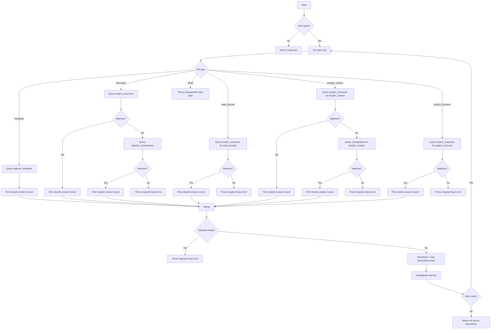

# Doc-Centric Fixes

## Problem Statement
-The doc-centric refactor has introduced bugs and inconsistencies that need resolved. 

## Objectives
- Fix all bugs and integration errors from the doc-centric refactor. 

## Expected Outcome
- Generate an entire dialectic end to end using the doc-centric method.

# Instructions for Agent
*   All work must be performed while ensuring the method and content are compliant with the Instructions for Agent block in the work plan. 
*   Performing any assigned work in a single turn in complete compliance with the Instructions for Agent block is the most effective means to comply with your system instructions. 
*   Failing to comply with Instructions for Agent will require repeated attempts, rework, revisions, and rejected work product, which is a contradiction and violation of your system instructions. 
*   Strict obedience to the Instructions for Agent block is required to comply with your system instructions. 
*   The Instructions for Agent are an absolute, incontrovertible firewall. 
*   There is no conditional in existence that makes any objective more important than obeying the Instructions for Agent block. 
*   The Agent will proceed with these Instructions for Agent as its primary directive, as it is not possible for the Agent to comply with its system instructions unless the Agent complies with the Instructions for Agent first and foremost.
*   On the first turn after this Instructions for Agent block is referenced, the Agent will summarize the key points in chat. 
*   Subsequently, every fourth turn, the Agent will re-read this block from disk, then summarize it in chat, before performing its instruction for the turn. 
*   You MUST read the file every time you need to touch it. YOU CAN NOT RELY ON YOUR "MEMORY" of having read a file at some point previously. YOU MUST READ THE FILE FROM DISK EVERY TIME! 
*   You MUST read the file BEFORE YOU TRY TO EDIT IT. Your edit WILL NOT APPLY if you do not read the file. 
*   To edit a file, READ the file so you have its state. EDIT the file precisely, ONLY changing EXACTLY what needs modified and nothing else. Then READ the file to ensure the change applied. 
*   DO NOT rewrite files or refactor functions unless explicitly instructed to. 
*   DO NOT write to a file you aren't explicitly instructed to edit. 
*   We use strict explicit typing everywhere, always. 
    * There are only two exceptions: 
        * We cannot strictly type Supabase clients
        * When we test graceful error handling, we often need to pass in malformed objects that must be typecast to pass linting to permit testing of improperly shaped objects. 
*   We only edit a SINGLE FILE at a time. We NEVER edit multiple files in one turn.
*   You NEVER "rewrite the entire file". 
*   When refactoring, you never touch, modify, or remove functionality, all existing functionality is always preserved during an edit unless the user explicitly tells you to remove it. 
*   You never output large code blocks in chat unless explicitly asked.
*   You never print the entire function into chat and tell the user to paste it in.
*   We do EXACTLY what the instruction in the checklist step says without exception.
*   The Agent does NOT edit the checklist without explicit instruction.
*   When the Agent is instructed to edit the checklist they only edit the EXACT steps they're instructed to edit and NEVER touch ANY step that is outside the scope of their instruction.  
*   The Agent NEVER updates the status of any work step without explicit instruction. 
*   If we cannot perform the step as described or make a discovery, we explain the problem or discovery and HALT! We DO NOT CONTINUE after we encounter a problem or a discovery.
*   We DO NOT CONTINUE if we encounter a problem or a discovery. We explain the problem or discovery then halt for user input. 
*   If our discovery is that more files need to be edited, instead of editing a file, we generate a proposal for a checklist of instructions to insert into the work plan that explains everything required to update the codebase so that the invalid step can be resolved. 
*   DO NOT RUMINATE ON HOW TO SOLVE A PROBLEM OR DISCOVERY WHILE ONLY EDITING ONE FILE! That is a DISCOVERY that requires that you EXPLAIN your discovery, PROPOSE a solution, and HALT! 
*   We always use test-driven-development. 
    *   We write a RED test that we expect to fail to prove the flaw or incomplete code. 
        *   A RED test is written to the INTENDED SUCCESS STATE so that it is NOT edited again. Do NOT refer to "RED: x condition now, y condition later", which forces the test to be edited after the GREEN step. Do NOT title the test to include any reference to RED/GREEN. Tests are stateless. 
        *   We implement the edit to a SINGLE FILE to enable the GREEN state.
        *   We run the test again and prove it passes. We DO NOT edit the test unless we discover the test is itself flawed. 
*   EVERY EDIT is performed using TDD. We DO NOT EDIT ANY FILE WITHOUT A TEST. 
    *   Documents, types, and interfaces cannot be tested, so are exempt. 
*   Every edit is documented in the checklist of instructions that describe the required edits. 
*   Whenever we discover an edit must be made that is not documented in the checklist of instructions, we EXPLAIN the discovery, PROPOSE an insertion into the instruction set that describes the required work, and HALT. 
    *   We build dependency ordered instructions so that the dependencies are built, tested, and working before the consumers of the dependency. 
*   We use dependency injection for EVERY FILE. 
*   We build adapters and interfaces for EVERY FUNCTION.  
*   We edit files from the lowest dependency on the tree up to the top so that our tests can be run at every step.
*   We PROVE tests pass before we move to the next file. We NEVER proceed without explicit demonstration that the tests pass. 
*   The tests PROVE the functional gap, PROVE the flaw in the function, and prevent regression by ensuring that any changes MUST comply with the proof. 
*   Our process to edit a file is: 
    *   READ the instruction for the step, and read every file referenced by the instruction or step, or implicit by the instruction or step (like types and interfaces).
    *   ANALYZE the difference between the state of the file and the state described by the instructions in the step.
    *   EXPLAIN how the file must be edited to transform it from its current state into the state described by the instructions in the step. 
    *   PROPOSE an edit to the file that will accomplish the transformation while preserving strict explicit typing. 
    *   LINT! After editing the file, run your linter and fix all linter errors that are fixable within that single file. 
    *   HALT! After editing ONE file and ensuring it passes linting, HALT! DO NOT CONTINUE! 
*   The agent NEVER runs tests. 
*   The agent uses ITS OWN TOOLS. 
*   The agent DOES NOT USE THE USER'S TERMINAL. 
*   Adding console logs for trouble shooting is exempt from TDD and checklist obligations. 

## Checklist-Specific Editing Rules

*   THE AGENT NEVER TOUCHES THE CHECKLIST UNLESS THEY ARE EXPLICITLY INSTRUCTED TO! 
*   When editing checklists, each numbered step (1, 2, 3, etc.) represents editing ONE FILE with a complete TDD cycle.
*   Sub-steps within each numbered step use legal-style numbering (1.a, 1.b, 1.a.i, 1.a.ii, etc.) for the complete TDD cycle for that file.
*   All changes to a single file are described and performed within that file's numbered step.
*   Types files (interfaces, enums) are exempt from RED/GREEN testing requirements.
*   Each file edit includes: RED test → implementation → GREEN test → optional refactor.
*   Steps are ordered by dependency (lowest dependencies first).
*   Preserve all existing detail and work while adding new requirements.
*   Use proper legal-style nesting for sub-steps within each file edit.
*   NEVER create multiple top-level steps for the same file edit operation.
*   Adding console logs is not required to be detailed in checklist work. 

### Example Checklist

*   `[ ]`   1. **Title** Objective
    *   `[ ]`   1.a. [DEPS] A list explaining dependencies of the function, its signature, and its return shape
        *   `[ ]` 1.a.i. eg. `function(something)` in `file.ts` provides this or that
    *   `[ ]`   1.b. [TYPES] A list strictly typing all the objects used in the function
    *   `[ ]`   1.c. [TEST-UNIT] A list explaining the test cases
        *   `[ ]` 1.c.i. Assert `function(something)` in `file.ts` acts a certain way 
    *   `[ ]`   1.d. [SPACE] A list explaining the implementation requirements
        *   `[ ]` 1.d.i. Implement `function(something)` in `file.ts` acts a certain way 
    *   `[ ]`   1.d. [TEST-UNIT] Rerun and expand test proving the function
        *   `[ ]` 1.d.i. Implement `function(something)` in `file.ts` acts a certain way 
    *   `[ ]`   1.d. [TEST-INT] If there is a chain of functions that work together, prove it
        *   `[ ]` 1.d.i. For every cross-function interaction, assert `thisFunction(something)` in `this_file.ts` acts a certain way towards `thatFunction(other)` in `that_file.ts`
    *   `[ ]`   1.d. [CRITERIA] A list explaining the acceptence criteria to consider the work complete and correct. 
    *   `[ ]`   1.e. [COMMIT] A commit that explains the function and its proofs

*   `[ ]`   2. **Title** Objective
    *   `[ ]`   2.a. [DEPS] Low level providers are always build before high level consumers (DI/DIP)
    *   `[ ]`   2.b. [TYPES] DI/DIP and strict typing ensures unit tests can always run 
    *   `[ ]`   2.c. [TEST-UNIT] All functions matching defined external objects and acting as asserted helps ensure integration tests pass

## Legend - You must use this EXACT format. Do not modify it, adapt it, or "improve" it. The bullets, square braces, ticks, nesting, and numbering are ABSOLUTELY MANDATORY and UNALTERABLE. 

*   `[ ]` 1. Unstarted work step. Each work step will be uniquely named for easy reference. We begin with 1.
    *   `[ ]` 1.a. Work steps will be nested as shown. Substeps use characters, as is typical with legal documents.
        *   `[ ]` 1. a. i. Nesting can be as deep as logically required, using roman numerals, according to standard legal document numbering processes.
*   `[✅]` Represents a completed step or nested set.
*   `[🚧]` Represents an incomplete or partially completed step or nested set.
*   `[⏸️]` Represents a paused step where a discovery has been made that requires backtracking or further clarification.
*   `[❓]` Represents an uncertainty that must be resolved before continuing.
*   `[🚫]` Represents a blocked, halted, or stopped step or has an unresolved problem or prior dependency to resolve before continuing.

## Component Types and Labels

*   `[DB]` Database Schema Change (Migration)
*   `[RLS]` Row-Level Security Policy
*   `[BE]` Backend Logic (Edge Function / RLS / Helpers / Seed Data)
*   `[API]` API Client Library (`@paynless/api` - includes interface definition in `interface.ts`, implementation in `adapter.ts`, and mocks in `mocks.ts`)
*   `[STORE]` State Management (`@paynless/store` - includes interface definition, actions, reducers/slices, selectors, and mocks)
*   `[UI]` Frontend Component (e.g., in `apps/web`, following component structure rules)
*   `[CLI]` Command Line Interface component/feature
*   `[IDE]` IDE Plugin component/feature
*   `[TEST-UNIT]` Unit Test Implementation/Update
*   `[TEST-INT]` Integration Test Implementation/Update (API-Backend, Store-Component, RLS)
*   `[TEST-E2E]` End-to-End Test Implementation/Update
*   `[DOCS]` Documentation Update (READMEs, API docs, user guides)
*   `[REFACTOR]` Code Refactoring Step
*   `[PROMPT]` System Prompt Engineering/Management
*   `[CONFIG]` Configuration changes (e.g., environment variables, service configurations)
*   `[COMMIT]` Checkpoint for Git Commit (aligns with "feat:", "test:", "fix:", "docs:", "refactor:" conventions)
*   `[DEPLOY]` Checkpoint for Deployment consideration after a major phase or feature set is complete and tested.

# Work Breakdown Structure

*   `[✅]` 1. **`[BE]` Create a `DatabaseRecipeSteps` type and `mapToStageWithRecipeSteps` mapper function**
    *   `[✅]` 1.a. `[TYPES]` In `supabase/functions/dialectic-service/dialectic.interface.ts`, define and export a new type `DatabaseRecipeSteps` that exactly matches the shape of the raw database query result. This type will include `dialectic_stages` as a single object and `dialectic_stage_recipe_instances` as an array of objects, where each instance contains a nested array of `dialectic_stage_recipe_steps`.
    *   `[ ]` 1.b. `[TEST-UNIT]` In a new file `supabase/functions/_shared/utils/mappers.test.ts`, write a failing unit test for a new `mapToStageWithRecipeSteps` function. The test must:
        *   `[✅]` 1.b.i. Create a mock object that conforms to the `DatabaseRecipeSteps` type.
        *   `[✅]` 1.b.ii. Assert that when this mock object is passed to `mapToStageWithRecipeSteps`, the output is a valid `StageWithRecipeSteps` object, where `dialectic_stage` is a single object, and both `dialectic_stage_recipe_instances` and `dialectic_stage_recipe_steps` are flattened into single-level arrays.
    *   `[✅]` 1.c. `[BE]` In a new file `supabase/functions/_shared/utils/mappers.ts`, create and export the `mapToStageWithRecipeSteps` function. The function will take an object of type `DatabaseRecipeSteps` as input and transform it into the `StageWithRecipeSteps` DTO shape by flattening the nested recipe steps.
    *   `[✅]` 1.d. `[TEST-UNIT]` Ensure the test in `supabase/functions/_shared/utils/mappers.test.ts` now passes.
*   `[✅]` 2. **`[BE]` Update Type Guards for `DatabaseRecipeSteps`**
    *   `[✅]` 2.a. `[TEST-UNIT]` In `supabase/functions/_shared/utils/type-guards/type_guards.dialectic.test.ts`, write a new failing unit test for `isDatabaseRecipeSteps` to validate the new object shape. Update the existing `isStageWithRecipeSteps` type guard to validate the new object shape.
    *   `[✅]` 2.b. `[BE]` In `supabase/functions/_shared/utils/type-guards/type_guards.dialectic.ts`, implement the `isDatabaseRecipeSteps` type guard to correctly validate the nested structure of the raw database response. Fix the existing `isStageWithRecipeSteps` to validate the changed object shape.
    *   `[✅]` 2.c. `[TEST-UNIT]` In `supabase/functions/_shared/utils/type-guards/type_guards.dialectic.test.ts`, ensure the `isDatabaseRecipeSteps` and `isStageWithRecipeSteps` tests now pass.
*   `[✅]` 3. **`[REFACTOR]` Refactor `generateContribution.ts` to Use the Mapper**
    *   `[✅]` 3.a. `[TEST-UNIT]` In `supabase/functions/dialectic-service/generateContribution.test.ts`, modify every test to use the `isDatabaseRecipeSteps` type guard and the `mapToStageWithRecipeSteps` mapper. The test should now assert that the raw, unmapped database response is correctly identified as a valid `isDatabaseRecipeSteps` by the type guard. Every test that uses a Recipe must be updated to prove the `DatabaseRecipeSteps` shape is produced by its query, map the shape to the DTO, and prove the `StageWithRecipeSteps` is consumed by the function.
    *   `[✅]` 3.b. `[BE]` In `supabase/functions/dialectic-service/generateContribution.ts`, update the database query to fetch the nested recipe structure. Import and use the `isDatabaseRecipeSteps` type guard to validate the raw response, and then use the `mapToStageWithRecipeSteps` function to transform the data into the `StageWithRecipeSteps` DTO before passing it to the rest of the function.
    *   `[✅]` 3.c. `[TEST-UNIT]` Ensure all tests in `supabase/functions/dialectic-service/generateContribution.test.ts` now pass.
*   `[✅]` 4. **`[REFACTOR]` Refactor `dialectic.interface.ts`**
    *   `[✅]` 4.a. `[TYPES]` In `supabase/functions/dialectic-service/dialectic.interface.ts`, update the `StageWithRecipeSteps` type definition. The `dialectic_stage_recipe_steps` property should now be explicitly typed as `DialecticStageRecipeStep[]` instead of `Tables<'dialectic_stage_recipe_steps'>[]`. This change establishes the new, stricter contract for the DTO and will intentionally cause linter errors in downstream consumer files, which is the correct "RED" state for this multi-file refactor.
*   `[✅]` 5. **`[BE]` Implement Strict Type Guards for Recipe Steps**
    *   `[✅]` 5.a. `[TEST-UNIT]` In `supabase/functions/_shared/utils/type-guards/type_guards.dialectic.test.ts`, write new failing unit tests for the following type guards:
        *   `[✅]` 5.a.i. `isPromptType`: Should return true for 'Seed', 'Planner', 'Turn', 'Continuation' and false otherwise.
        *   `[✅]` 5.a.ii. `isGranularityStrategy`: Should return true for valid strategies like 'per_source_document', 'all_to_one', etc., and false otherwise.
        *   `[✅]` 5.a.iii. `isInputRule` and `isInputRuleArray`: Should validate the structure of `InputRule` objects and arrays of them.
        *   `[✅]` 5.a.iv. `isRelevanceRule` and `isRelevanceRuleArray`: Should validate `RelevanceRule` objects and arrays.
        *   `[✅]` 5.a.v. `isOutputRule` and `isOutputRuleArray`: Should validate `OutputRule` objects and arrays.
        *   `[✅]` 5.a.vi. `isDialecticStageRecipeStep`: This primary test will compose the above, validating a complete `DialecticStageRecipeStep` object against its strict application type, not the raw database type. It will fail until the implementation is complete.
    *   `[✅]` 5.b. `[BE]` In `supabase/functions/_shared/utils/type-guards/type_guards.dialectic.ts`:
        *   `[✅]` 5.b.i. Create and export the new, small, composable type guards: `isPromptType`, `isGranularityStrategy`, `isInputRule`, `isInputRuleArray`, `isRelevanceRule`, `isRelevanceRuleArray`, `isOutputRule`, and `isOutputRuleArray`.
        *   `[✅]` 5.b.ii. Implement and export the `isDialecticStageRecipeStep` type guard. This function will be composed of the smaller guards (and the existing `isJobTypeEnum`) to perform a deep validation of an object against the strict `DialecticStageRecipeStep` application type.
    *   `[✅]` 5.c. `[TEST-UNIT]` Ensure all new tests in `supabase/functions/_shared/utils/type-guards/type_guards.dialectic.test.ts` now pass.
*   `[✅]` 6. **`[REFACTOR]` Refactor `mappers.ts` to Perform Strict Type Transformation**
    *   `[✅]` 6.a. `[TEST-UNIT]` In `supabase/functions/_shared/utils/mappers.test.ts`, update the test for `mapToStageWithRecipeSteps`. The test must now assert that each object in the `dialectic_stage_recipe_steps` array of the returned DTO successfully validates against the new `isDialecticStageRecipeStep` type guard. This test will now fail, proving the mapper is not yet performing the required transformation.
    *   `[✅]` 6.b. `[BE]` In `supabase/functions/_shared/utils/mappers.ts`, refactor the `mapToStageWithRecipeSteps` function. It must now iterate over the raw `dialectic_stage_recipe_steps` array, and for each step, it must perform a deep transformation, converting the raw database object into a strictly-typed `DialecticStageRecipeStep` application object. It should throw an error if any step fails validation against the new type guards.
    *   `[✅]` 6.c. `[TEST-UNIT]` Ensure the test in `supabase/functions/_shared/utils/mappers.test.ts` now passes.
*   `[✅]` 7. **`[REFACTOR]` Fix `prompt_assembler.integration.test.ts`**
    *   `[✅]` 7.a. `[TEST-INT]` In `supabase/integration_tests/prompt_assembler.integration.test.ts`, with the mapper now providing a correctly and strictly-typed DTO, fix all remaining linter errors by:
        *   `[✅]` 7.a.i. Ensuring the test correctly consumes the `StageWithRecipeSteps` DTO, which now contains an array of `DialecticStageRecipeStep` objects.
        *   `[✅]` 7.a.ii. Removing any remaining incorrect type assertions, as the types will now be correctly inferred.
        *   `[✅]` 7.a.iii. Constructing a valid `ResourceUploadContext` for the `uploadAndRegisterFile` call to resolve the final `PathContext` error, ensuring its `fileType` is a valid `ResourceFileTypes` member.
*   `[✅]` 8. **`[COMMIT]` feat(BE): Implement strict type guards and refactor mappers for recipe steps**
    *   `[✅]` 8.a. Create a commit with the message "feat(BE): Implement strict type guards and refactor mappers for recipe steps" containing all the changes from the previous steps.
*   `[✅]` 9. **`[TEST-UNIT]` Create Comprehensive, Realistic Tests for `mapToStageWithRecipeSteps`**
    *   `[✅]` 9.a. `[TEST-UNIT]` In `supabase/functions/_shared/utils/mappers.test.ts`, create a new test case for each recipe step defined in `supabase/migrations/20251006194531_thesis_stage.sql`. Each test will:
        *   `[✅]` 9.a.i. Construct a `DatabaseRecipeSteps` mock object using the exact `inputs_required`, `inputs_relevance`, and `outputs_required` JSONB data from the migration file for that specific step.
        *   `[✅]` 9.a.ii. Assert that the `mapToStageWithRecipeSteps` function correctly transforms the mock object into a `StageWithRecipeSteps` DTO, where all properties are correctly mapped to their strict application types. This will serve as a failing (RED) test.
    *   `[✅]` 9.b. `[TEST-UNIT]` In `supabase/functions/_shared/utils/mappers.test.ts`, create a new test case for each recipe step defined in `supabase/migrations/20251006194542_antithesis_stage.sql`.
        *   `[✅]` 9.b.i. Construct a `DatabaseRecipeSteps` mock object using the exact `inputs_required`, `inputs_relevance`, and `outputs_required` JSONB data from the migration file for that specific step.
        *   `[✅]` 9.b.ii. Assert that the `mapToStageWithRecipeSteps` function correctly transforms the mock object into a `StageWithRecipeSteps` DTO.
    *   `[✅]` 9.c. `[TEST-UNIT]` In `supabase/functions/_shared/utils/mappers.test.ts`, create a new test case for each recipe step defined in `supabase/migrations/20251006194549_synthesis_stage.sql`.
        *   `[✅]` 9.c.i. Construct a `DatabaseRecipeSteps` mock object using the exact `inputs_required`, `inputs_relevance`, and `outputs_required` JSONB data from the migration file for that specific step.
        *   `[✅]` 9.c.ii. Assert that the `mapToStageWithRecipeSteps` function correctly transforms the mock object into a `StageWithRecipeSteps` DTO.
    *   `[✅]` 9.d. `[TEST-UNIT]` In `supabase/functions/_shared/utils/mappers.test.ts`, create a new test case for each recipe step defined in `supabase/migrations/20251006194558_parenthesis_stage.sql`.
        *   `[✅]` 9.d.i. Construct a `DatabaseRecipeSteps` mock object using the exact `inputs_required`, `inputs_relevance`, and `outputs_required` JSONB data from the migration file for that specific step.
        *   `[✅]` 9.d.ii. Assert that the `mapToStageWithRecipeSteps` function correctly transforms the mock object into a `StageWithRecipeSteps` DTO.
    *   `[✅]` 9.e. `[TEST-UNIT]` In `supabase/functions/_shared/utils/mappers.test.ts`, create a new test case for each recipe step defined in `supabase/migrations/20251006194605_paralysis_stage.sql`.
        *   `[✅]` 9.e.i. Construct a `DatabaseRecipeSteps` mock object using the exact `inputs_required`, `inputs_relevance`, and `outputs_required` JSONB data from the migration file for that specific step.
        *   `[✅]` 9.e.ii. Assert that the `mapToStageWithRecipeSteps` function correctly transforms the mock object into a `StageWithRecipeSteps` DTO.
    *   `[✅]` 9.f. `[BE]` In `supabase/functions/_shared/utils/mappers.ts`, refactor the `mapToStageWithRecipeSteps` function to correctly handle all variations of the `inputs_required`, `inputs_relevance`, and `outputs_required` JSONB data structures present in the real recipe steps.
    *   `[✅]` 9.g. `[TEST-UNIT]` Ensure all new tests in `supabase/functions/_shared/utils/mappers.test.ts` now pass, proving the mapper is robust and handles all real-world data.

*   `[✅]` 10. **`[REFACTOR]` Refactor `startSession` to Return Assembled Seed Prompt**
    *   `[✅]` 10.a. `[TYPES]` In `supabase/functions/dialectic-service/dialectic.interface.ts`, update the `StartSessionSuccessResponse` interface to include a new property: `seedPrompt: AssembledPrompt`. This establishes the new data contract for the API response.
    *   `[✅]` 10.b. `[TEST-UNIT]` **RED**: In `supabase/functions/dialectic-service/startSession.test.ts`, modify the unit tests for a successful `startSession` call. Assert that the returned `StartSessionSuccessResponse` object now contains a `seedPrompt` property that is a valid `AssembledPrompt` object. These tests must now fail, proving the implementation is not yet updated.
    *   `[✅]` 10.c. `[BE]` **GREEN**: In `supabase/functions/dialectic-service/startSession.ts`, modify the function's success path. Attach the `AssembledPrompt` object (which is already returned from the call to `assembleSeedPrompt`) to the response payload, fulfilling the new `StartSessionSuccessResponse` contract.
    *   `[✅]` 10.d. `[TEST-UNIT]` **GREEN**: Rerun the tests in `supabase/functions/dialectic-service/startSession.test.ts` and ensure they all pass, proving the backend correctly returns the new payload shape.
    *   `[✅]` 10.e. `[STORE]` In `packages/store/src/dialecticStore.ts`, add a new state property to the `DialecticStateValues` interface: `activeSeedPrompt: AssembledPrompt | null`. This creates the dedicated state for the seed prompt.
    *   `[✅]` 10.f. `[TEST-UNIT]` **RED**: In `packages/store/src/dialecticStore.test.ts`, write a new failing unit test for the `startDialecticSession` async thunk. The test must:
        *   `[✅]` 10.f.i. Mock the `api.dialectic().startSession` call to return a valid `StartSessionSuccessResponse` payload, including the new `seedPrompt` property.
        *   `[✅]` 10.f.ii. Dispatch the `startDialecticSession` action.
        *   `[✅]` 10.f.iii. Assert that after the action completes, the store's `activeSeedPrompt` state has been correctly populated with the `seedPrompt` object from the mocked API response. This test must fail.
    *   `[✅]` 10.g. `[STORE]` **GREEN**: In `packages/store/src/dialecticStore.ts`, modify the `startDialecticSession` async thunk. In the success block, extract the `seedPrompt` object from the API response payload and use `set()` to update the new `activeSeedPrompt` state property.
    *   `[✅]` 10.h. `[TEST-UNIT]` **GREEN**: Rerun the test in `packages/store/src/dialecticStore.test.ts` and ensure it now passes, proving the store correctly handles the new API response.
    *   `[✅]` 10.i. `[UNIT-TEST]` **RED**: In `apps/web/src/components/dialectic/SessionInfoCard.test.tsx`, update the existing test suite to prove:
        *   `[✅]` 10.i.i. The function uses the new store selector: `const activeSeedPrompt = useDialecticStore(state => state.activeSeedPrompt);`.
        *   `[✅]` 10.i.ii. The function does not use the `iterationUserPromptResourceId` `useMemo` hook.
        *   `[✅]` 10.i.iii. The function does not use the `iterationPromptCacheEntry` store selector and the associated `useEffect` that called `fetchInitialPromptContent`.
        *   `[✅]` 10.i.iv. The prompt content is rendered directly from `activeSeedPrompt?.promptContent`. The loading state is tied to the overall session loading state, not a separate prompt fetch.
    *   `[✅]` 10.j. `[UI]` **GREEN**: In `apps/web/src/components/dialectic/SessionInfoCard.tsx`, refactor the component to consume the new state:
        *   `[✅]` 10.j.i. Add a new store selector: `const activeSeedPrompt = useDialecticStore(state => state.activeSeedPrompt);`.
        *   `[✅]` 10.j.ii. Remove the `iterationUserPromptResourceId` `useMemo` hook.
        *   `[✅]` 10.j.iii. Remove the `iterationPromptCacheEntry` store selector and the associated `useEffect` that called `fetchInitialPromptContent`.
        *   `[✅]` 10.j.iv. Update the JSX to render the prompt content directly from `activeSeedPrompt?.promptContent`. The loading state should now be tied to the overall session loading state, not a separate prompt fetch.
    *   `[✅]` 10.k **`[COMMIT]` fix(BE,FE): Refactor session start to return seed prompt directly**
        *   `[✅]` 10.k.i. Create a commit with the message "fix(BE,FE): Refactor session start to return seed prompt directly" containing all the changes from the previous step.

*   `[✅]` 11. **[UI] Reintegrate stage checklists with contribution cards in the session workspace**
    *   `[ ]` 11.a. [DEPS] Document the state dependencies linking `StageTabCard`, `StageRunChecklist`, `SessionContributionsDisplayCard`, and `GeneratedContributionCard`
        *   `[✅]` 11.a.i. [DETAIL] Map each component to its store selectors, actions, and shared data contracts so the refactor can consolidate access without duplicating hooks
            *   `[✅]` 11.a.i.i. **StageTabCard** — selectors: `selectSortedStages`, `selectActiveStageSlug`, `selectActiveContextSessionId`, `selectCurrentProjectDetail`, `selectSessionById`, `selectStageProgressSummary`; actions: `setActiveStage`; derived data: stage list ordering, active stage identification, per-stage progress/step totals, initial prompt cache lookups.
            *   `[✅]` 11.a.i.ii. **SessionContributionsDisplayCard** — selectors: `selectCurrentProjectDetail`, `selectIsLoadingProjectDetail`, `selectProjectDetailError`, `selectContributionGenerationStatus`, `selectActiveStageSlug`, `selectSortedStages`, `selectStageProgressSummary`, `selectFeedbackForStageIteration`; actions/state readers: `submitStageResponses`, `resetSubmitStageResponsesError`, `fetchFeedbackFileContent`, `clearCurrentFeedbackFileContent`, `resetFetchFeedbackFileContentError`, `generateContributionsError`, `stageDocumentContent`, `setActiveStage`; local state ties submission gating, toast messaging, and header/footer labels to these values.
            *   `[✅]` 11.a.i.iii. **GeneratedContributionCard** — selectors: `selectContributionById`, `selectFocusedStageDocument`, `stageDocumentContent`, `modelCatalog`; actions: `fetchContributionContent`, `saveContributionEdit`, `resetSaveContributionEditError`, `setFocusedStageDocument`, `updateStageDocumentDraft`, `submitStageDocumentFeedback`; derived keys: `StageDocumentCompositeKey` serialization `${sessionId}:${stageSlug}:${iterationNumber}:${modelId}:${documentKey}` plus focused-document map `${sessionId}:${stageSlug}:${modelId}`.
            *   `[✅]` 11.a.i.iv. **Shared data contract** — ensure all three components agree on (a) selected model IDs, (b) active session/stage identifiers, (c) stage progress summaries for gating, and (d) stage document draft storage so moving the checklist under `StageTabCard` preserves strict typing and avoids duplicate store hops.        
        *   `[✅]` 11.a.ii. [DETAIL] Define the focused-document map contract so StageTabCard can own it without breaking downstream consumers
            *   `[✅]` 11.a.ii.i. The canonical key is produced by `buildFocusedDocumentKey` (`packages/store/src/dialecticStore.ts`) and must always be `${sessionId}:${stageSlug}:${modelId}`; `setFocusedStageDocument`, `clearFocusedStageDocument`, and `selectFocusedStageDocument` all rely on this serialization.
            *   `[✅]` 11.a.ii.ii. Each entry in `focusedStageDocument` is `{ modelId, documentKey }`, created by `setFocusedStageDocument` and nulled by `clearFocusedStageDocument`; StageTabCard must populate the map with this exact shape when it aggregates focus state for child checklists.
            *   `[✅]` 11.a.ii.iii. `StageRunChecklist` reads `focusedStageDocumentMap[focusKey]?.documentKey` to highlight the active document, so any provider (StageTabCard or GeneratedContributionCard) has to pass a map keyed with `buildFocusedDocumentKey` and keep the values in sync with the store’s focus entries.    
        *   `[✅]` 11.a.iii. [DETAIL] Capture the stage document draft keying so checklist clicks and contribution edits stay in sync
            *   `[✅]` 11.a.iii.i. Drafts are stored in `state.stageDocumentContent` under the serialized composite key returned by `getStageDocumentKey({ sessionId, stageSlug, iterationNumber, modelId, documentKey })`; no other keying scheme exists.
            *   `[✅]` 11.a.iii.ii. `setFocusedStageDocument` always constructs that composite key and invokes `beginStageDocumentEdit` so the entry is created/seeded before any editor renders, meaning StageTabCard must pass `iterationNumber` through `SetFocusedStageDocumentPayload`.
            *   `[✅]` 11.a.iii.iii. `GeneratedContributionCard` reuses the same composite key to read/write draft feedback (`stageDocumentContent[serializedKey]`) and submit via `submitStageDocumentFeedback`, so any refactor must preserve the five-field identity to keep StageRunChecklist selections and contribution edits synchronized.
    * [✅] 11.b. [TEST-UNIT] Update `apps/web/src/components/dialectic/StageTabCard.test.tsx` to describe the new StageRunChecklist UI zone
        * [✅] 11.b.i. Mock `StageRunChecklist` so we can assert it is rendered once per selected model when an active stage exists, and verify it receives the correct `modelId`, `focusedStageDocumentMap`, and `onDocumentSelect` payloads.
        * [✅] 11.b.ii. Add assertions that the stage panel exposes the new structural hooks (e.g., `data-testid="stage-run-checklists"`) and that clicking the mocked checklist triggers `setFocusedStageDocument` with the serialized key we expect.
        * [✅] 11.b.iii. Refresh the progress badge/document total assertions to match the new markup so the tests remain green once the layout changes.
    * [✅] 11.c. [UI] Refactor `apps/web/src/components/dialectic/StageTabCard.tsx` to own the checklist experience
        * [✅] 11.c.i. Build a single memoized selector that gathers `activeSessionId`, `activeStageSlug`, `iterationNumber`, `selectedModelIds`, and per-model focused document states so we only touch the store once.
        * [✅] 11.c.ii. Render the existing stage tab list in a left column card and append a new detail panel that maps every selected model to a `StageRunChecklist`, passing the aggregated `focusedStageDocumentMap` and an `onDocumentSelect` handler that wraps `setFocusedStageDocument`.
        * [✅] 11.c.iii. Surface a heading/label tying the stage metadata (display name + description) to the checklist panel so screen readers and the updated tests can locate it, and ensure the component exports consistent spacing/tokens for the redesigned layout.
    * [✅] 11.d. [TEST-UNIT] Extend `apps/web/src/components/dialectic/DialecticSessionDetails.test.tsx` so the page-level contract captures the new grid layout
        * [✅] 11.d.i. Add assertions that the root container exposes a two-column/grid wrapper with the expected `data-testid` hooks for the stage column and the contribution column.
        * [✅] 11.d.ii. Verify the mocked `StageTabCard` and `SessionContributionsDisplayCard` mount inside their dedicated regions so future refactors cannot regress the lower-right placement requirement.
    * [✅] 11.e. [UI] Rebuild `apps/web/src/components/dialectic/DialecticSessionDetails.tsx` around a responsive stage-step-and-document workspace
        * [✅] 11.e.i. Replace the current stacked layout with a CSS grid (or flex split) that pins `StageTabCard` to the left rail and reserves the right pane for the document workspace (currently rendered by `SessionContributionsDisplayCard`), keeping `SessionInfoCard` as the top banner.
        * [✅] 11.e.ii. Introduce `section` wrappers with semantic labels and `data-testid` identifiers that match the updated layout tests while preserving all existing loading/error/empty-state branches.
    * [✅] 11.f. [TEST-UNIT] Rewrite `apps/web/src/components/dialectic/SessionContributionsDisplayCard.test.tsx` to assert the document-centric workflow
        * [✅] 11.f.i. Maintain the multi-model scenario but assert that each model renders its stage documents (e.g., `data-testid="stage-document-card-{modelId}-{documentKey}"`) through the real component tree, and that the header/footer regions (`card-header`, `card-footer`) remain discoverable for gating assertions.
        * [✅] 11.f.ii. Replace legacy StageRunChecklist expectations with checks that submit-button gating relies solely on `selectStageProgressSummary`, and that toast/alert messaging reflects the updated document-centric DOM.
        * [✅] 11.f.iii. Verify that the per-model document drafting bridge (e.g., `onDocumentDraftChange`) is invoked for each rendered document so stage document drafts continue to flow into the store.
    * [✅] 11.g. [UI] Restore full document rendering inside `apps/web/src/components/dialectic/SessionContributionsDisplayCard.tsx`
        * [✅] 11.g.i. Derive the active stage’s document records (using `stageDocumentContent`, `selectStageDocumentChecklist`, or equivalent selectors) for the selected models, then render the legacy-named `GeneratedContributionCard` component once per document with the correct `{ modelId, documentKey, stageDocumentEntry }` inputs.
        * [✅] 11.g.ii. Reintroduce the header/footer structure (with the documented `data-testid` hooks) so the submission CTA, success/error messaging, and stage metadata align with the document-centric tests while gating strictly on `stageProgressSummary`.
        * [✅] 11.g.iii. Ensure the local draft handlers update stage document drafts via the existing store helpers without regressing the confirmation modal or toast flows.
    * [✅] 11.h. [TEST-UNIT] Update `apps/web/src/components/dialectic/GeneratedContributionCard.test.tsx` to lock down per-document feedback behavior
        * [✅] 11.h.i. Seed the mock store with a focused document entry and assert that the component reads the corresponding stage document draft, displays the model/document identifiers, and propagates draft-change events back to the store helpers.
        * [✅] 11.h.ii. Verify that saving feedback calls `submitStageDocumentFeedback` with the composite key composed of `{ sessionId, stageSlug, iterationNumber, modelId, documentKey }`.
    * [✅] 11.i. [UI] Finalize the document-centric data plumbing in `apps/web/src/components/dialectic/GeneratedContributionCard.tsx`
        * [✅] 11.i.i. Derive `modelId` and `documentKey` from the stage document payload (failing fast if either is missing) and rebuild the memoized focus/draft keys so they match the selectors and checklist contract.
        * [✅] 11.i.ii. Remove any dormant contribution-era dependencies (e.g., unused checklist imports), keep the diagnostic logging, and harden the draft-update/save handlers against missing document context while preserving the current editing UX.
    * [✅] 11.j. [DOCS] Catalog legacy Document-Centric Generation2 references for regression audit
        * [✅] 11.j.i. StageRunChecklist
            * [✅] 11.j.i.1. `packages/types/src/dialectic.types.ts` — StageRunChecklistProps `modelId` contract (Generation2 1.p.a)
            * [✅] 11.j.i.2. `packages/store/src/dialecticStore.selectors.recipes.test.ts` — Model-filtered document checklist coverage (Generation2 1.p.b)
            * [✅] 11.j.i.3. `packages/store/src/dialecticStore.selectors.ts` — Model-filtered checklist implementation (Generation2 1.p.c)
            * [✅ ] 11.j.i.4. `apps/web/src/components/dialectic/StageRunChecklist.test.tsx` — Model-specific interaction tests (Generation2 1.m.a, 1.p.d)
            * [✅] 11.j.i.5. `apps/web/src/components/dialectic/StageRunChecklist.tsx` — Model-specific checklist UI (Generation2 1.m.b, 1.p.e)
        * [✅] 11.j.ii. SessionContributionsDisplayCard
            * [✅] 11.j.ii.1. `apps/web/src/components/dialectic/SessionContributionsDisplayCard.test.tsx` — Multi-model document workflow tests (Generation2 1.p.f)
            * [✅] 11.j.ii.2. `apps/web/src/components/dialectic/SessionContributionsDisplayCard.tsx` — Multi-model container implementation (Generation2 1.p.h)
        * [✅] 11.j.iii. GeneratedContributionCard
            * [✅] 11.j.iii.1. `apps/web/src/components/dialectic/GeneratedContributionCard.test.tsx` — Model-scoped feedback editor tests (Generation2 1.p.g.i)
            * [✅] 11.j.iii.2. `apps/web/src/components/dialectic/GeneratedContributionCard.tsx` — Model-scoped container implementation (Generation2 1.p.g.ii)
        * [✅] 11.j.iv. DialecticSessionDetails
            * [✅] 11.j.iv.1. No explicit legacy references captured in Document-Centric Generation2; confirm scope during audit.
    * [✅] 11.k. [BE] Relax recipe step guards to honor flexible document-centric payloads
        * [✅] 11.k.a. [TEST-UNIT] In `supabase/functions/_shared/utils/type-guards/type_guards.dialectic.test.ts`, add RED coverage that:
            * [✅] 11.k.a.i. `isSystemMaterials`, `isContextForDocument`, and `isRenderedDocumentArtifact` accept planner payloads that omit optional prose fields while still rejecting non-object inputs.
            * [✅] 11.k.a.ii. `isInputRule`, `isRelevanceRule`, and the composed `isDialecticStageRecipeStep` permit dynamic `document_key` strings (e.g., `synthesis_feature_spec`, `final_business_case`) that are not enumerated `FileType` values.
            * [✅] 11.k.a.iii. `isDialecticStageRecipeStep` continues to fail when required top-level properties (`id`, `job_type`, `inputs_required`, `outputs_required`) are missing or of the wrong primitive type.
        * [✅] 11.k.b. [BE] In `supabase/functions/_shared/utils/type-guards/type_guards.dialectic.ts`, implement the GREEN updates by:
            * [✅] 11.k.b.i. Treating `document_key` fields as non-empty strings without forcing `FileType` membership, while leaving the existing boolean and number validations for critical flags intact.
            * [✅] 11.k.b.ii. Allowing optional JSON payload fields (`system_materials`, `context_for_documents`, `documents`, `assembled_json`) to pass through as plain objects or arrays without enumerating their inner keys, and short-circuiting `isDialecticStageRecipeStep` on obviously invalid shapes.
            * [✅] 11.k.b.iii. Documenting (via inline comments) the distinction between structural validation and recipe-content validation so future contributors preserve the relaxed behavior.
        * [✅] 11.k.c. [TEST-UNIT] Rerun the updated suite in `type_guards.dialectic.test.ts` to confirm the relaxed guards satisfy the new flexibility while existing negative cases still fail.

* `[✅]` 12. **[UI] Slim StageRunChecklist to rendered deliverables only**
  * [✅] 12.a. [DEPS] Document the selectors, recipe step data, and status enums the checklist depends on so we can safely filter to rendered artifacts without breaking store contracts.
      * [✅] 12.a.i. Capture how `selectStageDocumentChecklist`, `selectStageRecipe`, and `selectStageRunProgress` expose document metadata and statuses for each `modelId`.
      * [✅] 12.a.ii. Enumerate which `DialecticStageRecipeStep.outputs_required` entries declare `file_type: 'markdown'` so planner headers and JSON intermediates can be excluded even when `artifact_class` is missing or inconsistent.
  * [✅] 12.b. [TEST-UNIT] Update `apps/web/src/components/dialectic/StageRunChecklist.test.tsx` to RED-state the minimal UI contract.
    * [✅] 12.b.i. Assert that only markdown deliverable document keys appear in the checklist (planner headers / JSON artifacts must never render).
    * [✅] 12.b.ii. Expect a condensed header (single-line count + optional empty-state note) with no branch/parallel metadata and no duplicate “no documents” language.
    * [✅] 12.b.iii. Verify each item shows just the document key and its status badge, with clickability gated on `modelId` and no excess whitespace.
    * [✅] 12.b.iv. Require the “no documents” copy to render exactly once when nothing is available, preventing multiple redundant messages.
    * [✅] 12.b.v. Add coverage that planned markdown deliverables render with a default “Not Started” status before any `StageDocumentEntry` exists, keeping document counts aligned with recipe expectations.
    * [✅] 12.b.vi. Assert the checklist card exports full-width layout hooks/classes so embedding it beneath `StageTabCard` keeps the document list from overlapping the contribution workspace.
    * [✅] 12.b.vii. Require the checklist to render all markdown deliverables even when `selectStageRunProgress` returns no entry, proving synthesized rows surface purely from recipe data.
    * [✅] 12.b.viii. Assert the accordion trigger/content live inside the checklist container element (not the parent card) so the checklist can self-collapse without relying on external layout wrappers.
    * [✅] 12.b.ix. Verify the checklist container matches the parent card’s width/height (no extra padding or nested wrappers) by asserting the exposed layout hooks/classes reflect equal sizing.
  * [✅] 12.c. [UI] Refactor `apps/web/src/components/dialectic/StageRunChecklist.tsx` to satisfy the new contract.
    * [✅] 12.c.i. Filter step outputs to entries whose `file_type === 'markdown'`, building a flat rendered-document list keyed by `documentKey` and aligning it with store checklist entries even when no `StageDocumentEntry` exists or progress data is unavailable.
    * [✅] 12.c.ii. Restore an internal accordion housed completely inside the checklist container so the checklist owns its toggle button/content while rendering only the final markdown documents (no planner/branch metadata).
    * [✅] 12.c.iii. Collapse the card header to a single-line summary plus an optional single empty-state line, and ensure the checklist container occupies the full width/height of the parent card by eliminating extra wrappers and redundant padding that previously caused overlap with `SessionContributionsDisplayCard`.
    * [✅] 12.c.iv. Preserve keyboard/click selection for focusable documents while tightening spacing (e.g., reduced padding classes, gap utilities) to keep the component short on common viewports.
    * [✅] 12.c.v. Replace "Checklist" in the outer container with "Completed x of n documents". Remove "Stage Run Checklist" from the inner container. The component is currently 3 containers - the outer container, the inner container, and the step container. We can reduce it to two containers, with the step containers directly in the outermost container. This will further reduce width and height. 
    * [✅] 12.c.vi. Introduce synthesized checklist entries for markdown outputs that lack `StageDocumentEntry` data so the UI surfaces planned documents with a `not_started` status and stable keys.
    * [✅] 12.c.vii. Apply layout classes that keep the checklist height/width constrained when rendered inside `StageTabCard`, ensuring it never overlaps `SessionContributionsDisplayCard`.
  * [✅] 12.d. [TEST-UNIT] Re-run the updated `StageRunChecklist` tests and confirm they pass with the compact rendered-document UI.
  * [✅] 12.e. [TEST-UNIT] Update `apps/web/src/components/dialectic/StageTabCard.test.tsx` to RED-state the relocated checklist container.
      * [✅] 12.e.i. Assert the inner checklist wrapper matches the outer stage card width and exposes deterministic hooks for layout assertions.
      * [✅] 12.e.ii. Assert that the embedded `StageRunChecklist` panel resides directly within the checklist wrapper, without an extra accordion provided by the parent.
      * [✅] 12.e.iii. Verify the stage column exports spacing classes/data attributes that keep its height independent from `SessionContributionsDisplayCard`.
  * [✅] 12.f. [UI] Refactor `apps/web/src/components/dialectic/StageTabCard.tsx` to satisfy the new layout contract.
      * [✅] 12.f.i. Ensure the inner checklist container inherits the exact width of the outer stage card.
      * [✅] 12.f.ii. Remove any accordion markup from the container, ensuring it acts purely as a layout wrapper for the `StageRunChecklist` component.
      * [✅] 12.f.iii. Adjust spacing and flex properties so the stage column and embedded `StageRunChecklist` never overlap with `SessionContributionsDisplayCard` across viewport sizes.
  * [✅] 12.g. [TEST-UNIT] Re-run the updated `StageTabCard` suite and confirm the relocated checklist layout passes with the new spacing rules.

*   `[✅]` 13. **Fix Seed Prompt Data Flow End-to-End**
  - **Goal**: Correct the entire data pipeline for the `activeSeedPrompt` from the database to the UI, ensuring it is always available on the session details page.
  - **Problem**: The user's analysis is correct. The `activeSeedPrompt` is only hydrated when a session is first created. It is lost on subsequent page loads because the `getSessionDetails` endpoint does not fetch it, the types do not enforce it, and the store does not process it.
  - [✅] 13.a. **Backend Interface Contract (`dialectic.interface.ts`)**
    - [✅] 13.a.i. **RED**: Identify that the `GetSessionDetailsResponse` interface in `supabase/functions/dialectic-service/dialectic.interface.ts` is missing the `activeSeedPrompt` property. This proves the backend's data contract is incomplete.
    - [✅] 13.a.ii. **GREEN**: Edit `supabase/functions/dialectic-service/dialectic.interface.ts` to add `activeSeedPrompt: AssembledPrompt | null;` as a **required** property to the `GetSessionDetailsResponse` interface.
    - [✅] 13.a.iii. **LINT**: Verify the file is clean. The "proof" of the flaw is that the backend implementation (`getSessionDetails.ts`) will now fail to compile because it does not satisfy this updated, stricter interface.
  - [✅] 13.b. **Frontend Interface Contract (`dialectic.types.ts`)**
    - [✅] 13.b.i. **RED**: Identify that the corresponding `GetSessionDetailsResponse` interface in `packages/types/src/dialectic.types.ts` is also missing the `activeSeedPrompt` property, creating a type mismatch across the stack.
    - [✅] 13.b.ii. **GREEN**: Edit `packages/types/src/dialectic.types.ts` to add `activeSeedPrompt: AssembledPrompt | null;` as a **required** property, synchronizing the frontend's contract with the backend's.
    - [✅] 13.b.iii. **LINT**: Verify the file is clean. The "proof" of the flaw is that multiple frontend files that use this type (the store, mocks, and tests) will now fail to compile.
  - [✅] 13.c. **API Mock (`dialectic.api.mock.ts`)**
    - [✅] 13.c.i. **RED**: Acknowledge that the mock implementation of `getSessionDetails` in `packages/api/src/mocks/dialectic.api.mock.ts` does not return the `activeSeedPrompt` property, causing frontend unit tests that rely on this mock to fail compilation.
    - [✅] 13.c.ii. **GREEN**: Edit `packages/api/src/mocks/dialectic.api.mock.ts` to include `activeSeedPrompt: mockSeedPrompt` (or null, as appropriate for the test) in the return value of the `getSessionDetails` mock, satisfying the updated interface.
    - [✅] 13.c.iii. **LINT**: Verify the file is clean. The "proof" is that the frontend store's unit test will now compile but fail at runtime because the store's implementation logic is still broken.
  - [✅] 13.d. **Store Unit Test (`dialecticStore.session.test.ts`)**
    - [✅] 13.d.i. **RED**: The test `should fetch session details, update state, and set context on success` in `packages/store/src/dialecticStore.session.test.ts` is missing an assertion for `activeSeedPrompt`. Run the test to confirm it fails, expecting the `activeSeedPrompt` state to be populated but finding `null`.
    - [✅] 13.d.ii. **GREEN**: Edit the test's mock response and add the assertion `expect(state.activeSeedPrompt).toEqual(mockSeedPrompt);`. This makes the test's failure explicit and correctly defines the required behavior.
    - [✅] 13.d.iii. **LINT**: Verify the file is clean. The test now correctly and explicitly fails, proving the flaw in the store's implementation logic.
  - [✅] 13.e. **Store Implementation (`dialecticStore.ts`)**
    - [✅] 13.e.i. **RED**: The `fetchAndSetCurrentSessionDetails` action in `packages/store/src/dialecticStore.ts` does not set the `activeSeedPrompt` state from the API response, causing the unit test from the previous step to fail.
    - [✅] 13.e.ii. **GREEN**: Edit `fetchAndSetCurrentSessionDetails` to destructure `activeSeedPrompt` from the response data and add `state.activeSeedPrompt = activeSeedPrompt || null;` inside the `set` call.
    - [✅] 13.e.iii. **LINT**: Run the linter, then run the store's unit test. The proof of the fix is that the test in `dialecticStore.session.test.ts` now passes.
    - [✅] 13.f. **[TYPES] Synchronize and Validate `GetSessionDetailsResponse` Type Contract**
        - [✅] 13.f.i. **[BE] [TYPES]** In `supabase/functions/dialectic-service/dialectic.interface.ts`, confirm that the `GetSessionDetailsResponse` interface includes the required property: `activeSeedPrompt: AssembledPrompt | null;`.
    - [✅] 13.g. **Backend Unit Test (`getSessionDetails.test.ts`)**
        - [✅] 13.g.i. **[TEST-UNIT] RED**: In `supabase/functions/dialectic-service/getSessionDetails.test.ts`, write a comprehensive, failing unit test for the `getSessionDetails` function. This test must:
            - [✅] 13.g.i.1. Mock all external dependencies, including the Supabase database client and any other service calls.
            - [✅] 13.g.i.2. Set up a mock database response that includes all the necessary data to construct both a `DialecticSession` and a corresponding `AssembledPrompt`.
            - [✅] 13.g.i.3. Assert that the object returned by `getSessionDetails` successfully validates against the updated `GetSessionDetailsResponse` interface from `dialectic.interface.ts`.
            - [✅] 13.g.i.4. Specifically assert that the `activeSeedPrompt` property on the returned object is a valid `AssembledPrompt` object matching the mocked database data.
            - [✅] 13.g.i.5. This test must fail due to the implementation's failure to return the `activeSeedPrompt`, proving the flaw.
        - [✅] 13.g.ii. **[LINT]**: Verify the new test file `supabase/functions/dialectic-service/getSessionDetails.test.ts` is free of linter errors.
    - [✅] 13.h. **Backend Implementation (`getSessionDetails.ts`)**
    - [✅] 13.h.i. **[BE] GREEN**: Edit the `getSessionDetails` function in `supabase/functions/dialectic-service/getSessionDetails.ts` to satisfy the updated contract and pass the new unit test. The changes must:
        - [✅] 13.h.i.1. Add a database query to fetch the seed prompt associated with the session's current stage and iteration from the `dialectic_prompts` table.
        - [✅] 13.h.i.2. Gracefully handle cases where no seed prompt is found, returning `null` for the `activeSeedPrompt` property.
        - [✅] 13.h.i.3. Construct a valid `AssembledPrompt` object from the query result when a prompt is found.
        - [✅] 13.h.i.4. Update the function's final return statement to include the `activeSeedPrompt` object, ensuring the full `GetSessionDetailsResponse` contract is met.
    - [✅] 13.h.ii. **[TEST-UNIT] GREEN**: The proof of the fix is that the unit test created in step 13.g now passes.
    - [✅] 13.h.iii. **[LINT]**: Verify the file `supabase/functions/dialectic-service/getSessionDetails.ts` is free of linter errors.   
*   `[✅]` 14. **`[REFACTOR]` Refactor All Affected Files to Use `resource_description` as a JSON Object**
    *   `[✅]` 14.a. `[TEST-UNIT]` In `supabase/functions/_shared/services/file_manager.upload.test.ts`, update the tests to assert that a proper JSON object is passed for `resource_description` and remove assertions related to string parsing.
    *   `[✅]` 14.b. `[BE]` In `supabase/functions/_shared/services/file_manager.ts`, remove the logic that parses and re-stringifies the `resource_description` in `uploadAndRegisterFile`, ensuring it is handled as a JSON object.
    *   `[✅]` 14.c. `[TEST-UNIT]` In `supabase/functions/_shared/utils/dialectic_utils.test.ts`, update the mock data to provide `resource_description` as a proper JSON object instead of a string.
    *   `[✅]` 14.d. `[BE]` In `supabase/functions/_shared/utils/dialectic_utils.ts`, simplify the logic in `getSeedPromptForStage` to remove the `JSON.parse()` call and handle `resource_description` as a JSON object directly.
    *   `[✅]` 14.e. `[TEST-UNIT]` In `supabase/functions/dialectic-service/cloneProject.test.ts`, update the mock data to use proper JSON objects for `resource_description` instead of stringified versions.
    *   `[✅]` 14.f. `[BE]` In `supabase/functions/dialectic-service/cloneProject.ts`, simplify the logic in `buildUploadContextForAsset` to remove the parsing and stringifying of `resource_description`.
    *   `[✅]` 14.g. `[TEST-UNIT]` In `supabase/functions/dialectic-service/exportProject.test.ts`, update the mock data to use proper JSON objects for `resource_description`.
    *   `[✅]` 14.h. `[BE]` In `supabase/functions/dialectic-service/exportProject.ts`, simplify the manifest creation logic to handle `resource_description` as a JSON object directly, removing the need for stringification.
    *   `[✅]` 14.i. `[BE]` In `supabase/functions/dialectic-service/submitStageResponses.ts`, update the query that checks for required documents to use the `->>` operator to correctly query the `jsonb` field.
    *   `[✅]` 14.j. `[BE]` In `supabase/functions/dialectic-service/getSessionDetails.ts`, replace the `.textSearch()` workaround with a correct query using the `->>` operator on the `resource_description` field. 

* [✅] Fix all recipe mappers

*   [✅] 15. **[REFACTOR] Refactor `selectIsStageReadyForSessionIteration` to Use `activeSeedPrompt` State**
    *   [✅] 15.a. [DEPS] The `selectIsStageReadyForSessionIteration` selector correctly iterates through the generic `inputs_required` for a given step. However, the specific check for the `seed_prompt` input type is implemented with a brittle, outdated method that manually searches `project.resources`. This single check is the point of failure. The correct implementation is to surgically refactor only this specific check to use `state.activeSeedPrompt`. The selector's correct, generic logic for all other input types (`document`, `feedback`, etc.) must be preserved.
    *   [✅] 15.b. [TEST-UNIT] **RED**: In `packages/store/src/dialecticStore.selectors.test.ts`, refactor the existing test suite in a single pass to correctly model the generic rule: "a step is ready if its `inputs_required` are satisfied."
        *   [✅] 15.b.i. Locate the existing test that asserts the selector returns `true` when inputs are satisfied. Its name, which describes this generic behavior, must not be changed.
        *   [✅] 15.b.ii. Refactor the *setup* of this test to prove the flaw. The test's recipe requires a `seed_prompt`. The correct way to satisfy this input is to provide a mock `activeSeedPrompt` in the store state. Remove the legacy `mockSeedPromptResource` from the mock project's `resources` array. The test must now fail because the selector's implementation is looking in the wrong place.
        *   [✅] 15.b.iii. Refactor the *setups* of all other tests in the suite that test the legacy `resources` logic for seed prompts (e.g., tests for empty resources, malformed JSON, etc.). Their purpose is to test that the selector returns `false` when an input is unsatisfied. The generic, behavioral names of these tests must be preserved.
    *   [✅] 15.c. [STORE] **GREEN**: In `packages/store/src/dialecticStore.selectors.ts`, perform a surgical refactor of the `selectIsStageReadyForSessionIteration` function.
        *   [✅] 15.c.i. Add `(state: DialecticStateValues) => state.activeSeedPrompt` to the selector's input array.
        *   [✅] 15.c.ii. Inside the selector's logic, locate the `if (requirement.type === 'seed_prompt')` block.
        *   [✅] 15.c.iii. Replace the entire contents of this block (the `for...of projectResources` loop) with a single check: `if (!activeSeedPrompt) { return false; }`.
        *   [✅] 15.c.iv. Crucially, do not modify the logic for handling other requirement types.
    *   [✅] 15.d. [TEST-UNIT] **GREEN**: The proof of the fix is that the entire refactored test suite in `packages/store/src/dialecticStore.selectors.test.ts` now passes without any further modification.

Mermaid diagram for task_isolator: 

*   `[✅]` 16. **`[REFACTOR]` Overhaul `findSourceDocuments` to Correct All Architectural, Type, and Logic Flaws**
    *   `[✅]` 16.a. `[DEPS]` The `findSourceDocuments` function in `supabase/functions/dialectic-worker/task_isolator.ts` is architecturally broken. Its `if/else if/else` control structure makes a critical, incorrect assumption: that any `InputRule` type that is not `'feedback'` or `'document'` must be a `contribution_type` located in the `dialectic_contributions` table. This is fundamentally incorrect, as critical artifact types like `'seed_prompt'` and `'header_context'` are stored in `dialectic_project_resources`. This core architectural flaw is compounded by two other categories of error: (1) A persistent type contract violation where the implementation incorrectly attempts to access a `rule.stage_slug` property when the `InputRule` interface explicitly defines it as `rule.slug`. (2) Invalid type comparisons against a `'*'` literal string, which violates the `FileType` enum.
    *   `[✅]` 16.b. `[TEST-UNIT]` **RED**: In the existing test file, `supabase/functions/dialectic-worker/task_isolator.test.ts`, add a new `describe('findSourceDocuments', () => { ... })` block to create a dedicated unit test suite for the function. Within this new suite, add targeted test cases to independently prove every identified flaw.
        *   `[✅]` 16.b.i. Write a test case for an `InputRule` with `type: 'seed_prompt'`. The test must mock a corresponding artifact in the `dialectic_project_resources` table and assert that `findSourceDocuments` successfully returns this artifact. The test will fail because the current implementation incorrectly queries the `dialectic_contributions` table.
        *   `[✅]` 16.b.ii. Write a test case for an `InputRule` with `type: 'header_context'`. The test must mock a corresponding artifact in the `dialectic_project_resources` table and assert that `findSourceDocuments` successfully returns this artifact. This will fail for the same reason as the `seed_prompt` test, proving the architectural flaw.
        *   `[✅]` 16.b.iii. Write a test case for an `InputRule` with `type: 'document'` that provides a `slug`. The test must mock a corresponding document in the `dialectic_contributions` table and assert that `findSourceDocuments` successfully returns this document by using the `rule.slug` property in its query. The test will fail because the implementation incorrectly attempts to access `rule.stage_slug`, which is not a valid property on the `InputRule` type.
    *   `[✅]` 16.c. `[BE]` **GREEN**: In `supabase/functions/dialectic-worker/task_isolator.ts`, perform a complete rewrite of the `findSourceDocuments` function's internal logic to build a robust, type-safe, and architecturally correct implementation.
        *   `[✅]` 16.c.i. **Architectural Repair:** Replace the entire flawed `if/else if/else` block with a `switch (rule.type)` statement. This provides a clear, explicit, and scalable control flow that correctly isolates the logic for each distinct artifact type.
        *   `[✅]` 16.c.ii. **Implement Resource Logic:** Create `case` blocks for `'seed_prompt'`, `'header_context'`, and `'project_resource'`. The logic for these cases must correctly query the `dialectic_project_resources` table. The query must filter by `project_id` and use `rule.type` to filter the `resource_type` column.
        *   `[✅]` 16.c.iii. **Implement Contribution/Feedback Logic:** Re-implement the existing logic for `'document'` and `'feedback'` inside their own dedicated `case` blocks within the new `switch` structure.
        *   `[✅]` 16.c.iv. **Fix Type Errors:** In every `case` block, ensure all property access is corrected from the non-existent `rule.stage_slug` to the correct `InputRule` property, `rule.slug`.
        *   `[✅]` 16.c.v. **Fix Invalid Comparisons:** Completely remove all invalid `!== '*'` comparisons. The logic for handling optional document keys must be re-implemented within each relevant `case` by checking for the presence of the `rule.document_key` property before applying it as a filter to the query.
        *   `[✅]` 16.c.vi. **Add Defensive Programming:** Add a `default:` case to the `switch` statement that throws a descriptive `Error` for any unknown or unhandled `rule.type`, preventing future silent failures and making the function more robust.
    *   `[✅]` 16.d. `[TEST-UNIT]` **GREEN**: The proof of the complete and correct refactor is that the entire, multi-case test suite created in step 16.b now passes without any modification.
    *   `[✅]` 16.e. `[LINT]` The final proof of the type contract fix is that running the internal linter against the refactored `supabase/functions/dialectic-worker/task_isolator.ts` file now reports zero errors.

*   `[✅]` 17. **`[REFACTOR]` [FE] Implement Resilient, Per-Document Failure Handling End-to-End**
    *   `[✅]` 17.a. **`[STORE]` Refactor `handleJobFailedLogic` to be Job-Centric**
        *   `[✅]` 17.a.i. `[DEPS]` The `handleJobFailedLogic` function in `packages/store/src/dialecticStore.documents.ts` is architecturally flawed. It incorrectly assumes every `job_failed` event corresponds to a document with a pre-existing `latestRenderedResourceId`. This causes it to prematurely exit when handling failures for jobs that run *before* a document resource is created (e.g., the 'PLAN' job), leaving the UI in an interminable "generating" state. The store is already designed for granular, per-document status tracking via the `stageRunProgress` state object, which keys progress to a `jobId`. The fix is to make the failure handler job-centric, not resource-centric, by removing the flawed check and using the `jobId` from the event payload to reliably update the status of the correct document descriptor in the `stageRunProgress` map.
        *   `[✅]` 17.a.ii. `[TEST-UNIT]` **RED**: In `packages/store/src/dialecticStore.documents.test.ts`, create a new, targeted unit test for `handleJobFailedLogic` that proves the existing implementation ignores pre-document failures.
            *   `[✅]` 17.a.ii.1. Mock the store's state to include an initial `stageRunProgress` entry for a test session, stage, and iteration. This entry should have a `documents` map containing a `HeaderContext` document with a status of `'generating'`.
            *   `[✅]` 17.a.ii.2. Construct and dispatch a mock `JobFailedPayload` that mirrors a planner failure: it must include a `jobId`, `sessionId`, `stageSlug`, `iterationNumber`, `documentKey: 'HeaderContext'`, `modelId`, and an `error` object, but it must **not** include the `latestRenderedResourceId` property.
            *   `[✅]` 17.a.ii.3. Assert that after `handleJobFailedLogic` has run, the status of the `HeaderContext` document within the `stageRunProgress` map has been correctly updated to `'failed'`.
            *   `[✅]` 17.a.ii.4. Assert that the corresponding step in the `stepStatuses` map has also been set to `'failed'`.
            *   `[✅]` 17.a.ii.5. This test must fail, proving the current logic prematurely exits before updating the granular, job-specific state.
        *   `[✅]` 17.a.iii. `[STORE]` **GREEN**: In `packages/store/src/dialecticStore.documents.ts`, perform a surgical refactor of the `handleJobFailedLogic` function to make it job-centric and resilient.
            *   `[✅]` 17.a.iii.1. Completely remove the initial conditional block that checks for `latestRenderedResourceId` and causes the premature `return`.
            *   `[✅]` 17.a.iii.2. Ensure the function robustly finds or creates the `StageRunDocumentDescriptor` for the `event.document_key` within the correct `stageRunProgress` snapshot.
            *   `[✅]` 17.a.iii.3. Reliably update this descriptor's status to `'failed'` and attach the `event.error` object to it.
            *   `[✅]` 17.a.iii.4. Ensure the parent step's status in the `stepStatuses` map is also updated to `'failed'`.
        *   `[✅]` 17.a.iv. `[TEST-UNIT]` **GREEN**: The proof of the fix is that the new unit test created in step 17.a.ii now passes without any modification.
    *   `[✅]` 17.b. **`[STORE]` Make `selectStageProgressSummary` Failure-Aware**
        *   `[✅]` 17.b.i. `[DEPS]` The `selectStageProgressSummary` selector in `packages/store/src/dialecticStore.selectors.ts` is not failure-aware. It only counts `'completed'` documents, meaning a failed stage is indistinguishable from an incomplete one, preventing the UI from showing a clear error state.
        *   `[✅]` 17.b.ii. `[TEST-UNIT]` **RED**: In `packages/store/src/dialecticStore.selectors.test.ts`, write a new test for `selectStageProgressSummary`.
            *   `[✅]` 17.b.ii.1. Mock a `stageRunProgress` state where one document's status is `'failed'`.
            *   `[✅]` 17.b.ii.2. Assert that the selector's return object includes a new property `hasFailed: true`, along with a count of failed documents and their keys. This test must fail.
        *   `[✅]` 17.b.iii. `[STORE]` **GREEN**: In `packages/store/src/dialecticStore.selectors.ts`, refactor `selectStageProgressSummary`.
            *   `[✅]` 17.b.iii.1. Add logic to iterate through the documents and check if any have a status of `'failed'`.
            *   `[✅]` 17.b.iii.2. Update the return type and value to include `hasFailed: boolean`, `failedDocuments: number`, and `failedDocumentKeys: string[]`.
        *   `[✅]` 17.b.iv. `[TEST-UNIT]` **GREEN**: Prove the test created in step 17.b.ii now passes.
    *   `[✅]` 17.c. **`[UI]` Display Per-Document Failure State in the UI**
        *   `[✅]` 17.c.i. `[DEPS]` The `StageRunChecklist` component in `apps/web/src/components/dialectic/StageRunChecklist.tsx` currently has no visual representation for a document in a `'failed'` state.
        *   `[✅]` 17.c.ii. `[TEST-UNIT]` **RED**: In `apps/web/src/components/dialectic/StageRunChecklist.test.tsx`, write a new test.
            *   `[✅]` 17.c.ii.1. Mock the `selectStageDocumentChecklist` selector to return a document entry with `status: 'failed'`.
            *   `[✅]` 17.c.ii.2. Assert that the rendered component contains a specific failure indicator (e.g., an error icon with `data-testid="document-failed-icon"`). This test must fail.
        *   `[✅]` 17.c.iii. `[UI]` **GREEN**: In `apps/web/src/components/dialectic/StageRunChecklist.tsx`, modify the component's render logic.
            *   `[✅]` 17.c.iii.1. Add a conditional check for `item.status === 'failed'`.
            *   `[✅]` 17.c.iii.2. When true, render an appropriate error icon (e.g., `XCircleIcon`) next to the document key.
        *   `[✅]` 17.c.iv. `[TEST-UNIT]` **GREEN**: Prove the test created in step 17.c.ii now passes.

* Change Submit Responses button to detect when in the last stage and instead provide Export and Iterate from Plan
* Fix SessionInfoCard to never display Export Final
