# Document-Centric Generation 

## Problem Statement
- Stages are still continuous and monolithic. 
- A generation hiccup by a single model inhibits the assembly of its documents. 
- Individual jobs for models are still too monolithic. 
- The generation products are too large to be effectively handled by downstream consumers. 
- Prompts are dynamic by stage but not by continuation context or document context. 
- Each prompt for each model for each document or continuation is not saved uniquely, making troubleshooting and blame difficult. 
- Documents are not recast from json to markdown to be human usable. 
- Documents are not stored individually in the file tree. 
- Documents are not selected and sent dynamically to individual agents for each intra-stage or inter-stage generation. 

## Objectives
- Stepwise CI/CD so updates can be rolled out per-sprint. 
- Each and every prompt is context-aware and automatically generated for the specific job sent. 
- Each and every prompt sent in the entire process is saved for diagnostic, trouble-shooting, and blame. 
- Stage jobs are decomposed into an initial prompt to generate a header/master plan from an agent for that stage, then subsequent jobs are decomposed and parallelized into specific documents. 
- The first completion for each model for each stage is to generate a "header" response that establishes the context requirements for all the documents that will be generated in the step. 
- Each document generation uses the initial turn "header" to synchronize generated content across multiple documents to prevent drift / diff / contradiction. 
- Jobs, continuations, and retries are per-document-per-stage-per-model, not per-stage-per-model. 
- Partial document generation can be recovered without regeneration of the existing fragment. 
- Partial documents can be knit into a full document without duplicated fragments or losses. 
- Finished documents are recast from json to markdown and saved in the correct folder with the correct name.
- Finished documents are retrievable per-document for subsequent stage, inter-stage, or cross-model consumption. 

## Expected Outcome
- The decomposed document-centric generation model is applied to all jobs across all stages and all models. 
- Every element sent to or received from an agent is stored uniquely and accessible by the user and system. 
- Prompts are fully automated and decomposed to the specific turn, model, stage, step, document, or continuation. 
- Jobs are fully automated, decomposed, and parallelized across all documents to be generated while maintaining synchrony cross-document throughout the stage for each model. 
- Jobs and documents are synchronized by use of the initial completion as a header for additional jobs and documents. 
- Individual documents can be reliably generated, continued, retried, recovered from partial, composed into markdown, retrieved, and used dynamically by agents and users. 
- Improvements can be deployed continuously without requiring the entire epic to be completed for new functionality to be accessible by users and models. 

# Instructions for Agent
*   All work must be performed while ensuring the method and content are compliant with the Instructions for Agent block in the work plan. 
*   Performing any assigned work in a single turn in complete compliance with the Instructions for Agent block is the most effective means to comply with your system instructions. 
*   Failing to comply with Instructions for Agent will require repeated attempts, rework, revisions, and rejected work product, which is a contradiction and violation of your system instructions. 
*   Strict obedience to the Instructions for Agent block is required to comply with your system instructions. 
*   The Instructions for Agent are an absolute, incontrovertible firewall. 
*   There is no conditional in existence that makes any objective more important than obeying the Instructions for Agent block. 
*   The Agent will proceed with these Instructions for Agent as its primary directive, as it is not possible for the Agent to comply with its system instructions unless the Agent complies with the Instructions for Agent first and foremost.
*   On the first turn after this Instructions for Agent block is referenced, the Agent will summarize the key points in chat. 
*   Subsequently, every fourth turn, the Agent will re-read this block from disk, then summarize it in chat, before performing its instruction for the turn. 
*   You MUST read the file every time you need to touch it. YOU CAN NOT RELY ON YOUR "MEMORY" of having read a file at some point previously. YOU MUST READ THE FILE FROM DISK EVERY TIME! 
*   You MUST read the file BEFORE YOU TRY TO EDIT IT. Your edit WILL NOT APPLY if you do not read the file. 
*   To edit a file, READ the file so you have its state. EDIT the file precisely, ONLY changing EXACTLY what needs modified and nothing else. Then READ the file to ensure the change applied. 
*   DO NOT rewrite files or refactor functions unless explicitly instructed to. 
*   DO NOT write to a file you aren't explicitly instructed to edit. 
*   We use strict explicit typing everywhere, always. 
    * There are only two exceptions: 
        * We cannot strictly type Supabase clients
        * When we test graceful error handling, we often need to pass in malformed objects that must be typecast to pass linting to permit testing of improperly shaped objects. 
*   We only edit a SINGLE FILE at a time. We NEVER edit multiple files in one turn.
*   You NEVER "rewrite the entire file". 
*   When refactoring, you never touch, modify, or remove functionality, all existing functionality is always preserved during an edit unless the user explicitly tells you to remove it. 
*   You never output large code blocks in chat unless explicitly asked.
*   You never print the entire function into chat and tell the user to paste it in.
*   We do EXACTLY what the instruction in the checklist step says without exception.
*   The Agent does NOT edit the checklist without explicit instruction.
*   When the Agent is instructed to edit the checklist they only edit the EXACT steps they're instructed to edit and NEVER touch ANY step that is outside the scope of their instruction.  
*   The Agent NEVER updates the status of any work step without explicit instruction. 
*   If we cannot perform the step as described or make a discovery, we explain the problem or discovery and HALT! We DO NOT CONTINUE after we encounter a problem or a discovery.
*   We DO NOT CONTINUE if we encounter a problem or a discovery. We explain the problem or discovery then halt for user input. 
*   If our discovery is that more files need to be edited, instead of editing a file, we generate a proposal for a checklist of instructions to insert into the work plan that explains everything required to update the codebase so that the invalid step can be resolved. 
*   DO NOT RUMINATE ON HOW TO SOLVE A PROBLEM OR DISCOVERY WHILE ONLY EDITING ONE FILE! That is a DISCOVERY that requires that you EXPLAIN your discovery, PROPOSE a solution, and HALT! 
*   We always use test-driven-development. 
    *   We write a RED test that we expect to fail to prove the flaw or incomplete code. 
        *   A RED test is written to the INTENDED SUCCESS STATE so that it is NOT edited again. Do NOT refer to "RED: x condition now, y condition later", which forces the test to be edited after the GREEN step. Do NOT title the test to include any reference to RED/GREEN. Tests are stateless. 
        *   We implement the edit to a SINGLE FILE to enable the GREEN state.
        *   We run the test again and prove it passes. We DO NOT edit the test unless we discover the test is itself flawed. 
*   EVERY EDIT is performed using TDD. We DO NOT EDIT ANY FILE WITHOUT A TEST. 
    *   Documents, types, and interfaces cannot be tested, so are exempt. 
*   Every edit is documented in the checklist of instructions that describe the required edits. 
*   Whenever we discover an edit must be made that is not documented in the checklist of instructions, we EXPLAIN the discovery, PROPOSE an insertion into the instruction set that describes the required work, and HALT. 
    *   We build dependency ordered instructions so that the dependencies are built, tested, and working before the consumers of the dependency. 
*   We use dependency injection for EVERY FILE. 
*   We build adapters and interfaces for EVERY FUNCTION.  
*   We edit files from the lowest dependency on the tree up to the top so that our tests can be run at every step.
*   We PROVE tests pass before we move to the next file. We NEVER proceed without explicit demonstration that the tests pass. 
*   The tests PROVE the functional gap, PROVE the flaw in the function, and prevent regression by ensuring that any changes MUST comply with the proof. 
*   Our process to edit a file is: 
    *   READ the instruction for the step, and read every file referenced by the instruction or step, or implicit by the instruction or step (like types and interfaces).
    *   ANALYZE the difference between the state of the file and the state described by the instructions in the step.
    *   EXPLAIN how the file must be edited to transform it from its current state into the state described by the instructions in the step. 
    *   PROPOSE an edit to the file that will accomplish the transformation while preserving strict explicit typing. 
    *   LINT! After editing the file, run your linter and fix all linter errors that are fixable within that single file. 
    *   HALT! After editing ONE file and ensuring it passes linting, HALT! DO NOT CONTINUE! 
*   The agent NEVER runs tests. 
*   The agent uses ITS OWN TOOLS. 
*   The agent DOES NOT USE THE USER'S TERMINAL. 

# Checklist-Specific Editing Rules

*   THE AGENT NEVER TOUCHES THE CHECKLIST UNLESS THEY ARE EXPLICITLY INSTRUCTED TO! 
*   When editing checklists, each numbered step (1, 2, 3, etc.) represents editing ONE FILE with a complete TDD cycle.
*   Sub-steps within each numbered step use legal-style numbering (1.a, 1.b, 1.a.i, 1.a.ii, etc.) for the complete TDD cycle for that file.
*   All changes to a single file are described and performed within that file's numbered step.
*   Types files (interfaces, enums) are exempt from RED/GREEN testing requirements.
*   Each file edit includes: RED test → implementation → GREEN test → optional refactor.
*   Steps are ordered by dependency (lowest dependencies first).
*   Preserve all existing detail and work while adding new requirements.
*   Use proper legal-style nesting for sub-steps within each file edit.
*   NEVER create multiple top-level steps for the same file edit operation.

# Legend - You must use this EXACT format. Do not modify it, adapt it, or "improve" it. The bullets, square braces, ticks, nesting, and numbering are ABSOLUTELY MANDATORY and UNALTERABLE. 

*   `[ ]` 1. Unstarted work step. Each work step will be uniquely named for easy reference. We begin with 1.
    *   `[ ]` 1.a. Work steps will be nested as shown. Substeps use characters, as is typical with legal documents.
        *   `[ ]` 1. a. i. Nesting can be as deep as logically required, using roman numerals, according to standard legal document numbering processes.
*   `[✅]` Represents a completed step or nested set.
*   `[🚧]` Represents an incomplete or partially completed step or nested set.
*   `[⏸️]` Represents a paused step where a discovery has been made that requires backtracking or further clarification.
*   `[❓]` Represents an uncertainty that must be resolved before continuing.
*   `[🚫]` Represents a blocked, halted, or stopped step or has an unresolved problem or prior dependency to resolve before continuing.

# Component Types and Labels

*   `[DB]` Database Schema Change (Migration)
*   `[RLS]` Row-Level Security Policy
*   `[BE]` Backend Logic (Edge Function / RLS / Helpers / Seed Data)
*   `[API]` API Client Library (`@paynless/api` - includes interface definition in `interface.ts`, implementation in `adapter.ts`, and mocks in `mocks.ts`)
*   `[STORE]` State Management (`@paynless/store` - includes interface definition, actions, reducers/slices, selectors, and mocks)
*   `[UI]` Frontend Component (e.g., in `apps/web`, following component structure rules)
*   `[CLI]` Command Line Interface component/feature
*   `[IDE]` IDE Plugin component/feature
*   `[TEST-UNIT]` Unit Test Implementation/Update
*   `[TEST-INT]` Integration Test Implementation/Update (API-Backend, Store-Component, RLS)
*   `[TEST-E2E]` End-to-End Test Implementation/Update
*   `[DOCS]` Documentation Update (READMEs, API docs, user guides)
*   `[REFACTOR]` Code Refactoring Step
*   `[PROMPT]` System Prompt Engineering/Management
*   `[CONFIG]` Configuration changes (e.g., environment variables, service configurations)
*   `[COMMIT]` Checkpoint for Git Commit (aligns with "feat:", "test:", "fix:", "docs:", "refactor:" conventions)
*   `[DEPLOY]` Checkpoint for Deployment consideration after a major phase or feature set is complete and tested.

# File Structure for Supabase Storage and Export Tools

{repo_root}/  (Root of the user's GitHub repository)
└── {project_name_slug}/
    ├── project_readme.md      (Optional high-level project description, goals, defined by user or initial setup, *Generated at project finish, not start, not yet implemented*)
    ├── {user_prompt}.md (the initial prompt submitted by the user to begin the project generated by createProject, whether provided as a file or text string, *Generated at project start, implemented*)
    ├── project_settings.json (The json object includes keys for the dialectic_domain row, dialectic_process_template, dialectic_stage_transitions, dialectic_stages, dialectic_process_associations, domain_specific_prompt_overlays, and system_prompt used for the project where the key is the table and the value is an object containing the values of the row, *Generated on project finish, not project start, not yet implemented*)
    ├── {export_project_file}.zip (a zip file of the entire project for the user to download generated by exportProject, *Generated at user request, implemented*)
    ├── general_resource (all optional, provided by user)
    │    ├── `{deployment_context}` (where/how the solution will be implemented), 
    │    ├── `{domain_standards}` (domain-specific quality standards and best practices), 
    │    ├── `{success_criteria}` (measurable outcomes that define success), 
    │    ├── `{constraint_boundaries}` (non-negotiable requirements and limitations), 
    │    ├── `{stakeholder_considerations}` (who will be affected and how),
    │    ├── `{reference_documents}` (user-provided reference materials and existing assets), 
    │    └── `{compliance_requirements}` (regulatory, legal, or organizational compliance mandates)    
    ├── Pending/          (System-managed folder populated as the final step of the Paralysis stage)
    │   └── ...                     (When the user begins their work, they move the first file they're going to work on from Pending to Current)
    ├── Current/          (User-managed folder for the file they are actively working on for this project)
    │   └── ...                     (This is the file the user is currently working on, drawn from Pending)
    ├── Complete/         (User-managed folder for the files they have already completed for this project)       
    │   └── ...                     (When the user finishes all the items in the Current file, they move it to Complete, and move the next Pending file into Current)
    └── session_{session_id_short}/  (Each distinct run of the dialectic process)
        └── iteration_{N}/        (N being the iteration number, e.g., "iteration_1")
            ├── 1_thesis/
            │   ├── _work/
            │   │   ├── prompts/
            │   │   │   ├── {model_slug}_{n}[_{step_name}]_planner_prompt.md
            │   │   │   ├── {model_slug}_{n}_{document_key}[_continuation_{c}]_prompt.md
            │   │   │   └── ... (other document prompts for this model)
            │   │   ├── context/
            │   │   │   └── {model_slug}_{n}_header_context.json
            │   │   └── assembled_json/
            │   │       ├── {model_slug}_{n}_{document_key}_assembled.json
            │   │       └── ... (other assembled documents for this model)
            │   ├── raw_responses/
            │   │   ├── {model_slug}_{n}_planner_raw.json
            │   │   ├── {model_slug}_{n}_{document_key}_raw.json
            │   │   ├── {model_slug}_{n}_{document_key}_continuation_{c}_raw.json
            │   │   └── ... (other continuations for the same model and other models)
            │   ├── documents/
            │   │   ├── {model_slug}_{n}_{document_key}.md
            │   │   └── ... (other rendered documents for this model)
            │   ├── seed_prompt.md  (The complete prompt sent to the model for completion for this stage, including the stage prompt template, stage overlays, and user's input)
            │   ├── {model_slug}_{n}_thesis.md (Contains YAML frontmatter + AI response, appends a count so a single model can provide multiple contributions)
            │   ├── ... (other models' hypothesis outputs)
            │   └── user_feedback_hypothesis.md   (User's feedback on this stage)
            ├── 2_antithesis/
            │   ├── _work/
            │   │   ├── prompts/
            │   │   │   ├── {model_slug}_critiquing_{source_model_slug}_{n}[_{step_name}]_planner_prompt.md
            │   │   │   ├── {model_slug}_critiquing_{source_model_slug}_{n}_{document_key}[_continuation_{c}]_prompt.md
            │   │   │   └── ... (other document prompts for this model)
            │   │   ├── context/
            │   │   │   └── {model_slug}_critiquing_{source_model_slug}_{n}_header_context.json
            │   │   └── assembled_json/
            │   │       ├── {model_slug}_critiquing_{source_model_slug}_{n}_{document_key}_assembled.json
            │   │       └── ... (other assembled documents for this model)
            │   ├── raw_responses/
            │   │   ├── {model_slug}_critiquing_{source_model_slug}_{n}_planner_raw.json
            │   │   ├── {model_slug}_critiquing_{source_model_slug}_{n}_{document_key}_raw.json
            │   │   ├── {model_slug}_critiquing_{source_model_slug}_{n}_{document_key}_continuation_{c}_raw.json
            │   │   └── ... (other continuations for the same model and other models)
            │   ├── documents/
            │   │   ├── {model_slug}_critiquing_{source_model_slug}_{n}_{document_key}.md
            │   │   └── ... (other rendered documents for this model)
            │   ├── seed_prompt.md  (The complete prompt sent to the model for completion for this stage, including the stage prompt template, stage overlays, and user's input)
            │   ├── {model_slug}_critiquing_{source_model_slug}_{n}_antithesis.md
            │   ├── ... (other models' antithesis outputs)
            │   └── user_feedback_antithesis.md
            ├── 3_synthesis/
            │   ├── _work/
            │   │   ├── prompts/
            │   │   │   ├── {model_slug}_{n}[_{step_name}]_planner_prompt.md
            │   │   │   ├── {model_slug}_{n}_{document_key}[_continuation_{c}]_prompt.md
            │   │   │   └── ... (other document prompts for this model)
            │   │   ├── context/
            │   │   │   └── {model_slug}_{n}_header_context.json
            │   │   └── assembled_json/
            │   │       ├── {model_slug}_{n}_{document_key}_assembled.json
            │   │       └── ... (other assembled documents for this model)
            │   ├── raw_responses/
            │   │   ├── {model_slug}_{n}_planner_raw.json
            │   │   ├── {model_slug}_from_{source_model_slugs}_{n}_pairwise_synthesis_chunk_raw.json
            │   │   ├── {model_slug}_reducing_{source_contribution_id_short}_{n}_reduced_synthesis_raw.json
            │   │   ├── {model_slug}_{n}_{document_key}_raw.json
            │   │   ├── {model_slug}_{n}_{document_key}_continuation_{c}_raw.json
            │   │   └── ... (other continuations for the same model and other models)
            │   ├── documents/
            │   │   ├── {model_slug}_{n}_{document_key}.md
            │   │   └── ... (other rendered documents for this model)
            │   ├── seed_prompt.md  (The complete prompt sent to the model for completion for this stage, including the stage prompt template, stage overlays, and user's input)
            │   ├── {model_slug}_{n}_final_synthesis.md
            │   ├── ... (other models' synthesis outputs)
            │   └── user_feedback_synthesis.md
            ├── 4_parenthesis/
            │   ├── _work/
            │   │   ├── prompts/
            │   │   │   ├── {model_slug}_{n}[_{step_name}]_planner_prompt.md
            │   │   │   ├── {model_slug}_{n}_{document_key}[_continuation_{c}]_prompt.md
            │   │   │   └── ... (other document prompts for this model)
            │   │   ├── context/
            │   │   │   └── {model_slug}_{n}_header_context.json
            │   │   └── assembled_json/
            │   │       ├── {model_slug}_{n}_{document_key}_assembled.json
            │   │       └── ... (other assembled documents for this model)
            │   ├── raw_responses/
            │   │   ├── {model_slug}_{n}_planner_raw.json
            │   │   ├── {model_slug}_{n}_{document_key}_raw.json
            │   │   ├── {model_slug}_{n}_{document_key}_continuation_{c}_raw.json
            │   │   └── ... (other continuations for the same model and other models)
            │   ├── documents/
            │   │   ├── {model_slug}_{n}_{document_key}.md
            │   │   └── ... (other rendered documents for this model)
            │   ├── seed_prompt.md  (The complete prompt sent to the model for completion for this stage, including the stage prompt template, stage overlays, and user's input)
            │   ├── {model_slug}_{n}_parenthesis.md
            │   ├── ... (other models' parenthesis outputs)
            │   └── user_feedback_parenthesis.md
            └── 5_paralysis/
                ├── _work/
                │   ├── prompts/
                │   │   ├── {model_slug}_{n}[_{step_name}]_planner_prompt.md
                │   │   ├── {model_slug}_{n}_{document_key}[_continuation_{c}]_prompt.md
                │   │   └── ... (other document prompts for this model)
                │   ├── context/
                │   │   └── {model_slug}_{n}_header_context.json
                │   └── assembled_json/
                │       ├── {model_slug}_{n}_{document_key}_assembled.json
                │       └── ... (other assembled documents for this model)
                ├── raw_responses/
                │   ├── {model_slug}_{n}_planner_raw.json
                │   ├── {model_slug}_{n}_{document_key}_raw.json
                │   ├── {model_slug}_{n}_{document_key}_continuation_{c}_raw.json
                │   └── ... (other continuations for the same model and other models)
                ├── documents/
                │   ├── {model_slug}_{n}_{document_key}.md
                │   └── ... (other rendered documents for this model)
                ├── seed_prompt.md  (The complete prompt sent to the model for completion for this stage, including the stage prompt template, stage overlays, and user's input)
                ├── {model_slug}_{n}_paralysis.md
                ├── ... (other models' paralysis outputs)
                └── user_feedback_paralysis.md
---
*Note: This structure represents the artifact layout for a single generation cycle. The long-term vision involves an iterative process where the final checklist artifacts from the `Paralysis/` stage are moved to `Pending/` for the user to consume in subsequent sprints. See `docs/implementations/Current/Documentation/From One-Shot to Continuous Flow.md` for more details.*

# Mermaid Diagram

```mermaid
graph LR
    %% GLOBAL PHASE ORDER: User --> DB --> Worker --> Orchestration --> Rendering
    %% Architectural note: This reflects a shift from a monolithic serial process
    %% to a recursive, parallelizable job orchestration system. Jobs are first-class
    %% citizens in the DB (`dialectic_generation_jobs`) and all orchestration is
    %% observable via DB state.

    %% -------------------------
    %% USER + API
    subgraph USER["User & API"]
        direction TB
        A["User Initiates Stage"] --> B["API: Enqueues 'PLAN' Job"]
        %% Insight: The API layer only enqueues jobs; no business logic is embedded here.
        %% This keeps orchestration concerns in the DB + worker layers.
    end

    %% -------------------------
    %% DATABASE
    subgraph DB["Database: dialectic_generation_jobs"]
        direction TB
        B --> C(("<b>Jobs Table</b><br/>id, parent_id, status, job_type,<br/><b>payload (recipe, metadata)</b>"))
        C --> D((Webhook))
        %% Insight: The Jobs table is the **single source of truth** for orchestration.
        %% Triggers/webhooks turn DB state changes into orchestration signals.

        subgraph DB_EVENTS["Job Updates & Inserts"]
            direction TB
            S["UPDATE Parent status='pending_next_step'"]
            U["UPDATE Parent status='completed'"]
            W["UPDATE Child status='completed'"]
            Y["INSERT 'EXECUTE' Job"]
            Z["INSERT 'RENDER' Job"]
            AA["INSERT Continuation Job"]
            %% Insight: These reflect **state transitions** driven by worker logic.
            %% This ensures every change is durable and auditable.
        end

        %% Connections
        S --> C
        U --> C
        W --> C
        W --> Z
        Y --> C
        Z --> C
        AA --> C
    end

    %% -------------------------
    %% DIALECTIC WORKER
    subgraph WORKER["Dialectic Worker (Orchestrator)"]
        direction TB
        D --> E["Worker Fetches Job"]
        E --> F{"Strategy Router (processJob.ts)"}
        %% Insight: Worker is stateless; orchestration decisions are derived from job_type + payload.

        F -->|job_type='execute'| EXECUTE["processSimpleJob"]
        F -->|job_type='plan' AND has recipe| PLAN["processComplexJob"]
        F -->|job_type='plan' AND no recipe| TRANSFORM_JOB["Transform → 'execute' Job (in-memory)"]
        F -->|job_type='render'| RENDER["processRenderJob"]
        TRANSFORM_JOB --> EXECUTE
    end

    %% Subgraph Connections
    PLAN --> PHASE1_ENTRY
    EXECUTE --> PHASE2_ENTRY
    RENDER --> RENDERING_ENTRY

    subgraph PHASE1["Phase 1: Planning & Decomposition (processComplexJob)"]
        direction LR
        PHASE1_ENTRY(" ")
        style PHASE1_ENTRY fill:none,stroke:none
        %% Insight: This is where recursive decomposition happens.
        %% The 'PLAN' job enqueues an 'EXECUTE' job (handled by processSimpleJob) to
        %% generate a "header". The 'PLAN' job is then re-processed to validate
        %% the header and enqueue child jobs for each document.
        %% Guardrails (job recipes) prevent runaway recursion.
        PHASE1_ENTRY --> P1{"Get Current Recipe Step"}
        P1 --> P2["planComplexStage: Selects strategy"]
        P2 --> P3{"Execute Strategy Chain"}
        P3 -->|Loop for Compound Strategy| P2
        P3 -->|Planner Job Ready| P4["Enqueue Planner 'EXECUTE' Job"]
        P4 --> Y
        P4 -- After Planner Job Completes --> P5["Validate Plan & Extract Header"]
        P5 --> P6["Generate Child 'EXECUTE' Jobs from Header"]
        P6 --> P7["Enqueue Child Jobs"]
        P7 --> Y
        P7 --> P8["Parent status='waiting_for_children'"]
    end

    %% -------------------------
    %% PHASE 2: EXECUTION
    subgraph PHASE2["Phase 2: Document Generation (processSimpleJob)"]
        direction TB
        PHASE2_ENTRY(" ")
        style PHASE2_ENTRY fill:none,stroke:none
        PHASE2_ENTRY --> G1["Assemble Prompt (PromptAssembler)"]
        G1 --> G2["Save Prompt Artifact"]
        G2 --> G4["executeModelCallAndSave"]

        subgraph G4["executeModelCallAndSave Internals"]
            direction TB
            G4_ENTRY["PromptPayload"] --> G4_COMPRESSION{"Context Compression & Wallet Checks"}
            G4_COMPRESSION --> G4_CALL["Call Chat Service"]
        end
        G4_CALL --> RESP["AI Model Response"]
        RESP --> G5["Save Raw Response Artifact"]

        %% Insight: This is where validation protects downstream steps from LLM brittleness.
        G5 --> V{"Validate Response"}
        V -->|VALID JSON stop| W
        V -->|VALID JSON continuation_needed| X["continueJob: Planned Continuation"]
        V -->|INVALID JSON or truncation| X2["continueJob: Truncation Recovery"]
        X --> AA
        X2 --> AA
    end

    %% -------------------------
    %% ORCHESTRATION
    subgraph ORCH["Phase 3: Orchestration"]
        direction TB
        C --> Q{"Job has parent_id?"}
        Q -->|Yes| R{"All siblings done?"}
        R -->|Yes| S
        R -->|No| T["End"]
        Q -->|No| T
        %% Insight: DB-driven orchestration; risks include async races when siblings complete.
    end

    %% -------------------------
    %% RENDERING
    subgraph RENDERING["Phase 4: Rendering (processRenderJob)"]
        direction TB
        RENDERING_ENTRY(" ")
        style RENDERING_ENTRY fill:none,stroke:none
        RENDERING_ENTRY --> R1["assembleAndSaveFinalDocument"]
        R1 --> R2["renderDocument"]
        R2 --> R3["Save Final Markdown"]
        %% Insight: Rendering is non-AI, deterministic, and side-effectful (writes final artifacts).
    end
```

# Technical Requirements and System Contracts 

*   `[✅]` 1. `[DOCS]` Finalize Technical Requirements and System Contracts.
    *   `[✅]` 1.a. Update the Mermaid diagram section to represent the target state, depicting a document-centric, planner-driven workflow.
    *   `[✅]` 1.b. Update the File Structure section to represent the target ttate that accounts for the new artifacts (turn-specific prompts, raw per-document JSON, rendered per-document Markdown).
    *   `[✅]` 1.c. Define and specify the "Header Context" mechanism that will consist of the `system_materials` block from the initial "Planner" job's completion and will be passed to all subsequent child jobs for that stage.
    *   `[✅]` 1.d. `[COMMIT]` docs: Finalize TRD for Document-Centric Generation.

*   `[✅]` 2. `[DB]` Implement Database Schema Changes.
    *   `[✅]` 2.a. Create a new migration to add a `job_type` column (e.g., `'PLAN' | 'EXECUTE' | 'RENDER'`) to the `dialectic_generation_jobs` table to enable the Strategy Router.
        *   `[✅]` 2.a.i. This new `job_type` column will supercede the existing tag passed into `handleJob` that currently directs `processJob` to route jobs to `processSimpleJob` or `processComplexJob`
        *   `[✅]` 2.a.ii. `'PLAN'` replaces the old `'plan'` job type used in `processJob.ts`. `'EXECUTE'` replaces the old in-memory transform of `'plan'` for simple jobs. `'RENDER'`is a new job type to transform artifacts generated in an `'EXECUTE'` job into the format required for the system or user. The old `'plan'` and `'execute'` job flags will be removed. 
    *   `[✅]` 2.b. Create a new migration to add an `is_test_job` boolean column (default `false`) to the `dialectic_generation_jobs` table to separate orchestration context from the payload.
    *   `[✅]` 2.c. Create a new migration to add the following nullable columns to the `dialectic_project_resources` table to elevate it for storing prompt artifacts:
        *   `[✅]` 2.c.i. `resource_type` (text): For explicit categorization (e.g., 'turn_prompt', 'seed_prompt', 'header_context').
        *   `[✅]` 2.c.ii. `session_id` (uuid, foreign key to `dialectic_sessions`): To link prompts to a specific session.
        *   `[✅]` 2.c.iii. `stage_slug` (text): To link prompts to a specific stage.
        *   `[✅]` 2.c.iv. `iteration_number` (integer): To link prompts to a specific iteration.
        *   `[✅]` 2.c.v. `source_contribution_id` (uuid, foreign key to `dialectic_contributions`): To link a resource (like a 'header_context') to the model output it was extracted from.
    *   `[✅]` 2.d. Create a new migration to add the following columns to the `dialectic_contributions` table:
        *   `[✅]` 2.d.i. `source_prompt_resource_id` (uuid, foreign key to `dialectic_project_resources`): The direct link from a contribution back to the prompt that generated it.
        *   `[✅]` 2.d.ii. `is_header` (boolean, default false): A flag to identify the "Planner" job's output, which contains the shared context for all subsequent documents in a stage.
    *   `[✅]` 2.e. `[REFACTOR]` Update and validate all affected type guards to align with the new database schema.
        *   `[✅]` 2.e.i. `[TEST-UNIT]` In `type_guards.test.ts`, write and update failing unit tests for all affected row and payload type guards:
            *   `[✅]` 2.e.i.1. For `isDialecticJobRow` and `isDialecticContribution`, update existing test mocks and assertions to prove the guards are outdated by checking for the new top-level columns from the migration (`job_type`, `is_test_job`, `is_header`, etc.).
            *   `[✅]` 2.e.i.2. For `isDialecticJobRowArray`, update the test mocks and assert that the test fails, proving the guard's implementation is too weak.
            *   `[✅]` 2.e.i.3. Add new failing test suites for `isJobInsert` and `isPlanJobInsert` that assert against the new, correct schema.
            *   `[✅]` 2.e.i.4. Update tests for `isDialecticJobPayload` to prove it fails when `is_test_job` is present in the payload.
        *   `[✅]` 2.e.ii. `[BE]` In `type_guards.ts`, modify the implementations of all affected type guards (`isDialecticJobRow`, `isDialecticContribution`, `isDialecticJobRowArray`, `isJobInsert`, `isPlanJobInsert`, `isDialecticJobPayload`) to correctly validate against the new database schema. Ensure all tests from the previous step now pass.
    *   `[ ]` 2.f. `[REFACTOR]` Refactor `is_test_job` from a payload property to a dedicated database column.
        *   `[✅]` 2.f.i. `[TEST-UNIT]` Write a failing unit test for `generateContribution.ts`. The test must prove that when a job is created with `is_test_job: true`, the resulting database row has `is_test_job=true` in its top-level column, and `is_test_job` is *not* present inside the `payload` JSON object.
        *   `[✅]` 2.f.ii.1. `[REFACTOR]` Correct the `isJobInsert` type guard to align with the database schema.
            *   `[✅]` 2.f.ii.1.a. `[TEST-UNIT]` In `supabase/functions/_shared/utils/type_guards.test.ts`, write a failing unit test that proves the `isJobInsert` type guard incorrectly returns `false` for a valid job insert object that omits the optional `is_test_job` property.
            *   `[✅]` 2.f.ii.1.b. `[BE]` In `supabase/functions/_shared/utils/type_guards.ts`, modify the `isJobInsert` implementation to correctly validate objects where the optional `is_test_job` property is not present. Ensure the new test passes.
        *   `[✅]` 2.f.ii.2. `[BE]` In `generateContribution.ts`, refactor the database insertion logic to conditionally add the `is_test_job` property to the insert object only when `payload.is_test_job` is `true`. For all other cases, the property must be omitted to allow the database default to apply.
        *   `[✅]` 2.f.ii.3. `[TEST-UNIT]` In `generateContribution.test.ts`, ensure all tests now pass with the corrected implementation and type guards. The test asserting the `is_test_job` behavior must verify that the property is `true` on the top-level insert object and is absent from the nested `payload` object.        
        *   `[✅]` 2.f.iii. `[DB]` Update the `invoke_dialectic_worker` trigger in the migration script to check `NEW.is_test_job` directly, instead of checking the property within the `payload` JSON. Make the integration test pass.
    *   `[✅]` 2.g. `[COMMIT]` feat(db): Add job_type and enhance resource/contribution tables for document-centric workflow.

*   `[✅]` 3. `[CONFIG]` Implement Pathing for Document-Centric Artifacts.
    *   `[✅]` 3.a. `[BE]` In `supabase/functions/_shared/types/file_manager.types.ts`, update core types for new artifacts.
        *   `[✅]` 3.a.i. Add new enums to the `FileType` enum to represent all new document-centric artifacts as defined in the target file structure, including `TurnPrompt`, `HeaderContext`, `RenderedDocument`, `PlannerPrompt`, and `AssembledDocumentJson`.
        *   `[✅]` 3.a.ii. Update the `PathContext` interface to include optional properties required for the new path structures, such as `documentKey?: string` and `stepName?: string`.
    *   `[✅]` 3.b. `[REFACTOR]` Refactor the path constructor utility to support new artifact paths.
        *   `[✅]` 3.b.i. `[TEST-UNIT]` In `supabase/functions/_shared/utils/path_constructor.test.ts`, write a comprehensive suite of failing unit tests for `constructStoragePath`. These tests must cover the generation of paths for each new `FileType` and the updated `ModelContributionRawJson` to handle planner- and document-specific filenames, as detailed in the work plan's file structure.
        *   `[✅]` 3.b.ii. `[BE]` In `supabase/functions/_shared/utils/path_constructor.ts`, implement the necessary logic in `constructStoragePath` to handle the new `FileType` enums and context properties, ensuring all new tests pass.
    *   `[✅]` 3.c. `[REFACTOR]` Refactor the path deconstructor utility to parse new artifact paths.
        *   `[✅]` 3.c.i. `[BE]` in `path_deconstructor.types.ts` add the missing optional properties: `documentKey?: string`, `stepName?: string`, `isContinuation?: boolean`, `turnIndex?: number`. 
        *   `[✅]` 3.c.ii. `[TEST-UNIT]` In `supabase/functions/_shared/utils/path_deconstructor.test.ts`, write a suite of failing unit tests for `deconstructStoragePath`. The tests must use the paths generated in the previous step and assert that all contextual information (e.g., `fileTypeGuess`, `documentKey`) is correctly extracted from the path strings.
        *   `[✅]` 3.c.iii. `[BE]` In `supabase/functions/_shared/utils/path_deconstructor.ts`, implement the new regular expressions and logic required to correctly parse all new path formats, ensuring all new tests pass.
    *   `[✅]` 3.d. `[BE]` In `dialectic.interface.ts` (or relevant types file), update the type definitions for the `dialectic_generation_jobs` and `dialectic_contributions` tables to reflect the schema changes from the migration.
    *   `[✅]` 3.e. `[COMMIT]` refactor(types): Update core types and file manager for document-centric artifacts.

*   `[✅]` 4. `[REFACTOR]` Deconstruct Monolithic `PromptAssembler` for Modularity and Testability.
    *   **Objective:** To structurally refactor the monolithic `PromptAssembler` class into a collection of modular, single-responsibility, and independently testable functions. This is a prerequisite for adding new features and will not change the external behavior of the service, ensuring a safe, incremental refactor.
    *   `[✅]` 4.a. `[REFACTOR]` Create a dedicated directory structure for the `PromptAssembler` service to house its new modular components.
        *   `[✅]` 4.a.i. Create the directory: `supabase/functions/prompt-assembler/`.
        *   `[✅]` 4.a.ii. Move the existing files `supabase/functions/prompt-assembler.ts`, its interface, and its test file into the new folder. Update all import paths across the project that are broken by this move.
    *   `[✅]` 4.b. `[REFACTOR]` Extract the core logic of the `PromptAssembler` class into standalone, testable functions. The `PromptAssembler` class will be retained as a thin wrapper to maintain the existing interface and orchestrate calls to the new functions.
        *   `[✅]` 4.b.i. Create `supabase/functions/_shared/prompt-assembler/gatherInputsForStage.ts` and move the corresponding logic from the class method into a standalone, exported function. Copy its tests into `gatherInputsForStage.test.ts` and write new ones to provide coverage requirements.
        *   `[✅]` 4.b.ii. Create `supabase/functions/_shared/prompt-assembler/gatherContext.ts` and move the corresponding logic from the class method into a standalone, exported function. Copy its tests into `gatherContext.test.ts` and write new ones to provide coverage requirements.
        *   `[✅]` 4.b.iii. Create `supabase/functions/_shared/prompt-assembler/render.ts` and move the corresponding logic from the class method into a standalone, exported function. Copy its tests into `render.test.ts` and write new ones to provide coverage requirements.
        *   `[✅]` 4.b.iv. Create `supabase/functions/_shared/prompt-assembler/gatherContinuationInputs.ts` and move the corresponding logic from the class method into a standalone, exported function. Copy its tests into `gatherContinuationInputs.test.ts` and write new ones to provide coverage requirements.
        *   `[✅]` 4.b.v. Create `supabase/functions/_shared/prompt-assembler/assemble.ts` and move the corresponding logic from the class method into a standalone, exported function. Copy its tests into `assemble.test.ts` and write new ones to provide coverage requirements.
        *   `[✅]` 4.b.vi. In `supabase/functions/_shared/prompt-assembler/prompt-assembler.ts`, refactor the `PromptAssembler` class methods to import and delegate their implementation to these new standalone functions.
    *   `[✅]` 4.c. `[TEST-UNIT]` Review the dedicated unit tests for each extracted function ensure coverage.
        *   `[✅]` 4.c.i. Now that the sub function unit tests are removed to their sub-function test files, review `prompt-assembler.test.ts` for coverage requirements.
    *   `[✅]` 4.d. `[COMMIT]` refactor(prompt-assembler): Deconstruct monolithic PromptAssembler into modular, testable functions.

*   `[✅]` X. `[DOCS]` Capture Stage Contract Requirements and Data Sources
    *   `[✅]` X.a. `[DOCS]` **Thesis Stage** – populate `docs/implementations/Current/Documentation/Prompts & Stages/1-Thesis-Proposal/thesis-proposal-recipe.md`
        *   `[✅]` X.a.i. Paste the current Thesis recipe definition from `dialectic_stages` (or latest migration/seed snapshot) under "Current State" and note that the dedicated `dialectic_stage_recipes` table is not yet present.
        *   `[✅]` X.a.ii. Copy the current `dialectic_stages.input_artifact_rules`, `expected_output_artifacts`, and the stage metadata fields (`stage_slug`, `display_name`, `default_system_prompt_id`) into the worksheet.
        *   `[✅]` X.a.iii. List every Thesis-related `system_prompts` row (seed prompt, planner prompt, turn prompts) with ids and, where possible, the migration or file path containing the prompt text. Highlight any templates that still live only inside migration files.
        *   `[✅]` X.a.iv. Inventory any Thesis-specific `domain_specific_prompt_overlays` entries (including style guides or constants) and record how they are currently applied.
        *   `[✅]` X.a.v. Describe the **Target State** for each recipe step using `Prompt Templating Examples.md` (prompt type, prompt template name, exact `document_key`s, output type, granularity) and include the expected Seed→Planner linkage.
        *   `[✅]` X.a.vi. Record the **Transform Requirement**: which new prompt templates must be authored, which recipe fields change, which document keys are renamed/added, where that data will come from, and note any follow-on updates needed in unit/integration test fixtures.
        *   `[✅]` X.a.vii. Confirm the Thesis Seed Prompt's planner dependency: note which planner step consumes it, the expected HeaderContext shape, the saved seed prompt path, and any storage path conventions affected.
        *   `[✅]` X.a.viii. Capture provenance for every extracted artifact (commit hash, file path, line range) and document any TypeScript type or type-guard gaps discovered while reviewing the current state.
        *   `[✅]` X.a.ix. Flag any path-constructor or `FileType` updates implied by new/renamed document keys so the data pass can surface downstream impacts early.
    *   `[ ]` X.b. `[DOCS]` **Antithesis Stage** – fill in `.../2-Antithesis-Review/antithesis-review-recipe.md`.
        *   `[✅]` X.b.i. Paste the current Antithesis recipe definition from `dialectic_stages` (or latest migration/seed snapshot) under "Current State" and note the absence of a dedicated `dialectic_stage_recipes` table.
        *   `[✅]` X.b.ii. Copy the current `dialectic_stages.input_artifact_rules`, `expected_output_artifacts`, and stage metadata fields into the worksheet.
        *   `[✅]` X.b.iii. List every Antithesis-related `system_prompts` row (seed prompt, planner prompt, turn prompts) with ids and the migration/file location of their prompt text. Note any templates that exist only inside migrations.
        *   `[✅]` X.b.iv. Inventory Antithesis `domain_specific_prompt_overlays` usage (style guide slices, role definitions, etc.).
        *   `[✅]` X.b.v. Describe the **Target State** for each recipe step using `Prompt Templating Examples.md` (prompt type, prompt template name, exact `document_key`s, output type, granularity) and outline the Seed→Planner dependency.
        *   `[✅]` X.b.v.a. Define an `inputs_relevance` matrix for every Antithesis step documenting the ranked priority of each Thesis artifact (business_case, mvp_feature_spec_with_user_stories, high_level_technical_approach_overview, success_metrics, user_feedback_thesis) relative to the generated document.
        *   `[✅]` X.b.vi. Record the **Transform Requirement** as above, including prompt-authoring needs, recipe/document-key changes, overlay updates, and downstream test adjustments.
        *   `[✅]` X.b.vii. Capture required file manager or storage path changes (new `FileType` entries, path_constructor updates) and list impacted tests/mocks.
        *   `[✅]` X.b.viii. Capture provenance and note any TypeScript/type-guard updates needed to represent `step_info` or payload variants discovered in this stage.
    *   `[ ]` X.c. `[DOCS]` **Synthesis Stage** – fill in `.../3-Synthesis-Refinement/synthesis-refinement-recipe.md` (repeat substeps i–v, including the fan-out/fan-in steps already sketched).
        *   `[✅]` X.c.i. Confirm preparation and capture the current recipe snapshot inside `synthesis-refinement-recipe.md`.
            *   `[✅]` X.c.i.a. Read `synthesis-refinement-recipe.md` from disk before starting and after each edit so the worksheet always reflects the latest state.
            *   `[✅]` X.c.i.b. Extract the current Synthesis recipe definition from `dialectic_stages` in `seed.sql` (or the latest migration snapshot) and paste it under a "Current State" heading, noting the absence of a dedicated `dialectic_stage_recipes` table.
            *   `[✅]` X.c.i.c. Annotate any missing `document_key` references, monolithic fields, or implicit assumptions directly in the worksheet so follow-up items are explicit.
        *   `[✅]` X.c.ii. Copy stage metadata and artifact rules with explicit gap analysis.
            *   `[✅]` X.c.ii.a. Record the current `dialectic_stages.input_artifact_rules`, `expected_output_artifacts`, and stage metadata fields (slug, display name, default prompt id) inside the worksheet.
            *   `[✅]` X.c.ii.b. Highlight mismatched or undefined document keys, identifying which entries must be renamed or normalized during the transform pass.
        *   `[✅]` X.c.iii. Inventory all Synthesis-related system prompts and their sources.
            *   `[✅]` X.c.iii.a. List every seed, planner, turn, continuation, and manifest prompt tied to Synthesis with ids, names, and the migration/file path containing each template.
            *   `[✅]` X.c.iii.b. Flag prompts that exist only inside migrations so the data pass can extract them into repository files.
        *   `[✅]` X.c.iv. Document Synthesis overlays and shared style guide requirements.
            *   `[✅]` X.c.iv.a. Enumerate every `domain_specific_prompt_overlays` entry (including shared/global style guide constants) that influences Synthesis prompts.
            *   `[✅]` X.c.iv.b. Note overlay gaps for the second planner, manifest turn, or continuation policies so new data can be authored alongside the recipe.
        *   `[✅]` X.c.v. Define the target multi-step recipe structure within the worksheet.
            *   `[✅]` X.c.v.a. For each of the six Synthesis steps (Planner A, Turn A, Turn B, Planner B, Turn C, Turn D), specify `prompt_type`, `prompt_template_name`, `inputs_required`, `output_type`, and `granularity_strategy`, citing `Prompt Templating Examples.md` where applicable.
            *   `[✅]` X.c.v.b. Call out inter-stage dependencies for every step (Thesis/Antithesis document keys, prior Synthesis outputs) and document the Seed→Planner linkage, including expected header context filenames.
        *   `[✅]` X.c.v.a. Build normalized inputs relevance matrices for orchestration.
            *   `[✅]` X.c.v.a.i. Rank every upstream artifact (Thesis documents, Antithesis critiques, planner headers, user feedback) consumed by each step with normalized float weights to drive RAG ordering.
            *   `[✅]` X.c.v.a.ii. Capture the rationale for each weighting and tie it back to the document keys referenced earlier.
        *   `[✅]` X.c.vi. Log all transform requirements driven by the target state.
            *   `[✅]` X.c.vi.a. Enumerate new planner/turn templates, manifest schemas, overlay updates, storage path additions (including `header_context` and manifest artifacts), and required unit/integration test fixture updates.
            *   `[✅]` X.c.vi.b. Identify the `FileType`, path constructor/deconstructor, and PromptAssembler updates implied by the new artifacts so implementation teams can stage their work.
        *   `[✅]` X.c.vii. Validate Seed-to-Planner and planner-to-turn linkages.
            *   `[✅]` X.c.vii.a. Document how the stage seed prompt is consumed by Planner A, how Planner A's header feeds subsequent turns, and how Planner B produces the global header consumed by the manifest and final documents.
            *   `[✅]` X.c.vii.b. Record the expected storage paths/resource identifiers (e.g., `header_context` filenames, manifest paths) to maintain alignment with the file manager contract.
        *   `[✅]` X.c.viii. Capture provenance and downstream type impacts.
            *   `[✅]` X.c.viii.a. Cite the source (file path, migration id, line range) for every data extract and template reference added to the worksheet.
            *   `[✅]` X.c.viii.b. List the TypeScript types, interfaces, or type guards that must change to represent new `step_info` shapes, manifest schemas, or document keys, and flag any new prompt template file paths required for integration tests.
    *   `[ ]` X.d. `[DOCS]` **Parenthesis Stage** – fill in `.../4-Parenthesis-Planning/parenthesis-planning-recipe.md`.
        *   `[✅]` X.d.i. Paste the existing `dialectic_stage_recipes` JSON for Parenthesis from the latest migration or `seed.sql` under "Current State".
        *   `[✅]` X.d.ii. Copy the current `dialectic_stages.input_artifact_rules` and `expected_output_artifacts` JSON for Parenthesis into the worksheet.
        *   `[✅]` X.d.iii. List every Parenthesis-related `system_prompts` row (seed prompt, planner prompt, turn prompts) with ids and file references.
        *   `[✅]` X.d.iv. Inventory Parenthesis overlays (style guide extracts, checklist instructions, etc.).
        *   `[✅]` X.d.v. Describe the **Target State** for each recipe step using `Prompt Templating Examples.md`.
        *   `[✅]` X.d.v.a. Capture the Parenthesis-stage `inputs_relevance` matrix linking Synthesis documents to each generated planning artifact.
        *   `[✅]` X.d.vi. Record the **Transform Requirement** with the same detail as prior stages, including any dependencies on Synthesis outputs.
        *   `[✅]` X.d.vii. Note any Seed Prompt reuse patterns and ensure planner steps are documented as consumers of those seed artifacts.
        *   `[✅]` X.d.viii. Capture provenance and type-alignment notes, plus any new prompt template paths for integration testing.
    *   `[✅]` X.e. `[DOCS]` **Paralysis Stage** – fill in `.../5-Paralysis-Implementation/paralysis-planning-recipe.md`.
        *   `[✅]` X.e.i. Paste the existing `dialectic_stage_recipes` JSON for Paralysis from the latest migration or `seed.sql` under "Current State".
        *   `[✅]` X.e.ii. Copy the current `dialectic_stages.input_artifact_rules` and `expected_output_artifacts` JSON for Paralysis into the worksheet.
        *   `[✅]` X.e.iii. List every Paralysis-related `system_prompts` row (seed prompt, planner prompt, turn prompts) with ids and file references.
        *   `[✅]` X.e.iv. Inventory Paralysis overlays (style guide segments, implementation sequencing instructions).
        *   `[✅]` X.e.v. Describe the **Target State** for each recipe step using `Prompt Templating Examples.md`.
        *   `[✅]` X.e.v.a. Document `inputs_relevance` matrices for Paralysis steps so each implementation artifact lists its ordered dependencies (TRD sections, Master Plan milestones, prior feedback).
        *   `[✅]` X.e.vi. Record the **Transform Requirement** with notes on new prompt templates, recipe/document key adjustments, overlay data, and test fixture impact.
        *   `[✅]` X.e.vii. Note any Seed Prompt reuse patterns and ensure planner steps are documented as consumers of those seed artifacts.
        *   `[✅]` X.e.viii. Capture provenance, document TypeScript/type-guard changes, and list any new prompt template file paths needed for integration tests.

*   `[✅]` Y. `[DB]` Author Data Migrations and Seed Updates for Stage Contracts
    *   `[✅]` Y.0. Create the `dialectic_stage_recipes` table and update codepaths to reference it
        *   `[✅]` Y.0.i. Define the table schema (primary key, `stage_slug` FK, step array JSON) and add the migration to create it.
        *   `[✅]` Y.0.ii. Update any queries or helper functions that currently read recipe data from `dialectic_stages` to pull from the new table.
    *   `[✅]` Y.a. **Thesis Data Spec** – from the Thesis worksheet, capture the exact updates required:
        *   `[✅]` Y.a.i. Stage recipe table: new JSON blob for `dialectic_stage_recipes` (include step array) once the table exists.
        *   `[✅]` Y.a.ii. Stage config table: new `input_artifact_rules` and `expected_output_artifacts` JSON for `dialectic_stages`.
        *   `[✅]` Y.a.iii. Prompt table: list of `system_prompts` rows to insert/update (ids, names, prompt text files). For existing prompts that currently live only in migrations, capture the migration file path so we can extract the template into a repository file before insertion.
    *   `[✅]` Y.b. **Antithesis Data Spec**.
        *   `[✅]` Y.b.i. Stage recipe table: new JSON blob for `dialectic_stage_recipes` (include step array).
        *   `[✅]` Y.b.ii. Stage config table: new `input_artifact_rules` and `expected_output_artifacts` JSON for `dialectic_stages`.
        *   `[✅]` Y.b.ii.a. For each Antithesis step, seed `inputs_relevance` defaults (normalized float weights) matching the documentation matrix; allow overrides via future user-configurable metadata.
        *   `[✅]` Y.b.iii. Prompt table: list of `system_prompts` rows to insert/update (ids, names, prompt text files) with repository paths.
        *   `[✅]` Y.b.iv. Overlay table updates (if any).
        *   `[✅]` Y.b.v. Test scaffolding impact.
        *   `[✅]` Y.b.vi. Source references from documentation worksheets.
    *   `[✅]` Y.c. **Synthesis Data Spec** – (include intermediate artifacts such as pairwise/root/manifest prompts).
        *   `[✅]` Y.c.i. Stage recipe table: new JSON blob for `dialectic_stage_recipes` (include step array).
        *   `[✅]` Y.c.ii. Stage config table: new `input_artifact_rules` and `expected_output_artifacts` JSON for `dialectic_stages`.
        *   `[✅]` Y.c.ii.a. Persist default Synthesis `inputs_relevance` arrays aligned with the worksheet rankings so the planner/turn steps have baseline priorities.
        *   `[✅]` Y.c.iii. Prompt table: list of `system_prompts` rows to insert/update (ids, names, prompt text files) and where each template lives.
        *   `[✅]` Y.c.iv. Overlay table updates (global header, manifest guidance, etc.).
        *   `[✅]` Y.c.v. Test scaffolding impact (prompt mocks, path utils, etc.).
        *   `[✅]` Y.c.vi. Source references with provenance markers.
    *   `[✅]` Y.d. **Parenthesis Data Spec**.
        *   `[✅]` Y.d.i. Stage recipe table: new JSON blob for `dialectic_stage_recipes` (include step array).
        *   `[✅]` Y.d.ii. Stage config table: new `input_artifact_rules` and `expected_output_artifacts` JSON for `dialectic_stages`.
        *   `[✅]` Y.d.ii.a. Store Parenthesis `inputs_relevance` defaults to weight Synthesis documents and feedback per step.
        *   `[✅]` Y.d.iii. Prompt table updates (ids, names, template files).
        *   `[✅]` Y.d.iv. Overlay updates.
        *   `[✅]` Y.d.v. Test scaffolding impact.
        *   `[✅]` Y.d.vi. Source references (worksheet lines).
    *   `[✅]` Y.e. **Paralysis Data Spec**.
        *   `[✅]` Y.e.i. Stage recipe table: new JSON blob for `dialectic_stage_recipes` (include step array).
        *   `[✅]` Y.e.ii. Stage config table: new `input_artifact_rules` and `expected_output_artifacts` JSON for `dialectic_stages`.
        *   `[✅]` Y.e.ii.a. Seed Paralysis `inputs_relevance` defaults covering TRD excerpts, Master Plan segments, and prior user feedback.
        *   `[✅]` Y.e.iii. Prompt table updates (ids, names, template files).
        *   `[✅]` Y.e.iv. Overlay updates.
        *   `[✅]` Y.e.v. Test scaffolding impact.
        *   `[✅]` Y.e.vi. Source references.
    *   `[✅]` Y.f. Assemble the migration bundle:
        *   `[✅]` Y.f.i. Compile all stage recipe JSON payloads into migration-ready snippets.
        *   `[✅]` Y.f.ii. Draft the SQL/seed update statements that modify `dialectic_stage_recipes`, `dialectic_stages`, and `system_prompts` using the specs above; include overlay modifications.
        *   `[✅]` Y.f.iii. Document the file paths for any prompt text that must be added to the repository (planner/turn templates) and note commit hashes for new content.
        *   `[✅]` Y.f.iv. List the unit/integration tests that will verify the new data bindings once migrations are applied.

*   `[✅]` 5. `[BE]` Architect `PromptAssembler` as a Centralized, Persistence-Aware Service
    *   **DISCOVERY:** 5.b.iii. onward cannot be performed because the system currently does not have fully aligned stage definitions, step recipes, prompts, or artifact file trees that are capable of producing and consuming everything required against a specific, fully-aligned end-to-end contract. 
    *   **SOLUTION:** We have hit a backoff point where we need to build a full definition of all prompts, recipes, and artifacts for all stages, and implement the data objects, so that the contract-compliant data objects can be fetched and consumed by the `PromptAssembler` and other services that are dependent on the prompts. 
    *   **Objective:** To perform a complete architectural refactoring of the `PromptAssembler` service, making it the single source of truth for both assembling and persisting all prompt artifacts. This is the "Build the Tool" phase and focuses exclusively on the service's internal implementation. All consumer refactoring will be handled in a subsequent step.
    *   `[✅]` 5.a. **Phase 1: Redefine the `IPromptAssembler` Service Contract and Implementation Shell**
        *   `[✅]` 5.a.i. `[BE]` In `prompt-assembler.interface.ts`, define the new data contracts required for the facade pattern:
            *   `[✅]` 5.a.i.1. Define and export the `AssembledPrompt` type as `{ promptContent: string; source_prompt_resource_id: string; }`.
            *   `[✅]` 5.a.i.2. Define and export the `AssemblePromptOptions` object type to serve as the single argument for the facade. It will contain all possible optional parameters for any assembly type (`project`, `session`, `stage`, `projectInitialUserPrompt`, `iterationNumber`, `job?`, `continuationContent?`).
        *   `[✅]` 5.a.ii. `[REFACTOR]` In `prompt-assembler.interface.ts`, completely refactor the `IPromptAssembler` interface to expose the new public API.
            *   `[✅]` 5.a.ii.1. **Remove** the `gatherContext`, `render`, `gatherInputsForStage`, and `gatherContinuationInputs` methods from the interface to make them private by contract.
            *   `[✅]` 5.a.ii.2. **Remove** the old `assemble` method signature.
            *   `[✅]` 5.a.ii.3. Add the new public router method: `assemble(options: AssemblePromptOptions): Promise<AssembledPrompt>`.
            *   `[✅]` 5.a.ii.4. Add the explicit method for the pre-job context: `assembleSeedPrompt(project: ProjectContext, session: SessionContext, stage: StageContext, projectInitialUserPrompt: string, iterationNumber: number): Promise<AssembledPrompt>`.
            *   `[✅]` 5.a.ii.5. Add the explicit method for planner jobs: `assemblePlannerPrompt(job: DialecticJobRow, project: ProjectContext, session: SessionContext, stage: StageContext): Promise<AssembledPrompt>`.
            *   `[✅]` 5.a.ii.6. Add the explicit method for new execution jobs: `assembleTurnPrompt(job: DialecticJobRow, project: ProjectContext, session: SessionContext, stage: StageContext): Promise<AssembledPrompt>`.
            *   `[✅]` 5.a.ii.7. Add the explicit method for continuation jobs: `assembleContinuationPrompt(job: DialecticJobRow, project: ProjectContext, session: SessionContext, stage: StageContext, continuationContent: string): Promise<AssembledPrompt>`.
        *   `[ ]` 5.a.iii. `[REFACTOR]` In `prompt-assembler.ts`, refactor the `PromptAssembler` class to implement the new interface and its dependencies.
            *   `[✅]` 5.a.iii.1. Add the necessary imports for `IFileManager` and `FileManagerService`.
            *   `[✅]` 5.a.iii.2. Add a `private fileManager: IFileManager;` property to the class.
            *   `[✅]` 5.a.iii.3. Update the `constructor` signature to accept `fileManager: IFileManager` as a required dependency and initialize the corresponding class property.
            *   `[✅]` 5.a.iii.4. Convert the existing public `gatherContext`, `render`, `gatherInputsForStage`, and `gatherContinuationInputs` methods to **private** methods by renaming them with an underscore prefix (e.g., `_gatherContext`).
            *   `[✅]` 5.a.iii.5. Comment out, but do not delete, the old public `assemble` method.
            *   `[✅]` 5.a.iii.6. Implement the new public `assemble` router method. Its logic will inspect the `options` argument and contain a `switch` or `if/else` block to delegate the call to the appropriate specific method. This centralizes prompt selection logic.
            *   `[✅]` 5.a.iii.7. Implement stubs for the new public methods (`assembleSeedPrompt`, `assemblePlannerPrompt`, `assembleTurnPrompt`, `assembleContinuationPrompt`) that throw a `NotImplementedError`.
    *   `[✅]` 5.b. **Phase 2: Implement Full Persistence and Business Logic in `PromptAssembler`**
        *   `[✅]` 5.b.i. `[DOCS]` Read and analyze `Prompt Types and Definitions.md` to fully understand the distinct business logic requirements for each prompt type before beginning implementation.
        *   `[ ]` 5.b.ii. `[TEST-UNIT]` Create new test files for each new prompt assembly method. 
            *   `[✅]` 5.b.ii.1 `[TEST-UNIT]` Convert the existing `assemble.test.ts` file into `assembleSeedPrompt.test.ts`. Update the tests to mock the `FileManagerService` dependency and assert that it is called with a correctly structured `UploadContext` for each specific prompt type. They must also assert that the `source_prompt_resource_id` in the returned `AssembledPrompt` matches the ID from the file manager's mocked response.
            *   `[✅]` 5.b.ii.2 `[TEST-UNIT]` Write specific, targeted unit tests for the public `assemblePlannerPrompt`method based on the test coverage in `assembleSeedPrompt.test.ts`. These tests must mock the `FileManagerService` dependency and assert that it is called with a correctly structured `UploadContext` for each specific prompt type. They must also assert that the `source_prompt_resource_id` in the returned `AssembledPrompt` matches the ID from the file manager's mocked response.
            *   `[✅]` 5.b.ii.3 `[TEST-UNIT]` Write specific, targeted unit tests for the public `assembleTurnPrompt`method based on the test coverage in `assembleSeedPrompt.test.ts`. These tests must mock the `FileManagerService` dependency and assert that it is called with a correctly structured `UploadContext` for each specific prompt type. They must also assert that the `source_prompt_resource_id` in the returned `AssembledPrompt` matches the ID from the file manager's mocked response.
            *   `[✅]` 5.b.ii.4 `[TEST-UNIT]` Write specific, targeted unit tests for the public `assembleContinuationPrompt`method based on the test coverage in `assembleSeedPrompt.test.ts`. These tests must mock the `FileManagerService` dependency and assert that it is called with a correctly structured `UploadContext` for each specific prompt type. They must also assert that the `source_prompt_resource_id` in the returned `AssembledPrompt` matches the ID from the file manager's mocked response.       

*   `[✅]` X. `[BE] [REFACTOR]` Perform a TDD-based refactor of the `PromptAssembler` service to correctly pass and consume the `recipe_step` object.
    *   **Objective**: To refactor the internal data pipeline of the `PromptAssembler` service, ensuring the complete `recipe_step` object is the single source of truth for all recipe-driven logic. This will be accomplished in a dependency-ordered, single-file-per-step process, using an explicit type instantiation pattern to guarantee future maintainability.
    *   `[✅]` X.a. `[BE]` Update the `PromptAssembler` service contract to support recipe-based context gathering.
        *   `[✅]` X.a.i. **Task**: In `supabase/functions/_shared/prompt-assembler/prompt-assembler.interface.ts`, perform the following changes:
            1.  Define and export a new type `GatheredRecipeContext` as `{ sourceDocuments: AssemblerSourceDocument[]; recipeStep: DialecticRecipeStep; }`.
            2.  Update the `GatherInputsForStageFn` type definition to return `Promise<GatheredRecipeContext>`.
            3.  Add a new optional property to the `DynamicContextVariables` interface: `recipeStep?: DialecticRecipeStep;`.
    *   `[✅]` X.b. `[BE]` Refactor the core data provider (`gatherInputsForStage.ts`) to return the complete recipe context.
        *   `[✅]` X.b.i. `[TEST-UNIT]` In `supabase/functions/_shared/prompt-assembler/gatherInputsForStage.test.ts`, update the tests to assert that the function's return value is a `GatheredRecipeContext` object containing both the fetched documents and the complete mock `recipe_step`.
        *   `[✅]` X.b.ii. `[BE]` In `supabase/functions/_shared/prompt-assembler/gatherInputsForStage.ts`, update the implementation. The function will first instantiate a variable of type `GatheredRecipeContext`. It will then populate the `sourceDocuments` property by executing the existing logic. It will populate the `recipeStep` property from `stage.recipe_step`. Finally, it will `return` the instantiated `GatheredRecipeContext` object.
    *   `[✅]` X.c. `[BE]` Refactor the orchestrator (`gatherContext.ts`) to consume and pass through the complete recipe context.
        *   `[✅]` X.c.i. `[TEST-UNIT]` In `supabase/functions/_shared/prompt-assembler/gatherContext.test.ts`, update the mock for the `gatherInputsForStageFn` dependency to return the `GatheredRecipeContext` object. Add a new assertion to verify that the `DynamicContextVariables` object returned by `gatherContext` contains a `recipeStep` property identical to the one provided by the mock.
        *   `[✅]` X.c.ii. `[BE]` In `supabase/functions/_shared/prompt-assembler/gatherContext.ts`, update the implementation. The call to `gatherInputsForStageFn` will be updated to receive the `GatheredRecipeContext` object. The `recipeStep` from that object will then be added to the `dynamicContextVariables` object being constructed.
    *   `[✅]` X.d. `[BE]` Refactor the final consumer (`render.ts`) to use the complete recipe context from `DynamicContextVariables`.
        *   `[✅]` X.d.i. `[TEST-UNIT]` In `supabase/functions/_shared/prompt-assembler/render.test.ts`, remove all instances of the deprecated `expected_output_artifacts` property. Add a new failing test that constructs a `DynamicContextVariables` object containing a `recipeStep` with a defined `outputs_required` property. The test will assert that the `systemDefaultOverlayValues` passed to the mock `renderPromptFn` contains an `outputs_required_json` property that matches the `outputs_required` value.
        *   `[✅]` X.d.ii. `[BE]` In `supabase/functions/_shared/prompt-assembler/render.ts`, update the implementation. The logic block for `stage.expected_output_artifacts` will be deleted and replaced with new logic that checks for `context.recipeStep?.outputs_required` and injects that value into the `systemDefaultOverlayValues` under the key `outputs_required_json`.

            
        *   `[✅]` 5.b.iii. `[BE]` Create new source files for each new prompt assembly method. 
            *   `[✅]` 5.b.iii.1 `[BE]` Convert the existing `assemble.ts` file into `assembleSeedPrompt.ts`. 
            *   `[✅]` **INJECTION:** The work was paused at this point to build `Documentat/Prompts & Stages/*` recipe documents, new migrations, and perform `Prompt Recipe Implementation Prereqs.md`
            *   `[✅]` 5.b.iii.2 `[BE]` Using `Prompt Types and Definitions.md` and the pattern from `assembleSeedPrompt.ts`, write the implementation for `assemblePlannerPrompt.ts`. This includes calling the private helper methods to build the prompt string, constructing the correct `UploadContext`, calling `this.fileManager.uploadAndRegisterFile`, and returning the final `AssembledPrompt` object. Ensure all new tests pass.
                *   `[✅]` 5.b.iii.2.a. `[TDD]` Add a precondition check to `assemblePlannerPrompt.ts` that explicitly rejects jobs containing the deprecated `job.payload.step_info` object. The function must throw an error in this case. This requires a new failing unit test to prove the gap, followed by the implementation change.
            *   `[✅]` 5.b.iii.3 `[BE]` Using `Prompt Types and Definitions.md` and the pattern from `assembleSeedPrompt.ts`, write the implementation for `assembleTurnPrompt.ts`. This includes calling the private helper methods to build the prompt string, constructing the correct `UploadContext`, calling `this.fileManager.uploadAndRegisterFile`, and returning the final `AssembledPrompt` object. Ensure all new tests pass.
            *   `[✅]` 5.b.iii.4 `[BE]` Using `Prompt Types and Definitions.md` and the pattern from `assembleSeedPrompt.ts`, write the implementation for `assembleContinuationPrompt.ts`. This includes calling the private helper methods to build the prompt string, constructing the correct `UploadContext`, calling `this.fileManager.uploadAndRegisterFile`, and returning the final `AssembledPrompt` object. Ensure all new tests pass.       
        *   `[✅]` 5.b.iv. `[TEST-UNIT]` Update `prompt-assembler.test.ts` to reflect the new methods, functions, signatures, and return values. 
        *   `[✅]` 5.b.v. `[BE]` Replace the mock stubs in the router file with the calls for each specific method. 
        *   `[✅]` 5.b.vi. `[MOCK]` Update the `prompt-assembler.mock.ts` to support the new methods, functions, signatures, and return values. 
    *   `[ ]` 5.c. `[TDD]` Align shared dependencies before consumer migrations
        *   `[✅]` 5.c.i. `[TEST-UNIT]` In `path_constructor.test.ts`, write a comprehensive "construct-then-deconstruct" (Yin/Yang) test suite that iterates through every `FileType` enum member. For each `FileType`, it must:
            *   `[✅]` 5.c.i.1. Construct a valid `PathContext` object.
            *   `[✅]` 5.c.i.2. Call `constructStoragePath` to generate the path and filename.
            *   `[✅]` 5.c.i.3. Call `deconstructStoragePath` with the generated parts.
            *   `[✅]` 5.c.i.4. Assert that the deconstructed information (`fileTypeGuess`, `documentKey`, `stageSlug`, etc.) perfectly matches the original `PathContext`, proving the functions are perfect inverses for all known artifact types.
        *   `[✅]` 5.c.ii. `[BE]` In `path_constructor.ts`, add any missing case statements or logic required to handle `FileType` members that were not covered by the existing implementation, ensuring all new tests from the previous step pass.
        *   `[✅]` 5.c.iii. `[TEST-UNIT]` In `path_deconstructor.test.ts`, add any new regular expressions or update existing ones to correctly parse all storage paths generated by the completed `path_constructor`. This includes adding specific tests for any new `document_key`s or path structures introduced by the fully-defined stage recipes. 
            **Note:** Our "Yin/Yang" test in `path_constructor.test.ts` has revealed a bug where paths ending in `.json` are not being parsed correctly, causing assertion failures for `FileType.comparison_vector` and `FileType.synthesis_header_context`. These tests must be prioritized. **Additional Note:** The `header_context_pairwise` failure also reveals that paths containing a `/_work/` directory are not parsed correctly, often prepending `_work/` to the `modelSlug`. This must be addressed.
        *   `[✅]` 5.c.iv. `[BE]` In `path_deconstructor.ts`, implement the logic corresponding to the new regular expressions, ensuring that all context properties (`documentKey`, `stepName`, `isContinuation`, etc.) are correctly extracted and that all tests now pass. 
            **Note:** The bug discovered in the Yin/Yang test appears to be in the regex logic here. It fails differently for the two failing `.json` file types, indicating a subtle parsing issue. `comparison_vector` fails to parse `modelSlug`, `attemptCount`, and `documentKey`, while `synthesis_header_context` fails only on `documentKey`. This must be corrected. **Additional Note:** The `header_context_pairwise` failure also reveals that paths containing a `/_work/` directory are not parsed correctly, often prepending `_work/` to the `modelSlug`. This must be addressed.
        *   `[✅]` 5.c.v. `[TEST-UNIT]` In `file_manager.upload.test.ts`, add a new test suite that specifically exercises the `uploadAndRegisterFile` method for each of the new document-centric `FileType` enums (`PlannerPrompt`, `TurnPrompt`, `HeaderContext`, `AssembledDocumentJson`, `RenderedDocument`). Each test must:
            *   `[✅]` 5.c.v.1. Provide a `PathContext` with the specific `FileType`.
            *   `[✅]` 5.c.v.2. Mock the `constructStoragePath` dependency to verify it is called with the correct context.
            *   `[✅]` 5.c.v.3. Assert that the correct database table (e.g., `dialectic_project_resources`) is targeted for the metadata record insertion.
        *   `[✅]` 5.c.vi. `[BE]` In `file_manager.ts`, update the `getTableForFileType` function and any related logic to correctly handle all new `FileType` enums, ensuring that they are routed to the correct database table and that all new tests from the previous step pass.
        *   `[✅]` 5.c.vii. `[TYPES]` Update the `PathContext` interface to support orchestration metadata.
            *   `[✅]` 5.c.vii.a. In `supabase/functions/_shared/types/file_manager.types.ts`, add the properties `branchKey: string;` and `parallelGroup: number;` to the `PathContext` interface. This step is exempt from TDD as it is a type definition.
        *   `[✅]` 5.c.viii. Implement and test orchestration metadata handoff for `assembleTurnPrompt`.
            *   `[✅]` 5.c.viii.a. `[TEST-UNIT]` In `supabase/functions/_shared/prompt-assembler/assembleTurnPrompt.test.ts`, add a failing test that asserts that the `branch_key` and `parallel_group` from the mock `recipe_step` are correctly passed to the `pathContext` argument of the mocked `fileManager.uploadAndRegisterFile` function.
            *   `[✅]` 5.c.viii.b. `[BE]` In `supabase/functions/_shared/prompt-assembler/assembleTurnPrompt.ts`, modify the call to `fileManager.uploadAndRegisterFile` to pass `branchKey: stage.recipe_step.branch_key` and `parallelGroup: stage.recipe_step.parallel_group` into the `pathContext` object.
        *   `[✅]` 5.c.ix. Implement and test orchestration metadata handoff for `assemblePlannerPrompt`.
            *   `[✅]` 5.c.ix.a. `[TEST-UNIT]` In `supabase/functions/_shared/prompt-assembler/assemblePlannerPrompt.test.ts`, add a failing test that asserts that the `branch_key` and `parallel_group` from the mock `recipe_step` are correctly passed to the `pathContext`.
            *   `[✅]` 5.c.ix.b. `[BE]` In `supabase/functions/_shared/prompt-assembler/assemblePlannerPrompt.ts`, modify the call to `fileManager.uploadAndRegisterFile` to pass the `branchKey` and `parallelGroup` from `stage.recipe_step`.
        *   `[✅]` 5.c.x. Implement and test orchestration metadata handoff for `assembleContinuationPrompt`.
            *   `[✅]` 5.c.x.a. `[TEST-UNIT]` In `supabase/functions/_shared/prompt-assembler/assembleContinuationPrompt.test.ts`, add a failing test that asserts that the `branch_key` and `parallel_group` from the mock `recipe_step` are correctly passed to the `pathContext`.
            *   `[✅]` 5.c.x.b. `[BE]` In `supabase/functions/_shared/prompt-assembler/assembleContinuationPrompt.ts`, modify the call to `fileManager.uploadAndRegisterFile` to pass the `branchKey` and `parallelGroup` from `stage.recipe_step`.
        *   `[🚧 ]` 5.d. `[TEST-INT]` Write an integration test that consumes `testing_prompt.md` to generate and print an actual `SeedPrompt`, `PlannerPrompt`, `AssembledPrompt`, and `ContinuationPrompt` for the `testing_prompt` content for each stage so that the user can manually review the outputs for confirmation or correction of their content.
            *   **Discovery:** This integration test has dependencies that have not been updated for the new prompt assembler and cannot be run yet. 
                *   Step 6 to migrate consumers must be performed before the test can run.  
    *   `[✅]` 5.e. `[COMMIT]` feat(prompt-assembler): Architect PromptAssembler as a centralized, persistence-aware service.

*   `[✅]` 6. `[REFACTOR]` Migrate All Consumers to the Refactored `PromptAssembler` Service
    *   **Objective:** To systematically refactor all services that generate prompts to use the new, centralized `PromptAssembler`. This is the "Use the Tool" phase, ensuring all parts of the system align with the new architecture.
    *   `[✅]` 6.a. **Phase 1: Update the Final Data Consumer (`executeModelCallAndSave`)**
        *   `[✅]` 6.a.i. `[BE]` In `dialectic.interface.ts`, update the `PromptConstructionPayload` interface to include the optional `source_prompt_resource_id: string` property.
        *   `[✅]` 6.a.ii. `[BE]` In `file_manager.types.ts`, update the `ContributionMetadata` interface to include the optional `source_prompt_resource_id: string` property and remove the deprecated `seedPromptStoragePath`. 
        *   `[✅]` 6.a.iii. `[TEST-UNIT]` In `executeModelCallAndSave.test.ts`, write a failing unit test that passes a `source_prompt_resource_id` via the `promptConstructionPayload` and asserts that this ID is correctly used on the `source_prompt_resource_id` field of the created `dialectic_contributions` record.
        *   `[✅]` 6.a.iv. `[BE]` In `executeModelCallAndSave.ts`, modify the logic that creates the `contributionMetadata` to use the `source_prompt_resource_id` from the payload, ensuring the test passes.
        *   `[✅]` 6.a.v. `[BE]` In `executeModelCallAndSave.ts`, **delete** the obsolete `seedPromptStoragePath` property from the `contributionMetadata` object.
        *   `[✅]` 6.a.vi. `[REFACTOR]` Refactor all consumers of the deprecated `seedPromptStoragePath` property.
            *   `[✅]` 6.a.vi.1. `[DOCS]` In `supabase/functions/_shared/services/file_manager.md`, remove the `seedPromptStoragePath` from the `UploadContext` documentation.
            *   `[✅]` 6.a.vi.2. `[REFACTOR]` Refactor `file_manager.ts` to use `source_prompt_resource_id`.
                *   `[✅]` 6.a.vi.2.a. `[TEST-UNIT]` In `file_manager.upload.test.ts`, write a failing unit test that proves the `uploadAndRegisterFile` function incorrectly attempts to use the non-existent `seedPromptStoragePath` property from the `contributionMetadata` object. The test should assert that the `seed_prompt_url` on the created database record is `null` or `undefined`.
                *   `[✅]` 6.a.vi.2.b. `[BE]` In `file_manager.ts`, remove the line that sets `seed_prompt_url: meta.seedPromptStoragePath` from the database insertion logic within `uploadAndRegisterFile`.
                *   `[✅]` 6.a.vi.2.c. `[TEST-UNIT]` In `file_manager.upload.test.ts`, ensure all tests now pass, and remove any remaining mock data related to `seedPromptStoragePath`.
            *   `[✅]` 6.a.vi.3. `[REFACTOR]` Refactor `saveContributionEdit.ts` to remove `seedPromptStoragePath`.
                *   `[✅]` 6.a.vi.3.a. `[TEST-UNIT]` In `saveContributionEdit.test.ts`, write a failing test that asserts the `contributionMetadata` object passed to `fileManager.uploadAndRegisterFile` no longer contains `seedPromptStoragePath`.
                *   `[✅]` 6.a.vi.3.b. `[BE]` In `saveContributionEdit.ts`, remove the `seedPromptStoragePath` property from the `contributionMetadata` object.
                *   `[✅]` 6.a.vi.3.c. `[TEST-UNIT]` In `saveContributionEdit.test.ts`, ensure all tests pass.
            *   `[ ]` 6.a.vi.4. `[REFACTOR]` Refactor `cloneProject.ts` to remove `seedPromptStoragePath` and rely on `source_prompt_resource_id`.
                *   `[✅]` 6.a.vi.4.a. `[TEST-UNIT]` In `cloneProject.test.ts`, rewrite the tests to remove any assertions related to `seedPromptStoragePath`. The tests should now assert that the `source_prompt_resource_id` from the original contribution is correctly copied to the cloned contribution's metadata.
                *   `[✅]` 6.a.vi.4.b. `[BE]` In `cloneProject.ts`, remove all logic related to reconstructing or copying `seedPromptStoragePath`. The `source_prompt_resource_id` should be copied directly from the original contribution.
                *   `[✅]` 6.a.vi.4.c. `[TEST-UNIT]` In `cloneProject.test.ts`, ensure all tests pass.
        *   `[✅]` 6.a.vii. `[BE]` Implement upstream validation within `executeModelCallAndSave` to ensure all model responses are valid before persistence.
            *   `[✅]` 6.a.vii.1. `[TEST-UNIT]` In `executeModelCallAndSave.test.ts`, write a new suite of failing unit tests. The tests must prove that when a model produces a malformed JSON string, `executeModelCallAndSave` does not save the artifact and instead calls the `continueJob` dependency with a corrective continuation payload.
            *   `[✅]` 6.a.vii.2. `[BE]` In `executeModelCallAndSave.ts`, implement the validation logic. After receiving the aiResponse, parse the content. If parsing fails, halt processing and call `deps.continueJob` with the corrective context. Ensure the new tests pass.
    *   `[✅]` 6.b. **Phase 2: Migrate Legacy Seed Prompt Consumer (`startSession`)**
        *   `[✅]` 6.b.i. `[TEST-UNIT]` In `startSession.test.ts`, write a failing test that proves the instantiation of `PromptAssembler` is broken due to the new `FileManagerService` dependency, and that it must now call `assembleSeedPrompt`.
        *   `[✅]` 6.b.ii. `[BE]` In `startSession.ts`, update the instantiation of `PromptAssembler`, injecting a new `FileManagerService` instance.
        *   `[✅]` 6.b.iii. `[BE]` In `startSession.ts`, perform the full refactor: **delete** the entire block of code responsible for manually saving the seed prompt to storage.
        *   `[✅]` 6.b.iv. `[BE]` In `startSession.ts`, replace the call to the old `assemble` method with a call to the new `assembleSeedPrompt` method, and handle the new `AssembledPrompt` return object.
        *   `[✅]` 6.b.v. `[TEST-UNIT]` In `startSession.test.ts`, update any existing tests that relied on the old method's behavior to align with the new, correct implementation.
    *   `[✅]` 6.c. **Phase 3: Migrate Legacy Seed Prompt Consumer (`submitStageResponses`)**
        *   `[✅]` 6.c.i. `[TEST-UNIT]` In `submitStageResponses.test.ts`, write a failing test that proves the instantiation of `PromptAssembler` is broken due to the new `FileManagerService` dependency, and that it must now call `assembleSeedPrompt`.
        *   `[✅]` 6.c.ii. `[BE]` In `submitStageResponses.ts`, update the instantiation of `PromptAssembler`, injecting a new `FileManagerService` instance.
        *   `[✅]` 6.c.iii. `[BE]` In `submitStageResponses.ts`, perform the full refactor: **delete** the entire block of code responsible for manually saving the seed prompt to storage.
        *   `[✅]` 6.c.iv. `[BE]` In `submitStageResponses.ts`, replace the call to the old `assemble` method with a call to the new `assembleSeedPrompt` method, and handle the new `AssembledPrompt` return object.
        *   `[✅]` 6.c.v. `[TEST-UNIT]` In `submitStageResponses.test.ts`, update any existing tests that relied on the old method's behavior to align with the new, correct implementation.
    *   `[✅]` 6.f. `[COMMIT]` refactor(worker): Migrate all consumers to the refactore `PromptAssembler` service.

*   `[✅]` **INJECTION:** This section of the checklist was reordered and moved to `Refactored-Dialectic-Worker-Plan.md`

# Implementation Plan

### `[DEPLOY]` Epic: Transition to Document-Centric Generation

#### `[ ]` 1. Phase: Foundational Observability
*   **Objective:** Establish the foundational backend schema and routing needed for the new architecture, and build the UI hooks to observe these new events, setting the stage for the document-centric view.
*   `[ ]` 1.a. `[BE]` **Backend Milestone:** Notification Contracts and Emissions.
    *   `[✅]` 1.a.i. `[BE]` Update `notification.service.types.ts` to define/extend types for required events.
        *   `[✅]` 1.a.i.1. Add `planner_started`, `document_started`, `document_chunk_completed`, `render_completed`, and `job_failed` payload types.
        *   `[✅]` 1.a.i.2. Ensure all payloads include `userId`, `sessionId`, `stageSlug`, and `job_id`.
        *   `[✅]` 1.a.i.3. For document-scoped events, include `document_key` and `iterationNumber`; include `modelId` where applicable.
    *   `[✅]` 1.a.ii. `[TEST-UNIT]` Add/extend unit tests for `NotificationService` to assert `_sendNotification` calls with correct `notification_type` and payload (including `userId` and `document_key`).
    *   `[✅]` 1.a.iii. `[BE]` Implement new sender methods in `notification.service.ts`.
        *   `[✅]` 1.a.iii.1. `sendPlannerStartedEvent` → `notification_type: 'planner_started'`.
        *   `[✅]` 1.a.iii.2. `sendDocumentStartedEvent` → `notification_type: 'document_started'`.
        *   `[✅]` 1.a.iii.3. `sendDocumentChunkCompletedEvent` → `notification_type: 'document_chunk_completed'`.
        *   `[✅]` 1.a.iii.4. `sendJobFailedEvent` → `notification_type: 'job_failed'`.
        *   `[✅]` 1.a.iii.5. Confirm/alias `sendDocumentRenderedNotification` as `render_completed` semantics.
    *   `[✅]` 1.a.iv. `[MOCK]` Update notification service mocks to include new methods with type-correct payloads.
    *   `[ ]` 1.a.v. `[BE]` Update workers to emit notifications at the right orchestration points.
        *   `[✅]` 1.a.v.1. `processComplexJob`: emit `planner_started` when planner work begins (include `userId`, `sessionId`, `stageSlug`, `job_id`).
        *   `[✅]` 1.a.v.2. `processSimpleJob`: emit `document_started` at EXECUTE job start (include `document_key`, `iterationNumber`, `modelId`).
        *   `[✅]` 1.a.v.3. `executeModelCallAndSave`: after each saved chunk/continuation, emit `document_chunk_completed` with `document_key` and progression info and `document_completed` when `finish_reason: stop`.
        *   `[✅]` 1.a.v.4. `processRenderJob` (or renderer): ensure final render emits `render_completed` via existing `document_rendered` path.
        *   `[✅]` 1.a.v.5. All workers: on unrecoverable failure, emit `job_failed` with `error`, `job_id`, `sessionId`, `userId`, `stageSlug`.
    *   `[✅]` 1.a.vi. `[TEST-UNIT]` Add worker unit tests to verify each emission point and payload shape.
*   `[ ]` 1.b. `[UI]` **UI Milestone:** Implement Notification Service and State Management.
    *   `[ ]` 1.b.i. Update the frontend notification service to subscribe to and handle the new backend events.
    *   `[ ]` 1.b.ii. Update the application's state management (`store`) to accommodate the concept of a stage having a collection of individual documents, each with its own status.
    *   `[ ]` 1.b.iii Update the UI elements to correctly display the model and its current state of generation, with a checklist of its TODOs. 
    *   `[ ]` 1.b.iv Ensure all UI elements use the SSOT for the current stage state and do not identify as "complete" until the checklist is complete. 
*   `[ ]` 1.c. `[COMMIT]` feat: Establish foundational DB schema and UI state for document-centric job observability.

#### `[ ]` 2. Phase: Backend Deconstruction & UI Document View
*   **Objective:** Decompose monolithic backend jobs into document-centric jobs and provide a UI that lists per-document jobs and shows live rendered Markdown for each document.
*   `[ ]` 2.a. `[BE]` **Backend Milestone:** Implement Document API.
    *   `[ ]` 2.a.i. `[TEST-UNIT]` Write failing tests for a "list stage documents" endpoint that returns one row per `document_key` for the current run. The documents should be ordered by the steps within the stage to show their anticipated generation order. This will enable a progress bar for users as each step is completed. 
        *   `[ ]` 2.a.i.a. Assert each item includes: `document_key`, `job_id`, `status`, `model_id` (if applicable), `iterationNumber`, and a pointer to the latest rendered artifact (resource id or storage path).
    *   `[ ]` 2.a.ii. `[BE]` Implement the endpoint to query jobs by stage/session/iteration, derive `document_key` from the recipe step, and join to the latest rendered document resource (if any).
    *   `[ ]` 2.a.iii. `[TEST-UNIT]` Ensure the endpoint maps multiple jobs for the same `document_key` to the latest status and latest rendered Markdown reference.
*   `[ ]` 2.b. `[UI]` **UI Milestone:** Build Document-Centric Stage View.
    *   `[ ]` 2.b.i. `[STORE]` Add store slice, actions, and selectors for `document_key` → { status, job_id, latestRenderedResource }.
        *   `[ ]` 2.b.i.a. `[TEST-UNIT]` Reducer/selector tests for ingesting the document list and mapping by `document_key`.
    *   `[ ]` 2.b.ii. `[UI]` Build a list component that calls the document API and displays all documents with their current status.
    *   `[ ]` 2.b.iii. `[UI]` Build a detail viewer that shows the latest rendered Markdown for the selected `document_key` (not raw JSON).
        *   `[ ]` 2.b.iii.a. `[TEST-UNIT]` Component test: on `document_key` change, fetch and render Markdown content.
    *   `[ ]` 2.b.iv. `[UI]` Replace the current monolithic per-model contribution view with the document-centric view while preserving navigation to legacy data as needed.
*   `[ ]` 2.c. `[COMMIT]` feat: Document API and document-centric UI view (Markdown-based).

#### `[ ]` 3. Phase: Live Rendering Pipeline
*   **Objective:** Provide near-real-time document updates by rendering Markdown on each chunk and refreshing the UI via notifications.
*   `[ ]` 3.a. `[BE]` **Backend Milestone:** Implement Idempotent `DocumentRenderer` and Content API.
    *   `[✅]` 3.a.i. `[TEST-UNIT]` Validate renderer tests cover cumulative Markdown assembly from chunked JSON without duplication; add edge cases if missing (empty chunk, repeated chunk, out-of-order chunk).
    *   `[✅]` 3.a.ii. `[BE]` Confirm renderer is triggered after each EXECUTE job completion (chunk) by enqueuing a RENDER job in `executeModelCallAndSave`; ensure it saves updated Markdown with `RenderedDocument` pathing and emits `document_rendered`.
    *   `[ ]` 3.a.iii. `[TEST-UNIT]` Create a failing test and implement (or validate) a content endpoint to fetch the latest rendered Markdown by `{ sessionId, stageSlug, iterationNumber, document_key }`.
*   `[ ]` 3.b. `[UI]` **UI Milestone:** Implement Live Document Refresh.
    *   `[ ]` 3.b.i. `[STORE]` Handle notifications `document_started`, `document_chunk_completed`, and `render_completed` by dispatching a fetch for the affected `document_key`'s latest Markdown.
        *   `[ ]` 3.b.i.a. `[TEST-UNIT]` Store test: on each notification, request content for the matching `document_key`.
    *   `[ ]` 3.b.ii. `[UI]` Auto-refresh the document detail viewer when store content updates; display error banner on `job_failed` with the mapped `document_key`/`job_id` when available.
    *   `[ ]` 3.b.iii. `[UI]` Preserve scroll position while updating content to reduce jank during live refresh.
*   `[ ]` 3.c. `[COMMIT]` feat: Live rendering pipeline and UI auto-refresh wired to notifications.

#### `[ ]` 6. Phase: Final Polish and Cleanup
*   `[ ]` 6.a. `[UI]` **UI Milestone:** Filter User-Facing Prompt Selector.
    *   `[ ]` 6.a.i. Update the API endpoint that fetches prompts for the user chat window to filter on `is_user_selectable = true`.
    *   `[ ]` 6.a.ii. Verify that the `PromptSelector` component in the chat UI now only displays prompts intended for direct user interaction.
*   `[ ]` 6.b. `[COMMIT]` fix(ui): Isolate system-level prompts from user-facing chat prompt selector.

---