# Document-Centric Generation 

## Problem Statement
- Stages are still continuous and monolithic. 
- A generation hiccup by a single model inhibits the assembly of its documents. 
- Individual jobs for models are still too monolithic. 
- The generation products are too large to be effectively handled by downstream consumers. 
- Prompts are dynamic by stage but not by continuation context or document context. 
- Each prompt for each model for each document or continuation is not saved uniquely, making troubleshooting and blame difficult. 
- Documents are not recast from json to markdown to be human usable. 
- Documents are not stored individually in the file tree. 
- Documents are not selected and sent dynamically to individual agents for each intra-stage or inter-stage generation. 

## Objectives
- Stepwise CI/CD so updates can be rolled out per-sprint. 
- Each and every prompt is context-aware and automatically generated for the specific job sent. 
- Each and every prompt sent in the entire process is saved for diagnostic, trouble-shooting, and blame. 
- Stage jobs are decomposed into an initial prompt to generate a header/master plan from an agent for that stage, then subsequent jobs are decomposed and parallelized into specific documents. 
- The first completion for each model for each stage is to generate a "header" response that establishes the context requirements for all the documents that will be generated in the step. 
- Each document generation uses the initial turn "header" to synchronize generated content across multiple documents to prevent drift / diff / contradiction. 
- Jobs, continuations, and retries are per-document-per-stage-per-model, not per-stage-per-model. 
- Partial document generation can be recovered without regeneration of the existing fragment. 
- Partial documents can be knit into a full document without duplicated fragments or losses. 
- Finished documents are recast from json to markdown and saved in the correct folder with the correct name.
- Finished documents are retrievable per-document for subsequent stage, inter-stage, or cross-model consumption. 

## Expected Outcome
- The decomposed document-centric generation model is applied to all jobs across all stages and all models. 
- Every element sent to or received from an agent is stored uniquely and accessible by the user and system. 
- Prompts are fully automated and decomposed to the specific turn, model, stage, step, document, or continuation. 
- Jobs are fully automated, decomposed, and parallelized across all documents to be generated while maintaining synchrony cross-document throughout the stage for each model. 
- Jobs and documents are synchronized by use of the initial completion as a header for additional jobs and documents. 
- Individual documents can be reliably generated, continued, retried, recovered from partial, composed into markdown, retrieved, and used dynamically by agents and users. 
- Improvements can be deployed continuously without requiring the entire epic to be completed for new functionality to be accessible by users and models. 

# Instructions for Agent
*   You MUST read the file every time you need to touch it. YOU CAN NOT RELY ON YOUR "MEMORY" of having read a file at some point previously. YOU MUST READ THE FILE FROM DISK EVERY TIME! 
*   You MUST read the file BEFORE YOU TRY TO EDIT IT. Your edit WILL NOT APPLY if you do not read the file. 
*   To edit a file, READ the file so you have its state. EDIT the file precisely, ONLY changing EXACTLY what needs modified and nothing else. Then READ the file to ensure the change applied. 
*   DO NOT rewrite files or refactor functions unless explicitly instructed to. 
*   DO NOT write to a file you aren't explicitly instructed to edit. 
*   We use strict explicit typing everywhere, always. 
    * There are only two exceptions: 
        * We cannot strictly type Supabase clients
        * When we test graceful error handling, we often need to pass in malformed objects that must be typecast to pass linting to permit testing of improperly shaped objects. 
*   We only edit a SINGLE FILE at a time. We NEVER edit multiple files in one turn.
*   We do EXACTLY what the instruction in the checklist step says without exception.
*   If we cannot perform the step as described or make a discovery, we explain the problem or discovery and HALT! We DO NOT CONTINUE after we encounter a problem or a discovery.
*   We DO NOT CONTINUE if we encounter a problem or make a discovery. We explain the problem or discovery then halt for user input. 
*   If our discovery is that more files need to be edited, instead of editing a file, we generate a proposal for a checklist of instructions to insert into the work plan that explains everything required to update the codebase so that the invalid step can be resolved. 
*   DO NOT RUMINATE ON HOW TO SOLVE A PROBLEM OR DISCOVERY WHILE ONLY EDITING ONE FILE! That is a DISCOVERY that requires that you EXPLAIN your discovery, PROPOSE a solution, and HALT! 
*   We always use test-driven-development. 
    *   We write a RED test that we expect to fail to prove the flaw or incomplete code. 
        *   A RED test is written to the INTENDED SUCCESS STATE so that it is NOT edited again. Do NOT refer to "RED: x condition now, y condition later", which forces the test to be edited after the GREEN step. Do NOT title the test to include any reference to RED/GREEN. Tests are stateless. 
        *   We implement the edit to a SINGLE FILE to enable the GREEN state.
        *   We run the test again and prove it passes. We DO NOT edit the test unless we discover the test is itself flawed. 
*   EVERY EDIT is performed using TDD. We DO NOT EDIT ANY FILE WITHOUT A TEST. 
    *   Documents, types, and interfaces cannot be tested, so are exempt. 
*   Every edit is documented in the checklist of instructions that describe the required edits. 
*   Whenever we discover an edit must be made that is not documented in the checklist of instructions, we EXPLAIN the discovery, PROPOSE an insertion into the instruction set that describes the required work, and HALT. 
    *   We build dependency ordered instructions so that the dependencies are built, tested, and working before the consumers of the dependency. 
*   We use dependency injection for EVERY FILE. 
*   We build adapters and interfaces for EVERY FUNCTION.  
*   We edit files from the lowest dependency on the tree up to the top so that our tests can be run at every step.
*   We PROVE tests pass before we move to the next file. We NEVER proceed without explicit demonstration that the tests pass. 
*   The tests PROVE the functional gap, PROVE the flaw in the function, and prevent regression by ensuring that any changes MUST comply with the proof. 
*   Our process to edit a file is: 
    *   READ the instruction for the step, and read every file referenced by the instruction or step, or implicit by the instruction or step (like types and interfaces).
    *   ANALYZE the difference between the state of the file and the state described by the instructions in the step.
    *   EXPLAIN how the file must be edited to transform it from its current state into the state described by the instructions in the step. 
    *   PROPOSE an edit to the file that will accomplish the transformation while preserving strict explicit typing. 
    *   LINT! After editing the file, run your linter and fix all linter errors that are fixable within that single file. 
    *   HALT! After editing ONE file and ensuring it passes linting, HALT! DO NOT CONTINUE! 
*   The agent NEVER runs tests. 
*   The agent uses ITS OWN TOOLS. 
*   The agent DOES NOT USE THE USER'S TERMINAL. 

## Legend - You must use this EXACT format. Do not modify it, adapt it, or "improve" it. The bullets, square braces, ticks, nesting, and numbering are ABSOLUTELY MANDATORY and UNALTERABLE. 

*   `[ ]` 1. Unstarted work step. Each work step will be uniquely named for easy reference. We begin with 1.
    *   `[ ]` 1.a. Work steps will be nested as shown. Substeps use characters, as is typical with legal documents.
        *   `[ ]` 1. a. i. Nesting can be as deep as logically required, using roman numerals, according to standard legal document numbering processes.
*   `[✅]` Represents a completed step or nested set.
*   `[🚧]` Represents an incomplete or partially completed step or nested set.
*   `[⏸️]` Represents a paused step where a discovery has been made that requires backtracking or further clarification.
*   `[❓]` Represents an uncertainty that must be resolved before continuing.
*   `[🚫]` Represents a blocked, halted, or stopped step or has an unresolved problem or prior dependency to resolve before continuing.

## Component Types and Labels

*   `[DB]` Database Schema Change (Migration)
*   `[RLS]` Row-Level Security Policy
*   `[BE]` Backend Logic (Edge Function / RLS / Helpers / Seed Data)
*   `[API]` API Client Library (`@paynless/api` - includes interface definition in `interface.ts`, implementation in `adapter.ts`, and mocks in `mocks.ts`)
*   `[STORE]` State Management (`@paynless/store` - includes interface definition, actions, reducers/slices, selectors, and mocks)
*   `[UI]` Frontend Component (e.g., in `apps/web`, following component structure rules)
*   `[CLI]` Command Line Interface component/feature
*   `[IDE]` IDE Plugin component/feature
*   `[TEST-UNIT]` Unit Test Implementation/Update
*   `[TEST-INT]` Integration Test Implementation/Update (API-Backend, Store-Component, RLS)
*   `[TEST-E2E]` End-to-End Test Implementation/Update
*   `[DOCS]` Documentation Update (READMEs, API docs, user guides)
*   `[REFACTOR]` Code Refactoring Step
*   `[PROMPT]` System Prompt Engineering/Management
*   `[CONFIG]` Configuration changes (e.g., environment variables, service configurations)
*   `[COMMIT]` Checkpoint for Git Commit (aligns with "feat:", "test:", "fix:", "docs:", "refactor:" conventions)
*   `[DEPLOY]` Checkpoint for Deployment consideration after a major phase or feature set is complete and tested.

## File Structure for Supabase Storage and Export Tools

{repo_root}/  (Root of the user's GitHub repository)
└── {project_name_slug}/
    ├── project_readme.md      (Optional high-level project description, goals, defined by user or initial setup, *Generated at project finish, not start, not yet implemented*)
    ├── {user_prompt}.md (the initial prompt submitted by the user to begin the project generated by createProject, whether provided as a file or text string, *Generated at project start, implemented*)
    ├── project_settings.json (The json object includes keys for the dialectic_domain row, dialectic_process_template, dialectic_stage_transitions, dialectic_stages, dialectic_process_associations, domain_specific_prompt_overlays, and system_prompt used for the project where the key is the table and the value is an object containing the values of the row, *Generated on project finish, not project start, not yet implemented*)
    ├── {export_project_file}.zip (a zip file of the entire project for the user to download generated by exportProject, *Generated at user request, implemented*)
    ├── general_resource (all optional, provided by user)
    │    ├── `{deployment_context}` (where/how the solution will be implemented), 
    │    ├── `{domain_standards}` (domain-specific quality standards and best practices), 
    │    ├── `{success_criteria}` (measurable outcomes that define success), 
    │    ├── `{constraint_boundaries}` (non-negotiable requirements and limitations), 
    │    ├── `{stakeholder_considerations}` (who will be affected and how),
    │    ├── `{reference_documents}` (user-provided reference materials and existing assets), 
    │    └── `{compliance_requirements}` (regulatory, legal, or organizational compliance mandates)    
    ├── Pending/          (System-managed folder populated as the final step of the Paralysis stage)
    │   └── ...                     (When the user begins their work, they move the first file they're going to work on from Pending to Current)
    ├── Current/          (User-managed folder for the file they are actively working on for this project)
    │   └── ...                     (This is the file the user is currently working on, drawn from Pending)
    ├── Complete/         (User-managed folder for the files they have already completed for this project)       
    │   └── ...                     (When the user finishes all the items in the Current file, they move it to Complete, and move the next Pending file into Current)
    └── session_{session_id_short}/  (Each distinct run of the dialectic process)
        └── iteration_{N}/        (N being the iteration number, e.g., "iteration_1")
            ├── 1_thesis/
            │   ├── _work/
            │   │   ├── prompts/
            │   │   │   ├── {model_slug}_{n}_planner_prompt.md
            │   │   │   ├── {model_slug}_{n}_{document_key}_prompt.md
            │   │   │   └── ... (other document prompts for this model)
            │   │   ├── context/
            │   │   │   └── {model_slug}_{n}_header_context.json
            │   │   └── assembled_json/
            │   │       ├── {model_slug}_{n}_{document_key}_assembled_raw.json
            │   │       └── ... (other assembled documents for this model)
            │   ├── raw_responses/
            │   │   ├── {model_slug}_{n}_planner_raw.json
            │   │   ├── {model_slug}_{n}_{document_key}_raw.json
            │   │   ├── {model_slug}_{n}_{document_key}_continuation_{c}_raw.json
            │   │   └── ... (other continuations for the same model and other models)
            │   ├── documents/
            │   │   ├── {model_slug}_{n}_{document_key}.md
            │   │   └── ... (other rendered documents for this model)
            │   ├── seed_prompt.md  (The complete prompt sent to the model for completion for this stage, including the stage prompt template, stage overlays, and user's input)
            │   ├── {model_slug}_{n}_thesis.md (Contains YAML frontmatter + AI response, appends a count so a single model can provide multiple contributions)
            │   ├── ... (other models' hypothesis outputs)
            │   └── user_feedback_hypothesis.md   (User's feedback on this stage)
            ├── 2_antithesis/
            │   ├── _work/
            │   │   ├── prompts/
            │   │   │   ├── {model_slug}_critiquing_{source_model_slug}_{n}_planner_prompt.md
            │   │   │   ├── {model_slug}_critiquing_{source_model_slug}_{n}_{document_key}_prompt.md
            │   │   │   └── ... (other document prompts for this model)
            │   │   ├── context/
            │   │   │   └── {model_slug}_critiquing_{source_model_slug}_{n}_header_context.json
            │   │   └── assembled_json/
            │   │       ├── {model_slug}_critiquing_{source_model_slug}_{n}_{document_key}_assembled_raw.json
            │   │       └── ... (other assembled documents for this model)
            │   ├── raw_responses/
            │   │   ├── {model_slug}_critiquing_{source_model_slug}_{n}_planner_raw.json
            │   │   ├── {model_slug}_critiquing_{source_model_slug}_{n}_{document_key}_raw.json
            │   │   ├── {model_slug}_critiquing_{source_model_slug}_{n}_{document_key}_continuation_{c}_raw.json
            │   │   └── ... (other continuations for the same model and other models)
            │   ├── documents/
            │   │   ├── {model_slug}_critiquing_{source_model_slug}_{n}_{document_key}.md
            │   │   └── ... (other rendered documents for this model)
            │   ├── seed_prompt.md  (The complete prompt sent to the model for completion for this stage, including the stage prompt template, stage overlays, and user's input)
            │   ├── {model_slug}_critiquing_{source_model_slug}_{n}_antithesis.md
            │   ├── ... (other models' antithesis outputs)
            │   └── user_feedback_antithesis.md
            ├── 3_synthesis/
            │   ├── _work/
            │   │   ├── prompts/
            │   │   │   ├── {model_slug}_{n}_planner_prompt.md
            │   │   │   ├── {model_slug}_{n}_{document_key}_prompt.md
            │   │   │   └── ... (other document prompts for this model)
            │   │   ├── context/
            │   │   │   └── {model_slug}_{n}_header_context.json
            │   │   └── assembled_json/
            │   │       ├── {model_slug}_{n}_{document_key}_assembled_raw.json
            │   │       └── ... (other assembled documents for this model)
            │   ├── raw_responses/
            │   │   ├── {model_slug}_{n}_planner_raw.json
            │   │   ├── {model_slug}_from_{source_model_slugs}_{n}_pairwise_synthesis_chunk_raw.json
            │   │   ├── {model_slug}_reducing_{source_contribution_id_short}_{n}_reduced_synthesis_raw.json
            │   │   ├── {model_slug}_{n}_{document_key}_raw.json
            │   │   ├── {model_slug}_{n}_{document_key}_continuation_{c}_raw.json
            │   │   └── ... (other continuations for the same model and other models)
            │   ├── documents/
            │   │   ├── {model_slug}_{n}_{document_key}.md
            │   │   └── ... (other rendered documents for this model)
            │   ├── seed_prompt.md  (The complete prompt sent to the model for completion for this stage, including the stage prompt template, stage overlays, and user's input)
            │   ├── {model_slug}_{n}_final_synthesis.md
            │   ├── ... (other models' synthesis outputs)
            │   └── user_feedback_synthesis.md
            ├── 4_parenthesis/
            │   ├── _work/
            │   │   ├── prompts/
            │   │   │   ├── {model_slug}_{n}_planner_prompt.md
            │   │   │   ├── {model_slug}_{n}_{document_key}_prompt.md
            │   │   │   └── ... (other document prompts for this model)
            │   │   ├── context/
            │   │   │   └── {model_slug}_{n}_header_context.json
            │   │   └── assembled_json/
            │   │       ├── {model_slug}_{n}_{document_key}_assembled_raw.json
            │   │       └── ... (other assembled documents for this model)
            │   ├── raw_responses/
            │   │   ├── {model_slug}_{n}_planner_raw.json
            │   │   ├── {model_slug}_{n}_{document_key}_raw.json
            │   │   ├── {model_slug}_{n}_{document_key}_continuation_{c}_raw.json
            │   │   └── ... (other continuations for the same model and other models)
            │   ├── documents/
            │   │   ├── {model_slug}_{n}_{document_key}.md
            │   │   └── ... (other rendered documents for this model)
            │   ├── seed_prompt.md  (The complete prompt sent to the model for completion for this stage, including the stage prompt template, stage overlays, and user's input)
            │   ├── {model_slug}_{n}_parenthesis.md
            │   ├── ... (other models' parenthesis outputs)
            │   └── user_feedback_parenthesis.md
            └── 5_paralysis/
                ├── _work/
                │   ├── prompts/
                │   │   ├── {model_slug}_{n}_planner_prompt.md
                │   │   ├── {model_slug}_{n}_{document_key}_prompt.md
                │   │   └── ... (other document prompts for this model)
                │   ├── context/
                │   │   └── {model_slug}_{n}_header_context.json
                │   └── assembled_json/
                │       ├── {model_slug}_{n}_{document_key}_assembled_raw.json
                │       └── ... (other assembled documents for this model)
                ├── raw_responses/
                │   ├── {model_slug}_{n}_planner_raw.json
                │   ├── {model_slug}_{n}_{document_key}_raw.json
                │   ├── {model_slug}_{n}_{document_key}_continuation_{c}_raw.json
                │   └── ... (other continuations for the same model and other models)
                ├── documents/
                │   ├── {model_slug}_{n}_{document_key}.md
                │   └── ... (other rendered documents for this model)
                ├── seed_prompt.md  (The complete prompt sent to the model for completion for this stage, including the stage prompt template, stage overlays, and user's input)
                ├── {model_slug}_{n}_paralysis.md
                ├── ... (other models' paralysis outputs)
                └── user_feedback_paralysis.md
---

## Mermaid Diagram

```mermaid
graph TD
    subgraph "User & API"
        A["User Clicks 'Generate'"] --> B["API: Creates 'Parent' Job"]
    end

    subgraph "Database (dialectic_generation_jobs)"
        B -- "INSERT" --> C(("<font size=5><b>Jobs Table</b></font><br/>id, parent_id, status,<br/><b>payload (prompt, metadata)</b>"))
        L -- "UPDATE status='completed'" --> C
        M -- "INSERT new job<br/>(status='pending_continuation')" --> C
        L2 -- "UPDATE status='waiting_for_children'" --> C
        S -- "UPDATE status='pending_next_step'" --> C
        D((Webhook)) -- "triggers on INSERT/UPDATE" --> E
        C -- "triggers" --> D
    end

    subgraph "Dialectic Worker (Orchestrator)"
        E["Worker Fetches Job"] --> F{"Strategy Router"}
        
        F -- "Simple Stage" --> G["<b>processSimpleJob</b>"]
        F -- "Complex Stage" --> H["<b>Plan Job</b><br/>(Task Isolator)"]

        G --> G1{"Is this a<br/>Continuation Job?"}
        G1 -- No --> G2["<b>Assemble PromptPayload for New Job</b><br/>- currentUserPrompt<br/>- resourceDocuments"]
        G1 -- Yes --> G3["<b>Assemble PromptPayload for Continuation</b><br/>- currentUserPrompt ('continue')<br/>- resourceDocuments<br/>- conversationHistory"]
        
        G2 --> G4_PAYLOAD["PromptPayload Object"]
        G3 --> G4_PAYLOAD

        G4_PAYLOAD -- " " --> G4_ENTRY
        
        subgraph "G4: executeModelCallAndSave (Central Assembler)"
            direction TB
            G4_ENTRY["PromptPayload"] --> TOKEN_CHECK_1{"Initial Token Check"}
            TOKEN_CHECK_1 -- "Fits" --> FINAL_ASSEMBLY["<b>Final Assembly Stage</b>"]
            TOKEN_CHECK_1 -- "Oversized" --> COMPRESSION_LOOP["<b>Context Compression Loop</b>"]

            subgraph COMPRESSION_LOOP
                direction TB
                LOOP_START("Start Loop") --> BUILD_CANDIDATES["<b>2. Build & Score RAG Candidates</b><br/>- Isolate Middle History (by index)<br/>- Score Resources (by relevance)"]
                BUILD_CANDIDATES --> PICK_CANDIDATE{"<b>3. Pick Lowest-Value<br/>Un-indexed Candidate</b>"}
                PICK_CANDIDATE -- "None Left" --> G5_FAIL["Fail Job<br/>(ContextWindowError)"]
                PICK_CANDIDATE -- "Candidate Found" --> RAG_PREFLIGHT["<b>4. Financial Pre-flight</b><br/>- Estimate embedding cost<br/>- Check wallet balance"]
                RAG_PREFLIGHT -- "Insufficient Balance" --> G5_FAIL
                RAG_PREFLIGHT -- "Checks Pass" --> RAG_EMBED["<b>5. rag_service (on single candidate)</b>"]
                RAG_EMBED --> RAG_DEBIT["<b>6. debitTokens</b><br/>- Charge wallet for embedding"]
                RAG_DEBIT --> RECONSTRUCT["<b>7. Reconstruct Context</b><br/>- Replace original item with summary"]
                RECONSTRUCT --> TOKEN_CHECK_LOOP{"<b>8. Recalculate Tokens</b>"}
                TOKEN_CHECK_LOOP -- "Still Oversized" --> LOOP_START
            end

            TOKEN_CHECK_LOOP -- "Fits" --> FINAL_ASSEMBLY
            
            subgraph FINAL_ASSEMBLY
                direction TB
                FA_1["<b>9. Assemble Final User Message</b><br/>(currentUserPrompt + Compressed Resource Context)"] --> FA_2
                FA_2["<b>10. Construct Final Message Array</b><br/>(Compressed History + Final User Message)"] --> FA_3
                FA_3["<b>11. Wrap with System Prompt</b><br/>Creates final 'AssembledRequest' object"] --> FA_4
                FA_4{"<b>12. Final Sanity Check</b><br/>(Should always pass if loop is correct)"}
            end
        end

        FA_4 -- "Checks Pass" --> G7_CALL["Call Chat Service for AI Response"]
        FA_4 -- "Checks Fail" --> G5_FAIL


        I2 -- "Success (finish_reason='stop')" --> L["<b>Finalize Job</b><br/>- Save full contribution<br/>- Mark job 'completed'"]
        
        I2 -- "Needs Continuation<br/>(finish_reason='length'/'max_tokens')" --> I1["<b>Save Partial Result</b><br/>- Append new content to existing contribution"]
        I1 --> M["<b>continueJob</b><br/>Enqueues NEW job with<br/>target_contribution_id pointing<br/>to the updated contribution"]
        
        H --> J["<b>1. Generate Child Job Payloads</b><br/>- Calls refactored PromptAssembler<br/>- <u>Dynamically generates a specific prompt for each child</u>"]
        J --> K["<b>2. Enqueue Child Jobs</b><br/>(Each with its own custom prompt)"]
        K --> L2["Finalize Parent Job"]
    end

    subgraph "Chat Service (/chat endpoint)"
        G7["<b>handleDialecticPath<br/>- Pre-flight: Check Wallet Balance<br/>- AI Model Call"]
        G7 --> I["<b>debitTokens (for AI Call)</b><br/>- Post-flight: Charge Wallet"]
    end
    
    G7_CALL -- " " --> G7
    I -- " " --> I2

    subgraph "DB Trigger (on Job status='completed')"
        C -- on UPDATE --> Q{"Job has a parent_id?"}
        Q -- Yes --> R{"Are all sibling jobs done?"}
        R -- Yes --> S["Wake up Parent Job"]
        R -- No --> T["End"]
        Q -- No --> T
    end
```

# Technical Requirements and System Contracts 

*   `[ ]` 1. `[DOCS]` Finalize Technical Requirements and System Contracts.
    *   `[ ]` 1.a. Update the Mermaid diagram section to represent the target state, depicting a document-centric, planner-driven workflow.
    *   `[ ]` 1.b. Update the File Structure section to represent the target ttate that accounts for the new artifacts (turn-specific prompts, raw per-document JSON, rendered per-document Markdown).
    *   `[ ]` 1.c. Define and specify the "Header Context" mechanism that will consist of the `system_materials` block from the initial "Planner" job's completion and will be passed to all subsequent child jobs for that stage.
    *   `[ ]` 1.d. `[COMMIT]` docs: Finalize TRD for Document-Centric Generation.

*   `[ ]` 2. `[DB]` Implement Database Schema Changes.
    *   `[ ]` 2.a. Create a new migration to add a `job_type` column (e.g., `'PLANNER' | 'DOCUMENT_GENERATION' | 'RENDERER'`) to the `dialectic_generation_jobs` table to enable the Strategy Router.
        *   `[ ]` 2.a.i. This new `job_type` column will supercede the existing tag passed into `handleJob` that currently directs `processJob` to route jobs to `processSimpleJob` or `processComplexJob`
    *   `[ ]` 2.b. Create a new migration to add an `is_test_job` boolean column (default `false`) to the `dialectic_generation_jobs` table to separate orchestration context from the payload.
    *   `[ ]` 2.c. Create a new migration to add the following nullable columns to the `dialectic_project_resources` table to elevate it for storing prompt artifacts:
        *   `[ ]` 2.c.i. `resource_type` (text): For explicit categorization (e.g., 'turn_prompt', 'seed_prompt', 'header_context').
        *   `[ ]` 2.c.ii. `session_id` (uuid, foreign key to `dialectic_sessions`): To link prompts to a specific session.
        *   `[ ]` 2.c.iii. `stage_slug` (text): To link prompts to a specific stage.
        *   `[ ]` 2.c.iv. `iteration_number` (integer): To link prompts to a specific iteration.
        *   `[ ]` 2.c.v. `source_contribution_id` (uuid, foreign key to `dialectic_contributions`): To link a resource (like a 'header_context') to the model output it was extracted from.
    *   `[ ]` 2.d. Create a new migration to add the following columns to the `dialectic_contributions` table:
        *   `[ ]` 2.d.i. `source_prompt_resource_id` (uuid, foreign key to `dialectic_project_resources`): The direct link from a contribution back to the prompt that generated it.
        *   `[ ]` 2.d.ii. `is_header` (boolean, default false): A flag to identify the "Planner" job's output, which contains the shared context for all subsequent documents in a stage.
    *   `[ ]` 2.e. Update the database trigger for the `dialectic_generation_jobs` table to include `AND NEW.is_test_job IS FALSE` in its `WHEN` condition, preventing test jobs from running automatically.
    *   `[ ]` 2.f. `[COMMIT]` feat(db): Add job_type and enhance resource/contribution tables for document-centric workflow.

*   `[ ]` 3. `[CONFIG]` Update Configuration and Core Types.
    *   `[ ]` 3.a. `[BE]` In the `file_manager.types.ts`, add new `FileType` enums for `TurnPrompt`, `HeaderContext`, and `RenderedDocument`.
    *   `[ ]` 3.b. `[BE]` Update the `PathContext` interface and the `constructStoragePath` utility to correctly generate paths for the new file types.
    *   `[ ]` 3.c. `[BE]` In `dialectic.interface.ts` (or relevant types file), update the type definitions for the `dialectic_generation_jobs` and `dialectic_contributions` tables to reflect the schema changes.
    *   `[ ]` 3.d. `[COMMIT]` refactor(types): Update core types and file manager config for new artifacts.

*   `[ ]` 4. `[BE]` Implement Enhanced Observability.
    *   `[ ]` 4.a. `[TEST-UNIT]` Write a failing unit test for `executeModelCallAndSave` that verifies it calls the `FileManagerService.uploadAndRegisterFile` to save the prompt as a `dialectic_project_resources` record before calling the AI model.
    *   `[ ]` 4.b. `[BE]` Modify `executeModelCallAndSave` to use the `FileManagerService` to save the fully-assembled prompt to storage as a `dialectic_project_resources` row.
    *   `[ ]` 4.c. `[BE]` Modify the `uploadContext` within `executeModelCallAndSave` for the *contribution* record, ensuring its `contributionMetadata` includes the ID of the newly created prompt resource record, and this ID is saved to the new `source_prompt_resource_id` column.
    *   `[ ]` 4.d. `[COMMIT]` feat(worker): Implement saving of turn-specific prompts for diagnostic traceability.

*   `[ ]` 5. `[BE]` Implement Robust Continuation Logic.
    *   `[ ]` 5.a. `[TEST-UNIT]` Write a failing unit test for the `continueJob` function. The test should prove that when the `finish_reason` is `'length'`, the new job's payload contains a specific, directive continuation prompt, not the generic "Please continue."
    *   `[ ]` 5.b. `[API]` Update the `continueJob` function signature to accept the `finish_reason`.
    *   `[ ]` 5.c. `[BE]` Implement logic within `continueJob` to check the `finish_reason` and construct the appropriate continuation prompt.
    *   `[ ]` 5.d. `[COMMIT]` fix(worker): Implement robust continuation logic to handle unplanned truncations.

*   `[ ]` 6. `[BE]` Implement the Planner Service and Strategy Router.
    *   `[ ]` 6.a. `[TEST-UNIT]` Write failing unit tests for a new `PlannerService` that verify its ability to:
        *   `[ ]` 6.a.i. Enqueue a "Planner" job that produces a single `dialectic_contributions` record flagged with `is_header: true`.
        *   `[ ]` 6.a.ii. Trigger a subsequent process that extracts the header context and saves it as a `dialectic_project_resources` record.
        *   `[ ]` 6.a.iii. Generate correctly-formed child `DOCUMENT_GENERATION` job payloads for each document defined in the stage, ensuring each contains the ID of the header context resource.
    *   `[ ]` 6.b. `[API]` Define the `IPlannerService` interface and create the concrete `PlannerService` class and its mock.
    *   `[ ]` 6.c. `[BE]` Implement the `planAndEnqueueChildJobs` method according to the TRD algorithm.
    *   `[ ]` 6.d. `[TEST-UNIT]` Write a failing unit test for the worker's main entry point (Strategy Router) that proves it routes jobs to the new `PlannerService` based on the `job_type`.
    *   `[ ]` 6.e. `[BE]` Implement the Strategy Router logic in the worker.
    *   `[ ]` 6.f. `[COMMIT]` feat(worker): Implement planner service and strategy router for decomposing monolithic jobs.

*   `[ ]` 7. `[BE]` Implement Document Rendering and Finalization.
    *   `[ ]` 7.a. `[TEST-UNIT]` Write failing unit tests for a new `DocumentRenderer` service that verify its ability to load a raw JSON contribution, load a template file, render them into Markdown, and save the result using the `FileManagerService`.
    *   `[ ]` 7.b. `[API]` Define the `IDocumentRenderer` interface and create the concrete `DocumentRenderer` class and its mock.
    *   `[ ]` 7.c. `[BE]` Implement the `renderDocument` method.
    *   `[ ]` 7.d. `[BE]` Update the parent job completion logic to enqueue `RENDERER` jobs after all `DOCUMENT_GENERATION` children are complete.
    *   `[ ]` 7.e. `[COMMIT]` feat(worker): Implement document rendering service for final artifact generation.
    
*   `[ ]` 8. `[BE]` Implement Granular Cross-Stage Document Selection.
    *   `[ ]` 8.a. `[DOCS]` Update the JSON schema definition for `input_artifact_rules` to include the optional `document_key`.
    *   `[ ]` 8.b. `[TEST-UNIT]` Write a failing unit test for `PromptAssembler.gatherInputsForStage` that proves it can parse a rule with a `document_key` and return only the specified sub-object from the raw JSON content of a contribution.
    *   `[ ]` 8.c. `[BE]` Update the implementation of `gatherInputsForStage` to handle the new `document_key` rule.
    *   `[ ]` 8.d. `[COMMIT]` feat(prompt-assembler): Enable granular document selection for advanced workflows.

# Implementation Plan

### `[DEPLOY]` Epic: Transition to Document-Centric Generation

#### `[ ]` x. Phase: Enhanced Observability and Reliability
*   `[ ]` x.a. `[DOCS]` Finalize and commit the Technical Requirements Document (this checklist).
*   `[ ]` x.b. `[DB]` Milestone: Implement Database Schema Changes for Traceability
    *   `[ ]` x. b. i. 
*   `[ ]` x.c. `[BE]` Milestone: Implement Robust Continuation Logic
    *   `[ ]` x. c. i. 
*   `[ ]` x.d. `[COMMIT]` feat: Enhanced observability and reliable continuations for monolithic jobs.

#### `[ ]` x. Phase: Deconstruction and Parallelization
*   `[ ]` x.a. `[BE]` Milestone: Implement the Planner Service
    *   `[ ]` x. a. i. 
*   `[ ]` x.b. `[BE]` Milestone: Activate and Route to Planner Service
    *   `[ ]` x. b. i. 
*   `[ ]` x.c. `[COMMIT]` feat: Deconstruct monolithic stage generation into parallelizable document-centric jobs.

#### `[ ]` x. Phase: Rendering and Finalization
*   `[ ]` x.a. `[BE]` Milestone: Implement Document Rendering Service
    *   `[ ]` x. a. i. 
*   `[ ]` x.b. `[CONFIG]` Milestone: Update File Manager for New Artifacts
    *   `[ ]` x. b. i. 
*   `[ ]` x.c. `[COMMIT]` feat: Implement post-processing service to render JSON artifacts into final Markdown documents.

#### `[ ]` x. Phase: Advanced Workflow Capabilities
*   `[ ]` x.a. `[BE]` Milestone: Implement Granular Cross-Stage Document Selection
    *   `[ ]` x. a. i. 
*   `[ ]` x.b. `[COMMIT]` feat: Enable advanced multi-agent workflows via granular document selection.

---