# Document-Centric Generation 

## Problem Statement
- Stages are still continuous and monolithic. 
- A generation hiccup by a single model inhibits the assembly of its documents. 
- Individual jobs for models are still too monolithic. 
- The generation products are too large to be effectively handled by downstream consumers. 
- Prompts are dynamic by stage but not by continuation context or document context. 
- Each prompt for each model for each document or continuation is not saved uniquely, making troubleshooting and blame difficult. 
- Documents are not recast from json to markdown to be human usable. 
- Documents are not stored individually in the file tree. 
- Documents are not selected and sent dynamically to individual agents for each intra-stage or inter-stage generation. 

## Objectives
- Stepwise CI/CD so updates can be rolled out per-sprint. 
- Each and every prompt is context-aware and automatically generated for the specific job sent. 
- Each and every prompt sent in the entire process is saved for diagnostic, trouble-shooting, and blame. 
- Stage jobs are decomposed into an initial prompt to generate a header/master plan from an agent for that stage, then subsequent jobs are decomposed and parallelized into specific documents. 
- The first completion for each model for each stage is to generate a "header" response that establishes the context requirements for all the documents that will be generated in the step. 
- Each document generation uses the initial turn "header" to synchronize generated content across multiple documents to prevent drift / diff / contradiction. 
- Jobs, continuations, and retries are per-document-per-stage-per-model, not per-stage-per-model. 
- Partial document generation can be recovered without regeneration of the existing fragment. 
- Partial documents can be knit into a full document without duplicated fragments or losses. 
- Finished documents are recast from json to markdown and saved in the correct folder with the correct name.
- Finished documents are retrievable per-document for subsequent stage, inter-stage, or cross-model consumption. 

## Expected Outcome
- The decomposed document-centric generation model is applied to all jobs across all stages and all models. 
- Every element sent to or received from an agent is stored uniquely and accessible by the user and system. 
- Prompts are fully automated and decomposed to the specific turn, model, stage, step, document, or continuation. 
- Jobs are fully automated, decomposed, and parallelized across all documents to be generated while maintaining synchrony cross-document throughout the stage for each model. 
- Jobs and documents are synchronized by use of the initial completion as a header for additional jobs and documents. 
- Individual documents can be reliably generated, continued, retried, recovered from partial, composed into markdown, retrieved, and used dynamically by agents and users. 
- Improvements can be deployed continuously without requiring the entire epic to be completed for new functionality to be accessible by users and models. 

# Instructions for Agent
*   You MUST read the file every time you need to touch it. YOU CAN NOT RELY ON YOUR "MEMORY" of having read a file at some point previously. YOU MUST READ THE FILE FROM DISK EVERY TIME! 
*   You MUST read the file BEFORE YOU TRY TO EDIT IT. Your edit WILL NOT APPLY if you do not read the file. 
*   To edit a file, READ the file so you have its state. EDIT the file precisely, ONLY changing EXACTLY what needs modified and nothing else. Then READ the file to ensure the change applied. 
*   DO NOT rewrite files or refactor functions unless explicitly instructed to. 
*   DO NOT write to a file you aren't explicitly instructed to edit. 
*   We use strict explicit typing everywhere, always. 
    * There are only two exceptions: 
        * We cannot strictly type Supabase clients
        * When we test graceful error handling, we often need to pass in malformed objects that must be typecast to pass linting to permit testing of improperly shaped objects. 
*   We only edit a SINGLE FILE at a time. We NEVER edit multiple files in one turn.
*   We do EXACTLY what the instruction in the checklist step says without exception.
*   If we cannot perform the step as described or make a discovery, we explain the problem or discovery and HALT! We DO NOT CONTINUE after we encounter a problem or a discovery.
*   We DO NOT CONTINUE if we encounter a problem or make a discovery. We explain the problem or discovery then halt for user input. 
*   If our discovery is that more files need to be edited, instead of editing a file, we generate a proposal for a checklist of instructions to insert into the work plan that explains everything required to update the codebase so that the invalid step can be resolved. 
*   DO NOT RUMINATE ON HOW TO SOLVE A PROBLEM OR DISCOVERY WHILE ONLY EDITING ONE FILE! That is a DISCOVERY that requires that you EXPLAIN your discovery, PROPOSE a solution, and HALT! 
*   We always use test-driven-development. 
    *   We write a RED test that we expect to fail to prove the flaw or incomplete code. 
        *   A RED test is written to the INTENDED SUCCESS STATE so that it is NOT edited again. Do NOT refer to "RED: x condition now, y condition later", which forces the test to be edited after the GREEN step. Do NOT title the test to include any reference to RED/GREEN. Tests are stateless. 
        *   We implement the edit to a SINGLE FILE to enable the GREEN state.
        *   We run the test again and prove it passes. We DO NOT edit the test unless we discover the test is itself flawed. 
*   EVERY EDIT is performed using TDD. We DO NOT EDIT ANY FILE WITHOUT A TEST. 
    *   Documents, types, and interfaces cannot be tested, so are exempt. 
*   Every edit is documented in the checklist of instructions that describe the required edits. 
*   Whenever we discover an edit must be made that is not documented in the checklist of instructions, we EXPLAIN the discovery, PROPOSE an insertion into the instruction set that describes the required work, and HALT. 
    *   We build dependency ordered instructions so that the dependencies are built, tested, and working before the consumers of the dependency. 
*   We use dependency injection for EVERY FILE. 
*   We build adapters and interfaces for EVERY FUNCTION.  
*   We edit files from the lowest dependency on the tree up to the top so that our tests can be run at every step.
*   We PROVE tests pass before we move to the next file. We NEVER proceed without explicit demonstration that the tests pass. 
*   The tests PROVE the functional gap, PROVE the flaw in the function, and prevent regression by ensuring that any changes MUST comply with the proof. 
*   Our process to edit a file is: 
    *   READ the instruction for the step, and read every file referenced by the instruction or step, or implicit by the instruction or step (like types and interfaces).
    *   ANALYZE the difference between the state of the file and the state described by the instructions in the step.
    *   EXPLAIN how the file must be edited to transform it from its current state into the state described by the instructions in the step. 
    *   PROPOSE an edit to the file that will accomplish the transformation while preserving strict explicit typing. 
    *   LINT! After editing the file, run your linter and fix all linter errors that are fixable within that single file. 
    *   HALT! After editing ONE file and ensuring it passes linting, HALT! DO NOT CONTINUE! 
*   The agent NEVER runs tests. 
*   The agent uses ITS OWN TOOLS. 
*   The agent DOES NOT USE THE USER'S TERMINAL. 

## Legend - You must use this EXACT format. Do not modify it, adapt it, or "improve" it. The bullets, square braces, ticks, nesting, and numbering are ABSOLUTELY MANDATORY and UNALTERABLE. 

*   `[ ]` 1. Unstarted work step. Each work step will be uniquely named for easy reference. We begin with 1.
    *   `[ ]` 1.a. Work steps will be nested as shown. Substeps use characters, as is typical with legal documents.
        *   `[ ]` 1. a. i. Nesting can be as deep as logically required, using roman numerals, according to standard legal document numbering processes.
*   `[✅]` Represents a completed step or nested set.
*   `[🚧]` Represents an incomplete or partially completed step or nested set.
*   `[⏸️]` Represents a paused step where a discovery has been made that requires backtracking or further clarification.
*   `[❓]` Represents an uncertainty that must be resolved before continuing.
*   `[🚫]` Represents a blocked, halted, or stopped step or has an unresolved problem or prior dependency to resolve before continuing.

## Component Types and Labels

*   `[DB]` Database Schema Change (Migration)
*   `[RLS]` Row-Level Security Policy
*   `[BE]` Backend Logic (Edge Function / RLS / Helpers / Seed Data)
*   `[API]` API Client Library (`@paynless/api` - includes interface definition in `interface.ts`, implementation in `adapter.ts`, and mocks in `mocks.ts`)
*   `[STORE]` State Management (`@paynless/store` - includes interface definition, actions, reducers/slices, selectors, and mocks)
*   `[UI]` Frontend Component (e.g., in `apps/web`, following component structure rules)
*   `[CLI]` Command Line Interface component/feature
*   `[IDE]` IDE Plugin component/feature
*   `[TEST-UNIT]` Unit Test Implementation/Update
*   `[TEST-INT]` Integration Test Implementation/Update (API-Backend, Store-Component, RLS)
*   `[TEST-E2E]` End-to-End Test Implementation/Update
*   `[DOCS]` Documentation Update (READMEs, API docs, user guides)
*   `[REFACTOR]` Code Refactoring Step
*   `[PROMPT]` System Prompt Engineering/Management
*   `[CONFIG]` Configuration changes (e.g., environment variables, service configurations)
*   `[COMMIT]` Checkpoint for Git Commit (aligns with "feat:", "test:", "fix:", "docs:", "refactor:" conventions)
*   `[DEPLOY]` Checkpoint for Deployment consideration after a major phase or feature set is complete and tested.

## File Structure for Supabase Storage and Export Tools

{repo_root}/  (Root of the user's GitHub repository)
└── {project_name_slug}/
    ├── project_readme.md      (Optional high-level project description, goals, defined by user or initial setup, *Generated at project finish, not start, not yet implemented*)
    ├── {user_prompt}.md (the initial prompt submitted by the user to begin the project generated by createProject, whether provided as a file or text string, *Generated at project start, implemented*)
    ├── project_settings.json (The json object includes keys for the dialectic_domain row, dialectic_process_template, dialectic_stage_transitions, dialectic_stages, dialectic_process_associations, domain_specific_prompt_overlays, and system_prompt used for the project where the key is the table and the value is an object containing the values of the row, *Generated on project finish, not project start, not yet implemented*)
    ├── {export_project_file}.zip (a zip file of the entire project for the user to download generated by exportProject, *Generated at user request, implemented*)
    ├── general_resource (all optional, provided by user)
    │    ├── `{deployment_context}` (where/how the solution will be implemented), 
    │    ├── `{domain_standards}` (domain-specific quality standards and best practices), 
    │    ├── `{success_criteria}` (measurable outcomes that define success), 
    │    ├── `{constraint_boundaries}` (non-negotiable requirements and limitations), 
    │    ├── `{stakeholder_considerations}` (who will be affected and how),
    │    ├── `{reference_documents}` (user-provided reference materials and existing assets), 
    │    └── `{compliance_requirements}` (regulatory, legal, or organizational compliance mandates)    
    ├── Pending/          (System-managed folder populated as the final step of the Paralysis stage)
    │   └── ...                     (When the user begins their work, they move the first file they're going to work on from Pending to Current)
    ├── Current/          (User-managed folder for the file they are actively working on for this project)
    │   └── ...                     (This is the file the user is currently working on, drawn from Pending)
    ├── Complete/         (User-managed folder for the files they have already completed for this project)       
    │   └── ...                     (When the user finishes all the items in the Current file, they move it to Complete, and move the next Pending file into Current)
    └── session_{session_id_short}/  (Each distinct run of the dialectic process)
        └── iteration_{N}/        (N being the iteration number, e.g., "iteration_1")
            ├── 1_thesis/
            │   ├── _work/
            │   │   ├── prompts/
            │   │   │   ├── {model_slug}_{n}_planner_prompt.md
            │   │   │   ├── {model_slug}_{n}_{document_key}_prompt.md
            │   │   │   └── ... (other document prompts for this model)
            │   │   ├── context/
            │   │   │   └── {model_slug}_{n}_header_context.json
            │   │   └── assembled_json/
            │   │       ├── {model_slug}_{n}_{document_key}_assembled_raw.json
            │   │       └── ... (other assembled documents for this model)
            │   ├── raw_responses/
            │   │   ├── {model_slug}_{n}_planner_raw.json
            │   │   ├── {model_slug}_{n}_{document_key}_raw.json
            │   │   ├── {model_slug}_{n}_{document_key}_continuation_{c}_raw.json
            │   │   └── ... (other continuations for the same model and other models)
            │   ├── documents/
            │   │   ├── {model_slug}_{n}_{document_key}.md
            │   │   └── ... (other rendered documents for this model)
            │   ├── seed_prompt.md  (The complete prompt sent to the model for completion for this stage, including the stage prompt template, stage overlays, and user's input)
            │   ├── {model_slug}_{n}_thesis.md (Contains YAML frontmatter + AI response, appends a count so a single model can provide multiple contributions)
            │   ├── ... (other models' hypothesis outputs)
            │   └── user_feedback_hypothesis.md   (User's feedback on this stage)
            ├── 2_antithesis/
            │   ├── _work/
            │   │   ├── prompts/
            │   │   │   ├── {model_slug}_critiquing_{source_model_slug}_{n}_planner_prompt.md
            │   │   │   ├── {model_slug}_critiquing_{source_model_slug}_{n}_{document_key}_prompt.md
            │   │   │   └── ... (other document prompts for this model)
            │   │   ├── context/
            │   │   │   └── {model_slug}_critiquing_{source_model_slug}_{n}_header_context.json
            │   │   └── assembled_json/
            │   │       ├── {model_slug}_critiquing_{source_model_slug}_{n}_{document_key}_assembled_raw.json
            │   │       └── ... (other assembled documents for this model)
            │   ├── raw_responses/
            │   │   ├── {model_slug}_critiquing_{source_model_slug}_{n}_planner_raw.json
            │   │   ├── {model_slug}_critiquing_{source_model_slug}_{n}_{document_key}_raw.json
            │   │   ├── {model_slug}_critiquing_{source_model_slug}_{n}_{document_key}_continuation_{c}_raw.json
            │   │   └── ... (other continuations for the same model and other models)
            │   ├── documents/
            │   │   ├── {model_slug}_critiquing_{source_model_slug}_{n}_{document_key}.md
            │   │   └── ... (other rendered documents for this model)
            │   ├── seed_prompt.md  (The complete prompt sent to the model for completion for this stage, including the stage prompt template, stage overlays, and user's input)
            │   ├── {model_slug}_critiquing_{source_model_slug}_{n}_antithesis.md
            │   ├── ... (other models' antithesis outputs)
            │   └── user_feedback_antithesis.md
            ├── 3_synthesis/
            │   ├── _work/
            │   │   ├── prompts/
            │   │   │   ├── {model_slug}_{n}_planner_prompt.md
            │   │   │   ├── {model_slug}_{n}_{document_key}_prompt.md
            │   │   │   └── ... (other document prompts for this model)
            │   │   ├── context/
            │   │   │   └── {model_slug}_{n}_header_context.json
            │   │   └── assembled_json/
            │   │       ├── {model_slug}_{n}_{document_key}_assembled_raw.json
            │   │       └── ... (other assembled documents for this model)
            │   ├── raw_responses/
            │   │   ├── {model_slug}_{n}_planner_raw.json
            │   │   ├── {model_slug}_from_{source_model_slugs}_{n}_pairwise_synthesis_chunk_raw.json
            │   │   ├── {model_slug}_reducing_{source_contribution_id_short}_{n}_reduced_synthesis_raw.json
            │   │   ├── {model_slug}_{n}_{document_key}_raw.json
            │   │   ├── {model_slug}_{n}_{document_key}_continuation_{c}_raw.json
            │   │   └── ... (other continuations for the same model and other models)
            │   ├── documents/
            │   │   ├── {model_slug}_{n}_{document_key}.md
            │   │   └── ... (other rendered documents for this model)
            │   ├── seed_prompt.md  (The complete prompt sent to the model for completion for this stage, including the stage prompt template, stage overlays, and user's input)
            │   ├── {model_slug}_{n}_final_synthesis.md
            │   ├── ... (other models' synthesis outputs)
            │   └── user_feedback_synthesis.md
            ├── 4_parenthesis/
            │   ├── _work/
            │   │   ├── prompts/
            │   │   │   ├── {model_slug}_{n}_planner_prompt.md
            │   │   │   ├── {model_slug}_{n}_{document_key}_prompt.md
            │   │   │   └── ... (other document prompts for this model)
            │   │   ├── context/
            │   │   │   └── {model_slug}_{n}_header_context.json
            │   │   └── assembled_json/
            │   │       ├── {model_slug}_{n}_{document_key}_assembled_raw.json
            │   │       └── ... (other assembled documents for this model)
            │   ├── raw_responses/
            │   │   ├── {model_slug}_{n}_planner_raw.json
            │   │   ├── {model_slug}_{n}_{document_key}_raw.json
            │   │   ├── {model_slug}_{n}_{document_key}_continuation_{c}_raw.json
            │   │   └── ... (other continuations for the same model and other models)
            │   ├── documents/
            │   │   ├── {model_slug}_{n}_{document_key}.md
            │   │   └── ... (other rendered documents for this model)
            │   ├── seed_prompt.md  (The complete prompt sent to the model for completion for this stage, including the stage prompt template, stage overlays, and user's input)
            │   ├── {model_slug}_{n}_parenthesis.md
            │   ├── ... (other models' parenthesis outputs)
            │   └── user_feedback_parenthesis.md
            └── 5_paralysis/
                ├── _work/
                │   ├── prompts/
                │   │   ├── {model_slug}_{n}_planner_prompt.md
                │   │   ├── {model_slug}_{n}_{document_key}_prompt.md
                │   │   └── ... (other document prompts for this model)
                │   ├── context/
                │   │   └── {model_slug}_{n}_header_context.json
                │   └── assembled_json/
                │       ├── {model_slug}_{n}_{document_key}_assembled_raw.json
                │       └── ... (other assembled documents for this model)
                ├── raw_responses/
                │   ├── {model_slug}_{n}_planner_raw.json
                │   ├── {model_slug}_{n}_{document_key}_raw.json
                │   ├── {model_slug}_{n}_{document_key}_continuation_{c}_raw.json
                │   └── ... (other continuations for the same model and other models)
                ├── documents/
                │   ├── {model_slug}_{n}_{document_key}.md
                │   └── ... (other rendered documents for this model)
                ├── seed_prompt.md  (The complete prompt sent to the model for completion for this stage, including the stage prompt template, stage overlays, and user's input)
                ├── {model_slug}_{n}_paralysis.md
                ├── ... (other models' paralysis outputs)
                └── user_feedback_paralysis.md
---

## Mermaid Diagram

```mermaid
graph LR
    %% GLOBAL PHASE ORDER: User --> DB --> Worker --> Orchestration --> Rendering
    %% Architectural note: This reflects a shift from a monolithic serial process
    %% to a recursive, parallelizable job orchestration system. Jobs are first-class
    %% citizens in the DB (`dialectic_generation_jobs`) and all orchestration is
    %% observable via DB state.

    %% -------------------------
    %% USER + API
    subgraph USER["User & API"]
        direction TB
        A["User Initiates Stage"] --> B["API: Enqueues 'PLANNER' Job"]
        %% Insight: The API layer only enqueues jobs; no business logic is embedded here.
        %% This keeps orchestration concerns in the DB + worker layers.
    end

    %% -------------------------
    %% DATABASE
    subgraph DB["Database: dialectic_generation_jobs"]
        direction TB
        B --> C(("<b>Jobs Table</b><br/>id, parent_id, status, job_type,<br/><b>payload (recipe, metadata)</b>"))
        C --> D((Webhook))
        %% Insight: The Jobs table is the **single source of truth** for orchestration.
        %% Triggers/webhooks turn DB state changes into orchestration signals.

        subgraph DB_EVENTS["Job Updates & Inserts"]
            direction TB
            S["UPDATE Parent status='pending_next_step'"]
            U["UPDATE Parent status='completed'"]
            W["UPDATE Child status='completed'"]
            Y["INSERT 'EXECUTE' Job"]
            Z["INSERT 'RENDERER' Job"]
            AA["INSERT Continuation Job"]
            %% Insight: These reflect **state transitions** driven by worker logic.
            %% This ensures every change is durable and auditable.
        end

        %% Connections
        S --> C
        U --> C
        W --> C
        Y --> C
        Z --> C
        AA --> C
    end

    %% -------------------------
    %% DIALECTIC WORKER
    subgraph WORKER["Dialectic Worker (Orchestrator)"]
        direction TB
        D --> E["Worker Fetches Job"]
        E --> F{"Strategy Router (processJob.ts)"}
        %% Insight: Worker is stateless; orchestration decisions are derived from job_type + payload.

        F -->|job_type='execute'| EXECUTE_JOB["processSimpleJob"]
        F -->|job_type='plan' AND has recipe| PLANNER_JOB["processComplexJob"]
        F -->|job_type='plan' AND no recipe| TRANSFORM_JOB["Transform → 'execute' Job (in-memory)"]
        F -->|job_type='render'| RENDERER_JOB["processRendererJob"]
        TRANSFORM_JOB --> EXECUTE_JOB
    end

    %% -------------------------
    %% PHASE 1: PLANNING
    subgraph PHASE1["Phase 1: Planning & Decomposition"]
        direction LR
        %% Insight: This is where recursive decomposition happens.
        %% Guardrails (job recipes) prevent runaway recursion.
        PLANNER_JOB --> P1{"Get Current Recipe Step"}
        P1 --> P2["planComplexStage: Selects strategy"]
        P2 --> P3{"Execute Strategy Chain"}
        P3 -->|Loop for Compound Strategy| P2
        P3 -->|Final Plan Ready| P4["Generate Header + Child Jobs"]
        P4 --> P5["Enqueue Child EXECUTE Jobs"]
        P5 --> P6["Parent status='waiting_for_children'"]
    end

    %% -------------------------
    %% PHASE 2: EXECUTION
    subgraph PHASE2["Phase 2: Document Generation"]
        EXECUTE_JOB --> G4["executeModelCallAndSave"]
        subgraph G4["executeModelCallAndSave Internals"]
            direction TB
            G4_ENTRY["PromptPayload"] --> G4_COMPRESSION{"Context Compression & Wallet Checks"}
            G4_COMPRESSION --> G4_CALL["Call Chat Service"]
        end
        G4_CALL --> RESP["AI Model Response"]

        %% Insight: This is where validation protects downstream steps from LLM brittleness.
        RESP --> V{"Validate Response"}
        V -->|VALID JSON stop| W
        V -->|VALID JSON continuation_needed| X["continueJob: Planned Continuation"]
        V -->|INVALID JSON or truncation| X2["continueJob: Truncation Recovery"]
        X --> AA
        X2 --> AA
    end

    %% -------------------------
    %% ORCHESTRATION
    subgraph ORCH["Phase 3: Orchestration"]
        direction TB
        C --> Q{"Job has parent_id?"}
        Q -->|Yes| R{"All siblings done?"}
        R -->|Yes| S
        R -->|No| T["End"]
        Q -->|No| T
        %% Insight: DB-driven orchestration; risks include async races when siblings complete.
    end

    %% -------------------------
    %% RENDERING
    subgraph RENDERING["Phase 4: Rendering"]
        direction TB
        U --> Z_PREP["Prepare for Rendering"]
        Z_PREP --> Z
        RENDERER_JOB --> R1["assembleAndSaveFinalDocument"]
        R1 --> R2["renderDocument"]
        R2 --> R3["Save Final Markdown"]
        %% Insight: Rendering is non-AI, deterministic, and side-effectful (writes final artifacts).
    end
```

# Technical Requirements and System Contracts 

*   `[ ]` 1. `[DOCS]` Finalize Technical Requirements and System Contracts.
    *   `[✅]` 1.a. Update the Mermaid diagram section to represent the target state, depicting a document-centric, planner-driven workflow.
    *   `[✅]` 1.b. Update the File Structure section to represent the target ttate that accounts for the new artifacts (turn-specific prompts, raw per-document JSON, rendered per-document Markdown).
    *   `[✅]` 1.c. Define and specify the "Header Context" mechanism that will consist of the `system_materials` block from the initial "Planner" job's completion and will be passed to all subsequent child jobs for that stage.
    *   `[✅]` 1.d. `[COMMIT]` docs: Finalize TRD for Document-Centric Generation.

*   `[ ]` 2. `[DB]` Implement Database Schema Changes.
    *   `[ ]` 2.a. Create a new migration to add a `job_type` column (e.g., `'PLANNER' | 'DOCUMENT_GENERATION' | 'RENDERER'`) to the `dialectic_generation_jobs` table to enable the Strategy Router.
        *   `[ ]` 2.a.i. This new `job_type` column will supercede the existing tag passed into `handleJob` that currently directs `processJob` to route jobs to `processSimpleJob` or `processComplexJob`
    *   `[ ]` 2.b. Create a new migration to add an `is_test_job` boolean column (default `false`) to the `dialectic_generation_jobs` table to separate orchestration context from the payload.
    *   `[ ]` 2.c. Create a new migration to add the following nullable columns to the `dialectic_project_resources` table to elevate it for storing prompt artifacts:
        *   `[ ]` 2.c.i. `resource_type` (text): For explicit categorization (e.g., 'turn_prompt', 'seed_prompt', 'header_context').
        *   `[ ]` 2.c.ii. `session_id` (uuid, foreign key to `dialectic_sessions`): To link prompts to a specific session.
        *   `[ ]` 2.c.iii. `stage_slug` (text): To link prompts to a specific stage.
        *   `[ ]` 2.c.iv. `iteration_number` (integer): To link prompts to a specific iteration.
        *   `[ ]` 2.c.v. `source_contribution_id` (uuid, foreign key to `dialectic_contributions`): To link a resource (like a 'header_context') to the model output it was extracted from.
    *   `[ ]` 2.d. Create a new migration to add the following columns to the `dialectic_contributions` table:
        *   `[ ]` 2.d.i. `source_prompt_resource_id` (uuid, foreign key to `dialectic_project_resources`): The direct link from a contribution back to the prompt that generated it.
        *   `[ ]` 2.d.ii. `is_header` (boolean, default false): A flag to identify the "Planner" job's output, which contains the shared context for all subsequent documents in a stage.
    *   `[ ]` 2.e. Update the database trigger for the `dialectic_generation_jobs` table to include `AND NEW.is_test_job IS FALSE` in its `WHEN` condition, preventing test jobs from running automatically.
    *   `[ ]` 2.f. `[COMMIT]` feat(db): Add job_type and enhance resource/contribution tables for document-centric workflow.

*   `[ ]` 3. `[CONFIG]` Update Configuration and Core Types.
    *   `[ ]` 3.a. `[BE]` In the `file_manager.types.ts`, add new `FileType` enums for `TurnPrompt`, `HeaderContext`, and `RenderedDocument`.
    *   `[ ]` 3.b. `[BE]` Update the `PathContext` interface and the `constructStoragePath` utility to correctly generate paths for the new file types.
    *   `[ ]` 3.c. `[BE]` In `dialectic.interface.ts` (or relevant types file), update the type definitions for the `dialectic_generation_jobs` and `dialectic_contributions` tables to reflect the schema changes.
    *   `[ ]` 3.d. `[COMMIT]` refactor(types): Update core types and file manager config for new artifacts.

*   `[ ]` 4. `[BE]` Implement Enhanced Observability.
    *   `[ ]` 4.a. `[TEST-UNIT]` Write a failing unit test for `executeModelCallAndSave` that verifies it calls the `FileManagerService.uploadAndRegisterFile` to save the prompt as a `dialectic_project_resources` record before calling the AI model.
    *   `[ ]` 4.b. `[BE]` Modify `executeModelCallAndSave` to use the `FileManagerService` to save the fully-assembled prompt to storage as a `dialectic_project_resources` row.
    *   `[ ]` 4.c. `[BE]` Modify the `uploadContext` within `executeModelCallAndSave` for the *contribution* record, ensuring its `contributionMetadata` includes the ID of the newly created prompt resource record, and this ID is saved to the new `source_prompt_resource_id` column.
    *   `[ ]` 4.d. `[COMMIT]` feat(worker): Implement saving of turn-specific prompts for diagnostic traceability.

*   `[ ]` 5. `[BE]` Implement Robust Continuation Logic.
    *   `[ ]` 5.a. `[TEST-UNIT]` Write a failing unit test for the `continueJob` function. The test should prove that when the `finish_reason` is `'length'`, the new job's payload contains a specific, directive continuation prompt, not the generic "Please continue."
    *   `[ ]` 5.b. `[API]` Update the `continueJob` function signature to accept the `finish_reason`.
    *   `[ ]` 5.c. `[BE]` Implement logic within `continueJob` to check the `finish_reason` and construct the appropriate continuation prompt.
    *   `[ ]` 5.d. `[COMMIT]` fix(worker): Implement robust continuation logic to handle unplanned truncations.

*   `[ ]` 6. `[BE]` Implement the Planner Service and Strategy Router.
    *   `[ ]` 6.a. `[TEST-UNIT]` Write failing unit tests for a new `PlannerService` that verify its ability to:
        *   `[ ]` 6.a.i. Enqueue a "Planner" job that produces a single `dialectic_contributions` record flagged with `is_header: true`.
        *   `[ ]` 6.a.ii. After the "Planner" job's contribution is successfully created, extract its `system_materials` block.
        *   `[ ]` 6.a.iii. Save the extracted block as a new `dialectic_project_resources` record with `resource_type: 'header_context'` and a `source_contribution_id` that correctly links it back to the planner's `dialectic_contributions` record.
        *   `[ ]` 6.a.iv. Validate the planner's output against the canonical `SystemMaterials` interface to ensure it is well-formed and contains the expected keys (e.g., `documents`, `files_to_generate`) before proceeding. If validation fails after all retries are exhausted, the parent job status should be set to `failed`.
        *   `[ ]` 6.a.v. Generate correctly-formed child `DOCUMENT_GENERATION` job payloads for each document defined in the stage, ensuring each payload contains the ID of the newly created `header_context` resource.
    *   `[ ]` 6.b. `[API]` Define the `IPlannerService` interface and create the concrete `PlannerService` class and its mock.
    *   `[ ]` 6.c. `[BE]` Implement the `planAndEnqueueChildJobs` method according to the TRD algorithm.
    *   `[ ]` 6.d. `[TEST-UNIT]` Write a failing unit test for the worker's main entry point (Strategy Router) that proves it routes jobs to the new `PlannerService` based on the `job_type`.
    *   `[ ]` 6.e. `[REFACTOR]` Refactor the primary entry point of the worker (`processJob.ts`) to function as the Strategy Router, removing the old tag-based routing and implementing a `switch` statement based on the new `job_type` column to delegate tasks to the appropriate services (`PlannerService`, `processSimpleJob`, etc.).
    *   `[ ]` 6.f. `[COMMIT]` feat(worker): Implement planner service and strategy router for decomposing monolithic jobs.

*   `[ ]` 7. `[REFACTOR]` Deconstruct `PromptAssembler` for Modularity and Testability.
    *   `[ ]` 7.a. `[REFACTOR]` Create a new directory for the `PromptAssembler` service.
    *   `[ ]` 7.b. `[REFACTOR]` Refactor the `PromptAssembler` class into a lightweight router. Its responsibility will be to delegate tasks to dedicated, single-purpose functions based on the type of prompt assembly required (e.g., initial stage prompt, continuation prompt, document-generation prompt). All files and functions will be built using DI/DIP. 
    *   `[ ]` 7.c. `[REFACTOR]` Move each major method (`assemble`, `gatherContext`, `render`, `gatherInputsForStage`, `gatherContinuationInputs`) into its own file within the new directory, exporting each as a standalone function.
    *   `[ ]` 7.d. `[TEST-UNIT]` Create a dedicated unit test file for each extracted function, ensuring each can be tested in isolation.
    *   `[ ]` 7.e. `[TEST-UNIT]` Write a new failing unit test for the `DOCUMENT_GENERATION` prompt assembly logic. This test must prove the assembler can:
        *   `[ ]` 7.e.i. Receive a job payload containing a `header_context_resource_id` and a document-specific data slice.
        *   `[ ]` 7.e.ii. Use the `header_context_resource_id` to fetch the corresponding `dialectic_project_resources` record (the typed `SystemMaterials` object).
        *   `[ ]` 7.e.iii. Correctly combine the shared context from the fetched `SystemMaterials` object with the document-specific data slice from the payload to construct the final, targeted prompt.
    *   `[ ]` 7.f. `[BE]` Update the `PromptAssembler` logic to handle the new `DOCUMENT_GENERATION` job type, making the new unit test pass.
    *   `[ ]` 7.g. `[COMMIT]` refactor(prompt-assembler): Deconstruct monolithic PromptAssembler and enable document-centric context.

*   `[ ]` 8. `[BE]` Implement Document Rendering and Finalization.
    *   `[ ]` 8.a. `[TEST-UNIT]` Write failing unit tests for the `DocumentRenderer` service that verify its ability to be idempotent and cumulative. It must prove that it can:
        *   `[ ]` 8.a.i. Be triggered by the completion of a single `DOCUMENT_GENERATION` job (including continuations).
        *   `[ ]` 8.a.ii. Find all existing contribution chunks for a specific document.
        *   `[ ]` 8.a.iii. Assemble the chunks in the correct order in memory.
        *   `[ ]` 8.a.iv. Render the complete-so-far content into a Markdown file, overwriting any previous version.
    *   `[ ]` 8.b. `[API]` Define the `IDocumentRenderer` interface and create the concrete `DocumentRenderer` class and its mock.
    *   `[ ]` 8.c. `[BE]` Implement the idempotent and cumulative `renderDocument` method.
    *   `[ ]` 8.d. `[BE]` Modify the orchestration logic to enqueue a `RENDERER` job every time a `DOCUMENT_GENERATION` job successfully completes.
    *   `[ ]` 8.e. `[COMMIT]` feat(worker): Implement "live build" document rendering service for final artifact generation.
    
*   `[ ]` 9. `[BE]` Implement Granular Cross-Stage Document Selection.
    *   `[ ]` 9.a. `[DOCS]` Update the JSON schema definition for `input_artifact_rules` to include the optional `document_key`.
    *   `[ ]` 9.b. `[TEST-UNIT]` Write a failing unit test for `PromptAssembler.gatherInputsForStage` that proves it can parse a rule with a `document_key` and return only the specified sub-object from the raw JSON content of a contribution.
    *   `[ ]` 9.c. `[BE]` Update the implementation of `gatherInputsForStage` to handle the new `document_key` rule.
    *   `[ ]` 9.d. `[COMMIT]` feat(prompt-assembler): Enable granular document selection for advanced workflows.

# Implementation Plan

### `[DEPLOY]` Epic: Transition to Document-Centric Generation

#### `[ ]` 1. Phase: Foundational Observability
*   **Objective:** Establish the foundational backend schema and routing needed for the new architecture, and build the UI hooks to observe these new events, setting the stage for the document-centric view.
*   `[ ]` 1.a. `[DB]` **Backend Milestone:** Implement Core Schema and Notification Contracts.
    *   `[ ]` 1.a.i. Implement the database migrations from the TRD (add `job_type`, enhance artifact tables).
    *   `[ ]` 1.a.ii. **Create a new `dialectic_document_templates` table** to explicitly link documents to domains.
    *   `[ ]` 1.a.iii. **Update the `system_prompts` table** to include a foreign key to `dialectic_document_templates` and an `is_user_selectable` boolean flag.
    *   `[ ]` 1.a.iv. Define and document the new notification events (e.g., `PLANNER_STARTED`, `DOCUMENT_STARTED`, `DOCUMENT_CHUNK_COMPLETED`, `RENDER_COMPLETED`, `JOB_FAILED`) that the worker will emit.
*   `[ ]` 1.b. `[UI]` **UI Milestone:** Implement Notification Service and State Management.
    *   `[ ]` 1.b.i. Update the frontend notification service to subscribe to and handle the new backend events.
    *   `[ ]` 1.b.ii. Update the application's state management (`store`) to accommodate the concept of a stage having a collection of individual documents, each with its own status.
    *   `[ ]` 1.b.iii Update the UI elements to correctly display the model and its current state of generation, with a checklist of its TODOs. 
    *   `[ ]` 1.b.iv Ensure all UI elements use the SSOT for the current stage state and do not identify as "complete" until the checklist is complete. 
*   `[ ]` 1.c. `[COMMIT]` feat: Establish foundational DB schema and UI state for document-centric job observability.

#### `[ ]` 2. Phase: Backend Deconstruction & UI Document View
*   **Objective:** Decompose monolithic backend jobs into document-centric jobs and provide the user with a UI to see and interact with these new, distinct document artifacts for the first time.
*   `[ ]` 2.a. `[BE]` **Backend Milestone:** Implement `PlannerService` and Document API.
    *   `[ ]` 2.a.i. Implement the `PlannerService` and the `Strategy Router` to handle `'PLANNER'` jobs, which now generate child `'DOCUMENT_GENERATION'` jobs that create raw JSON artifacts in storage.
    *   `[ ]` 2.a.ii. Create a new API endpoint that lists all document artifacts associated with a stage run.
*   `[ ]` 2.b. `[UI]` **UI Milestone:** Build Document-Centric Stage View.
    *   `[ ]` 2.b.i. Redesign the stage output view to call the new API endpoint and display a list of document artifacts.
    *   `[ ]` 2.b.ii. Allow users to click on a document artifact to view its raw, un-rendered JSON content.
    *   `[ ]` 2.b.iii This new document view will replace the current "monolithic per-model contribution" view in the UI. 
*   `[ ]` 2.c. `[COMMIT]` feat: Deconstruct backend jobs and reflect the new document structure in the UI.

#### `[ ]` 3. Phase: Live Rendering Pipeline
*   **Objective:** Implement the "render-on-chunk" logic to provide a near-real-time document generation experience for the user.
*   `[ ]` 3.a. `[BE]` **Backend Milestone:** Implement Idempotent `DocumentRenderer` and Content API.
    *   `[ ]` 3.a.i. Implement the revised `DocumentRenderer` service, triggered after each `DOCUMENT_GENERATION` job chunk completes, to cumulatively assemble and render final Markdown files.
    *   `[ ]` 3.a.ii. Create a new API endpoint that retrieves the latest rendered Markdown content for a specific document from storage.
*   `[ ]` 3.b. `[UI]` **UI Milestone:** Implement Live Document Refresh.
    *   `[ ]` 3.b.i. Enhance the document view to use the new content endpoint.
    *   `[ ]` 3.b.ii. Use the existing notification service with its updated richer state notifications to trigger a refresh of the view when the state change notification is received. 
    *   `[ ]` 3.b.iii. Update the new per-document view to support displaying the latest version of the currently selected document fully rendered in markdown. 
    *   `[ ]` 3.b.iv. Let users switch between the unrendered json object and the rendered document in the per-document view. 
*   `[ ]` 3.c. `[COMMIT]` feat: Implement live rendering pipeline from backend to frontend.

#### `[ ]` 4. Phase: Per-Document User Feedback
*   **Objective:** Refactor the user feedback system to align with the new document-centric model, allowing for precise, targeted feedback on individual artifacts.
*   `[ ]` 4.a. `[DB]` **Backend Milestone:** Update Feedback Schema.
    *   `[ ]` 4.a.i. Create a migration to add a nullable `target_contribution_id` foreign key to the `dialectic_feedback` table.
*   `[ ]` 4.b. `[BE]` **Backend Milestone:** Refactor Feedback API.
    *   `[ ]` 4.b.i. Create new API endpoints for submitting and retrieving feedback associated with a specific document contribution ID.
    *   `[ ]` 4.b.ii. Revise the existing feedback handling (`prompt-assembler.ts`, `submitStageResponses.ts`, etc) to be document-specific instead of monolithic per-stage. 
*   `[ ]` 4.c. `[UI]` **UI Milestone:** Implement In-Document Feedback UI.
    *   `[ ]` 4.c.i. Redesign the feedback UI to be a component within the document view. (The existing monolithic view model already provides a feedback window, we can reuse this.)
    *   `[ ]` 4.c.ii. Ensure the new UI submits feedback associated with the specific document being viewed.
*   `[ ]` 4.d. `[COMMIT]` feat: Enable granular, per-document user feedback.

#### `[ ]` 5. Phase: Advanced Workflow Configuration
*   **Objective:** Expose the full power of the new architecture to the user by allowing them to configure stage inputs and outputs dynamically.
*   `[ ]` 5.a. `[BE]` **Backend Milestone:** Implement Granular Document Selection.
    *   `[ ]` 5.a.i. Implement the granular cross-stage document selection logic in the `PromptAssembler` as defined in the TRD.
    *   `[ ]` 5.a.ii. Create a new API endpoint that returns a list of all available, templatable documents for a given domain by querying the new `dialectic_document_templates` table.
*   `[ ]` 5.b. `[UI]` **UI Milestone:** Build Stage Output Configuration View.
    *   `[ ]` 5.b.i. Build the UI components that allow a user to configure the documents to be generated by a stage (e.g., by modifying the job recipe before execution).
    *   `[ ]` 5.b.ii. Pre-populate the checklist with the standard documents from the job recipe, but expose the entire list of documents that have domain prompts for selection by the user (fetched from the new API endpoint).
*   `[ ]` 5.c. `[UI]` **UI Milestone:** Build Next-Stage Input Configuration View.
    *   `[ ]` 5.c.i. Build the UI components that allow a user to select which specific documents from prior stages should be used as inputs for the next stage (by modifying `input_artifact_rules`).
    *   `[ ]` 5.c.ii. Pre-populate the checklist with the standard documents from the job recipe, but expose the entire list of documents that have domain prompts for selection by the user.
*   `[ ]` 5.d. `[COMMIT]` feat: Expose advanced, user-configurable workflow controls in the UI.

#### `[ ]` 6. Phase: Final Polish and Cleanup
*   `[ ]` 6.a. `[UI]` **UI Milestone:** Filter User-Facing Prompt Selector.
    *   `[ ]` 6.a.i. Update the API endpoint that fetches prompts for the user chat window to filter on `is_user_selectable = true`.
    *   `[ ]` 6.a.ii. Verify that the `PromptSelector` component in the chat UI now only displays prompts intended for direct user interaction.
*   `[ ]` 6.b. `[COMMIT]` fix(ui): Isolate system-level prompts from user-facing chat prompt selector.

---