# Document-Centric Generation 

## Problem Statement
- Stages are still continuous and monolithic. 
- A generation hiccup by a single model inhibits the assembly of its documents. 
- Individual jobs for models are still too monolithic. 
- The generation products are too large to be effectively handled by downstream consumers. 
- Prompts are dynamic by stage but not by continuation context or document context. 
- Each prompt for each model for each document or continuation is not saved uniquely, making troubleshooting and blame difficult. 
- Documents are not recast from json to markdown to be human usable. 
- Documents are not stored individually in the file tree. 
- Documents are not selected and sent dynamically to individual agents for each intra-stage or inter-stage generation. 

## Objectives
- Stepwise CI/CD so updates can be rolled out per-sprint. 
- Each and every prompt is context-aware and automatically generated for the specific job sent. 
- Each and every prompt sent in the entire process is saved for diagnostic, trouble-shooting, and blame. 
- Stage jobs are decomposed into an initial prompt to generate a header/master plan from an agent for that stage, then subsequent jobs are decomposed and parallelized into specific documents. 
- The first completion for each model for each stage is to generate a "header" response that establishes the context requirements for all the documents that will be generated in the step. 
- Each document generation uses the initial turn "header" to synchronize generated content across multiple documents to prevent drift / diff / contradiction. 
- Jobs, continuations, and retries are per-document-per-stage-per-model, not per-stage-per-model. 
- Partial document generation can be recovered without regeneration of the existing fragment. 
- Partial documents can be knit into a full document without duplicated fragments or losses. 
- Finished documents are recast from json to markdown and saved in the correct folder with the correct name.
- Finished documents are retrievable per-document for subsequent stage, inter-stage, or cross-model consumption. 

## Expected Outcome
- The decomposed document-centric generation model is applied to all jobs across all stages and all models. 
- Every element sent to or received from an agent is stored uniquely and accessible by the user and system. 
- Prompts are fully automated and decomposed to the specific turn, model, stage, step, document, or continuation. 
- Jobs are fully automated, decomposed, and parallelized across all documents to be generated while maintaining synchrony cross-document throughout the stage for each model. 
- Jobs and documents are synchronized by use of the initial completion as a header for additional jobs and documents. 
- Individual documents can be reliably generated, continued, retried, recovered from partial, composed into markdown, retrieved, and used dynamically by agents and users. 
- Improvements can be deployed continuously without requiring the entire epic to be completed for new functionality to be accessible by users and models. 

# Instructions for Agent
*   You MUST read the file every time you need to touch it. YOU CAN NOT RELY ON YOUR "MEMORY" of having read a file at some point previously. YOU MUST READ THE FILE FROM DISK EVERY TIME! 
*   You MUST read the file BEFORE YOU TRY TO EDIT IT. Your edit WILL NOT APPLY if you do not read the file. 
*   To edit a file, READ the file so you have its state. EDIT the file precisely, ONLY changing EXACTLY what needs modified and nothing else. Then READ the file to ensure the change applied. 
*   DO NOT rewrite files or refactor functions unless explicitly instructed to. 
*   DO NOT write to a file you aren't explicitly instructed to edit. 
*   We use strict explicit typing everywhere, always. 
    * There are only two exceptions: 
        * We cannot strictly type Supabase clients
        * When we test graceful error handling, we often need to pass in malformed objects that must be typecast to pass linting to permit testing of improperly shaped objects. 
*   We only edit a SINGLE FILE at a time. We NEVER edit multiple files in one turn.
*   We do EXACTLY what the instruction in the checklist step says without exception.
*   The Agent does NOT edit the checklist without explicit instruction.
*   When the Agent is instructed to edit the checklist they only edit the EXACT steps they're instructed to edit and NEVER touch ANY step that is outside the scope of their instruction.  
*   The Agent NEVER updates the status of any work step without explicit instruction. 
*   If we cannot perform the step as described or make a discovery, we explain the problem or discovery and HALT! We DO NOT CONTINUE after we encounter a problem or a discovery.
*   We DO NOT CONTINUE if we encounter a problem or make a discovery. We explain the problem or discovery then halt for user input. 
*   If our discovery is that more files need to be edited, instead of editing a file, we generate a proposal for a checklist of instructions to insert into the work plan that explains everything required to update the codebase so that the invalid step can be resolved. 
*   DO NOT RUMINATE ON HOW TO SOLVE A PROBLEM OR DISCOVERY WHILE ONLY EDITING ONE FILE! That is a DISCOVERY that requires that you EXPLAIN your discovery, PROPOSE a solution, and HALT! 
*   We always use test-driven-development. 
    *   We write a RED test that we expect to fail to prove the flaw or incomplete code. 
        *   A RED test is written to the INTENDED SUCCESS STATE so that it is NOT edited again. Do NOT refer to "RED: x condition now, y condition later", which forces the test to be edited after the GREEN step. Do NOT title the test to include any reference to RED/GREEN. Tests are stateless. 
        *   We implement the edit to a SINGLE FILE to enable the GREEN state.
        *   We run the test again and prove it passes. We DO NOT edit the test unless we discover the test is itself flawed. 
*   EVERY EDIT is performed using TDD. We DO NOT EDIT ANY FILE WITHOUT A TEST. 
    *   Documents, types, and interfaces cannot be tested, so are exempt. 
*   Every edit is documented in the checklist of instructions that describe the required edits. 
*   Whenever we discover an edit must be made that is not documented in the checklist of instructions, we EXPLAIN the discovery, PROPOSE an insertion into the instruction set that describes the required work, and HALT. 
    *   We build dependency ordered instructions so that the dependencies are built, tested, and working before the consumers of the dependency. 
*   We use dependency injection for EVERY FILE. 
*   We build adapters and interfaces for EVERY FUNCTION.  
*   We edit files from the lowest dependency on the tree up to the top so that our tests can be run at every step.
*   We PROVE tests pass before we move to the next file. We NEVER proceed without explicit demonstration that the tests pass. 
*   The tests PROVE the functional gap, PROVE the flaw in the function, and prevent regression by ensuring that any changes MUST comply with the proof. 
*   Our process to edit a file is: 
    *   READ the instruction for the step, and read every file referenced by the instruction or step, or implicit by the instruction or step (like types and interfaces).
    *   ANALYZE the difference between the state of the file and the state described by the instructions in the step.
    *   EXPLAIN how the file must be edited to transform it from its current state into the state described by the instructions in the step. 
    *   PROPOSE an edit to the file that will accomplish the transformation while preserving strict explicit typing. 
    *   LINT! After editing the file, run your linter and fix all linter errors that are fixable within that single file. 
    *   HALT! After editing ONE file and ensuring it passes linting, HALT! DO NOT CONTINUE! 
*   The agent NEVER runs tests. 
*   The agent uses ITS OWN TOOLS. 
*   The agent DOES NOT USE THE USER'S TERMINAL. 

## Legend - You must use this EXACT format. Do not modify it, adapt it, or "improve" it. The bullets, square braces, ticks, nesting, and numbering are ABSOLUTELY MANDATORY and UNALTERABLE. 

*   `[ ]` 1. Unstarted work step. Each work step will be uniquely named for easy reference. We begin with 1.
    *   `[ ]` 1.a. Work steps will be nested as shown. Substeps use characters, as is typical with legal documents.
        *   `[ ]` 1. a. i. Nesting can be as deep as logically required, using roman numerals, according to standard legal document numbering processes.
*   `[✅]` Represents a completed step or nested set.
*   `[🚧]` Represents an incomplete or partially completed step or nested set.
*   `[⏸️]` Represents a paused step where a discovery has been made that requires backtracking or further clarification.
*   `[❓]` Represents an uncertainty that must be resolved before continuing.
*   `[🚫]` Represents a blocked, halted, or stopped step or has an unresolved problem or prior dependency to resolve before continuing.

## Component Types and Labels

*   `[DB]` Database Schema Change (Migration)
*   `[RLS]` Row-Level Security Policy
*   `[BE]` Backend Logic (Edge Function / RLS / Helpers / Seed Data)
*   `[API]` API Client Library (`@paynless/api` - includes interface definition in `interface.ts`, implementation in `adapter.ts`, and mocks in `mocks.ts`)
*   `[STORE]` State Management (`@paynless/store` - includes interface definition, actions, reducers/slices, selectors, and mocks)
*   `[UI]` Frontend Component (e.g., in `apps/web`, following component structure rules)
*   `[CLI]` Command Line Interface component/feature
*   `[IDE]` IDE Plugin component/feature
*   `[TEST-UNIT]` Unit Test Implementation/Update
*   `[TEST-INT]` Integration Test Implementation/Update (API-Backend, Store-Component, RLS)
*   `[TEST-E2E]` End-to-End Test Implementation/Update
*   `[DOCS]` Documentation Update (READMEs, API docs, user guides)
*   `[REFACTOR]` Code Refactoring Step
*   `[PROMPT]` System Prompt Engineering/Management
*   `[CONFIG]` Configuration changes (e.g., environment variables, service configurations)
*   `[COMMIT]` Checkpoint for Git Commit (aligns with "feat:", "test:", "fix:", "docs:", "refactor:" conventions)
*   `[DEPLOY]` Checkpoint for Deployment consideration after a major phase or feature set is complete and tested.

## File Structure for Supabase Storage and Export Tools

{repo_root}/  (Root of the user's GitHub repository)
└── {project_name_slug}/
    ├── project_readme.md      (Optional high-level project description, goals, defined by user or initial setup, *Generated at project finish, not start, not yet implemented*)
    ├── {user_prompt}.md (the initial prompt submitted by the user to begin the project generated by createProject, whether provided as a file or text string, *Generated at project start, implemented*)
    ├── project_settings.json (The json object includes keys for the dialectic_domain row, dialectic_process_template, dialectic_stage_transitions, dialectic_stages, dialectic_process_associations, domain_specific_prompt_overlays, and system_prompt used for the project where the key is the table and the value is an object containing the values of the row, *Generated on project finish, not project start, not yet implemented*)
    ├── {export_project_file}.zip (a zip file of the entire project for the user to download generated by exportProject, *Generated at user request, implemented*)
    ├── general_resource (all optional, provided by user)
    │    ├── `{deployment_context}` (where/how the solution will be implemented), 
    │    ├── `{domain_standards}` (domain-specific quality standards and best practices), 
    │    ├── `{success_criteria}` (measurable outcomes that define success), 
    │    ├── `{constraint_boundaries}` (non-negotiable requirements and limitations), 
    │    ├── `{stakeholder_considerations}` (who will be affected and how),
    │    ├── `{reference_documents}` (user-provided reference materials and existing assets), 
    │    └── `{compliance_requirements}` (regulatory, legal, or organizational compliance mandates)    
    ├── Pending/          (System-managed folder populated as the final step of the Paralysis stage)
    │   └── ...                     (When the user begins their work, they move the first file they're going to work on from Pending to Current)
    ├── Current/          (User-managed folder for the file they are actively working on for this project)
    │   └── ...                     (This is the file the user is currently working on, drawn from Pending)
    ├── Complete/         (User-managed folder for the files they have already completed for this project)       
    │   └── ...                     (When the user finishes all the items in the Current file, they move it to Complete, and move the next Pending file into Current)
    └── session_{session_id_short}/  (Each distinct run of the dialectic process)
        └── iteration_{N}/        (N being the iteration number, e.g., "iteration_1")
            ├── 1_thesis/
            │   ├── _work/
            │   │   ├── prompts/
            │   │   │   ├── {model_slug}_{n}[_{step_name}]_planner_prompt.md
            │   │   │   ├── {model_slug}_{n}_{document_key}[_continuation_{c}]_prompt.md
            │   │   │   └── ... (other document prompts for this model)
            │   │   ├── context/
            │   │   │   └── {model_slug}_{n}_header_context.json
            │   │   └── assembled_json/
            │   │       ├── {model_slug}_{n}_{document_key}_assembled.json
            │   │       └── ... (other assembled documents for this model)
            │   ├── raw_responses/
            │   │   ├── {model_slug}_{n}_planner_raw.json
            │   │   ├── {model_slug}_{n}_{document_key}_raw.json
            │   │   ├── {model_slug}_{n}_{document_key}_continuation_{c}_raw.json
            │   │   └── ... (other continuations for the same model and other models)
            │   ├── documents/
            │   │   ├── {model_slug}_{n}_{document_key}.md
            │   │   └── ... (other rendered documents for this model)
            │   ├── seed_prompt.md  (The complete prompt sent to the model for completion for this stage, including the stage prompt template, stage overlays, and user's input)
            │   ├── {model_slug}_{n}_thesis.md (Contains YAML frontmatter + AI response, appends a count so a single model can provide multiple contributions)
            │   ├── ... (other models' hypothesis outputs)
            │   └── user_feedback_hypothesis.md   (User's feedback on this stage)
            ├── 2_antithesis/
            │   ├── _work/
            │   │   ├── prompts/
            │   │   │   ├── {model_slug}_critiquing_{source_model_slug}_{n}[_{step_name}]_planner_prompt.md
            │   │   │   ├── {model_slug}_critiquing_{source_model_slug}_{n}_{document_key}[_continuation_{c}]_prompt.md
            │   │   │   └── ... (other document prompts for this model)
            │   │   ├── context/
            │   │   │   └── {model_slug}_critiquing_{source_model_slug}_{n}_header_context.json
            │   │   └── assembled_json/
            │   │       ├── {model_slug}_critiquing_{source_model_slug}_{n}_{document_key}_assembled.json
            │   │       └── ... (other assembled documents for this model)
            │   ├── raw_responses/
            │   │   ├── {model_slug}_critiquing_{source_model_slug}_{n}_planner_raw.json
            │   │   ├── {model_slug}_critiquing_{source_model_slug}_{n}_{document_key}_raw.json
            │   │   ├── {model_slug}_critiquing_{source_model_slug}_{n}_{document_key}_continuation_{c}_raw.json
            │   │   └── ... (other continuations for the same model and other models)
            │   ├── documents/
            │   │   ├── {model_slug}_critiquing_{source_model_slug}_{n}_{document_key}.md
            │   │   └── ... (other rendered documents for this model)
            │   ├── seed_prompt.md  (The complete prompt sent to the model for completion for this stage, including the stage prompt template, stage overlays, and user's input)
            │   ├── {model_slug}_critiquing_{source_model_slug}_{n}_antithesis.md
            │   ├── ... (other models' antithesis outputs)
            │   └── user_feedback_antithesis.md
            ├── 3_synthesis/
            │   ├── _work/
            │   │   ├── prompts/
            │   │   │   ├── {model_slug}_{n}[_{step_name}]_planner_prompt.md
            │   │   │   ├── {model_slug}_{n}_{document_key}[_continuation_{c}]_prompt.md
            │   │   │   └── ... (other document prompts for this model)
            │   │   ├── context/
            │   │   │   └── {model_slug}_{n}_header_context.json
            │   │   └── assembled_json/
            │   │       ├── {model_slug}_{n}_{document_key}_assembled.json
            │   │       └── ... (other assembled documents for this model)
            │   ├── raw_responses/
            │   │   ├── {model_slug}_{n}_planner_raw.json
            │   │   ├── {model_slug}_from_{source_model_slugs}_{n}_pairwise_synthesis_chunk_raw.json
            │   │   ├── {model_slug}_reducing_{source_contribution_id_short}_{n}_reduced_synthesis_raw.json
            │   │   ├── {model_slug}_{n}_{document_key}_raw.json
            │   │   ├── {model_slug}_{n}_{document_key}_continuation_{c}_raw.json
            │   │   └── ... (other continuations for the same model and other models)
            │   ├── documents/
            │   │   ├── {model_slug}_{n}_{document_key}.md
            │   │   └── ... (other rendered documents for this model)
            │   ├── seed_prompt.md  (The complete prompt sent to the model for completion for this stage, including the stage prompt template, stage overlays, and user's input)
            │   ├── {model_slug}_{n}_final_synthesis.md
            │   ├── ... (other models' synthesis outputs)
            │   └── user_feedback_synthesis.md
            ├── 4_parenthesis/
            │   ├── _work/
            │   │   ├── prompts/
            │   │   │   ├── {model_slug}_{n}[_{step_name}]_planner_prompt.md
            │   │   │   ├── {model_slug}_{n}_{document_key}[_continuation_{c}]_prompt.md
            │   │   │   └── ... (other document prompts for this model)
            │   │   ├── context/
            │   │   │   └── {model_slug}_{n}_header_context.json
            │   │   └── assembled_json/
            │   │       ├── {model_slug}_{n}_{document_key}_assembled.json
            │   │       └── ... (other assembled documents for this model)
            │   ├── raw_responses/
            │   │   ├── {model_slug}_{n}_planner_raw.json
            │   │   ├── {model_slug}_{n}_{document_key}_raw.json
            │   │   ├── {model_slug}_{n}_{document_key}_continuation_{c}_raw.json
            │   │   └── ... (other continuations for the same model and other models)
            │   ├── documents/
            │   │   ├── {model_slug}_{n}_{document_key}.md
            │   │   └── ... (other rendered documents for this model)
            │   ├── seed_prompt.md  (The complete prompt sent to the model for completion for this stage, including the stage prompt template, stage overlays, and user's input)
            │   ├── {model_slug}_{n}_parenthesis.md
            │   ├── ... (other models' parenthesis outputs)
            │   └── user_feedback_parenthesis.md
            └── 5_paralysis/
                ├── _work/
                │   ├── prompts/
                │   │   ├── {model_slug}_{n}[_{step_name}]_planner_prompt.md
                │   │   ├── {model_slug}_{n}_{document_key}[_continuation_{c}]_prompt.md
                │   │   └── ... (other document prompts for this model)
                │   ├── context/
                │   │   └── {model_slug}_{n}_header_context.json
                │   └── assembled_json/
                │       ├── {model_slug}_{n}_{document_key}_assembled.json
                │       └── ... (other assembled documents for this model)
                ├── raw_responses/
                │   ├── {model_slug}_{n}_planner_raw.json
                │   ├── {model_slug}_{n}_{document_key}_raw.json
                │   ├── {model_slug}_{n}_{document_key}_continuation_{c}_raw.json
                │   └── ... (other continuations for the same model and other models)
                ├── documents/
                │   ├── {model_slug}_{n}_{document_key}.md
                │   └── ... (other rendered documents for this model)
                ├── seed_prompt.md  (The complete prompt sent to the model for completion for this stage, including the stage prompt template, stage overlays, and user's input)
                ├── {model_slug}_{n}_paralysis.md
                ├── ... (other models' paralysis outputs)
                └── user_feedback_paralysis.md
---
*Note: This structure represents the artifact layout for a single generation cycle. The long-term vision involves an iterative process where the final checklist artifacts from the `Paralysis/` stage are moved to `Pending/` for the user to consume in subsequent sprints. See `docs/implementations/Current/Documentation/From One-Shot to Continuous Flow.md` for more details.*

## Mermaid Diagram

```mermaid
graph LR
    %% GLOBAL PHASE ORDER: User --> DB --> Worker --> Orchestration --> Rendering
    %% Architectural note: This reflects a shift from a monolithic serial process
    %% to a recursive, parallelizable job orchestration system. Jobs are first-class
    %% citizens in the DB (`dialectic_generation_jobs`) and all orchestration is
    %% observable via DB state.

    %% -------------------------
    %% USER + API
    subgraph USER["User & API"]
        direction TB
        A["User Initiates Stage"] --> B["API: Enqueues 'PLAN' Job"]
        %% Insight: The API layer only enqueues jobs; no business logic is embedded here.
        %% This keeps orchestration concerns in the DB + worker layers.
    end

    %% -------------------------
    %% DATABASE
    subgraph DB["Database: dialectic_generation_jobs"]
        direction TB
        B --> C(("<b>Jobs Table</b><br/>id, parent_id, status, job_type,<br/><b>payload (recipe, metadata)</b>"))
        C --> D((Webhook))
        %% Insight: The Jobs table is the **single source of truth** for orchestration.
        %% Triggers/webhooks turn DB state changes into orchestration signals.

        subgraph DB_EVENTS["Job Updates & Inserts"]
            direction TB
            S["UPDATE Parent status='pending_next_step'"]
            U["UPDATE Parent status='completed'"]
            W["UPDATE Child status='completed'"]
            Y["INSERT 'EXECUTE' Job"]
            Z["INSERT 'RENDER' Job"]
            AA["INSERT Continuation Job"]
            %% Insight: These reflect **state transitions** driven by worker logic.
            %% This ensures every change is durable and auditable.
        end

        %% Connections
        S --> C
        U --> C
        W --> C
        W --> Z
        Y --> C
        Z --> C
        AA --> C
    end

    %% -------------------------
    %% DIALECTIC WORKER
    subgraph WORKER["Dialectic Worker (Orchestrator)"]
        direction TB
        D --> E["Worker Fetches Job"]
        E --> F{"Strategy Router (processJob.ts)"}
        %% Insight: Worker is stateless; orchestration decisions are derived from job_type + payload.

        F -->|job_type='execute'| EXECUTE["processSimpleJob"]
        F -->|job_type='plan' AND has recipe| PLAN["processComplexJob"]
        F -->|job_type='plan' AND no recipe| TRANSFORM_JOB["Transform → 'execute' Job (in-memory)"]
        F -->|job_type='render'| RENDER["processRenderJob"]
        TRANSFORM_JOB --> EXECUTE
    end

    %% Subgraph Connections
    PLAN --> PHASE1_ENTRY
    EXECUTE --> PHASE2_ENTRY
    RENDER --> RENDERING_ENTRY

    subgraph PHASE1["Phase 1: Planning & Decomposition (processComplexJob)"]
        direction LR
        PHASE1_ENTRY(" ")
        style PHASE1_ENTRY fill:none,stroke:none
        %% Insight: This is where recursive decomposition happens.
        %% The 'PLAN' job enqueues an 'EXECUTE' job (handled by processSimpleJob) to
        %% generate a "header". The 'PLAN' job is then re-processed to validate
        %% the header and enqueue child jobs for each document.
        %% Guardrails (job recipes) prevent runaway recursion.
        PHASE1_ENTRY --> P1{"Get Current Recipe Step"}
        P1 --> P2["planComplexStage: Selects strategy"]
        P2 --> P3{"Execute Strategy Chain"}
        P3 -->|Loop for Compound Strategy| P2
        P3 -->|Planner Job Ready| P4["Enqueue Planner 'EXECUTE' Job"]
        P4 --> Y
        P4 -- After Planner Job Completes --> P5["Validate Plan & Extract Header"]
        P5 --> P6["Generate Child 'EXECUTE' Jobs from Header"]
        P6 --> P7["Enqueue Child Jobs"]
        P7 --> Y
        P7 --> P8["Parent status='waiting_for_children'"]
    end

    %% -------------------------
    %% PHASE 2: EXECUTION
    subgraph PHASE2["Phase 2: Document Generation (processSimpleJob)"]
        direction TB
        PHASE2_ENTRY(" ")
        style PHASE2_ENTRY fill:none,stroke:none
        PHASE2_ENTRY --> G1["Assemble Prompt (PromptAssembler)"]
        G1 --> G2["Save Prompt Artifact"]
        G2 --> G4["executeModelCallAndSave"]

        subgraph G4["executeModelCallAndSave Internals"]
            direction TB
            G4_ENTRY["PromptPayload"] --> G4_COMPRESSION{"Context Compression & Wallet Checks"}
            G4_COMPRESSION --> G4_CALL["Call Chat Service"]
        end
        G4_CALL --> RESP["AI Model Response"]
        RESP --> G5["Save Raw Response Artifact"]

        %% Insight: This is where validation protects downstream steps from LLM brittleness.
        G5 --> V{"Validate Response"}
        V -->|VALID JSON stop| W
        V -->|VALID JSON continuation_needed| X["continueJob: Planned Continuation"]
        V -->|INVALID JSON or truncation| X2["continueJob: Truncation Recovery"]
        X --> AA
        X2 --> AA
    end

    %% -------------------------
    %% ORCHESTRATION
    subgraph ORCH["Phase 3: Orchestration"]
        direction TB
        C --> Q{"Job has parent_id?"}
        Q -->|Yes| R{"All siblings done?"}
        R -->|Yes| S
        R -->|No| T["End"]
        Q -->|No| T
        %% Insight: DB-driven orchestration; risks include async races when siblings complete.
    end

    %% -------------------------
    %% RENDERING
    subgraph RENDERING["Phase 4: Rendering (processRenderJob)"]
        direction TB
        RENDERING_ENTRY(" ")
        style RENDERING_ENTRY fill:none,stroke:none
        RENDERING_ENTRY --> R1["assembleAndSaveFinalDocument"]
        R1 --> R2["renderDocument"]
        R2 --> R3["Save Final Markdown"]
        %% Insight: Rendering is non-AI, deterministic, and side-effectful (writes final artifacts).
    end
```

# Technical Requirements and System Contracts 

*   `[✅]` 1. `[DOCS]` Finalize Technical Requirements and System Contracts.
    *   `[✅]` 1.a. Update the Mermaid diagram section to represent the target state, depicting a document-centric, planner-driven workflow.
    *   `[✅]` 1.b. Update the File Structure section to represent the target ttate that accounts for the new artifacts (turn-specific prompts, raw per-document JSON, rendered per-document Markdown).
    *   `[✅]` 1.c. Define and specify the "Header Context" mechanism that will consist of the `system_materials` block from the initial "Planner" job's completion and will be passed to all subsequent child jobs for that stage.
    *   `[✅]` 1.d. `[COMMIT]` docs: Finalize TRD for Document-Centric Generation.

*   `[✅]` 2. `[DB]` Implement Database Schema Changes.
    *   `[✅]` 2.a. Create a new migration to add a `job_type` column (e.g., `'PLAN' | 'EXECUTE' | 'RENDER'`) to the `dialectic_generation_jobs` table to enable the Strategy Router.
        *   `[✅]` 2.a.i. This new `job_type` column will supercede the existing tag passed into `handleJob` that currently directs `processJob` to route jobs to `processSimpleJob` or `processComplexJob`
        *   `[✅]` 2.a.ii. `'PLAN'` replaces the old `'plan'` job type used in `processJob.ts`. `'EXECUTE'` replaces the old in-memory transform of `'plan'` for simple jobs. `'RENDER'`is a new job type to transform artifacts generated in an `'EXECUTE'` job into the format required for the system or user. The old `'plan'` and `'execute'` job flags will be removed. 
    *   `[✅]` 2.b. Create a new migration to add an `is_test_job` boolean column (default `false`) to the `dialectic_generation_jobs` table to separate orchestration context from the payload.
    *   `[✅]` 2.c. Create a new migration to add the following nullable columns to the `dialectic_project_resources` table to elevate it for storing prompt artifacts:
        *   `[✅]` 2.c.i. `resource_type` (text): For explicit categorization (e.g., 'turn_prompt', 'seed_prompt', 'header_context').
        *   `[✅]` 2.c.ii. `session_id` (uuid, foreign key to `dialectic_sessions`): To link prompts to a specific session.
        *   `[✅]` 2.c.iii. `stage_slug` (text): To link prompts to a specific stage.
        *   `[✅]` 2.c.iv. `iteration_number` (integer): To link prompts to a specific iteration.
        *   `[✅]` 2.c.v. `source_contribution_id` (uuid, foreign key to `dialectic_contributions`): To link a resource (like a 'header_context') to the model output it was extracted from.
    *   `[✅]` 2.d. Create a new migration to add the following columns to the `dialectic_contributions` table:
        *   `[✅]` 2.d.i. `source_prompt_resource_id` (uuid, foreign key to `dialectic_project_resources`): The direct link from a contribution back to the prompt that generated it.
        *   `[✅]` 2.d.ii. `is_header` (boolean, default false): A flag to identify the "Planner" job's output, which contains the shared context for all subsequent documents in a stage.
    *   `[✅]` 2.e. `[REFACTOR]` Update and validate all affected type guards to align with the new database schema.
        *   `[✅]` 2.e.i. `[TEST-UNIT]` In `type_guards.test.ts`, write and update failing unit tests for all affected row and payload type guards:
            *   `[✅]` 2.e.i.1. For `isDialecticJobRow` and `isDialecticContribution`, update existing test mocks and assertions to prove the guards are outdated by checking for the new top-level columns from the migration (`job_type`, `is_test_job`, `is_header`, etc.).
            *   `[✅]` 2.e.i.2. For `isDialecticJobRowArray`, update the test mocks and assert that the test fails, proving the guard's implementation is too weak.
            *   `[✅]` 2.e.i.3. Add new failing test suites for `isJobInsert` and `isPlanJobInsert` that assert against the new, correct schema.
            *   `[✅]` 2.e.i.4. Update tests for `isDialecticJobPayload` to prove it fails when `is_test_job` is present in the payload.
        *   `[✅]` 2.e.ii. `[BE]` In `type_guards.ts`, modify the implementations of all affected type guards (`isDialecticJobRow`, `isDialecticContribution`, `isDialecticJobRowArray`, `isJobInsert`, `isPlanJobInsert`, `isDialecticJobPayload`) to correctly validate against the new database schema. Ensure all tests from the previous step now pass.
    *   `[ ]` 2.f. `[REFACTOR]` Refactor `is_test_job` from a payload property to a dedicated database column.
        *   `[✅]` 2.f.i. `[TEST-UNIT]` Write a failing unit test for `generateContribution.ts`. The test must prove that when a job is created with `is_test_job: true`, the resulting database row has `is_test_job=true` in its top-level column, and `is_test_job` is *not* present inside the `payload` JSON object.
        *   `[✅]` 2.f.ii.1. `[REFACTOR]` Correct the `isJobInsert` type guard to align with the database schema.
            *   `[✅]` 2.f.ii.1.a. `[TEST-UNIT]` In `supabase/functions/_shared/utils/type_guards.test.ts`, write a failing unit test that proves the `isJobInsert` type guard incorrectly returns `false` for a valid job insert object that omits the optional `is_test_job` property.
            *   `[✅]` 2.f.ii.1.b. `[BE]` In `supabase/functions/_shared/utils/type_guards.ts`, modify the `isJobInsert` implementation to correctly validate objects where the optional `is_test_job` property is not present. Ensure the new test passes.
        *   `[✅]` 2.f.ii.2. `[BE]` In `generateContribution.ts`, refactor the database insertion logic to conditionally add the `is_test_job` property to the insert object only when `payload.is_test_job` is `true`. For all other cases, the property must be omitted to allow the database default to apply.
        *   `[✅]` 2.f.ii.3. `[TEST-UNIT]` In `generateContribution.test.ts`, ensure all tests now pass with the corrected implementation and type guards. The test asserting the `is_test_job` behavior must verify that the property is `true` on the top-level insert object and is absent from the nested `payload` object.        
        *   `[✅]` 2.f.iii. `[DB]` Update the `invoke_dialectic_worker` trigger in the migration script to check `NEW.is_test_job` directly, instead of checking the property within the `payload` JSON. Make the integration test pass.
    *   `[✅]` 2.g. `[COMMIT]` feat(db): Add job_type and enhance resource/contribution tables for document-centric workflow.

*   `[✅]` 3. `[CONFIG]` Implement Pathing for Document-Centric Artifacts.
    *   `[✅]` 3.a. `[BE]` In `supabase/functions/_shared/types/file_manager.types.ts`, update core types for new artifacts.
        *   `[✅]` 3.a.i. Add new enums to the `FileType` enum to represent all new document-centric artifacts as defined in the target file structure, including `TurnPrompt`, `HeaderContext`, `RenderedDocument`, `PlannerPrompt`, and `AssembledDocumentJson`.
        *   `[✅]` 3.a.ii. Update the `PathContext` interface to include optional properties required for the new path structures, such as `documentKey?: string` and `stepName?: string`.
    *   `[✅]` 3.b. `[REFACTOR]` Refactor the path constructor utility to support new artifact paths.
        *   `[✅]` 3.b.i. `[TEST-UNIT]` In `supabase/functions/_shared/utils/path_constructor.test.ts`, write a comprehensive suite of failing unit tests for `constructStoragePath`. These tests must cover the generation of paths for each new `FileType` and the updated `ModelContributionRawJson` to handle planner- and document-specific filenames, as detailed in the work plan's file structure.
        *   `[✅]` 3.b.ii. `[BE]` In `supabase/functions/_shared/utils/path_constructor.ts`, implement the necessary logic in `constructStoragePath` to handle the new `FileType` enums and context properties, ensuring all new tests pass.
    *   `[✅]` 3.c. `[REFACTOR]` Refactor the path deconstructor utility to parse new artifact paths.
        *   `[✅]` 3.c.i. `[BE]` in `path_deconstructor.types.ts` add the missing optional properties: `documentKey?: string`, `stepName?: string`, `isContinuation?: boolean`, `turnIndex?: number`. 
        *   `[✅]` 3.c.ii. `[TEST-UNIT]` In `supabase/functions/_shared/utils/path_deconstructor.test.ts`, write a suite of failing unit tests for `deconstructStoragePath`. The tests must use the paths generated in the previous step and assert that all contextual information (e.g., `fileTypeGuess`, `documentKey`) is correctly extracted from the path strings.
        *   `[✅]` 3.c.iii. `[BE]` In `supabase/functions/_shared/utils/path_deconstructor.ts`, implement the new regular expressions and logic required to correctly parse all new path formats, ensuring all new tests pass.
    *   `[✅]` 3.d. `[BE]` In `dialectic.interface.ts` (or relevant types file), update the type definitions for the `dialectic_generation_jobs` and `dialectic_contributions` tables to reflect the schema changes from the migration.
    *   `[✅]` 3.e. `[COMMIT]` refactor(types): Update core types and file manager for document-centric artifacts.

*   `[✅]` 4. `[REFACTOR]` Deconstruct Monolithic `PromptAssembler` for Modularity and Testability.
    *   **Objective:** To structurally refactor the monolithic `PromptAssembler` class into a collection of modular, single-responsibility, and independently testable functions. This is a prerequisite for adding new features and will not change the external behavior of the service, ensuring a safe, incremental refactor.
    *   `[✅]` 4.a. `[REFACTOR]` Create a dedicated directory structure for the `PromptAssembler` service to house its new modular components.
        *   `[✅]` 4.a.i. Create the directory: `supabase/functions/prompt-assembler/`.
        *   `[✅]` 4.a.ii. Move the existing files `supabase/functions/prompt-assembler.ts`, its interface, and its test file into the new folder. Update all import paths across the project that are broken by this move.
    *   `[✅]` 4.b. `[REFACTOR]` Extract the core logic of the `PromptAssembler` class into standalone, testable functions. The `PromptAssembler` class will be retained as a thin wrapper to maintain the existing interface and orchestrate calls to the new functions.
        *   `[✅]` 4.b.i. Create `supabase/functions/_shared/prompt-assembler/gatherInputsForStage.ts` and move the corresponding logic from the class method into a standalone, exported function. Copy its tests into `gatherInputsForStage.test.ts` and write new ones to provide coverage requirements.
        *   `[✅]` 4.b.ii. Create `supabase/functions/_shared/prompt-assembler/gatherContext.ts` and move the corresponding logic from the class method into a standalone, exported function. Copy its tests into `gatherContext.test.ts` and write new ones to provide coverage requirements.
        *   `[✅]` 4.b.iii. Create `supabase/functions/_shared/prompt-assembler/render.ts` and move the corresponding logic from the class method into a standalone, exported function. Copy its tests into `render.test.ts` and write new ones to provide coverage requirements.
        *   `[✅]` 4.b.iv. Create `supabase/functions/_shared/prompt-assembler/gatherContinuationInputs.ts` and move the corresponding logic from the class method into a standalone, exported function. Copy its tests into `gatherContinuationInputs.test.ts` and write new ones to provide coverage requirements.
        *   `[✅]` 4.b.v. Create `supabase/functions/_shared/prompt-assembler/assemble.ts` and move the corresponding logic from the class method into a standalone, exported function. Copy its tests into `assemble.test.ts` and write new ones to provide coverage requirements.
        *   `[✅]` 4.b.vi. In `supabase/functions/_shared/prompt-assembler/prompt-assembler.ts`, refactor the `PromptAssembler` class methods to import and delegate their implementation to these new standalone functions.
    *   `[✅]` 4.c. `[TEST-UNIT]` Review the dedicated unit tests for each extracted function ensure coverage.
        *   `[✅]` 4.c.i. Now that the sub function unit tests are removed to their sub-function test files, review `prompt-assembler.test.ts` for coverage requirements.
    *   `[✅]` 4.d. `[COMMIT]` refactor(prompt-assembler): Deconstruct monolithic PromptAssembler into modular, testable functions.

*   `[ ]` X. `[DOCS]` Capture Stage Contract Requirements and Data Sources
    *   `[✅]` X.a. `[DOCS]` **Thesis Stage** – populate `docs/implementations/Current/Documentation/Prompts & Stages/1-Thesis-Proposal/thesis-proposal-recipe.md`
        *   `[✅]` X.a.i. Paste the current Thesis recipe definition from `dialectic_stages` (or latest migration/seed snapshot) under "Current State" and note that the dedicated `dialectic_stage_recipes` table is not yet present.
        *   `[✅]` X.a.ii. Copy the current `dialectic_stages.input_artifact_rules`, `expected_output_artifacts`, and the stage metadata fields (`stage_slug`, `display_name`, `default_system_prompt_id`) into the worksheet.
        *   `[✅]` X.a.iii. List every Thesis-related `system_prompts` row (seed prompt, planner prompt, turn prompts) with ids and, where possible, the migration or file path containing the prompt text. Highlight any templates that still live only inside migration files.
        *   `[✅]` X.a.iv. Inventory any Thesis-specific `domain_specific_prompt_overlays` entries (including style guides or constants) and record how they are currently applied.
        *   `[✅]` X.a.v. Describe the **Target State** for each recipe step using `Prompt Templating Examples.md` (prompt type, prompt template name, exact `document_key`s, output type, granularity) and include the expected Seed→Planner linkage.
        *   `[✅]` X.a.vi. Record the **Transform Requirement**: which new prompt templates must be authored, which recipe fields change, which document keys are renamed/added, where that data will come from, and note any follow-on updates needed in unit/integration test fixtures.
        *   `[✅]` X.a.vii. Confirm the Thesis Seed Prompt's planner dependency: note which planner step consumes it, the expected HeaderContext shape, the saved seed prompt path, and any storage path conventions affected.
        *   `[✅]` X.a.viii. Capture provenance for every extracted artifact (commit hash, file path, line range) and document any TypeScript type or type-guard gaps discovered while reviewing the current state.
        *   `[✅]` X.a.ix. Flag any path-constructor or `FileType` updates implied by new/renamed document keys so the data pass can surface downstream impacts early.
    *   `[ ]` X.b. `[DOCS]` **Antithesis Stage** – fill in `.../2-Antithesis-Review/antithesis-review-recipe.md`.
        *   `[✅]` X.b.i. Paste the current Antithesis recipe definition from `dialectic_stages` (or latest migration/seed snapshot) under "Current State" and note the absence of a dedicated `dialectic_stage_recipes` table.
        *   `[✅]` X.b.ii. Copy the current `dialectic_stages.input_artifact_rules`, `expected_output_artifacts`, and stage metadata fields into the worksheet.
        *   `[✅]` X.b.iii. List every Antithesis-related `system_prompts` row (seed prompt, planner prompt, turn prompts) with ids and the migration/file location of their prompt text. Note any templates that exist only inside migrations.
        *   `[✅]` X.b.iv. Inventory Antithesis `domain_specific_prompt_overlays` usage (style guide slices, role definitions, etc.).
        *   `[✅]` X.b.v. Describe the **Target State** for each recipe step using `Prompt Templating Examples.md` (prompt type, prompt template name, exact `document_key`s, output type, granularity) and outline the Seed→Planner dependency.
        *   `[✅]` X.b.v.a. Define an `inputs_relevance` matrix for every Antithesis step documenting the ranked priority of each Thesis artifact (business_case, mvp_feature_spec_with_user_stories, high_level_technical_approach_overview, success_metrics, user_feedback_thesis) relative to the generated document.
        *   `[✅]` X.b.vi. Record the **Transform Requirement** as above, including prompt-authoring needs, recipe/document-key changes, overlay updates, and downstream test adjustments.
        *   `[✅]` X.b.vii. Capture required file manager or storage path changes (new `FileType` entries, path_constructor updates) and list impacted tests/mocks.
        *   `[✅]` X.b.viii. Capture provenance and note any TypeScript/type-guard updates needed to represent `step_info` or payload variants discovered in this stage.
    *   `[ ]` X.c. `[DOCS]` **Synthesis Stage** – fill in `.../3-Synthesis-Refinement/synthesis-refinement-recipe.md` (repeat substeps i–v, including the fan-out/fan-in steps already sketched).
        *   `[✅]` X.c.i. Confirm preparation and capture the current recipe snapshot inside `synthesis-refinement-recipe.md`.
            *   `[✅]` X.c.i.a. Read `synthesis-refinement-recipe.md` from disk before starting and after each edit so the worksheet always reflects the latest state.
            *   `[✅]` X.c.i.b. Extract the current Synthesis recipe definition from `dialectic_stages` in `seed.sql` (or the latest migration snapshot) and paste it under a "Current State" heading, noting the absence of a dedicated `dialectic_stage_recipes` table.
            *   `[✅]` X.c.i.c. Annotate any missing `document_key` references, monolithic fields, or implicit assumptions directly in the worksheet so follow-up items are explicit.
        *   `[✅]` X.c.ii. Copy stage metadata and artifact rules with explicit gap analysis.
            *   `[✅]` X.c.ii.a. Record the current `dialectic_stages.input_artifact_rules`, `expected_output_artifacts`, and stage metadata fields (slug, display name, default prompt id) inside the worksheet.
            *   `[✅]` X.c.ii.b. Highlight mismatched or undefined document keys, identifying which entries must be renamed or normalized during the transform pass.
        *   `[✅]` X.c.iii. Inventory all Synthesis-related system prompts and their sources.
            *   `[✅]` X.c.iii.a. List every seed, planner, turn, continuation, and manifest prompt tied to Synthesis with ids, names, and the migration/file path containing each template.
            *   `[✅]` X.c.iii.b. Flag prompts that exist only inside migrations so the data pass can extract them into repository files.
        *   `[✅]` X.c.iv. Document Synthesis overlays and shared style guide requirements.
            *   `[✅]` X.c.iv.a. Enumerate every `domain_specific_prompt_overlays` entry (including shared/global style guide constants) that influences Synthesis prompts.
            *   `[✅]` X.c.iv.b. Note overlay gaps for the second planner, manifest turn, or continuation policies so new data can be authored alongside the recipe.
        *   `[✅]` X.c.v. Define the target multi-step recipe structure within the worksheet.
            *   `[✅]` X.c.v.a. For each of the six Synthesis steps (Planner A, Turn A, Turn B, Planner B, Turn C, Turn D), specify `prompt_type`, `prompt_template_name`, `inputs_required`, `output_type`, and `granularity_strategy`, citing `Prompt Templating Examples.md` where applicable.
            *   `[✅]` X.c.v.b. Call out inter-stage dependencies for every step (Thesis/Antithesis document keys, prior Synthesis outputs) and document the Seed→Planner linkage, including expected header context filenames.
        *   `[✅]` X.c.v.a. Build normalized inputs relevance matrices for orchestration.
            *   `[✅]` X.c.v.a.i. Rank every upstream artifact (Thesis documents, Antithesis critiques, planner headers, user feedback) consumed by each step with normalized float weights to drive RAG ordering.
            *   `[✅]` X.c.v.a.ii. Capture the rationale for each weighting and tie it back to the document keys referenced earlier.
        *   `[✅]` X.c.vi. Log all transform requirements driven by the target state.
            *   `[✅]` X.c.vi.a. Enumerate new planner/turn templates, manifest schemas, overlay updates, storage path additions (including `header_context` and manifest artifacts), and required unit/integration test fixture updates.
            *   `[✅]` X.c.vi.b. Identify the `FileType`, path constructor/deconstructor, and PromptAssembler updates implied by the new artifacts so implementation teams can stage their work.
        *   `[✅]` X.c.vii. Validate Seed-to-Planner and planner-to-turn linkages.
            *   `[✅]` X.c.vii.a. Document how the stage seed prompt is consumed by Planner A, how Planner A's header feeds subsequent turns, and how Planner B produces the global header consumed by the manifest and final documents.
            *   `[✅]` X.c.vii.b. Record the expected storage paths/resource identifiers (e.g., `header_context` filenames, manifest paths) to maintain alignment with the file manager contract.
        *   `[✅]` X.c.viii. Capture provenance and downstream type impacts.
            *   `[✅]` X.c.viii.a. Cite the source (file path, migration id, line range) for every data extract and template reference added to the worksheet.
            *   `[✅]` X.c.viii.b. List the TypeScript types, interfaces, or type guards that must change to represent new `step_info` shapes, manifest schemas, or document keys, and flag any new prompt template file paths required for integration tests.
    *   `[ ]` X.d. `[DOCS]` **Parenthesis Stage** – fill in `.../4-Parenthesis-Planning/parenthesis-planning-recipe.md`.
        *   `[✅]` X.d.i. Paste the existing `dialectic_stage_recipes` JSON for Parenthesis from the latest migration or `seed.sql` under "Current State".
        *   `[✅]` X.d.ii. Copy the current `dialectic_stages.input_artifact_rules` and `expected_output_artifacts` JSON for Parenthesis into the worksheet.
        *   `[✅]` X.d.iii. List every Parenthesis-related `system_prompts` row (seed prompt, planner prompt, turn prompts) with ids and file references.
        *   `[✅]` X.d.iv. Inventory Parenthesis overlays (style guide extracts, checklist instructions, etc.).
        *   `[✅]` X.d.v. Describe the **Target State** for each recipe step using `Prompt Templating Examples.md`.
        *   `[✅]` X.d.v.a. Capture the Parenthesis-stage `inputs_relevance` matrix linking Synthesis documents to each generated planning artifact.
        *   `[✅]` X.d.vi. Record the **Transform Requirement** with the same detail as prior stages, including any dependencies on Synthesis outputs.
        *   `[✅]` X.d.vii. Note any Seed Prompt reuse patterns and ensure planner steps are documented as consumers of those seed artifacts.
        *   `[✅]` X.d.viii. Capture provenance and type-alignment notes, plus any new prompt template paths for integration testing.
    *   `[✅]` X.e. `[DOCS]` **Paralysis Stage** – fill in `.../5-Paralysis-Implementation/paralysis-planning-recipe.md`.
        *   `[✅]` X.e.i. Paste the existing `dialectic_stage_recipes` JSON for Paralysis from the latest migration or `seed.sql` under "Current State".
        *   `[✅]` X.e.ii. Copy the current `dialectic_stages.input_artifact_rules` and `expected_output_artifacts` JSON for Paralysis into the worksheet.
        *   `[✅]` X.e.iii. List every Paralysis-related `system_prompts` row (seed prompt, planner prompt, turn prompts) with ids and file references.
        *   `[✅]` X.e.iv. Inventory Paralysis overlays (style guide segments, implementation sequencing instructions).
        *   `[✅]` X.e.v. Describe the **Target State** for each recipe step using `Prompt Templating Examples.md`.
        *   `[✅]` X.e.v.a. Document `inputs_relevance` matrices for Paralysis steps so each implementation artifact lists its ordered dependencies (TRD sections, Master Plan milestones, prior feedback).
        *   `[✅]` X.e.vi. Record the **Transform Requirement** with notes on new prompt templates, recipe/document key adjustments, overlay data, and test fixture impact.
        *   `[✅]` X.e.vii. Note any Seed Prompt reuse patterns and ensure planner steps are documented as consumers of those seed artifacts.
        *   `[✅]` X.e.viii. Capture provenance, document TypeScript/type-guard changes, and list any new prompt template file paths needed for integration tests.

*   `[ ]` Y. `[DB]` Author Data Migrations and Seed Updates for Stage Contracts
    *   `[✅]` Y.0. Create the `dialectic_stage_recipes` table and update codepaths to reference it
        *   `[✅]` Y.0.i. Define the table schema (primary key, `stage_slug` FK, step array JSON) and add the migration to create it.
        *   `[✅]` Y.0.ii. Update any queries or helper functions that currently read recipe data from `dialectic_stages` to pull from the new table.
    *   `[✅]` Y.a. **Thesis Data Spec** – from the Thesis worksheet, capture the exact updates required:
        *   `[✅]` Y.a.i. Stage recipe table: new JSON blob for `dialectic_stage_recipes` (include step array) once the table exists.
        *   `[✅]` Y.a.ii. Stage config table: new `input_artifact_rules` and `expected_output_artifacts` JSON for `dialectic_stages`.
        *   `[✅]` Y.a.iii. Prompt table: list of `system_prompts` rows to insert/update (ids, names, prompt text files). For existing prompts that currently live only in migrations, capture the migration file path so we can extract the template into a repository file before insertion.
    *   `[✅]` Y.b. **Antithesis Data Spec**.
        *   `[✅]` Y.b.i. Stage recipe table: new JSON blob for `dialectic_stage_recipes` (include step array).
        *   `[✅]` Y.b.ii. Stage config table: new `input_artifact_rules` and `expected_output_artifacts` JSON for `dialectic_stages`.
        *   `[✅]` Y.b.ii.a. For each Antithesis step, seed `inputs_relevance` defaults (normalized float weights) matching the documentation matrix; allow overrides via future user-configurable metadata.
        *   `[✅]` Y.b.iii. Prompt table: list of `system_prompts` rows to insert/update (ids, names, prompt text files) with repository paths.
        *   `[✅]` Y.b.iv. Overlay table updates (if any).
        *   `[✅]` Y.b.v. Test scaffolding impact.
        *   `[✅]` Y.b.vi. Source references from documentation worksheets.
    *   `[ ]` Y.c. **Synthesis Data Spec** – (include intermediate artifacts such as pairwise/root/manifest prompts).
        *   `[ ]` Y.c.i. Stage recipe table: new JSON blob for `dialectic_stage_recipes` (include step array).
        *   `[ ]` Y.c.ii. Stage config table: new `input_artifact_rules` and `expected_output_artifacts` JSON for `dialectic_stages`.
        *   `[ ]` Y.c.ii.a. Persist default Synthesis `inputs_relevance` arrays aligned with the worksheet rankings so the planner/turn steps have baseline priorities.
        *   `[ ]` Y.c.iii. Prompt table: list of `system_prompts` rows to insert/update (ids, names, prompt text files) and where each template lives.
        *   `[ ]` Y.c.iv. Overlay table updates (global header, manifest guidance, etc.).
        *   `[ ]` Y.c.v. Test scaffolding impact (prompt mocks, path utils, etc.).
        *   `[ ]` Y.c.vi. Source references with provenance markers.
    *   `[ ]` Y.d. **Parenthesis Data Spec**.
        *   `[ ]` Y.d.i. Stage recipe table: new JSON blob for `dialectic_stage_recipes` (include step array).
        *   `[ ]` Y.d.ii. Stage config table: new `input_artifact_rules` and `expected_output_artifacts` JSON for `dialectic_stages`.
        *   `[ ]` Y.d.ii.a. Store Parenthesis `inputs_relevance` defaults to weight Synthesis documents and feedback per step.
        *   `[ ]` Y.d.iii. Prompt table updates (ids, names, template files).
        *   `[ ]` Y.d.iv. Overlay updates.
        *   `[ ]` Y.d.v. Test scaffolding impact.
        *   `[ ]` Y.d.vi. Source references (worksheet lines).
    *   `[ ]` Y.e. **Paralysis Data Spec**.
        *   `[ ]` Y.e.i. Stage recipe table: new JSON blob for `dialectic_stage_recipes` (include step array).
        *   `[ ]` Y.e.ii. Stage config table: new `input_artifact_rules` and `expected_output_artifacts` JSON for `dialectic_stages`.
        *   `[ ]` Y.e.ii.a. Seed Paralysis `inputs_relevance` defaults covering TRD excerpts, Master Plan segments, and prior user feedback.
        *   `[ ]` Y.e.iii. Prompt table updates (ids, names, template files).
        *   `[ ]` Y.e.iv. Overlay updates.
        *   `[ ]` Y.e.v. Test scaffolding impact.
        *   `[ ]` Y.e.vi. Source references.
    *   `[ ]` Y.f. Assemble the migration bundle:
        *   `[ ]` Y.f.i. Compile all stage recipe JSON payloads into migration-ready snippets.
        *   `[ ]` Y.f.ii. Draft the SQL/seed update statements that modify `dialectic_stage_recipes`, `dialectic_stages`, and `system_prompts` using the specs above; include overlay modifications.
        *   `[ ]` Y.f.iii. Document the file paths for any prompt text that must be added to the repository (planner/turn templates) and note commit hashes for new content.
        *   `[ ]` Y.f.iv. List the unit/integration tests that will verify the new data bindings once migrations are applied.
    *   `[ ]` Y.g. Validate locally:
        *   `[ ]` Y.g.i. Apply the migration scripts to a development database and verify the inserted/updated rows match the documented target state (including overlay tables).
        *   `[ ]` Y.g.ii. Run schema/data validation scripts or custom checks to ensure JSON structures match expectations (document key alignment, prompt template existence).
        *   `[ ]` Y.g.iii. Execute prompt assembler unit tests (`assembleSeedPrompt`, `assemblePlannerPrompt`, `assembleTurnPrompt`) and worker integration tests to confirm data bindings succeed.
        *   `[ ]` Y.g.iv. Adjust specs and scripts if discrepancies are found.
        *   `[ ]` Y.g.v. Document a clear manual rollback plan (e.g., snapshot instructions or reverse migrations) before promoting to production.
    *   `[ ]` Y.h. Record final deployment notes:
        *   `[ ]` Y.h.i. Summarize the tables/rows affected, the data sources used, stage ordering dependencies, and any ordering constraints for applying the migrations in production.
        *   `[ ]` Y.h.ii. Confirm that once these migrations are applied, all stage contracts are in sync and implementation work can resume.
        *   `[ ]` Y.h.iii. Capture provenance (commit hashes/files) for the final migration artifacts and prompt template files.
        *   `[ ]` Y.h.iv. Note the automated test suite (including the planned integration prompt run) that must pass before production rollout.

*   `[🚧]` 5. `[BE]` Architect `PromptAssembler` as a Centralized, Persistence-Aware Service
    *   **DISCOVERY:** 5.b.iii. onward cannot be performed because the system currently does not have fully aligned stage definitions, step recipes, prompts, or artifact file trees that are capable of producing and consuming everything required against a specific, fully-aligned end-to-end contract. 
    *   **SOLUTION:** We have hit a backoff point where we need to build a full definition of all prompts, recipes, and artifacts for all stages, and implement the data objects, so that the contract-compliant data objects can be fetched and consumed by the `PromptAssembler` and other services that are dependent on the prompts. 
    *   **Objective:** To perform a complete architectural refactoring of the `PromptAssembler` service, making it the single source of truth for both assembling and persisting all prompt artifacts. This is the "Build the Tool" phase and focuses exclusively on the service's internal implementation. All consumer refactoring will be handled in a subsequent step.
    *   `[✅]` 5.a. **Phase 1: Redefine the `IPromptAssembler` Service Contract and Implementation Shell**
        *   `[✅]` 5.a.i. `[BE]` In `prompt-assembler.interface.ts`, define the new data contracts required for the facade pattern:
            *   `[✅]` 5.a.i.1. Define and export the `AssembledPrompt` type as `{ promptContent: string; source_prompt_resource_id: string; }`.
            *   `[✅]` 5.a.i.2. Define and export the `AssemblePromptOptions` object type to serve as the single argument for the facade. It will contain all possible optional parameters for any assembly type (`project`, `session`, `stage`, `projectInitialUserPrompt`, `iterationNumber`, `job?`, `continuationContent?`).
        *   `[✅]` 5.a.ii. `[REFACTOR]` In `prompt-assembler.interface.ts`, completely refactor the `IPromptAssembler` interface to expose the new public API.
            *   `[✅]` 5.a.ii.1. **Remove** the `gatherContext`, `render`, `gatherInputsForStage`, and `gatherContinuationInputs` methods from the interface to make them private by contract.
            *   `[✅]` 5.a.ii.2. **Remove** the old `assemble` method signature.
            *   `[✅]` 5.a.ii.3. Add the new public router method: `assemble(options: AssemblePromptOptions): Promise<AssembledPrompt>`.
            *   `[✅]` 5.a.ii.4. Add the explicit method for the pre-job context: `assembleSeedPrompt(project: ProjectContext, session: SessionContext, stage: StageContext, projectInitialUserPrompt: string, iterationNumber: number): Promise<AssembledPrompt>`.
            *   `[✅]` 5.a.ii.5. Add the explicit method for planner jobs: `assemblePlannerPrompt(job: DialecticJobRow, project: ProjectContext, session: SessionContext, stage: StageContext): Promise<AssembledPrompt>`.
            *   `[✅]` 5.a.ii.6. Add the explicit method for new execution jobs: `assembleTurnPrompt(job: DialecticJobRow, project: ProjectContext, session: SessionContext, stage: StageContext): Promise<AssembledPrompt>`.
            *   `[✅]` 5.a.ii.7. Add the explicit method for continuation jobs: `assembleContinuationPrompt(job: DialecticJobRow, project: ProjectContext, session: SessionContext, stage: StageContext, continuationContent: string): Promise<AssembledPrompt>`.
        *   `[ ]` 5.a.iii. `[REFACTOR]` In `prompt-assembler.ts`, refactor the `PromptAssembler` class to implement the new interface and its dependencies.
            *   `[✅]` 5.a.iii.1. Add the necessary imports for `IFileManager` and `FileManagerService`.
            *   `[✅]` 5.a.iii.2. Add a `private fileManager: IFileManager;` property to the class.
            *   `[✅]` 5.a.iii.3. Update the `constructor` signature to accept `fileManager: IFileManager` as a required dependency and initialize the corresponding class property.
            *   `[✅]` 5.a.iii.4. Convert the existing public `gatherContext`, `render`, `gatherInputsForStage`, and `gatherContinuationInputs` methods to **private** methods by renaming them with an underscore prefix (e.g., `_gatherContext`).
            *   `[✅]` 5.a.iii.5. Comment out, but do not delete, the old public `assemble` method.
            *   `[✅]` 5.a.iii.6. Implement the new public `assemble` router method. Its logic will inspect the `options` argument and contain a `switch` or `if/else` block to delegate the call to the appropriate specific method. This centralizes prompt selection logic.
            *   `[✅]` 5.a.iii.7. Implement stubs for the new public methods (`assembleSeedPrompt`, `assemblePlannerPrompt`, `assembleTurnPrompt`, `assembleContinuationPrompt`) that throw a `NotImplementedError`.
    *   `[ ]` 5.b. **Phase 2: Implement Full Persistence and Business Logic in `PromptAssembler`**
        *   `[✅]` 5.b.i. `[DOCS]` Read and analyze `Prompt Types and Definitions.md` to fully understand the distinct business logic requirements for each prompt type before beginning implementation.
        *   `[ ]` 5.b.ii. `[TEST-UNIT]` Create new test files for each new prompt assembly method. 
            *   `[✅]` 5.b.ii.1 `[TEST-UNIT]` Convert the existing `assemble.test.ts` file into `assembleSeedPrompt.test.ts`. Update the tests to mock the `FileManagerService` dependency and assert that it is called with a correctly structured `UploadContext` for each specific prompt type. They must also assert that the `source_prompt_resource_id` in the returned `AssembledPrompt` matches the ID from the file manager's mocked response.
            *   `[✅]` 5.b.ii.2 `[TEST-UNIT]` Write specific, targeted unit tests for the public `assemblePlannerPrompt`method based on the test coverage in `assembleSeedPrompt.test.ts`. These tests must mock the `FileManagerService` dependency and assert that it is called with a correctly structured `UploadContext` for each specific prompt type. They must also assert that the `source_prompt_resource_id` in the returned `AssembledPrompt` matches the ID from the file manager's mocked response.
            *   `[✅]` 5.b.ii.3 `[TEST-UNIT]` Write specific, targeted unit tests for the public `assembleTurnPrompt`method based on the test coverage in `assembleSeedPrompt.test.ts`. These tests must mock the `FileManagerService` dependency and assert that it is called with a correctly structured `UploadContext` for each specific prompt type. They must also assert that the `source_prompt_resource_id` in the returned `AssembledPrompt` matches the ID from the file manager's mocked response.
            *   `[✅]` 5.b.ii.4 `[TEST-UNIT]` Write specific, targeted unit tests for the public `assembleContinuationPrompt`method based on the test coverage in `assembleSeedPrompt.test.ts`. These tests must mock the `FileManagerService` dependency and assert that it is called with a correctly structured `UploadContext` for each specific prompt type. They must also assert that the `source_prompt_resource_id` in the returned `AssembledPrompt` matches the ID from the file manager's mocked response.       
        *   `[✅]` 5.b.iii. `[BE]` Create new source files for each new prompt assembly method. 
            *   `[✅]` 5.b.iii.1 `[BE]` Convert the existing `assemble.ts` file into `assembleSeedPrompt.ts`. 
            *   `[ ]` 5.b.iii.2 `[BE]` Using `Prompt Types and Definitions.md` and the pattern from `assembleSeedPrompt.ts`, write the implementation for `assemblePlannerPrompt.ts`. This includes calling the private helper methods to build the prompt string, constructing the correct `UploadContext`, calling `this.fileManager.uploadAndRegisterFile`, and returning the final `AssembledPrompt` object. Ensure all new tests pass.
            *   `[ ]` 5.b.iii.3 `[BE]` Using `Prompt Types and Definitions.md` and the pattern from `assembleSeedPrompt.ts`, write the implementation for `assembleTurnPrompt.ts`. This includes calling the private helper methods to build the prompt string, constructing the correct `UploadContext`, calling `this.fileManager.uploadAndRegisterFile`, and returning the final `AssembledPrompt` object. Ensure all new tests pass.
            *   `[ ]` 5.b.iii.4 `[BE]` Using `Prompt Types and Definitions.md` and the pattern from `assembleSeedPrompt.ts`, write the implementation for `assembleContinuationPrompt.ts`. This includes calling the private helper methods to build the prompt string, constructing the correct `UploadContext`, calling `this.fileManager.uploadAndRegisterFile`, and returning the final `AssembledPrompt` object. Ensure all new tests pass.
        *   `[ ]` 5.b.iv. `[TEST-UNIT]` Update `prompt-assembler.test.ts` to reflect the new methods, functions, signatures, and return values. 
        *   `[ ]` 5.b.v. `[BE]` Replace the mock stubs in the router file with the calls for each specific method. 
        *   `[ ]` 5.b.vi. `[MOCK]` Update the `prompt-assembler.mock.ts` to support the new methods, functions, signatures, and return values. 
    *   `[ ]` 5.c. `[TDD]` Align shared dependencies before consumer migrations
        *   `[ ]` 5.c.i. `[TEST-UNIT]` Add failing tests for `path_constructor` covering the new document-centric storage patterns and document keys for all stages.
        *   `[ ]` 5.c.ii. `[BE]` Update `path_constructor` until the new tests pass.
        *   `[ ]` 5.c.iii. `[TEST-UNIT]` Add failing tests for `path_deconstructor` to prove it parses the new document-centric paths and keys.
        *   `[ ]` 5.c.iv. `[BE]` Update `path_deconstructor` to satisfy those tests.
        *   `[ ]` 5.c.v. `[TEST-UNIT]` Add failing tests for `file_manager` that exercise the new document-centric file types and generated paths.
        *   `[ ]` 5.c.vi. `[BE]` Update `file_manager` so the tests in 5.c.v succeed.
        *   `[ ]` 5.c.vii. `[TEST-UNIT]` Add failing tests for `PromptAssembler` that assert `branch_key`, `parallel_group`, `document_key`, and the new storage paths are handed off correctly.
        *   `[ ]` 5.c.viii. `[BE]` Update `PromptAssembler` (and its mocks) so the tests in 5.c.vii pass.
    *   `[ ]` 5.d. `[TEST-INT]` Write an integration test that consumes `testing_prompt.md` to generate and print an actual `SeedPrompt`, `PlannerPrompt`, `AssembledPrompt`, and `ContinuationPrompt` for the `testing_prompt` content for each stage so that the user can manually review the outputs for confirmation or correction of their content.. 
    *   `[ ]` 5.e. `[COMMIT]` feat(prompt-assembler): Architect PromptAssembler as a centralized, persistence-aware service.

*   `[ ]` 6. `[REFACTOR]` Migrate All Consumers to the Refactored `PromptAssembler` Service
    *   **Objective:** To systematically refactor all services that generate prompts to use the new, centralized `PromptAssembler`. This is the "Use the Tool" phase, ensuring all parts of the system align with the new architecture.
    *   `[ ]` Update file_manager with all the new file types we need. path_constructor and path_deconstructor to generate the new paths. 
    *   `[ ]` 6.a. **Phase 1: Update the Final Data Consumer (`executeModelCallAndSave`)**
        *   `[ ]` 6.a.i. `[BE]` In `dialectic.interface.ts`, update the `PromptConstructionPayload` interface to include the optional `source_prompt_resource_id: string` property.
        *   `[ ]` 6.a.ii. `[TEST-UNIT]` In `executeModelCallAndSave.test.ts`, write a failing unit test that passes a `source_prompt_resource_id` via the `promptConstructionPayload` and asserts that this ID is correctly used on the `source_prompt_resource_id` field of the created `dialectic_contributions` record.
        *   `[ ]` 6.a.iii. `[BE]` In `executeModelCallAndSave.ts`, modify the logic that creates the `contributionMetadata` to use the `source_prompt_resource_id` from the payload, ensuring the test passes.
        *   `[ ]` 6.a.iv. `[BE]` In `executeModelCallAndSave.ts`, **delete** the obsolete `seedPromptStoragePath` property from the `contributionMetadata` object.
        *   `[ ]` 6.a.v. `[REFACTOR]` `grep` the codebase for any other consumers of the now-deleted `seedPromptStoragePath` property and extend this checklist to ensure they are updated to use the new `source_prompt_resource_id` property.
        *   `[ ]` 6.a.vi. `[BE]` Implement upstream validation within `executeModelCallAndSave` to ensure all JSON-based artifacts are valid before persistence.
            *   `[ ]` 6.a.vi.1. `[TEST-UNIT]` In `executeModelCallAndSave.test.ts`, write a new suite of failing unit tests. The tests must prove that when a job with a JSON-based `output_type` (e.g., `'HeaderContext'`) produces a malformed JSON string, `executeModelCallAndSave` does not save the artifact and instead calls the `continueJob` dependency with a corrective continuation payload.
            *   `[ ]` 6.a.vi.2. `[BE]` In `executeModelCallAndSave.ts`, implement the validation logic. After receiving the aiResponse, check if the job's `output_type` requires JSON. If so, attempt to parse the content. If parsing fails, halt processing and call `deps.continueJob` with the corrective context. Ensure the new tests pass.
    *   `[ ]` 6.b. **Phase 2: Migrate Legacy Seed Prompt Consumer (`startSession`)**
        *   `[ ]` 6.b.i. `[TEST-UNIT]` In `startSession.test.ts`, write a failing test that proves the instantiation of `PromptAssembler` is broken due to the new `FileManagerService` dependency, and that it must now call `assembleSeedPrompt`.
        *   `[ ]` 6.b.ii. `[BE]` In `startSession.ts`, update the instantiation of `PromptAssembler`, injecting a new `FileManagerService` instance.
        *   `[ ]` 6.b.iii. `[BE]` In `startSession.ts`, perform the full refactor: **delete** the entire block of code responsible for manually saving the seed prompt to storage.
        *   `[ ]` 6.b.iv. `[BE]` In `startSession.ts`, replace the call to the old `assemble` method with a call to the new `assembleSeedPrompt` method, and handle the new `AssembledPrompt` return object.
        *   `[ ]` 6.b.v. `[TEST-UNIT]` In `startSession.test.ts`, update any existing tests that relied on the old method's behavior to align with the new, correct implementation.
    *   `[ ]` 6.c. **Phase 3: Migrate Legacy Seed Prompt Consumer (`submitStageResponses`)**
        *   `[ ]` 6.c.i. `[TEST-UNIT]` In `submitStageResponses.test.ts`, write a failing test that proves the instantiation of `PromptAssembler` is broken due to the new `FileManagerService` dependency, and that it must now call `assembleSeedPrompt`.
        *   `[ ]` 6.c.ii. `[BE]` In `submitStageResponses.ts`, update the instantiation of `PromptAssembler`, injecting a new `FileManagerService` instance.
        *   `[ ]` 6.c.iii. `[BE]` In `submitStageResponses.ts`, perform the full refactor: **delete** the entire block of code responsible for manually saving the seed prompt to storage.
        *   `[ ]` 6.c.iv. `[BE]` In `submitStageResponses.ts`, replace the call to the old `assemble` method with a call to the new `assembleSeedPrompt` method, and handle the new `AssembledPrompt` return object.
        *   `[ ]` 6.c.v. `[TEST-UNIT]` In `submitStageResponses.test.ts`, update any existing tests that relied on the old method's behavior to align with the new, correct implementation.
    *   `[ ]` 6.d. **Phase 4: Migrate the Generic Job Consumer (`processSimpleJob`)**
        *   `[ ]` 6.d.i. `[TEST-UNIT]` In `processSimpleJob.test.ts`, write a comprehensive failing test. The test must mock the `promptAssembler` dependency. The mock for the `assemble` facade will return a mock `AssembledPrompt` object. The test must assert that the `assemble` facade method is called with a correctly structured `AssemblePromptOptions` object. It must also assert that the newly-private methods (`_gatherContext`, `_render`, etc.) are **not** called by `processSimpleJob`. Finally, it must assert that `executeModelCallAndSave` is called with a `promptConstructionPayload` that correctly uses the properties from the mocked `AssembledPrompt` object.
        *   `[ ]` 6.d.ii. `[BE]` In `processSimpleJob.ts`, perform the major refactoring:
            *   `[ ]` 6.d.ii.1. First, **analyze** the existing manual prompt assembly logic to ensure that the replacement call to the `assemble` facade will be logically equivalent and can fully replace the manual construction without loss of functionality.
            *   `[ ]` 6.d.ii.2. Then, **delete** the entire block of manual prompt assembly logic and replace it with a single call to the `deps.promptAssembler.assemble` facade, passing in the required `AssemblePromptOptions`. Use the returned `AssembledPrompt` object to build the `PromptConstructionPayload`.
    *   `[ ]` 6.e. `[COMMIT]` refactor(worker): Migrate all consumers to the refactore `PromptAssembler` service.

*   `[ ]` 7. `[REFACTOR]` Transform Core Worker Services for Document-Centric Flow.
    *   **Objective:** To adapt the existing worker services to orchestrate the new two-step planning and execution flow, making targeted changes to the router, orchestrator, planner, and executor.
    *   `[ ]` 7.a. `[REFACTOR]` Transform `processJob.ts` into the `job_type`-based Strategy Router.
        *   `[ ]` 7.a.i. `[TEST-UNIT]` In `processJob.test.ts`, write a failing test to prove the router dispatches based on the `job.job_type` DB column, sending `'PLAN'` jobs to `processComplexJob` and `'EXECUTE'` jobs to `processSimpleJob`.
        *   `[ ]` 7.a.ii. `[BE]` In `processJob.ts`, refactor the main function to implement a `switch` statement on `job.job_type`, replacing the old payload-sniffing and `processing_strategy` logic.
        *   `[ ]` 7.a.iii. `[BE]` Update the prompt assembly pipeline (gatherInputsForStage + RAG compression) to consume `inputs_relevance` weights, ordering inputs by recipe-defined priority while permitting user overrides when supplied. (When we reach this step, we will research the current RAG pipeline and expand this step to ensure it's complete.)
    *   `[ ]` 7.b. `[DB]` Create a new migration to refactor all stage recipes to be explicit and multi-step.
        *   **Justification:** This is the core of the solution. By making the generation of the `HeaderContext` an explicit first step in the recipe data, we can drive the entire document-centric workflow with minimal code changes. This migration will also add a `prompt_type` to each step, making the recipes the single source of truth for orchestration.
        *   `[ ]` 7.b.i. Create a new SQL migration file.
        *   `[ ]` 7.b.ii. Within the migration, write an `UPDATE` statement for each stage. (`Thesis` does not currently have a recipe, so it will need one.)
        *   `[ ]` 7.b.iii. The `UPDATE` statement will prepend a new **Step 1 ("Generate Stage Plan")** to the `steps` array in the `input_artifact_rules`. All subsequent steps will be renumbered.
            *   This new Step 1 will have an `output_type` of `HeaderContext`, a `granularity_strategy` of `all_to_one`, and a new field: `"prompt_type": "Planner"`.
        *   `[ ]` 7.b.iv. All subsequent steps will be updated to:
            *   Add the `HeaderContext` to their `inputs_required` list.
            *   Include the new field `"prompt_type": "Turn"`.
    *   `[ ]` 7.c. `[REFACTOR]` Adapt `PromptAssembler` to use the new `prompt_type` from the recipe.
        *   **Justification:** This change makes the `PromptAssembler` a pure consumer of the recipe's instructions.
        *   `[ ]` 7.c.i. `[TEST-UNIT]` In `prompt-assembler.test.ts`, write a failing test for the `assemble` method. The test must prove that the method inspects the `job.payload.step_info.prompt_type` field and correctly branches its logic:
            *   If `'Planner'`, it builds and saves a `PlannerPrompt`.
            *   If `'Turn'`, it finds the `HeaderContext` from the job's inputs, combines it with other inputs, and builds/saves a `TurnPrompt`.
            *   If `'Seed'` or `undefined`, it uses the existing `seed_prompt.md` logic.
        *   `[ ]` 7.c.ii. `[BE]` In `prompt-assembler.ts`, implement this branching logic in the `assemble` method.
    *   `[ ]` 7.d. `[REFACTOR]` Adapt `task_isolator.ts` to handle the `HeaderContext` as just another input.
        *   **Justification:** With the recipes and `PromptAssembler` now being explicit, the `task_isolator` no longer needs complex special-case logic. It simply needs to pass the `HeaderContext` along with other inputs.
        *   `[ ]` 7.d.i. `[TEST-UNIT]` In `task_isolator.test.ts`, update and expand the tests for `planComplexStage` to reflect the new recipes. The tests must prove that the planner correctly handles cases where `HeaderContext` is required but missing, correctly finds and provide it when available, and correctly passes all other required inputs alongside it as `SourceDocument` objects.
        *   `[ ]` 7.d.ii. `[BE]` In `task_isolator.ts`, validate that the existing implementation correctly handles the new recipes and the `HeaderContext` input type. While no major logic change is anticipated, this step focuses on proving correctness through the newly expanded test suite. Adjust the implementation if any gaps are revealed by the tests.
    *   `[ ]` 7.e. `[COMMIT]` refactor(worker): Implement job_type router and adapt services for document-centric workflow.

*   `[ ]` 8. `[BE]` Improve Continue Logic to handle explicit and implicit continuations.
    *   **Objective**: Enhance `continueJob` to handle both explicit, provider-signaled continuations (e.g., `finish_reason: 'length'`) and implicit continuations caused by malformed or incomplete JSON responses. The specific reason for continuation must be passed to the next job's payload to enable context-aware prompt generation.
    *   `[ ]` 8.a. `[TEST-UNIT]` Write a new suite of failing unit tests for `continueJob`.
        *   `[ ]` 8.a.i. Write a test that proves when `aiResponse.finish_reason` is a continuable reason (e.g., `'length'`), a new job is enqueued, and its payload contains a `continuation_context` object like `{ reason: 'length' }`.
        *   `[ ]` 8.a.ii. Write a test that proves when the content of the AI response is an incomplete or malformed JSON string, a new job is enqueued, and its payload contains a `continuation_context` object like `{ reason: 'truncation_recovery' }`.
        *   `[ ]` 8.a.iii. Write a test proving that even if `aiResponse.finish_reason` is `'stop'`, if the response content is malformed JSON, a continuation is still enqueued with `reason: 'truncation_recovery'`, ensuring that recovery logic takes precedence over a potentially incorrect stop signal.
    *   `[ ]` 8.b. `[BE]` In `continueJob.ts`, refactor the logic to implement the checks from the new tests.
        *   `[ ]` 8.b.i. Introduce a JSON validation check at the beginning of the function to inspect the AI response content.
        *   `[ ]` 8.b.ii. The decision to continue should be `true` if the provider's `finish_reason` is a known continuable reason OR if the JSON validation fails.
        *   `[ ]` 8.b.iii. When creating the `newPayload` for the continuation job, add a `continuation_context` object. Populate its `reason` property based on which condition triggered the continuation (e.g., `'length'`, `'tool_calls'`, `'truncation_recovery'`). This provides the necessary context for the downstream `PromptAssembler`. Ensure all new tests pass.
    *   `[ ]` 8.c. `[COMMIT]` feat(worker): Plumb finish_reason through continueJob to enable context-aware prompts.

*   `[ ]` 9. `[BE]` Implement Document Rendering and Finalization.
    *   `[ ]` 9.a. `[TEST-UNIT]` Write failing unit tests for the `DocumentRenderer` service that verify its ability to be idempotent and cumulative. It must prove that it can:
        *   `[ ]` 9.a.i. Be triggered by the completion of a single `EXECUTE` job (including continuations).
        *   `[ ]` 9.a.ii. Find all existing contribution chunks for a specific document.
        *   `[ ]` 9.a.iii. Assemble the chunks in the correct order in memory.
        *   `[ ]` 9.a.iv. Render the complete-so-far content into a Markdown file, overwriting any previous version.
    *   `[ ]` 9.b. `[API]` Define the `IDocumentRenderer` interface and create the concrete `DocumentRenderer` class and its mock.
    *   `[ ]` 9.c. `[BE]` Implement the idempotent and cumulative `renderDocument` method.
    *   `[ ]` 9.d. `[BE]` Modify the orchestration logic to enqueue a `RENDER` job every time a `EXECUTE` job successfully completes.
    *   `[ ]` 9.e. `[COMMIT]` feat(worker): Implement "live build" document rendering service for final artifact generation.
    
*   `[ ]` 10. `[BE]` Implement Granular Cross-Stage Document Selection.
    *   `[ ]` 10.a. `[DOCS]` Update the JSON schema definition for `input_artifact_rules` to include the optional `document_key`.
    *   `[ ]` 10.b. `[TEST-UNIT]` Write a failing unit test for `PromptAssembler.gatherInputsForStage` that proves it can parse a rule with a `document_key` and return only the specified sub-object from the raw JSON content of a contribution.
    *   `[ ]` 10.c. `[BE]` Update the implementation of `gatherInputsForStage` to handle the new `document_key` rule.
    *   `[ ]` 10.d. `[COMMIT]` feat(prompt-assembler): Enable granular document selection for advanced workflows.

# Implementation Plan

### `[DEPLOY]` Epic: Transition to Document-Centric Generation

#### `[ ]` 1. Phase: Foundational Observability
*   **Objective:** Establish the foundational backend schema and routing needed for the new architecture, and build the UI hooks to observe these new events, setting the stage for the document-centric view.
*   `[ ]` 1.a. `[DB]` **Backend Milestone:** Implement Core Schema and Notification Contracts.
    *   `[ ]` 1.a.i. Implement the database migrations from the TRD (add `job_type`, enhance artifact tables).
    *   `[ ]` 1.a.ii. `[Migration]` Use the `document_centric_generation` migration to refactor the `dialectic_document_templates` table to support storing templates as files.
        *   `[ ]` 1.a.ii.1. Add `storage_bucket`, `storage_path`, and `file_name` columns to the `dialectic_document_templates` table.
    *   `[ ]` 1.a.iii. `[Migration]` Refactor `dialectic_stages` and `domain_specific_prompt_overlays` to use normalized document template references.
        *   `[ ]` 1.a.iii.1. In `dialectic_stages`, rename the `expected_output_artifacts` column to `expected_output_template_ids` and change its type from `JSONB` to `uuid[]`.
        *   `[ ]` 1.a.iii.2. Extract the `expected_output_artifacts_json` values from `domain_specific_prompt_overlays`, create new template files in storage, populate the `dialectic_document_templates` table with the corresponding records, link the new template IDs to the appropriate stages in `dialectic_stages.expected_output_template_ids`, and finally remove the `expected_output_artifacts_json` key from all `domain_specific_prompt_overlays.overlay_values`.
        *   `[ ]` 1.a.iii.3. Update `seed.sql` to reflect the condensed values to ensure the dev database is correctly populated after each reset. 
    *   `[ ]` 1.a.iv. Define and document the new notification events (e.g., `PLANNER_STARTED`, `DOCUMENT_STARTED`, `DOCUMENT_CHUNK_COMPLETED`, `RENDER_COMPLETED`, `JOB_FAILED`) that the worker will emit.
*   `[ ]` 1.b. `[UI]` **UI Milestone:** Implement Notification Service and State Management.
    *   `[ ]` 1.b.i. Update the frontend notification service to subscribe to and handle the new backend events.
    *   `[ ]` 1.b.ii. Update the application's state management (`store`) to accommodate the concept of a stage having a collection of individual documents, each with its own status.
    *   `[ ]` 1.b.iii Update the UI elements to correctly display the model and its current state of generation, with a checklist of its TODOs. 
    *   `[ ]` 1.b.iv Ensure all UI elements use the SSOT for the current stage state and do not identify as "complete" until the checklist is complete. 
*   `[ ]` 1.c. `[COMMIT]` feat: Establish foundational DB schema and UI state for document-centric job observability.

#### `[ ]` 2. Phase: Backend Deconstruction & UI Document View
*   **Objective:** Decompose monolithic backend jobs into document-centric jobs and provide the user with a UI to see and interact with these new, distinct document artifacts for the first time.
*   `[ ]` 2.a. `[BE]` **Backend Milestone:** Implement `PlannerService` and Document API.
    *   `[ ]` 2.a.i. Implement the `PlannerService` and the `Strategy Router` to handle `'PLAN'` jobs, which now generate child `'EXECUTE'` jobs that create raw JSON artifacts in storage.
    *   `[ ]` 2.a.ii. Create a new API endpoint that lists all document artifacts associated with a stage run.
*   `[ ]` 2.b. `[UI]` **UI Milestone:** Build Document-Centric Stage View.
    *   `[ ]` 2.b.i. Redesign the stage output view to call the new API endpoint and display a list of document artifacts.
    *   `[ ]` 2.b.ii. Allow users to click on a document artifact to view its raw, un-rendered JSON content.
    *   `[ ]` 2.b.iii This new document view will replace the current "monolithic per-model contribution" view in the UI. 
*   `[ ]` 2.c. `[COMMIT]` feat: Deconstruct backend jobs and reflect the new document structure in the UI.

#### `[ ]` 3. Phase: Live Rendering Pipeline
*   **Objective:** Implement the "render-on-chunk" logic to provide a near-real-time document generation experience for the user.
*   `[ ]` 3.a. `[BE]` **Backend Milestone:** Implement Idempotent `DocumentRenderer` and Content API.
    *   `[ ]` 3.a.i. Implement the revised `DocumentRenderer` service, triggered after each `EXECUTE` job `DOCUMENT_CHUNK_COMPLETED` to cumulatively assemble and render final Markdown files.
    *   `[ ]` 3.a.ii. Create a new API endpoint that retrieves the latest rendered Markdown content for a specific document from storage.
*   `[ ]` 3.b. `[UI]` **UI Milestone:** Implement Live Document Refresh.
    *   `[ ]` 3.b.i. Enhance the document view to use the new content endpoint.
    *   `[ ]` 3.b.ii. Use the existing notification service with its updated richer state notifications to trigger a refresh of the view when the state change notification is received. 
    *   `[ ]` 3.b.iii. Update the new per-document view to support displaying the latest version of the currently selected document fully rendered in markdown. 
    *   `[ ]` 3.b.iv. Let users switch between the unrendered json object and the rendered document in the per-document view. 
*   `[ ]` 3.c. `[COMMIT]` feat: Implement live rendering pipeline from backend to frontend.

#### `[ ]` 4. Phase: Per-Document User Feedback
*   **Objective:** Refactor the user feedback system to align with the new document-centric model, allowing for precise, targeted feedback on individual artifacts.
*   `[ ]` 4.a. `[DB]` **Backend Milestone:** Update Feedback Schema.
    *   `[ ]` 4.a.i. Create a migration to add a nullable `target_contribution_id` foreign key to the `dialectic_feedback` table.
*   `[ ]` 4.b. `[BE]` **Backend Milestone:** Refactor Feedback API.
    *   `[ ]` 4.b.i. Create new API endpoints for submitting and retrieving feedback associated with a specific document contribution ID.
    *   `[ ]` 4.b.ii. Revise the existing feedback handling (`prompt-assembler.ts`, `submitStageResponses.ts`, etc) to be document-specific instead of monolithic per-stage. 
*   `[ ]` 4.c. `[UI]` **UI Milestone:** Implement In-Document Feedback UI.
    *   `[ ]` 4.c.i. Redesign the feedback UI to be a component within the document view. (The existing monolithic view model already provides a feedback window, we can reuse this.)
    *   `[ ]` 4.c.ii. Ensure the new UI submits feedback associated with the specific document being viewed.
*   `[ ]` 4.d. `[COMMIT]` feat: Enable granular, per-document user feedback.

#### `[ ]` 5. Phase: Advanced Workflow Configuration
*   **Objective:** Expose the full power of the new architecture to the user by allowing them to configure stage inputs and outputs dynamically.
*   `[ ]` 5.a. `[BE]` **Backend Milestone:** Implement Granular Document Selection.
    *   `[ ]` 5.a.i. Implement the granular cross-stage document selection logic in the `PromptAssembler` as defined in the TRD.
    *   `[ ]` 5.a.ii. Create a new API endpoint that returns a list of all available, templatable documents for a given domain by querying the new `dialectic_document_templates` table.
*   `[ ]` 5.b. `[UI]` **UI Milestone:** Build Stage Output Configuration View.
    *   `[ ]` 5.b.i. Build the UI components that allow a user to configure the documents to be generated by a stage (e.g., by modifying the job recipe before execution).
    *   `[ ]` 5.b.ii. Pre-populate the checklist with the standard documents from the job recipe, but expose the entire list of documents that have domain prompts for selection by the user (fetched from the new API endpoint).
*   `[ ]` 5.c. `[UI]` **UI Milestone:** Build Next-Stage Input Configuration View.
    *   `[ ]` 5.c.i. Build the UI components that allow a user to select which specific documents from prior stages should be used as inputs for the next stage (by modifying `input_artifact_rules`).
    *   `[ ]` 5.c.ii. Pre-populate the checklist with the standard documents from the job recipe, but expose the entire list of documents that have domain prompts for selection by the user.
*   `[ ]` 5.d. `[COMMIT]` feat: Expose advanced, user-configurable workflow controls in the UI.

#### `[ ]` 6. Phase: Final Polish and Cleanup
*   `[ ]` 6.a. `[UI]` **UI Milestone:** Filter User-Facing Prompt Selector.
    *   `[ ]` 6.a.i. Update the API endpoint that fetches prompts for the user chat window to filter on `is_user_selectable = true`.
    *   `[ ]` 6.a.ii. Verify that the `PromptSelector` component in the chat UI now only displays prompts intended for direct user interaction.
*   `[ ]` 6.b. `[COMMIT]` fix(ui): Isolate system-level prompts from user-facing chat prompt selector.

---