## Instructions for Agent
*   You MUST read the file every time you need to touch it. YOU CAN NOT RELY ON YOUR "MEMORY" of having read a file at some point previously. YOU MUST READ THE FILE FROM DISK EVERY TIME! 
*   You MUST read the file BEFORE YOU TRY TO EDIT IT. Your edit WILL NOT APPLY if you do not read the file. 
*   To edit a file, READ the file so you have its state. EDIT the file precisely, ONLY changing EXACTLY what needs modified and nothing else. Then READ the file to ensure the change applied. 
*   DO NOT rewrite files or refactor functions unless explicitly instructed to. 
*   DO NOT write to a file you aren't explicitly instructed to edit. 
*   We use strict explicit typing everywhere, always. 
    * There are only two exceptions: 
        * We cannot strictly type Supabase clients
        * When we test graceful error handling, we often need to pass in malformed objects that must be typecast to pass linting to permit testing of improperly shaped objects. 
*   We only edit a SINGLE FILE at a time. We NEVER edit multiple files in one turn.
*   We do EXACTLY what the instruction in the checklist step says without exception.
*   If we cannot perform the step as described or make a discovery, we explain the problem or discovery and HALT! We DO NOT CONTINUE after we encounter a problem or a discovery.
*   We DO NOT CONTINUE if we encounter a problem or make a discovery. We explain the problem or discovery then halt for user input. 
*   If our discovery is that more files need to be edited, instead of editing a file, we generate a proposal for a checklist of instructions to insert into the work plan that explains everything required to update the codebase so that the invalid step can be resolved. 
*   DO NOT RUMINATE ON HOW TO SOLVE A PROBLEM OR DISCOVERY WHILE ONLY EDITING ONE FILE! That is a DISCOVERY that requires that you EXPLAIN your discovery, PROPOSE a solution, and HALT! 
*   We always use test-driven-development. 
    *   We write a RED test that we expect to fail to prove the flaw or incomplete code. 
        *   A RED test is written to the INTENDED SUCCESS STATE so that it is NOT edited again. Do NOT refer to "RED: x condition now, y condition later", which forces the test to be edited after the GREEN step. Do NOT title the test to include any reference to RED/GREEN. Tests are stateless. 
        *   We implement the edit to a SINGLE FILE to enable the GREEN state.
        *   We run the test again and prove it passes. We DO NOT edit the test unless we discover the test is itself flawed. 
*   EVERY EDIT is performed using TDD. We DO NOT EDIT ANY FILE WITHOUT A TEST. 
    *   Documents, types, and interfaces cannot be tested, so are exempt. 
*   Every edit is documented in the checklist of instructions that describe the required edits. 
*   Whenever we discover an edit must be made that is not documented in the checklist of instructions, we EXPLAIN the discovery, PROPOSE an insertion into the instruction set that describes the required work, and HALT. 
    *   We build dependency ordered instructions so that the dependencies are built, tested, and working before the consumers of the dependency. 
*   We use dependency injection for EVERY FILE. 
*   We build adapters and interfaces for EVERY FUNCTION.  
*   We edit files from the lowest dependency on the tree up to the top so that our tests can be run at every step.
*   We PROVE tests pass before we move to the next file. We NEVER proceed without explicit demonstration that the tests pass. 
*   The tests PROVE the functional gap, PROVE the flaw in the function, and prevent regression by ensuring that any changes MUST comply with the proof. 
*   Our process to edit a file is: 
    *   READ the instruction for the step, and read every file referenced by the instruction or step, or implicit by the instruction or step (like types and interfaces).
    *   ANALYZE the difference between the state of the file and the state described by the instructions in the step.
    *   EXPLAIN how the file must be edited to transform it from its current state into the state described by the instructions in the step. 
    *   PROPOSE an edit to the file that will accomplish the transformation while preserving strict explicit typing. 
    *   LINT! After editing the file, run your linter and fix all linter errors that are fixable within that single file. 
    *   HALT! After editing ONE file and ensuring it passes linting, HALT! DO NOT CONTINUE! 
*   The agent NEVER runs tests. 
*   The agent uses ITS OWN TOOLS. 
*   The agent DOES NOT USE THE USER'S TERMINAL. 

## Legend - You must use this EXACT format. Do not modify it, adapt it, or "improve" it. The bullets, square braces, ticks, nesting, and numbering are ABSOLUTELY MANDATORY and UNALTERABLE. 

*   `[ ]` 1. Unstarted work step. Each work step will be uniquely named for easy reference. We begin with 1.
    *   `[ ]` 1.a. Work steps will be nested as shown. Substeps use characters, as is typical with legal documents.
        *   `[ ]` 1. a. i. Nesting can be as deep as logically required, using roman numerals, according to standard legal document numbering processes.
*   `[✅]` Represents a completed step or nested set.
*   `[🚧]` Represents an incomplete or partially completed step or nested set.
*   `[⏸️]` Represents a paused step where a discovery has been made that requires backtracking or further clarification.
*   `[❓]` Represents an uncertainty that must be resolved before continuing.
*   `[🚫]` Represents a blocked, halted, or stopped step or has an unresolved problem or prior dependency to resolve before continuing.

## Component Types and Labels

The implementation plan uses the following labels to categorize work steps:

*   `[DB]` Database Schema Change (Migration)
*   `[RLS]` Row-Level Security Policy
*   `[BE]` Backend Logic (Edge Function / RLS / Helpers / Seed Data)
*   `[API]` API Client Library (`@paynless/api` - includes interface definition in `interface.ts`, implementation in `adapter.ts`, and mocks in `mocks.ts`)
*   `[STORE]` State Management (`@paynless/store` - includes interface definition, actions, reducers/slices, selectors, and mocks)
*   `[UI]` Frontend Component (e.g., in `apps/web`, following component structure rules)
*   `[CLI]` Command Line Interface component/feature
*   `[IDE]` IDE Plugin component/feature
*   `[TEST-UNIT]` Unit Test Implementation/Update
*   `[TEST-INT]` Integration Test Implementation/Update (API-Backend, Store-Component, RLS)
*   `[TEST-E2E]` End-to-End Test Implementation/Update
*   `[DOCS]` Documentation Update (READMEs, API docs, user guides)
*   `[REFACTOR]` Code Refactoring Step
*   `[PROMPT]` System Prompt Engineering/Management
*   `[CONFIG]` Configuration changes (e.g., environment variables, service configurations)
*   `[COMMIT]` Checkpoint for Git Commit (aligns with "feat:", "test:", "fix:", "docs:", "refactor:" conventions)
*   `[DEPLOY]` Checkpoint for Deployment consideration after a major phase or feature set is complete and tested.

## File Structure for Supabase Storage and Export Tools

{repo_root}/  (Root of the user's GitHub repository)
└── {project_name_slug}/
    ├── project_readme.md      (Optional high-level project description, goals, defined by user or initial setup, *Generated at project finish, not start, not yet implemented*)
    ├── {user_prompt}.md (the initial prompt submitted by the user to begin the project generated by createProject, whether provided as a file or text string, *Generated at project start, implemented*)
    ├── project_settings.json (The json object includes keys for the dialectic_domain row, dialectic_process_template, dialectic_stage_transitions, dialectic_stages, dialectic_process_associations, domain_specific_prompt_overlays, and system_prompt used for the project where the key is the table and the value is an object containing the values of the row, *Generated on project finish, not project start, not yet implemented*)
    ├── {export_project_file}.zip (a zip file of the entire project for the user to download generated by exportProject)
    ├── general_resource (all optional)
    │    ├── `{deployment_context}` (where/how the solution will be implemented), 
    │    ├── `{domain_standards}` (domain-specific quality standards and best practices), 
    │    ├── `{success_criteria}` (measurable outcomes that define success), 
    │    ├── `{constraint_boundaries}` (non-negotiable requirements and limitations), 
    │    ├── `{stakeholder_considerations}` (who will be affected and how),
    │    ├── `{reference_documents}` (user-provided reference materials and existing assets), 
    │    └── `{compliance_requirements}` (regulatory, legal, or organizational compliance mandates)    
    ├── Pending/          (System-managed folder populated as the final step of the Paralysis stage)
    │   └── ...                     (When the user begins their work, they move the first file they're going to work on from Pending to Current)
    ├── Current/          (User-managed folder for the file they are actively working on for this project)
    │   └── ...                     (This is the file the user is currently working on, drawn from Pending)
    ├── Complete/         (User-managed folder for the files they have already completed for this project)       
    │   └── ...                     (When the user finishes all the items in the Current file, they move it to Complete, and move the next Pending file into Current)
    └── session_{session_id_short}/  (Each distinct run of the dialectic process)
        └── iteration_{N}/        (N being the iteration number, e.g., "iteration_1")
            ├── 1_thesis/
            │   ├── raw_responses
            │   │   ├── {model_slug}_{n}_thesis_raw.json
            |   |   └── {model_slug}_{n}_{stage_slug}_continuation_{n}_raw.json
            │   ├── _work/                              (Storage for intermediate, machine-generated artifacts that are not final outputs)
            │   │   ├── {model_slug}_{n}_{stage_slug}_continuation_{n}.md
            │   │   └── ... (other continuations for the same model and other models)
            │   ├── seed_prompt.md  (The complete prompt sent to the model for completion for this stage, including the stage prompt template, stage overlays, and user's input)
            │   ├── {model_slug}_{n}_thesis.md (Contains YAML frontmatter + AI response, appends a count so a single model can provide multiple contributions)
            │   ├── ... (other models' hypothesis outputs)
            │   ├── user_feedback_hypothesis.md   (User's feedback on this stage)
            │   └── documents/                      (Optional refined documents, e.g., PRDs from each model)
            │       └── (generated from .json object located at Database['dialectic_stages']['row']['expected_output_artifacts'])
            ├── 2_antithesis/
            │   ├── raw_responses
            │   |   ├── {model_slug}_critiquing_{source_model_slug}_{n}_antithesis_raw.json
            |   |   └── {model_slug}_{n}_{stage_slug}_continuation_{n}_raw.json
            │   ├── _work/                              (Storage for intermediate, machine-generated artifacts that are not final outputs)
            │   │   ├── {model_slug}_{n}_{stage_slug}_continuation_{n}.md
            │   │   └── ... (other continuations for the same model and other models)
            │   ├── seed_prompt.md  (The complete prompt sent to the model for completion for this stage, including the stage prompt template, stage overlays, and user's input)
            │   ├── {model_slug}_critiquing_{source_model_slug}_{n}_antithesis.md
            │   ├── ...
            │   ├── user_feedback_antithesis.md
            │   └── documents/                    (Optional refined documents, e.g., PRDs from each model)
            │       └── (generated from .json object located at Database['dialectic_stages']['row']['expected_output_artifacts'])                
            ├── 3_synthesis/
            │   ├── raw_responses/
            │   │   ├── {model_slug}_from_{source_model_slugs}_{n}_pairwise_synthesis_chunk_raw.json
            │   │   ├── {model_slug}_reducing_{source_contribution_id_short}_{n}_reduced_synthesis_raw.json
            │   │   ├── {model_slug}_{n}_final_synthesis_raw.json
            |   |   └── {model_slug}_{n}_{stage_slug}_continuation_{n}_raw.json
            │   ├── _work/                              (Storage for intermediate, machine-generated artifacts that are not final outputs)
            │   │   ├── {model_slug}_from_{source_model_slugs}_{n}_pairwise_synthesis_chunk.md
            │   │   ├── {model_slug}_reducing_{source_contribution_id_short}_{n}_reduced_synthesis.md
            │   │   ├── {model_slug}_{n}_{stage_slug}_continuation_{n}.md
            │   │   └── ... (other continuations for the same model and other models)
            │   ├── seed_prompt.md  (The complete prompt sent to the model for completion for this stage, including the stage prompt template, stage overlays, and user's input)
            │   ├── {model_slug}_{n}_final_synthesis.md
            │   ├── ...
            │   ├── user_feedback_synthesis.md
            │   └── documents/                      (Optional refined documents, e.g., PRDs from each model)
            │        └── (generated from .json object located at Database['dialectic_stages']['row']['expected_output_artifacts'])
            ├── 4_parenthesis/
            │   ├── raw_responses
            │   │   ├── {model_slug}_{n}_{stage_slug}_raw.json
            |   |   └──{model_slug}_{n}_{stage_slug}_continuation_{n}_raw.json
            │   ├── _work/                              (Storage for intermediate, machine-generated artifacts that are not final outputs)
            │   │   ├── {model_slug}_{n}_{stage_slug}_continuation_{n}.md
            │   │   └── ... (other continuations for the same model and other models)
            │   ├── seed_prompt.md  (The complete prompt sent to the model for completion for this stage, including the stage prompt template, stage overlays, and user's input)
            │   ├── {model_slug}_{n}_{stage_slug}.md
            │   ├── ...
            │   ├── user_feedback_parenthesis.md
            │   └── documents/                      (Optional refined documents, e.g., PRDs from each model)
            │       └── (generated from .json object located at Database['dialectic_stages']['row']['expected_output_artifacts'])
            └── 5_paralysis/
                ├── raw_responses
                │   ├──{model_slug}_{n}_{stage_slug}_raw.json
                |   └──{model_slug}_{n}_{stage_slug}_continuation_{n}_raw.json
                ├── _work/                              (Storage for intermediate, machine-generated artifacts that are not final outputs)
                │   ├── {model_slug}_{n}_{stage_slug}_continuation_{n}.md
                │   └── ... (other continuations for the same model and other models)
                ├── seed_prompt.md  (The complete prompt sent to the model for completion for this stage, including the stage prompt template, stage overlays, and user's input)
                ├── {model_slug}_{n}_{stage_slug}.md
                ├── ...
                └── documents/                      (Optional refined documents, e.g., PRDs from each model)
                    └── (generated from .json object located at Database['dialectic_stages']['row']['expected_output_artifacts'])

---

## Mermaid Diagram

```mermaid
graph TD
    subgraph "User & API"
        A["User Clicks 'Generate'"] --> B["API: Creates 'Parent' Job"]
    end

    subgraph "Database (dialectic_generation_jobs)"
        B -- "INSERT" --> C(("<font size=5><b>Jobs Table</b></font><br/>id, parent_id, status,<br/><b>payload (prompt, metadata)</b>"))
        L -- "UPDATE status='completed'" --> C
        M -- "INSERT new job<br/>(status='pending_continuation')" --> C
        L2 -- "UPDATE status='waiting_for_children'" --> C
        S -- "UPDATE status='pending_next_step'" --> C
        D((Webhook)) -- "triggers on INSERT/UPDATE" --> E
        C -- "triggers" --> D
    end

    subgraph "Dialectic Worker (Orchestrator)"
        E["Worker Fetches Job"] --> F{"Strategy Router"}
        
        F -- "Simple Stage" --> G["<b>processSimpleJob</b>"]
        F -- "Complex Stage" --> H["<b>Plan Job</b><br/>(Task Isolator)"]

        G --> G1{"Is this a<br/>Continuation Job?"}
        G1 -- No --> G2["<b>Assemble PromptPayload for New Job</b><br/>- currentUserPrompt<br/>- resourceDocuments"]
        G1 -- Yes --> G3["<b>Assemble PromptPayload for Continuation</b><br/>- currentUserPrompt ('continue')<br/>- resourceDocuments<br/>- conversationHistory"]
        
        G2 --> G4_PAYLOAD["PromptPayload Object"]
        G3 --> G4_PAYLOAD

        G4_PAYLOAD -- " " --> G4_ENTRY
        
        subgraph "G4: executeModelCallAndSave (Central Assembler)"
            direction TB
            G4_ENTRY["PromptPayload"] --> TOKEN_CHECK_1{"Initial Token Check"}
            TOKEN_CHECK_1 -- "Fits" --> FINAL_ASSEMBLY["<b>Final Assembly Stage</b>"]
            TOKEN_CHECK_1 -- "Oversized" --> COMPRESSION_LOOP["<b>Context Compression Loop</b>"]

            subgraph COMPRESSION_LOOP
                direction TB
                LOOP_START("Start Loop") --> BUILD_CANDIDATES["<b>2. Build & Score RAG Candidates</b><br/>- Isolate Middle History (by index)<br/>- Score Resources (by relevance)"]
                BUILD_CANDIDATES --> PICK_CANDIDATE{"<b>3. Pick Lowest-Value<br/>Un-indexed Candidate</b>"}
                PICK_CANDIDATE -- "None Left" --> G5_FAIL["Fail Job<br/>(ContextWindowError)"]
                PICK_CANDIDATE -- "Candidate Found" --> RAG_PREFLIGHT["<b>4. Financial Pre-flight</b><br/>- Estimate embedding cost<br/>- Check wallet balance"]
                RAG_PREFLIGHT -- "Insufficient Balance" --> G5_FAIL
                RAG_PREFLIGHT -- "Checks Pass" --> RAG_EMBED["<b>5. rag_service (on single candidate)</b>"]
                RAG_EMBED --> RAG_DEBIT["<b>6. debitTokens</b><br/>- Charge wallet for embedding"]
                RAG_DEBIT --> RECONSTRUCT["<b>7. Reconstruct Context</b><br/>- Replace original item with summary"]
                RECONSTRUCT --> TOKEN_CHECK_LOOP{"<b>8. Recalculate Tokens</b>"}
                TOKEN_CHECK_LOOP -- "Still Oversized" --> LOOP_START
            end

            TOKEN_CHECK_LOOP -- "Fits" --> FINAL_ASSEMBLY
            
            subgraph FINAL_ASSEMBLY
                direction TB
                FA_1["<b>9. Assemble Final User Message</b><br/>(currentUserPrompt + Compressed Resource Context)"] --> FA_2
                FA_2["<b>10. Construct Final Message Array</b><br/>(Compressed History + Final User Message)"] --> FA_3
                FA_3["<b>11. Wrap with System Prompt</b><br/>Creates final 'AssembledRequest' object"] --> FA_4
                FA_4{"<b>12. Final Sanity Check</b><br/>(Should always pass if loop is correct)"}
            end
        end

        FA_4 -- "Checks Pass" --> G7_CALL["Call Chat Service for AI Response"]
        FA_4 -- "Checks Fail" --> G5_FAIL


        I2 -- "Success (finish_reason='stop')" --> L["<b>Finalize Job</b><br/>- Save full contribution<br/>- Mark job 'completed'"]
        
        I2 -- "Needs Continuation<br/>(finish_reason='length'/'max_tokens')" --> I1["<b>Save Partial Result</b><br/>- Append new content to existing contribution"]
        I1 --> M["<b>continueJob</b><br/>Enqueues NEW job with<br/>target_contribution_id pointing<br/>to the updated contribution"]
        
        H --> J["<b>1. Generate Child Job Payloads</b><br/>- Calls refactored PromptAssembler<br/>- <u>Dynamically generates a specific prompt for each child</u>"]
        J --> K["<b>2. Enqueue Child Jobs</b><br/>(Each with its own custom prompt)"]
        K --> L2["Finalize Parent Job"]
    end

    subgraph "Chat Service (/chat endpoint)"
        G7["<b>handleDialecticPath<br/>- Pre-flight: Check Wallet Balance<br/>- AI Model Call"]
        G7 --> I["<b>debitTokens (for AI Call)</b><br/>- Post-flight: Charge Wallet"]
    end
    
    G7_CALL -- " " --> G7
    I -- " " --> I2

    subgraph "DB Trigger (on Job status='completed')"
        C -- on UPDATE --> Q{"Job has a parent_id?"}
        Q -- Yes --> R{"Are all sibling jobs done?"}
        R -- Yes --> S["Wake up Parent Job"]
        R -- No --> T["End"]
        Q -- No --> T
    end
```

## TDD Checklist: Fix Stage Slug Determination in Continuation Jobs

### Problem Analysis
The `gatherContinuationInputs` function in `prompt-assembler.ts` is failing to determine the stage slug from root contributions because it attempts to extract the stage slug from the `document_relationships` JSON field instead of using the direct `stage` field available in the `dialectic_contributions` table. This causes the error "Could not determine stage slug from root contribution" when processing continuation jobs.

### Root Cause
- The function uses complex logic to find a stage slug key in `document_relationships` 
- The database already provides a direct `stage: string` field on `dialectic_contributions`
- The current approach is unreliable and unnecessary

### Solution
Replace the complex `document_relationships` parsing logic with direct access to the `stage` field from the root contribution record.

---

*   `[✅]` 1. **[TEST-UNIT]** Create failing test for gatherContinuationInputs stage slug determination
    *   `[✅]` 1.a. Read `supabase/functions/_shared/prompt-assembler.test.ts` to understand existing test structure
    *   `[✅]` 1.b. Add test case that verifies `gatherContinuationInputs` uses the `stage` field directly from root contribution
    *   `[✅]` 1.c. Test should fail with current implementation that tries to parse `document_relationships`
    *   `[✅]` 1.d. Test should pass when implementation uses direct `stage` field access
    *   `[✅]` 1.e. Include test case for error handling when `stage` field is missing or invalid

*   `[✅]` 2. **[BE]** Fix gatherContinuationInputs stage slug determination logic
    *   `[✅]` 2.a. Read `supabase/functions/_shared/prompt-assembler.ts` lines 360-390
    *   `[✅]` 2.b. Replace complex `document_relationships` parsing logic (lines 373-389) with direct `stage` field access
    *   `[✅]` 2.c. Update error message to reflect new approach
    *   `[✅]` 2.d. Ensure `document_relationships` is still used for its intended purpose (finding related chunks)
    *   `[✅]` 2.e. Preserve all existing functionality while simplifying stage slug determination

*   `[✅]` 3. **[TEST-UNIT]** Verify fix resolves the stage slug determination issue
    *   `[✅]` 3.a. Run the test created in step 1 to ensure it now passes
    *   `[✅]` 3.b. Run all existing `gatherContinuationInputs` tests to ensure no regressions
    *   `[✅]` 3.c. Verify error handling works correctly for missing or invalid stage fields

*   `[ ]` 4. **[TDD] Implement loud failure for continuation chunk downloads**
    *   `[✅]` 4.a. **[REFACTOR]** **Create reusable mock for storage utilities**
        *   `[✅]` 4.a.i. **Context:** To properly test functions that depend on `supabase_storage_utils.ts` without making real network calls, a reusable mock is required. This ensures test isolation and consistency.
        *   `[✅ ]` 4.a.ii. **Action:** Create a new file at `supabase/functions/_shared/supabase_storage_utils.mock.ts`.
        *   `[✅]` 4.a.iii. **Action:** In the new file, implement and export a factory function `createMockDownloadFromStorage(config: MockDownloadConfig): DownloadFromStorageFn`. This function will accept a configuration object to allow tests to simulate specific outcomes, such as a successful download with data, a download that returns a specific error, or an empty response.
    *   `[✅]` 4.b. **[TEST-UNIT]** **RED: Prove silent failure on empty download**
        *   `[✅]` 4.b.i. **Context:** In `prompt-assembler.test.ts`, we will add a new test case for `gatherContinuationInputs`. This test will simulate a scenario where a continuation chunk file cannot be downloaded, which should be a critical, unrecoverable error.
        *   `[✅]` 4.b.ii. **Action:** Read `supabase/functions/_shared/prompt-assembler.test.ts`.
        *   `[✅]` 4.b.iii. **Action:** Add a new `Deno.test` block. Inside, import `createMockDownloadFromStorage` from the new mock file. Use it to create a mock `downloadFromStorageFn` that returns `{ data: null, error: new Error('File not found') }`. Inject this mock when creating the `PromptAssembler` instance.
        *   `[✅]` 4.b.iv. **Assert:** Use `assertRejects` to assert that calling `gatherContinuationInputs` throws an error when the download fails. This test **must fail**, as the current implementation will catch the error, log it, and continue, resulting in a malformed history instead of an exception.
    *   `[✅]` 4.c. **[BE]** **GREEN: Implement strict error handling for chunk downloads**
        *   `[✅]` 4.c.i. **Context:** In `prompt-assembler.ts`, we will modify the loop inside `gatherContinuationInputs` to treat a failed or empty file download as a fatal error for the operation.
        *   `[✅]` 4.c.ii. **Action:** Read `supabase/functions/_shared/prompt-assembler.ts`.
        *   `[✅]` 4.c.iii. **Action:** Locate the `for (const chunk of allChunksSorted)` loop (around line 435). Modify the conditional block after the download call. If `chunkDownloadError` is not null or `chunkContentData` is null/empty, the function must immediately `throw new Error('Failed to download content for chunk ${chunk.id}.');`. Remove the logic that allows the function to continue on failure.
    *   `[✅]` 4.d. **[TEST-UNIT]** **PROVE: Confirm fix and prevent regressions**
        *   `[✅]` 4.d.i. **Context:** We will now verify that our change correctly throws an error and has not broken the normal, successful execution path.
        *   `[✅]` 4.d.ii. **Action:** Rerun the **unmodified test** from step 4.b. It **must now pass**.
        *   `[✅]` 4.d.iii. **Action:** Add a second, "happy path" test case. Use the mock factory to create a `downloadFromStorageFn` that returns valid content (e.g., `new TextEncoder().encode('test content')`). Assert that the final `assistantMessages` array contains the correct, non-empty content. This test **must pass**, proving we have not introduced a regression.

*   `[✅]` 1. **[TEST-UNIT]** Write a failing test for `executeModelCallAndSave`.
    *   `[✅]` a. **Inputs**: In a new test case within `supabase/functions/dialectic-worker/executeModelCallAndSave.test.ts`, create a mock `UnifiedAIResponse` where:
        *   `finish_reason` is set to `'stop'`.
        *   `content` is a JSON string containing `"continuation_needed": true`.
    *   `[✅]` b. **Outputs**: The test should assert that the `continueJob` dependency is called.
    *   `[✅]` c. **Validation**: The test will initially fail because the current implementation only checks `finish_reason` and will not trigger the continuation.
*   `[✅]` 2. **[BE]** Implement the fallback logic in the handler.
    *   `[✅]` a. **Inputs**: Modify `supabase/functions/dialectic-worker/executeModelCallAndSave.ts`.
    *   `[✅]` b. **Outputs**: After checking the `finish_reason`, add a `try/catch` block to parse `aiResponse.content`. If parsing is successful and `continuation_needed` is `true`, set `shouldContinue` to `true`.
    *   `[✅]` c. **Validation**: The code is updated to implement the new logic.
*   `[✅]` 3. **[TEST-UNIT]** Verify the fix by running the test.
    *   `[✅]` a. **Inputs**: The test created in step 1.
    *   `[✅]` b. **Outputs**: The test should now pass.
    *   `[✅]` c. **Validation**: The `continueJob` function is called as expected, proving that the `continuation_needed` flag is now correctly handled.

*   `[ ]` 5. **[TDD] Refactor `processSimpleJob` to pass the correct root ID**
    *   `[✅]` 5.a. **[TEST-UNIT]** **RED: Correct existing test to prove `processSimpleJob` passes the wrong ID**
        *   `[✅]` 5.a.i. **Context:** The current implementation of `processSimpleJob` incorrectly assumes `job.payload.target_contribution_id` is the root of a conversation. A unit test in  `supabase/functions/dialectic-worker/processSimpleJob.test.ts` incorrectly asserts this flawed behavior as correct. We will modify this test to assert the *correct* behavior, causing it to fail and thus prove the flaw.
        *   `[✅]` 5.a.ii. **Action:** Read the existing test file: `supabase/functions/dialectic-worker/processSimpleJob.test.ts`.
        *   `[✅]` 5.a.iii. **Action:** Locate the test case named `'should call gatherContinuationInputs for a continuation job'`.
        *   `[✅]` 5.a.iv. **Action:** Modify the test setup.
            *   Define a `trueRootId`.
            *   Update the database mock so that when it is queried for the `target_contribution_id`, it returns a mock "continuation chunk" record whose `document_relationships` field contains the `trueRootId`.
        *   `[✅]` 5.a.v. **Action:** Modify the test's final assertion. Instead of asserting that the `gatherContinuationInputs` spy was called with `target_contribution_id`, change it to assert that the spy was called with the `trueRootId`.
        *   `[✅]` 5.a.vi. **Assert:** This modified test **must now fail**, as it correctly describes the desired behavior which the source code does not yet implement.
    *   `[✅]` 5.b. **[BE]** **GREEN: Implement true root ID discovery in `processSimpleJob`**
        *   `[✅]` 5.b.i. **Action:** Read `supabase/functions/dialectic-worker/processSimpleJob.ts`.
        *   `[✅]` 5.b.ii. **Action:** Modify the `if (job.payload.target_contribution_id)` block. Before calling the prompt assembler, add a database query to fetch the contribution record for `job.payload.target_contribution_id`.
        *   `[✅]` 5.b.iii. **Action:** From the fetched record, extract the true root ID from the `document_relationships` field.
        *   `[✅]` 5.b.iv. **Action:** Update the call to `deps.promptAssembler.gatherContinuationInputs` to pass the newly discovered true root ID.
    *   `[✅]` 5.c. **[TEST-UNIT]** **PROVE: Confirm `processSimpleJob` is fixed**
        *   `[✅]` 5.c.i. **Action:** Rerun the unmodified test from step 5.a. It **must now pass**, proving that `processSimpleJob` correctly provides the true root ID to its dependency.
        
*   `[ ]` 6. **[TDD] Implement contract tests for the full Dialectic pipeline**
    *   `[ ]` 6.a. **[TEST-CONTRACT] Validate the `Job Inception` contract**
        *   `[ ]` 6.a.i. **Context:** A user action via `generateContributions` must create a job record in the database that conforms to the exact schema expected by the `dialectic-worker`.
        *   `[ ]` 6.a.ii. **Action:** Create a new test file: `supabase/functions/dialectic-service/dialectic-service.contract.test.ts`.
        *   `[ ]` 6.a.iii. **Action (RED):** Add a `Deno.test` block. Inside, spy on `dbClient.from('dialectic_generation_jobs').insert()`. Call `generateContributions` with mock data. Assert that the object passed to `insert()` matches a strict schema for a "plan" job, including a `payload.job_type` of `'plan'` and the presence of `step_info`. This will initially fail if the function produces a malformed object.
        *   `[ ]` 6.a.iv. **Action (GREEN):** (Implied) Ensure `generateContributions` creates a payload that satisfies the schema.
        *   `[ ]` 6.a.v. **Action (PROVE):** Rerun the test to confirm it passes.

    *   `[ ]` 6.b. **[TEST-CONTRACT] Validate the `Worker Routing` contracts**
        *   `[ ]` 6.b.i. **Context:** The main `handleJob` function acts as a router, delegating jobs to different processors based on the payload. We must test that this routing is correct.
        *   `[ ]` 6.b.ii. **Action:** Create a new test file: `supabase/functions/dialectic-worker/dialectic-worker.contract.test.ts`.
        *   `[ ]` 6.b.iii. **Action (RED):** Add a `Deno.test` block for the "simple job" path. Create mock dependencies, including spies for `processSimpleJob` and `processComplexJob`. Call `handleJob` with a job payload that does *not* contain `step_info`. Assert that `processSimpleJob` was called and `processComplexJob` was *not*.
        *   `[ ]` 6.b.iv. **Action (RED):** Add a second `Deno.test` block for the "complex job" path. Call `handleJob` with a job payload that *does* contain `step_info`. Assert that `processComplexJob` was called and `processSimpleJob` was *not*.
        *   `[ ]` 6.b.v. **Action (PROVE):** Confirm both tests pass.

    *   `[ ]` 6.c. **[TEST-CONTRACT] Validate the `Simple Job Path` contracts**
        *   `[ ]` 6.c.i. **Context:** `processSimpleJob` has conditional logic to handle new jobs vs. continuations. We must validate that it calls the correct assembler and that the assembler produces the correct payload for the next step.
        *   `[ ]` 6.c.ii. **Action:** Create `supabase/functions/dialectic-worker/simple-job.contract.test.ts`.
        *   `[ ]` 6.c.iii. **Action (RED):** Add a `Deno.test` for the "new job" contract. Spy on `promptAssembler.gatherInputsForStage` and `executeModelCallAndSave`. Call `processSimpleJob` with a job that has no `target_contribution_id`. Assert `gatherInputsForStage` was called and that the `PromptConstructionPayload` passed to `executeModelCallAndSave` contains a rendered `currentUserPrompt` and no `conversationHistory`.
        *   `[ ]` 6.c.iv. **Action (RED):** Add a `Deno.test` for the "continuation job" contract. Spy on `promptAssembler.gatherContinuationInputs` and `executeModelCallAndSave`. Call `processSimpleJob` with a job that *has* a `target_contribution_id`. Assert `gatherContinuationInputs` was called and that the payload passed to `executeModelCallAndSave` contains `conversationHistory` and has a `currentUserPrompt` of `"Please continue."`.
        *   `[ ]` 6.c.v. **Action (PROVE):** Confirm both tests pass.

    *   `[ ]` 6.d. **[TEST-CONTRACT] Validate the `Central Executor` and `Chat Service` contracts**
        *   `[ ]` 6.d.i. **Context:** `executeModelCallAndSave` is the central hub. We must test its contracts with its dependencies (`chat` service) and consumers (`continueJob`).
        *   `[ ]` 6.d.ii. **Action:** Create `supabase/functions/dialectic-worker/central-executor.contract.test.ts`.
        *   `[ ]` 6.d.iii. **Action (RED):** Add a test for the **outbound contract to the chat service**. Spy on `callUnifiedAIModel`. Call `executeModelCallAndSave` with a valid payload. Assert that the object passed to the spy matches the strict schema of a `ChatApiRequest`, including `systemPrompt`, `messages`, and `modelConfig`.
        *   `[ ]` 6.d.iv. **Action (RED):** Add a test for the **inbound contract from the chat service (stop)**. Mock `callUnifiedAIModel` to return a response with `finish_reason: 'stop'`. Spy on `dbClient` to ensure the final job status is updated to `completed`. Assert that `continueJob` is *not* called.
        *   `[ ]` 6.d.v. **Action (RED):** Add a test for the **inbound contract from the chat service (length)**. Mock `callUnifiedAIModel` to return `finish_reason: 'length'`. Spy on `continueJob`. Assert that `continueJob` *is* called with the correct `savedContribution` record.
        *   `[ ]` 6.d.vi. **Action (RED):** Add a **contract violation test**. Call `executeModelCallAndSave` with a malformed payload (e.g., missing `currentUserPrompt`). Use `assertRejects` to confirm it throws a specific, graceful error.
        *   `[ ]` 6.d.vii. **Action (PROVE):** Confirm all four tests pass.

    *   `[ ]` 6.e. **[TEST-CONTRACT] Validate the `Continuation` contract**
        *   `[ ]` 6.e.i. **Context:** The `continueJob` function must create a new job record with a very specific structure to continue the chain correctly.
        *   `[ ]` 6.e.ii. **Action:** Create `supabase/functions/dialectic-worker/continuation.contract.test.ts`.
        *   `[ ]` 6.e.iii. **Action (RED):** Add a test that spies on `dbClient.from('dialectic_generation_jobs').insert()`. Call `continueJob` with mock data. Assert that the object passed to `insert` has `status: 'pending_continuation'`, an incremented `continuation_count`, and a `target_contribution_id` that matches the ID of the `savedContribution` passed into the function.
        *   `[ ]` 6.e.iv. **Action (PROVE):** Confirm the test passes.

    *   `[ ]` 6.f. **[TEST-CONTRACT] Validate the `Complex Job Planner` contract**
        *   `[ ]` 6.f.i. **Context:** For complex stages, `processComplexJob` relies on `planComplexStage` to generate an array of child jobs.
        *   `[ ]` 6.f.ii. **Action:** Create `supabase/functions/dialectic-worker/complex-job.contract.test.ts`.
        *   `[ ]` 6.f.iii. **Action (RED):** Add a test that calls `processComplexJob`. Spy on `planComplexStage` and `dbClient.from('dialectic_generation_jobs').insert()`. Assert that `planComplexStage` is called first, and then assert that the exact array of child jobs returned by the planner is passed to the `insert` function.
        *   `[ ]` 6.f.iv. **Action (PROVE):** Confirm the test passes.

    *   `[ ]` 6.g. **[TEST-DB] Validate the `Child Job Completion` trigger contract**
        *   `[ ]` 6.g.i. **Context:** The SQL trigger `handle_child_job_completion` is responsible for waking a parent job. This contract must be tested in the database.
        *   `[ ]` 6.g.ii. **Action:** Create a new SQL test file: `supabase/tests/database/contract_job_completion_trigger.sql`.
        *   `[ ]` 6.g.iii. **Action (RED):** Write a `pg_tle` test.
            1.  Insert a parent job with `status: 'waiting_for_children'`.
            2.  Insert two child jobs linked to the parent.
            3.  Update the first child job to `status: 'completed'`. Assert the parent job's status is *still* `waiting_for_children`.
            4.  Update the second child job to `status: 'completed'`. Assert the parent job's status has now transitioned to `pending_next_step`.
        *   `[ ]` 6.g.iv. **Action (PROVE):** Run the database test to confirm it passes.

### Expected Outcome
- Continuation jobs will successfully determine stage slug from the direct `stage` field
- The error "Could not determine stage slug from root contribution" will be resolved
- Code will be simpler, more reliable, and easier to maintain
- All existing functionality will be preserved