# Manual Testing Fixes: Fixes discovered from testing the dialectic user flow. 

##Problem Statement
The dialectic user flow has been revised significantly through the Model Call Refinement, Prompt Construction Repair, and Job Continuation Repair work plans. Now the process needs to be end to end tested and validated. 

##Objectives 
The objective is to validate and prove that the entire dialectic work flow works correctly for users from the start of a dialectic project to its end. 

##Expected Outcome
A complete, error free user experience. 

## Instructions for Agent
*   You MUST read the file every time you need to touch it. YOU CAN NOT RELY ON YOUR "MEMORY" of having read a file at some point previously. YOU MUST READ THE FILE FROM DISK EVERY TIME! 
*   You MUST read the file BEFORE YOU TRY TO EDIT IT. Your edit WILL NOT APPLY if you do not read the file. 
*   To edit a file, READ the file so you have its state. EDIT the file precisely, ONLY changing EXACTLY what needs modified and nothing else. Then READ the file to ensure the change applied. 
*   DO NOT rewrite files or refactor functions unless explicitly instructed to. 
*   DO NOT write to a file you aren't explicitly instructed to edit. 
*   We use strict explicit typing everywhere, always. 
    * There are only two exceptions: 
        * We cannot strictly type Supabase clients
        * When we test graceful error handling, we often need to pass in malformed objects that must be typecast to pass linting to permit testing of improperly shaped objects. 
*   We only edit a SINGLE FILE at a time. We NEVER edit multiple files in one turn.
*   We do EXACTLY what the instruction in the checklist step says without exception.
*   If we cannot perform the step as described or make a discovery, we explain the problem or discovery and HALT! We DO NOT CONTINUE after we encounter a problem or a discovery.
*   We DO NOT CONTINUE if we encounter a problem or make a discovery. We explain the problem or discovery then halt for user input. 
*   If our discovery is that more files need to be edited, instead of editing a file, we generate a proposal for a checklist of instructions to insert into the work plan that explains everything required to update the codebase so that the invalid step can be resolved. 
*   DO NOT RUMINATE ON HOW TO SOLVE A PROBLEM OR DISCOVERY WHILE ONLY EDITING ONE FILE! That is a DISCOVERY that requires that you EXPLAIN your discovery, PROPOSE a solution, and HALT! 
*   We always use test-driven-development. 
    *   We write a RED test that we expect to fail to prove the flaw or incomplete code. 
        *   A RED test is written to the INTENDED SUCCESS STATE so that it is NOT edited again. Do NOT refer to "RED: x condition now, y condition later", which forces the test to be edited after the GREEN step. Do NOT title the test to include any reference to RED/GREEN. Tests are stateless. 
        *   We implement the edit to a SINGLE FILE to enable the GREEN state.
        *   We run the test again and prove it passes. We DO NOT edit the test unless we discover the test is itself flawed. 
*   EVERY EDIT is performed using TDD. We DO NOT EDIT ANY FILE WITHOUT A TEST. 
    *   Documents, types, and interfaces cannot be tested, so are exempt. 
*   Every edit is documented in the checklist of instructions that describe the required edits. 
*   Whenever we discover an edit must be made that is not documented in the checklist of instructions, we EXPLAIN the discovery, PROPOSE an insertion into the instruction set that describes the required work, and HALT. 
    *   We build dependency ordered instructions so that the dependencies are built, tested, and working before the consumers of the dependency. 
*   We use dependency injection for EVERY FILE. 
*   We build adapters and interfaces for EVERY FUNCTION.  
*   We edit files from the lowest dependency on the tree up to the top so that our tests can be run at every step.
*   We PROVE tests pass before we move to the next file. We NEVER proceed without explicit demonstration that the tests pass. 
*   The tests PROVE the functional gap, PROVE the flaw in the function, and prevent regression by ensuring that any changes MUST comply with the proof. 
*   Our process to edit a file is: 
    *   READ the instruction for the step, and read every file referenced by the instruction or step, or implicit by the instruction or step (like types and interfaces).
    *   ANALYZE the difference between the state of the file and the state described by the instructions in the step.
    *   EXPLAIN how the file must be edited to transform it from its current state into the state described by the instructions in the step. 
    *   PROPOSE an edit to the file that will accomplish the transformation while preserving strict explicit typing. 
    *   LINT! After editing the file, run your linter and fix all linter errors that are fixable within that single file. 
    *   HALT! After editing ONE file and ensuring it passes linting, HALT! DO NOT CONTINUE! 
*   The agent NEVER runs tests. 
*   The agent uses ITS OWN TOOLS. 
*   The agent DOES NOT USE THE USER'S TERMINAL. 

## Legend

*   `[ ]` 1. Unstarted work step. Each work step will be uniquely named for easy reference. We begin with 1.
    *   `[ ]` 1.a. Work steps will be nested as shown. Substeps use characters, as is typical with legal documents.
        *   `[ ]` 1. a. i. Nesting can be as deep as logically required, using roman numerals, according to standard legal document numbering processes.
*   `[✅]` Represents a completed step or nested set.
*   `[🚧]` Represents an incomplete or partially completed step or nested set.
*   `[⏸️]` Represents a paused step where a discovery has been made that requires backtracking or further clarification.
*   `[❓]` Represents an uncertainty that must be resolved before continuing.
*   `[🚫]` Represents a blocked, halted, or stopped step or has an unresolved problem or prior dependency to resolve before continuing.

## Component Types and Labels

The implementation plan uses the following labels to categorize work steps:

*   `[DB]` Database Schema Change (Migration)
*   `[RLS]` Row-Level Security Policy
*   `[BE]` Backend Logic (Edge Function / RLS / Helpers / Seed Data)
*   `[API]` API Client Library (`@paynless/api` - includes interface definition in `interface.ts`, implementation in `adapter.ts`, and mocks in `mocks.ts`)
*   `[STORE]` State Management (`@paynless/store` - includes interface definition, actions, reducers/slices, selectors, and mocks)
*   `[UI]` Frontend Component (e.g., in `apps/web`, following component structure rules)
*   `[CLI]` Command Line Interface component/feature
*   `[IDE]` IDE Plugin component/feature
*   `[TEST-UNIT]` Unit Test Implementation/Update
*   `[TEST-INT]` Integration Test Implementation/Update (API-Backend, Store-Component, RLS)
*   `[TEST-E2E]` End-to-End Test Implementation/Update
*   `[DOCS]` Documentation Update (READMEs, API docs, user guides)
*   `[REFACTOR]` Code Refactoring Step
*   `[PROMPT]` System Prompt Engineering/Management
*   `[CONFIG]` Configuration changes (e.g., environment variables, service configurations)
*   `[COMMIT]` Checkpoint for Git Commit (aligns with "feat:", "test:", "fix:", "docs:", "refactor:" conventions)
*   `[DEPLOY]` Checkpoint for Deployment consideration after a major phase or feature set is complete and tested.

---

## File Structure for Supabase Storage and Export Tools

{repo_root}/  (Root of the user's GitHub repository)
└── {project_name_slug}/
    ├── project_readme.md      (Optional high-level project description, goals, defined by user or initial setup, *Generated at project finish, not start, not yet implemented*)
    ├── {user_prompt}.md (the initial prompt submitted by the user to begin the project generated by createProject, whether provided as a file or text string, *Generated at project start, implemented*)
    ├── project_settings.json (The json object includes keys for the dialectic_domain row, dialectic_process_template, dialectic_stage_transitions, dialectic_stages, dialectic_process_associations, domain_specific_prompt_overlays, and system_prompt used for the project where the key is the table and the value is an object containing the values of the row, *Generated on project finish, not project start, not yet implemented*)
    ├── {export_project_file}.zip (a zip file of the entire project for the user to download generated by exportProject)
    ├── general_resource (all optional)
    │    ├── `{deployment_context}` (where/how the solution will be implemented), 
    │    ├── `{domain_standards}` (domain-specific quality standards and best practices), 
    │    ├── `{success_criteria}` (measurable outcomes that define success), 
    │    ├── `{constraint_boundaries}` (non-negotiable requirements and limitations), 
    │    ├── `{stakeholder_considerations}` (who will be affected and how),
    │    ├── `{reference_documents}` (user-provided reference materials and existing assets), 
    │    └── `{compliance_requirements}` (regulatory, legal, or organizational compliance mandates)    
    ├── Pending/          (System-managed folder populated as the final step of the Paralysis stage)
    │   └── ...                     (When the user begins their work, they move the first file they're going to work on from Pending to Current)
    ├── Current/          (User-managed folder for the file they are actively working on for this project)
    │   └── ...                     (This is the file the user is currently working on, drawn from Pending)
    ├── Complete/         (User-managed folder for the files they have already completed for this project)       
    │   └── ...                     (When the user finishes all the items in the Current file, they move it to Complete, and move the next Pending file into Current)
    └── session_{session_id_short}/  (Each distinct run of the dialectic process)
        └── iteration_{N}/        (N being the iteration number, e.g., "iteration_1")
            ├── 1_thesis/
            │   ├── raw_responses
            │   │   ├── {model_slug}_{n}_thesis_raw.json
            |   |   └── {model_slug}_{n}_{stage_slug}_continuation_{n}_raw.json
            │   ├── _work/                              (Storage for intermediate, machine-generated artifacts that are not final outputs)
            │   │   ├── {model_slug}_{n}_{stage_slug}_continuation_{n}.md
            │   │   └── ... (other continuations for the same model and other models)
            │   ├── seed_prompt.md  (The complete prompt sent to the model for completion for this stage, including the stage prompt template, stage overlays, and user's input)
            │   ├── {model_slug}_{n}_thesis.md (Contains YAML frontmatter + AI response, appends a count so a single model can provide multiple contributions)
            │   ├── ... (other models' hypothesis outputs)
            │   ├── user_feedback_hypothesis.md   (User's feedback on this stage)
            │   └── documents/                      (Optional refined documents, e.g., PRDs from each model)
            │       └── (generated from .json object located at Database['dialectic_stages']['row']['expected_output_artifacts'])
            ├── 2_antithesis/
            │   ├── raw_responses
            │   |   ├── {model_slug}_critiquing_{source_model_slug}_{n}_antithesis_raw.json
            |   |   └── {model_slug}_{n}_{stage_slug}_continuation_{n}_raw.json
            │   ├── _work/                              (Storage for intermediate, machine-generated artifacts that are not final outputs)
            │   │   ├── {model_slug}_{n}_{stage_slug}_continuation_{n}.md
            │   │   └── ... (other continuations for the same model and other models)
            │   ├── seed_prompt.md  (The complete prompt sent to the model for completion for this stage, including the stage prompt template, stage overlays, and user's input)
            │   ├── {model_slug}_critiquing_{source_model_slug}_{n}_antithesis.md
            │   ├── ...
            │   ├── user_feedback_antithesis.md
            │   └── documents/                    (Optional refined documents, e.g., PRDs from each model)
            │       └── (generated from .json object located at Database['dialectic_stages']['row']['expected_output_artifacts'])                
            ├── 3_synthesis/
            │   ├── raw_responses/
            │   │   ├── {model_slug}_from_{source_model_slugs}_{n}_pairwise_synthesis_chunk_raw.json
            │   │   ├── {model_slug}_reducing_{source_contribution_id_short}_{n}_reduced_synthesis_raw.json
            │   │   ├── {model_slug}_{n}_final_synthesis_raw.json
            |   |   └── {model_slug}_{n}_{stage_slug}_continuation_{n}_raw.json
            │   ├── _work/                              (Storage for intermediate, machine-generated artifacts that are not final outputs)
            │   │   ├── {model_slug}_from_{source_model_slugs}_{n}_pairwise_synthesis_chunk.md
            │   │   ├── {model_slug}_reducing_{source_contribution_id_short}_{n}_reduced_synthesis.md
            │   │   ├── {model_slug}_{n}_{stage_slug}_continuation_{n}.md
            │   │   └── ... (other continuations for the same model and other models)
            │   ├── seed_prompt.md  (The complete prompt sent to the model for completion for this stage, including the stage prompt template, stage overlays, and user's input)
            │   ├── {model_slug}_{n}_final_synthesis.md
            │   ├── ...
            │   ├── user_feedback_synthesis.md
            │   └── documents/                      (Optional refined documents, e.g., PRDs from each model)
            │        └── (generated from .json object located at Database['dialectic_stages']['row']['expected_output_artifacts'])
            ├── 4_parenthesis/
            │   ├── raw_responses
            │   │   ├── {model_slug}_{n}_{stage_slug}_raw.json
            |   |   └──{model_slug}_{n}_{stage_slug}_continuation_{n}_raw.json
            │   ├── _work/                              (Storage for intermediate, machine-generated artifacts that are not final outputs)
            │   │   ├── {model_slug}_{n}_{stage_slug}_continuation_{n}.md
            │   │   └── ... (other continuations for the same model and other models)
            │   ├── seed_prompt.md  (The complete prompt sent to the model for completion for this stage, including the stage prompt template, stage overlays, and user's input)
            │   ├── {model_slug}_{n}_{stage_slug}.md
            │   ├── ...
            │   ├── user_feedback_parenthesis.md
            │   └── documents/                      (Optional refined documents, e.g., PRDs from each model)
            │       └── (generated from .json object located at Database['dialectic_stages']['row']['expected_output_artifacts'])
            └── 5_paralysis/
                ├── raw_responses
                │   ├──{model_slug}_{n}_{stage_slug}_raw.json
                |   └──{model_slug}_{n}_{stage_slug}_continuation_{n}_raw.json
                ├── _work/                              (Storage for intermediate, machine-generated artifacts that are not final outputs)
                │   ├── {model_slug}_{n}_{stage_slug}_continuation_{n}.md
                │   └── ... (other continuations for the same model and other models)
                ├── seed_prompt.md  (The complete prompt sent to the model for completion for this stage, including the stage prompt template, stage overlays, and user's input)
                ├── {model_slug}_{n}_{stage_slug}.md
                ├── ...
                └── documents/                      (Optional refined documents, e.g., PRDs from each model)
                    └── (generated from .json object located at Database['dialectic_stages']['row']['expected_output_artifacts'])

---

## Mermaid Diagram

```mermaid
graph TD
    subgraph "User & API"
        A["User Clicks 'Generate'"] --> B["API: Creates 'Parent' Job"]
    end

    subgraph "Database (dialectic_generation_jobs)"
        B -- "INSERT" --> C(("<font size=5><b>Jobs Table</b></font><br/>id, parent_id, status,<br/><b>payload (prompt, metadata)</b>"))
        L -- "UPDATE status='completed'" --> C
        M -- "INSERT new job<br/>(status='pending_continuation')" --> C
        L2 -- "UPDATE status='waiting_for_children'" --> C
        S -- "UPDATE status='pending_next_step'" --> C
        D((Webhook)) -- "triggers on INSERT/UPDATE" --> E
        C -- "triggers" --> D
    end

    subgraph "Dialectic Worker (Orchestrator)"
        E["Worker Fetches Job"] --> F{"Strategy Router"}
        
        F -- "Simple Stage" --> G["<b>processSimpleJob</b>"]
        F -- "Complex Stage" --> H["<b>Plan Job</b><br/>(Task Isolator)"]

        G --> G1{"Is this a<br/>Continuation Job?"}
        G1 -- No --> G2["<b>Assemble PromptPayload for New Job</b><br/>- currentUserPrompt<br/>- resourceDocuments"]
        G1 -- Yes --> G3["<b>Assemble PromptPayload for Continuation</b><br/>- currentUserPrompt ('continue')<br/>- resourceDocuments<br/>- conversationHistory"]
        
        G2 --> G4_PAYLOAD["PromptPayload Object"]
        G3 --> G4_PAYLOAD

        G4_PAYLOAD -- " " --> G4_ENTRY
        
        subgraph "G4: executeModelCallAndSave (Central Assembler)"
            direction TB
            G4_ENTRY["PromptPayload"] --> TOKEN_CHECK_1{"Initial Token Check"}
            TOKEN_CHECK_1 -- "Fits" --> FINAL_ASSEMBLY["<b>Final Assembly Stage</b>"]
            TOKEN_CHECK_1 -- "Oversized" --> COMPRESSION_LOOP["<b>Context Compression Loop</b>"]

            subgraph COMPRESSION_LOOP
                direction TB
                LOOP_START("Start Loop") --> BUILD_CANDIDATES["<b>2. Build & Score RAG Candidates</b><br/>- Isolate Middle History (by index)<br/>- Score Resources (by relevance)"]
                BUILD_CANDIDATES --> PICK_CANDIDATE{"<b>3. Pick Lowest-Value<br/>Un-indexed Candidate</b>"}
                PICK_CANDIDATE -- "None Left" --> G5_FAIL["Fail Job<br/>(ContextWindowError)"]
                PICK_CANDIDATE -- "Candidate Found" --> RAG_PREFLIGHT["<b>4. Financial Pre-flight</b><br/>- Estimate embedding cost<br/>- Check wallet balance"]
                RAG_PREFLIGHT -- "Insufficient Balance" --> G5_FAIL
                RAG_PREFLIGHT -- "Checks Pass" --> RAG_EMBED["<b>5. rag_service (on single candidate)</b>"]
                RAG_EMBED --> RAG_DEBIT["<b>6. debitTokens</b><br/>- Charge wallet for embedding"]
                RAG_DEBIT --> RECONSTRUCT["<b>7. Reconstruct Context</b><br/>- Replace original item with summary"]
                RECONSTRUCT --> TOKEN_CHECK_LOOP{"<b>8. Recalculate Tokens</b>"}
                TOKEN_CHECK_LOOP -- "Still Oversized" --> LOOP_START
            end

            TOKEN_CHECK_LOOP -- "Fits" --> FINAL_ASSEMBLY
            
            subgraph FINAL_ASSEMBLY
                direction TB
                FA_1["<b>9. Assemble Final User Message</b><br/>(currentUserPrompt + Compressed Resource Context)"] --> FA_2
                FA_2["<b>10. Construct Final Message Array</b><br/>(Compressed History + Final User Message)"] --> FA_3
                FA_3["<b>11. Wrap with System Prompt</b><br/>Creates final 'AssembledRequest' object"] --> FA_4
                FA_4{"<b>12. Final Sanity Check</b><br/>(Should always pass if loop is correct)"}
            end
        end

        FA_4 -- "Checks Pass" --> G7_CALL["Call Chat Service for AI Response"]
        FA_4 -- "Checks Fail" --> G5_FAIL


        I2 -- "Success (finish_reason='stop')" --> L["<b>Finalize Job</b><br/>- Save full contribution<br/>- Mark job 'completed'"]
        
        I2 -- "Needs Continuation<br/>(finish_reason='length'/'max_tokens')" --> I1["<b>Save Partial Result</b><br/>- Append new content to existing contribution"]
        I1 --> M["<b>continueJob</b><br/>Enqueues NEW job with<br/>target_contribution_id pointing<br/>to the updated contribution"]
        
        H --> J["<b>1. Generate Child Job Payloads</b><br/>- Calls refactored PromptAssembler<br/>- <u>Dynamically generates a specific prompt for each child</u>"]
        J --> K["<b>2. Enqueue Child Jobs</b><br/>(Each with its own custom prompt)"]
        K --> L2["Finalize Parent Job"]
    end

    subgraph "Chat Service (/chat endpoint)"
        G7["<b>handleDialecticPath<br/>- Pre-flight: Check Wallet Balance<br/>- AI Model Call"]
        G7 --> I["<b>debitTokens (for AI Call)</b><br/>- Post-flight: Charge Wallet"]
    end
    
    G7_CALL -- " " --> G7
    I -- " " --> I2

    subgraph "DB Trigger (on Job status='completed')"
        C -- on UPDATE --> Q{"Job has a parent_id?"}
        Q -- Yes --> R{"Are all sibling jobs done?"}
        R -- Yes --> S["Wake up Parent Job"]
        R -- No --> T["End"]
        Q -- No --> T
    end
```

## TDD Checklist (RED/GREEN/REFACTOR): Dialectic Chat Payload Fix

- [✅] 77.a. RED: Stripe adapter import path resolution
  - [TEST-UNIT]
  - **File**: `supabase/functions/_shared/adapters/stripe/stripePaymentAdapter.ts` (new minimal import test colocated)
  - Add a test that imports the adapter to force type-check resolution of its internal imports; expect failure due to incorrect relative path to `payment.types.ts` reported during serve.

- [✅] 77.b. GREEN: Fix Stripe adapter import path
  - [BE]
  - **File**: `supabase/functions/_shared/adapters/stripe/stripePaymentAdapter.ts`
  - Update the import of payment types from `../../types/payment.types.ts` to `../../../types/payment.types.ts` so the module resolves under `_shared/ai_service` structure.

- [ ] 78.a. RED: Enqueue job requires wallet for manual flow
  - [TEST-UNIT]
  - **File**: `supabase/functions/dialectic-service/generateContributions.test.ts` (or closest entry where jobs are created)
  - Create a case that constructs a job payload without `walletId` for a manual test run; assert the flow fails early with a clear error and no provider call.

- [✅] 78.b. GREEN: Provide walletId in manual/test job creation
  - [BE]
  - **File**: `supabase/functions/dialectic-service/generateContributions.ts`
  - Implemented upfront validation: if `payload.walletId` is missing/blank, return `{ success: false, error: { message: "walletId is required to create generation jobs.", status: 400 } }` before any DB calls.
  - Rationale: prevents bad jobs from being enqueued; complements positive plumbing from UI/Store.

- [ ] 78.c. REFACTOR: Document manual testing wallet requirement
  - [DOCS]
  - **File**: `docs/implementations/Current/Checklists/Current/Manual Testing Fixes.md`
  - Add a short note in the manual testing section indicating that `walletId` must be provided when creating jobs locally; otherwise the worker path will reject the call during preflight.

- [✅] 78.d. STORE: Enrich generateContributions payload with active walletId
  - [STORE]
  - **File**: `packages/store/src/dialecticStore.ts`
  - Before calling `api.dialectic().generateContributions(payload)`, derive the active wallet via `selectActiveChatWalletInfo(useWalletStore.getState())` and set `payload.walletId = active.walletId`.
  - Add unit tests to prove `walletId` is included for both personal and org contexts.

- [✅] 78.e. UI: Gate Generate button on wallet readiness and thread walletId
  - [UI]
  - **File**: `apps/web/src/components/dialectic/GenerateContributionButton.tsx`
  - Ensure button remains disabled until chat context selection is valid and an active wallet is available.
  - Build payload to include `walletId` from the same store selector used by chat (or via a tiny store helper), keeping DI minimal in the component.

- [✅] 78.f. REFACTOR: Fix wallet selector reactivity
  - [STORE] [REFACTOR]
  - **Problem**: `selectActiveChatWalletInfo` uses a non-reactive `useAiStore.getState()` call, preventing components that use it from updating when the chat context changes.
  - **Objective**: Refactor the selector and its consumer components to be fully reactive to changes in `aiStore.newChatContext`.

- [✅] 78.f.i. RED: Prove selector reacts to context changes
  - [TEST-UNIT]
  - **File**: `packages/store/src/walletStore.selectors.test.ts`
  - Add a test that asserts the desired final behavior:
    - Mock `aiStore` to return a `newChatContext` of `'personal'`.
    - Call `selectActiveChatWalletInfo` with the wallet state and store the result.
    - Update the `aiStore` mock to return a `newChatContext` for an organization.
    - Call `selectActiveChatWalletInfo` again and assert that the output **changes** to reflect the organizational wallet.
  - **Expected**: This test will FAIL (RED) because the selector currently ignores changes in the `aiStore`.

- [✅] 78.f.ii. GREEN: Refactor selector and update its tests
  - [STORE]
  - **File**: `packages/store/src/walletStore.selectors.ts`
  - Change the signature of `selectActiveChatWalletInfo` from `(state: WalletState)` to `(state: WalletState, newChatContext: string | null | undefined)`.
  - Replace the internal `useAiStore.getState().newChatContext` with the `newChatContext` argument to make the selector pure.
  - **Also in this step**: Update the corresponding test file `packages/store/src/walletStore.selectors.test.ts`. Update all callsites within this test file to use the new signature. The original RED test from `78.f.i` will now pass.

- [✅] 78.f.iii. RED: Prove `GenerateContributionButton` is broken with new selector
  - [TEST-UNIT]
  - **File**: `apps/web/src/components/dialectic/GenerateContributionButton.test.tsx`
  - The tests in this file will now fail to compile (RED) because the component's `useWalletStore` hook uses the old selector signature. This proves the component must be updated.

- [✅] 78.f.iv. GREEN: Update `GenerateContributionButton` and its tests
  - [UI]
  - **File**: `apps/web/src/components/dialectic/GenerateContributionButton.tsx`
  - In the component, subscribe to `useAiStore` to get the `newChatContext` reactively.
  - Update the call to `useWalletStore` to use a new inline selector that passes the reactive context: `useWalletStore(state => selectActiveChatWalletInfo(state, newChatContext))`.
  - **Also in this step**: Update the corresponding test file `apps/web/src/components/dialectic/GenerateContributionButton.test.tsx`. Refactor the mocks to handle the new inline selector pattern. Once complete, all tests in this file will pass.

- [✅] 78.g. REFACTOR: Audit other consumers of `selectActiveChatWalletInfo`
  - [REFACTOR] [REVIEW]
  - Grep the codebase for other places that use `selectActiveChatWalletInfo`.
  - Apply the same reactive pattern from 78.f.v to any other components that use this selector to ensure consistent, reactive behavior across the application.

- [✅] 79. API: Preserve walletId pass-through
  - [API]
  - **File**: `packages/api/src/dialectic.api.ts`
  - Confirm `generateContributions(payload)` forwards `walletId`

  - [✅] 79. API: Preserve walletId pass-through
  - [API]
  - **File**: `packages/api/src/dialectic.api.ts`
  - Confirm `generateContributions(payload)` forwards `walletId` unchanged in the JSON body (no mutation). Add an explicit unit test to assert POST payload contains `walletId`.

- [✅] 80. TEST: Add end-to-end store → API → function RED/ GREEN
  - [TEST-INT]
  - **Files**: 
    - `packages/store/src/dialecticStore.test.ts`
    - `packages/api/src/dialectic.api.contribution.test.ts`
  - RED: simulate personal and org contexts; assert `walletId` is included on API call; without selector set, store refuses to submit (disabled/gated path).
  - GREEN: after store change, tests pass and show correct propagation of `walletId`.

---

## Notifications and Error Propagation: Dialectic Worker/Service → Frontend (TDD)

Problem: Backend failures (e.g., NSF/affordability preflight, validation, unhandled exceptions) are not reflected in the UI. The UI remains stuck in a generic "retrying" state because only user-facing notifications are emitted on failure, while internal lifecycle events (which drive placeholder state updates) are not sent for failures.

Objective: Emit an internal `contribution_generation_failed` event from all failure paths in the worker and service, and ensure the frontend store routes and applies the failure to the correct placeholder using `job_id`, surfacing a specific error message (e.g., insufficient funds) instead of a generic retry loop message.

- [✅] 81.a. RED: Store routes internal failed events to placeholder failure
  - [TEST-UNIT]
  - **File**: `packages/store/src/notificationStore.test.ts`
  - Add a test that:
    - Creates a fake in-memory project/session with pending placeholders (with `job_id` assigned).
    - Calls `handleIncomingNotification` with an internal (`is_internal_event: true`) notification: `{ type: 'contribution_generation_failed', data: { sessionId, job_id, error: { code: 'INSUFFICIENT_FUNDS', message: 'Insufficient funds...' } } }`.
    - Asserts `useDialecticStore.getState()._handleDialecticLifecycleEvent` was invoked and that the matching placeholder is set to `failed` with `error.message` preserved.

- [✅] 81.b. GREEN: Ensure store failure routing is wired
  - [STORE]
  - If the RED test fails, minimally adjust `packages/store/src/notificationStore.ts` to include `job_id` when constructing the payload for type `'contribution_generation_failed'` and verify it calls `useDialecticStore.getState()._handleDialecticLifecycleEvent`.

- [✅] 82.a. RED: Define internal failure notification API on backend
  - [TEST-UNIT]
  - **File**: `supabase/functions/_shared/utils/notification.service.test.ts`
  - Add tests for a new method `sendContributionFailedEvent(payload, targetUserId)` that constructs an internal event:
    - `notification_type: 'contribution_generation_failed'`
    - `is_internal_event: true`
    - `notification_data` contains `{ sessionId, job_id, error: { code, message } }`.

- [✅] 82.b. GREEN: Implement internal failure event
  - [BE]
  - **Files**:
    - `supabase/functions/_shared/types/notification.service.types.ts` (add method signature)
    - `supabase/functions/_shared/utils/notification.service.ts` (implement `_sendNotification` call with `is_internal_event: true`)

- [✅] 83.a. RED: Worker final failure emits internal failure event
  - [TEST-UNIT]
  - **File**: `supabase/functions/dialectic-worker/processSimpleJob.test.ts`
  - Arrange a scenario where attempts are exhausted (or where the error is non-retryable; see 84) and assert:
    - `notificationService.sendContributionFailedEvent` is called with `{ sessionId, job_id, error: { code: 'RETRY_LOOP_FAILED' | specific, message } }`.
    - Existing user-facing `sendContributionFailedNotification` remains called (do not remove).

- [✅] 83.b. GREEN: Emit internal failure on final failure in worker
  - [BE]
  - **File**: `supabase/functions/dialectic-worker/processSimpleJob.ts`
  - In the final failure path (where status is set to `'retry_loop_failed'`), call `notificationService.sendContributionFailedEvent(...)` with `sessionId`, `job_id`, and a typed `error` reflecting the last failure reason.

- [✅] 84.a. RED: Non-retryable errors fail immediately with internal event (no retry)
  - [TEST-UNIT]
  - **File**: `supabase/functions/dialectic-worker/processSimpleJob.test.ts`
  - Add cases where `executeModelCallAndSave` throws:
    - `ContextWindowError`
    - Error with message matching affordability/NSF (e.g., contains `"Insufficient funds"`)
  - Assert for each:
    - Job is marked failed (not `retrying`),
    - `retryJob` is NOT called,
    - `sendContributionFailedEvent` is called with `{ code: 'CONTEXT_WINDOW_ERROR' | 'INSUFFICIENT_FUNDS', message }`.

- [✅] 84.b. GREEN: Implement non-retryable classification
  - [BE]
  - **File**: `supabase/functions/dialectic-worker/processSimpleJob.ts`
  - In the `catch` block, detect non-retryable errors: `instanceof ContextWindowError` or `error.message` includes insufficient-funds patterns. For such cases, set job status to `'failed'`, emit `sendContributionFailedEvent`, and return without invoking `retryJob`.

- [✅] 84.c. RED: Wallet missing is immediate failure (no retry)
  - [TEST-UNIT]
  - **File**: `supabase/functions/dialectic-worker/processSimpleJob.test.ts`
  - Arrange for `executeModelCallAndSave` to throw `new Error('Wallet is required to process model calls.')`.
  - Assert: job `status: 'failed'`, no `retryJob` call, and both notifications sent:
    - Internal: `sendContributionGenerationFailedEvent({ type: 'other_generation_failed', sessionId, job_id, error: { code: 'WALLET_MISSING', message } })`
    - User-facing: `sendContributionFailedNotification(...)`.

- [✅] 84.d. GREEN: Implement wallet-missing classification
  - [BE]
  - **File**: `supabase/functions/dialectic-worker/processSimpleJob.ts`
  - In the non-retryable branch, detect message containing `wallet is required` and emit immediate failure with code `WALLET_MISSING` (internal + user-facing), then return (no retry).

- [✅] 84.e. RED: Preflight dependency missing is immediate failure
  - [TEST-UNIT]
  - **File**: `supabase/functions/dialectic-worker/processSimpleJob.test.ts`
  - Arrange for `executeModelCallAndSave` path to surface messages like `Token wallet service is required for affordability preflight`.
  - Assert: job `status: 'failed'`, no `retryJob`, internal `other_generation_failed` and user-facing failure notifications.

- [✅] 84.f. GREEN: Implement preflight dependency classification
  - [BE]
  - **File**: `supabase/functions/dialectic-worker/processSimpleJob.ts`
  - Map affordability preflight/dependency messages to `INTERNAL_DEPENDENCY_MISSING` and emit internal + user-facing notifications; return without retry.

- [✅] 85.a. RED: Service entry failures emit internal failure events
  - [TEST-UNIT]
  - **File**: `supabase/functions/dialectic-worker/index.test.ts`
  - For (1) invalid payload path and (2) unhandled exception path, assert `sendContributionGenerationFailedEvent` is invoked with `{ type: 'other_generation_failed', sessionId: job.session_id, job_id, error }`.

- [✅] 85.b. GREEN: Emit internal failure from service entry
  - [BE]
  - **File**: `supabase/functions/dialectic-worker/index.ts`
  - In invalid-payload and catch-all failure paths, add `notificationService.sendContributionGenerationFailedEvent({ type: 'other_generation_failed', sessionId, job_id, error })` alongside the existing user-facing notification (do not remove existing behavior).

- [✅] 85.c. RED: Router handles `other_generation_failed` internal events
  - [TEST-UNIT]
  - **File**: `packages/store/src/notificationStore.test.ts`
  - Send an internal notification `{ type: 'other_generation_failed', data: { sessionId, job_id, error } }`.
  - Assert: it routes to `useDialecticStore()._handleDialecticLifecycleEvent` with a payload equivalent to failure handling (same path as `contribution_generation_failed`), and no user-facing notification is added.

- [✅] 85.d. GREEN: Implement router mapping for `other_generation_failed`
  - [FE-STORE]
  - **File**: `packages/store/src/notificationStore.ts`
  - In the internal event switch, handle `other_generation_failed` by constructing the same failure payload shape used for `contribution_generation_failed` and forward to `_handleDialecticLifecycleEvent`.

- [✅] 86. RED: End-to-end integration shows UI placeholder transitions to failed with specific message
  - [TEST-INT]
  - **File**: `supabase/integration_tests/services/dialectic_pipeline.integration.test.ts`
  - Simulate a job that triggers NSF (e.g., tiny balance vs. large prompt). Assert that a Realtime internal notification (type `other_generation_failed`) is emitted and that the UI-facing store (via test harness) sets the placeholder status to `failed` with the NSF message, not a generic retry message.

- [✅] 87. REVIEW: Ensure user-facing notifications still created
  - [REVIEW]
  - Verify `sendContributionFailedNotification` (user-facing, `is_internal_event: false`) is still sent so the Notifications UI preserves a historical record; internal events should handle state changes, not toasts.

---

## Ensure dialectic-service passes all tests  

- [ ] 88. REFACTOR: Align `FileType` usage in `cloneProject.ts`
  - **File**: `supabase/functions/dialectic-service/cloneProject.ts`
  - Replace string literals (e.g., `"project_readme"`, `"initial_user_prompt"`, `"seed_prompt"`, `"general_resource"`, `"contribution_document"`) with the correct `FileType` enum members. Fix swapped hints for `model_contribution_main` vs `model_contribution_raw_json`. Remove unused `getFileTypeFromResourceDescription`.

- [ ] 89. REFACTOR: Correct `ContributionType` assignments
  - **Files**:
    - `supabase/functions/dialectic-service/exportProject.ts`
    - `supabase/functions/dialectic-service/saveContributionEdit.ts`
    - `supabase/functions/dialectic-service/cloneProject.ts`
  - Ensure fields typed as `ContributionType | null` are assigned only valid enum values (no raw strings). Map source strings to enum safely without casting.

- [ ] 90. REFACTOR: Fix `FileType.GeneralResource` and related
  - **Files**:
    - `supabase/functions/dialectic-service/exportProject.ts`
    - `supabase/functions/dialectic-service/cloneProject.ts`
  - Replace any `"general_resource"` string with the correct `FileType` enum. Verify all `PathContext.fileType` assignments compile.

- [ ] 91. REFACTOR: Clean up unused vars
  - **Files**:
    - `supabase/functions/dialectic-service/index.ts` (remove unused `EdgeRuntime` identifier if present)
    - `supabase/functions/dialectic-service/updateSessionModels.ts` (remove/underscore `projectData`)
  - Ensure ESLint `@typescript-eslint/no-unused-vars` passes.

- [ ] 92. REFACTOR: Fix action names and payloads in integration tests
  - **File**: `supabase/functions/dialectic-service/dialectic-service.integration.test.ts`
  - Replace invalid actions (e.g., `listAvailableDomainTags` → `listAvailableDomains`, `updateProjectDomainTag` → `updateProjectDomain`, `getContributionContentSignedUrl` → `getContributionContentData`).
  - Correct payload shapes (e.g., use `GetContributionContentDataPayload`, `GetSessionDetailsPayload` without extra fields). Provide required fields for `GenerateContributionsPayload` (`projectId`, `walletId`).
  - Remove/replace queries against missing tables or wrong types.

- [ ] 93. REFACTOR: Fix table/query type usages in integration tests
  - **File**: `supabase/functions/dialectic-service/dialectic-service.integration.test.ts`
  - Replace `.from('dialectic_session_models')` with the correct relation per `types_db.ts` (use supported tables). Ensure test inserts/selects target valid tables/columns.

- [ ] 94. REFACTOR: Update session/contribution property access in integration tests
  - **Files**:
    - `supabase/functions/dialectic-service/getProjectDetails.integration.test.ts`
  - Use the correct response type (e.g., `GetSessionDetailsResponse`) or navigate via fetched payloads that include `dialectic_session_models` / `dialectic_contributions`. Avoid assuming these arrays on `DialecticSession` if not present in the type context used by the test.

- [ ] 95. REFACTOR: Provide required fields in `exportProject.test.ts`
  - **File**: `supabase/functions/dialectic-service/exportProject.test.ts`
  - Add missing `document_relationships` field on mocked `dialectic_contributions` rows to satisfy `types_db.ts` requirements.

- [ ] 96. REFACTOR: Repair missing local module imports
  - **File**: `supabase/functions/dialectic-service/index.ts`
  - Remove or correct invalid imports referencing `_shared/services/indexing.ts` and `_shared/services/embedding.ts` (align with current service paths or remove if unused).

- [ ] 97. REFACTOR: Replace missing test helpers
  - **File**: `supabase/functions/dialectic-service/dialectic-stages.integration.test.ts`
  - Remove `setupSuite/beforeEachTest/afterEachTest/teardownSuite` references or replace with standard `Deno.test` structure/shared helpers that exist in-repo.

  ## Build a SSOT for token output caps. 

- [✅] 98. RED: Define single-source output cap contract (SSOT)
  - [TEST-UNIT]
  - Files:
    - `supabase/functions/_shared/utils/affordability_utils.test.ts`
  - Add tests for a unified SSOT function (keep name `getMaxOutputTokens`) that returns the maximum output tokens allowed such that:
    - It MINs across caps:
      - User-budget cap using spend fraction F = 0.80 after reserving input cost: `floor(min(balance * F, balance - inputCost) / outputRate)`
      - `hard_cap_output_tokens` (> 0)
      - `provider_max_output_tokens` (> 0)
    - Returns 0 when rates/balance are invalid or `balance < inputCost`.
    - Cases: (a) user cap < provider cap → user cap wins; (b) user cap > provider cap → provider cap wins; (c) both caps absent → budget-only cap; (d) invalid inputs throw.

- [✅] 99. GREEN: Implement SSOT output cap (spend fraction = 0.80)
  - [BE]
  - File: `supabase/functions/_shared/utils/affordability_utils.ts`
  - Update `getMaxOutputTokens` to:
    - Use spend fraction 0.80 when computing user-budget cap for output tokens.
    - Compute MIN of user cap, `hard_cap_output_tokens`, `provider_max_output_tokens` with a finite fallback only when none are defined.
    - Keep existing guards and ensure integer ≥ 0.

- [✅] 100. RED: Chat normal path caps via SSOT and sets max_tokens_to_generate
  - [TEST-UNIT]
  - File: `supabase/functions/chat/handleNormalPath.test.ts`
  - Assert handler:
    - Calls `getMaxOutputTokens(balance, estimatedInputTokens, modelConfig, logger)`.
    - Sets `max_tokens_to_generate = Math.min(clientRequested || Infinity, ssotCap)` on adapter request.
    - Preserves client value when it is smaller; caps when larger.

- [✅] 101. GREEN: Apply SSOT in chat normal path
  - [BE]
  - File: `supabase/functions/chat/handleNormalPath.ts`
  - Use `getMaxOutputTokens` as the single source; set `max_tokens_to_generate` accordingly.

- [✅] 102. RED: Chat dialectic path caps via SSOT and sets max_tokens_to_generate
  - [TEST-UNIT]
  - File: `supabase/functions/chat/handleDialecticPath.test.ts`
  - Mirror assertions from step 100.

- [✅] 103. GREEN: Apply SSOT in chat dialectic path
  - [BE]
  - File: `supabase/functions/chat/handleDialecticPath.ts`
  - Use `getMaxOutputTokens`; set `max_tokens_to_generate` accordingly.

- [✅] 104. RED: Chat rewind path caps via SSOT
  - [TEST-UNIT]
  - File: `supabase/functions/chat/handleRewindPath.test.ts`
  - Assert `max_tokens_to_generate` equals SSOT cap (or min with client-requested value).

- [✅] 105. GREEN: Apply SSOT in chat rewind path
  - [BE]
  - File: `supabase/functions/chat/handleRewindPath.ts`
  - Use `getMaxOutputTokens` for `max_tokens_to_generate`.

- [✅] 106. RED: Worker sets and forwards max_tokens_to_generate using SSOT
  - [TEST-UNIT]
  - File: `supabase/functions/dialectic-worker/executeModelCallAndSave.test.ts`
  - After final sizing (post-compression when applicable):
    - Compute `ssotCap = getMaxOutputTokens(walletBalance, finalInputTokens, modelConfig, logger)`.
    - Assert `chatApiRequest.max_tokens_to_generate === ssotCap` and it is forwarded unchanged to `/chat`.

- [✅] 107. GREEN: Worker forwards SSOT max_tokens_to_generate
  - [BE]
  - File: `supabase/functions/dialectic-worker/executeModelCallAndSave.ts`
  - Populate `max_tokens_to_generate` on final `ChatApiRequest` with SSOT value.

- [✅] 108. RED: Adapters respect request.max_tokens_to_generate (no hard-coded Anthropic 4096)
  - [TEST-UNIT]
  - File: `supabase/functions/_shared/ai_service/adapter_test_contract.ts`
  - For all adapters:
    - If `request.max_tokens_to_generate = K`, provider payload caps to K.
    - Remove any unconditional Anthropic 4096 fallback; only apply model hard caps when request is absent.
    - Add Google: assert `generationConfig.maxOutputTokens = K`.

- [✅] 109. GREEN: Enforce caps in adapters
  - [BE]
  - Files:
    - `supabase/functions/_shared/ai_service/openai_adapter.ts`
    - `supabase/functions/_shared/ai_service/anthropic_adapter.ts`
    - `supabase/functions/_shared/ai_service/google_adapter.ts`
    - Fixes to `dummy_adapter.ts` are reserved for future revisions later in the test plan. 
  - Ensure each adapter applies the incoming `max_tokens_to_generate` to provider payload; no unconditional hard caps.

- [✅] 110.a. RED: End-to-end cap enforcement prevents overspend
  - [TEST-INT]
  - Files:
    - `supabase/functions/chat/happy_path.integration.test.ts`
  - Scenarios:
    - Budget < provider capacity: completion_tokens ≤ SSOT cap; debit matches usage; finish_reason may be `length`.
    - Budget >> provider capacity: cap equals provider max; no overspend.

- [✅] 110.b. RED: End-to-end cap enforcement prevents overspend
  - [TEST-INT]
  - Files:
    - `supabase/functions/chat/specific_configs.integration.test.ts`
  - Scenarios:
    - Budget < provider capacity: completion_tokens ≤ SSOT cap; debit matches usage; finish_reason may be `length`.
    - Budget >> provider capacity: cap equals provider max; no overspend.

- [✅] 111. GREEN: Finalize integration and deduplicate cap logic
  - [BE/TEST-INT]
  - Apply minimal code to pass step 110; remove duplicate cap math; rely solely on SSOT.

- [✅] 112.a. RED: Chat dialectic path avoids post-hoc capping (SSOT-only)
  - [TEST-UNIT]
  - **File**: `supabase/functions/chat/handleDialecticPath.test.ts`
  - Add a test asserting the handler does not mutate `tokenUsage.completion_tokens` after the adapter returns; the cap must be enforced by setting `request.max_tokens_to_generate` via `getMaxOutputTokens(...)` before the adapter call.

- [✅] 112.b. GREEN: Remove post-hoc capping in dialectic handler
  - [BE]
  - **File**: `supabase/functions/chat/handleDialecticPath.ts`
  - Delete the block that caps `tokenUsage.completion_tokens` against `modelConfig.hard_cap_output_tokens` when client cap is absent. Rely solely on the pre-send SSOT cap.

- [✅] 112.c. RED: Chat normal path avoids post-hoc capping (SSOT-only)
  - [TEST-UNIT]
  - **File**: `supabase/functions/chat/handleNormalPath.test.ts`
  - Add a test asserting the handler does not mutate `tokenUsage.completion_tokens` after the adapter returns; the cap must be enforced by setting `request.max_tokens_to_generate` via `getMaxOutputTokens(...)` before the adapter call.

- [✅] 112.d. GREEN: Remove post-hoc capping in normal handler
  - [BE]
  - **File**: `supabase/functions/chat/handleNormalPath.ts`
  - Delete the block that caps `tokenUsage.completion_tokens` against `modelConfig.hard_cap_output_tokens` when client cap is absent. Rely solely on the pre-send SSOT cap.

- [✅] 112.e. RED: Adapter contract enforces “no provider-default cap injection”
  - [TEST-UNIT]
  - **File**: `supabase/functions/_shared/ai_service/adapter_test_contract.ts`
  - Using the shared adapter contract, add a test that when `request.max_tokens_to_generate` is undefined, the adapter forwards the request unchanged and does not inject any cap derived from `hard_cap_output_tokens`/`provider_max_output_tokens`. This single contract test applies to all adapters.

- [✅] 112.f. GREEN: OpenAI adapter uses request cap only
  - [BE]
  - **File**: `supabase/functions/_shared/ai_service/openai_adapter.ts`
  - Remove fallback logic that derives a cap from `hard_cap_output_tokens`/`provider_max_output_tokens` when the request omits a cap. Apply a cap only when `request.max_tokens_to_generate` is provided.

- [✅] 112.g. GREEN: Anthropic adapter uses request cap only
  - [BE]
  - **File**: `supabase/functions/_shared/ai_service/anthropic_adapter.ts`
  - Remove fallback logic that derives a cap from `hard_cap_output_tokens` when the request omits a cap. Apply a cap only when `request.max_tokens_to_generate` is provided.

- [✅] 112.h. GREEN: Google adapter uses request cap only
  - [BE]
  - **File**: `supabase/functions/_shared/ai_service/google_adapter.ts`
  - Remove fallback logic that sets `generationConfig.maxOutputTokens` from `hard_cap_output_tokens` when the request omits a cap. Set it only when `request.max_tokens_to_generate` is provided.

- [✅] 112.i. REFACTOR: Align Google adapter tests to contract (no model fallback)
  - [TEST-UNIT]
  - **File**: `supabase/functions/_shared/ai_service/google_adapter.test.ts`
  - Update tests to rely on the adapter contract assertions and remove expectations that the adapter uses `hard_cap_output_tokens` when the client cap is absent.

- [✅] 112.j. REFACTOR: Align Anthropic adapter tests to contract (no model fallback)
  - [TEST-UNIT]
  - **File**: `supabase/functions/_shared/ai_service/anthropic_adapter.test.ts`
  - Update tests to rely on the adapter contract assertions and remove expectations that the adapter uses `hard_cap_output_tokens` when the client cap is absent.

- [✅] 112.k. REFACTOR: Align OpenAI adapter tests to contract (no model fallback)
  - [TEST-UNIT]
  - **File**: `supabase/functions/_shared/ai_service/openai_adapter.test.ts`
  - Update tests to rely on the adapter contract assertions and remove any expectations that the adapter derives caps from provider config when the client cap is absent.

- [✅] 112.l. REVIEW: Verify no remaining non-SSOT cap logic
  - [REVIEW]
  - Grep across `supabase/functions/**` for mutations of `tokenUsage.completion_tokens` and direct uses of `hard_cap_output_tokens`/`provider_max_output_tokens` outside `getMaxOutputTokens(...)`. Confirm handlers/adapters set caps exclusively via `request.max_tokens_to_generate` computed by SSOT and perform no post-hoc capping.
 
- [✅] 113. RED: RAG loop applies SSOT cap per-iteration and at final send
  - [TEST-UNIT]
  - File: `supabase/functions/dialectic-worker/executeModelCallAndSave.rag.test.ts`
  - Add cases where:
    - A: Given wallet balance, rates, and provider caps, loop compresses until `currentInputTokens ≤ min(context_window_tokens, provider_max_input_tokens − (SSOT_output + safetyBuffer))`.
    - B: When RAG indexing debits occur (tokensUsedForIndexing > 0), recompute SSOT output using reduced balance and update the allowed-input target; prove the new target is respected.
    - C: After compression succeeds, `chatApiRequest.max_tokens_to_generate` equals the SSOT output computed for the final input size (identity to sent request).

- [✅] 114. GREEN: Implement SSOT enforcement inside the RAG loop
  - [BE]
  - File: `supabase/functions/dialectic-worker/executeModelCallAndSave.ts`
  - In the preflight solver and per-iteration checks:
    - Use `getMaxOutputTokens` (SSOT) for the output headroom in allowed-input math.
    - When RAG debits reduce balance, recompute SSOT output for subsequent iterations and the final preflight.
  - Before calling `/chat`, set `chatApiRequest.max_tokens_to_generate = SSOT_output` for the final sized payload.

- [✅] 115. RED: RAG loop identity — SSOT cap is threaded unchanged to /chat
  - [TEST-UNIT]
  - File: `supabase/functions/dialectic-worker/executeModelCallAndSave.rag.test.ts`
  - Assert the `max_tokens_to_generate` set by the worker equals the SSOT result for the final-sized payload and is forwarded unchanged to `/chat` (inspect args to `callUnifiedAIModel`).

- [✅] 116. GREEN: Wire SSOT cap to final ChatApiRequest in worker
  - [BE]
  - File: `supabase/functions/dialectic-worker/executeModelCallAndSave.ts`
  - Ensure the final `ChatApiRequest` includes `max_tokens_to_generate` equal to the SSOT output and the sent request matches the sized payload (object identity).

- [✅] 117. RED: Dummy adapter enforces output caps and incurs non-zero costs
  - [TEST-UNIT]
  - File: `supabase/functions/_shared/ai_service/dummy_adapter.test.ts`
  - Add cases:
    - Client cap present: response is truncated to `K` tokens; token_usage.completion_tokens ≤ K; usage costs reflect non-zero rates from config.
    - No client cap, model hard cap present: response is truncated to `hard_cap_output_tokens`; usage costs reflect non-zero rates.
    - Oversized input: dummy simulates compression (RAG) trigger path by calling a provided embedding client and returning shortened content (see step 119), and still incurs non-zero embedding cost.
  - Update config: 
    - Dummy adapter is configured in `seed.sql`, update the file to include a max tokens value and other config values that are not implemented.

- [✅] 118. GREEN: Implement caps in DummyAdapter and update model config
  - [BE]
  - Files:
    - `supabase/functions/_shared/ai_service/dummy_adapter.ts`
  - Implement:
    - Respect `request.max_tokens_to_generate` when present; otherwise use `modelConfig.hard_cap_output_tokens` if defined.
    - Ensure `token_usage` is populated with non-zero prompt/completion/total tokens, computed from content length and config tokenization strategy.
    - Update `listModels()` to return `hard_cap_output_tokens` and `context_window_tokens` defaults for the dummy model.

- [✅] 119.a RED: Dummy embedding client used by Indexing (non-zero cost)
  - [TEST-UNIT]
  - Files:
    - `supabase/functions/_shared/services/indexing_service.test.ts`
  - Add tests:
    - Inject an `EmbeddingClient` using `DummyAdapter` via DI; `getEmbedding(text)` returns a deterministic vector and a non-zero usage object.
    - Assert `embeddingClient.getEmbedding` is called once per chunk.
    - Assert persisted `dialectic_memory.embedding` is a JSON array string of length 32.
    - Assert aggregated `tokensUsed > 0`.

- [✅] 119.b GREEN: Wire EmbeddingClient (DummyAdapter) for indexing tests via DI
  - [BE]
  - Files:
    - `supabase/functions/_shared/services/indexing_service.ts` (DI only; do not hardcode)
  - Use the generic `EmbeddingClient` with a `DummyAdapter` instance in tests; no code changes required in `indexing_service.ts`.
  - Deterministic numeric vector (e.g., hash-based) and usage `{ prompt_tokens: >0, total_tokens: >0 }` are produced by the adapter.

- [✅] 120.a RED: Dummy embedding client used by RAG with non-zero cost
  - [TEST-UNIT]
  - Files:
    - `supabase/functions/_shared/services/rag_service.test.ts`
  - Add tests:
    - Inject an `EmbeddingClient` using `DummyAdapter` via DI; `getEmbedding(text)` returns a deterministic vector and a non-zero usage object.
    - RAG pipeline calls `embeddingClient.getEmbedding` for queries and documents; debit logic (where applicable in higher-level tests) observes non-zero token usage.

- [✅] 120.b GREEN: Wire EmbeddingClient (DummyAdapter) for RAG tests via DI
  - [BE]
  - Files:
    - `supabase/functions/_shared/services/rag_service.ts` (no changes expected; relies on DI)
  - Use the generic `EmbeddingClient` with a `DummyAdapter` instance in tests; no code changes required in `rag_service.ts`.
  - Deterministic numeric vector and non-zero usage are produced by the adapter.

- [✅] 120.c GREEN: Verify `dummy_adapter.ts` exposes getEmbedding (no-op if present)
  - [BE]
  - Files:
    - `supabase/functions/_shared/ai_service/dummy_adapter.ts`
  - Confirm `getEmbedding(text)` returns a deterministic numeric vector and usage `{ prompt_tokens: >0, total_tokens: >0 }`. No code changes if already implemented.

- [✅] 121.a RED: Switch embedding provider by selected model (dummy → DummyAdapter; else → provider adapter)
  - [TEST-UNIT/INT]
  - Files:
    - `supabase/functions/dialectic-worker/index.test.ts`
  - Add tests asserting:
    - When selected chat provider is dummy, the constructed embedding client wraps `DummyAdapter`.
    - When selected provider is non-dummy, the constructed embedding client wraps the corresponding provider adapter (OpenAI by default).

- [✅] 121.b GREEN: Implement embedding provider selection (DI) based on chosen model
  - [BE]
  - Files:
    - `supabase/functions/dialectic-worker/index.ts`
  - Refactor to select embedding adapter via the same factory used for chat providers:
    - If provider name/id indicates dummy, instantiate `EmbeddingClient` with `DummyAdapter`; else instantiate `EmbeddingClient` with the selected provider adapter.
    - Preserve existing signatures; avoid hardcoding a specific provider.

- [✅] 122.a RED: Switch embedding provider by selected model (dummy → DummyAdapter; else → provider adapter)
  - [TEST-UNIT/INT]
  - Files:
    - `supabase/functions/dialectic-service/startSession.ts` (test hooks)
  - Add tests asserting:
    - When selected chat provider is dummy, the constructed embedding client wraps `DummyAdapter`.
    - When selected provider is non-dummy, the constructed embedding client wraps the corresponding provider adapter (OpenAI by default).

- [✅] 122.b GREEN: Implement embedding provider selection (DI) based on chosen model
  - [BE]
  - Files:
    - `supabase/functions/dialectic-service/startSession.ts`
  - Refactor to select embedding adapter via the same factory used for chat providers:
    - If provider name/id indicates dummy, instantiate `EmbeddingClient` with `DummyAdapter`; else instantiate `EmbeddingClient` with the selected provider adapter.
    - Preserve existing signatures; avoid hardcoding a specific provider.

- [ ] 123. ENFORCE NON-ZERO COSTS AND BILLING (Embedding + Chat)
  - [OVERVIEW]
  - Objective: remove zero-cost defaults and ensure all embedding and chat paths assess non-zero charges, with explicit debits and tests.

  - [✅] 123.a RED: Provider configs must never have zero cost rates
    - [TEST-CONFIG]
    - Add tests to fail when `input_token_cost_rate` or `output_token_cost_rate` are 0 or missing for any active provider (dummy included).

  - [✅] 123.b GREEN: Update seeds to non-zero defaults for all providers (dummy included)
    - [DATA]
    - Files: `supabase/seed.sql` (and migrations if needed)
    - Ensure dummy/openai/etc. have strictly positive `input_token_cost_rate` and `output_token_cost_rate`.

  - [✅] 123.c RED: IndexingService bills embeddings (1:1) via wallet debit
    - [TEST-UNIT]
    - Files: `supabase/functions/_shared/services/indexing_service.test.ts`
    - Assert: after indexing, `tokenWalletService.debit` is called with `amount = usage.total_tokens` and idempotency key `embed:{sessionId}:{contributionId}:{chunkIdx}`.
    - [Order]
      - 123.c.1 RED: Add assertions only in `indexing_service.test.ts` (no prod edits yet).

  - [ ] 123.d GREEN: Implement debit in IndexingService with DI
    - [BE]
    - Files: `supabase/functions/_shared/services/indexing_service.ts`
    - Inject `tokenWalletService`; after each `getEmbedding` call, sum `usage.total_tokens` and call `debit(...)` with idempotency.
    - [Order]
      - [✅] 123.d.1 GREEN: Update `indexing_service.ts` constructor to accept `tokenWalletService`; implement per-chunk debit with keys `embed:{sessionId}:{sourceContributionId}:{chunkIdx}`.
      - [✅] 123.d.2 GREEN: Update only local unit test constructors in `indexing_service.test.ts` to pass a minimal mock `tokenWalletService`.
      - [✅] 123.d.3 GREEN: Update `supabase/functions/dialectic-worker/index.ts` to pass the existing `tokenWalletService` into `IndexingService`.
      - [✅] 123.d.4 GREEN: Update `supabase/functions/dialectic-worker/processSimpleJob.test.ts` to pass a mock `tokenWalletService` when constructing `IndexingService`.
      - [✅] 123.d.5 GREEN: Update `supabase/integration_tests/services/dialectic_pipeline.integration.test.ts` to construct `IndexingService` with a mock/real wallet service.
      - [✅] 123.d.6 GREEN: In `supabase/functions/dialectic-service/startSession.ts`, remove the unused `IndexingService` construction to avoid DI ripple (or, if we keep it, inject `tokenWalletService` via deps and pass through).

  - [✅] 123.e RED: RagService also bills embeddings used during retrieval
    - [TEST-UNIT]
    - Files: `supabase/functions/_shared/services/rag_service.test.ts`
    - Assert: `tokenWalletService.debit` is invoked for query/document embeddings; `tokensUsedForIndexing > 0` and billed 1:1.
    - [Order]
      - 123.e.1 RED: Add assertions only in `rag_service.test.ts` (no prod edits yet).

  - [✅] 123.f GREEN: Implement debit in RagService with DI
    - [BE]
    - Files: `supabase/functions/_shared/services/rag_service.ts`
    - Inject `tokenWalletService`; for any embedding generation, call `debit(...)` using stable idempotency keys per session/stage/query.
    - [Order]
      - 123.f.1 GREEN: Extend `IRagServiceDependencies` to include `tokenWalletService`.
      - 123.f.2 GREEN: In `rag_service.ts`, on each embedding generation (query and document), call `debit(...)` with keys `rag:query:{sessionId}:{stageSlug}:{n}` and `rag:doc:{sessionId}:{docId}:{chunkIdx}`; amount = `usage.total_tokens`.
      - 123.f.3 GREEN: Update `supabase/functions/dialectic-worker/executeModelCallAndSave.ts` where `RagService` is constructed to pass `tokenWalletService` (already present in deps).
      - 123.f.4 GREEN: Update any unit/integration tests that construct `RagService` to provide a mock `tokenWalletService`.

  - [✅] 123.g RED: SSOT budget includes planned embedding costs in preflight
    - [TEST-UNIT]
    - Files: `supabase/functions/dialectic-worker/executeModelCallAndSave.rag.test.ts`
    - Assert: preflight rejects when balance cannot cover compression + embeddings + final send (use 80% safety factor).

  - [✅] 123.h GREEN: Preflight and compression account for embedding debits
    - [BE]
    - Files: `supabase/functions/dialectic-worker/executeModelCallAndSave.ts`
    - Ensure running balance used by SSOT is reduced by embedding debits before computing final `max_tokens_to_generate`.

  - [✅] 123.i RED: Chat paths charge non-zero for dummy and real providers
    - [TEST-UNIT/INT]
    - Files: chat handler tests and worker integration tests
    - Assert: sending a message results in non-zero debit amounts for dummy and non-dummy providers.

  - [✅] 123.j GREEN: Adapter factory removes zero fallbacks; enforce > 0 via validation
    - [BE]
    - Files: `supabase/functions/_shared/ai_service/factory.ts` (and related guards)
    - Do not default to 0; validate provider config and reject/throw if rates ≤ 0.

  - [✅] 123.k RED: SSOT `getMaxOutputTokens` fails fast on invalid rates
    - [TEST-UNIT]
    - Files: tests around `getMaxOutputTokens(...)`
    - Assert: zero/negative rates cause validation failure; positive rates compute caps as expected.

  - [✅] 123.l GREEN: Logging/telemetry for charge events (chat + embeddings)
    - [BE]
    - At each debit site, log tokens, amount, session/job identifiers, and idempotency key.

  - [✅] 123.m REVIEW: Remove any bypasses that treat dummy as free
    - [REVIEW]
    - Grep for provider-specific zeroing or special cases; delete/replace with validated non-zero rates.

  - [ ] 123.n INT: End-to-end balance delta proof
    - [TEST-INT]
    - Files: worker/service integration tests
    - Given starting balance B, after one RAG+chat iteration with dummy provider, assert final balance B' < B by expected non-zero sum (embeddings + chat).