# Manual Testing Fixes: Fixes discovered from testing the dialectic user flow. 

##Problem Statement
The dialectic user flow has been revised significantly through the Model Call Refinement, Prompt Construction Repair, and Job Continuation Repair work plans. Now the process needs to be end to end tested and validated. 

##Objectives 
The objective is to validate and prove that the entire dialectic work flow works correctly for users from the start of a dialectic project to its end. 

##Expected Outcome
A complete, error free user experience. 

## Instructions for Agent
*   You MUST read the file every time you need to touch it. YOU CAN NOT RELY ON YOUR "MEMORY" of having read a file at some point previously. YOU MUST READ THE FILE FROM DISK EVERY TIME! 
*   You MUST read the file BEFORE YOU TRY TO EDIT IT. Your edit WILL NOT APPLY if you do not read the file. 
*   To edit a file, READ the file so you have its state. EDIT the file precisely, ONLY changing EXACTLY what needs modified and nothing else. Then READ the file to ensure the change applied. 
*   DO NOT rewrite files or refactor functions unless explicitly instructed to. 
*   DO NOT write to a file you aren't explicitly instructed to edit. 
*   We use strict explicit typing everywhere, always. 
    * There are only two exceptions: 
        * We cannot strictly type Supabase clients
        * When we test graceful error handling, we often need to pass in malformed objects that must be typecast to pass linting to permit testing of improperly shaped objects. 
*   We only edit a SINGLE FILE at a time. We NEVER edit multiple files in one turn.
*   We do EXACTLY what the instruction in the checklist step says without exception.
*   If we cannot perform the step as described or make a discovery, we explain the problem or discovery and HALT! We DO NOT CONTINUE after we encounter a problem or a discovery.
*   We DO NOT CONTINUE if we encounter a problem or make a discovery. We explain the problem or discovery then halt for user input. 
*   If our discovery is that more files need to be edited, instead of editing a file, we generate a proposal for a checklist of instructions to insert into the work plan that explains everything required to update the codebase so that the invalid step can be resolved. 
*   DO NOT RUMINATE ON HOW TO SOLVE A PROBLEM OR DISCOVERY WHILE ONLY EDITING ONE FILE! That is a DISCOVERY that requires that you EXPLAIN your discovery, PROPOSE a solution, and HALT! 
*   We always use test-driven-development. 
    *   We write a RED test that we expect to fail to prove the flaw or incomplete code. 
        *   A RED test is written to the INTENDED SUCCESS STATE so that it is NOT edited again. Do NOT refer to "RED: x condition now, y condition later", which forces the test to be edited after the GREEN step. Do NOT title the test to include any reference to RED/GREEN. Tests are stateless. 
        *   We implement the edit to a SINGLE FILE to enable the GREEN state.
        *   We run the test again and prove it passes. We DO NOT edit the test unless we discover the test is itself flawed. 
*   EVERY EDIT is performed using TDD. We DO NOT EDIT ANY FILE WITHOUT A TEST. 
    *   Documents, types, and interfaces cannot be tested, so are exempt. 
*   Every edit is documented in the checklist of instructions that describe the required edits. 
*   Whenever we discover an edit must be made that is not documented in the checklist of instructions, we EXPLAIN the discovery, PROPOSE an insertion into the instruction set that describes the required work, and HALT. 
    *   We build dependency ordered instructions so that the dependencies are built, tested, and working before the consumers of the dependency. 
*   We use dependency injection for EVERY FILE. 
*   We build adapters and interfaces for EVERY FUNCTION.  
*   We edit files from the lowest dependency on the tree up to the top so that our tests can be run at every step.
*   We PROVE tests pass before we move to the next file. We NEVER proceed without explicit demonstration that the tests pass. 
*   The tests PROVE the functional gap, PROVE the flaw in the function, and prevent regression by ensuring that any changes MUST comply with the proof. 
*   Our process to edit a file is: 
    *   READ the instruction for the step, and read every file referenced by the instruction or step, or implicit by the instruction or step (like types and interfaces).
    *   ANALYZE the difference between the state of the file and the state described by the instructions in the step.
    *   EXPLAIN how the file must be edited to transform it from its current state into the state described by the instructions in the step. 
    *   PROPOSE an edit to the file that will accomplish the transformation while preserving strict explicit typing. 
    *   LINT! After editing the file, run your linter and fix all linter errors that are fixable within that single file. 
    *   HALT! After editing ONE file and ensuring it passes linting, HALT! DO NOT CONTINUE! 
*   The agent NEVER runs tests. 
*   The agent uses ITS OWN TOOLS. 
*   The agent DOES NOT USE THE USER'S TERMINAL. 

## Legend

*   `[ ]` 1. Unstarted work step. Each work step will be uniquely named for easy reference. We begin with 1.
    *   `[ ]` 1.a. Work steps will be nested as shown. Substeps use characters, as is typical with legal documents.
        *   `[ ]` 1. a. i. Nesting can be as deep as logically required, using roman numerals, according to standard legal document numbering processes.
*   `[✅]` Represents a completed step or nested set.
*   `[🚧]` Represents an incomplete or partially completed step or nested set.
*   `[⏸️]` Represents a paused step where a discovery has been made that requires backtracking or further clarification.
*   `[❓]` Represents an uncertainty that must be resolved before continuing.
*   `[🚫]` Represents a blocked, halted, or stopped step or has an unresolved problem or prior dependency to resolve before continuing.

## Component Types and Labels

The implementation plan uses the following labels to categorize work steps:

*   `[DB]` Database Schema Change (Migration)
*   `[RLS]` Row-Level Security Policy
*   `[BE]` Backend Logic (Edge Function / RLS / Helpers / Seed Data)
*   `[API]` API Client Library (`@paynless/api` - includes interface definition in `interface.ts`, implementation in `adapter.ts`, and mocks in `mocks.ts`)
*   `[STORE]` State Management (`@paynless/store` - includes interface definition, actions, reducers/slices, selectors, and mocks)
*   `[UI]` Frontend Component (e.g., in `apps/web`, following component structure rules)
*   `[CLI]` Command Line Interface component/feature
*   `[IDE]` IDE Plugin component/feature
*   `[TEST-UNIT]` Unit Test Implementation/Update
*   `[TEST-INT]` Integration Test Implementation/Update (API-Backend, Store-Component, RLS)
*   `[TEST-E2E]` End-to-End Test Implementation/Update
*   `[DOCS]` Documentation Update (READMEs, API docs, user guides)
*   `[REFACTOR]` Code Refactoring Step
*   `[PROMPT]` System Prompt Engineering/Management
*   `[CONFIG]` Configuration changes (e.g., environment variables, service configurations)
*   `[COMMIT]` Checkpoint for Git Commit (aligns with "feat:", "test:", "fix:", "docs:", "refactor:" conventions)
*   `[DEPLOY]` Checkpoint for Deployment consideration after a major phase or feature set is complete and tested.

---

## File Structure for Supabase Storage and Export Tools

{repo_root}/  (Root of the user's GitHub repository)
└── {project_name_slug}/
    ├── project_readme.md      (Optional high-level project description, goals, defined by user or initial setup, *Generated at project finish, not start, not yet implemented*)
    ├── {user_prompt}.md (the initial prompt submitted by the user to begin the project generated by createProject, whether provided as a file or text string, *Generated at project start, implemented*)
    ├── project_settings.json (The json object includes keys for the dialectic_domain row, dialectic_process_template, dialectic_stage_transitions, dialectic_stages, dialectic_process_associations, domain_specific_prompt_overlays, and system_prompt used for the project where the key is the table and the value is an object containing the values of the row, *Generated on project finish, not project start, not yet implemented*)
    ├── {export_project_file}.zip (a zip file of the entire project for the user to download generated by exportProject)
    ├── general_resource (all optional)
    │    ├── `{deployment_context}` (where/how the solution will be implemented), 
    │    ├── `{domain_standards}` (domain-specific quality standards and best practices), 
    │    ├── `{success_criteria}` (measurable outcomes that define success), 
    │    ├── `{constraint_boundaries}` (non-negotiable requirements and limitations), 
    │    ├── `{stakeholder_considerations}` (who will be affected and how),
    │    ├── `{reference_documents}` (user-provided reference materials and existing assets), 
    │    └── `{compliance_requirements}` (regulatory, legal, or organizational compliance mandates)    
    ├── Pending/          (System-managed folder populated as the final step of the Paralysis stage)
    │   └── ...                     (When the user begins their work, they move the first file they're going to work on from Pending to Current)
    ├── Current/          (User-managed folder for the file they are actively working on for this project)
    │   └── ...                     (This is the file the user is currently working on, drawn from Pending)
    ├── Complete/         (User-managed folder for the files they have already completed for this project)       
    │   └── ...                     (When the user finishes all the items in the Current file, they move it to Complete, and move the next Pending file into Current)
    └── session_{session_id_short}/  (Each distinct run of the dialectic process)
        └── iteration_{N}/        (N being the iteration number, e.g., "iteration_1")
            ├── 1_thesis/
            │   ├── raw_responses
            │   │   ├── {model_slug}_{n}_thesis_raw.json
            |   |   └── {model_slug}_{n}_{stage_slug}_continuation_{n}_raw.json
            │   ├── _work/                              (Storage for intermediate, machine-generated artifacts that are not final outputs)
            │   │   ├── {model_slug}_{n}_{stage_slug}_continuation_{n}.md
            │   │   └── ... (other continuations for the same model and other models)
            │   ├── seed_prompt.md  (The complete prompt sent to the model for completion for this stage, including the stage prompt template, stage overlays, and user's input)
            │   ├── {model_slug}_{n}_thesis.md (Contains YAML frontmatter + AI response, appends a count so a single model can provide multiple contributions)
            │   ├── ... (other models' hypothesis outputs)
            │   ├── user_feedback_hypothesis.md   (User's feedback on this stage)
            │   └── documents/                      (Optional refined documents, e.g., PRDs from each model)
            │       └── (generated from .json object located at Database['dialectic_stages']['row']['expected_output_artifacts'])
            ├── 2_antithesis/
            │   ├── raw_responses
            │   |   ├── {model_slug}_critiquing_{source_model_slug}_{n}_antithesis_raw.json
            |   |   └── {model_slug}_{n}_{stage_slug}_continuation_{n}_raw.json
            │   ├── _work/                              (Storage for intermediate, machine-generated artifacts that are not final outputs)
            │   │   ├── {model_slug}_{n}_{stage_slug}_continuation_{n}.md
            │   │   └── ... (other continuations for the same model and other models)
            │   ├── seed_prompt.md  (The complete prompt sent to the model for completion for this stage, including the stage prompt template, stage overlays, and user's input)
            │   ├── {model_slug}_critiquing_{source_model_slug}_{n}_antithesis.md
            │   ├── ...
            │   ├── user_feedback_antithesis.md
            │   └── documents/                    (Optional refined documents, e.g., PRDs from each model)
            │       └── (generated from .json object located at Database['dialectic_stages']['row']['expected_output_artifacts'])                
            ├── 3_synthesis/
            │   ├── raw_responses/
            │   │   ├── {model_slug}_from_{source_model_slugs}_{n}_pairwise_synthesis_chunk_raw.json
            │   │   ├── {model_slug}_reducing_{source_contribution_id_short}_{n}_reduced_synthesis_raw.json
            │   │   ├── {model_slug}_{n}_final_synthesis_raw.json
            |   |   └── {model_slug}_{n}_{stage_slug}_continuation_{n}_raw.json
            │   ├── _work/                              (Storage for intermediate, machine-generated artifacts that are not final outputs)
            │   │   ├── {model_slug}_from_{source_model_slugs}_{n}_pairwise_synthesis_chunk.md
            │   │   ├── {model_slug}_reducing_{source_contribution_id_short}_{n}_reduced_synthesis.md
            │   │   ├── {model_slug}_{n}_{stage_slug}_continuation_{n}.md
            │   │   └── ... (other continuations for the same model and other models)
            │   ├── seed_prompt.md  (The complete prompt sent to the model for completion for this stage, including the stage prompt template, stage overlays, and user's input)
            │   ├── {model_slug}_{n}_final_synthesis.md
            │   ├── ...
            │   ├── user_feedback_synthesis.md
            │   └── documents/                      (Optional refined documents, e.g., PRDs from each model)
            │        └── (generated from .json object located at Database['dialectic_stages']['row']['expected_output_artifacts'])
            ├── 4_parenthesis/
            │   ├── raw_responses
            │   │   ├── {model_slug}_{n}_{stage_slug}_raw.json
            |   |   └──{model_slug}_{n}_{stage_slug}_continuation_{n}_raw.json
            │   ├── _work/                              (Storage for intermediate, machine-generated artifacts that are not final outputs)
            │   │   ├── {model_slug}_{n}_{stage_slug}_continuation_{n}.md
            │   │   └── ... (other continuations for the same model and other models)
            │   ├── seed_prompt.md  (The complete prompt sent to the model for completion for this stage, including the stage prompt template, stage overlays, and user's input)
            │   ├── {model_slug}_{n}_{stage_slug}.md
            │   ├── ...
            │   ├── user_feedback_parenthesis.md
            │   └── documents/                      (Optional refined documents, e.g., PRDs from each model)
            │       └── (generated from .json object located at Database['dialectic_stages']['row']['expected_output_artifacts'])
            └── 5_paralysis/
                ├── raw_responses
                │   ├──{model_slug}_{n}_{stage_slug}_raw.json
                |   └──{model_slug}_{n}_{stage_slug}_continuation_{n}_raw.json
                ├── _work/                              (Storage for intermediate, machine-generated artifacts that are not final outputs)
                │   ├── {model_slug}_{n}_{stage_slug}_continuation_{n}.md
                │   └── ... (other continuations for the same model and other models)
                ├── seed_prompt.md  (The complete prompt sent to the model for completion for this stage, including the stage prompt template, stage overlays, and user's input)
                ├── {model_slug}_{n}_{stage_slug}.md
                ├── ...
                └── documents/                      (Optional refined documents, e.g., PRDs from each model)
                    └── (generated from .json object located at Database['dialectic_stages']['row']['expected_output_artifacts'])

---

## Mermaid Diagram

```mermaid
graph TD
    subgraph "User & API"
        A["User Clicks 'Generate'"] --> B["API: Creates 'Parent' Job"]
    end

    subgraph "Database (dialectic_generation_jobs)"
        B -- "INSERT" --> C(("<font size=5><b>Jobs Table</b></font><br/>id, parent_id, status,<br/><b>payload (prompt, metadata)</b>"))
        L -- "UPDATE status='completed'" --> C
        M -- "INSERT new job<br/>(status='pending_continuation')" --> C
        L2 -- "UPDATE status='waiting_for_children'" --> C
        S -- "UPDATE status='pending_next_step'" --> C
        D((Webhook)) -- "triggers on INSERT/UPDATE" --> E
        C -- "triggers" --> D
    end

    subgraph "Dialectic Worker (Orchestrator)"
        E["Worker Fetches Job"] --> F{"Strategy Router"}
        
        F -- "Simple Stage" --> G["<b>processSimpleJob</b>"]
        F -- "Complex Stage" --> H["<b>Plan Job</b><br/>(Task Isolator)"]

        G --> G1{"Is this a<br/>Continuation Job?"}
        G1 -- No --> G2["<b>Assemble PromptPayload for New Job</b><br/>- currentUserPrompt<br/>- resourceDocuments"]
        G1 -- Yes --> G3["<b>Assemble PromptPayload for Continuation</b><br/>- currentUserPrompt ('continue')<br/>- resourceDocuments<br/>- conversationHistory"]
        
        G2 --> G4_PAYLOAD["PromptPayload Object"]
        G3 --> G4_PAYLOAD

        G4_PAYLOAD -- " " --> G4_ENTRY
        
        subgraph "G4: executeModelCallAndSave (Central Assembler)"
            direction TB
            G4_ENTRY["PromptPayload"] --> TOKEN_CHECK_1{"Initial Token Check"}
            TOKEN_CHECK_1 -- "Fits" --> FINAL_ASSEMBLY["<b>Final Assembly Stage</b>"]
            TOKEN_CHECK_1 -- "Oversized" --> COMPRESSION_LOOP["<b>Context Compression Loop</b>"]

            subgraph COMPRESSION_LOOP
                direction TB
                LOOP_START("Start Loop") --> BUILD_CANDIDATES["<b>2. Build & Score RAG Candidates</b><br/>- Isolate Middle History (by index)<br/>- Score Resources (by relevance)"]
                BUILD_CANDIDATES --> PICK_CANDIDATE{"<b>3. Pick Lowest-Value<br/>Un-indexed Candidate</b>"}
                PICK_CANDIDATE -- "None Left" --> G5_FAIL["Fail Job<br/>(ContextWindowError)"]
                PICK_CANDIDATE -- "Candidate Found" --> RAG_PREFLIGHT["<b>4. Financial Pre-flight</b><br/>- Estimate embedding cost<br/>- Check wallet balance"]
                RAG_PREFLIGHT -- "Insufficient Balance" --> G5_FAIL
                RAG_PREFLIGHT -- "Checks Pass" --> RAG_EMBED["<b>5. rag_service (on single candidate)</b>"]
                RAG_EMBED --> RAG_DEBIT["<b>6. debitTokens</b><br/>- Charge wallet for embedding"]
                RAG_DEBIT --> RECONSTRUCT["<b>7. Reconstruct Context</b><br/>- Replace original item with summary"]
                RECONSTRUCT --> TOKEN_CHECK_LOOP{"<b>8. Recalculate Tokens</b>"}
                TOKEN_CHECK_LOOP -- "Still Oversized" --> LOOP_START
            end

            TOKEN_CHECK_LOOP -- "Fits" --> FINAL_ASSEMBLY
            
            subgraph FINAL_ASSEMBLY
                direction TB
                FA_1["<b>9. Assemble Final User Message</b><br/>(currentUserPrompt + Compressed Resource Context)"] --> FA_2
                FA_2["<b>10. Construct Final Message Array</b><br/>(Compressed History + Final User Message)"] --> FA_3
                FA_3["<b>11. Wrap with System Prompt</b><br/>Creates final 'AssembledRequest' object"] --> FA_4
                FA_4{"<b>12. Final Sanity Check</b><br/>(Should always pass if loop is correct)"}
            end
        end

        FA_4 -- "Checks Pass" --> G7_CALL["Call Chat Service for AI Response"]
        FA_4 -- "Checks Fail" --> G5_FAIL


        I2 -- "Success (finish_reason='stop')" --> L["<b>Finalize Job</b><br/>- Save full contribution<br/>- Mark job 'completed'"]
        
        I2 -- "Needs Continuation<br/>(finish_reason='length'/'max_tokens')" --> I1["<b>Save Partial Result</b><br/>- Append new content to existing contribution"]
        I1 --> M["<b>continueJob</b><br/>Enqueues NEW job with<br/>target_contribution_id pointing<br/>to the updated contribution"]
        
        H --> J["<b>1. Generate Child Job Payloads</b><br/>- Calls refactored PromptAssembler<br/>- <u>Dynamically generates a specific prompt for each child</u>"]
        J --> K["<b>2. Enqueue Child Jobs</b><br/>(Each with its own custom prompt)"]
        K --> L2["Finalize Parent Job"]
    end

    subgraph "Chat Service (/chat endpoint)"
        G7["<b>handleDialecticPath<br/>- Pre-flight: Check Wallet Balance<br/>- AI Model Call"]
        G7 --> I["<b>debitTokens (for AI Call)</b><br/>- Post-flight: Charge Wallet"]
    end
    
    G7_CALL -- " " --> G7
    I -- " " --> I2

    subgraph "DB Trigger (on Job status='completed')"
        C -- on UPDATE --> Q{"Job has a parent_id?"}
        Q -- Yes --> R{"Are all sibling jobs done?"}
        R -- Yes --> S["Wake up Parent Job"]
        R -- No --> T["End"]
        Q -- No --> T
    end
```

## TDD Checklist (RED/GREEN/REFACTOR): Continuations and Stage-Agnostic Final Assembly

[✅] 1. [TEST-UNIT] RED: continuation payload must carry full document_relationships and chain link
    [✅] a. File: `supabase/functions/dialectic-worker/continueJob.test.ts`
        [✅] i. Add a new test case: when `continueJob` is invoked with a job whose `payload.document_relationships` is defined and a saved contribution id, the enqueued continuation job `payload`:
            - Preserves ALL existing payload keys (e.g., `canonicalPathParams`, `inputs`, `output_type`, `step_info`, `continueUntilComplete`, `walletId`)
            - Carries forward the exact `document_relationships` object from the triggering job payload (unchanged)
            - Sets `target_contribution_id` to the saved contribution id
            - Increments `continuation_count`
        [✅] ii. Assert the inserted row in `dialectic_generation_jobs` has `status = 'pending_continuation'` and the payload satisfies all of the above.

[✅] 2. [BE] GREEN: carry `document_relationships` into continuation payload
    [✅] a. File: `supabase/functions/dialectic-worker/continueJob.ts`
        [✅] i. When constructing the new continuation payload, copy `document_relationships` from the triggering job payload verbatim.
        [✅] ii. Do not drop any existing payload fields. Preserve `canonicalPathParams`, `inputs`, `output_type`, `step_info`, and `continueUntilComplete`.
        [✅] iii. Ensure the constructed payload remains valid JSON and passes existing type guards.

[✅] 3. [TEST-UNIT] RED: initial chunk must set document_relationships dynamically for EVERY stage
    [✅] a. File: `supabase/functions/dialectic-worker/executeModelCallAndSave.test.ts`
        [✅] i. Add a test that simulates saving the first contribution for a non-"thesis" stage (e.g., `stageSlug = 'parenthesis'`).
        [✅] ii. Assert the saved contribution record has `document_relationships = { [stageSlug]: <contribution.id> }` (dynamic key).
        [✅] iii. Assert that the key is not hard-coded to any specific stage but is purely dynamic. 

[✅] 4. [BE] GREEN: set dynamic stage key when initializing document_relationships
    [✅] a. File: `supabase/functions/dialectic-worker/executeModelCallAndSave.ts`
        [✅] i. Replace the hard-coded thesis-specific logic with: if the saved contribution has no `document_relationships`, set it to `{ [stageSlug]: contribution.id }` using the current job’s `stageSlug`.
        [✅] ii. Update the DB row accordingly and mirror the change into the in-memory `contribution` object.

[✅] 5. [TEST-UNIT] RED: final assembly must trigger based on SAVED record relationships, not payload
    [✅] a. File: `supabase/functions/dialectic-worker/executeModelCallAndSave.test.ts`
        [✅] i. Add a test where the final continuation chunk returns `finish_reason = 'stop'` but the job payload is missing `document_relationships`.
        [✅] ii. Mock `uploadAndRegisterFile` to return a saved contribution that includes `document_relationships = { [stageSlug]: <rootId> }`.
        [✅] iii. Assert `FileManagerService.assembleAndSaveFinalDocument(<rootId>)` is invoked using the dynamic stage key from the SAVED record.

[✅] 6. [BE] GREEN: trigger final assembly from saved contribution’s dynamic relationships
    [✅] a. File: `supabase/functions/dialectic-worker/executeModelCallAndSave.ts`
        [✅] i. After saving the contribution and computing `isFinalChunk`, derive `<rootId>` from the saved `contribution.document_relationships[stageSlug]` instead of reading from `job.payload`.
        [✅] ii. If `document_relationships[stageSlug]` is missing but `target_contribution_id` exists, optionally derive the root by walking the chain (fallback) before calling `assembleAndSaveFinalDocument`.

[✅] 7. [TEST-UNIT] RED: continuation chain order must be assembled for ANY stage
    [✅] a. File: `supabase/functions/_shared/services/file_manager.test.ts`
        [✅] i. Add a test that creates two chunk files for a non-"thesis" stage (e.g., `parenthesis`) linked via `target_contribution_id`.
        [✅] ii. Call `assembleAndSaveFinalDocument(<rootId>)` and assert the uploaded final content is exactly `Chunk1 + Chunk2` in chain order.

[✅] 8. [BE] GREEN: verify `assembleAndSaveFinalDocument` remains stage-agnostic
    [✅] a. File: `supabase/functions/_shared/services/file_manager.ts`
        [✅] i. Confirm logic assembles by chain order via `target_contribution_id` without stage special-casing. Only adjust if any stage-specific assumptions exist.

[✅] 9. [TEST-INT] RED: integration asserts assembled final content for continuation jobs
    [✅] a. File: `supabase/integration_tests/services/dialectic_pipeline.integration.test.ts`
        [✅] i. In the thesis step where `SIMULATE_MAX_TOKENS` causes a continuation, update assertions to validate the final document equals the concatenation of the two chunk contents for that model’s contribution chain.
        [✅] ii. Avoid hard-coding legacy adapter strings; compute expected content by fetching both chunk contributions’ file contents and concatenating, then compare to the final assembled artifact.

[✅] 10. [TEST-UNIT] RED: final assembly only updates latest flags for its own lineage
    [✅] a. File: `supabase/functions/_shared/services/file_manager.test.ts`
        [✅] i. Arrange a session with two unrelated roots on the same stage: `rootA`, `rootB`. Give `rootA` one continuation `contA1` via `target_contribution_id = rootA`. Keep `rootB` standalone.
        [✅] ii. Mock storage downloads for `rootA`, `contA1` and final upload.
        [✅] iii. Act: call `assembleAndSaveFinalDocument(rootA)`.
        [✅] iv. Assert: the DB update that clears `is_latest_edit` uses `.in('id', [rootA, contA1])` only. It must NOT include `rootB`. Assert final upload path equals `rootA` path.

[✅] 11. [TEST-UNIT] RED: reject saving continuation without `target_contribution_id`
    [✅] a. File: `supabase/functions/_shared/services/file_manager.upload.test.ts`
        [✅] i. Add a test calling `uploadAndRegisterFile` with `contributionMetadata.isContinuation = true` and no `target_contribution_id`.
        [✅] ii. Assert the result contains an error message indicating the missing chain link and that no DB insert to `dialectic_contributions` occurred.
        [✅] iii. Assert any uploaded main/raw files were cleaned up (list/remove interactions observed via storage mocks).

[✅] 12. [BE] GREEN: enforce chain link at creation time (no fallbacks)
    [✅ ] a. File: `supabase/functions/_shared/services/file_manager.ts`
        [✅] i. In `uploadAndRegisterFile`, before inserting a contribution: if `contributionMetadata.isContinuation === true`, require `typeof contributionMetadata.target_contribution_id === 'string' && contributionMetadata.target_contribution_id.length > 0`.
        [✅] ii. If the requirement is not met, remove any uploaded content for this call, return `{ record: null, error: { message: 'Missing target_contribution_id for continuation.' } }`.
        [✅] iii. Do not insert a DB record in this case. Keep strict typing and avoid type casts.

[✅] 13. [TEST-UNIT] RED: worker must pass `target_contribution_id` through to upload metadata for continuations
    [✅] a. File: `supabase/functions/dialectic-worker/executeModelCallAndSave.test.ts`
        [✅] i. Add a test where a continuation chunk is saved; assert the call into `uploadAndRegisterFile` receives `contributionMetadata.target_contribution_id` equal to the triggering contribution id.
        [✅] ii. Assert other metadata (stageSlug, iterationNumber, modelId/name) are preserved.

[✅] 14. [BE] GREEN: ensure worker provides chain link in upload metadata
    [✅] a. File: `supabase/functions/dialectic-worker/executeModelCallAndSave.ts`
        [✅] i. When saving a continuation chunk, set `contributionMetadata.target_contribution_id` from the job payload’s `target_contribution_id` (or the saved anchor id when appropriate).
        [✅] ii. Preserve all existing metadata fields; no defaults or fallbacks.

[✅] 15. [TEST-UNIT] GREEN: assemble test uses explicit chain (no relationship-only inference)
    [✅] a. File: `supabase/functions/_shared/services/file_manager.assemble.test.ts`
        [✅] i. Update the initial assemble test to set `continuationChunk1.target_contribution_id = rootId` and `continuationChunk2.target_contribution_id = continuationChunk1.id`.
        [✅] ii. Assert the final uploaded content equals `'Root content. Chunk 1 content. Chunk 2 content.'` and that only lineage ids are used when clearing `is_latest_edit`.

[✅] 16. [TEST-UNIT] RED: assembler overwrites stage-root with final (no partial left at root)
    [✅] a. File: `supabase/functions/_shared/services/file_manager.assemble.test.ts`
        [✅] i. Arrange: root + two continuations (linked via `target_contribution_id`). Seed storage so root path has "Root content.", `_work` has chunk1/2.
        [✅] ii. Act: `assembleAndSaveFinalDocument(rootId)`.
        [✅] iii. Assert: upload to root path occurs with concatenated content `Root content. Chunk 1 content. Chunk 2 content.`; no assertions about moving root; only that root final equals concatenation and lineage-only latest flags are updated (already asserted for lineage scope).

[✅] 17. [TEST-UNIT] RED: worker saves first chunk as non-continuation but still enqueues continuation
    [✅] a. File: `supabase/functions/dialectic-worker/executeModelCallAndSave.test.ts`
        [✅] i. Arrange: Job payload with `continueUntilComplete=true`, adapter returns `finish_reason='max_tokens'` and content.
        [✅] ii. Assert: call into `uploadAndRegisterFile` has `contributionMetadata.isContinuation === false` and no `target_contribution_id`.
        [✅] iii. Assert: a continuation job is enqueued with `status='pending_continuation'` and `payload.target_contribution_id === <saved root id>`.
        [✅] iv. Assert: original job is updated to `status='completed'` after saving the first chunk.

[✅] 18. [BE] GREEN: derive isContinuation for storage from presence of chain link
    [✅] a. File: `supabase/functions/dialectic-worker/executeModelCallAndSave.ts`
        [✅] i. Set `const isContinuationForStorage = typeof job.payload.target_contribution_id === 'string' && job.payload.target_contribution_id.length > 0`.
        [✅] ii. Use `isContinuationForStorage` for `contributionMetadata.isContinuation`; keep `shouldContinue` derived from `finish_reason` to drive enqueueing.
        [✅] iii. Preserve all existing fields; keep `contributionMetadata.target_contribution_id` populated for true continuation jobs only.

[✅] 19. [TEST-INT] RED: stage root contains only final after continuation completes
    [✅] a. File: `supabase/integration_tests/services/dialectic_pipeline.integration.test.ts`
        [✅] i. In step 3 (Thesis with continuation), after second run completes, download the file at Job B’s root path; assert it equals the concatenated chain content (fetch each chunk content and join).
        [✅] ii. Assert Job B’s first run reached `completed` status and a continuation job existed with `pending_continuation` prior to the second run.

[✅] 20. [BE] GREEN: no code changes required in assembler for moving root
    [✅] a. File: `supabase/functions/_shared/services/file_manager.ts`
        [✅] i. Confirm final upload already targets the root path and overwrites prior partial content. No move is necessary to satisfy “no partial at root after assembly.”
        [✅] ii. Ensure lineage-only latest flag updates remain unchanged.

[✅] 21. [TEST-INT] GREEN: pipeline maintains separate latest per model in Thesis (post-normalization)
    [✅] a. File: `supabase/integration_tests/services/dialectic_pipeline.integration.test.ts`
        [✅] i. After step 3 completes (with continuation processed), query Thesis contributions for the session; assert exactly two rows have `is_latest_edit = true` (one per model lineage).

[✅] 22. [TEST-UNIT] RED: continuation persists full document_relationships (no self-map, no init overwrite)
    [✅] a. File: `supabase/functions/dialectic-worker/executeModelCallAndSave.continue.test.ts`
        [✅] i. Arrange a continuation job payload that includes a valid `document_relationships` object and a valid `target_contribution_id`.
        [✅] ii. Execute the save path; assert the saved continuation record’s `document_relationships` matches the payload exactly (deep-equal), not `{ [stageSlug]: contribution.id }`.
        [✅] iii. Assert the initializer branch is not invoked for this continuation (e.g., by verifying no update to self-map occurred and by asserting the dynamic init is called only on root saves in a separate control test).

[✅] 23. [BE] GREEN: persist full document_relationships on continuation save
    [✅] a. File: `supabase/functions/dialectic-worker/executeModelCallAndSave.ts`
        [✅] i. When saving a continuation (presence of `target_contribution_id`), persist the exact `payload.document_relationships` onto the saved contribution row in the same execution flow as the save (no later fix-up).
        [✅] ii. Do not run the relationship initializer for continuations; rely on the persisted payload object (initializer will naturally skip because value is non-null).
        [✅] iii. Ensure the persisted value is used by subsequent reads in this request (mirror into in-memory `contribution`).

[✅] 24. [TEST-UNIT] RED: reject continuation save if relationships missing or invalid; ensure cleanup
    [✅] a. File: `supabase/functions/dialectic-worker/executeModelCallAndSave.continue.test.ts`
        [✅] i. Arrange a continuation payload missing `document_relationships` (or with invalid structure per type guards).
        [✅] ii. Execute; assert the operation fails without leaving a saved continuation row.
        [✅] iii. Assert storage cleanup is invoked for all uploaded artifacts (main and raw paths) for this attempted save.

[✅] 25. [BE] GREEN: validate relationships and hard-fail continuation save with atomic cleanup
    [✅] a. File: `supabase/functions/dialectic-worker/executeModelCallAndSave.ts`
        [✅] i. Before persisting on continuation, validate `payload.document_relationships` with existing type guards; if invalid/missing, perform storage cleanup for just-uploaded files and short-circuit with an error (no DB persistence of relationships or record mutation).
        [✅] ii. Maintain strict typing and explicit control flow; no fallbacks or defaults.

[✅] 26. [TEST-UNIT] GREEN: finalization uses saved record’s relationships root id and assembles chunk1+chunk2+chunk3
    [✅] a. File: `supabase/functions/dialectic-worker/executeModelCallAndSave.continue.test.ts`
        [✅] i. Arrange a three-chunk sequence (initial + continuation 1 + continuation 2) with correct relationships persisted on the continuation.
        [✅] ii. Assert `assembleAndSaveFinalDocument` is called with the root id from the saved continuation record’s `document_relationships[stageSlug]` and that the resulting final content equals the concatenation of root + chunk1 + chunk2 in order.

[✅] 27. [TEST-UNIT] GREEN: lineage-scoped latest flags unchanged for sibling branches
    [✅] a. File: `supabase/functions/_shared/services/file_manager.assemble.test.ts`
        [✅] i. Arrange multiple sibling continuations sharing the same stage root but diverging via `target_contribution_id`.
        [✅] ii. After assembling one lineage, assert only that lineage’s prior nodes are marked `is_latest_edit = false`; siblings remain `is_latest_edit = true`.

[✅] 28. [TEST-UNIT] RED: continuation payload relationships come from saved contribution when trigger payload lacks them
    [✅] a. File: `supabase/functions/dialectic-worker/continueJob.test.ts`
        [✅] i. Arrange a triggering job whose `payload.document_relationships` is undefined, and a saved contribution (the target) that has a valid `document_relationships` object for the same stage.
        [✅] ii. Invoke `continueJob`; assert the enqueued continuation row has `status = 'pending_continuation'` and its `payload.document_relationships` deep-equals the saved contribution’s relationships.
        [✅] iii. Assert `target_contribution_id` equals the triggering saved contribution id and `continuation_count` is incremented.

[✅] 29. [BE] GREEN: in continueJob.ts, source relationships from the saved contribution
    [✅] a. File: `supabase/functions/dialectic-worker/continueJob.ts`
        [✅] i. Load the saved contribution referenced by `target_contribution_id` and validate its `document_relationships` via existing type guards.
        [✅] ii. If valid, set the new payload’s `document_relationships` to this exact object while preserving all other payload fields.
        [✅] iii. Maintain strict typing; do not add defaults or fallbacks.

[✅] 30. [TEST-UNIT] RED: continueJob hard-fails enqueue when saved contribution lacks relationships
    [✅] a. File: `supabase/functions/dialectic-worker/continueJob.test.ts`
        [✅] i. Arrange a saved contribution without `document_relationships` (null/undefined) and a triggering payload also lacking them.
        [✅] ii. Invoke `continueJob`; assert no new job is inserted and the function returns a clear error describing the missing relationships invariant.

[ ] 31. [BE] GREEN: add guard in continueJob.ts to reject enqueue when relationships missing
    [ ] a. File: `supabase/functions/dialectic-worker/continueJob.ts`
        [ ] i. Before enqueue, if neither the triggering payload nor the saved contribution provides valid `document_relationships`, return an error and do not insert a job.
        [ ] ii. Do not attempt to infer or initialize; require the invariant to be satisfied.

[✅] 32. [TEST-INT] GREEN: step 3 completes; continuation job succeeds and final content assembles from full lineage
    [✅] a. File: `supabase/integration_tests/services/dialectic_pipeline.integration.test.ts`
        [✅] i. Re-run step 3 end-to-end; assert the continuation job reaches `completed` and no error "Continuation save requires valid document_relationships" is logged.
        [✅] ii. Assert the final Thesis stage-root file equals the concatenation of the initial partial chunk and continuation chunk(s) using raw artifacts as the source of truth.

[✅] 33. [COMMIT] fix(be):
  - carry document_relationships into continuation payload
  - set dynamic stage key for document_relationships
  - assemble using saved dynamic relationships
  - assert concatenated final content for continuations
  - scope latest-edit updates to lineage; remove fallback that updated session-wide contributions
  - persist relationships on continuation saves; validate/cleanup on invalid payloads

[✅] 34. [INT-TEST] Validate end-to-end user flow manually
    [✅] a. Create a project, trigger a continuation on a non-"thesis" stage (e.g., `parenthesis`), and verify the final artifact equals `Chunk1 + Chunk2`.
    [✅] b. Re-run the full `dialectic_pipeline.integration.test.ts` and the test passes step 3. 
