# Manual Testing Fixes: Fixes discovered from testing the dialectic user flow. 

##Problem Statement
The dialectic user flow has been revised significantly through the Model Call Refinement, Prompt Construction Repair, and Job Continuation Repair work plans. Now the process needs to be end to end tested and validated. 

##Objectives 
The objective is to validate and prove that the entire dialectic work flow works correctly for users from the start of a dialectic project to its end. 

##Expected Outcome
A complete, error free user experience. 

## Legend

*   `[ ]` 1. Unstarted work step. Each work step will be uniquely named for easy reference. We begin with 1.
    *   `[ ]` 1.a. Work steps will be nested as shown. Substeps use characters, as is typical with legal documents.
        *   `[ ]` 1. a. i. Nesting can be as deep as logically required, using roman numerals, according to standard legal document numbering processes.
*   `[✅]` Represents a completed step or nested set.
*   `[🚧]` Represents an incomplete or partially completed step or nested set.
*   `[⏸️]` Represents a paused step where a discovery has been made that requires backtracking or further clarification.
*   `[❓]` Represents an uncertainty that must be resolved before continuing.
*   `[🚫]` Represents a blocked, halted, or stopped step or has an unresolved problem or prior dependency to resolve before continuing.

## Component Types and Labels

The implementation plan uses the following labels to categorize work steps:

*   `[DB]` Database Schema Change (Migration)
*   `[RLS]` Row-Level Security Policy
*   `[BE]` Backend Logic (Edge Function / RLS / Helpers / Seed Data)
*   `[API]` API Client Library (`@paynless/api` - includes interface definition in `interface.ts`, implementation in `adapter.ts`, and mocks in `mocks.ts`)
*   `[STORE]` State Management (`@paynless/store` - includes interface definition, actions, reducers/slices, selectors, and mocks)
*   `[UI]` Frontend Component (e.g., in `apps/web`, following component structure rules)
*   `[CLI]` Command Line Interface component/feature
*   `[IDE]` IDE Plugin component/feature
*   `[TEST-UNIT]` Unit Test Implementation/Update
*   `[TEST-INT]` Integration Test Implementation/Update (API-Backend, Store-Component, RLS)
*   `[TEST-E2E]` End-to-End Test Implementation/Update
*   `[DOCS]` Documentation Update (READMEs, API docs, user guides)
*   `[REFACTOR]` Code Refactoring Step
*   `[PROMPT]` System Prompt Engineering/Management
*   `[CONFIG]` Configuration changes (e.g., environment variables, service configurations)
*   `[COMMIT]` Checkpoint for Git Commit (aligns with "feat:", "test:", "fix:", "docs:", "refactor:" conventions)
*   `[DEPLOY]` Checkpoint for Deployment consideration after a major phase or feature set is complete and tested.

---

## File Structure for Supabase Storage and Export Tools

{repo_root}/  (Root of the user's GitHub repository)
└── {project_name_slug}/
    ├── project_readme.md      (Optional high-level project description, goals, defined by user or initial setup, *Generated at project finish, not start, not yet implemented*)
    ├── {user_prompt}.md (the initial prompt submitted by the user to begin the project generated by createProject, whether provided as a file or text string, *Generated at project start, implemented*)
    ├── project_settings.json (The json object includes keys for the dialectic_domain row, dialectic_process_template, dialectic_stage_transitions, dialectic_stages, dialectic_process_associations, domain_specific_prompt_overlays, and system_prompt used for the project where the key is the table and the value is an object containing the values of the row, *Generated on project finish, not project start, not yet implemented*)
    ├── {export_project_file}.zip (a zip file of the entire project for the user to download generated by exportProject)
    ├── general_resource (all optional)
    │    ├── `{deployment_context}` (where/how the solution will be implemented), 
    │    ├── `{domain_standards}` (domain-specific quality standards and best practices), 
    │    ├── `{success_criteria}` (measurable outcomes that define success), 
    │    ├── `{constraint_boundaries}` (non-negotiable requirements and limitations), 
    │    ├── `{stakeholder_considerations}` (who will be affected and how),
    │    ├── `{reference_documents}` (user-provided reference materials and existing assets), 
    │    └── `{compliance_requirements}` (regulatory, legal, or organizational compliance mandates)    
    ├── Pending/          (System-managed folder populated as the final step of the Paralysis stage)
    │   └── ...                     (When the user begins their work, they move the first file they're going to work on from Pending to Current)
    ├── Current/          (User-managed folder for the file they are actively working on for this project)
    │   └── ...                     (This is the file the user is currently working on, drawn from Pending)
    ├── Complete/         (User-managed folder for the files they have already completed for this project)       
    │   └── ...                     (When the user finishes all the items in the Current file, they move it to Complete, and move the next Pending file into Current)
    └── session_{session_id_short}/  (Each distinct run of the dialectic process)
        └── iteration_{N}/        (N being the iteration number, e.g., "iteration_1")
            ├── 1_thesis/
            │   ├── raw_responses
            │   │   ├── {model_slug}_{n}_thesis_raw.json
            |   |   └── {model_slug}_{n}_{stage_slug}_continuation_{n}_raw.json
            │   ├── _work/                              (Storage for intermediate, machine-generated artifacts that are not final outputs)
            │   │   ├── {model_slug}_{n}_{stage_slug}_continuation_{n}.md
            │   │   └── ... (other continuations for the same model and other models)
            │   ├── seed_prompt.md  (The complete prompt sent to the model for completion for this stage, including the stage prompt template, stage overlays, and user's input)
            │   ├── {model_slug}_{n}_thesis.md (Contains YAML frontmatter + AI response, appends a count so a single model can provide multiple contributions)
            │   ├── ... (other models' hypothesis outputs)
            │   ├── user_feedback_hypothesis.md   (User's feedback on this stage)
            │   └── documents/                      (Optional refined documents, e.g., PRDs from each model)
            │       └── (generated from .json object located at Database['dialectic_stages']['row']['expected_output_artifacts'])
            ├── 2_antithesis/
            │   ├── raw_responses
            │   |   ├── {model_slug}_critiquing_{source_model_slug}_{n}_antithesis_raw.json
            |   |   └── {model_slug}_{n}_{stage_slug}_continuation_{n}_raw.json
            │   ├── _work/                              (Storage for intermediate, machine-generated artifacts that are not final outputs)
            │   │   ├── {model_slug}_{n}_{stage_slug}_continuation_{n}.md
            │   │   └── ... (other continuations for the same model and other models)
            │   ├── seed_prompt.md  (The complete prompt sent to the model for completion for this stage, including the stage prompt template, stage overlays, and user's input)
            │   ├── {model_slug}_critiquing_{source_model_slug}_{n}_antithesis.md
            │   ├── ...
            │   ├── user_feedback_antithesis.md
            │   └── documents/                    (Optional refined documents, e.g., PRDs from each model)
            │       └── (generated from .json object located at Database['dialectic_stages']['row']['expected_output_artifacts'])                
            ├── 3_synthesis/
            │   ├── raw_responses/
            │   │   ├── {model_slug}_from_{source_model_slugs}_{n}_pairwise_synthesis_chunk_raw.json
            │   │   ├── {model_slug}_reducing_{source_contribution_id_short}_{n}_reduced_synthesis_raw.json
            │   │   ├── {model_slug}_{n}_final_synthesis_raw.json
            |   |   └── {model_slug}_{n}_{stage_slug}_continuation_{n}_raw.json
            │   ├── _work/                              (Storage for intermediate, machine-generated artifacts that are not final outputs)
            │   │   ├── {model_slug}_from_{source_model_slugs}_{n}_pairwise_synthesis_chunk.md
            │   │   ├── {model_slug}_reducing_{source_contribution_id_short}_{n}_reduced_synthesis.md
            │   │   ├── {model_slug}_{n}_{stage_slug}_continuation_{n}.md
            │   │   └── ... (other continuations for the same model and other models)
            │   ├── seed_prompt.md  (The complete prompt sent to the model for completion for this stage, including the stage prompt template, stage overlays, and user's input)
            │   ├── {model_slug}_{n}_final_synthesis.md
            │   ├── ...
            │   ├── user_feedback_synthesis.md
            │   └── documents/                      (Optional refined documents, e.g., PRDs from each model)
            │        └── (generated from .json object located at Database['dialectic_stages']['row']['expected_output_artifacts'])
            ├── 4_parenthesis/
            │   ├── raw_responses
            │   │   ├── {model_slug}_{n}_{stage_slug}_raw.json
            |   |   └──{model_slug}_{n}_{stage_slug}_continuation_{n}_raw.json
            │   ├── _work/                              (Storage for intermediate, machine-generated artifacts that are not final outputs)
            │   │   ├── {model_slug}_{n}_{stage_slug}_continuation_{n}.md
            │   │   └── ... (other continuations for the same model and other models)
            │   ├── seed_prompt.md  (The complete prompt sent to the model for completion for this stage, including the stage prompt template, stage overlays, and user's input)
            │   ├── {model_slug}_{n}_{stage_slug}.md
            │   ├── ...
            │   ├── user_feedback_parenthesis.md
            │   └── documents/                      (Optional refined documents, e.g., PRDs from each model)
            │       └── (generated from .json object located at Database['dialectic_stages']['row']['expected_output_artifacts'])
            └── 5_paralysis/
                ├── raw_responses
                │   ├──{model_slug}_{n}_{stage_slug}_raw.json
                |   └──{model_slug}_{n}_{stage_slug}_continuation_{n}_raw.json
                ├── _work/                              (Storage for intermediate, machine-generated artifacts that are not final outputs)
                │   ├── {model_slug}_{n}_{stage_slug}_continuation_{n}.md
                │   └── ... (other continuations for the same model and other models)
                ├── seed_prompt.md  (The complete prompt sent to the model for completion for this stage, including the stage prompt template, stage overlays, and user's input)
                ├── {model_slug}_{n}_{stage_slug}.md
                ├── ...
                └── documents/                      (Optional refined documents, e.g., PRDs from each model)
                    └── (generated from .json object located at Database['dialectic_stages']['row']['expected_output_artifacts'])

---

## Mermaid Diagram

```mermaid
graph TD
    subgraph "User & API"
        A["User Clicks 'Generate'"] --> B["API: Creates 'Parent' Job"]
    end

    subgraph "Database (dialectic_generation_jobs)"
        B -- "INSERT" --> C(("<font size=5><b>Jobs Table</b></font><br/>id, parent_id, status,<br/><b>payload (prompt, metadata)</b>"))
        L -- "UPDATE status='completed'" --> C
        M -- "INSERT new job<br/>(status='pending_continuation')" --> C
        L2 -- "UPDATE status='waiting_for_children'" --> C
        S -- "UPDATE status='pending_next_step'" --> C
        D((Webhook)) -- "triggers on INSERT/UPDATE" --> E
        C -- "triggers" --> D
    end

    subgraph "Dialectic Worker (Orchestrator)"
        E["Worker Fetches Job"] --> F{"Strategy Router"}
        
        F -- "Simple Stage" --> G["<b>processSimpleJob</b>"]
        F -- "Complex Stage" --> H["<b>Plan Job</b><br/>(Task Isolator)"]

        G --> G1{"Is this a<br/>Continuation Job?"}
        G1 -- No --> G2["<b>Assemble PromptPayload for New Job</b><br/>- currentUserPrompt<br/>- resourceDocuments"]
        G1 -- Yes --> G3["<b>Assemble PromptPayload for Continuation</b><br/>- currentUserPrompt ('continue')<br/>- resourceDocuments<br/>- conversationHistory"]
        
        G2 --> G4_PAYLOAD["PromptPayload Object"]
        G3 --> G4_PAYLOAD

        G4_PAYLOAD -- " " --> G4_ENTRY
        
        subgraph "G4: executeModelCallAndSave (Central Assembler)"
            direction TB
            G4_ENTRY["PromptPayload"] --> TOKEN_CHECK_1{"Initial Token Check"}
            TOKEN_CHECK_1 -- "Fits" --> FINAL_ASSEMBLY["<b>Final Assembly Stage</b>"]
            TOKEN_CHECK_1 -- "Oversized" --> COMPRESSION_LOOP["<b>Context Compression Loop</b>"]

            subgraph COMPRESSION_LOOP
                direction TB
                LOOP_START("Start Loop") --> BUILD_CANDIDATES["<b>2. Build & Score RAG Candidates</b><br/>- Isolate Middle History (by index)<br/>- Score Resources (by relevance)"]
                BUILD_CANDIDATES --> PICK_CANDIDATE{"<b>3. Pick Lowest-Value<br/>Un-indexed Candidate</b>"}
                PICK_CANDIDATE -- "None Left" --> G5_FAIL["Fail Job<br/>(ContextWindowError)"]
                PICK_CANDIDATE -- "Candidate Found" --> RAG_PREFLIGHT["<b>4. Financial Pre-flight</b><br/>- Estimate embedding cost<br/>- Check wallet balance"]
                RAG_PREFLIGHT -- "Insufficient Balance" --> G5_FAIL
                RAG_PREFLIGHT -- "Checks Pass" --> RAG_EMBED["<b>5. rag_service (on single candidate)</b>"]
                RAG_EMBED --> RAG_DEBIT["<b>6. debitTokens</b><br/>- Charge wallet for embedding"]
                RAG_DEBIT --> RECONSTRUCT["<b>7. Reconstruct Context</b><br/>- Replace original item with summary"]
                RECONSTRUCT --> TOKEN_CHECK_LOOP{"<b>8. Recalculate Tokens</b>"}
                TOKEN_CHECK_LOOP -- "Still Oversized" --> LOOP_START
            end

            TOKEN_CHECK_LOOP -- "Fits" --> FINAL_ASSEMBLY
            
            subgraph FINAL_ASSEMBLY
                direction TB
                FA_1["<b>9. Assemble Final User Message</b><br/>(currentUserPrompt + Compressed Resource Context)"] --> FA_2
                FA_2["<b>10. Construct Final Message Array</b><br/>(Compressed History + Final User Message)"] --> FA_3
                FA_3["<b>11. Wrap with System Prompt</b><br/>Creates final 'AssembledRequest' object"] --> FA_4
                FA_4{"<b>12. Final Sanity Check</b><br/>(Should always pass if loop is correct)"}
            end
        end

        FA_4 -- "Checks Pass" --> G7_CALL["Call Chat Service for AI Response"]
        FA_4 -- "Checks Fail" --> G5_FAIL


        I2 -- "Success (finish_reason='stop')" --> L["<b>Finalize Job</b><br/>- Save full contribution<br/>- Mark job 'completed'"]
        
        I2 -- "Needs Continuation<br/>(finish_reason='length'/'max_tokens')" --> I1["<b>Save Partial Result</b><br/>- Append new content to existing contribution"]
        I1 --> M["<b>continueJob</b><br/>Enqueues NEW job with<br/>target_contribution_id pointing<br/>to the updated contribution"]
        
        H --> J["<b>1. Generate Child Job Payloads</b><br/>- Calls refactored PromptAssembler<br/>- <u>Dynamically generates a specific prompt for each child</u>"]
        J --> K["<b>2. Enqueue Child Jobs</b><br/>(Each with its own custom prompt)"]
        K --> L2["Finalize Parent Job"]
    end

    subgraph "Chat Service (/chat endpoint)"
        G7["<b>handleDialecticPath<br/>- Pre-flight: Check Wallet Balance<br/>- AI Model Call"]
        G7 --> I["<b>debitTokens (for AI Call)</b><br/>- Post-flight: Charge Wallet"]
    end
    
    G7_CALL -- " " --> G7
    I -- " " --> I2

    subgraph "DB Trigger (on Job status='completed')"
        C -- on UPDATE --> Q{"Job has a parent_id?"}
        Q -- Yes --> R{"Are all sibling jobs done?"}
        R -- Yes --> S["Wake up Parent Job"]
        R -- No --> T["End"]
        Q -- No --> T
    end
```

## TDD Checklist (RED/GREEN/REFACTOR): Dialectic Chat Payload Fix

- [⏸️] 0. Scope confirmation
  - **Goal**: Fix dialectic job → /chat payload so that:
    - **message** is the actual initial prompt (from file-backed source when DB column is empty)
    - **promptId** is never a non-UUID label (use `__none__`)
    - No code path references a non-existent "default_seed_prompt"
  - Single-file edits per step; RED tests first, then GREEN fixes, then REFACTOR repairs.

- [✅] 1. RED: processSimpleJob uses file-backed initial prompt
  - [TEST-UNIT]
  - **File**: `supabase/functions/dialectic-worker/processSimpleJob.test.ts`
  - Add a new test that:
    - Mocks DB to return a project with `initial_user_prompt: ""` and a valid `initial_prompt_resource_id`
    - Stubs `deps.executeModelCallAndSave` to capture the `promptConstructionPayload`
    - Asserts that `promptConstructionPayload.currentUserPrompt` equals the decoded file content (non-empty)
  - Expected now: FAILS because `processSimpleJob` currently reads `project.initial_user_prompt` directly.

- [✅] 2. GREEN: load initial prompt via loader in processSimpleJob
  - [BE]
  - **File**: `supabase/functions/dialectic-worker/processSimpleJob.ts`
  - Change logic where `currentUserPrompt` is set:
    - Use `getInitialPromptContent(dbClient, project, deps.logger, downloadFromStorage)` to fetch content
    - Set `currentUserPrompt` to `result.content` (ensure non-empty; if missing, return error via standard job failure path instead of calling /chat)
  - Expected: Step 1 test passes.

- [✅] 2a. RED: fail when no initial prompt exists
  - [TEST-UNIT]
    - File: supabase/functions/dialectic-worker/processSimpleJob.test.ts
    - Add a test where the project has initial_user_prompt: "" and no initial_prompt_resource_id. Assert the job enters the failure path (no model call, job update shows failure).

- [✅] 2b. GREEN: enforce non-empty currentUserPrompt
  - [BE]
    - File: supabase/functions/dialectic-worker/processSimpleJob.ts
    - After resolving the prompt, trim and validate it. If empty or loader returned an error/missing content, throw and follow the existing failure path (no AI call).

- [✅] 2c. REFACTOR: remove fallback text from loader
  - [BE]
    - File: supabase/functions/_shared/utils/project-initial-prompt.ts
    - Replace the final fallback { content: 'No prompt provided.' } with an explicit { error: 'No prompt provided' } (or undefined content). Adjust tests if any depend on the string.

- [✅] 3. RED: executeModelCallAndSave sets promptId to `__none__`
  - [TEST-UNIT]
  - **File**: `supabase/functions/dialectic-worker/executeModelCallAndSave.test.ts`
  - Add a new test that:
    - Builds a valid `ExecuteModelCallAndSaveParams` with `job.payload.prompt_template_name = "some-template-name"`
    - Stubs `deps.callUnifiedAIModel` and inspects its first arg (`ChatApiRequest`)
    - Asserts `chatApiRequest.promptId === '__none__'`
  - Expected now: FAILS because code currently forwards `prompt_template_name` into `promptId`.

- [✅] 4. GREEN: always pass `__none__` as promptId for dialectic Chat calls
  - [BE]
  - **File**: `supabase/functions/dialectic-worker/executeModelCallAndSave.ts`
  - Update `ChatApiRequest` construction to set `promptId: '__none__'` (ignore `prompt_template_name` here; `systemInstruction` erroneously contains the unrendered prompt template, we will fix this in a later step)
  - Expected: Step 3 test passes.

- [✅] 5. RED: processJob must not set `prompt_template_name` for simple plan→execute
  - [TEST-UNIT]
  - **File**: `supabase/functions/dialectic-worker/processJob.test.ts`
  - Add a new test that:
    - Creates a simple 'plan' job payload routed through `processJob`
    - Intercepts the transformed execute payload passed to `processSimpleJob`
    - Asserts `executePayload.prompt_template_name` is absent/undefined
    - Asserts `executePayload.prompt_template_name` it is not `'default_seed_prompt'`
  - Expected now: FAILS because code currently injects `prompt_template_name` and sets it to `'default_seed_prompt'`.

- [✅] 6. GREEN: remove `prompt_template_name` assignment for simple plan→execute
  - [BE]
  - **File**: `supabase/functions/dialectic-worker/processJob.ts`
  - Delete the line assigning `prompt_template_name: 'default_seed_prompt'` in the simple plan→execute transform (do not replace with any value)
  - Expected: Step 5 test passes. Recipe-driven jobs remain unaffected (their planners set `prompt_template_name`).

- [✅] 7. RED: guard permits absence for simple execute payloads
    - [TEST-UNIT]
        - File: supabase/functions/_shared/utils/type_guards.test.ts
        - Add tests:
            - Valid: execute payload WITHOUT prompt_template_name (simple flow) passes isDialecticExecuteJobPayload.
            - Valid: execute payload WITH prompt_template_name (recipe flow) passes isDialecticExecuteJobPayload.
            - Invalid: execute payload WITH non-string prompt_template_name fails.
        - Expected: Fails now because guard requires a string.

- [✅] 8. GREEN: relax execute guard to optional
    - [BE]
        - File: supabase/functions/_shared/utils/type_guards.ts
            - In isDialecticExecuteJobPayload, replace:
            - typeof payload.prompt_template_name === 'string'
            - With: (!('prompt_template_name' in payload) || payload.prompt_template_name === undefined || typeof payload.prompt_template_name === 'string')
        - Expected: A1 tests pass.

- [✅] 9. REFACTOR: align simple vs recipe tests to optionality
    - [TEST-UNIT]
        - Files:
            - supabase/functions/dialectic-worker/processJob.test.ts
                - Ensure simple plan→execute expects prompt_template_name absent/undefined.
            - supabase/functions/dialectic-worker/executeModelCallAndSave.test.ts
              - Update any tests that assumed presence for simple flows to not require it.
            - supabase/functions/dialectic-worker/continueJob.test.ts
              - Simple continuation: permit absence; recipe continuation: expect presence.
            - supabase/functions/_shared/utils/type_guards.test.ts
                - Ensure comprehensive coverage for both cases (already done in A1).
        - Expected: All unit tests reflect the new contract.

- [✅] 10. REFACTOR: scan remaining references and ensure no assumptions of required presence
    - [REVIEW]
        - Files to audit (from grep results):
            - supabase/functions/dialectic-worker/continueJob.ts
            - supabase/functions/dialectic-worker/task_isolator.ts
            - supabase/functions/dialectic-worker/strategies/planners/*.ts
            - supabase/functions/dialectic-worker/index.test.ts
            - supabase/functions/dialectic-worker/executeModelCallAndSave.continue.test.ts
            - docs/implementations/Current/Checklists/Complete/Model Call Refinement 2.md (ensure examples reflect optionality by flow type)
        - Ensure:
            - Simple: do not set prompt_template_name.
            - Recipe: set it from recipe step and expect it in tests.

- [✅] 11. RED: continuation job should not invent prompt_template_name
    - TEST-UNIT
        - File: supabase/functions/dialectic-worker/continueJob.test.ts
        - Add a test where the source execute payload has no prompt_template_name; assert that the enqueued continuation payload also lacks prompt_template_name.

- [✅] 12. GREEN: update continueJob.ts to stop defaulting prompt_template_name
    - BE
    - File: supabase/functions/dialectic-worker/continueJob.ts
        - Replace the assignment with a carry-through-only behavior:
        - Remove default_continuation_prompt; set prompt_template_name only if present and string.

- [✅] 13. REFACTOR: ensure recipe continuation retains template name
    - TEST-UNIT
        - File: supabase/functions/dialectic-worker/continueJob.test.ts
        - Add a test where the source payload includes a recipe template; assert continuation payload preserves prompt_template_name.

- [✅] 14. REFACTOR: repair existing tests that depended on 'default_seed_prompt'
  - [TEST-UNIT]
  - **File**: `supabase/functions/dialectic-worker/processJob.test.ts`
  - Update any existing assertions referencing `'default_seed_prompt'` for simple (non-recipe) jobs to expect the field to be absent/undefined.
  - Keep existing assertions for recipe-driven execute jobs that expect a specific `prompt_template_name` from the recipe.
  - Expected: Tests now reflect: simple jobs have no `prompt_template_name`; recipe-driven jobs retain it.

- [✅] 15. RED: processSimpleJob renders template and passes systemInstruction unaltered
  - [TEST-UNIT]
  - **File**: `supabase/functions/dialectic-worker/processSimpleJob.test.ts`
  - Add a test under non-continuation flow that:
    - Injects a `PromptAssembler` with a custom render function that returns `"RENDERED: <user+domain>"`
    - Stubs `deps.promptAssembler.gatherInputsForStage` to return an empty array to isolate behavior
    - Asserts the call into `executeModelCallAndSave` receives `promptConstructionPayload` where:
      - `currentUserPrompt === 'RENDERED: <user+domain>'`
      - `systemInstruction` is unaltered if it exists and is not added if it does not exist. 
  - Expected now: FAILS because current code sets `currentUserPrompt` to the raw initial prompt and `systemInstruction` to the unrendered template text.

- [✅] 16. GREEN: render prompt in processSimpleJob
  - [BE]
  - **File**: `supabase/functions/dialectic-worker/processSimpleJob.ts`
  - In the non-continuation path, after resolving the initial user prompt and building `stageContext`:
    - Call `deps.promptAssembler.assemble(project, sessionData, stageContext, currentUserPrompt, sessionData.iteration_count)`
    - Set `currentUserPrompt` to the returned rendered string (trimmed)
    - Pass `systemInstruction` if it exists. Do not add or remove it. Remove the code that invents a value from unrelated data. This ensures that the schema passes the field untouched. 
    - If rendered output is empty, enter the failure path instead of calling the model
  - Expected: Step 15 test passes.

- [✅] 17. RED: ChatApiRequest includes rendered template as the first user message (non-continuation)
  - [TEST-UNIT]
  - **File**: `supabase/functions/dialectic-worker/executeModelCallAndSave.test.ts`
  - Add a test that:
    - Prepares `promptConstructionPayload` with `currentUserPrompt: 'RENDERED: Hello'`, `conversationHistory: []`, `systemInstruction: undefined`
    - Spies on `deps.callUnifiedAIModel` and inspects the first argument (`ChatApiRequest`)
    - Asserts:
      - The first entry of `chatApiRequest.messages` is `{ role: 'user', content: 'RENDERED: Hello' }`
      - `chatApiRequest.message === 'RENDERED: Hello'`
      - `chatApiRequest.systemInstruction === undefined`
      - `chatApiRequest.messages.length === 1` when there is no history/resources
  - Expected now: FAILS because current code does not prepend the rendered template to `messages` and may carry a synthesized systemInstruction.

- [✅] 18. GREEN: prepend rendered template to messages in executeModelCallAndSave (non-continuation)
  - [BE]
  - **File**: `supabase/functions/dialectic-worker/executeModelCallAndSave.ts`
  - When constructing `assembledMessages`, insert `{ role: 'user', content: currentUserPrompt }` as the first element only for non-continuation flows.
  - Do not append any `resourceDocuments` into `messages`.
  - Ensure `systemInstruction` is passed through from `promptConstructionPayload` without synthesis.
  - Expected: Step 17 test passes.

- [✅] 19. RED: no unrendered placeholders are sent to /chat
  - [TEST-UNIT]
  - **File**: `supabase/functions/dialectic-worker/executeModelCallAndSave.test.ts`
  - Add assertions on the `ChatApiRequest` built that:
    - `!firstArg.message.includes('{{') && !firstArg.message.includes('}}')`
    - `!firstArg.message.includes('{user_objective}') && !firstArg.message.includes('{domain}')`
  - Expected now: FAILS until rendering is used for `message`.

- [✅] 19.a RED: enforce removal of any single-brace placeholders remaining after render
  - [TEST-UNIT]
  - **File**: `supabase/functions/dialectic-worker/executeModelCallAndSave.test.ts`
  - Extend assertions to check there are no leftover single-brace placeholders of the form `{alpha_numeric_or_underscore}` in `chatApiRequest.message` using a regex like `/\{[A-Za-z0-9_]+\}/`.
  - Expected now: FAILS for templates containing keys without overlay/context values (e.g., `{domain_standards}`, `{success_criteria}`, `{compliance_requirements}`).

- [✅] 19.b GREEN: strip unknown single-brace placeholders at render time
  - [BE]
  - **File**: `supabase/functions/_shared/prompt-renderer.ts`
  - After the existing substitution loop, add a final cleanup pass that removes any remaining lines containing unreplaced single-brace placeholders (regex matching `{key}`), without altering section tag handling (`{{#section:...}} ... {{/section:...}}`). Finish by normalizing excess blank lines.
  - Expected: Step 19.a passes; no `{...}` placeholders are sent to `/chat` even when overlay/context values are not provided for some keys.

- [✅] 20. GREEN: rendering removes placeholders
  - [BE]
  - **File**: `supabase/functions/dialectic-worker/processSimpleJob.ts`
  - Ensure the assembled (rendered) and trimmed result is used as `currentUserPrompt`.
  - Expected: Step 19 test passes.

- [✅] 21. REFACTOR: tighten tests and stubs for assembler
  - [TEST-REFACTOR]
  - **Files**:
    - `supabase/functions/dialectic-worker/processSimpleJob.test.ts`
    - `supabase/functions/dialectic-worker/executeModelCallAndSave.test.ts`
  - Consolidate repeated stub setup for `PromptAssembler` and DRY helper to build params; keep tests isolated and explicit.

- [✅] 22. RED: processSimpleJob does not conflate unimplemented fields
  - [TEST-UNIT]
  - **File**: `supabase/functions/dialectic-worker/processSimpleJob.test.ts`
  - Assert the `promptConstructionPayload` for non-continuation has:
    - `systemInstruction === undefined` (not set from stage prompt)
    - `resourceDocuments.length === 0` (not synthesized from contributions)
    - `conversationHistory` built only from gathered inputs

- [✅] 23. GREEN: remove conflation in processSimpleJob
  - [BE]
  - **File**: `supabase/functions/dialectic-worker/processSimpleJob.ts`
  - Do not assign `systemInstruction` from stage prompt text.
  - Do not construct `resourceDocuments` from contributions; leave empty.

- [✅] 24. RED: continuation uses gathered history and does not duplicate messages
  - [TEST-UNIT]
  - **File**: `supabase/functions/dialectic-worker/executeModelCallAndSave.test.ts`
  - For a continuation payload built via `gatherContinuationInputs`:
    - Assert `ChatApiRequest.messages` equals the gathered sequence: first user (seed prompt), first assistant reply, any intermediate assistant chunks, and a single trailing user "Please continue." message
    - Assert there is exactly one "Please continue." user message at the end
    - Assert `chatApiRequest.message === 'Please continue.'`

- [✅] 25. GREEN: do not prepend currentUserPrompt for continuation
  - [BE]
  - **File**: `supabase/functions/dialectic-worker/executeModelCallAndSave.ts`
  - Only prepend `currentUserPrompt` for non-continuation flows; rely on provided history for continuations.

- [✅] 25.a RED: compression candidate policy preserves required anchors (role-aware)
  - [TEST-UNIT]
  - **File**: `supabase/functions/_shared/utils/vector_utils.test.ts` (new)
  - Build a synthetic `history` containing: original prompt (first user), first assistant response, several alternating assistant/user responses, a final user "Please continue.", and two final assistant responses. Assert that `getSortedCompressionCandidates(...)` excludes as candidates:
    - the original prompt (first user)
    - the first assistant response (header)
    - the last two assistant responses
    - the final user "Please continue." message
  - Expected now: FAILS because current logic preserves first 3 and last 3 messages by position, not role-aware anchors.

- [✅] 25.b GREEN: implement role-aware preservation for compression
  - [BE]
  - **File**: `supabase/functions/_shared/utils/vector_utils.ts`
  - Update `scoreHistory` (or introduce a small helper it uses) to compute immutable anchors by role instead of fixed positional counts:
    - Always preserve the original prompt (first user) and the first assistant response that follows it
    - Always preserve the last two assistant responses
    - Always preserve the final user "Please continue." message
    - Continue producing candidates only from the remaining middle messages
  - Ensure `getSortedCompressionCandidates` continues to work unchanged.

- [✅] 26. RED: dialectic path forwards messages/systemInstruction unchanged to adapter
  - [TEST-UNIT]
  - **File**: `supabase/functions/chat/handleDialecticPath.test.ts`
  - Build a `ChatApiRequest` including `message`, `messages`, and `systemInstruction` (undefined or present), and assert the adapter receives them unchanged and token counting uses `requestBody.messages`.

- [✅] 27. GREEN: handleDialecticPath forwards fields unchanged
  - [BE]
  - **File**: `supabase/functions/chat/handleDialecticPath.ts`
  - Construct the adapter request directly from `requestBody` fields: forward `message`, `messages`, and `systemInstruction` without synthesis. Use `messages` for token counting.

- [✅] 27.a CONFIG: local chat provider map includes a supported provider for manual testing
  - [CONFIG]
  - Ensure the chat service environment maps the provider used in manual tests to a supported adapter (or switch tests to a configured provider). Resolve the runtime error: `Unsupported or misconfigured AI provider: dummy-echo-v1` observed during local serve.

- [✅] 28. RED: ChatApiRequest schema accepts systemInstruction (pass-through)
  - [TEST-UNIT]
  - **File**: `supabase/functions/chat/zodSchema.test.ts`
  - Validate that a request including `systemInstruction` passes schema validation.

- [✅] 29. GREEN: add systemInstruction field to schema
  - [BE]
  - **File**: `supabase/functions/chat/zodSchema.ts`
  - Add `systemInstruction` as an optional field with the appropriate shape so it is not stripped.

- [ ] 30. REFACTOR: tighten continuation tests and shared helpers
  - [TEST-REFACTOR]
  - **Files**:
    - `supabase/functions/dialectic-worker/executeModelCallAndSave.test.ts`
    - `supabase/functions/dialectic-worker/processSimpleJob.test.ts`
  - Extract helpers for building continuation payloads and verifying message assembly to reduce duplication.

- [✅] 31. [COMMIT]
  - Commit message: `fix: pass-through PromptConstructionPayload to ChatApiRequest; remove conflation; dialectic path forwards fields`
  - Notes:
    - Preserves `PromptConstructionPayload` fields end-to-end
    - Stops conflating stage prompt text with `systemInstruction`
    - Avoids synthesizing `resourceDocuments` from contributions
    - Non-continuation prepends rendered user message; continuation avoids duplication
    - Dialectic path forwards `message`, `messages`, and `systemInstruction` unchanged and schema allows it