# Manual Testing Fixes: Fixes discovered from testing the dialectic user flow. 

##Problem Statement
The dialectic user flow has been revised significantly through the Model Call Refinement, Prompt Construction Repair, and Job Continuation Repair work plans. Now the process needs to be end to end tested and validated. 

##Objectives 
The objective is to validate and prove that the entire dialectic work flow works correctly for users from the start of a dialectic project to its end. 

##Expected Outcome
A complete, error free user experience. 

## Instructions for Agent
*   You MUST read the file every time you need to touch it. YOU CAN NOT RELY ON YOUR "MEMORY" of having read a file at some point previously. YOU MUST READ THE FILE FROM DISK EVERY TIME! 
*   You MUST read the file BEFORE YOU TRY TO EDIT IT. Your edit WILL NOT APPLY if you do not read the file. 
*   To edit a file, READ the file so you have its state. EDIT the file precisely, ONLY changing EXACTLY what needs modified and nothing else. Then READ the file to ensure the change applied. 
*   DO NOT rewrite files or refactor functions unless explicitly instructed to. 
*   DO NOT write to a file you aren't explicitly instructed to edit. 
*   We use strict explicit typing everywhere, always. 
    * There are only two exceptions: 
        * We cannot strictly type Supabase clients
        * When we test graceful error handling, we often need to pass in malformed objects that must be typecast to pass linting to permit testing of improperly shaped objects. 
*   We only edit a SINGLE FILE at a time. We NEVER edit multiple files in one turn.
*   We do EXACTLY what the instruction in the checklist step says without exception.
*   If we cannot perform the step as described or make a discovery, we explain the problem or discovery and HALT! We DO NOT CONTINUE after we encounter a problem or a discovery.
*   We DO NOT CONTINUE if we encounter a problem or make a discovery. We explain the problem or discovery then halt for user input. 
*   If our discovery is that more files need to be edited, instead of editing a file, we generate a proposal for a checklist of instructions to insert into the work plan that explains everything required to update the codebase so that the invalid step can be resolved. 
*   DO NOT RUMINATE ON HOW TO SOLVE A PROBLEM OR DISCOVERY WHILE ONLY EDITING ONE FILE! That is a DISCOVERY that requires that you EXPLAIN your discovery, PROPOSE a solution, and HALT! 
*   We always use test-driven-development. 
    *   We write a RED test that we expect to fail to prove the flaw or incomplete code. 
        *   A RED test is written to the INTENDED SUCCESS STATE so that it is NOT edited again. Do NOT refer to "RED: x condition now, y condition later", which forces the test to be edited after the GREEN step. Do NOT title the test to include any reference to RED/GREEN. Tests are stateless. 
        *   We implement the edit to a SINGLE FILE to enable the GREEN state.
        *   We run the test again and prove it passes. We DO NOT edit the test unless we discover the test is itself flawed. 
*   EVERY EDIT is performed using TDD. We DO NOT EDIT ANY FILE WITHOUT A TEST. 
    *   Documents, types, and interfaces cannot be tested, so are exempt. 
*   Every edit is documented in the checklist of instructions that describe the required edits. 
*   Whenever we discover an edit must be made that is not documented in the checklist of instructions, we EXPLAIN the discovery, PROPOSE an insertion into the instruction set that describes the required work, and HALT. 
    *   We build dependency ordered instructions so that the dependencies are built, tested, and working before the consumers of the dependency. 
*   We use dependency injection for EVERY FILE. 
*   We build adapters and interfaces for EVERY FUNCTION.  
*   We edit files from the lowest dependency on the tree up to the top so that our tests can be run at every step.
*   We PROVE tests pass before we move to the next file. We NEVER proceed without explicit demonstration that the tests pass. 
*   The tests PROVE the functional gap, PROVE the flaw in the function, and prevent regression by ensuring that any changes MUST comply with the proof. 
*   Our process to edit a file is: 
    *   READ the instruction for the step, and read every file referenced by the instruction or step, or implicit by the instruction or step (like types and interfaces).
    *   ANALYZE the difference between the state of the file and the state described by the instructions in the step.
    *   EXPLAIN how the file must be edited to transform it from its current state into the state described by the instructions in the step. 
    *   PROPOSE an edit to the file that will accomplish the transformation while preserving strict explicit typing. 
    *   LINT! After editing the file, run your linter and fix all linter errors that are fixable within that single file. 
    *   HALT! After editing ONE file and ensuring it passes linting, HALT! DO NOT CONTINUE! 
*   The agent NEVER runs tests. 
*   The agent uses ITS OWN TOOLS. 
*   The agent DOES NOT USE THE USER'S TERMINAL. 

## Legend

*   `[ ]` 1. Unstarted work step. Each work step will be uniquely named for easy reference. We begin with 1.
    *   `[ ]` 1.a. Work steps will be nested as shown. Substeps use characters, as is typical with legal documents.
        *   `[ ]` 1. a. i. Nesting can be as deep as logically required, using roman numerals, according to standard legal document numbering processes.
*   `[✅]` Represents a completed step or nested set.
*   `[🚧]` Represents an incomplete or partially completed step or nested set.
*   `[⏸️]` Represents a paused step where a discovery has been made that requires backtracking or further clarification.
*   `[❓]` Represents an uncertainty that must be resolved before continuing.
*   `[🚫]` Represents a blocked, halted, or stopped step or has an unresolved problem or prior dependency to resolve before continuing.

## Component Types and Labels

The implementation plan uses the following labels to categorize work steps:

*   `[DB]` Database Schema Change (Migration)
*   `[RLS]` Row-Level Security Policy
*   `[BE]` Backend Logic (Edge Function / RLS / Helpers / Seed Data)
*   `[API]` API Client Library (`@paynless/api` - includes interface definition in `interface.ts`, implementation in `adapter.ts`, and mocks in `mocks.ts`)
*   `[STORE]` State Management (`@paynless/store` - includes interface definition, actions, reducers/slices, selectors, and mocks)
*   `[UI]` Frontend Component (e.g., in `apps/web`, following component structure rules)
*   `[CLI]` Command Line Interface component/feature
*   `[IDE]` IDE Plugin component/feature
*   `[TEST-UNIT]` Unit Test Implementation/Update
*   `[TEST-INT]` Integration Test Implementation/Update (API-Backend, Store-Component, RLS)
*   `[TEST-E2E]` End-to-End Test Implementation/Update
*   `[DOCS]` Documentation Update (READMEs, API docs, user guides)
*   `[REFACTOR]` Code Refactoring Step
*   `[PROMPT]` System Prompt Engineering/Management
*   `[CONFIG]` Configuration changes (e.g., environment variables, service configurations)
*   `[COMMIT]` Checkpoint for Git Commit (aligns with "feat:", "test:", "fix:", "docs:", "refactor:" conventions)
*   `[DEPLOY]` Checkpoint for Deployment consideration after a major phase or feature set is complete and tested.

---

## File Structure for Supabase Storage and Export Tools

{repo_root}/  (Root of the user's GitHub repository)
└── {project_name_slug}/
    ├── project_readme.md      (Optional high-level project description, goals, defined by user or initial setup, *Generated at project finish, not start, not yet implemented*)
    ├── {user_prompt}.md (the initial prompt submitted by the user to begin the project generated by createProject, whether provided as a file or text string, *Generated at project start, implemented*)
    ├── project_settings.json (The json object includes keys for the dialectic_domain row, dialectic_process_template, dialectic_stage_transitions, dialectic_stages, dialectic_process_associations, domain_specific_prompt_overlays, and system_prompt used for the project where the key is the table and the value is an object containing the values of the row, *Generated on project finish, not project start, not yet implemented*)
    ├── {export_project_file}.zip (a zip file of the entire project for the user to download generated by exportProject)
    ├── general_resource (all optional)
    │    ├── `{deployment_context}` (where/how the solution will be implemented), 
    │    ├── `{domain_standards}` (domain-specific quality standards and best practices), 
    │    ├── `{success_criteria}` (measurable outcomes that define success), 
    │    ├── `{constraint_boundaries}` (non-negotiable requirements and limitations), 
    │    ├── `{stakeholder_considerations}` (who will be affected and how),
    │    ├── `{reference_documents}` (user-provided reference materials and existing assets), 
    │    └── `{compliance_requirements}` (regulatory, legal, or organizational compliance mandates)    
    ├── Pending/          (System-managed folder populated as the final step of the Paralysis stage)
    │   └── ...                     (When the user begins their work, they move the first file they're going to work on from Pending to Current)
    ├── Current/          (User-managed folder for the file they are actively working on for this project)
    │   └── ...                     (This is the file the user is currently working on, drawn from Pending)
    ├── Complete/         (User-managed folder for the files they have already completed for this project)       
    │   └── ...                     (When the user finishes all the items in the Current file, they move it to Complete, and move the next Pending file into Current)
    └── session_{session_id_short}/  (Each distinct run of the dialectic process)
        └── iteration_{N}/        (N being the iteration number, e.g., "iteration_1")
            ├── 1_thesis/
            │   ├── raw_responses
            │   │   ├── {model_slug}_{n}_thesis_raw.json
            |   |   └── {model_slug}_{n}_{stage_slug}_continuation_{n}_raw.json
            │   ├── _work/                              (Storage for intermediate, machine-generated artifacts that are not final outputs)
            │   │   ├── {model_slug}_{n}_{stage_slug}_continuation_{n}.md
            │   │   └── ... (other continuations for the same model and other models)
            │   ├── seed_prompt.md  (The complete prompt sent to the model for completion for this stage, including the stage prompt template, stage overlays, and user's input)
            │   ├── {model_slug}_{n}_thesis.md (Contains YAML frontmatter + AI response, appends a count so a single model can provide multiple contributions)
            │   ├── ... (other models' hypothesis outputs)
            │   ├── user_feedback_hypothesis.md   (User's feedback on this stage)
            │   └── documents/                      (Optional refined documents, e.g., PRDs from each model)
            │       └── (generated from .json object located at Database['dialectic_stages']['row']['expected_output_artifacts'])
            ├── 2_antithesis/
            │   ├── raw_responses
            │   |   ├── {model_slug}_critiquing_{source_model_slug}_{n}_antithesis_raw.json
            |   |   └── {model_slug}_{n}_{stage_slug}_continuation_{n}_raw.json
            │   ├── _work/                              (Storage for intermediate, machine-generated artifacts that are not final outputs)
            │   │   ├── {model_slug}_{n}_{stage_slug}_continuation_{n}.md
            │   │   └── ... (other continuations for the same model and other models)
            │   ├── seed_prompt.md  (The complete prompt sent to the model for completion for this stage, including the stage prompt template, stage overlays, and user's input)
            │   ├── {model_slug}_critiquing_{source_model_slug}_{n}_antithesis.md
            │   ├── ...
            │   ├── user_feedback_antithesis.md
            │   └── documents/                    (Optional refined documents, e.g., PRDs from each model)
            │       └── (generated from .json object located at Database['dialectic_stages']['row']['expected_output_artifacts'])                
            ├── 3_synthesis/
            │   ├── raw_responses/
            │   │   ├── {model_slug}_from_{source_model_slugs}_{n}_pairwise_synthesis_chunk_raw.json
            │   │   ├── {model_slug}_reducing_{source_contribution_id_short}_{n}_reduced_synthesis_raw.json
            │   │   ├── {model_slug}_{n}_final_synthesis_raw.json
            |   |   └── {model_slug}_{n}_{stage_slug}_continuation_{n}_raw.json
            │   ├── _work/                              (Storage for intermediate, machine-generated artifacts that are not final outputs)
            │   │   ├── {model_slug}_from_{source_model_slugs}_{n}_pairwise_synthesis_chunk.md
            │   │   ├── {model_slug}_reducing_{source_contribution_id_short}_{n}_reduced_synthesis.md
            │   │   ├── {model_slug}_{n}_{stage_slug}_continuation_{n}.md
            │   │   └── ... (other continuations for the same model and other models)
            │   ├── seed_prompt.md  (The complete prompt sent to the model for completion for this stage, including the stage prompt template, stage overlays, and user's input)
            │   ├── {model_slug}_{n}_final_synthesis.md
            │   ├── ...
            │   ├── user_feedback_synthesis.md
            │   └── documents/                      (Optional refined documents, e.g., PRDs from each model)
            │        └── (generated from .json object located at Database['dialectic_stages']['row']['expected_output_artifacts'])
            ├── 4_parenthesis/
            │   ├── raw_responses
            │   │   ├── {model_slug}_{n}_{stage_slug}_raw.json
            |   |   └──{model_slug}_{n}_{stage_slug}_continuation_{n}_raw.json
            │   ├── _work/                              (Storage for intermediate, machine-generated artifacts that are not final outputs)
            │   │   ├── {model_slug}_{n}_{stage_slug}_continuation_{n}.md
            │   │   └── ... (other continuations for the same model and other models)
            │   ├── seed_prompt.md  (The complete prompt sent to the model for completion for this stage, including the stage prompt template, stage overlays, and user's input)
            │   ├── {model_slug}_{n}_{stage_slug}.md
            │   ├── ...
            │   ├── user_feedback_parenthesis.md
            │   └── documents/                      (Optional refined documents, e.g., PRDs from each model)
            │       └── (generated from .json object located at Database['dialectic_stages']['row']['expected_output_artifacts'])
            └── 5_paralysis/
                ├── raw_responses
                │   ├──{model_slug}_{n}_{stage_slug}_raw.json
                |   └──{model_slug}_{n}_{stage_slug}_continuation_{n}_raw.json
                ├── _work/                              (Storage for intermediate, machine-generated artifacts that are not final outputs)
                │   ├── {model_slug}_{n}_{stage_slug}_continuation_{n}.md
                │   └── ... (other continuations for the same model and other models)
                ├── seed_prompt.md  (The complete prompt sent to the model for completion for this stage, including the stage prompt template, stage overlays, and user's input)
                ├── {model_slug}_{n}_{stage_slug}.md
                ├── ...
                └── documents/                      (Optional refined documents, e.g., PRDs from each model)
                    └── (generated from .json object located at Database['dialectic_stages']['row']['expected_output_artifacts'])

---

## Mermaid Diagram

```mermaid
graph TD
    subgraph "User & API"
        A["User Clicks 'Generate'"] --> B["API: Creates 'Parent' Job"]
    end

    subgraph "Database (dialectic_generation_jobs)"
        B -- "INSERT" --> C(("<font size=5><b>Jobs Table</b></font><br/>id, parent_id, status,<br/><b>payload (prompt, metadata)</b>"))
        L -- "UPDATE status='completed'" --> C
        M -- "INSERT new job<br/>(status='pending_continuation')" --> C
        L2 -- "UPDATE status='waiting_for_children'" --> C
        S -- "UPDATE status='pending_next_step'" --> C
        D((Webhook)) -- "triggers on INSERT/UPDATE" --> E
        C -- "triggers" --> D
    end

    subgraph "Dialectic Worker (Orchestrator)"
        E["Worker Fetches Job"] --> F{"Strategy Router"}
        
        F -- "Simple Stage" --> G["<b>processSimpleJob</b>"]
        F -- "Complex Stage" --> H["<b>Plan Job</b><br/>(Task Isolator)"]

        G --> G1{"Is this a<br/>Continuation Job?"}
        G1 -- No --> G2["<b>Assemble PromptPayload for New Job</b><br/>- currentUserPrompt<br/>- resourceDocuments"]
        G1 -- Yes --> G3["<b>Assemble PromptPayload for Continuation</b><br/>- currentUserPrompt ('continue')<br/>- resourceDocuments<br/>- conversationHistory"]
        
        G2 --> G4_PAYLOAD["PromptPayload Object"]
        G3 --> G4_PAYLOAD

        G4_PAYLOAD -- " " --> G4_ENTRY
        
        subgraph "G4: executeModelCallAndSave (Central Assembler)"
            direction TB
            G4_ENTRY["PromptPayload"] --> TOKEN_CHECK_1{"Initial Token Check"}
            TOKEN_CHECK_1 -- "Fits" --> FINAL_ASSEMBLY["<b>Final Assembly Stage</b>"]
            TOKEN_CHECK_1 -- "Oversized" --> COMPRESSION_LOOP["<b>Context Compression Loop</b>"]

            subgraph COMPRESSION_LOOP
                direction TB
                LOOP_START("Start Loop") --> BUILD_CANDIDATES["<b>2. Build & Score RAG Candidates</b><br/>- Isolate Middle History (by index)<br/>- Score Resources (by relevance)"]
                BUILD_CANDIDATES --> PICK_CANDIDATE{"<b>3. Pick Lowest-Value<br/>Un-indexed Candidate</b>"}
                PICK_CANDIDATE -- "None Left" --> G5_FAIL["Fail Job<br/>(ContextWindowError)"]
                PICK_CANDIDATE -- "Candidate Found" --> RAG_PREFLIGHT["<b>4. Financial Pre-flight</b><br/>- Estimate embedding cost<br/>- Check wallet balance"]
                RAG_PREFLIGHT -- "Insufficient Balance" --> G5_FAIL
                RAG_PREFLIGHT -- "Checks Pass" --> RAG_EMBED["<b>5. rag_service (on single candidate)</b>"]
                RAG_EMBED --> RAG_DEBIT["<b>6. debitTokens</b><br/>- Charge wallet for embedding"]
                RAG_DEBIT --> RECONSTRUCT["<b>7. Reconstruct Context</b><br/>- Replace original item with summary"]
                RECONSTRUCT --> TOKEN_CHECK_LOOP{"<b>8. Recalculate Tokens</b>"}
                TOKEN_CHECK_LOOP -- "Still Oversized" --> LOOP_START
            end

            TOKEN_CHECK_LOOP -- "Fits" --> FINAL_ASSEMBLY
            
            subgraph FINAL_ASSEMBLY
                direction TB
                FA_1["<b>9. Assemble Final User Message</b><br/>(currentUserPrompt + Compressed Resource Context)"] --> FA_2
                FA_2["<b>10. Construct Final Message Array</b><br/>(Compressed History + Final User Message)"] --> FA_3
                FA_3["<b>11. Wrap with System Prompt</b><br/>Creates final 'AssembledRequest' object"] --> FA_4
                FA_4{"<b>12. Final Sanity Check</b><br/>(Should always pass if loop is correct)"}
            end
        end

        FA_4 -- "Checks Pass" --> G7_CALL["Call Chat Service for AI Response"]
        FA_4 -- "Checks Fail" --> G5_FAIL


        I2 -- "Success (finish_reason='stop')" --> L["<b>Finalize Job</b><br/>- Save full contribution<br/>- Mark job 'completed'"]
        
        I2 -- "Needs Continuation<br/>(finish_reason='length'/'max_tokens')" --> I1["<b>Save Partial Result</b><br/>- Append new content to existing contribution"]
        I1 --> M["<b>continueJob</b><br/>Enqueues NEW job with<br/>target_contribution_id pointing<br/>to the updated contribution"]
        
        H --> J["<b>1. Generate Child Job Payloads</b><br/>- Calls refactored PromptAssembler<br/>- <u>Dynamically generates a specific prompt for each child</u>"]
        J --> K["<b>2. Enqueue Child Jobs</b><br/>(Each with its own custom prompt)"]
        K --> L2["Finalize Parent Job"]
    end

    subgraph "Chat Service (/chat endpoint)"
        G7["<b>handleDialecticPath<br/>- Pre-flight: Check Wallet Balance<br/>- AI Model Call"]
        G7 --> I["<b>debitTokens (for AI Call)</b><br/>- Post-flight: Charge Wallet"]
    end
    
    G7_CALL -- " " --> G7
    I -- " " --> I2

    subgraph "DB Trigger (on Job status='completed')"
        C -- on UPDATE --> Q{"Job has a parent_id?"}
        Q -- Yes --> R{"Are all sibling jobs done?"}
        R -- Yes --> S["Wake up Parent Job"]
        R -- No --> T["End"]
        Q -- No --> T
    end
```

## TDD Checklist (RED/GREEN/REFACTOR): Dialectic Chat Payload Fix

- [⏸️] 0. Scope confirmation
  - **Goal**: Fix dialectic job → /chat payload so that:
    - **message** is the actual initial prompt (from file-backed source when DB column is empty)
    - **promptId** is never a non-UUID label (use `__none__`)
    - No code path references a non-existent "default_seed_prompt"
  - Single-file edits per step; RED tests first, then GREEN fixes, then REFACTOR repairs.

- [✅] 1. RED: processSimpleJob uses file-backed initial prompt
  - [TEST-UNIT]
  - **File**: `supabase/functions/dialectic-worker/processSimpleJob.test.ts`
  - Add a new test that:
    - Mocks DB to return a project with `initial_user_prompt: ""` and a valid `initial_prompt_resource_id`
    - Stubs `deps.executeModelCallAndSave` to capture the `promptConstructionPayload`
    - Asserts that `promptConstructionPayload.currentUserPrompt` equals the decoded file content (non-empty)
  - Expected now: FAILS because `processSimpleJob` currently reads `project.initial_user_prompt` directly.

- [✅] 2. GREEN: load initial prompt via loader in processSimpleJob
  - [BE]
  - **File**: `supabase/functions/dialectic-worker/processSimpleJob.ts`
  - Change logic where `currentUserPrompt` is set:
    - Use `getInitialPromptContent(dbClient, project, deps.logger, downloadFromStorage)` to fetch content
    - Set `currentUserPrompt` to `result.content` (ensure non-empty; if missing, return error via standard job failure path instead of calling /chat)
  - Expected: Step 1 test passes.

- [✅] 2a. RED: fail when no initial prompt exists
  - [TEST-UNIT]
    - File: supabase/functions/dialectic-worker/processSimpleJob.test.ts
    - Add a test where the project has initial_user_prompt: "" and no initial_prompt_resource_id. Assert the job enters the failure path (no model call, job update shows failure).

- [✅] 2b. GREEN: enforce non-empty currentUserPrompt
  - [BE]
    - File: supabase/functions/dialectic-worker/processSimpleJob.ts
    - After resolving the prompt, trim and validate it. If empty or loader returned an error/missing content, throw and follow the existing failure path (no AI call).

- [✅] 2c. REFACTOR: remove fallback text from loader
  - [BE]
    - File: supabase/functions/_shared/utils/project-initial-prompt.ts
    - Replace the final fallback { content: 'No prompt provided.' } with an explicit { error: 'No prompt provided' } (or undefined content). Adjust tests if any depend on the string.

- [✅] 3. RED: executeModelCallAndSave sets promptId to `__none__`
  - [TEST-UNIT]
  - **File**: `supabase/functions/dialectic-worker/executeModelCallAndSave.test.ts`
  - Add a new test that:
    - Builds a valid `ExecuteModelCallAndSaveParams` with `job.payload.prompt_template_name = "some-template-name"`
    - Stubs `deps.callUnifiedAIModel` and inspects its first arg (`ChatApiRequest`)
    - Asserts `chatApiRequest.promptId === '__none__'`
  - Expected now: FAILS because code currently forwards `prompt_template_name` into `promptId`.

- [✅] 4. GREEN: always pass `__none__` as promptId for dialectic Chat calls
  - [BE]
  - **File**: `supabase/functions/dialectic-worker/executeModelCallAndSave.ts`
  - Update `ChatApiRequest` construction to set `promptId: '__none__'` (ignore `prompt_template_name` here; `systemInstruction` erroneously contains the unrendered prompt template, we will fix this in a later step)
  - Expected: Step 3 test passes.

- [✅] 5. RED: processJob must not set `prompt_template_name` for simple plan→execute
  - [TEST-UNIT]
  - **File**: `supabase/functions/dialectic-worker/processJob.test.ts`
  - Add a new test that:
    - Creates a simple 'plan' job payload routed through `processJob`
    - Intercepts the transformed execute payload passed to `processSimpleJob`
    - Asserts `executePayload.prompt_template_name` is absent/undefined
    - Asserts `executePayload.prompt_template_name` it is not `'default_seed_prompt'`
  - Expected now: FAILS because code currently injects `prompt_template_name` and sets it to `'default_seed_prompt'`.

- [✅] 6. GREEN: remove `prompt_template_name` assignment for simple plan→execute
  - [BE]
  - **File**: `supabase/functions/dialectic-worker/processJob.ts`
  - Delete the line assigning `prompt_template_name: 'default_seed_prompt'` in the simple plan→execute transform (do not replace with any value)
  - Expected: Step 5 test passes. Recipe-driven jobs remain unaffected (their planners set `prompt_template_name`).

- [✅] 7. RED: guard permits absence for simple execute payloads
    - [TEST-UNIT]
        - File: supabase/functions/_shared/utils/type_guards.test.ts
        - Add tests:
            - Valid: execute payload WITHOUT prompt_template_name (simple flow) passes isDialecticExecuteJobPayload.
            - Valid: execute payload WITH prompt_template_name (recipe flow) passes isDialecticExecuteJobPayload.
            - Invalid: execute payload WITH non-string prompt_template_name fails.
        - Expected: Fails now because guard requires a string.

- [✅] 8. GREEN: relax execute guard to optional
    - [BE]
        - File: supabase/functions/_shared/utils/type_guards.ts
            - In isDialecticExecuteJobPayload, replace:
            - typeof payload.prompt_template_name === 'string'
            - With: (!('prompt_template_name' in payload) || payload.prompt_template_name === undefined || typeof payload.prompt_template_name === 'string')
        - Expected: A1 tests pass.

- [✅] 9. REFACTOR: align simple vs recipe tests to optionality
    - [TEST-UNIT]
        - Files:
            - supabase/functions/dialectic-worker/processJob.test.ts
                - Ensure simple plan→execute expects prompt_template_name absent/undefined.
            - supabase/functions/dialectic-worker/executeModelCallAndSave.test.ts
              - Update any tests that assumed presence for simple flows to not require it.
            - supabase/functions/dialectic-worker/continueJob.test.ts
              - Simple continuation: permit absence; recipe continuation: expect presence.
            - supabase/functions/_shared/utils/type_guards.test.ts
                - Ensure comprehensive coverage for both cases (already done in A1).
        - Expected: All unit tests reflect the new contract.

- [✅] 10. REFACTOR: scan remaining references and ensure no assumptions of required presence
    - [REVIEW]
        - Files to audit (from grep results):
            - supabase/functions/dialectic-worker/continueJob.ts
            - supabase/functions/dialectic-worker/task_isolator.ts
            - supabase/functions/dialectic-worker/strategies/planners/*.ts
            - supabase/functions/dialectic-worker/index.test.ts
            - supabase/functions/dialectic-worker/executeModelCallAndSave.continue.test.ts
            - docs/implementations/Current/Checklists/Complete/Model Call Refinement 2.md (ensure examples reflect optionality by flow type)
        - Ensure:
            - Simple: do not set prompt_template_name.
            - Recipe: set it from recipe step and expect it in tests.

- [✅] 11. RED: continuation job should not invent prompt_template_name
    - TEST-UNIT
        - File: supabase/functions/dialectic-worker/continueJob.test.ts
        - Add a test where the source execute payload has no prompt_template_name; assert that the enqueued continuation payload also lacks prompt_template_name.

- [✅] 12. GREEN: update continueJob.ts to stop defaulting prompt_template_name
    - BE
    - File: supabase/functions/dialectic-worker/continueJob.ts
        - Replace the assignment with a carry-through-only behavior:
        - Remove default_continuation_prompt; set prompt_template_name only if present and string.

- [✅] 13. REFACTOR: ensure recipe continuation retains template name
    - TEST-UNIT
        - File: supabase/functions/dialectic-worker/continueJob.test.ts
        - Add a test where the source payload includes a recipe template; assert continuation payload preserves prompt_template_name.

- [✅] 14. REFACTOR: repair existing tests that depended on 'default_seed_prompt'
  - [TEST-UNIT]
  - **File**: `supabase/functions/dialectic-worker/processJob.test.ts`
  - Update any existing assertions referencing `'default_seed_prompt'` for simple (non-recipe) jobs to expect the field to be absent/undefined.
  - Keep existing assertions for recipe-driven execute jobs that expect a specific `prompt_template_name` from the recipe.
  - Expected: Tests now reflect: simple jobs have no `prompt_template_name`; recipe-driven jobs retain it.

- [✅] 15. RED: processSimpleJob renders template and passes systemInstruction unaltered
  - [TEST-UNIT]
  - **File**: `supabase/functions/dialectic-worker/processSimpleJob.test.ts`
  - Add a test under non-continuation flow that:
    - Injects a `PromptAssembler` with a custom render function that returns `"RENDERED: <user+domain>"`
    - Stubs `deps.promptAssembler.gatherInputsForStage` to return an empty array to isolate behavior
    - Asserts the call into `executeModelCallAndSave` receives `promptConstructionPayload` where:
      - `currentUserPrompt === 'RENDERED: <user+domain>'`
      - `systemInstruction` is unaltered if it exists and is not added if it does not exist. 
  - Expected now: FAILS because current code sets `currentUserPrompt` to the raw initial prompt and `systemInstruction` to the unrendered template text.

- [✅] 16. GREEN: render prompt in processSimpleJob
  - [BE]
  - **File**: `supabase/functions/dialectic-worker/processSimpleJob.ts`
  - In the non-continuation path, after resolving the initial user prompt and building `stageContext`:
    - Call `deps.promptAssembler.assemble(project, sessionData, stageContext, currentUserPrompt, sessionData.iteration_count)`
    - Set `currentUserPrompt` to the returned rendered string (trimmed)
    - Pass `systemInstruction` if it exists. Do not add or remove it. Remove the code that invents a value from unrelated data. This ensures that the schema passes the field untouched. 
    - If rendered output is empty, enter the failure path instead of calling the model
  - Expected: Step 15 test passes.

- [✅] 17. RED: ChatApiRequest includes rendered template as the first user message (non-continuation)
  - [TEST-UNIT]
  - **File**: `supabase/functions/dialectic-worker/executeModelCallAndSave.test.ts`
  - Add a test that:
    - Prepares `promptConstructionPayload` with `currentUserPrompt: 'RENDERED: Hello'`, `conversationHistory: []`, `systemInstruction: undefined`
    - Spies on `deps.callUnifiedAIModel` and inspects the first argument (`ChatApiRequest`)
    - Asserts:
      - The first entry of `chatApiRequest.messages` is `{ role: 'user', content: 'RENDERED: Hello' }`
      - `chatApiRequest.message === 'RENDERED: Hello'`
      - `chatApiRequest.systemInstruction === undefined`
      - `chatApiRequest.messages.length === 1` when there is no history/resources
  - Expected now: FAILS because current code does not prepend the rendered template to `messages` and may carry a synthesized systemInstruction.

- [✅] 18. GREEN: prepend rendered template to messages in executeModelCallAndSave (non-continuation)
  - [BE]
  - **File**: `supabase/functions/dialectic-worker/executeModelCallAndSave.ts`
  - When constructing `assembledMessages`, insert `{ role: 'user', content: currentUserPrompt }` as the first element only for non-continuation flows.
  - Do not append any `resourceDocuments` into `messages`.
  - Ensure `systemInstruction` is passed through from `promptConstructionPayload` without synthesis.
  - Expected: Step 17 test passes.

- [✅] 19. RED: no unrendered placeholders are sent to /chat
  - [TEST-UNIT]
  - **File**: `supabase/functions/dialectic-worker/executeModelCallAndSave.test.ts`
  - Add assertions on the `ChatApiRequest` built that:
    - `!firstArg.message.includes('{{') && !firstArg.message.includes('}}')`
    - `!firstArg.message.includes('{user_objective}') && !firstArg.message.includes('{domain}')`
  - Expected now: FAILS until rendering is used for `message`.

- [✅] 19.a RED: enforce removal of any single-brace placeholders remaining after render
  - [TEST-UNIT]
  - **File**: `supabase/functions/dialectic-worker/executeModelCallAndSave.test.ts`
  - Extend assertions to check there are no leftover single-brace placeholders of the form `{alpha_numeric_or_underscore}` in `chatApiRequest.message` using a regex like `/\{[A-Za-z0-9_]+\}/`.
  - Expected now: FAILS for templates containing keys without overlay/context values (e.g., `{domain_standards}`, `{success_criteria}`, `{compliance_requirements}`).

- [✅] 19.b GREEN: strip unknown single-brace placeholders at render time
  - [BE]
  - **File**: `supabase/functions/_shared/prompt-renderer.ts`
  - After the existing substitution loop, add a final cleanup pass that removes any remaining lines containing unreplaced single-brace placeholders (regex matching `{key}`), without altering section tag handling (`{{#section:...}} ... {{/section:...}}`). Finish by normalizing excess blank lines.
  - Expected: Step 19.a passes; no `{...}` placeholders are sent to `/chat` even when overlay/context values are not provided for some keys.

- [✅] 20. GREEN: rendering removes placeholders
  - [BE]
  - **File**: `supabase/functions/dialectic-worker/processSimpleJob.ts`
  - Ensure the assembled (rendered) and trimmed result is used as `currentUserPrompt`.
  - Expected: Step 19 test passes.

- [✅] 21. REFACTOR: tighten tests and stubs for assembler
  - [TEST-REFACTOR]
  - **Files**:
    - `supabase/functions/dialectic-worker/processSimpleJob.test.ts`
    - `supabase/functions/dialectic-worker/executeModelCallAndSave.test.ts`
  - Consolidate repeated stub setup for `PromptAssembler` and DRY helper to build params; keep tests isolated and explicit.

- [✅] 22. RED: processSimpleJob does not conflate unimplemented fields
  - [TEST-UNIT]
  - **File**: `supabase/functions/dialectic-worker/processSimpleJob.test.ts`
  - Assert the `promptConstructionPayload` for non-continuation has:
    - `systemInstruction === undefined` (not set from stage prompt)
    - `resourceDocuments.length === 0` (not synthesized from contributions)
    - `conversationHistory` built only from gathered inputs

- [✅] 23. GREEN: remove conflation in processSimpleJob
  - [BE]
  - **File**: `supabase/functions/dialectic-worker/processSimpleJob.ts`
  - Do not assign `systemInstruction` from stage prompt text.
  - Do not construct `resourceDocuments` from contributions; leave empty.

- [✅] 24. RED: continuation uses gathered history and does not duplicate messages
  - [TEST-UNIT]
  - **File**: `supabase/functions/dialectic-worker/executeModelCallAndSave.test.ts`
  - For a continuation payload built via `gatherContinuationInputs`:
    - Assert `ChatApiRequest.messages` equals the gathered sequence: first user (seed prompt), first assistant reply, any intermediate assistant chunks, and a single trailing user "Please continue." message
    - Assert there is exactly one "Please continue." user message at the end
    - Assert `chatApiRequest.message === 'Please continue.'`

- [✅] 25. GREEN: do not prepend currentUserPrompt for continuation
  - [BE]
  - **File**: `supabase/functions/dialectic-worker/executeModelCallAndSave.ts`
  - Only prepend `currentUserPrompt` for non-continuation flows; rely on provided history for continuations.

- [✅] 25.a RED: compression candidate policy preserves required anchors (role-aware)
  - [TEST-UNIT]
  - **File**: `supabase/functions/_shared/utils/vector_utils.test.ts` (new)
  - Build a synthetic `history` containing: original prompt (first user), first assistant response, several alternating assistant/user responses, a final user "Please continue.", and two final assistant responses. Assert that `getSortedCompressionCandidates(...)` excludes as candidates:
    - the original prompt (first user)
    - the first assistant response (header)
    - the last two assistant responses
    - the final user "Please continue." message
  - Expected now: FAILS because current logic preserves first 3 and last 3 messages by position, not role-aware anchors.

- [✅] 25.b GREEN: implement role-aware preservation for compression
  - [BE]
  - **File**: `supabase/functions/_shared/utils/vector_utils.ts`
  - Update `scoreHistory` (or introduce a small helper it uses) to compute immutable anchors by role instead of fixed positional counts:
    - Always preserve the original prompt (first user) and the first assistant response that follows it
    - Always preserve the last two assistant responses
    - Always preserve the final user "Please continue." message
    - Continue producing candidates only from the remaining middle messages
  - Ensure `getSortedCompressionCandidates` continues to work unchanged.

- [✅] 26. RED: dialectic path forwards messages/systemInstruction unchanged to adapter
  - [TEST-UNIT]
  - **File**: `supabase/functions/chat/handleDialecticPath.test.ts`
  - Build a `ChatApiRequest` including `message`, `messages`, and `systemInstruction` (undefined or present), and assert the adapter receives them unchanged and token counting uses `requestBody.messages`.

- [✅] 27. GREEN: handleDialecticPath forwards fields unchanged
  - [BE]
  - **File**: `supabase/functions/chat/handleDialecticPath.ts`
  - Construct the adapter request directly from `requestBody` fields: forward `message`, `messages`, and `systemInstruction` without synthesis. Use `messages` for token counting.

- [✅] 27.a CONFIG: local chat provider map includes a supported provider for manual testing
  - [CONFIG]
  - Ensure the chat service environment maps the provider used in manual tests to a supported adapter (or switch tests to a configured provider). Resolve the runtime error: `Unsupported or misconfigured AI provider: dummy-echo-v1` observed during local serve.

- [✅] 28. RED: ChatApiRequest schema accepts systemInstruction (pass-through)
  - [TEST-UNIT]
  - **File**: `supabase/functions/chat/zodSchema.test.ts`
  - Validate that a request including `systemInstruction` passes schema validation.

- [✅] 29. GREEN: add systemInstruction field to schema
  - [BE]
  - **File**: `supabase/functions/chat/zodSchema.ts`
  - Add `systemInstruction` as an optional field with the appropriate shape so it is not stripped.

- [ ] 30. REFACTOR: tighten continuation tests and shared helpers
  - [TEST-REFACTOR]
  - **Files**:
    - `supabase/functions/dialectic-worker/executeModelCallAndSave.test.ts`
    - `supabase/functions/dialectic-worker/processSimpleJob.test.ts`
  - Extract helpers for building continuation payloads and verifying message assembly to reduce duplication.

- [✅] 31. [COMMIT]
  - Commit message: `fix: pass-through PromptConstructionPayload to ChatApiRequest; remove conflation; dialectic path forwards fields`
  - Notes:
    - Preserves `PromptConstructionPayload` fields end-to-end
    - Stops conflating stage prompt text with `systemInstruction`
    - Avoids synthesizing `resourceDocuments` from contributions
    - Non-continuation prepends rendered user message; continuation avoids duplication
    - Dialectic path forwards `message`, `messages`, and `systemInstruction` unchanged and schema allows it

- [✅] 32. RED: tokenizer_utils supports official strategies; Google has explicit ratio control
  - [TEST-UNIT]
  - **File**: `supabase/functions/_shared/utils/tokenizer_utils.test.ts`
  - Add tests that describe the final working behavior (these tests will not be edited later):
    - OpenAI (TikToken with ChatML rules):
      - Build a small `messages` array and a config with `tokenization_strategy: { type: 'tiktoken', tiktoken_encoding_name: 'cl100k_base', api_identifier_for_tokenization: 'gpt-4' }`.
      - Assert the count is a positive integer and increases when adding another user message (proves real counting).
    - Anthropic (official tokenizer):
      - Build a `messages` array and a config with `tokenization_strategy: { type: 'anthropic_tokenizer', model: 'claude-3.5-sonnet-20240620' }`.
      - Assert the count is positive and increases with longer content.
    - Google (synchronous worker estimator honoring ratio):
      - Build `messages` where `totalChars` can be computed.
      - With `tokenization_strategy: { type: 'google_gemini_tokenizer', chars_per_token_ratio: 5 }`, assert `countTokens(...) === Math.ceil(totalChars / 5)`.
      - With `tokenization_strategy: { type: 'google_gemini_tokenizer' }` (no ratio), assert `Math.ceil(totalChars / 4)`.
  - Expected: Fails for the Google ratio assertions until GREEN.

- [✅] 33. GREEN: implement explicit ratio handling for Google in tokenizer_utils
  - [BE]
  - **File**: `supabase/functions/_shared/utils/tokenizer_utils.ts`
  - In the `google_gemini_tokenizer` branch:
    - If `chars_per_token_ratio` is present and numeric, use it; otherwise default to `4.0`.
    - Honor `chars_per_token_ratio` provided via runtime model config (e.g., from Google sync map) without falling back when it is present.
    - Keep this implementation synchronous (worker path cannot await SDKs).
  - Re-run step 32 tests (unaltered): they pass.

- [✅] 34. RED: internal Google sync map defines a default ratio (worker-only hardening)
  - [TEST-UNIT]
  - **File**: `supabase/functions/sync-ai-models/google_sync.test.ts`
  - Add tests for representative Gemini models (e.g., `google-gemini-2.5-pro`, `google-gemini-2.5-flash`):
    - Assert `tokenization_strategy.type === 'google_gemini_tokenizer'`.
    - Assert `tokenization_strategy.chars_per_token_ratio === 4.0` (or the chosen standard).
  - Expected: Fails until we set the map explicitly.

- [✅] 35. GREEN: set default ratio in Google INTERNAL_MODEL_MAP
  - [BE]
  - **File**: `supabase/functions/sync-ai-models/google_sync.ts`
  - For Gemini entries in `INTERNAL_MODEL_MAP`, set:
    - `tokenization_strategy: { type: 'google_gemini_tokenizer', chars_per_token_ratio: 4.0 }`.
    - Apply this to all Gemini chat models enumerated in the map (2.5 series and 1.5 series), keeping embeddings unchanged.
  - Re-run step 34 tests (unaltered): they pass.

- [✅] 36. RED: worker deps factory exists and injects wallet service for compression path
  - [TEST-UNIT]
  - **File**: `supabase/functions/dialectic-worker/index.test.ts`
  - Add tests describing the desired state:
    - Expect a new named export `createDialecticWorkerDeps(adminClient)` that returns an `IDialecticJobDeps` with:
      - `ragService`, `indexingService`, `embeddingClient`, `promptAssembler`, `countTokens`, and `executeModelCallAndSave` wiring intact.
      - `tokenWalletService` present and usable.
    - Do not start the server; only import and assert the factory’s object shape.
  - Expected: Fails now (factory not present, wallet not injected).

- [✅] 37. GREEN: implement deps factory and wallet service injection
  - [BE]
  - **File**: `supabase/functions/dialectic-worker/index.ts`
  - Implement `export function createDialecticWorkerDeps(adminClient: SupabaseClient<Database>): IDialecticJobDeps`:
    - Preserve existing service creations (`indexingService`, `embeddingClient`, `ragService`, `promptAssembler`, etc.).
    - Set `countTokensForMessages` to `countTokens` and `executeModelCallAndSave` wrapper with `compressionStrategy: getSortedCompressionCandidates`.
    - Instantiate and include `tokenWalletService` using the same client pattern used elsewhere in the worker (if no user-context is available here, document and use `adminClient` consistently as needed).
  - Update the handler to use `createDialecticWorkerDeps(adminClient)` in place of the inline literal deps.
  - Add early validation: when `initialTokenCount > maxTokens` and compression would run, assert `walletId` is present in the job payload; if missing, fail fast with a clear error instructing to supply a wallet.
  - Re-run step 36 tests (unaltered): they pass.

- [✅] 38. RED: compression path uses wallet, counts resource docs for sizing, and respects limits
  - [TEST-UNIT]
  - **File**: `supabase/functions/dialectic-worker/executeModelCallAndSave.rag.test.ts`
  - Add tests describing the working behavior (single RED for this file):
    - A. Missing dependency handling:
      - Arrange `initialTokenCount > maxTokens` (e.g., tiny `max_context_window_tokens`, large `conversationHistory`).
      - Provide deps without `tokenWalletService`; assert it throws:
        - "Required services for prompt compression (RAG, Embedding, Wallet, Token Counter) are not available."
    - B. Debit occurs during RAG:
      - Provide mocks:
        - `ragService.getContextForModel` → `{ context: '...', tokensUsedForIndexing: 123 }` at least once.
        - `tokenWalletService.getBalance` returns enough to pass checks; `recordTransaction` is a spy.
      - Include `walletId` in the job payload and valid `input_token_cost_rate` in model config.
      - Assert `recordTransaction` is called with amount `'123'` and appropriate metadata.
    - C. Resource documents only influence sizing:
      - Provide `resourceDocuments` with content.
      - Spy the `deps.countTokens` input and assert mapped documents are included as `{ role: 'user', content: d.content }`.
      - Assert final `ChatApiRequest.messages` does NOT include those documents (we don’t send them as chat messages).
  - Expected: A likely passes already; B/C fail until GREEN ensures wallet usage and sizing behavior are correct and explicit.

- [✅] 39. GREEN: ensure compression uses wallet service and resource docs only affect sizing
  - [BE]
  - **File**: `supabase/functions/dialectic-worker/executeModelCallAndSave.ts`
  - Confirm or update:
    - The initial token estimation includes mapped `resourceDocuments` into a temporary array used solely for counting.
    - The compression loop calls `ragService.getContextForModel(...)` and, when `tokensUsedForIndexing > 0`, calls `tokenWalletService.recordTransaction(...)` with correct fields (idempotency key, related entity id).
    - Final `assembledMessages` does NOT append resource documents.
  - Re-run step 38 tests (unaltered): they pass.

- [✅] 40. RED: tokenizer/estimator alignment for OpenAI and Anthropic (worker-only)
  - [TEST-UNIT]
  - **File**: `supabase/functions/tokenEstimator/index.test.ts`
  - Add tests that assert consistent counts between:
    - `estimateInputTokens` (from tokenEstimator/index.ts) and `countTokens` (tokenizer_utils) for:
      - OpenAI ChatML models (e.g., `gpt-4` with `cl100k_base`)
      - Anthropic models (`anthropic_tokenizer`)
    - For each case, assert exact equality, or specify a bounded, documented delta if absolutely necessary due to priming constants. These tests will not be edited later.
  - Expected: May fail if constants differ.

- [✅] 41. GREEN: align estimator constants or document bounded differences
  - [BE]
  - **File**: `supabase/functions/tokenEstimator/index.ts`
  - Make minimal adjustments so its counting (per-message overhead, name penalties, trailing priming) matches `tokenizer_utils` for the above cases.
  - If any small difference must remain, add comments explaining the delta and update the test to assert the bounded delta with rationale.
  - Re-run step 40 tests (unaltered): they pass.

- [✅] 42. RED: OpenAI per-model encoding is selected correctly during sync
  - [TEST-UNIT]
  - **File**: `supabase/functions/sync-ai-models/openai_sync.test.ts`
  - Add tests asserting assembled configs use the correct tiktoken encoding:
    - `gpt-4o`, `gpt-4o-mini`, `gpt-4.1`, `gpt-4.1-mini` → `tiktoken_encoding_name: "o200k_base"`, `is_chatml_model: true`.
    - `gpt-4`, `gpt-4-turbo`, `gpt-3.5-turbo` → `"cl100k_base"`, `is_chatml_model: true`.
    - `text-davinci-003` (if included) → `"p50k_base"`, `is_chatml_model: false`.
    - Embeddings → `"cl100k_base"`, `is_chatml_model: false`.
  - Expected: Fails because the current map forces `"cl100k_base"` broadly.

- [✅] 43. GREEN: implement OpenAI model-family → encoding mapping
  - [BE]
  - **File**: `supabase/functions/sync-ai-models/openai_sync.ts`
  - Replace the single `"cl100k_base"` default with a small selector:
    - Starts-with `"gpt-4o"`, `"gpt-4.1"` → `"o200k_base"`.
    - Starts-with `"gpt-4"`, `"gpt-4-turbo"`, `"gpt-3.5-turbo"` → `"cl100k_base"`.
    - Equals `"text-davinci-003"` → `"p50k_base"`.
    - Embeddings keep existing handling (`is_chatml_model: false`).
  - Keep `is_chatml_model: true` for chat models, `false` for embeddings.
  - Re-run step 42 (unaltered): passes.

- [✅] 44. RED: tokenizer_utils positively counts 4o/4.1 with o200k_base
  - [TEST-UNIT]
  - **File**: `supabase/functions/_shared/utils/tokenizer_utils.test.ts`
  - Add positive tests (not throw-tests) for:
    - `gpt-4o`: with `tiktoken_encoding_name = "o200k_base"` → count > 0 and increases with content length.
    - `gpt-4.1`: same assertions.
  - Expected: Should pass if `o200k_base` is available; otherwise reveals gaps to address.

- [✅] 45. GREEN: scrub OpenAI rough_char_count via sync for chat models
  - [BE]
  - **File**: `supabase/functions/sync-ai-models/openai_sync.ts`
  - Ensure the sync sets `tiktoken` strategies for all OpenAI chat models so seeds/configs do not fall back to `rough_char_count` for OpenAI chat families.
  - Re-run step 44 to confirm counting still passes.

- [✅] 46. RED: Anthropic models use official tokenizer strategy in sync (no rough-char)
  - [TEST-UNIT]
  - **File**: `supabase/functions/sync-ai-models/anthropic_sync.test.ts`
  - Add tests asserting assembled configs for active Anthropic chat models include:
    - `tokenization_strategy.type === 'anthropic_tokenizer'`
    - `tokenization_strategy.model` equals the model’s API identifier suffix (e.g., `claude-3.5-sonnet-20240620`).
    - No `rough_char_count` remains for active Anthropic chat models.
  - Expected: Fails where the sync leaves rough-char strategies or omits the model field.

- [✅] 47. GREEN: enforce anthropic_tokenizer mapping in Anthropic sync
  - [BE]
  - **File**: `supabase/functions/sync-ai-models/anthropic_sync.ts`
  - Ensure the internal map and assembly always set:
    - `tokenization_strategy: { type: 'anthropic_tokenizer', model: '<exact-model-name>' }` for active Anthropic chat models.
  - Do not set `rough_char_count` for active Anthropics. Leave obsolete/deactivated rows alone if present.
  - Re-run step 46 (unaltered): passes.

- [✅] 48. RED: tokenizer_utils counts Anthropics via official tokenizer on message arrays
  - [TEST-UNIT]
  - **File**: `supabase/functions/_shared/utils/tokenizer_utils.test.ts`
  - Add a test with `tokenization_strategy: { type: 'anthropic_tokenizer', model: 'claude-3.5-sonnet-20240620' }` and a messages array:
    - Assert the count is > 0 and increases with content length.
    - Assert no error is thrown and no fallback rough-char path is needed.
  - Expected: Should already pass; locks in behavior against regressions.

- [✅] 49. GREEN: scrub Anthropic rough_char_count via sync for active models
  - [BE]
  - **File**: `supabase/functions/sync-ai-models/anthropic_sync.ts`
  - Ensure the sync emits `anthropic_tokenizer` for all active Anthropic chat models so seeds/configs don’t regress to `rough_char_count`.
  - Re-run step 48 to confirm counting still passes.

  ---

## Continuation: Payload Consistency & Wallet Enforcement (TDD)

The following steps lock down end-to-end consistency so the ENTIRE `PromptConstructionPayload` is transformed into the ENTIRE `ChatApiRequest`, sized EXACTLY as sent, and charged against a required wallet. Each step follows strict RED/GREEN/REFACTOR with one file edited per step.

- [✅] 50. RED: `ChatApiRequest` accepts `resourceDocuments`
  - [TEST-UNIT]
  - **File**: `supabase/functions/chat/zodSchema.test.ts`
  - Add tests validating that the schema accepts an optional `resourceDocuments` array with the expected shape (e.g., `{ id?: string; content: string }`).

- [✅] 51. GREEN: extend schema and types to include `resourceDocuments`
  - [BE]
  - **Files**:
    - `supabase/functions/chat/zodSchema.ts`: extend `ChatApiRequestSchema` with `resourceDocuments` (optional, typed), preserving pass-through.
    - `supabase/functions/_shared/types.ts`: extend `ChatApiRequest` interface with `resourceDocuments` (distinct from `messages`).

- [✅] 52. RED: Worker builds full `ChatApiRequest` from entire `PromptConstructionPayload`
  - [TEST-UNIT]
  - **File**: `supabase/functions/dialectic-worker/executeModelCallAndSave.test.ts`
  - Assert the built `ChatApiRequest` includes ALL FOUR elements plus `walletId`:
    - `systemInstruction`, `message` (currentUserPrompt), `messages` (conversationHistory), `resourceDocuments`, and `walletId`.
  - Assert the adapter receives exactly the same object (deep-equal to the one constructed).

- [✅] 53. GREEN: implement single-source `ChatApiRequest` builder (worker)
  - [BE]
  - **File**: `supabase/functions/dialectic-worker/executeModelCallAndSave.ts`
  - Build `ChatApiRequest` directly from `PromptConstructionPayload` and `job.payload.walletId`.
  - Include `resourceDocuments` distinctly (do NOT merge them into `messages`).
  - Use this exact `ChatApiRequest` for both sizing and sending (no alternate arrays).

- [✅] 54. RED: Size exactly what we send (no payload projection)
  - [TEST-UNIT]
  - **File**: `supabase/functions/_shared/utils/tokenizer_utils.test.ts`
  - Define and use a standardized payload type for counting: `CountableChatPayload`:
    - Shape: `{ systemInstruction?: string; message?: string; messages?: Messages[]; resourceDocuments?: { id?: string; content: string }[] }`
      - Synthetic system message for `systemInstruction`
      - `message` as a user message
      - Append `messages` in order
      - Append `resourceDocuments` as distinct user items (kept distinct from chat history semantics)
  - EVERY test counts the ENTIRE PAYLOAD! NO EXCEPTIONS! THE ENTIRE PAYLOAD IS MEASURED IN EVERY SINGLE TEST! 
  - Verify counts are positive and increase when any component grows.

- [✅] 55. GREEN: implement `countTokens` (payload-based, DI)
  - [BE]
  - **File**: `supabase/functions/_shared/utils/tokenizer_utils.ts`
  - Update `countTokens` signature to: `(deps, payload, modelConfig)` using DI (`getEncoding`, `countTokensAnthropic`, `logger`).
  - Measure EVERY element of the ENTIRE PAYLOAD, then perform model-specific counting.
  - Note (breaking): all call sites must now supply payload elements instead of raw `Messages[]`. We will fix callers TDD-style in subsequent steps to ensure no part of the model payload is ever dropped from sizing.

- [✅] 55.d GREEN: Update DI types to new countTokens signature
  - [BE]
  - **File**: `supabase/functions/_shared/types.ts`
  - Change `ChatHandlerDeps.countTokens` to `(deps: CountTokensDeps, payload: CountableChatPayload, modelConfig: AiModelExtendedConfig) => number`.
  - Import `CountTokensDeps` and `CountableChatPayload` from `../types/tokenizer.types.ts`.

- [✅] 55.d.1 GREEN: Update worker DI to new countTokens signature
  - [BE]
  - **File**: `supabase/functions/dialectic-service/dialectic.interface.ts`
  - Change `IDialecticJobDeps.countTokens` to `(deps: CountTokensDeps, payload: CountableChatPayload, modelConfig: AiModelExtendedConfig) => number`.
  - Import `CountTokensDeps` and `CountableChatPayload` from `../_shared/types/tokenizer.types.ts`.

- [✅] 55.d.2 REVIEW: Audit all deps factories for countTokens shape
  - [REVIEW]
  - **Files**:
    - `supabase/functions/dialectic-worker/index.ts`
    - Any other place constructing `IDialecticJobDeps`
  - Ensure factories implement the new triple-arg signature and wire real tokenizer deps where available (or existing test stubs).

- [✅] 55.e GREEN: Worker initial sizing uses full-object counting and pass-through
  - [BE]
  - **File**: `supabase/functions/dialectic-worker/executeModelCallAndSave.ts`
  - Replace legacy calls with `countTokens(tokenizerDeps, fullPayload, extendedModelConfig)`.
  - Build `fullPayload` from the exact fields that will be sent: `{ systemInstruction, message: currentUserPrompt, messages: conversationHistory, resourceDocuments }`.
  - Use a single ChatApiRequest builder; size using the same payload fields to ensure sizing equals sending (identity).

- [✅] 55.e.1 GREEN: Chat dialectic path uses full-object counting and strict messages
  - [BE]
  - **File**: `supabase/functions/chat/handleDialecticPath.ts`
  - Build `tokenizerDeps` and a `fullPayload` from requestBody: `{ systemInstruction, message, messages, resourceDocuments }`.
  - Derive `messages` by filtering out any entries with role `'function'` and any non-string content; if none are provided, synthesize `[ { role: 'user', content: message } ]`.
  - Call `countTokens(deps, fullPayload, modelConfig)` and forward the adapter `ChatApiRequest` with the same narrowed `messages`, passing `systemInstruction` as provided. Do not merge `resourceDocuments` into messages.
  - Remove any legacy 2-arg `countTokens` calls.

- [✅] 55.e.2 GREEN: Align Chat deps countTokens return type to sync number
  - [BE]
  - **File**: `supabase/functions/_shared/types.ts`
  - Change `ChatHandlerDeps.countTokens` to return `number` (not Promise), keeping `(deps: CountTokensDeps, payload: CountableChatPayload, modelConfig: AiModelExtendedConfig) => number`.
  - Ensure `defaultDeps.countTokens = countTokens` remains valid under the new type.

- [✅] 55.e.3 RED: Refactor dummy adapter tests to new triple-arg counting
  - [BE]
  - **File**: `supabase/functions/_shared/ai_service/dummy_adapter.test.ts`
  - Replace all 2-arg `countTokens(messages, modelConfig)` calls with `countTokens(tokenizerDeps, fullPayload, modelConfig)`.
  - Build `tokenizerDeps` locally with `getEncoding`, `countTokensAnthropic`, `logger`.
  - Build `fullPayload` with `{ systemInstruction?: string; message: string; messages: { role: 'system'|'user'|'assistant'; content: string }[]; }` and do not merge resource documents into messages.
  - Narrow messages by excluding `'function'` and any non-string content using guards.

- [✅] 55.e.4 GREEN: Refactor dummy adapter to new triple-arg counting
  - [BE]
  - **File**: `supabase/functions/_shared/ai_service/dummy_adapter.ts`
  - Replace all 2-arg `countTokens(messages, modelConfig)` calls with `countTokens(tokenizerDeps, fullPayload, modelConfig)`.
  - Build `tokenizerDeps` locally with `getEncoding`, `countTokensAnthropic`, `logger`.
  - Build `fullPayload` with `{ systemInstruction?: string; message: string; messages: { role: 'system'|'user'|'assistant'; content: string }[]; }` and do not merge resource documents into messages.
  - Narrow messages by excluding `'function'` and any non-string content using guards.

- [✅] 55.e.5 RED: Update chat tests to new triple-arg signature
  - [TEST-UNIT]
  - **File**: `supabase/functions/chat/handleDialecticPath.test.ts` (and any other chat tests stubbing deps)
  - Update `countTokens` spies to accept `(deps, payload, modelConfig)` and return a number.
  - Remove legacy 2-arg `countTokens` usage in tests.

- [✅] 55.e.6 GREEN: Update chat to new triple-arg signature
  - [TEST-UNIT]
  - **File**: `supabase/functions/chat/handleDialecticPath.ts` (and any other chat tests stubbing deps)
  - Update `countTokens` spies to accept `(deps, payload, modelConfig)` and return a number.
  - Remove legacy 2-arg `countTokens` usage in tests.

- [✅] 55.e.7 REVIEW: Repo-wide audit for new countTokens signature
  - [REVIEW]
  - Grep all call sites in `supabase/functions/**` and ensure each uses `(deps, fullPayload, modelConfig)`.
  - Confirm adapter/handler paths construct narrowed messages for both sizing and sending and do not append resource documents to chat messages.

- [✅] 55.e.7.a RED: Update tokenEstimator tests to triple-arg counting
  - [TEST-UNIT]
  - **File**: `supabase/functions/tokenEstimator/index.test.ts`
  - Build `tokenizerDeps` locally with `getEncoding`, `countTokensAnthropic`, and a `logger`.
  - Build `CountableChatPayload` from the test messages: `{ messages }`.
  - Replace `countTokens(messages, modelConfig)` with `countTokens(tokenizerDeps, payload, modelConfig)` in alignment tests.

- [✅] 55.e.7.b GREEN: Ensure estimator alignment tests use new signature and pass
  - [TEST-UNIT]
  - **File**: `supabase/functions/tokenEstimator/index.test.ts`
  - Keep assertions unchanged; only update counting calls to the new triple-arg signature so tests pass unchanged semantically.

- [✅] 55.e.8 RED: Chat normal path uses full-object counting and strict messages
  - [BE]
  - **File**: `supabase/functions/chat/handleNormalPath.test.ts`
  - After `constructMessageHistory`, derive a narrowed `messages` array by excluding `'function'` role and any non-string content.
  - Count with `countTokens(deps, { systemInstruction, message, messages, resourceDocuments }, modelConfig)`.
  - Forward the adapter request with the same narrowed `messages`; do not include `resourceDocuments` in messages.
  - Remove any legacy 2-arg `countTokens` calls.

- [✅] 55.e.9 GREEN: Chat normal path uses full-object counting and strict messages
  - [BE]
  - **File**: `supabase/functions/chat/handleNormalPath.ts`
  - After `constructMessageHistory`, derive a narrowed `messages` array by excluding `'function'` role and any non-string content.
  - Count with `countTokens(deps, { systemInstruction, message, messages, resourceDocuments }, modelConfig)`.
  - Forward the adapter request with the same narrowed `messages`; do not include `resourceDocuments` in messages.
  - Remove any legacy 2-arg `countTokens` calls.

- [✅] 55.e.10 REVIEW: Chat rewind path verification
  - [REVIEW]
  - **File**: `supabase/functions/chat/handleRewindPath.ts`
  - Confirm it uses the new triple-arg `countTokens` and constructs `messages` as `{ role: 'system'|'user'|'assistant', content: string }[]` with no `'function'` entries.
  - If any gaps are found, apply the same narrowing/counting pattern as 55.e.1/55.e.2.

- [✅] 55.e.10.a RED: Update rewind tests to triple-arg counting
  - [TEST-UNIT]
  - **File**: `supabase/functions/chat/handleRewindPath.test.ts`
  - Replace `countTokens: spy(() => 10)` with `countTokens: spy((_deps, _payload, _cfg) => 10)` in all test contexts.
  - In at least one test, assert the spy received a payload whose `messages` deep-equals the adapter request messages (sized equals sent).

- [✅] 55.e.10.b GREEN: Ensure tests pass with triple-arg spies
  - [TEST-UNIT]
  - **File**: `supabase/functions/chat/handleRewindPath.test.ts`
  - Keep existing behavior assertions; only update stubs and add the payload identity assertion so tests pass unchanged semantically.

- [✅] 55.f GREEN: Compression loop always measures and passes the entire object
  - [BE]
  - **File**: `supabase/functions/dialectic-worker/executeModelCallAndSave.ts`
  - After each compression step:
    - Rebuild the entire `CountableChatPayload` (all four fields).
    - Rebuild the single `ChatApiRequest` from that payload.
    - Recount with `countTokens(tokenizerDeps, fullPayload, extendedModelConfig)`.
    - When it fits, pass the exact `ChatApiRequest` you sized (no alternate arrays, no projections, no mutation).
  - NEVER measure a subset; NEVER pass a subset. Sizing equals sending, object-for-object.

- [✅] 55.g.1 RED: /chat uses new signature with full-object pass-through
  - [BE]
  - **File**: `supabase/functions/chat/handleDialecticPath.test.ts`
  - Count with `countTokens(tokenizerDeps, { systemInstruction: body.systemInstruction, message: body.message, messages: body.messages, resourceDocuments: body.resourceDocuments }, modelConfig)`.
  - Forward the same `ChatApiRequest` unchanged to the adapter.

- [✅] 55.g.2 GREEN: /chat uses new signature with full-object pass-through
  - [BE]
  - **File**: `supabase/functions/chat/handleDialecticPath.ts`
  - Count with `countTokens(tokenizerDeps, { systemInstruction: body.systemInstruction, message: body.message, messages: body.messages, resourceDocuments: body.resourceDocuments }, modelConfig)`.
  - Forward the same `ChatApiRequest` unchanged to the adapter.

- [✅] 55.h GREEN: Check that tests use the new signature everywhere
  - [TEST-UNIT]
  - **Files**:
    - `supabase/functions/dialectic-worker/executeModelCallAndSave.test.ts`
    - `supabase/functions/dialectic-worker/executeModelCallAndSave.rag.test.ts`
    - `supabase/functions/chat/handleDialecticPath.test.ts`
  - Replace legacy `(messages, modelConfig)` stubs with `(tokenizerDeps, fullPayload, modelConfig)`.
  - Remove any wrappers/shims; tests must construct the same full payload the code sends.

- [✅] 55.i REVIEW: Audit and remove legacy signature usage
  - [REVIEW]
  - Grep all `countTokens(` call sites; ensure they pass `(deps, fullPayload, modelConfig)`.
  - Confirm code/tests size exactly what is sent and pass the exact same object onward (no mutation between sizing and sending).

- [✅] 56. RED: Wallet required and preflight on every AI operation (comprehensive)
  - [TEST-UNIT]
  - **File**: `supabase/functions/dialectic-worker/executeModelCallAndSave.rag.test.ts`
  - Add tests that assert a universal preflight occurs BEFORE any provider call for both non-oversized and oversized inputs:
    - Non-oversized: missing `walletId` → hard local failure before any provider call.
    - Non-oversized: missing `tokenWalletService` in deps → hard local failure before any provider call.
    - Non-oversized: invalid model cost rates (missing/NaN `input_token_cost_rate` or non-positive `output_token_cost_rate`) → hard failure.
    - Non-oversized: NSF preflight — estimate total cost as (input tokens × input rate) + (plannedMaxOutputTokens × output rate) and fail when it exceeds wallet balance.
    - Non-oversized: safety-margin/headroom — reserve output headroom using `getMaxOutputTokens(balance, inputTokens, modelConfig, logger)` plus a small safety buffer; compute `allowedInput = (provider_max_input_tokens || context_window_tokens) − (plannedMaxOutputTokens + safetyBuffer)`; fail if `inputTokens > allowedInput` and pass when `inputTokens === allowedInput`.
    - Oversized: retain existing tests for rationality threshold (20% of balance) and absolute affordability (existing cases), proving early-fail occurs before provider call.
    - Ensure no wallet debit occurs during preflight; RAG debit happens only when `tokensUsedForIndexing > 0` during compression.
  - Expected now: FAILS until GREEN implements universal preflight in the worker for both non-oversized and oversized paths using exact payload token counts.

- [✅] 57. GREEN: implement wallet preflight (worker)
  - [BE]
  - **File**: `supabase/functions/dialectic-worker/executeModelCallAndSave.ts`
  - Always: estimate input tokens with `countTokens(deps, { systemInstruction, message, messages, resourceDocuments }, modelConfig)` using the exact fields that will be sent.
  - Compute `allowedInput = (provider_max_input_tokens || context_window_tokens) − (planned_max_output + safetyBuffer)`.
  - Fetch wallet balance; compute estimated total cost for this call; if `walletId` missing, NSF, or safety-margin violation → throw before provider call.

- [✅] 58. RED: Oversize with wallet triggers RAG; rebuild+recount exact `ChatApiRequest`
  - [TEST-UNIT]
  - **File**: `supabase/functions/dialectic-worker/executeModelCallAndSave.rag.test.ts`
  - With wallet + oversized: RAG runs; `tokenWalletService.recordTransaction` is called; compressed content replaces originals; we rebuild the same `ChatApiRequest` post-compression; re-count drops ≤ `allowedInput`; provider call proceeds.
  - If RAG exhausts strategies or request is still oversized → hard failure with explicit error.

- [✅] 59. GREEN: implement RAG loop over the same unified request
  - [BE]
  - **File**: `supabase/functions/dialectic-worker/executeModelCallAndSave.ts`
  - Use the same projection logic each loop; rebuild the exact `ChatApiRequest` after each compression; re-count with `countTokens(deps, { systemInstruction, message, messages, resourceDocuments }, modelConfig)`; re-check cost and wallet; debit per RAG usage.

- [✅] 60. RED: /chat pass-through uses exact request for sizing and wallet enforcement
  - [TEST-UNIT]
  - **File**: `supabase/functions/chat/handleDialecticPath.test.ts`
  - Token counting uses `countTokens(deps, { systemInstruction, message, messages, resourceDocuments }, modelConfig)` derived directly from the incoming `ChatApiRequest`.
  - Missing walletId or NSF → hard local failure (no adapter call).
  - Adapter receives the `ChatApiRequest` unchanged (strict pass-through).

- [✅] 61. GREEN: apply pass-through counting + wallet rule in /chat
  - [BE]
  - **File**: `supabase/functions/chat/handleDialecticPath.ts`
  - No mutation; call `countTokens(deps, { systemInstruction: body.systemInstruction, message: body.message, messages: body.messages, resourceDocuments: body.resourceDocuments }, modelConfig)`.
  - Enforce the same wallet preflight and early-fail rules before calling the adapter.

- [✅] 62.a. RED: Invariants — sizing equals sending (identity)
  - [TEST-UNIT]
  - **Files**:
    - `supabase/functions/dialectic-worker/executeModelCallAndSave.test.ts`
  - Add deep-equality assertions that the four payload fields used for counting are exactly those sent to the adapter (pre- and post-compression for the worker path).

- [✅] 62.b. GREEN: enforce identity of sized vs sent payloads
  - [BE]
  - **Files**:
    - `supabase/functions/dialectic-worker/executeModelCallAndSave.ts`
  - Refactor minor code paths to ensure a single `ChatApiRequest` instance drives both sizing and send.

- [✅] 63.a. RED: Invariants — sizing equals sending (identity)
  - [TEST-UNIT]
  - **Files**:
    - `supabase/functions/chat/handleDialecticPath.test.ts`
  - Add deep-equality assertions that the four payload fields used for counting are exactly those sent to the adapter (pre- and post-compression for the worker path).

- [✅] 63.b. GREEN: enforce identity of sized vs sent payloads
  - [BE]
  - **Files**:
    - `supabase/functions/chat/handleDialecticPath.ts`
  - Refactor minor code paths to ensure a single `ChatApiRequest` instance drives both sizing and send.

- [✅] 64. REVIEW: Wallet and payload threading audit
  - [REVIEW]
  - Grep and verify threading:
    - `walletId`: `processSimpleJob` → `executeModelCallAndSave` → `/chat` (and RAG) → debit
    - Full payload fields (`systemInstruction`, `message`, `messages`, `resourceDocuments`) are never dropped or mutated between sizing and sending.
  - Add any missing tests if a gap is found.

- [✅] 65. REVIEW: `countTokens` implementation to include all `promptConstructionPayload` elements
  - [REVIEW]
  - Review every file in Git "Changes" list:
    - All `promptConstructionPayload` elements are added to the `countTokens` call.
    - File passes all elements it receives into the `countTokens` call.  
    - File does not overwrite or drop any elements unless the function has a specific justified purpose for mutating the object.
  - Ensure every test is updated for the new shape of `countTokens` input.
  - Ensure every file is updated for the new shape of `countTokens` input.
  - Ensure all tests pass with the new shape. 
  
- [✅] 66. REVIEW: Enforce DI for tokenizer usage across call sites
  - [REVIEW]
  - Grep audit: no direct imports of `js-tiktoken` or `@anthropic-ai/tokenizer` in call sites; all callers pass `deps` into `countTokens`.
  - Verify tests stub `deps.logger` and assert warnings/errors are emitted where expected.

- [✅] 67. RED: Boundary math correctness for allowed input window
  - [TEST-UNIT]
  - **File**: `supabase/functions/dialectic-worker/executeModelCallAndSave.rag.test.ts`
  - Add cases that set limits so that sizing:
    - fits by exactly 1 token (should proceed), and
    - exceeds by exactly 1 token (should enter compression or fail per wallet rules).

- [✅] 68.a. RED: ResourceDocuments pass-through and sizing behavior
  - [TEST-UNIT]
  - **Files**:
    - `supabase/functions/dialectic-worker/executeModelCallAndSave.test.ts`
  - Assert `resourceDocuments` increase counts and are forwarded to adapter unchanged (distinct from `messages`).

- [✅] 68.b. RED: ResourceDocuments pass-through and sizing behavior
  - [TEST-UNIT]
  - **Files**:
    - `supabase/functions/chat/handleDialecticPath.test.ts`
  - Assert `resourceDocuments` increase counts and are forwarded to adapter unchanged (distinct from `messages`).

- [✅] 69.a. RED: Continuation invariants survive compression
  - [TEST-UNIT]
  - **File**: `supabase/functions/dialectic-worker/executeModelCallAndSave.rag.test.ts`
  - With oversized continuation flow, after RAG ensure preserved anchors (original user, first assistant, last two assistants, single trailing "Please continue.") remain intact and unmodified.

- [✅] 69.b. GREEN: Continuation invariants survive compression
  - [TEST-UNIT]
  - **File**: `supabase/functions/dialectic-worker/executeModelCallAndSave.rag.test.ts`
  - With oversized continuation flow, after RAG ensure preserved anchors (original user, first assistant, last two assistants, single trailing "Please continue.") remain intact and unmodified.

- [✅] 69.c. RED: Strict user-assistant-user turn order is enforced after compression
  - [TEST-UNIT]
  - **File**: `supabase/functions/dialectic-worker/executeModelCallAndSave.rag.test.ts`
  - With oversized continuation flow, after RAG ensure message array maintains strict user-assistant-user ordering.

- [✅] 69.d. GREEN: Strict user-assistant-user turn order is enforced after compression
  - [TEST-UNIT]
  - **File**: `supabase/functions/dialectic-worker/executeModelCallAndSave.ts`
  - With oversized continuation flow, after RAG ensure message array maintains strict user-assistant-user ordering.

- [✅] 70. RED: Rendering hygiene proven end-to-end
  - [TEST-UNIT]
  - **File**: `supabase/functions/dialectic-worker/executeModelCallAndSave.test.ts`
  - Assert final `message` sent has no `{...}` placeholders; `systemInstruction` is passed-through only if provided (never synthesized).

- [✅] 71.a. RED: Error specificity in worker 
  - [TEST-UNIT]
  - **Files**:
    - `supabase/functions/dialectic-worker/executeModelCallAndSave.rag.test.ts`
  - Assert missing wallet and missing critical deps throw clear, unique error messages; no silent fallbacks.

  - [✅] 71.b. GREEN: Error specificity in worker 
  - [TEST-UNIT]
  - **Files**:
    - `supabase/functions/dialectic-worker/executeModelCallAndSave.rag.test.ts`
  - Assert missing wallet and missing critical deps throw clear, unique error messages; no silent fallbacks.

- [✅] 71.c. RED: Error specificity in /chat
  - [TEST-UNIT]
  - **Files**:
    - `supabase/functions/chat/handleDialecticPath.test.ts`
  - Assert missing wallet and missing critical deps throw clear, unique error messages; no silent fallbacks.

- [✅] 71.d. GREEN: Error specificity in /chat
  - [TEST-UNIT]
  - **Files**:
    - `supabase/functions/chat/handleDialecticPath.test.ts`
  - Assert missing wallet and missing critical deps throw clear, unique error messages; no silent fallbacks.

- [✅] 72.a. RED: Idempotent RAG debits
  - [TEST-UNIT]
  - **File**: `supabase/functions/dialectic-worker/executeModelCallAndSave.rag.test.ts`
  - Assert each RAG operation records a wallet transaction with a stable idempotency key tied to job + candidate; verify count and metadata.

- [✅] 72.b. GREEN: Idempotent RAG debits
  - [TEST-UNIT]
  - **File**: `supabase/functions/dialectic-worker/executeModelCallAndSave.ts`
  - Assert each RAG operation records a wallet transaction with a stable idempotency key tied to job + candidate; verify count and metadata.

- [✅] 73. RED: Empty/minimal payload edge cases
  - [TEST-UNIT]
  - **File**: `supabase/functions/_shared/utils/tokenizer_utils.test.ts`
  - Add cases for payloads containing only one component (only `message`, only `messages`, only `systemInstruction`, only `resourceDocuments`) and combinations; counts remain coherent and positive where appropriate.

- [✅] 74. RED: Type guards recognize extended ChatApiRequest
  - [TEST-UNIT]
  - **File**: `supabase/functions/_shared/utils/type_guards.test.ts`
  - Add tests for guards (e.g., `isChatApiRequest`) accepting `resourceDocuments` and `systemInstruction` without casting.

- [✅] 75. REVIEW: Adapter pass-through invariants
  - [REVIEW]
  - Verify tests cover strict pass-through for all four payload fields in both worker and /chat paths; no mutation or defaulting occurs.

- [✅] 76. REVIEW: Audit guardrail for legacy signatures
  - [REVIEW]
  - Grep and remove any lingering references to the old tokenizer signature or alternative counting helpers; ensure CI/script checks catch regressions.

