# Model Call Refinement 3: system instructions, output artifacts, and convergent final stages. 

[Explain: Problem Statement, Objectives, Expected Outcome]

## Legend

*   `[ ]` 1. Unstarted work step. Each work step will be uniquely named for easy reference. We begin with 1.
    *   `[ ]` 1.a. Work steps will be nested as shown. Substeps use characters, as is typical with legal documents.
        *   `[ ]` 1. a. i. Nesting can be as deep as logically required, using roman numerals, according to standard legal document numbering processes.
*   `[✅]` Represents a completed step or nested set.
*   `[🚧]` Represents an incomplete or partially completed step or nested set.
*   `[⏸️]` Represents a paused step where a discovery has been made that requires backtracking or further clarification.
*   `[❓]` Represents an uncertainty that must be resolved before continuing.
*   `[🚫]` Represents a blocked, halted, or stopped step or has an unresolved problem or prior dependency to resolve before continuing.

## Component Types and Labels

The implementation plan uses the following labels to categorize work steps:

*   `[DB]` Database Schema Change (Migration)
*   `[RLS]` Row-Level Security Policy
*   `[BE]` Backend Logic (Edge Function / RLS / Helpers / Seed Data)
*   `[API]` API Client Library (`@paynless/api` - includes interface definition in `interface.ts`, implementation in `adapter.ts`, and mocks in `mocks.ts`)
*   `[STORE]` State Management (`@paynless/store` - includes interface definition, actions, reducers/slices, selectors, and mocks)
*   `[UI]` Frontend Component (e.g., in `apps/web`, following component structure rules)
*   `[CLI]` Command Line Interface component/feature
*   `[IDE]` IDE Plugin component/feature
*   `[TEST-UNIT]` Unit Test Implementation/Update
*   `[TEST-INT]` Integration Test Implementation/Update (API-Backend, Store-Component, RLS)
*   `[TEST-E2E]` End-to-End Test Implementation/Update
*   `[DOCS]` Documentation Update (READMEs, API docs, user guides)
*   `[REFACTOR]` Code Refactoring Step
*   `[PROMPT]` System Prompt Engineering/Management
*   `[CONFIG]` Configuration changes (e.g., environment variables, service configurations)
*   `[COMMIT]` Checkpoint for Git Commit (aligns with "feat:", "test:", "fix:", "docs:", "refactor:" conventions)
*   `[DEPLOY]` Checkpoint for Deployment consideration after a major phase or feature set is complete and tested.

---

## File Structure for Supabase Storage and Export Tools

{repo_root}/  (Root of the user's GitHub repository)
└── {project_name_slug}/
    ├── project_readme.md      (Optional high-level project description, goals, defined by user or initial setup, *Generated at project finish, not start, not yet implemented*)
    ├── {user_prompt}.md (the initial prompt submitted by the user to begin the project generated by createProject, whether provided as a file or text string, *Generated at project start, implemented*)
    ├── project_settings.json (The json object includes keys for the dialectic_domain row, dialectic_process_template, dialectic_stage_transitions, dialectic_stages, dialectic_process_associations, domain_specific_prompt_overlays, and system_prompt used for the project where the key is the table and the value is an object containing the values of the row, *Generated on project finish, not project start, not yet implemented*)
    ├── {export_project_file}.zip (a zip file of the entire project for the user to download generated by exportProject)
    ├── general_resource (all optional)
    │    ├── `{deployment_context}` (where/how the solution will be implemented), 
    │    ├── `{domain_standards}` (domain-specific quality standards and best practices), 
    │    ├── `{success_criteria}` (measurable outcomes that define success), 
    │    ├── `{constraint_boundaries}` (non-negotiable requirements and limitations), 
    │    ├── `{stakeholder_considerations}` (who will be affected and how),
    │    ├── `{reference_documents}` (user-provided reference materials and existing assets), 
    │    └── `{compliance_requirements}` (regulatory, legal, or organizational compliance mandates)    
    ├── Pending/          (System-managed folder populated as the final step of the Paralysis stage)
    │   └── ...                     (When the user begins their work, they move the first file they're going to work on from Pending to Current)
    ├── Current/          (User-managed folder for the file they are actively working on for this project)
    │   └── ...                     (This is the file the user is currently working on, drawn from Pending)
    ├── Complete/         (User-managed folder for the files they have already completed for this project)       
    │   └── ...                     (When the user finishes all the items in the Current file, they move it to Complete, and move the next Pending file into Current)
    └── session_{session_id_short}/  (Each distinct run of the dialectic process)
        └── iteration_{N}/        (N being the iteration number, e.g., "iteration_1")
            ├── 1_thesis/
            │   ├── raw_responses
            │   │   ├── {model_slug}_{n}_thesis_raw.json
            |   |   └── {model_slug}_{n}_{stage_slug}_continuation_{n}_raw.json
            │   ├── _work/                              (Storage for intermediate, machine-generated artifacts that are not final outputs)
            │   │   ├── {model_slug}_{n}_{stage_slug}_continuation_{n}.md
            │   │   └── ... (other continuations for the same model and other models)
            │   ├── seed_prompt.md  (The complete prompt sent to the model for completion for this stage, including the stage prompt template, stage overlays, and user's input)
            │   ├── {model_slug}_{n}_thesis.md (Contains YAML frontmatter + AI response, appends a count so a single model can provide multiple contributions)
            │   ├── ... (other models' hypothesis outputs)
            │   ├── user_feedback_hypothesis.md   (User's feedback on this stage)
            │   └── documents/                      (Optional refined documents, e.g., PRDs from each model)
            │       └── (generated from .json object located at Database['dialectic_stages']['row']['expected_output_artifacts'])
            ├── 2_antithesis/
            │   ├── raw_responses
            │   |   ├── {model_slug}_critiquing_{source_model_slug}_{n}_antithesis_raw.json
            |   |   └── {model_slug}_{n}_{stage_slug}_continuation_{n}_raw.json
            │   ├── _work/                              (Storage for intermediate, machine-generated artifacts that are not final outputs)
            │   │   ├── {model_slug}_{n}_{stage_slug}_continuation_{n}.md
            │   │   └── ... (other continuations for the same model and other models)
            │   ├── seed_prompt.md  (The complete prompt sent to the model for completion for this stage, including the stage prompt template, stage overlays, and user's input)
            │   ├── {model_slug}_critiquing_{source_model_slug}_{n}_antithesis.md
            │   ├── ...
            │   ├── user_feedback_antithesis.md
            │   └── documents/                    (Optional refined documents, e.g., PRDs from each model)
            │       └── (generated from .json object located at Database['dialectic_stages']['row']['expected_output_artifacts'])                
            ├── 3_synthesis/
            │   ├── raw_responses/
            │   │   ├── {model_slug}_from_{source_model_slugs}_{n}_pairwise_synthesis_chunk_raw.json
            │   │   ├── {model_slug}_reducing_{source_contribution_id_short}_{n}_reduced_synthesis_raw.json
            │   │   ├── {model_slug}_{n}_final_synthesis_raw.json
            |   |   └── {model_slug}_{n}_{stage_slug}_continuation_{n}_raw.json
            │   ├── _work/                              (Storage for intermediate, machine-generated artifacts that are not final outputs)
            │   │   ├── {model_slug}_from_{source_model_slugs}_{n}_pairwise_synthesis_chunk.md
            │   │   ├── {model_slug}_reducing_{source_contribution_id_short}_{n}_reduced_synthesis.md
            │   │   ├── {model_slug}_{n}_{stage_slug}_continuation_{n}.md
            │   │   └── ... (other continuations for the same model and other models)
            │   ├── seed_prompt.md  (The complete prompt sent to the model for completion for this stage, including the stage prompt template, stage overlays, and user's input)
            │   ├── {model_slug}_{n}_final_synthesis.md
            │   ├── ...
            │   ├── user_feedback_synthesis.md
            │   └── documents/                      (Optional refined documents, e.g., PRDs from each model)
            │        └── (generated from .json object located at Database['dialectic_stages']['row']['expected_output_artifacts'])
            ├── 4_parenthesis/
            │   ├── raw_responses
            │   │   ├── {model_slug}_{n}_{stage_slug}_raw.json
            |   |   └──{model_slug}_{n}_{stage_slug}_continuation_{n}_raw.json
            │   ├── _work/                              (Storage for intermediate, machine-generated artifacts that are not final outputs)
            │   │   ├── {model_slug}_{n}_{stage_slug}_continuation_{n}.md
            │   │   └── ... (other continuations for the same model and other models)
            │   ├── seed_prompt.md  (The complete prompt sent to the model for completion for this stage, including the stage prompt template, stage overlays, and user's input)
            │   ├── {model_slug}_{n}_{stage_slug}.md
            │   ├── ...
            │   ├── user_feedback_parenthesis.md
            │   └── documents/                      (Optional refined documents, e.g., PRDs from each model)
            │       └── (generated from .json object located at Database['dialectic_stages']['row']['expected_output_artifacts'])
            └── 5_paralysis/
                ├── raw_responses
                │   ├──{model_slug}_{n}_{stage_slug}_raw.json
                |   └──{model_slug}_{n}_{stage_slug}_continuation_{n}_raw.json
                ├── _work/                              (Storage for intermediate, machine-generated artifacts that are not final outputs)
                │   ├── {model_slug}_{n}_{stage_slug}_continuation_{n}.md
                │   └── ... (other continuations for the same model and other models)
                ├── seed_prompt.md  (The complete prompt sent to the model for completion for this stage, including the stage prompt template, stage overlays, and user's input)
                ├── {model_slug}_{n}_{stage_slug}.md
                ├── ...
                └── documents/                      (Optional refined documents, e.g., PRDs from each model)
                    └── (generated from .json object located at Database['dialectic_stages']['row']['expected_output_artifacts'])

---

## Mermaid Diagram

```mermaid
graph TD
    subgraph "User & API"
        A["User Clicks 'Generate'"] --> B["API: Creates 'Parent' Job"]
    end

    subgraph "Database (dialectic_generation_jobs)"
        B -- "INSERT" --> C(("<font size=5><b>Jobs Table</b></font><br/>id, parent_id, status,<br/><b>payload (prompt, metadata)</b>"))
        L -- "UPDATE status='completed'" --> C
        M -- "INSERT new job<br/>(status='pending_continuation')" --> C
        L2 -- "UPDATE status='waiting_for_children'" --> C
        S -- "UPDATE status='pending_next_step'" --> C
        D((Webhook)) -- "triggers on INSERT/UPDATE" --> E
        C -- "triggers" --> D
    end

    subgraph "Dialectic Worker (Orchestrator)"
        E["Worker Fetches Job"] --> F{"Strategy Router"}
        
        F -- "Simple Stage" --> G["<b>processSimpleJob</b>"]
        F -- "Complex Stage" --> H["<b>Plan Job</b><br/>(Task Isolator)"]

        G --> G1{"Is this a<br/>Continuation Job?"}
        G1 -- No --> G2["<b>Assemble PromptPayload for New Job</b><br/>- currentUserPrompt<br/>- resourceDocuments"]
        G1 -- Yes --> G3["<b>Assemble PromptPayload for Continuation</b><br/>- currentUserPrompt ('continue')<br/>- resourceDocuments<br/>- conversationHistory"]
        
        G2 --> G4_PAYLOAD["PromptPayload Object"]
        G3 --> G4_PAYLOAD

        G4_PAYLOAD -- " " --> G4_ENTRY
        
        subgraph "G4: executeModelCallAndSave (Central Assembler)"
            direction TB
            G4_ENTRY["PromptPayload"] --> TOKEN_CHECK_1{"Initial Token Check"}
            TOKEN_CHECK_1 -- "Fits" --> FINAL_ASSEMBLY["<b>Final Assembly Stage</b>"]
            TOKEN_CHECK_1 -- "Oversized" --> COMPRESSION_LOOP["<b>Context Compression Loop</b>"]

            subgraph COMPRESSION_LOOP
                direction TB
                LOOP_START("Start Loop") --> BUILD_CANDIDATES["<b>2. Build & Score RAG Candidates</b><br/>- Isolate Middle History (by index)<br/>- Score Resources (by relevance)"]
                BUILD_CANDIDATES --> PICK_CANDIDATE{"<b>3. Pick Lowest-Value<br/>Un-indexed Candidate</b>"}
                PICK_CANDIDATE -- "None Left" --> G5_FAIL["Fail Job<br/>(ContextWindowError)"]
                PICK_CANDIDATE -- "Candidate Found" --> RAG_PREFLIGHT["<b>4. Financial Pre-flight</b><br/>- Estimate embedding cost<br/>- Check wallet balance"]
                RAG_PREFLIGHT -- "Insufficient Balance" --> G5_FAIL
                RAG_PREFLIGHT -- "Checks Pass" --> RAG_EMBED["<b>5. rag_service (on single candidate)</b>"]
                RAG_EMBED --> RAG_DEBIT["<b>6. debitTokens</b><br/>- Charge wallet for embedding"]
                RAG_DEBIT --> RECONSTRUCT["<b>7. Reconstruct Context</b><br/>- Replace original item with summary"]
                RECONSTRUCT --> TOKEN_CHECK_LOOP{"<b>8. Recalculate Tokens</b>"}
                TOKEN_CHECK_LOOP -- "Still Oversized" --> LOOP_START
            end

            TOKEN_CHECK_LOOP -- "Fits" --> FINAL_ASSEMBLY
            
            subgraph FINAL_ASSEMBLY
                direction TB
                FA_1["<b>9. Assemble Final User Message</b><br/>(currentUserPrompt + Compressed Resource Context)"] --> FA_2
                FA_2["<b>10. Construct Final Message Array</b><br/>(Compressed History + Final User Message)"] --> FA_3
                FA_3["<b>11. Wrap with System Prompt</b><br/>Creates final 'AssembledRequest' object"] --> FA_4
                FA_4{"<b>12. Final Sanity Check</b><br/>(Should always pass if loop is correct)"}
            end
        end

        FA_4 -- "Checks Pass" --> G7_CALL["Call Chat Service for AI Response"]
        FA_4 -- "Checks Fail" --> G5_FAIL


        I2 -- "Success (finish_reason='stop')" --> L["<b>Finalize Job</b><br/>- Save full contribution<br/>- Mark job 'completed'"]
        
        I2 -- "Needs Continuation<br/>(finish_reason='length'/'max_tokens')" --> I1["<b>Save Partial Result</b><br/>- Append new content to existing contribution"]
        I1 --> M["<b>continueJob</b><br/>Enqueues NEW job with<br/>target_contribution_id pointing<br/>to the updated contribution"]
        
        H --> J["<b>1. Generate Child Job Payloads</b><br/>- Calls refactored PromptAssembler<br/>- <u>Dynamically generates a specific prompt for each child</u>"]
        J --> K["<b>2. Enqueue Child Jobs</b><br/>(Each with its own custom prompt)"]
        K --> L2["Finalize Parent Job"]
    end

    subgraph "Chat Service (/chat endpoint)"
        G7["<b>handleDialecticPath<br/>- Pre-flight: Check Wallet Balance<br/>- AI Model Call"]
        G7 --> I["<b>debitTokens (for AI Call)</b><br/>- Post-flight: Charge Wallet"]
    end
    
    G7_CALL -- " " --> G7
    I -- " " --> I2

    subgraph "DB Trigger (on Job status='completed')"
        C -- on UPDATE --> Q{"Job has a parent_id?"}
        Q -- Yes --> R{"Are all sibling jobs done?"}
        R -- Yes --> S["Wake up Parent Job"]
        R -- No --> T["End"]
        Q -- No --> T
    end
```


## Convergent Logic

#### 33. [BE] [REFACTOR] Implement Convergent Logic for Final Stages

*   `[ ]` 33.a. **Update `Parenthesis` and `Paralysis` Stage Recipes and Prompts:**
    *   `[DB]` `[PROMPT]` **Action:** The stage recipes and system prompts for `Parenthesis` and `Paralysis` will be updated to be convergent. The prompt will explicitly instruct the models to synthesize a single, unified document from the diverse context provided by the advanced RAG pipeline, which is sourced from *all* relevant documents from the prior stage.
*   `[ ]` 33.b. **Implement the Final "Advisor" Job:**
    *   `[BE]` **Action:** Create a new job type, `'advisor'`, and a corresponding `processAdvisorJob.ts` worker.
    *   `[BE]` **Action:** After the `Paralysis` stage completes, the `submitStageResponses` function will enqueue a single `advisor` job.
    *   `[BE]` **Action:** This job's purpose is not to create a new, single plan, but to aid the user's decision-making process. It will use the RAG pipeline to retrieve context from all `paralysis` documents (the final plans from each model) and instruct a high-capability model to produce a concise executive summary.
    *   `[BE]` **Output:** The summary should be a new `dialectic_contribution` of type `final_summary` and should highlight:
        *   **Key Differences & Philosophies:** e.g., "Plan A prioritizes microservices, while Plan B uses a modular monolith."
        *   **Strengths & Trade-offs:** e.g., "Plan A is more scalable but complex; Plan B is faster to start."
        *   **Points of Agreement:** e.g., "All plans recommend using PostgreSQL and React."
    *   `[BE]` **Action:** The final output presented to the user will be the `n` plans from the `Paralysis` stage, accompanied by this single `final_summary` to guide their selection.

#### 34. [TEST-INT] Create RAG-Powered Context Stress Test

*   `[ ]` 34.a. **Configure `dummy_adapter` for Stress Testing:**
    *   `[BE]` `[CONFIG]` **File:** `supabase/integration_tests/services/dialectic_pipeline.stress.test.ts`.
    *   `[BE]` **Action:** Create a new, dedicated test file. In the test setup, configure an instance of the `dummy_adapter.ts` to be used. Set its mode to `'echo'`, which guarantees that the output of each model call includes the full input, ensuring exponential context growth to realistically simulate real-world conditions.
*   `[ ]` 34.b. **Develop the Stress Test Case:**
    *   `[TEST-INT]` **Action:** Create a test that runs the dialectic from `Synthesis` through the final `Arbiter` job.
    *   **Assertions:**
        1.  **Verify RAG Activation:** Assert that the context-limiting logic (e.g., the `Tier 2 Orchestration` that creates `combine` jobs, or a new RAG-specific check) is correctly triggered when the echoed context from the `dummy_adapter` exceeds the model's configured `provider_max_input_tokens`.
        2.  **Verify RAG Efficacy:** Assert that the final prompts sent to the models remain within the context limits, proving the RAG pipeline successfully managed the oversized context.
        3.  **Verify Convergence:** Assert that the `Parenthesis`, `Paralysis`, and `Arbiter` jobs each produce the expected number of outputs (e.g., one final contribution for the `Arbiter` job).
*   `[ ]` 34.c. **[COMMIT] `docs(plan): add convergent RAG strategy`**
*   `[ ]` 34.d. **[COMMIT] `test(pipeline): implement RAG stress test`**


## Section 2.Z: Implementing Data-Driven AI Response Formatting via `expected_output_artifacts`

**Objective:** To standardize and control the structure of AI model responses by leveraging the `dialectic_stages.expected_output_artifacts` JSONB column. This column will store a JSON template defining the exact output format expected from the AI for each stage. The backend will wrap this template with a strong "meta-instruction" to guide the AI, parse the JSON response, and process the structured deliverables.

**Core Principles:**
*   **Declarative Formatting:** Define AI output structures in the database, not in code.
*   **Strong Guidance:** Use explicit meta-instructions to maximize AI compliance.
*   **Parsing Robustness:** Expect and parse a JSON object from the AI.
*   **Controlled Filenaming:** Use fixed filenames in the AI-requested template, then map them to dynamic, system-defined filenames upon processing.

---

*   `[ ] 2.Z.1 [DB/SEED]` **Define and Populate `expected_output_artifacts` Templates**
    *   `[ ] 2.Z.1.1 [ARCH/DESIGN]` **Finalize JSON Structure for Deliverables**
        *   Define a consistent master JSON structure template that can be adapted for each stage. This structure should include keys for all common deliverable types (e.g., `executive_summary`, `main_content_markdown`, `risk_assessment`, and an array for `files` like `[{ "template_filename": "fixed_prd.md", "content": "..."}]`).
    *   `[ ] 2.Z.1.2 [DB/MIGRATION]` **Create/Update Migration/Seeding Script for `expected_output_artifacts`**
        *   For each `dialectic_stages` record (Thesis, Antithesis, Synthesis, Parenthesis, Paralysis):
            *   Populate the `expected_output_artifacts` column with a stage-specific JSON object template. This template will instruct the AI on how to structure its entire response.
            *   **Example for Thesis Stage (Illustrative):**
                ```json
                {
                  "executive_summary": "placeholder for executive summary",
                  "detailed_implementation_strategy": "placeholder for implementation strategy",
                  "development_checklist": ["placeholder for step 1"],
                  "risk_assessment_and_mitigation": "placeholder for risk assessment",
                  "success_metrics": "placeholder for success metrics",
                  "files_to_generate": [
                    {
                      "template_filename": "thesis_product_requirements_document.md",
                      "content_placeholder": "complete markdown content for PRD here"
                    },
                    {
                      "template_filename": "thesis_implementation_plan_proposal.md",
                      "content_placeholder": "complete markdown content for implementation plan here"
                    }
                  ]
                }
                ```
            *   Ensure filenames within `files_to_generate` are fixed (e.g., `stage_specific_output_type.md`).
    *   `[ ] 2.Z.1.3 [DOCS]` Document the standard JSON structure and the purpose of `expected_output_artifacts` in the project's technical documentation.
    *   `[ ] 2.Z.1.4 [COMMIT]` `feat(db): define and seed expected_output_artifacts templates for dialectic stages`

*   `[ ] 2.Z.2 [BE/PROMPT]` **Design and Implement Meta-Instruction Wrapper**
    *   `[ ] 2.Z.2.1 [PROMPT]` **Craft the Meta-Instruction String**
        *   Develop a clear, forceful instruction block that will precede the JSON template from `expected_output_artifacts` in the prompt sent to the AI.
        *   **Example:**
            ```
            SYSTEM: Your entire response for this stage MUST be a single, valid JSON object. Strictly adhere to the JSON structure provided below under 'Expected JSON Output Structure:'. Populate all placeholder values (e.g., "placeholder for ...", "complete markdown content here") with your generated content. Do not include any conversational text, acknowledgments, apologies, or any other content outside of this JSON object. The JSON object must begin with '{' and end with '}'.

            Expected JSON Output Structure:
            ```
            *(This will be followed by the JSON template)*
            ```
            Ensure your response is ONLY the JSON object. End of instructions.
            ```
    *   `[ ] 2.Z.2.2 [BE]` In `dialectic-service` (e.g., within `callUnifiedAIModel` or a prompt assembly utility):
        *   Implement logic to fetch the `expected_output_artifacts` JSON for the current `DialecticStage`.
        *   If `expected_output_artifacts` is present and valid:
            *   Prepend the crafted meta-instruction.
            *   Append the stringified JSON from `expected_output_artifacts`.
            *   Append the concluding part of the meta-instruction ("Ensure your response is ONLY the JSON object. End of instructions.").
            *   This becomes part of the main user/assistant prompt content sent to the AI model.
    *   `[ ] 2.Z.2.3 [TEST-UNIT]` Write unit tests for the prompt assembly logic to verify correct construction of the meta-instruction and template inclusion. (RED then GREEN)
    *   `[ ] 2.Z.2.4 [COMMIT]` `feat(be): implement meta-instruction wrapper for JSON response formatting`

*   `[ ] 2.Z.3 [BE/SERVICE]` **Implement AI Response Parsing and Deliverable Processing**
    *   `[ ] 2.Z.3.1 [BE]` In `dialectic-service` (e.g., in `generateContributions.ts` or where `callUnifiedAIModel`'s response is handled):
        *   Attempt to `JSON.parse()` the AI's entire text response.
        *   If parsing fails:
            *   Log the error and the malformed response.
            *   Implement error handling (e.g., return a specific error to the user, potentially attempt a retry with a stronger instruction).
    *   `[ ] 2.Z.3.2 [BE]` If JSON parsing succeeds:
        *   Extract the various deliverables based on the known keys from the `expected_output_artifacts` template (e.g., `parsedResponse.executive_summary`, etc.).
        *   For each item in the `parsedResponse.files_to_generate` array (or similar key):
            *   Get the `template_filename` and `content`.
            *   **Implement Dynamic Filename Mapping:** Convert the `template_filename` (e.g., `"thesis_product_requirements_document.md"`) into the actual dynamic filename required by `FileManagerService` (e.g., incorporating `model_slug`, `stage_slug`, `iteration`, `attempt_count`). This logic will reside in `generateContributions.ts`.
            *   Determine the correct `FileType` for `FileManagerService` based on the `template_filename` or other metadata (e.g., 'contribution\_document\_prd', 'contribution\_document\_plan').
            *   Use `FileManagerService.uploadAndRegisterFile` to save the `content` with the dynamic filename, correct `FileType`, and other necessary context (`projectId`, `sessionId`, `model_id_used`, tokenomics data, etc.).
        *   Store other non-file deliverables (like `executive_summary`) appropriately. This might involve new columns on `dialectic_contributions` if they are distinct from the main Markdown file content, or they could be part of a primary "summary" artifact. *Decision: For now, assume these are fields within a primary structured contribution; if they need to be separate files, the JSON template and parsing must reflect that.*
    *   `[ ] 2.Z.3.3 [TEST-INT]` Write integration tests for `generateContributions.ts`: (RED then GREEN)
        *   Mock `callUnifiedAIModel` to return a stringified JSON adhering to a sample `expected_output_artifacts` template.
        *   Assert that the JSON is parsed correctly.
        *   Assert that `FileManagerService.uploadAndRegisterFile` is called for each file in the `files_to_generate` array with correctly mapped dynamic filenames and `FileType`.
        *   Test scenarios with malformed JSON responses from the AI.
    *   `[ ] 2.Z.3.4 [COMMIT]` `feat(be): implement JSON response parsing and dynamic file processing in dialectic-service`

*   `[ ] 2.Z.4 [REFACTOR]` **Review and Refine**
    *   `[ ] 2.Z.4.1 [PROMPT/BE]` Test the entire flow with actual AI models. Refine the meta-instruction and JSON templates in `expected_output_artifacts` based on observed AI compliance and any parsing issues.
    *   `[ ] 2.Z.4.2 [CODE]` Ensure all related code (prompt assembly, response parsing, error handling) is robust and well-documented.

*   `[ ] 2.Z.5 [DOCS]` **Update System Documentation**
    *   `[ ] 2.Z.5.1 [DOCS]` Document the new `expected_output_artifacts` column, its purpose, and the standard JSON structure.
    *   `[ ] 2.Z.5.2 [DOCS]` Document the prompt assembly logic, including the meta-instruction.
    *   `[ ] 2.Z.5.3 [DOCS]` Document the response parsing and dynamic filename mapping logic.
    *   `[ ] 2.Z.5.4 [COMMIT]` `docs: document data-driven AI response formatting mechanism`

---You're thinking ahead very effectively! Ensuring that the AI-generated implementation plans and checklists are well-structured, human-readable, and adhere to a consistent style is crucial for their practical use. Your refined legend and numbering scheme are excellent improvements.

This "Formatting and Style Guide" should indeed be part of the instructions provided to the AI. The best place for this is within the `prompt_text` of the `system_prompts` table, specifically for those system prompts associated with stages that are expected to produce these structured documents (e.g., the system prompt for the "Parenthesis" stage).

Let's extend "Section 2.Z" in your `AI Dialectic Implementation Plan Phase 2.md` to include these steps. I'll rename the section slightly to encompass both the JSON response structure and this content styling.

---

**Formatting and Style Guide for Implementation Plans & Checklists:**

When generating implementation plans, detailed checklists, or any hierarchically structured task lists, you MUST adhere to the following formatting and style guide precisely:

1.  **Overall Structure:**
    *   Organize all plans and checklists into clear, hierarchical sections.
    *   Start with high-level phases or major components and progressively detail sub-tasks and steps.

2.  **Task Status Legend:**
    *   Prefix EVERY actionable task item with one of the following status markers:
        *   `[ ]` : Unstarted task.
        *   `[✅]` : Completed task (use sparingly, as you are generating a plan for future work).
        *   `[🚧]` : Task is in progress or partially completed (use sparingly).
        *   `[⏸️]` : Task is paused or waiting for external input/clarification.
        *   `[❓]` : There is significant uncertainty about this task that needs resolution.
        *   `[🚫]` : Task is blocked by an unresolved issue or dependency.
    *   The status marker is mandatory for all list items that represent an actionable step.

3.  **Component Type Labels (Optional but Recommended):**
    *   If a task directly relates to a specific type of system component or development activity, include ONE of the following labels immediately after the status marker and before the task description.
    *   Use these labels judiciously where they add clarity.
    *   Available Labels: `[DB]`, `[RLS]`, `[BE]`, `[API]`, `[STORE]`, `[UI]`, `[CLI]`, `[IDE]`, `[TEST-UNIT]`, `[TEST-INT]`, `[TEST-E2E]`, `[DOCS]`, `[REFACTOR]`, `[PROMPT]`, `[CONFIG]`.
    *   Example: `[ ] [BE] Implement user authentication endpoint.`

4.  **Numbering, Lettering, and Indentation Scheme:**
    *   You MUST use the following scheme for hierarchical levels:
        *   **Level 1 (Main Headings/Phases):** `[ ] 1. Task Description`
        *   **Level 2 (Sub-tasks/Components):** `[ ] a. Task Description` (indented under Level 1)
        *   **Level 3 (Detailed Steps):** `[ ] i. Task Description` (indented under Level 2)
    *   Ensure proper Markdown indentation for nested lists to render correctly.
    *   For clarity, try to limit nesting to these three levels. If a fourth level is absolutely essential for a very specific detail, you may restart with `1.` (indented under `i.`), or use a simple unnumbered bullet `-` for very fine-grained sub-points. Avoid overly deep numerical nesting (e.g., 1.2.3.4.5.a.i).

5.  **Task Descriptions:**
    *   Keep task descriptions clear, actionable, and concise.
    *   Start task descriptions with a verb where appropriate.

6.  **Plan Development Principles:**
    *   **TDD (Test-Driven Development):** For any implementation tasks, explicitly include steps for writing tests *before* writing the implementation code. For example:
        *   `[ ] [TEST-UNIT] Write failing unit tests for the new service (RED).`
        *   `[ ] [BE] Implement the core logic for the new service (GREEN).`
        *   `[ ] [REFACTOR] Refactor the new service code and tests.`
    *   **Modularity:** Design components and tasks to be modular and reusable.
    *   **Dependencies:** If tasks have clear dependencies, you can note them, but the hierarchical structure should imply the primary flow.
    *   **Documentation:** Include explicit tasks for documentation (e.g., `[ ] [DOCS] Update the API documentation for the new endpoint.`).

**Example of Expected Output Format:**

```markdown
[ ] 1. [BE] Phase 1: Setup Core Backend Infrastructure
    [ ] a. [DB] Define database schema for user profiles.
    [ ] b. [TEST-UNIT] Write failing unit tests for profile creation (RED).
    [ ] c. [BE] Implement API endpoint for user profile creation (GREEN).
        [ ] i. [BE] Add input validation.
        [ ] ii. [BE] Implement database insertion logic.
    [ ] d. [DOCS] Document the user profile API endpoint.
[ ] 2. [UI] Phase 2: Develop User Interface
    [ ] a. [UI] Design wireframes for the registration page.
    [ ] b. [UI] Implement the registration form component.
```

By including such a guide in your system prompts, you are setting clear expectations for the AI, which should lead to more consistent, human-readable, and useful implementation plans and checklists. This aligns perfectly with making your overall system more robust and predictable.

## Section 2.Z: Implementing Data-Driven AI Response Formatting & Content Styling

**Objective:** To standardize and control both the *structure of AI model JSON responses* and the *formatting/style of detailed textual deliverables (like implementation plans)*. This involves using the `dialectic_stages.expected_output_artifacts` JSONB column for overall response structure and embedding a "Formatting and Style Guide" within relevant `system_prompts.prompt_text` for content styling.

**Core Principles:**
*   **Declarative Formatting:** Define AI output structures (JSON) and content styles (Markdown plans) in the database.
*   **Strong Guidance:** Use explicit meta-instructions and style guides to maximize AI compliance.
*   **Parsing Robustness:** Expect and parse a JSON object from the AI.
*   **Controlled Filenaming:** Use fixed filenames in the AI-requested template, then map them to dynamic, system-defined filenames upon processing.
*   **Content Usability:** Ensure generated plans/checklists are human-readable and consistently formatted.

---

*   `[ ] 2.Z.1 [PROMPT/DOCS]` **Develop the "Formatting and Style Guide" for Structured Documents**
    *   `[ ] 2.Z.1.1 [PROMPT]` Finalize the detailed text for the "Formatting and Style Guide." This guide should include:
        *   The refined Task Status Legend (e.g., `[ ] 1.`, `[ ] a.`, `[ ] i.`).
        *   Instructions for using Component Type Labels (e.g., `[BE]`, `[UI]`).
        *   Guidance on task description clarity, hierarchical structure, and limiting nesting depth.
        *   Emphasis on plan development principles like TDD.
        *   A clear example of the expected output format for a small plan.
    *   `[ ] 2.Z.1.2 [DOCS]` Store this finalized guide text. If it's extensive, consider placing it in a shared, version-controlled document referenced by system prompts, or as a constant in a shared backend module if it needs programmatic access. For direct use, it will be embedded into system prompt texts.

*   `[ ] 2.Z.2 [DB/SEED]` **Update `system_prompts` with Formatting and Style Guide**
    *   `[ ] 2.Z.2.1 [DB/PROMPT]` Identify all `system_prompts` records (e.g., the default system prompts for "Parenthesis", "Paralysis", or any custom stage that should produce detailed plans/checklists) that require this style guide.
    *   `[ ] 2.Z.2.2 [DB/MIGRATION]` Create or update a database migration/seeding script to modify the `prompt_text` of these identified `system_prompts`.
        *   Embed the full "Formatting and Style Guide" (from `2.Z.1.1`) into the `prompt_text`. This guide should be clearly delineated within the system prompt (e.g., under a heading like "**Formatting and Style Guide for Implementation Plans & Checklists:**").
        *   This ensures the AI receives these styling instructions as part of its core task directions for that stage.
    *   `[ ] 2.Z.2.3 [COMMIT]` `feat(db,prompt): integrate formatting/style guide into relevant system prompts`

*   `[ ] 2.Z.3 [DB/SEED]` **Define and Populate `expected_output_artifacts` JSON Templates**
    *   `[ ] 2.Z.3.1 [ARCH/DESIGN]` Finalize the master JSON structure template for AI responses (as previously discussed in the original 2.Z.1.1). This template dictates keys like `executive_summary`, `files_to_generate`, etc.
    *   `[ ] 2.Z.3.2 [DB/MIGRATION]` Ensure the migration/seeding script for `dialectic_stages.expected_output_artifacts` (from the original 2.Z.1.2) correctly populates this column for each stage with its specific JSON response template.
        *   The `content_placeholder` for any deliverable that is a structured plan/checklist (e.g., `"content_placeholder": "complete markdown content for implementation plan here, adhering to the provided Formatting and Style Guide"`) implicitly relies on the AI having received the style guide via the system prompt.
    *   `[ ] 2.Z.3.3 [DOCS]` Document the standard JSON structure and the purpose of `expected_output_artifacts`.
    *   `[ ] 2.Z.3.4 [COMMIT]` `feat(db): define and seed expected_output_artifacts JSON templates for dialectic stages` (Commit may be merged with 2.Z.2.3 if done in one migration).

*   `[ ] 2.Z.4 [BE/PROMPT]` **Implement Meta-Instruction Wrapper for JSON Response Structure**
    *   `[ ] 2.Z.4.1 [PROMPT]` Craft the "meta-instruction" string that explicitly tells the AI to respond ONLY in the provided JSON format (as in the original 2.Z.2.1). This meta-instruction will wrap the JSON template taken from `expected_output_artifacts`.
        *   **Refined Example considering SYSTEM prefix and EOF:**
            ```
            SYSTEM: Your entire response for this stage MUST be a single, valid JSON object. Strictly adhere to the JSON structure provided below under 'Expected JSON Output Structure:'. Populate all placeholder values (e.g., "placeholder for ...", "complete markdown content here") with your generated content. Do not include any conversational text, acknowledgments, apologies, or any other content outside of this JSON object. The JSON object must begin with '{' and end with '}'.

            Expected JSON Output Structure:
            [Insert JSON template from expected_output_artifacts here by the backend]

            CRITICAL REMINDER: Ensure your response is ONLY the JSON object detailed above. End of Instructions. END_OF_RESPONSE_FORMAT_INSTRUCTIONS.
            ```
    *   `[ ] 2.Z.4.2 [BE]` In `dialectic-service` (e.g., within a prompt assembly utility called by `generateContributions.ts` before `callUnifiedAIModel`):
        *   Fetch the `default_system_prompt_id` for the current `DialecticStage`.
        *   Fetch the `prompt_text` from `system_prompts` using this ID (this text now includes the "Formatting and Style Guide").
        *   Fetch the `expected_output_artifacts` JSON string for the current `DialecticStage`.
        *   If `expected_output_artifacts` is present:
            *   Construct the full user-facing part of the prompt by:
                1.  Taking the main task description/context for the stage.
                2.  Appending the meta-instruction (from `2.Z.4.1`).
                3.  Appending the `expected_output_artifacts` JSON string itself.
                4.  Appending the concluding part of the meta-instruction.
        *   The final prompt sent to the AI model will consist of:
            1.  The fetched system prompt content (which includes the style guide).
            2.  The assembled user-facing prompt (task + JSON output structure instructions).
    *   `[ ] 2.Z.4.3 [TEST-UNIT]` Write unit tests for the full prompt assembly logic, verifying correct inclusion and ordering of the system prompt (with style guide), task prompt, meta-instruction, and the JSON template. (RED then GREEN)
    *   `[ ] 2.Z.4.4 [COMMIT]` `feat(be): implement full prompt assembly including style guide and JSON meta-instructions`

*   `[ ] 2.Z.5 [BE/SERVICE]` **Implement AI JSON Response Parsing and Deliverable Processing**
    *   `(Sub-steps 2.Z.3.1 to 2.Z.3.3 from the original plan remain largely the same, now referred to as 2.Z.5.1 to 2.Z.5.3)`
    *   `[ ] 2.Z.5.1 [BE]` Attempt to `JSON.parse()` the AI's entire text response. Handle parsing failures.
    *   `[ ] 2.Z.5.2 [BE]` If JSON parsing succeeds:
        *   Extract deliverables based on keys from the `expected_output_artifacts` template.
        *   For items in `files_to_generate`:
            *   Implement dynamic filename mapping (fixed template filename to system's dynamic filename).
            *   Determine `FileType`.
            *   Use `FileManagerService.uploadAndRegisterFile` to save content. Ensure the content (which should be Markdown formatted according to the style guide) is passed correctly.
        *   Store other non-file deliverables.
    *   `[ ] 2.Z.5.3 [TEST-INT]` Write/update integration tests for `generateContributions.ts` to reflect this full flow. (RED then GREEN)
    *   `[ ] 2.Z.5.4 [COMMIT]` `feat(be): implement JSON response parsing and processing with styled content`

*   `[ ] 2.Z.6 [REFACTOR]` **Review, Test, and Refine**
    *   `[ ] 2.Z.6.1 [PROMPT/BE]` Test the entire flow with actual AI models. Refine the "Formatting and Style Guide" in `system_prompts`, the meta-instruction for JSON output, and the JSON templates in `expected_output_artifacts` based on AI compliance and quality of generated content/structure.
    *   `[ ] 2.Z.6.2 [CODE]` Ensure all related code is robust and well-documented.

*   `[ ] 2.Z.7 [DOCS]` **Update System Documentation**
    *   `(Sub-steps 2.Z.5.1 to 2.Z.5.3 from the original plan remain relevant, now 2.Z.7.1 to 2.Z.7.3)`
    *   `[ ] 2.Z.7.1 [DOCS]` Document `expected_output_artifacts` (purpose, JSON structure).
    *   `[ ] 2.Z.7.2 [DOCS]` Document the "Formatting and Style Guide" and its location/integration within system prompts.
    *   `[ ] 2.Z.7.3 [DOCS]` Document the full prompt assembly logic (system prompt + style guide + task + meta-instruction + JSON template).
    *   `[ ] 2.Z.7.4 [DOCS]` Document response parsing, dynamic filename mapping, and processing of styled content.
    *   `[ ] 2.Z.7.5 [COMMIT]` `docs: update documentation for data-driven AI response formatting and content styling`

---

**Understanding the Core Challenge for AI:**

*   **Gap Identification (Parenthesis):** This requires the AI to not just generate content, but to *analyze* existing content (the checklist from Synthesis) and identify what's *missing*. It needs to infer unstated prerequisites.
*   **Dependency-Driven Reordering (Paralysis):** This is even harder. It requires the AI to build a mental (or implicit) dependency graph of a potentially very long list of tasks and then re-linearize it. This is akin to a topological sort.

**General Prompting Strategies for Parenthesis & Paralysis:**

1.  **Clear Role and Context:**
    *   Assign a specific expert role to the AI (e.g., "You are a Senior Technical Architect and Project Planner responsible for ensuring the completeness and logical flow of implementation plans.").
    *   Clearly state the purpose of the current stage (Parenthesis or Paralysis).
    *   Provide the *entire* current checklist (from Synthesis for Parenthesis, from Parenthesis for Paralysis) as the primary input.

2.  **Explicit Instructions on *How* to Analyze:**
    *   Don't just say "find gaps." Guide its thought process.
    *   Don't just say "reorder." Explain the reordering principle.

3.  **Output Format Reinforcement:**
    *   Continuously remind it of your desired checklist formatting (your refined legend `[ ] 1.`, `[ ] a.`, `[ ] i.`, component labels `[BE]`, etc.).
    *   Remind it to produce the *entire* modified checklist as output, not just the changes.
    *   Reinforce the need for the final output to be wrapped in the JSON structure defined by `expected_output_artifacts`.

4.  **Leverage Strengths, Mitigate Weaknesses:**
    *   AI is good at pattern matching and local context. Your "first mention" rule for Paralysis is a good way to give it a concrete heuristic.
    *   AI struggles with long-term memory and global consistency across very long documents. Breaking down the analysis might help.

**Structuring the Prompt for the "Parenthesis" Stage (Gap Analysis & Elaboration):**

**Goal:** To take the checklist from Synthesis and add missing steps/sections.

```
SYSTEM: Your entire response for this stage MUST be a single, valid JSON object. Strictly adhere to the JSON structure provided below under 'Expected JSON Output Structure:'. Populate all placeholder values with your generated content. Do not include any conversational text, acknowledgments, apologies, or any other content outside of this JSON object. The JSON object must begin with '{' and end with '}'.

You are a meticulous Senior Software Architect and Technical Planner. Your current task is to review and enhance an existing software implementation plan to ensure its absolute completeness. This is the "Parenthesis" stage of a dialectic process.

**Input Implementation Plan/Checklist:**
(Your backend service will insert the full checklist from the Synthesis stage here)

**Your Task for the Parenthesis Stage (Gap Analysis and Elaboration):**

1.  **Thoroughly Review:** Carefully read the entire "Input Implementation Plan/Checklist" provided above.
2.  **Identify Missing Prerequisites & Gaps:** As you review, critically analyze the plan for any missing steps or components. Specifically look for:
    *   Tasks that refer to components, modules, functions, data stores, UI elements, API endpoints, or services that have not yet been defined OR whose creation/setup steps are not detailed *earlier* in the plan.
    *   Assumptions about the existence of foundational elements (e.g., project setup, core libraries, authentication context) without explicit checklist items for their establishment.
    *   Descriptions of interactions (e.g., "Component X calls API Y," "Store Z fetches data from Backend Service A") where any part of that interaction (X, Y, Z, A, or the specific endpoint/function) has not been adequately planned for.
    *   Steps that are too vague or high-level and require more detailed sub-tasks for a developer to implement effectively.
3.  **Generate and Insert Missing Sections/Steps:** For each identified gap or overly vague step:
    *   Generate a new, comprehensive set of checklist items required to design, implement, test, and document the missing element or to elaborate on the vague step.
    *   These new items MUST strictly follow the "Formatting and Style Guide for Implementation Plans & Checklists" (using `[ ] 1.`, `[ ] a.`, `[ ] i.` numbering, status markers `[ ]`, and component labels like `[BE]`, `[UI]`, etc., as previously defined).
    *   **Insertion Strategy:** Logically insert these new sections/steps into the plan. The ideal placement is *just before* the point where the missing element is first needed or used, or where the vague step needs detail. If it's a major new component, it might form its own new top-level section (e.g., a new `[ ] N. Define and Implement New Core Service Z`).
4.  **Maintain Original Content and Structure:** Preserve all existing, valid checklist items and their relative order where no gaps are being filled around them. Your goal is to *augment and complete* the plan, not to reorder it at this stage.
5.  **Output the Complete, Enhanced Plan:** Your final output must be the *entire, revised implementation plan*, incorporating all your additions and elaborations. This output will be the content for the primary checklist file defined in the 'Expected JSON Output Structure' below.

Expected JSON Output Structure:
(Your backend service will insert the JSON template from dialectic_stages.expected_output_artifacts for the Parenthesis stage here. This template will specify where the AI should place the full, revised checklist string.)

CRITICAL REMINDER: Ensure your response is ONLY the JSON object detailed above. End of Instructions. END_OF_RESPONSE_FORMAT_INSTRUCTIONS.
```

**Structuring the Prompt for the "Paralysis" Stage (Dependency-Driven Reordering):**

**Goal:** To take the (now more complete) checklist from Parenthesis and reorder it logically based on dependencies.

```
SYSTEM: Your entire response for this stage MUST be a single, valid JSON object. Strictly adhere to the JSON structure provided below under 'Expected JSON Output Structure:'. Populate all placeholder values with your generated content. Do not include any conversational text, acknowledgments, apologies, or any other content outside of this JSON object. The JSON object must begin with '{' and end with '}'.

You are an expert Project Planner and System Architect specializing in optimizing software development workflows by ensuring strict dependency ordering. Your current task is to take a detailed (but potentially unordered) implementation plan and resequence it into a perfectly logical, step-by-step, buildable order. This is the "Paralysis" stage of a dialectic process.

**Input Implementation Plan/Checklist:**
(Your backend service will insert the full checklist from the Parenthesis stage here)

**Your Task for the Paralysis Stage (Dependency-Driven Reordering):**

1.  **Deeply Analyze Dependencies:** Meticulously examine every task, sub-task, and component mentioned in the "Input Implementation Plan/Checklist." Identify all explicit and implicit dependencies. For example:
    *   A UI component displaying data depends on the API endpoint that provides the data.
    *   An API endpoint depends on the backend service logic that implements it.
    *   A backend service might depend on a database schema or another service.
    *   Store actions/selectors depend on API client methods being available.
    *   Tests for a feature depend on the feature itself being implemented.
2.  **Reorder Based on "First Mention, Full Implementation Prioritization":**
    *   Your primary goal is to reconstruct the *entire* checklist such that: When any component, module, function, data store, API, UI element, or service (let's call it 'Element X') is *first mentioned* as being needed, used by, or a prerequisite for another task in the plan, then ALL checklist items required to fully design, implement, test, and document 'Element X' MUST be placed *immediately before* that first mentioning task.
    *   This ensures that no task attempts to use or refer to an 'Element X' before all steps for 'Element X's' creation and readiness have been listed.
3.  **Maintain Granularity and Enforce Formatting:**
    *   Do not lose, merge, or alter the content of any individual task descriptions from the input plan. Preserve all detailed sub-tasks.
    *   The reordered plan MUST strictly adhere to the "Formatting and Style Guide for Implementation Plans & Checklists" (using `[ ] 1.`, `[ ] a.`, `[ ] i.` numbering, status markers `[ ]`, and component labels like `[BE]`, `[UI]`, etc., as previously defined). You will need to re-number and re-letter the *entire plan* according to its new logical sequence.
4.  **Handle Ordering Conflicts:** If you encounter what appear to be circular dependencies that cannot be easily resolved into a linear sequence (this should be rare), make the most logical ordering choice possible. If a true conflict persists, you may add a `[❓]` comment briefly noting the items involved in the potential circular dependency, but still present a linear plan.
5.  **Output the Complete, Reordered Plan:** Your final output must be the *entire, re-sequenced implementation plan*. This output will be the content for the primary checklist file defined in the 'Expected JSON Output Structure' below.

Expected JSON Output Structure:
(Your backend service will insert the JSON template from dialectic_stages.expected_output_artifacts for the Paralysis stage here. This template will specify where the AI should place the full, reordered checklist string.)

CRITICAL REMINDER: Ensure your response is ONLY the JSON object detailed above. End of Instructions. END_OF_RESPONSE_FORMAT_INSTRUCTIONS.
```

**Key Improvements and Why They Might Work:**

*   **Specificity of Analysis:** The prompts now guide *how* the AI should think about gaps and dependencies, rather than just stating the goal.
*   **"First Mention, Full Implementation Prioritization":** This is a strong, actionable heuristic for the reordering task, which AI can often follow better than abstract dependency mapping.
*   **Emphasis on Outputting the *Entire* Plan:** This is critical to avoid the AI just giving you diffs or fragments.
*   **Reinforcement of Formatting:** Consistent reminders about your checklist style guide.
*   **Acknowledging Your Workflow:** The prompt structure (SYSTEM block, then main task, then JSON structure request) is designed to work with your `expected_output_artifacts` strategy.

**Your Multi-Agent Approach:**

This is where your system can really shine. Even with these improved prompts:
*   **Parenthesis:** Different models might identify different (or overlapping) gaps. Synthesizing these will lead to a more complete plan than any single model might produce.
*   **Paralysis:** Different models might interpret "logical order" or the "first mention" rule slightly differently, especially for complex interdependencies. Comparing their reordered plans and synthesizing a final order (perhaps with some human oversight for tricky sections) will likely yield the most robust sequence.

You are essentially using the AI ensemble to overcome individual model limitations in deep, long-range planning. This is a very advanced and effective way to use current AI capabilities.


### Phase 13: Centralized Configuration Management

This phase introduces a centralized configuration system to manage dynamic parameters and feature flags, enhancing the system's flexibility and maintainability without requiring code deployments for simple adjustments.

#### 33. [DB] [BE] Implement the Configuration Store
*   `[ ]` 33.a. **Create `dialectic_configuration` Table:**
    *   `[DB]` **Action:** Create a new SQL migration for a `dialectic_configuration` table with a simple key-value structure (e.g., `config_key TEXT PRIMARY KEY`, `config_value JSONB`, `description TEXT`).
    *   `[DB]` **Action:** Populate this table with initial configuration values, such as `{"key": "job_default_max_retries", "value": {"value": 3}}`, `{"key": "rag_data_retention_days", "value": {"value": 30}}`, and `{"key": "antithesis_task_isolation_enabled", "value": {"value": true}}`.
*   `[ ]` 33.b. **Create a Configuration Service:**
    *   `[BE]` **Action:** In `supabase/functions/_shared/`, create a new `config_service.ts`. This service will be responsible for fetching configuration values from the database, caching them (e.g., in-memory with a short TTL), and providing a simple `getConfigValue(key)` interface.
#### 34. [BE] [REFACTOR] Refactor Services to Use the Configuration Store
*   `[ ]` 34.a. **Update Dialectic Worker:**
    *   `[BE]` `[REFACTOR]` **File:** `supabase/functions/dialectic-worker/index.ts`
    *   `[BE]` `[REFACTOR]` **Action:** Refactor the worker logic to fetch parameters like `max_retries` and feature flags (e.g., for task isolation) from the new `config_service` instead of using hardcoded values.
*   `[ ]` 34.b. **Update Job Enqueuer:**
    *   `[BE]` `[REFACTOR]` **File:** `supabase/functions/dialectic-service/generateContribution.ts`
    *   `[BE]` `[REFACTOR]` **Action:** Update the function to fetch the default `max_retries` from the `config_service` when creating a new job, while still allowing it to be overridden by a value in the request payload.
*   `[ ]` 34.c. **Update Data Lifecycle Script:**
    *   `[BE]` `[REFACTOR]` **Action:** Modify the scheduled SQL function for RAG data cleanup to retrieve the `rag_data_retention_days` value from the `dialectic_configuration` table, making the retention period dynamically adjustable.


*   [ ] Fix Clone so it works again. 
*   [ ] Fix Export so that it exports the entire project. 
*   [ ] Fix Delete to use the new path structuring
*   [X] Fix path_constructor so it does NOT append a filename to storage_path in "finalMainContentFilePath". 
    *    [X] For files that need filenames constructed, return the path and file name separately, not as a single string. 
*   [ ] Fix PromptParser to construct all stage prompts correctly
    *    [ ] Fill in all {variable} elements from the project details
    *    [ ] Append all prompt resources to the actual prompt sent 
*   [ ] Update all the prompts with the right content 
*   [ ] Add the sync/export button to the Paralysis stage   
*   [ ] Add a slice button to the Paralysis stage to take the selected plan, slice it according to an algorithm, then create a new project for each slice 
