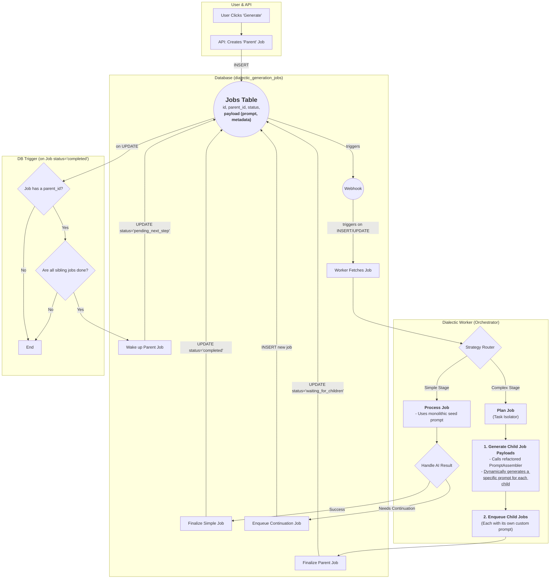

# Model Call Refinement: Continuation Logic

This document provides a complete, verified, and end-to-end implementation plan for introducing response continuation logic into the AI chat service. This feature will allow the system to handle model responses that are truncated due to token limits, ensuring a complete answer is assembled by automatically re-prompting the model.

## Legend

*   `[ ]` 1. Unstarted work step. Each work step will be uniquely named for easy reference. We begin with 1.
    *   `[ ]` 1.a. Work steps will be nested as shown. Substeps use characters, as is typical with legal documents.
        *   `[ ]` 1. a. i. Nesting can be as deep as logically required, using roman numerals, according to standard legal document numbering processes.
*   `[✅]` Represents a completed step or nested set.
*   `[🚧]` Represents an incomplete or partially completed step or nested set.
*   `[⏸️]` Represents a paused step where a discovery has been made that requires backtracking or further clarification.
*   `[❓]` Represents an uncertainty that must be resolved before continuing.
*   `[🚫]` Represents a blocked, halted, or stopped step or has an unresolved problem or prior dependency to resolve before continuing.

## Component Types and Labels

The implementation plan uses the following labels to categorize work steps:

*   `[DB]` Database Schema Change (Migration)
*   `[RLS]` Row-Level Security Policy
*   `[BE]` Backend Logic (Edge Function / RLS / Helpers / Seed Data)
*   `[API]` API Client Library (`@paynless/api` - includes interface definition in `interface.ts`, implementation in `adapter.ts`, and mocks in `mocks.ts`)
*   `[STORE]` State Management (`@paynless/store` - includes interface definition, actions, reducers/slices, selectors, and mocks)
*   `[UI]` Frontend Component (e.g., in `apps/web`, following component structure rules)
*   `[CLI]` Command Line Interface component/feature
*   `[IDE]` IDE Plugin component/feature
*   `[TEST-UNIT]` Unit Test Implementation/Update
*   `[TEST-INT]` Integration Test Implementation/Update (API-Backend, Store-Component, RLS)
*   `[TEST-E2E]` End-to-End Test Implementation/Update
*   `[DOCS]` Documentation Update (READMEs, API docs, user guides)
*   `[REFACTOR]` Code Refactoring Step
*   `[PROMPT]` System Prompt Engineering/Management
*   `[CONFIG]` Configuration changes (e.g., environment variables, service configurations)
*   `[COMMIT]` Checkpoint for Git Commit (aligns with "feat:", "test:", "fix:", "docs:", "refactor:" conventions)
*   `[DEPLOY]` Checkpoint for Deployment consideration after a major phase or feature set is complete and tested.

---

## Implementation Plan: Model Call Continuation

### Phase 1: Backend Implementation

#### 1. [BE] [API] Update Core Backend Types and Schemas

*   `[✅]` 1.a. **Update `ChatApiRequest` Type:**
    *   **File:** `supabase/functions/_shared/types.ts`
    *   **Action:** Add a new optional property `continue_until_complete?: boolean` to the `ChatApiRequest` interface. This will signal the chat handler to initiate the continuation logic.
*   `[✅]` 1.b. **Update `ChatApiRequestSchema`:**
    *   **File:** `supabase/functions/chat/index.ts`
    *   **Action:** Modify the Zod schema (`ChatApiRequestSchema`) to include `continue_until_complete: z.boolean().optional()`. This ensures that incoming requests with this new flag are validated correctly.

#### 2. [TEST-UNIT] Create Test File and Scenarios for Continuation Logic

*   `[✅]` 2.a. **Create New Test File:** `supabase/functions/chat/index.continue.test.ts`
*   `[✅]` 2.b. **Define Test Mocks:** Set up mock AI provider adapters to simulate different `finish_reason` scenarios. One mock should return `finish_reason: 'stop'` to simulate a complete response, and another should return `finish_reason: 'length'` to simulate a truncated response that requires continuation.
*   `[✅]` 2.c. **Implement Test Case 1: Standard Single Call.**
    *   **Action:** Verify that a standard request (with `continue_until_complete` set to `false` or undefined) results in a single call to the AI provider and returns a standard response, regardless of the `finish_reason`.
*   `[✅]` 2.d. **Implement Test Case 2: Two-Part Continuation.**
    *   **Action:** Send a request with `continue_until_complete: true`. The first mocked response should have `finish_reason: 'length'`. Verify the system makes a second call and correctly appends the second response's content to the first. The final combined response should be returned.
*   `[✅]` 2.e. **Implement Test Case 3: Multi-Part Continuation.**
    *   **Action:** Similar to the two-part test, but the mock should return `finish_reason: 'length'` for several consecutive calls before finally returning `finish_reason: 'stop'`. Verify all parts are concatenated correctly.
*   `[✅]` 2.f. **Implement Test Case 4: Continuation Flag Disabled.**
    *   **Action:** Send a request with `continue_until_complete: false` but where the mock returns `finish_reason: 'length'`. Verify that no continuation call is made and the truncated response is returned as-is.
*   `[✅]` 2.g. **Implement Test Case 5: Maximum Loop Iterations (Safety Break).**
    *   **Action:** Create a scenario where the mock *always* returns `finish_reason: 'length'`. Verify that the continuation loop has a safety break (e.g., max 5 iterations) and exits gracefully with an appropriate error or the content it has accumulated so far.

#### 3. [BE] [REFACTOR] Implement the Continuation Service Module

*   `[✅]` 3.a. **Create New Service File:** `supabase/functions/chat/continue.ts`.
*   `[✅]` 3.b. **Implement `handleContinuationLoop` function:**
    *   **Signature:** `async function handleContinuationLoop(initialRequest: ChatApiRequest, ...deps): Promise<CombinedResponse>`
    *   **Logic:** This function will contain the core `while` loop. It will call the AI provider, check the `finish_reason` of the response. If the reason is `'length'` and the loop count is under the safety limit, it should append the response to the message history and call the provider again. It will accumulate the content from all calls and return a single, unified response object.

#### 4. [BE] [REFACTOR] Integrate Continuation Logic into the Main Chat Handler

*   `[✅]` 4.a. **Refactor `handlePostRequest` in `supabase/functions/chat/index.ts`:**
    *   **Action:** Import the new `handleContinuationLoop` function.
*   `[✅]` 4.b. **Implement Conditional Logic:**
    *   **Action:** Inside `handlePostRequest`, add an `if` statement. If `requestBody.continue_until_complete` is `true`, call `handleContinuationLoop`. Otherwise, execute the existing single-call logic.
*   `[✅]` 4.c. **Unify Post-Processing Logic:**
    *   **Action:** Ensure that the final response object, whether from a single call or the continuation loop, is processed the same way for token debiting, database insertion, and the final success response sent to the client.

#### 4.A. [TEST-UNIT] Enhance Dummy Adapter for Realistic Testing
*   `[✅]` 4.A.a. **Update Mock Provider Data:**
    *   `[DB]` **Action:** In the test setup for `ai_providers`, add a `config` JSONB column to the mock data. For the dummy provider, populate this with realistic token limits, e.g., `{"provider_max_input_tokens": 4096, "provider_max_output_tokens": 1024}`.
*   `[✅]` 4.A.b. **Refactor Mock Adapter Logic:**
    *   `[BE]` `[REFACTOR]` **Action:** Modify the mock adapter used in the test suites. It should now:
        1.  Receive the `config` object as part of the provider details.
        2.  Implement a simple token counting utility (e.g., `content.length / 4` as a rough estimate).
        3.  Before "generating" a response, check if the estimated tokens in the input `messages` exceed `provider_max_input_tokens`. If so, it should throw an error simulating a "context window exceeded" failure from a real API.
        4.  When generating a multi-part response for continuation tests, it should use `provider_max_output_tokens` to decide where to "truncate" the response and return `finish_reason: 'length'`.
*   `[✅]` 4.A.c. **Implement New Test Case: Input Tokens Exceeded.**
    *   `[TEST-UNIT]` **Action:** Add a new test case that sends a very large input prompt (exceeding the new mock `provider_max_input_tokens` limit).
    *   **Action:** Verify that the `handlePostRequest` function catches the error from the adapter and returns a graceful error response to the client (e.g., HTTP 413 Payload Too Large).

#### 4.B. [BE] Proactively Validate Input Token Length
*   `[✅]` 4.B.a. **Refactor `handlePostRequest` to Include Pre-flight Token Check:**
    *   `[BE]` `[REFACTOR]` **Action:** In `supabase/functions/chat/index.ts`, locate the part of `handlePostRequest` where the final `adapterChatRequestNormal` object has been constructed, but *before* the `if (continue_until_complete)` block.
    *   **Action:**
        1.  Retrieve the `provider_max_input_tokens` value from the `config` object of the fetched provider details.
        2.  Use the existing tokenizer utility (e.g., `countTokensForMessages`) to calculate the total token count of the `adapterChatRequestNormal.messages` array.
        3.  If the calculated token count exceeds `provider_max_input_tokens`, immediately return a specific error (e.g., `{ error: { message: "Input prompt exceeds the model's maximum context size.", status: 413 } }`) without proceeding to call the AI adapter.
*   `[✅]` 4.B.b. **Add New Test Case for Proactive Validation:**
    *   `[TEST-UNIT]` **Action:** In the `chat/index.sendMessage.test.ts` suite (or other relevant test file), create a new test case where the input message history is intentionally larger than the `provider_max_input_tokens` set in the mock provider data.
    *   **Action:** Assert that `adapter.sendMessage` is **never called**.
    *   **Action:** Assert that the function returns the expected 413 (Payload Too Large) error response.

### Phase 2: Exposing the Feature to Services and the Frontend

#### 5. [UI] Create a Reusable "Continue Until Complete" Component

*   `[✅]` 5.a. **Create New Component File:**
    *   **File:** `apps/web/src/components/common/ContinueUntilCompleteToggle.tsx`
    *   **Action:** Create a new, self-contained component. It will consist of a `Label` and a `Switch`.
*   `[✅]` 5.b. **Implement State Logic:**
    *   **File:** `apps/web/src/components/common/ContinueUntilCompleteToggle.tsx`
    *   **Action:** The component will use the `useAiStore` hook to get the current `continueUntilComplete` boolean state and the `setContinueUntilComplete` action. The `Switch` will be bound to this state.
*   `[✅]` 5.c. **Add Unit Tests:**
    *   `[TEST-UNIT]` **File:** `apps/web/src/components/common/ContinueUntilCompleteToggle.test.tsx`
    *   **Action:** Create a test that renders the component, simulates a click on the switch, and verifies that the `setContinueUntilComplete` action in the mock store is called with the correct value.

#### 6. [BE] Update Inter-Service Communication (`dialectic-service`)

*   `[✅]` 6.a. **Update `callUnifiedAIModel` Signature in `callModel.ts`:**
    *   **File:** `supabase/functions/dialectic-service/callModel.ts`
    *   **Action:** Modify the `callUnifiedAIModel` function signature to accept the types' new optional boolean parameter: `continueUntilComplete?: boolean`.
*   `[✅]` 6.b. **Pass Flag to `/chat` Invocation:**
    *   **File:** `supabase/functions/dialectic-service/callModel.ts`
    *   **Action:** Inside `callUnifiedAIModel`, when constructing the `chatApiRequest` object, include the `continue_until_complete: continueUntilComplete` property. This will pass the flag to the `/chat` edge function.
*   `[✅]` 6.c. **Update `generateContributions` to Request Continuation:**
    *   **File:** `supabase/functions/dialectic-service/generateContribution.ts`
    *   **Action:** In the `generateContributions` function, locate the call to `deps.callUnifiedAIModel` (inside the `modelPromises.map`) and pass the value for the new `continueUntilComplete` parameter that was passed in from the API.
    *   **Rationale:** The Dialectic Service requires full, uninterrupted responses to function correctly, so this is enabled by default in the type, but the user can turn it off, so we need to pass their setting in case they decided they don't want the response to continue until complete.
*   `[✅]` 6.d. **Acknowledge the `submitStageResponses` Workflow:**
    *   `[DOCS]` **File:** `docs/implementations/Current/Checklists/Current/Model Call Refinement.md` (Self-reference)
    *   **Action:** Add a note to this checklist clarifying that `submitStageResponses` is the function that prepares the prompt for the next stage, but `generateContributions` is the function that consumes that prompt and makes the actual AI call. This is a critical context for understanding the end-to-end flow.

#### 7. [API] Update the Frontend API Client

*   `[✅]` 7.a. **Update `ChatApiRequest` Interface in types package:**
    *   **File:** `packages/types/src/api.types.ts` (or equivalent central type definition file)
    *   **Action:** Add the optional `continue_until_complete?: boolean` property to the `ChatApiRequest` interface so that it's available across the frontend packages.
*   `[✅]` 7.b. **Pass Parameter in `sendChatMessage` Implementation:**
    *   **File:** `packages/api/src/ai.api.ts`
    *   **Action:** The `sendChatMessage` function already accepts a `ChatApiRequest` object. No signature change is needed, but we must ensure the `continue_until_complete` flag, when present in the data object, is correctly passed in the body of the `POST` request to `/chat`.

#### 8. [STORE] Integrate State Management

*   `[✅]` 8.a. **Update `AiState` Interface:**
    *   **File:** `packages/store/src/aiStore.ts`
    *   **Action:** Add a new state property `continueUntilComplete: boolean` to the `AiState` interface.
    *   **Action:** Update the `initialAiStateValues` object to include `continueUntilComplete: true` as the default value.
*   `[✅]` 8.b. **Create New Action/Reducer:**
    *   **File:** `packages/store/src/aiStore.ts`
    *   **Action:** Add a `setContinueUntilComplete(shouldContinue: boolean)` action to the `AiStore`. This will be a simple setter: `set({ continueUntilComplete: shouldContinue })`.
*   `[✅]` 8.c. **Update `handleSendMessage` Logic:**
    *   **File:** `packages/store/src/ai.SendMessage.ts`
    *   **Action:** In the `handleSendMessage` function, read the `continueUntilComplete` value from the store's state using `aiStateService.getAiState()`.
    *   **Action:** In the `coreMessageProcessing` function, when constructing the `apiRequest` object, pass the `continue_until_complete` flag from the state.

#### 9. [UI] Integrate the Reusable Toggle Component

*   `[✅]` 9.a. **Integrate into Standard Chat Input:**
    *   **File:** `apps/web/src/components/ai/ChatInput.tsx`
    *   **Action:** Import and place the `<ContinueUntilCompleteToggle />` component within the main `div` of the chat input, likely alongside the `MessageSelectionControls`.
*   `[✅]` 9.b. **Integrate into Dialectic Service UI:**
    *   **File:** `apps/web/src/components/dialectic/SessionInfoCard.tsx`
    *   **Action:** Import and place the `<ContinueUntilCompleteToggle />` component near the `<GenerateContributionButton />`. This gives the user a clear option to enable full responses before starting a dialectic generation.
*   `[✅]` 9.c. **Update Dialectic `generateContributions` call:**
    *   **File:** `apps/web/src/components/dialectic/GenerateContributionButton.tsx`
    *   **Action:** The `generateContributions` store action does not need to be changed here, as the flag will be read from the store. However, the `callUnifiedAIModel` in the backend (`dialectic-service`) *should be updated* to check for this flag if it is passed. **Decision:** For the dialectic service, we will force `continue_until_complete: true` on the backend for now to ensure its core logic always gets full responses. The UI toggle will primarily affect the standard user-facing chat. This simplifies the initial implementation.

### Phase 3: Finalization and Deployment
#### 10. [TEST-E2E] [DOCS] [COMMIT] [DEPLOY] Finalization
*   `[ ]` 10.a. **Create End-to-End Test:**
    *   `[TEST-E2E]` **Action:** Using a framework like Playwright or Cypress, create a test that:
        1.  Navigates to the chat page.
        2.  Finds and clicks the "Full Response Mode" switch to enable it.
        3.  Sends a message that is known (via mocks) to produce a multi-part response.
        4.  Verifies that the final message displayed in the UI is the complete, concatenated message.
*   `[✅]` 10.b. **Run All Tests:**
    *   **Action:** Execute all unit, integration, and E2E tests across all affected packages (`supabase/functions`, `packages/api`, `packages/store`, `apps/web`) to ensure no regressions were introduced.
*   `[ ]` 10.c. **Update All Relevant Documentation:**
    *   `[DOCS]` **Action:** Update API documentation to include the new `continue_until_complete` flag. Update user guides to explain the new "Full Response Mode" feature. Update relevant service READMEs.
*   `[✅]` 10.d. **Git Commit:**
    *   `[COMMIT]` **Action:** Commit the changes with a conventional commit message, e.g., `feat(chat): implement and surface response continuation feature`.
*   `[ ]` 10.e. **Deployment:**
    *   `[DEPLOY]` **Action:** Deploy the new functionality to staging and then production environments after all tests pass and the code has been reviewed and approved.

---

### Phase 4: Architectural Refactor for Asynchronous Processing

This phase addresses the critical 150-second timeout limitation of Supabase Edge Functions by refactoring the `generateContributions` workflow from a synchronous request-response model to an asynchronous, background job-based architecture. This is a foundational change that not only fixes the timeout issue but also enables the complex, long-running processes required for the advanced Dialectic Scaling phases.

#### 11. [DB] Create the Job Queue Table

*   `[✅]` 11.a. **Create Database Migration for `dialectic_generation_jobs`:**
    *   `[DB]` **Action:** Create a new SQL migration file to define the table that will act as our job queue.
    *   `[DB]` **Table Schema:** `dialectic_generation_jobs`
        *   `id`: `uuid`, primary key, default `gen_random_uuid()`
        *   `session_id`: `uuid`, not null, foreign key to `public.dialectic_sessions`
        *   `stage_slug`: `text`, not null
        *   `iteration_number`: `integer`, not null
        *   `payload`: `jsonb`, not null (stores input parameters like `model_selections`, `continue_until_complete`)
        *   `status`: `text`, not null, default `'pending'` (e.g., 'pending', 'processing', 'completed', 'failed', 'retrying', 'retry_loop_failed')
        *   `attempt_count`: `integer`, not null, default `0`
        *   `max_retries`: `integer`, not null, default `3` (can be overridden by payload)
        *   `created_at`: `timestamptz`, not null, default `now()`
        *   `started_at`: `timestamptz`, nullable
        *   `completed_at`: `timestamptz`, nullable
        *   `results`: `jsonb`, nullable
        *   `error_details`: `jsonb`, nullable

#### 12. [BE] Create the Background Worker Function

*   `[✅]` 12.a. **Create a New `dialectic-worker` Edge Function:**
    *   `[BE]` **Action:** Create a new, separate Edge Function (`supabase/functions/dialectic-worker/index.ts`) dedicated to processing jobs from the queue.
    *   `[TEST-UNIT]` Write RED unit tests for the new dialectic-worker function that proves it will correctly replace `generateContribution`. Use the existing `generateContribution` test file as a model for what functions to test. 
    *   `[BE]` Implement the `dialecticWorker` function to replace `generateContribution` functionality. 
    *   `[TEST-UNIT]` Run GREEN unit tests to prove that `dialecticWorker` passes all tests. 
    *   `[REFACTOR]` Refactor the `generateContribution` for DRY and SRP. Produce reusable utility functions for repeated logic. Reduce and streamline core `generateContribution` logic while preserving functionality. 
    *   `[TEST-UNIT]` Write RED unit tests for the logic exported from `generateContribution` into utility files. 
    *   `[BE]` Implement the utility functions exported from `generateContribution` into utility files. 
    *   `[TEST-UNIT]` Run GREEN unit tests to prove the utility functions pass. 
    *   `[TEST-UNIT]` Run GREEN unit tests to prove the `dialecticWorker` function passes and correctly ports existing `generateContribution` function to a job queue / worker structure. 
*   `[✅]` 12.b. **Implement Granular Notifications and Job Statuses:**
    *   `[BE]` **Action:** The worker will fetch a pending job, increment its `attempt_count`, and update its database status to `'processing'`.
    *   `[BE]` **Action:** It will contain the core, long-running logic from the original `generateContributions` function. If the AI call fails, it will check if `attempt_count < max_retries`.
        *   If it can retry, it updates the status to `'retrying'`, records the error in `error_details`.
        *   If retries are exhausted, it sets the status to `'retry_loop_failed'`.
    *   `[BE]` **Action:** On complete success (no continuation needed), it populates `results` and sets the status to `'completed'`.
    *   `[BE]` **Action:** For each job status change (`'processing'`, `'retrying'`, `'retry_loop_failed'`, `'completed'`), the worker will make an RPC call to `create_notification_for_user` to provide real-time updates to the user.
*   `[✅]` 12.c. **Implement Job-Based Continuation Logic:**
    *   `[BE]` **Action:** Refactor `chat/continue.ts` to extract the core continuation logic into a reusable utility function in `_shared/utils/continue_util.ts`. Write RED/GREEN/REFACTOR tests for the new `continue_util` file. Update `chat/continue` to use the new util. Run `continue` tests to verify the function performs exactly as it does now. 
    *   `[BE]` **Action:** The `dialectic-worker` will no longer use the `handleContinuationLoop` from the `/chat` service. Instead, it will make a single, non-continuing call to `callUnifiedAIModel`.
    *   `[BE]` **Action:** The `dialectic-worker` will use the `continue_util` function for continuation. 
        *   `[BE]` **Action:** After receiving a response, it will check the `finish_reason` provided by the AI adapter.
        *   `[BE]` **Action:** If `finish_reason` is `'length'` and the `continue_until_complete` flag in the job's payload is `true`, the worker will enqueue a **new job** in the `dialectic_generation_jobs` table.
        *   `[BE]` **Action:** The payload for this new continuation job **must** include the necessary context to resume, such as the `contribution_id` of the record being updated and the full, updated message history (including the partial response just received).
        *   `[BE]` **Action:** The current job will then be marked as `'completed'`, as its sole responsibility was to process one chunk.
*   `[✅]` 12.d. **Implement Incremental and Idempotent File Saving:**
    *   `[REFACTOR]` **Action:** The logic for creating the `uploadContext` and calling the `fileManager` from the old `generateContribution` function will be extracted into a reusable utility to ensure DRY principles are followed.
    *   `[BE]` **Action:** For a new contribution, the **first** job in a potential continuation chain will be responsible for creating the initial `dialectic_contributions` record. This creates a stable `contribution_id` that serves as the `original_model_contribution_id`.
    *   `[BE]` **Action:** This `original_model_contribution_id` will be passed in the payload of all subsequent continuation jobs for this contribution, referenced as the `target_contribution_id`.
    *   `[BE]` **Action:** When a continuation job runs, the `fileManager` uses the `target_contribution_id` to fetch the existing partial file from storage. It then appends the new content from the AI response and **overwrites** the file in storage with the updated, longer content.
    *   `[BE]` **Action:** Instead of updating the original record, the `fileManager` creates a **new** `dialectic_contributions` record for each continuation. It links these records by setting `original_model_contribution_id` to the ID of the very first contribution and sets `is_latest_edit` to `true` on the newest record, while marking the previous one as `false`. This creates a versioned, immutable history while ensuring only one canonical file exists in storage.
*   `[✅]` 12.e. **Set Up Database Webhook Trigger:**
    *   `[BE]` `[DB]` **Action:** The worker function will be invoked automatically via a database webhook/trigger that fires on `INSERT` into the `dialectic_generation_jobs` table. This provides near-instant, event-driven job processing.
*   `[ ]` 12.f. **Add Focused Unit and Integration Tests for Job Continuation:**
    *   `[TEST-UNIT]` **File:** `supabase/functions/dialectic-worker/index.test.ts`
    *   `[TEST-UNIT]` **Action:** Create new tests to verify the job-based continuation.
    *   `[TEST-UNIT]` **Mocks:** Mock `callUnifiedAIModel` to return a `finish_reason` of `'length'`. Mock the database insert to verify a new job is enqueued.
    *   `[TEST-UNIT]` **Assertions:** Assert that when a job receives a `'length'` finish reason, it correctly creates a new job with the updated context in its payload. Verify the original job is marked `'completed'`. Test the case where `continue_until_complete` is `false` and ensure no new job is created.
    *   `[TEST-INT]` **Action:** Write integration tests to verify the file-saving logic. Assert that the first job creates a file and that a subsequent continuation job correctly appends to and overwrites that same file, resulting in a single, concatenated final artifact.

#### 13. [REFACTOR] [BE] [TEST-UNIT] [TEST-INT] Job Enqueuing and Processing Architecture Refinement

*   `[✅]` **a. [BE] [REFACTOR] Refactor `generateContributions` to a Multi-Job Enqueuer**
    *   `[✅]` i. **Update Return Type:** The function's TypeScript return type signature in `supabase/functions/dialectic-service/generateContribution.ts` must be `Promise<{ success: boolean; data?: { job_ids: string[] }; error?: ... }>`.
    *   `[✅]` ii. **Implement Iteration:** The function's logic must iterate through the `selectedModelIds` array provided in the `payload`.
    *   `[✅]` iii. **Create Discrete Job Payloads:** Inside the loop, for each `modelId`, a new, specific `jobPayload` must be created. This payload should be a copy of the original request payload, with two critical changes:
        1.  The `selectedModelIds` array property must be **removed**.
        2.  A new property, **`model_id: string`**, must be added, containing the single `modelId` for that specific job.
    *   `[✅]` iv. **Enqueue Discrete Jobs:** For each model, execute a separate `dbClient.from('dialectic_generation_jobs').insert(...)` call to create a distinct job record in the database.
    *   `[✅]` v. **Aggregate Job IDs:** Collect each new `job.id` into a `jobIds` array.
    *   `[✅]` vi. **Return Array of Job IDs:** After the loop completes, the function must return a `202 Accepted` response to the client with a body containing the array of all created job IDs, in the format: `{ data: { job_ids: string[] } }`.

*   `[✅]` **b. [BE] [REFACTOR] Simplify `dialectic-worker` for Discrete Jobs**
    *   `[✅]` i. **Identify File:** `supabase/functions/dialectic-worker/processSimpleJob.ts`.
    *   `[✅]` ii. **Refactor Action:** The `processSimpleJob` function must be refactored to process only a single model. The `for...of` loop that iterates over a `selectedModelIds` property must be removed.
    *   `[✅]` iii. **Simplification Action:** All logic within the function should be simplified to directly use the new, unambiguous string property from the payload: **`job.payload.model_id`**.

*   `[✅]` **c. [TEST-UNIT] [TEST-INT] Update All Tests to Validate the New Architecture**
    *   `[✅]` i. **Update `generateContributions` Unit Tests:**
        1.  **File:** `supabase/functions/dialectic-service/generateContribution.test.ts`
        2.  **Action:** The unit tests must be modified to assert that when the function is called with multiple model IDs, the database `insert` method is invoked multiple times and that the function's return value is an object containing an array of job IDs.
    *   `[✅]` ii. **Update `processSimpleJob` Unit Tests:**
        1.  **File:** `supabase/functions/dialectic-worker/processSimpleJob.test.ts`
        2.  **Action:** The tests must be refactored to reflect the worker's simplified logic. Each test should set up a job payload that contains the new `model_id` string property instead of the `selectedModelIds` array.
    *   `[✅]` iii. **Update the End-to-End Integration Test:**
        1.  **File:** `supabase/integration_tests/services/dialectic_pipeline.integration.test.ts`
        2.  **Action:** The integration test must be updated to validate the correct architecture.
            *   a. When invoking the `dialectic-service`, the test must assert that the immediate HTTP response contains the `{ data: { job_ids: [...] } }` structure.
            *   b. The `executePendingDialecticJobs` test helper must expect to find **multiple** pending job records in the database after the service call.
            *   c. The test assertions must confirm that the worker is invoked for **each** of these discrete jobs and that the final contributions are all created successfully.

---

### Phase 5: Backend Notification Verification

#### 14. [TEST-UNIT] Verify Worker Notification Dispatch
*   `[ ]` 14.a. **Goal:** Read the worker's source code to confirm that it dispatches notifications at every critical step before building the frontend to listen for them.
*   `[ ]` 14.b. **File:** `supabase/functions/dialectic-worker/index.ts`
*   `[✅]` 14.c. **Verification Checklist:**
    *   `[✅]` 14.c.i. **On Contribution Success:** Is a `'dialectic_contribution_received'` notification sent immediately after each individual contribution is successfully saved by the `FileManagerService`?
    *   `[✅]` 14.c.ii. **On Continuation:** Is a `'continuing'` flag with a continuation value added to a `'dialectic_contribution_received'` notification if the contribution is going to continue? 
    *   `[✅]` 14.c.iii. **On Job Failure:** In the main error handling block, is a `'contribution_generation_failed'` notification sent with the session ID and error details?
    *   `[✅]` 14.c.iv. **On Job Completion:** Is the final `'contribution_generation_complete'` notification still sent after all work for a job is finished?

---

### Phase 6: Adapt Frontend for Asynchronous Job-Based Flow

This phase adapts the frontend to handle the asynchronous, job-based architecture. The core challenge is twofold: 1) The UI must stop waiting for a single, long-running API request and instead react to a series of real-time events. 2) The state management must be robust enough to handle deep, nested updates to its core data objects without the UI missing those changes, a common problem with Zustand's default shallow comparison. This plan addresses both challenges by introducing a job-tracking system, client-side placeholder objects, and the `immer` library for guaranteed immutable updates.

#### 15. [STORE] [REFACTOR] Update Dialectic State Store for Job Tracking
*   `[✅]` 15.a. `[STORE]` **Modify State and Adopt `immer`:**
    *   **File:** `packages/store/src/dialecticStore.ts`
    *   **Action:** Change `generatingSessions` state from `{ [sessionId: string]: boolean }` to `{ [sessionId: string]: string[] }`. This is critical for tracking multiple jobs per session, which is required for both parallel processing (like the `n*m` calls in the Antithesis stage) and chained jobs (like those used for response continuation).
    *   **Action:** Integrate the existing `immer` dependency as middleware for the Zustand store. This solves the shallow-comparison problem where updates to nested properties (e.g., a contribution's status deep within the `currentProjectDetail` object) do not trigger UI re-renders. `immer` ensures that any update, no matter how deep, produces a new top-level state object, guaranteeing UI reactivity.
*   `[✅]` 15.b. `[STORE]` `[REFACTOR]` **Update `generateContributions` Action & Introduce Placeholders:**
    *   **File:** `packages/store/src/dialecticStore.ts`
    *   **Action:** Modify the `generateContributions` action to handle the `202 Accepted` response, which will return `{ job_ids: string[] }`.
    *   **Action:** To provide immediate user feedback, this action will use `immer` to instantly add **client-side placeholder contribution objects** to the state *before* the API call completes.
    *   **Details:** For each model selected, create a placeholder object in the `currentProjectDetail.dialectic_sessions[...].dialectic_contributions` array. This object should contain a predictable temporary ID (e.g., `[sessionId]-[modelId]-[iteration]`), the `model_name`, `model_id`, and a `status: 'pending'`. This allows the UI to render a "pending" card for each expected contribution immediately.
    *   **Action:** When the API call returns the `job_ids`, append them to the `generatingSessions[sessionId]` array to begin official tracking.

#### 16. [STORE] [REFACTOR] Enhance Notification Handling for Contribution Lifecycle
*   `[✅]` 16.a. `[STORE]` `[REFACTOR]` **Expand Notification Routing:**
    *   **File:** `packages/store/src/notificationStore.ts`
    *   **Action:** Update the `handleIncomingNotification` function to route the full suite of contribution lifecycle notifications to the `dialecticStore` **without** creating visible UI toasts. These events are for internal state updates. This includes: `'contribution_generation_started'`, `'dialectic_contribution_started'`, `'contribution_generation_retrying'`, `'dialectic_contribution_received'`, `'contribution_generation_failed'`, and `'contribution_generation_complete'`.
*   `[✅]` 16.b. `[STORE]` **Implement `immer`-powered Lifecycle Event Handlers:**
    *   **File:** `packages/store/src/dialecticStore.ts`
    *   **Action:** Create a set of internal handler functions, called by the main notification listener, that use `immer` to find and update the state of the placeholder contributions.
    *   **`_handleContributionStarted(payload)`**: Finds the corresponding placeholder contribution (using its temporary ID) and updates its `status` to `'generating'`. The UI should react by changing the placeholder's appearance (e.g., adding a spinner).
    *   **`_handleContributionRetrying(payload)`**: Finds the placeholder, updates its `status` to `'retrying'`, and stores the error message from the payload onto the placeholder object so the UI can inform the user about the retry attempt.
    *   **`_handleContributionReceived(payload)`**: This is the core data update. It finds the matching placeholder and **replaces it entirely** with the complete, real `DialecticContribution` object from the notification's payload. It also removes the completed `job_id` from the `generatingSessions` array. If the `is_continuing: true` flag is present, the overall process status remains `'generating'`, as more data is expected.
    *   **`_handleGenerationFailed(payload)`**: Handles both partial and catastrophic failures. If the payload contains a `modelId`, it finds that model's placeholder and sets its `status` to `'failed'`, storing the error details. If there is no `modelId`, it finds all non-complete placeholders for the session and marks them as `'failed'`. It then removes the associated `job_id`.
    *   **`_handleGenerationComplete(payload)`**: This is the final success signal for the entire multi-model job. It clears the overall `contributionGenerationStatus` and removes any remaining completed job IDs from the tracking array.

#### 17. [UI] [TEST-UNIT] Verify UI Reactivity to Asynchronous State Changes
*   `[✅]` 17.a. `[UI]` **Verify Generate Button State:**
    *   **File:** `apps/web/src/components/dialectic/GenerateContributionButton.tsx` (or similar).
    *   **Action:** Read the component to confirm its `disabled` and text states are correctly driven by the presence of a `job_id` in `generatingSessions[sessionId]`. If it's a string, the button should be in a "generating" state.
*   `[✅]` 17.b. `[UI]` **Verify Contribution Display:**
    *   **File:** `apps/web/src/components/dialectic/SessionContributionsDisplayCard.tsx` (or similar).
    *   **Action:** Read the component to confirm it correctly renders the placeholder cards upon job initiation and that their state (e.g., showing a spinner for `'generating'`, an error message for `'retrying'` or `'failed'`) updates in real-time as the various lifecycle notifications are processed by the store.
*   `[✅]` 17.c `[UI]` **Verify Generate Button Conditionals:**
    *   Cannot generate when seed prompt does not exist (this means each stage must be completed IN ORDER for the generation button to be active on the next stage)
    *   Cannot generate when seed prompt is not loaded
    *   Cannot generate when models aren't chosen
    *   Can generate when prior stage is complete, models are chosen, and seed prompt exists and is loaded
    *   Can generate when a stage has failed
    *   Can generate when a stage has already been generated - **NOTE!** This creates a new iteration! 
    *   **Future Work:** 
        *   An iteration switcher is required for the user to backtrack
        *   A new iteration branches the project session at that point. 
        *   All future stages use the new iteration. 
        *   Regenerate a **specific** contribution while preserving the existing contributions 
---

### Phase 7: [REFACTOR] Implement Asynchronous Task Planning & Orchestration

This phase refactors the worker architecture to support complex, multi-step stages (like Antithesis and Synthesis) by replacing the synchronous `task_isolator` with an asynchronous planning and orchestration model. This model uses the `task_isolator` as a **planner** to break down large jobs into smaller, independent "child" jobs, each with its own dynamically generated prompt. The execution of these jobs is managed by the existing queue system, and their completion is orchestrated by a new database trigger.

#### 18. [BE] [REFACTOR] Make the Prompt Assembler More Flexible

*   `[✅]` 18.a. **Refactor `PromptAssembler` for Granular Use:**
    *   `[REFACTOR]` **File:** `supabase/functions/_shared/prompt-assembler.ts`
    *   **Action:** Refactor the class to expose more granular public methods.
    *   **Action:** Create a new `gatherContext(..., overrideContributions?: DialecticContribution[])` method. This method's core logic will be to assemble the `DynamicContextVariables`. Crucially, if the optional `overrideContributions` array is provided, it will use that array to build the `prior_stage_ai_outputs` variable instead of querying the database based on `input_artifact_rules`. This allows the `task_isolator` to inject precisely scoped inputs.
    *   **Action:** Create a new `render(stage, context)` method that takes the stage and the generated context object and returns the final rendered prompt string by calling `prompt-renderer.ts`.
*   `[✅]` 18.b. **Add Unit Tests for Refactored `PromptAssembler`:**
    *   `[TEST-UNIT]` **Action:** Create new unit tests that verify the `gatherContext` method correctly uses the `overrideContributions` when provided and falls back to the default DB query when it is not.

#### 19. [BE] [REFACTOR] Redefine `task_isolator` as a Planner and Dynamic Prompt Generator

*   `[✅]` 19.a. **Rewrite `task_isolator.ts`:**
    *   `[REFACTOR]` **File:** `supabase/functions/dialectic-worker/task_isolator.ts`
    *   `[REFACTOR]` **Action:** Rename the primary exported function to `planComplexStage(...)`. Its new responsibility is **not** to execute AI calls, but to **plan** them.
    *   `[REFACTOR]` **Action:** The function will receive a "parent" job for a complex stage (e.g., Antithesis). It will first fetch all necessary source documents for the entire stage (e.g., all Thesis contributions).
    *   `[REFACTOR]` **Action:** It will then loop through the source documents and models according to the `processing_strategy`. In each loop, it will:
        1.  Call the refactored `promptAssembler.gatherContext()` with a precisely scoped `overrideContributions` array (e.g., just one thesis).
        2.  Call `promptAssembler.render()` to generate a unique prompt for that specific sub-task.
        3.  Create a "child" job object, embedding the unique prompt and a `parent_job_id` in its `payload`.
    *   `[REFACTOR]` **Action:** The function will return an array of these fully-formed child job objects.

#### 20. [BE] [REFACTOR] Refactor Worker into a Strategy-Based Router and Component Modules

This phase refactors the monolithic `processJob` function into a lightweight **Strategy Router**. The router's sole responsibility is to inspect an incoming job and delegate it to the correct processing module based on its configured strategy (`simple` vs. `task_isolation`). This is a pure backend refactoring that follows a strict Test-Driven Development (TDD) cycle to guarantee correctness and prevent regressions.

*   `[✅]` 20.a. **Confirm File Structure:**
    *   `[REFACTOR]` **Action:** Verify that the following files have been created in `supabase/functions/dialectic-worker/`. The TDD process below will populate them.
        *   `[✅]` `handleJob.ts` & `handleJob.test.ts` (The current `index.ts` serves as the initial `handleJob`).
        *   `[✅]` `processJob.ts` & `processJob.test.ts`.
        *   `[✅]` `processSimpleJob.ts` & `processSimpleJob.test.ts`.
        *   `[✅]` `processComplexJob.ts` & `processComplexJob.test.ts`.
        *   `[✅]` `continueJob.ts` & `continueJob.test.ts`.
        *   `[✅]` `retryJob.ts` & `retryJob.test.ts`.

*   `[✅]` 20.b. **Isolate Simple Job Logic (TDD Cycle 1):**
    *   `[✅]` 20.b.i. `[TEST-UNIT]` **(RED)** In the new `processSimpleJob.test.ts`, write a failing test by copying a relevant test case for a simple stage (e.g., `hypothesis`) from the original, monolithic test suite. Modify it to call the (currently empty) `processSimpleJob` function directly.
    *   `[✅]` 20.b.ii. `[BE]` **(GREEN)** Make the test pass by moving the *entire body* of the existing `processJob` function into the `processSimpleJob` function. Add the necessary imports. This transfers the old logic to its new home.
    **Failure & Retry Logic:**
    *   **Initial AI Call Failure:** A test where the first call to `deps.callUnifiedAIModel` returns an error, triggering the retry mechanism.
    *   **Retry Success:** A test where the AI call fails once but succeeds on a subsequent retry attempt.
    *   **Retry Loop Exhaustion:** A test where a model consistently fails, exhausting all `max_retries` and resulting in a `retry_loop_failed` status for the job.
    *   **Partial Failure:** A test with multiple `selectedModelIds` where some succeed and others fail after all retries.
    **Continuation Logic:**
    *   **Continuation Enqueued:** A test where the AI response has `finish_reason: 'length'`, verifying that `continueJob` is called and a new continuation job is successfully enqueued. The current job should then be marked as `completed`.
    *   **Continuation Input:** A test for a job that is *itself* a continuation (i.e., `payload.target_contribution_id` is present). This should verify that the worker correctly downloads the previous content and prepends it to the new AI-generated content.
    *   **Continuation Download Failure:** A test where a continuation job fails because the `downloadFromStorage` call for the previous content fails.
    **Error Handling and Edge Cases:**
    *   **Invalid Payload:** Tests where the initial payload is missing required fields like `stageSlug` or `projectId`.
    *   **Database Errors:** Tests that mock failures from `dbClient` calls (e.g., failing to fetch the session or update the job status) to ensure the main `try/catch` block handles them gracefully.

*   `[✅]` 20.c. **Implement the Strategy Router in `processJob` (TDD Cycle 2):**
    *   `[✅]` 20.c.i. `[TEST-UNIT]` **(RED)** In `processJob.test.ts`, write a failing test for the "Simple Route". Mock the database call to the `dialectic_stages` table to return a configuration *without* a `task_isolation` strategy. Assert that `processSimpleJob` is called.
    *   `[✅]` 20.c.ii. `[BE]` **(GREEN)** Make the test pass by deleting the old monolithic logic from `processJob.ts` and implementing the new router logic: fetch the stage config, inspect its `input_artifact_rules`, and call `processSimpleJob`.
    *   `[✅]` 20.c.iii. `[TEST-UNIT]` **(RED)** In `processJob.test.ts`, write a failing test for the "Complex Route". Mock the database call to return a stage configuration *with* `processing_strategy.type === 'task_isolation'`. Assert that `processComplexJob` is called.
    *   `[✅]` 20.c.iv. `[BE]` **(GREEN)** Make the test pass by adding the `else` condition to the router in `processJob.ts` to correctly delegate to `processComplexJob`.

*   `[✅]` 20.d. **Implement the Complex Job Planner (TDD Cycle 3):**
    *   `[✅]` 20.d.i. `[TEST-UNIT]` **(RED)** In `processComplexJob.test.ts`, write a failing test. Mock the `task_isolator.planComplexStage` function to return a predefined array of "child job" objects. Assert that the database is called to `insert` these child jobs and that the original parent job's status is `update`d to `'waiting_for_children'`.
    *   `[✅]` 20.d.ii. `[BE]` **(GREEN)** Make the test pass by implementing the logic in `processComplexJob.ts`: call the mocked planner, insert the returned child jobs, and update the parent job's status.

*   `[✅]` 20.e. **Final Verification and Cleanup:**
    *   `[✅]` 20.e.i. `[TEST-INT]` **Prove Functional Equivalence.** Run the entire original `index.test.ts` suite. All tests must pass, proving that the refactoring did not introduce any regressions. This is the most critical validation step.
    *   `[✅]` 20.e.ii. `[TEST-UNIT]` **Cleanup.** Once equivalence is proven, the business logic tests from `index.test.ts` can be moved to their respective module test files (`handleJob.test.ts`, etc.). The `index.test.ts` suite can be deprecated or simplified to only test that the edge function entry point correctly calls `handleJob`.
    *   `[✅]` 20.e.iii. `[COMMIT]` **Commit.** Commit the completed refactoring with a message like `refactor(dialectic-worker): decompose worker into modular, testable components`.

#### 21. [DB] [BE] Implement the Parent/Child Job Orchestration Trigger

*   `[✅]` 21.a. **Add `parent_job_id` to Jobs Table:**
    *   `[DB]` **File:** `supabase/migrations/20250716153526_add_processing_strategy_to_dialectic_stages.sql`
    *   `[DB]` **Action:** Create a new migration to add a nullable `parent_job_id` (UUID, foreign key to `dialectic_generation_jobs.id`) to the `dialectic_generation_jobs` table.
*   `[✅]` 21.b. **Create Database Orchestration Function:**
    *   `[DB]` **File:** `supabase/migrations/20250716153526_add_processing_strategy_to_dialectic_stages.sql`
    *   **Action:** Create a new PostgreSQL function, e.g., `handle_child_job_completion()`. This function will be triggered whenever a job's `status` is updated to `'completed'`.
    *   **Function Logic:**
        1.  Check if the completed job has a `parent_job_id`. If not, exit.
        2.  If it does, count all "sibling" jobs (those with the same `parent_job_id`).
        3.  Count all *completed* sibling jobs.
        4.  If `total_siblings === completed_siblings`, update the parent job's status from `'waiting_for_children'` to `'pending_next_step'`. This change will fire the webhook again, sending the parent job back to the worker for the next phase of a multi-step process (like the reduction step in Synthesis).
*   `[✅]` 21.c. **Add Integration Test for Orchestration:**
    *   `[TEST-INT]` **File:** `supabase/integration_tests/triggers/dialectic_job_orchestration.integration.test.ts`
    *   `[TEST-INT]` **Action:** Write an integration test that simulates the full flow: create a parent job, have the worker plan and insert child jobs, mark all child jobs as complete one-by-one, and assert that the database trigger correctly updates the parent job's status to `'pending_next_step'` only after the final child is complete.

---

### Phase 8: Implement Real-time Progress UI & Apply to Stages

This phase focuses on building the frontend components to consume the generic progress notifications and then activating the new backend architecture for the relevant Dialectic stages by updating their configuration in the database.

#### 22. [STORE] [UI] Handle Generic Progress Notifications on the Frontend

*   `[✅]` 22.a. **Update Central Notification Listener:**
    *   `[STORE]` **File:** `packages/store/src/notificationStore.ts`
    *   **Action:** Add a `case` or `if` condition to the `handleIncomingNotification` function to specifically handle the `'dialectic_progress_update'` type. This handler should route the full payload to a new, dedicated handler in the `dialecticStore`.
*   `[✅]` 22.b. **Update State Without Creating a Visible Notification Toast:**
    *   `[STORE]` **File:** `packages/store/src/dialecticStore.ts`
    *   **Action:** When a `'dialectic_progress_update'` notification is received, the handler must **not** trigger a standard UI notification toast. These are for driving the progress bar only.
    *   `[STORE]` **Action:** Create a new action (e.g., `setSessionProgress(payload)`) that uses `immer` to update a **new, separate piece of state**: `sessionProgress: { [sessionId: string]: ProgressData }`, where `ProgressData` is `{ current_step: number, total_steps: number, message: string }`. This isolates the progress bar's state from the main contribution data state.
*   `[ ]` 22.c. **Refine Notification System for Robustness and Architectural Alignment:**
    *   `[✅]` 22.c.i. **Phase 1: Backend - Formalize Notification Creation and Payloads.**
        *   `[✅]` 22.c.i.1. **Create Centralized Notification Service.**
            *   `[✅]` 22.c.i.1.a. `[TEST-UNIT]` **(RED)** Create a new test file, `supabase/functions/_shared/utils/notification.service.test.ts`. Write failing tests that attempt to instantiate a `NotificationService` and call its methods (e.g., `createContributionStartedEvent`), asserting that the returned objects have the correct, complete structure for both internal events and user-facing notifications.
            *   `[✅]` 22.c.i.1.b. `[BE]` `[REFACTOR]` **(GREEN)** Create the file `supabase/functions/_shared/utils/notification.service.ts`. Implement the `NotificationService` class with strongly-typed public methods that construct and return complete, validated payloads for every notification and event type.
            *   `[✅]` 22.c.i.1.c. `[TEST-UNIT]` **(PROVE)** Run the tests in `notification.service.test.ts` to prove they pass.
        *   `[✅]` 22.c.i.2. **Enhance `notifications` Table for Rich Data.**
            *   `[✅]` 22.c.i.2.a. `[DB]` Create a new database migration file.
            *   `[✅` 22.c.i.2.b. `[DB]` In the migration, alter the `public.notifications` table to add the following nullable columns: `title TEXT`, `message TEXT`, and `link_path TEXT`. Add a non-nullable column: `is_internal_event BOOLEAN NOT NULL DEFAULT FALSE`.
        *   `[✅]` 22.c.i.3. **Refactor `dialectic-worker` to Use Notification Service.**
            *   `[✅]` 22.c.i.3.a. `[TEST-UNIT]` **(RED)** Update unit tests for all relevant files in `supabase/functions/dialectic-worker/` (e.g., `index.test.ts`, `processSimpleJob.test.ts`). Modify the tests to assert that the new `NotificationService` is called instead of the raw RPC `create_notification_for_user`.
            *   `[✅]` 22.c.i.3.b. `[BE]` `[REFACTOR]` **(GREEN)** In the `dialectic-worker` source files, refactor the code to import and use the `NotificationService`. Replace all direct RPC calls for notifications with calls to the appropriate service method, passing the resulting payload to the RPC.
            *   `[✅]` 22.c.i.3.c. `[TEST-UNIT]` **(PROVE)** Run the updated worker tests to prove they pass.
    *   `[✅]` 22.c.ii. **Phase 2: Frontend - Harden State Management and Event Handling.**
        *   `[✅]` 22.c.ii.1. **Simplify `notificationStore.ts` for Robust Routing.**
            *   `[✅]` 22.c.ii.1.a. `[TEST-UNIT]` **(RED)** Update the unit tests in `packages/store/src/notificationStore.test.ts`. The tests should now send mock notifications where `is_internal_event` is `true` and assert that `_handleDialecticLifecycleEvent` in the `dialecticStore` mock is called, while `addNotification` is **not**. Then, test with `is_internal_event: false` and assert the opposite.
            *   `[✅]` 22.c.ii.1.b. `[STORE]` `[REFACTOR]` **(GREEN)** Radically simplify the `handleIncomingNotification` function in `packages/store/src/notificationStore.ts`. Remove the large `switch` statement and replace it with a simple `if (notification.is_internal_event)` block that routes to the `dialecticStore` and returns, or else calls `addNotification`.
            *   `[✅]` 22.c.ii.1.c. `[TEST-UNIT]` **(PROVE)** Run the updated `notificationStore` tests to prove they pass.
        *   `[ ]` 22.c.ii.2. **Make `dialecticStore.ts` State Updates Resilient.**
            *   `[✅]` 22.c.ii.2.a. `[TEST-UNIT]` **(RED)** Update unit tests in `packages/store/src/dialecticStore.test.ts`. The `generateContributions` test should now assert that a `job_id` is added to the placeholder object. The lifecycle event handler tests (e.g., `_handleDialecticContributionReceived`) should be modified to assert that the store finds and updates the placeholder by `job_id`, not by other properties.
            *   `[✅]` 22.c.ii.2.b. `[STORE]` `[REFACTOR]` **(GREEN)** In `packages/store/src/dialecticStore.ts`, modify the `generateContributions` action to store the `job_id` on the client-side placeholder object it creates. Refactor the internal lifecycle event handlers (`_handle...`) to use this `job_id` as the sole unique key for finding and updating placeholder contributions.
            *   `[✅]` 22.c.ii.2.c. `[TEST-UNIT]` **(PROVE)** Run the updated `dialecticStore` tests to prove they pass.
    *   `[✅]` 22.c.iii. **Phase 3: Final Verification.**
        *   `[✅]` 22.c.iii.1. `[TEST-INT]` **Update Integration Tests.** Modify the end-to-end integration test (`dialectic_pipeline.integration.test.ts`) to validate the new, complete notification payloads are being created correctly in the database and that the frontend state updates reliably based on the `job_id`.
        *   `[ ]` 22.c.iii.2. `[DOCS]` **Update Documentation.** Add a new section to this document (`Model Call Refinement.md`) to formally describe the refined notification architecture, the role of the `NotificationService`, and the robust `job_id`-based state management flow.

#### 23. [UI] Create and Display the Dynamic Progress Bar

*   `[✅]` 23.a. **Create a `DynamicProgressBar` Smart Component:**
    *   `[UI]` **File:** `apps/web/src/components/common/DynamicProgressBar.tsx`.
    *   `[UI]` **Action:** Implement a self-contained "smart" component that independently manages its state by subscribing to the central `dialecticStore`. This ensures the component is maximally independent and reusable.
        *   `[UI]` i. **Props:** The component will accept a single, essential prop: `sessionId: string`. This ID is the key used to look up the correct progress data within the global store.
        *   `[UI]` ii. **State Subscription:** The component will directly use the `useDialecticStore` hook to access the `sessionProgress` state map. It will employ a specific selector (e.g., `state => state.sessionProgress[sessionId]`) to ensure that the component only re-renders when the progress data for its particular session is updated, avoiding unnecessary updates from other sessions.
        *   `[UI]` iii. **Internal State Derivation:** The component will be responsible for deriving its own display values from the subscribed store data (`{ current_step, total_steps, message }`).
            *   The percentage `value` for the underlying progress bar UI element will be calculated internally via the formula: `(current_step / total_steps) * 100`.
            *   The `message` text displayed to the user will be sourced directly from the `message` field in the store data.
        *   `[UI]` iv. **Conditional Rendering Logic:** The component will contain its own logic for visibility. It will only render its UI if active progress data exists for its given `sessionId` in the store. If the lookup (`sessionProgress[sessionId]`) returns `undefined`, the component will render `null`, effectively hiding itself without requiring external logic from a parent component.
*   `[✅]` 23.b. **Integrate into the Session UI:**
    *   `[UI]` **File:** `apps/web/src/components/dialectic/SessionInfoCard.tsx` (or the relevant component).
    *   `[UI]` **Action:** The component will subscribe specifically to the `sessionProgress` slice of the dialectic store for the active session.
    *   `[UI]` **Action:** It will conditionally render the `<DynamicProgressBar />` only when `sessionProgress` contains data for the current session and `current_step < total_steps`. When the process is complete, the bar should hide itself.

#### 24. [DB] [BE] Apply Task Isolation Strategy to Dialectic Stages

*   `[✅]` 24.a. **Activate Task Isolation for Antithesis Stage:**
    *   `[DB]` **Action:** Create or modify a database seed/migration file to update the `antithesis` record in the `dialectic_stages` table.
    *   `[DB]` **Action:** Populate its `input_artifact_rules` column with the `processing_strategy` JSON object defined in step 18.a. This "switches on" the task isolation and progress reporting feature for the Antithesis stage.
*   `[✅]` 24.b. **Activate Task Isolation for Synthesis Stage:**
    *   `[DB]` **Action:** In the same migration, update the `synthesis` record in the `dialectic_stages` table.
    *   `[DB]` **Action:** Define and add an appropriate `processing_strategy` to its `input_artifact_rules`. The `granularity` might be different (e.g., `"per_pairwise_synthesis"`), but the `type` will be `"task_isolation"`, ensuring it also uses the new generic system. This proactively prepares the Synthesis stage for its own multi-step reduction process outlined in the next phase.
*   `[ ]` 24.c. **Add End-to-End Integration Test for Service-to-Worker Flow:**
    *   `[TEST-INT]` **Goal:** To create a comprehensive integration test that validates the entire asynchronous workflow, from an initial API call to the `dialectic-service` through the `dialectic-worker`'s complete processing, including complex orchestration, retries, and continuations. This test proves the core mechanics of the Mermaid diagram are functioning correctly.
    *   `[TEST-INT]` **File Location:** `supabase/integration_tests/services/dialectic_pipeline.integration.test.ts`
    *   `[TEST-INT]` **Core Framework:**
        *   **Setup/Teardown:** Utilize the `coreInitializeTestStep` and `coreCleanupTestResources` from `_shared/_integration.test.utils.ts` to create a hermetically sealed test environment. This includes seeding a test user, project, session, and the `thesis`/`antithesis` stage configurations.
        *   **Mocking:** Use Deno's spies to replace the real AI adapter with the `MockAiProviderAdapter` from `_shared/ai_service/ai_provider.mock.ts`. The test will gain full control over the AI's behavior.
            *   The mock will be configured on a per-test basis to simulate specific scenarios by telling it which model should fail, how many times it should fail before succeeding, and which model should return a `finish_reason: 'length'` to trigger continuations.
        *   **Asynchronous Invocation:** Since the test environment does not have database webhooks, the test will manually trigger the `dialectic-worker` after the `dialectic-service` enqueues a job. This is accomplished by calling a new test utility, `executePendingDialecticJobs()`, which finds pending jobs in the database and invokes the worker handler for each one, thereby simulating the production environment's event-driven architecture.
    *   `[TEST-INT]` **Test Case 1: Simple Stage (Thesis) with Failures & Continuations:**
        *   **Arrange:**
            1.  Configure the `thesis` stage with a `simple` processing strategy.
            2.  Configure the mock AI provider: Model 'A' will fail once then succeed. Model 'B' will require one continuation.
        *   **Act:** Invoke the `dialectic-service` HTTP endpoint to generate contributions for the Thesis stage with models 'A' and 'B'.
        *   **Assert (via Database Polling):**
            1.  Poll the `dialectic_generation_jobs` table to observe the job for Model 'A' transition through `processing` -> `retrying` -> `completed` with an `attempt_count` of 2.
            2.  Poll to observe the job for Model 'B' complete and correctly enqueue a *new* continuation job (with a `target_contribution_id`).
            3.  Poll until all jobs are `completed`.
            4.  Verify the final `dialectic_contributions` records and their content in storage are correct.
    *   `[TEST-INT]` **Test Case 2: Complex Stage (Antithesis) with Task Isolation:**
        *   **Arrange:**
            1.  Seed a completed `thesis` contribution as input.
            2.  Configure the `antithesis` stage with `processing_strategy.type: 'task_isolation'`.
            3.  Configure the mock AI provider to trigger a continuation on one of the dynamically generated child jobs.
        *   **Act:** Invoke the `dialectic-service` to generate contributions for the Antithesis stage.
        *   **Assert (via Database Polling):**
            1.  Poll the jobs table to observe the initial "parent" job get created and transition to `status: 'waiting_for_children'`.
            2.  Verify that multiple "child" jobs (with `parent_job_id` set) are created by the `task_isolator`.
            3.  Observe the processing of child jobs, including the successful handling of the continuation scenario on one of them.
            4.  After the last child job completes, assert that the orchestration trigger fires and updates the parent job's status to `pending_next_step` (or `completed`), proving the parent was "woken up" correctly.

### Phase 9: Dialectic Process Scaling - Synthesis Stage (Stage 3)

This phase implements a sophisticated, multi-step reduction strategy to manage the massive context explosion in the Synthesis stage. It will now build upon the generic task isolation architecture created in Phase 7.

#### 25. [BE] [REFACTOR] Synthesis Step 1: Pairwise Combination (Slicing)

*   `[ ]` 25.a. **Refactor Worker for Synthesis - Step 1:**
    *   **File:** `supabase/functions/dialectic-worker/task_isolator.ts`
    *   **Action:** Add logic within `executeIsolatedStage` to handle the specific `granularity` for the "synthesis" stage. The function must first fetch all `m` Thesis documents and all `m * n` Antithesis documents from the previous stages.
    *   **Action:** It will then group them by the original Thesis. For each Thesis and its associated set of Antitheses, it will perform a nested loop: iterate through each of the `n` Antitheses for a given Thesis, then through each of the `n` selected models.
    *   **Prompt Engineering:** For each Thesis-Antithesis pair, formulate a prompt for `callUnifiedAIModel`. The prompt should ask the model to create an initial synthesis of that single thesis and its corresponding single critique.
    *   **Flow Change:** This results in `m * n * n` calls, producing `m * n * n` intermediate "pairwise-synthesis" documents. The `progress_calculator` and `task_isolator` must account for this new calculation.
*   `[ ]` 25.b. **Store Intermediate "Pairwise-Synthesis" Documents:**
    *   **File:** `supabase/functions/dialectic-worker/task_isolator.ts`
    *   **Action:** The resulting `m * n * n` documents must be saved to storage. Their metadata must link them to the session, the original Thesis they derive from, and mark them as "synthesis_step1" intermediate artifacts.

#### 26. [BE] [REFACTOR] Synthesis Step 2: Per-Thesis Reduction

*   `[ ]` 26.a. **Refactor Worker for Synthesis - Step 2:**
    *   **File:** `supabase/functions/dialectic-worker/task_isolator.ts`
    *   **Action:** After Step 1 is complete, group the `m * n * n` "pairwise-synthesis" documents by their source Thesis. This will create `m` groups, each containing `n * n` documents.
    *   **Action:** For each of the `m` groups, iterate through the `n` selected models.
    *   **Prompt Engineering:** Combine the `n * n` documents in each group into a single prompt. If this combination exceeds the model's context window, the documents must be intelligently chunked or summarized before being sent.
    *   **Flow Change:** This step makes `m * n` calls, reducing the `m * n * n` documents down to `m * n` more refined "per-thesis-synthesis" documents.
*   `[ ]` 26.b. **Store Intermediate "Per-Thesis-Synthesis" Documents:**
    *   **File:** `supabase/functions/dialectic-worker/task_isolator.ts`
    *   **Action:** The resulting `m * n` documents must be saved to storage, linked to the session, and marked as "synthesis_step2" intermediate artifacts.

#### 27. [BE] [DB] [REFACTOR] Synthesis Step 3: Final Cross-Agent RAG Recombination

*   `[ ]` 27.a. **Setup the Vector Database with Data Lifecycle:**
    *   `[DB]` **Action:** Create a `dialectic_memory` table to store text chunks and their embeddings. It needs columns for `id`, `session_id`, `source_contribution_id`, `content`, `metadata` (JSONB), `embedding` (vector), and `created_at` (default `now()`).
    *   `[DB]` **Action:** Implement a data lifecycle policy. This can be achieved via a scheduled SQL function (e.g., using `pg_cron`) that periodically deletes records from `dialectic_memory` older than a specified retention period (e.g., 30 days) to manage storage costs.
*   `[ ]` 27.b. **Implement the Indexing Service:**
    *   `[BE]` **Action:** Create a new `indexing_service.ts`. This service will take a document, split it into chunks, call an embedding model API (e.g., OpenAI), and save the content and vector into the `dialectic_memory` table.
*   `[ ]` 27.c. **Integrate Indexing into the Synthesis Flow:**
    *   `[BE]` **File:** `supabase/functions/dialectic-worker/task_isolator.ts`
    *   **Action:** After the `m * n` "per-thesis-synthesis" documents are created in Step 2, trigger the new indexing service asynchronously for each one. This populates the vector store with the knowledge required for the final recombination.
*   `[ ]` 27.d. **Implement the Enhanced Retrieval Service:**
    *   `[BE]` **Action:** Create a Supabase RPC function, `match_dialectic_chunks(session_id, query_embedding, match_count, metadata_filter)`, that uses the vector distance operator (`<=>`) to find relevant chunks.
    *   `[BE]` **Action:** The function must also support an optional `metadata_filter` (JSONB) parameter to allow for more precise context retrieval by filtering on metadata keys within the `dialectic_memory` table (e.g., retrieving chunks only from a specific source contribution or stage).
*   `[ ]` 27.e. **Implement Final Recombination Logic:**
    *   `[BE]` **File:** `supabase/functions/dialectic-worker/task_isolator.ts`
    *   **Action:** This is the final step. For each of the `n` models:
        1.  **Formulate Query:** Create a high-level query like: "Based on the provided context, create a single, unified, and comprehensive synthesis."
        2.  **Embed & Retrieve:** Embed the query and call the `match_dialectic_chunks` RPC to get the most relevant context chunks.
        3.  **Assemble & Generate:** Construct a final prompt with the query and the retrieved chunks, and call `deps.callUnifiedAIModel` one last time to produce the final Synthesis document for that model.
*   `[ ]` 27.f. **Test the Full RAG Pipeline:**
    *   `[TEST-INT]` **Action:** Create integration tests that verify the entire end-to-end RAG pipeline, from indexing to retrieval to final generation.

### Phase 10: Centralized Configuration Management

This phase introduces a centralized configuration system to manage dynamic parameters and feature flags, enhancing the system's flexibility and maintainability without requiring code deployments for simple adjustments.

#### 28. [DB] [BE] Implement the Configuration Store
*   `[ ]` 28.a. **Create `dialectic_configuration` Table:**
    *   `[DB]` **Action:** Create a new SQL migration for a `dialectic_configuration` table with a simple key-value structure (e.g., `config_key TEXT PRIMARY KEY`, `config_value JSONB`, `description TEXT`).
    *   `[DB]` **Action:** Populate this table with initial configuration values, such as `{"key": "job_default_max_retries", "value": {"value": 3}}`, `{"key": "rag_data_retention_days", "value": {"value": 30}}`, and `{"key": "antithesis_task_isolation_enabled", "value": {"value": true}}`.
*   `[ ]` 28.b. **Create a Configuration Service:**
    *   `[BE]` **Action:** In `supabase/functions/_shared/`, create a new `config_service.ts`. This service will be responsible for fetching configuration values from the database, caching them (e.g., in-memory with a short TTL), and providing a simple `getConfigValue(key)` interface.

#### 29. [BE] [REFACTOR] Refactor Services to Use the Configuration Store
*   `[ ]` 29.a. **Update Dialectic Worker:**
    *   `[BE]` `[REFACTOR]` **File:** `supabase/functions/dialectic-worker/index.ts`
    *   `[BE]` `[REFACTOR]` **Action:** Refactor the worker logic to fetch parameters like `max_retries` and feature flags (e.g., for task isolation) from the new `config_service` instead of using hardcoded values.
*   `[ ]` 29.b. **Update Job Enqueuer:**
    *   `[BE]` `[REFACTOR]` **File:** `supabase/functions/dialectic-service/generateContribution.ts`
    *   `[BE]` `[REFACTOR]` **Action:** Update the function to fetch the default `max_retries` from the `config_service` when creating a new job, while still allowing it to be overridden by a value in the request payload.
*   `[ ]` 29.c. **Update Data Lifecycle Script:**
    *   `[BE]` `[REFACTOR]` **Action:** Modify the scheduled SQL function for RAG data cleanup to retrieve the `rag_data_retention_days` value from the `dialectic_configuration` table, making the retention period dynamically adjustable.

