# Document-Centric Generation 

## Problem Statement
- The new document-centric data objects and contract are created.
- However, some prerequisite clean-up of core data handlers needs to be performed before the app can consume the new structures. 

## Objectives
- Review the overhanging core data handler migration tasks.
- Implement the revisions.
- Prepare the core handlers to support the rest of the app's migration to document centric generation. 

## Expected Outcome
- All preliminary work is completed and the app is prepared to migrate to a document centric generation method. 

# Instructions for Agent
*   You MUST read the file every time you need to touch it. YOU CAN NOT RELY ON YOUR "MEMORY" of having read a file at some point previously. YOU MUST READ THE FILE FROM DISK EVERY TIME! 
*   You MUST read the file BEFORE YOU TRY TO EDIT IT. Your edit WILL NOT APPLY if you do not read the file. 
*   To edit a file, READ the file so you have its state. EDIT the file precisely, ONLY changing EXACTLY what needs modified and nothing else. Then READ the file to ensure the change applied. 
*   DO NOT rewrite files or refactor functions unless explicitly instructed to. 
*   DO NOT write to a file you aren't explicitly instructed to edit. 
*   We use strict explicit typing everywhere, always. 
    * There are only two exceptions: 
        * We cannot strictly type Supabase clients
        * When we test graceful error handling, we often need to pass in malformed objects that must be typecast to pass linting to permit testing of improperly shaped objects. 
*   We only edit a SINGLE FILE at a time. We NEVER edit multiple files in one turn.
*   We do EXACTLY what the instruction in the checklist step says without exception.
*   The Agent does NOT edit the checklist without explicit instruction.
*   When the Agent is instructed to edit the checklist they only edit the EXACT steps they're instructed to edit and NEVER touch ANY step that is outside the scope of their instruction.  
*   The Agent NEVER updates the status of any work step without explicit instruction. 
*   If we cannot perform the step as described or make a discovery, we explain the problem or discovery and HALT! We DO NOT CONTINUE after we encounter a problem or a discovery.
*   We DO NOT CONTINUE if we encounter a problem or a discovery. We explain the problem or discovery then halt for user input. 
*   If our discovery is that more files need to be edited, instead of editing a file, we generate a proposal for a checklist of instructions to insert into the work plan that explains everything required to update the codebase so that the invalid step can be resolved. 
*   DO NOT RUMINATE ON HOW TO SOLVE A PROBLEM OR DISCOVERY WHILE ONLY EDITING ONE FILE! That is a DISCOVERY that requires that you EXPLAIN your discovery, PROPOSE a solution, and HALT! 
*   We always use test-driven-development. 
    *   We write a RED test that we expect to fail to prove the flaw or incomplete code. 
        *   A RED test is written to the INTENDED SUCCESS STATE so that it is NOT edited again. Do NOT refer to "RED: x condition now, y condition later", which forces the test to be edited after the GREEN step. Do NOT title the test to include any reference to RED/GREEN. Tests are stateless. 
        *   We implement the edit to a SINGLE FILE to enable the GREEN state.
        *   We run the test again and prove it passes. We DO NOT edit the test unless we discover the test is itself flawed. 
*   EVERY EDIT is performed using TDD. We DO NOT EDIT ANY FILE WITHOUT A TEST. 
    *   Documents, types, and interfaces cannot be tested, so are exempt. 
*   Every edit is documented in the checklist of instructions that describe the required edits. 
*   Whenever we discover an edit must be made that is not documented in the checklist of instructions, we EXPLAIN the discovery, PROPOSE an insertion into the instruction set that describes the required work, and HALT. 
    *   We build dependency ordered instructions so that the dependencies are built, tested, and working before the consumers of the dependency. 
*   We use dependency injection for EVERY FILE. 
*   We build adapters and interfaces for EVERY FUNCTION.  
*   We edit files from the lowest dependency on the tree up to the top so that our tests can be run at every step.
*   We PROVE tests pass before we move to the next file. We NEVER proceed without explicit demonstration that the tests pass. 
*   The tests PROVE the functional gap, PROVE the flaw in the function, and prevent regression by ensuring that any changes MUST comply with the proof. 
*   Our process to edit a file is: 
    *   READ the instruction for the step, and read every file referenced by the instruction or step, or implicit by the instruction or step (like types and interfaces).
    *   ANALYZE the difference between the state of the file and the state described by the instructions in the step.
    *   EXPLAIN how the file must be edited to transform it from its current state into the state described by the instructions in the step. 
    *   PROPOSE an edit to the file that will accomplish the transformation while preserving strict explicit typing. 
    *   LINT! After editing the file, run your linter and fix all linter errors that are fixable within that single file. 
    *   HALT! After editing ONE file and ensuring it passes linting, HALT! DO NOT CONTINUE! 
*   The agent NEVER runs tests. 
*   The agent uses ITS OWN TOOLS. 
*   The agent DOES NOT USE THE USER'S TERMINAL. 

# Checklist-Specific Editing Rules

*   THE AGENT NEVER TOUCHES THE CHECKLIST UNLESS THEY ARE EXPLICITLY INSTRUCTED TO! 
*   When editing checklists, each numbered step (1, 2, 3, etc.) represents editing ONE FILE with a complete TDD cycle.
*   Sub-steps within each numbered step use legal-style numbering (1.a, 1.b, 1.a.i, 1.a.ii, etc.) for the complete TDD cycle for that file.
*   All changes to a single file are described and performed within that file's numbered step.
*   Types files (interfaces, enums) are exempt from RED/GREEN testing requirements.
*   Each file edit includes: RED test → implementation → GREEN test → optional refactor.
*   Steps are ordered by dependency (lowest dependencies first).
*   Preserve all existing detail and work while adding new requirements.
*   Use proper legal-style nesting for sub-steps within each file edit.
*   NEVER create multiple top-level steps for the same file edit operation.

# Legend - You must use this EXACT format. Do not modify it, adapt it, or "improve" it. The bullets, square braces, ticks, nesting, and numbering are ABSOLUTELY MANDATORY and UNALTERABLE. 

*   `[ ]` 1. Unstarted work step. Each work step will be uniquely named for easy reference. We begin with 1.
    *   `[ ]` 1.a. Work steps will be nested as shown. Substeps use characters, as is typical with legal documents.
        *   `[ ]` 1. a. i. Nesting can be as deep as logically required, using roman numerals, according to standard legal document numbering processes.
*   `[✅]` Represents a completed step or nested set.
*   `[🚧]` Represents an incomplete or partially completed step or nested set.
*   `[⏸️]` Represents a paused step where a discovery has been made that requires backtracking or further clarification.
*   `[❓]` Represents an uncertainty that must be resolved before continuing.
*   `[🚫]` Represents a blocked, halted, or stopped step or has an unresolved problem or prior dependency to resolve before continuing.

# Component Types and Labels

*   `[DB]` Database Schema Change (Migration)
*   `[RLS]` Row-Level Security Policy
*   `[BE]` Backend Logic (Edge Function / RLS / Helpers / Seed Data)
*   `[API]` API Client Library (`@paynless/api` - includes interface definition in `interface.ts`, implementation in `adapter.ts`, and mocks in `mocks.ts`)
*   `[STORE]` State Management (`@paynless/store` - includes interface definition, actions, reducers/slices, selectors, and mocks)
*   `[UI]` Frontend Component (e.g., in `apps/web`, following component structure rules)
*   `[CLI]` Command Line Interface component/feature
*   `[IDE]` IDE Plugin component/feature
*   `[TEST-UNIT]` Unit Test Implementation/Update
*   `[TEST-INT]` Integration Test Implementation/Update (API-Backend, Store-Component, RLS)
*   `[TEST-E2E]` End-to-End Test Implementation/Update
*   `[DOCS]` Documentation Update (READMEs, API docs, user guides)
*   `[REFACTOR]` Code Refactoring Step
*   `[PROMPT]` System Prompt Engineering/Management
*   `[CONFIG]` Configuration changes (e.g., environment variables, service configurations)
*   `[COMMIT]` Checkpoint for Git Commit (aligns with "feat:", "test:", "fix:", "docs:", "refactor:" conventions)
*   `[DEPLOY]` Checkpoint for Deployment consideration after a major phase or feature set is complete and tested.

# File Structure for Supabase Storage and Export Tools

{repo_root}/  (Root of the user's GitHub repository)
└── {project_name_slug}/
    ├── project_readme.md      (Optional high-level project description, goals, defined by user or initial setup, *Generated at project finish, not start, not yet implemented*)
    ├── {user_prompt}.md (the initial prompt submitted by the user to begin the project generated by createProject, whether provided as a file or text string, *Generated at project start, implemented*)
    ├── project_settings.json (The json object includes keys for the dialectic_domain row, dialectic_process_template, dialectic_stage_transitions, dialectic_stages, dialectic_process_associations, domain_specific_prompt_overlays, and system_prompt used for the project where the key is the table and the value is an object containing the values of the row, *Generated on project finish, not project start, not yet implemented*)
    ├── {export_project_file}.zip (a zip file of the entire project for the user to download generated by exportProject, *Generated at user request, implemented*)
    ├── general_resource (all optional, provided by user)
    │    ├── `{deployment_context}` (where/how the solution will be implemented), 
    │    ├── `{domain_standards}` (domain-specific quality standards and best practices), 
    │    ├── `{success_criteria}` (measurable outcomes that define success), 
    │    ├── `{constraint_boundaries}` (non-negotiable requirements and limitations), 
    │    ├── `{stakeholder_considerations}` (who will be affected and how),
    │    ├── `{reference_documents}` (user-provided reference materials and existing assets), 
    │    └── `{compliance_requirements}` (regulatory, legal, or organizational compliance mandates)    
    ├── Pending/          (System-managed folder populated as the final step of the Paralysis stage)
    │   └── ...                     (When the user begins their work, they move the first file they're going to work on from Pending to Current)
    ├── Current/          (User-managed folder for the file they are actively working on for this project)
    │   └── ...                     (This is the file the user is currently working on, drawn from Pending)
    ├── Complete/         (User-managed folder for the files they have already completed for this project)       
    │   └── ...                     (When the user finishes all the items in the Current file, they move it to Complete, and move the next Pending file into Current)
    └── session_{session_id_short}/  (Each distinct run of the dialectic process)
        └── iteration_{N}/        (N being the iteration number, e.g., "iteration_1")
            ├── 1_thesis/
            │   ├── _work/
            │   │   ├── prompts/
            │   │   │   ├── {model_slug}_{n}[_{step_name}]_planner_prompt.md
            │   │   │   ├── {model_slug}_{n}_{document_key}[_continuation_{c}]_prompt.md
            │   │   │   └── ... (other document prompts for this model)
            │   │   ├── context/
            │   │   │   └── {model_slug}_{n}_header_context.json
            │   │   └── assembled_json/
            │   │       ├── {model_slug}_{n}_{document_key}_assembled.json
            │   │       └── ... (other assembled documents for this model)
            │   ├── raw_responses/
            │   │   ├── {model_slug}_{n}_planner_raw.json
            │   │   ├── {model_slug}_{n}_{document_key}_raw.json
            │   │   ├── {model_slug}_{n}_{document_key}_continuation_{c}_raw.json
            │   │   └── ... (other continuations for the same model and other models)
            │   ├── documents/
            │   │   ├── {model_slug}_{n}_{document_key}.md
            │   │   └── ... (other rendered documents for this model)
            │   ├── seed_prompt.md  (The complete prompt sent to the model for completion for this stage, including the stage prompt template, stage overlays, and user's input)
            │   ├── {model_slug}_{n}_thesis.md (Contains YAML frontmatter + AI response, appends a count so a single model can provide multiple contributions)
            │   ├── ... (other models' hypothesis outputs)
            │   └── user_feedback_hypothesis.md   (User's feedback on this stage)
            ├── 2_antithesis/
            │   ├── _work/
            │   │   ├── prompts/
            │   │   │   ├── {model_slug}_critiquing_{source_model_slug}_{n}[_{step_name}]_planner_prompt.md
            │   │   │   ├── {model_slug}_critiquing_{source_model_slug}_{n}_{document_key}[_continuation_{c}]_prompt.md
            │   │   │   └── ... (other document prompts for this model)
            │   │   ├── context/
            │   │   │   └── {model_slug}_critiquing_{source_model_slug}_{n}_header_context.json
            │   │   └── assembled_json/
            │   │       ├── {model_slug}_critiquing_{source_model_slug}_{n}_{document_key}_assembled.json
            │   │       └── ... (other assembled documents for this model)
            │   ├── raw_responses/
            │   │   ├── {model_slug}_critiquing_{source_model_slug}_{n}_planner_raw.json
            │   │   ├── {model_slug}_critiquing_{source_model_slug}_{n}_{document_key}_raw.json
            │   │   ├── {model_slug}_critiquing_{source_model_slug}_{n}_{document_key}_continuation_{c}_raw.json
            │   │   └── ... (other continuations for the same model and other models)
            │   ├── documents/
            │   │   ├── {model_slug}_critiquing_{source_model_slug}_{n}_{document_key}.md
            │   │   └── ... (other rendered documents for this model)
            │   ├── seed_prompt.md  (The complete prompt sent to the model for completion for this stage, including the stage prompt template, stage overlays, and user's input)
            │   ├── {model_slug}_critiquing_{source_model_slug}_{n}_antithesis.md
            │   ├── ... (other models' antithesis outputs)
            │   └── user_feedback_antithesis.md
            ├── 3_synthesis/
            │   ├── _work/
            │   │   ├── prompts/
            │   │   │   ├── {model_slug}_{n}[_{step_name}]_planner_prompt.md
            │   │   │   ├── {model_slug}_{n}_{document_key}[_continuation_{c}]_prompt.md
            │   │   │   └── ... (other document prompts for this model)
            │   │   ├── context/
            │   │   │   └── {model_slug}_{n}[_{stage}]_header_context.json
            │   │   └── assembled_json/
            │   │       ├── {model_slug}_{n}_{document_key}_assembled.json
            │   │       └── ... (other assembled documents for this model)
            │   ├── raw_responses/
            │   │   ├── {model_slug}_{n}_planner_raw.json
            │   │   ├── {model_slug}_from_{source_model_slugs}_{n}_pairwise_synthesis_chunk_raw.json
            │   │   ├── {model_slug}_reducing_{source_contribution_id_short}_{n}_reduced_synthesis_raw.json
            │   │   ├── {model_slug}_{n}_{document_key}_raw.json
            │   │   ├── {model_slug}_{n}_{document_key}_continuation_{c}_raw.json
            │   │   └── ... (other continuations for the same model and other models)
            │   ├── documents/
            │   │   ├── {model_slug}_{n}_{document_key}.md
            │   │   └── ... (other rendered documents for this model)
            │   ├── seed_prompt.md  (The complete prompt sent to the model for completion for this stage, including the stage prompt template, stage overlays, and user's input)
            │   ├── {model_slug}_{n}_final_synthesis.md
            │   ├── ... (other models' synthesis outputs)
            │   └── user_feedback_synthesis.md
            ├── 4_parenthesis/
            │   ├── _work/
            │   │   ├── prompts/
            │   │   │   ├── {model_slug}_{n}[_{step_name}]_planner_prompt.md
            │   │   │   ├── {model_slug}_{n}_{document_key}[_continuation_{c}]_prompt.md
            │   │   │   └── ... (other document prompts for this model)
            │   │   ├── context/
            │   │   │   └── {model_slug}_{n}_header_context.json
            │   │   └── assembled_json/
            │   │       ├── {model_slug}_{n}_{document_key}_assembled.json
            │   │       └── ... (other assembled documents for this model)
            │   ├── raw_responses/
            │   │   ├── {model_slug}_{n}_planner_raw.json
            │   │   ├── {model_slug}_{n}_{document_key}_raw.json
            │   │   ├── {model_slug}_{n}_{document_key}_continuation_{c}_raw.json
            │   │   └── ... (other continuations for the same model and other models)
            │   ├── documents/
            │   │   ├── {model_slug}_{n}_{document_key}.md
            │   │   └── ... (other rendered documents for this model)
            │   ├── seed_prompt.md  (The complete prompt sent to the model for completion for this stage, including the stage prompt template, stage overlays, and user's input)
            │   ├── {model_slug}_{n}_parenthesis.md
            │   ├── ... (other models' parenthesis outputs)
            │   └── user_feedback_parenthesis.md
            └── 5_paralysis/
                ├── _work/
                │   ├── prompts/
                │   │   ├── {model_slug}_{n}[_{step_name}]_planner_prompt.md
                │   │   ├── {model_slug}_{n}_{document_key}[_continuation_{c}]_prompt.md
                │   │   └── ... (other document prompts for this model)
                │   ├── context/
                │   │   └── {model_slug}_{n}_header_context.json
                │   └── assembled_json/
                │       ├── {model_slug}_{n}_{document_key}_assembled.json
                │       └── ... (other assembled documents for this model)
                ├── raw_responses/
                │   ├── {model_slug}_{n}_planner_raw.json
                │   ├── {model_slug}_{n}_{document_key}_raw.json
                │   ├── {model_slug}_{n}_{document_key}_continuation_{c}_raw.json
                │   └── ... (other continuations for the same model and other models)
                ├── documents/
                │   ├── {model_slug}_{n}_{document_key}.md
                │   └── ... (other rendered documents for this model)
                ├── seed_prompt.md  (The complete prompt sent to the model for completion for this stage, including the stage prompt template, stage overlays, and user's input)
                ├── {model_slug}_{n}_paralysis.md
                ├── ... (other models' paralysis outputs)
                └── user_feedback_paralysis.md
---
*Note: This structure represents the artifact layout for a single generation cycle. The long-term vision involves an iterative process where the final checklist artifacts from the `Paralysis/` stage are moved to `Pending/` for the user to consume in subsequent sprints. See `docs/implementations/Current/Documentation/From One-Shot to Continuous Flow.md` for more details.*

# Mermaid Diagram

```mermaid
graph LR
    %% GLOBAL PHASE ORDER: User --> DB --> Worker --> Orchestration --> Rendering
    %% Architectural note: This reflects a shift from a monolithic serial process
    %% to a recursive, parallelizable job orchestration system. Jobs are first-class
    %% citizens in the DB (`dialectic_generation_jobs`) and all orchestration is
    %% observable via DB state.

    %% -------------------------
    %% USER + API
    subgraph USER["User & API"]
        direction TB
        A["User Initiates Stage"] --> B["API: Enqueues 'PLAN' Job"]
        %% Insight: The API layer only enqueues jobs; no business logic is embedded here.
        %% This keeps orchestration concerns in the DB + worker layers.
    end

    %% -------------------------
    %% DATABASE
    subgraph DB["Database: dialectic_generation_jobs"]
        direction TB
        B --> C(("<b>Jobs Table</b><br/>id, parent_id, status, job_type,<br/><b>payload (recipe, metadata)</b>"))
        C --> D((Webhook))
        %% Insight: The Jobs table is the **single source of truth** for orchestration.
        %% Triggers/webhooks turn DB state changes into orchestration signals.

        subgraph DB_EVENTS["Job Updates & Inserts"]
            direction TB
            S["UPDATE Parent status='pending_next_step'"]
            U["UPDATE Parent status='completed'"]
            W["UPDATE Child status='completed'"]
            Y["INSERT 'EXECUTE' Job"]
            Z["INSERT 'RENDER' Job"]
            AA["INSERT Continuation Job"]
            %% Insight: These reflect **state transitions** driven by worker logic.
            %% This ensures every change is durable and auditable.
        end

        %% Connections
        S --> C
        U --> C
        W --> C
        W --> Z
        Y --> C
        Z --> C
        AA --> C
    end

    %% -------------------------
    %% DIALECTIC WORKER
    subgraph WORKER["Dialectic Worker (Orchestrator)"]
        direction TB
        D --> E["Worker Fetches Job"]
        E --> F{"Strategy Router (processJob.ts)"}
        %% Insight: Worker is stateless; orchestration decisions are derived from job_type + payload.

        F -->|job_type='execute'| EXECUTE["processSimpleJob"]
        F -->|job_type='plan' AND has recipe| PLAN["processComplexJob"]
        F -->|job_type='plan' AND no recipe| TRANSFORM_JOB["Transform → 'execute' Job (in-memory)"]
        F -->|job_type='render'| RENDER["processRenderJob"]
        TRANSFORM_JOB --> EXECUTE
    end

    %% Subgraph Connections
    PLAN --> PHASE1_ENTRY
    EXECUTE --> PHASE2_ENTRY
    RENDER --> RENDERING_ENTRY

    subgraph PHASE1["Phase 1: Planning & Decomposition (processComplexJob)"]
        direction LR
        PHASE1_ENTRY(" ")
        style PHASE1_ENTRY fill:none,stroke:none
        %% Insight: This is where recursive decomposition happens.
        %% The 'PLAN' job enqueues an 'EXECUTE' job (handled by processSimpleJob) to
        %% generate a "header". The 'PLAN' job is then re-processed to validate
        %% the header and enqueue child jobs for each document.
        %% Guardrails (job recipes) prevent runaway recursion.
        PHASE1_ENTRY --> P1{"Get Current Recipe Step"}
        P1 --> P2["planComplexStage: Selects strategy"]
        P2 --> P3{"Execute Strategy Chain"}
        P3 -->|Loop for Compound Strategy| P2
        P3 -->|Planner Job Ready| P4["Enqueue Planner 'EXECUTE' Job"]
        P4 --> Y
        P4 -- After Planner Job Completes --> P5["Validate Plan & Extract Header"]
        P5 --> P6["Generate Child 'EXECUTE' Jobs from Header"]
        P6 --> P7["Enqueue Child Jobs"]
        P7 --> Y
        P7 --> P8["Parent status='waiting_for_children'"]
    end

    %% -------------------------
    %% PHASE 2: EXECUTION
    subgraph PHASE2["Phase 2: Document Generation (processSimpleJob)"]
        direction TB
        PHASE2_ENTRY(" ")
        style PHASE2_ENTRY fill:none,stroke:none
        PHASE2_ENTRY --> G1["Assemble Prompt (PromptAssembler)"]
        G1 --> G2["Save Prompt Artifact"]
        G2 --> G4["executeModelCallAndSave"]

        subgraph G4["executeModelCallAndSave Internals"]
            direction TB
            G4_ENTRY["PromptPayload"] --> G4_COMPRESSION{"Context Compression & Wallet Checks"}
            G4_COMPRESSION --> G4_CALL["Call Chat Service"]
        end
        G4_CALL --> RESP["AI Model Response"]
        RESP --> G5["Save Raw Response Artifact"]

        %% Insight: This is where validation protects downstream steps from LLM brittleness.
        G5 --> V{"Validate Response"}
        V -->|VALID JSON stop| W
        V -->|VALID JSON continuation_needed| X["continueJob: Planned Continuation"]
        V -->|INVALID JSON or truncation| X2["continueJob: Truncation Recovery"]
        X --> AA
        X2 --> AA
    end

    %% -------------------------
    %% ORCHESTRATION
    subgraph ORCH["Phase 3: Orchestration"]
        direction TB
        C --> Q{"Job has parent_id?"}
        Q -->|Yes| R{"All siblings done?"}
        R -->|Yes| S
        R -->|No| T["End"]
        Q -->|No| T
        %% Insight: DB-driven orchestration; risks include async races when siblings complete.
    end

    %% -------------------------
    %% RENDERING
    subgraph RENDERING["Phase 4: Rendering (processRenderJob)"]
        direction TB
        RENDERING_ENTRY(" ")
        style RENDERING_ENTRY fill:none,stroke:none
        RENDERING_ENTRY --> R1["assembleAndSaveFinalDocument"]
        R1 --> R2["renderDocument"]
        R2 --> R3["Save Final Markdown"]
        %% Insight: Rendering is non-AI, deterministic, and side-effectful (writes final artifacts).
    end
```

# Prompt Recipe Implementation Prereqs Checklist

*   `[ ]` 1. [CONFIG] Update storage enums and helpers for all new artifacts
    *   `[✅]` 1.a. Extend `FileType` (and related enums) to include all new document keys across stages: `business_case`, `feature_spec`, `technical_approach`, `success_metrics`, `business_case_critique`, `technical_feasibility_assessment`, `risk_register`, `non_functional_requirements`, `dependency_map`, `comparison_vector`, `SynthesisPairwise*`, `SynthesisDocument*`, `SynthesisHeaderContext`, `SynthesisPrd`, `SynthesisArchitecture`, `SynthesisTechStack`, `advisor_recommendations`, `trd`, `master_plan`, `milestone_schema`, and header context types.
        *   `[✅]` 1.a.i. [IMPLEMENTATION] Add missing Synthesis-specific FileType entries to `file_manager.types.ts`: `SynthesisHeaderContext = 'synthesis_header_context'`, `SynthesisPrd = 'synthesis_prd'`, `SynthesisArchitecture = 'synthesis_architecture'`, `SynthesisTechStack = 'synthesis_tech_stack'`.
        *   `[✅]` 1.a.ii. [REFACTOR] Review enum organization and consider grouping related FileTypes if beneficial.
    *   `[ ]` 1.b. Update `constructStoragePath` / `deconstructStoragePath` to support all new branch keys, `_continuation_{c}` segments, and header context filenames (`header_context.json`, `header_context_pairwise.json`).
        *   `[✅]` 1.b.i. [RED TEST] Write test in `path_constructor.test.ts` for `constructStoragePath` with new FileType entries expecting appropriate path structure and fail.
        *   `[✅]` 1.b.ii. [IMPLEMENTATION] Add `FileType.SynthesisHeaderContext`, `FileType.SynthesisPrd`, `FileType.SynthesisArchitecture`, `FileType.SynthesisTechStack` cases to `constructStoragePath` function in `path_constructor.ts`.
        *   `[✅]` 1.b.iii. [GREEN TEST] Verify `constructStoragePath` test passes with correct path generation for all new FileTypes.
        *   `[✅]` 1.b.iv. [REFACTOR] Review switch statement organization and consider grouping related FileType cases.
        *   `[✅]` 1.b.v. [RED TEST] Write test in `path_deconstructor.test.ts` for `deconstructStoragePath` with paths for new FileType entries expecting correct parsing and fail.
        *   `[✅]` 1.b.vi. [IMPLEMENTATION] Add pattern matching for `SynthesisHeaderContext`, `SynthesisPrd`, `SynthesisArchitecture`, `SynthesisTechStack` paths in `deconstructStoragePath` function in `path_deconstructor.ts`.
        *   `[✅]` 1.b.vii. [GREEN TEST] Verify `deconstructStoragePath` test passes with correct path parsing for all new FileTypes.
        *   `[✅]` 1.b.viii. [REFACTOR] Review pattern matching organization and consider grouping related patterns.
    *   `[✅]` 1.c. Confirm path helpers align with the Stage File Structure (e.g., `_work/prompts/`, `assembled_json/`, `documents/`, `context/`, `user_feedback/`).
        *   `[✅]` 1.c.i. [RED TEST] Write test to verify path helpers create correct directory structures and fail.
        *   `[✅]` 1.c.ii. [IMPLEMENTATION] Update path helper functions if needed to ensure proper Stage File Structure alignment.
        *   `[✅]` 1.c.iii. [GREEN TEST] Verify path helpers create correct directory structures.
        *   `[✅]` 1.c.iv. [REFACTOR] Review path helper organization and consider consolidating related functionality.

*   `[ ]` 2. [BE] Update shared types and type guards
    *   `[✅]` 2.a. [BE] Extend shared types in `dialectic.interface.ts` to align with the new recipe-based schema.
        *   `[✅]` 2.a.i. [IMPLEMENTATION] Update the `DialecticRecipeStep` interface to include `step_key`, `step_slug`, `job_type`, `prompt_type`, `inputs_relevance`, `outputs_required`, `parallel_group`, and `branch_key`.
        *   `[✅]` 2.a.ii. [IMPLEMENTATION] Define new interfaces for `InputRule`, `RelevanceRule`, and `OutputRule` to strongly type the contents of the `inputs_required`, `inputs_relevance`, and `outputs_required` JSONB arrays.
        *   `[✅]` 2.a.iii. [IMPLEMENTATION] Update the `DialecticStepInfo` interface within `DialecticJobPayload` to include `step_key`, `branch_key`, `parallel_group`, and other new fields from the recipe step schema.
        *   `[✅]` 2.a.iv. [REFACTOR] Review all related interfaces in `dialectic.interface.ts` and ensure consistency with the database schema documented in `Dialectic Stage Recipes Plan.md`.
    *   `[✅]` 2.b. [TEST-UNIT] Create a new test file `type_guards.dialectic.recipe.test.ts` for recipe-specific type guards.
        *   `[✅]` 2.b.i. [RED TEST] Write failing tests for `isDialecticRecipeStep`, `isInputRule`, `isRelevanceRule`, and `isOutputRule` that assert against both valid and invalid object shapes.
    *   `[✅]` 2.c. [BE] Create a new implementation file `type_guards.dialectic.recipe.ts` and implement recipe-specific type guards.
        *   `[✅]` 2.c.i. [IMPLEMENTATION] Implement the `isDialecticRecipeStep` type guard to validate the full structure of a recipe step object.
        *   `[✅]` 2.c.ii. [IMPLEMENTATION] Implement the `isInputRule`, `isRelevanceRule`, and `isOutputRule` type guards.
        *   `[✅]` 2.c.iii. [GREEN TEST] Run the tests in `type_guards.dialectic.recipe.test.ts` to confirm that all new type guards correctly identify valid and invalid objects.
        *   `[✅]` 2.c.iv. [REFACTOR] Review the new type guards for clarity and efficiency.
    *   `[✅]` 2.d. [TEST-UNIT] Update tests in `type_guards.dialectic.test.ts` for `DialecticJobPayload`.
        *   `[✅]` 2.d.i. [RED TEST] Add new failing tests to `isDialecticJobPayload` that specifically check for the new recipe-related fields (`step_key`, `branch_key`, etc.) within the `step_info` object.
    *   `[✅]` 2.e. [BE] Update the `isDialecticJobPayload` type guard in `type_guards.dialectic.ts`.
        *   `[✅]` 2.e.i. [IMPLEMENTATION] Modify the `isDialecticJobPayload` guard to validate the extended `step_info` object, ensuring it correctly checks for the new required and optional properties.
        *   `[✅]` 2.e.ii. [GREEN TEST] Run the tests in `type_guards.dialectic.test.ts` to verify the updated `isDialecticJobPayload` guard passes all tests.
        *   `[✅]` 2.e.iii. [REFACTOR] Review the updated `isDialecticJobPayload` guard for clarity.
    *   `[✅]` 2.f. [DOCS] Add JSDoc comments to `dialectic.interface.ts` to document new recipe-related interfaces.
        *   `[✅]` 2.f.i. [IMPLEMENTATION] Add comprehensive JSDoc comments to the `DialecticRecipeStep`, `InputRule`, `RelevanceRule`, and `OutputRule` interfaces and their properties to clarify their purpose and usage.

*   `[ ]` 3. [BE] Adapt `input-artifact-parser` and `gatherInputsForStage` for recipe-based inputs.
    *   `[ ]` 3.a. [BE] Adapt `input-artifact-parser` to consume a recipe `InputRule` array.
        *   `[✅]` 3.a.i. [TEST-UNIT] Update tests in `input-artifact-parser.test.ts`.
            *   `[✅]` 3.a.i.1. [RED TEST] Refactor existing tests to pass an `InputRule[]` array directly to `parseInputArtifactRules`, removing the obsolete `{ "sources": [...] }` wrapper.
            *   `[✅]` 3.a.i.2. [RED TEST] Add new, complete, and stateless failing tests to validate rules with `type: 'document'` and `type: 'header_context'`, ensuring all assertions for the final success state are included.
        *   `[✅]` 3.a.ii. [BE] Update the implementation in `input-artifact-parser.ts`.
            *   `[✅]` 3.a.ii.1. [IMPLEMENTATION] Modify the `parseInputArtifactRules` function signature to accept an array of `InputRule` objects.
            *   `[✅]` 3.a.ii.2. [IMPLEMENTATION] Remove the logic that unwraps the `{ "sources": [...] }` object.
            *   `[✅]` 3.a.ii.3. [IMPLEMENTATION] Expand the validation logic to accept `'document'` and `'header_context'` as valid rule types.
            *   `[✅]` 3.a.ii.4. [GREEN TEST] Run the tests in `input-artifact-parser.test.ts` to confirm the refactored function works as expected.
    *   `[ ]` 3.b. [BE] Refactor `gatherInputsForStage` to use the updated `StageContext` and parser.
        *   `[✅]` 3.b.i. [REFACTOR] Update the `StageContext` interface in `prompt-assembler.interface.ts`.
            *   `[✅]` 3.b.i.1. [IMPLEMENTATION] Remove the deprecated `input_artifact_rules` property.
            *   `[✅]` 3.b.i.2. [IMPLEMENTATION] Add a new `recipe_step` property of type `DialecticRecipeStep`. This ensures the function's contract is updated without causing a cascade of signature changes in callers.
        *   `[ ]` 3.b.ii. [TEST-UNIT] Update tests in `gatherInputsForStage.test.ts`.
            *   `[ ]` 3.b.ii.1. [RED TEST] Refactor existing tests to construct the `StageContext` object with the new `recipe_step` property instead of the old `input_artifact_rules`. This will create a RED state because the implementation of `gatherInputsForStage` will fail.
        *   `[ ]` 3.b.iii. [BE] Update the implementation in `gatherInputsForStage.ts`.
            *   `[ ]` 3.b.iii.1. [IMPLEMENTATION] Modify the function's logic to read input rules from `stage.recipe_step.inputs_required`.
            *   `[ ]` 3.b.iii.2. [IMPLEMENTATION] Pass the `inputs_required` array to the newly refactored `parseInputArtifactRules` function.
            *   `[ ]` 3.b.iii.3. [GREEN TEST] Run the tests in `gatherInputsForStage.test.ts` to confirm the function passes.

*   `[ ]` 4. [BE] PromptAssembler updates
    *   `[ ]` 4.a. Enhance `assemblePlannerPrompt` to handle both pairwise and final planners, including saving header contexts and registering `source_prompt_resource_id`.
    *   `[ ]` 4.b. Teach `assembleTurnPrompt` to map each branch key to proper template, context files, and storage locations (pairwise, document-level, final deliverables).
    *   `[ ]` 4.c. Ensure continuation handling covers synthesized JSON chunks and rendered markdown outputs using defined policies; validate that continuations resume cleanly without partial artifacts.

*   `[ ]` 5. [TEST-UNIT] Add comprehensive test coverage
    *   `[ ]` 5.a. Create additional unit tests for `assemblePlannerPrompt` and `assembleTurnPrompt` verifying template selection, storage paths, artifact registration, and input relevance ordering.
    *   `[ ]` 5.b. Add fixtures for all new prompt templates, header contexts, and branch metadata.
    *   `[ ]` 5.c. Create tests that generate fully assembled prompts for each step/conditional and print de-minified versions for review.

*   `[ ]` 6. [TEST-INT] Update integration coverage
    *   `[ ]` 6.a. Update worker integration tests to expect multi-step outputs instead of legacy monolithic responses, verifying parallel branch execution.
    *   `[ ]` 6.b. Add integration tests for full workflows: Thesis → Antithesis → Synthesis → Parenthesis → Paralysis, ensuring document keys feed correctly between stages.
    *   `[ ]` 6.c. Add tests confirming reruns with prior artifacts operate without regressions.

*   `[ ]` 7. [BE] Enforce fan-in orchestration
    *   `[ ]` 7.a. Modify worker scheduling so final steps (advisor recommendations, synthesis deliverables) enqueue only after all prerequisite steps complete.
    *   `[ ]` 7.b. Add tests covering full runs to verify fan-in guards and consolidated artifacts.

*   `[ ]` 8. [BE] Refactor downstream consumers
    *   `[ ]` 8.a. Update services, exporters, and UI components to consume consolidated artifacts (`advisor_recommendations`, synthesis deliverables) instead of legacy multi-document structures.
