# Document-Centric Generation 

## Problem Statement
- The new document-centric data objects and contract are created.
- However, some prerequisite clean-up of core data handlers needs to be performed before the app can consume the new structures. 

## Objectives
- Review the overhanging core data handler migration tasks.
- Implement the revisions.
- Prepare the core handlers to support the rest of the app's migration to document centric generation. 

## Expected Outcome
- 

# Instructions for Agent
*   You MUST read the file every time you need to touch it. YOU CAN NOT RELY ON YOUR "MEMORY" of having read a file at some point previously. YOU MUST READ THE FILE FROM DISK EVERY TIME! 
*   You MUST read the file BEFORE YOU TRY TO EDIT IT. Your edit WILL NOT APPLY if you do not read the file. 
*   To edit a file, READ the file so you have its state. EDIT the file precisely, ONLY changing EXACTLY what needs modified and nothing else. Then READ the file to ensure the change applied. 
*   DO NOT rewrite files or refactor functions unless explicitly instructed to. 
*   DO NOT write to a file you aren't explicitly instructed to edit. 
*   We use strict explicit typing everywhere, always. 
    * There are only two exceptions: 
        * We cannot strictly type Supabase clients
        * When we test graceful error handling, we often need to pass in malformed objects that must be typecast to pass linting to permit testing of improperly shaped objects. 
*   We only edit a SINGLE FILE at a time. We NEVER edit multiple files in one turn.
*   We do EXACTLY what the instruction in the checklist step says without exception.
*   The Agent does NOT edit the checklist without explicit instruction.
*   When the Agent is instructed to edit the checklist they only edit the EXACT steps they're instructed to edit and NEVER touch ANY step that is outside the scope of their instruction.  
*   The Agent NEVER updates the status of any work step without explicit instruction. 
*   If we cannot perform the step as described or make a discovery, we explain the problem or discovery and HALT! We DO NOT CONTINUE after we encounter a problem or a discovery.
*   We DO NOT CONTINUE if we encounter a problem or make a discovery. We explain the problem or discovery then halt for user input. 
*   If our discovery is that more files need to be edited, instead of editing a file, we generate a proposal for a checklist of instructions to insert into the work plan that explains everything required to update the codebase so that the invalid step can be resolved. 
*   DO NOT RUMINATE ON HOW TO SOLVE A PROBLEM OR DISCOVERY WHILE ONLY EDITING ONE FILE! That is a DISCOVERY that requires that you EXPLAIN your discovery, PROPOSE a solution, and HALT! 
*   We always use test-driven-development. 
    *   We write a RED test that we expect to fail to prove the flaw or incomplete code. 
        *   A RED test is written to the INTENDED SUCCESS STATE so that it is NOT edited again. Do NOT refer to "RED: x condition now, y condition later", which forces the test to be edited after the GREEN step. Do NOT title the test to include any reference to RED/GREEN. Tests are stateless. 
        *   We implement the edit to a SINGLE FILE to enable the GREEN state.
        *   We run the test again and prove it passes. We DO NOT edit the test unless we discover the test is itself flawed. 
*   EVERY EDIT is performed using TDD. We DO NOT EDIT ANY FILE WITHOUT A TEST. 
    *   Documents, types, and interfaces cannot be tested, so are exempt. 
*   Every edit is documented in the checklist of instructions that describe the required edits. 
*   Whenever we discover an edit must be made that is not documented in the checklist of instructions, we EXPLAIN the discovery, PROPOSE an insertion into the instruction set that describes the required work, and HALT. 
    *   We build dependency ordered instructions so that the dependencies are built, tested, and working before the consumers of the dependency. 
*   We use dependency injection for EVERY FILE. 
*   We build adapters and interfaces for EVERY FUNCTION.  
*   We edit files from the lowest dependency on the tree up to the top so that our tests can be run at every step.
*   We PROVE tests pass before we move to the next file. We NEVER proceed without explicit demonstration that the tests pass. 
*   The tests PROVE the functional gap, PROVE the flaw in the function, and prevent regression by ensuring that any changes MUST comply with the proof. 
*   Our process to edit a file is: 
    *   READ the instruction for the step, and read every file referenced by the instruction or step, or implicit by the instruction or step (like types and interfaces).
    *   ANALYZE the difference between the state of the file and the state described by the instructions in the step.
    *   EXPLAIN how the file must be edited to transform it from its current state into the state described by the instructions in the step. 
    *   PROPOSE an edit to the file that will accomplish the transformation while preserving strict explicit typing. 
    *   LINT! After editing the file, run your linter and fix all linter errors that are fixable within that single file. 
    *   HALT! After editing ONE file and ensuring it passes linting, HALT! DO NOT CONTINUE! 
*   The agent NEVER runs tests. 
*   The agent uses ITS OWN TOOLS. 
*   The agent DOES NOT USE THE USER'S TERMINAL. 

# Legend - You must use this EXACT format. Do not modify it, adapt it, or "improve" it. The bullets, square braces, ticks, nesting, and numbering are ABSOLUTELY MANDATORY and UNALTERABLE. 

*   `[ ]` 1. Unstarted work step. Each work step will be uniquely named for easy reference. We begin with 1.
    *   `[ ]` 1.a. Work steps will be nested as shown. Substeps use characters, as is typical with legal documents.
        *   `[ ]` 1. a. i. Nesting can be as deep as logically required, using roman numerals, according to standard legal document numbering processes.
*   `[✅]` Represents a completed step or nested set.
*   `[🚧]` Represents an incomplete or partially completed step or nested set.
*   `[⏸️]` Represents a paused step where a discovery has been made that requires backtracking or further clarification.
*   `[❓]` Represents an uncertainty that must be resolved before continuing.
*   `[🚫]` Represents a blocked, halted, or stopped step or has an unresolved problem or prior dependency to resolve before continuing.

# Component Types and Labels

*   `[DB]` Database Schema Change (Migration)
*   `[RLS]` Row-Level Security Policy
*   `[BE]` Backend Logic (Edge Function / RLS / Helpers / Seed Data)
*   `[API]` API Client Library (`@paynless/api` - includes interface definition in `interface.ts`, implementation in `adapter.ts`, and mocks in `mocks.ts`)
*   `[STORE]` State Management (`@paynless/store` - includes interface definition, actions, reducers/slices, selectors, and mocks)
*   `[UI]` Frontend Component (e.g., in `apps/web`, following component structure rules)
*   `[CLI]` Command Line Interface component/feature
*   `[IDE]` IDE Plugin component/feature
*   `[TEST-UNIT]` Unit Test Implementation/Update
*   `[TEST-INT]` Integration Test Implementation/Update (API-Backend, Store-Component, RLS)
*   `[TEST-E2E]` End-to-End Test Implementation/Update
*   `[DOCS]` Documentation Update (READMEs, API docs, user guides)
*   `[REFACTOR]` Code Refactoring Step
*   `[PROMPT]` System Prompt Engineering/Management
*   `[CONFIG]` Configuration changes (e.g., environment variables, service configurations)
*   `[COMMIT]` Checkpoint for Git Commit (aligns with "feat:", "test:", "fix:", "docs:", "refactor:" conventions)
*   `[DEPLOY]` Checkpoint for Deployment consideration after a major phase or feature set is complete and tested.

# File Structure for Supabase Storage and Export Tools

{repo_root}/  (Root of the user's GitHub repository)
└── {project_name_slug}/
    ├── project_readme.md      (Optional high-level project description, goals, defined by user or initial setup, *Generated at project finish, not start, not yet implemented*)
    ├── {user_prompt}.md (the initial prompt submitted by the user to begin the project generated by createProject, whether provided as a file or text string, *Generated at project start, implemented*)
    ├── project_settings.json (The json object includes keys for the dialectic_domain row, dialectic_process_template, dialectic_stage_transitions, dialectic_stages, dialectic_process_associations, domain_specific_prompt_overlays, and system_prompt used for the project where the key is the table and the value is an object containing the values of the row, *Generated on project finish, not project start, not yet implemented*)
    ├── {export_project_file}.zip (a zip file of the entire project for the user to download generated by exportProject, *Generated at user request, implemented*)
    ├── general_resource (all optional, provided by user)
    │    ├── `{deployment_context}` (where/how the solution will be implemented), 
    │    ├── `{domain_standards}` (domain-specific quality standards and best practices), 
    │    ├── `{success_criteria}` (measurable outcomes that define success), 
    │    ├── `{constraint_boundaries}` (non-negotiable requirements and limitations), 
    │    ├── `{stakeholder_considerations}` (who will be affected and how),
    │    ├── `{reference_documents}` (user-provided reference materials and existing assets), 
    │    └── `{compliance_requirements}` (regulatory, legal, or organizational compliance mandates)    
    ├── Pending/          (System-managed folder populated as the final step of the Paralysis stage)
    │   └── ...                     (When the user begins their work, they move the first file they're going to work on from Pending to Current)
    ├── Current/          (User-managed folder for the file they are actively working on for this project)
    │   └── ...                     (This is the file the user is currently working on, drawn from Pending)
    ├── Complete/         (User-managed folder for the files they have already completed for this project)       
    │   └── ...                     (When the user finishes all the items in the Current file, they move it to Complete, and move the next Pending file into Current)
    └── session_{session_id_short}/  (Each distinct run of the dialectic process)
        └── iteration_{N}/        (N being the iteration number, e.g., "iteration_1")
            ├── 1_thesis/
            │   ├── _work/
            │   │   ├── prompts/
            │   │   │   ├── {model_slug}_{n}[_{step_name}]_planner_prompt.md
            │   │   │   ├── {model_slug}_{n}_{document_key}[_continuation_{c}]_prompt.md
            │   │   │   └── ... (other document prompts for this model)
            │   │   ├── context/
            │   │   │   └── {model_slug}_{n}_header_context.json
            │   │   └── assembled_json/
            │   │       ├── {model_slug}_{n}_{document_key}_assembled.json
            │   │       └── ... (other assembled documents for this model)
            │   ├── raw_responses/
            │   │   ├── {model_slug}_{n}_planner_raw.json
            │   │   ├── {model_slug}_{n}_{document_key}_raw.json
            │   │   ├── {model_slug}_{n}_{document_key}_continuation_{c}_raw.json
            │   │   └── ... (other continuations for the same model and other models)
            │   ├── documents/
            │   │   ├── {model_slug}_{n}_{document_key}.md
            │   │   └── ... (other rendered documents for this model)
            │   ├── seed_prompt.md  (The complete prompt sent to the model for completion for this stage, including the stage prompt template, stage overlays, and user's input)
            │   ├── {model_slug}_{n}_thesis.md (Contains YAML frontmatter + AI response, appends a count so a single model can provide multiple contributions)
            │   ├── ... (other models' hypothesis outputs)
            │   └── user_feedback_hypothesis.md   (User's feedback on this stage)
            ├── 2_antithesis/
            │   ├── _work/
            │   │   ├── prompts/
            │   │   │   ├── {model_slug}_critiquing_{source_model_slug}_{n}[_{step_name}]_planner_prompt.md
            │   │   │   ├── {model_slug}_critiquing_{source_model_slug}_{n}_{document_key}[_continuation_{c}]_prompt.md
            │   │   │   └── ... (other document prompts for this model)
            │   │   ├── context/
            │   │   │   └── {model_slug}_critiquing_{source_model_slug}_{n}_header_context.json
            │   │   └── assembled_json/
            │   │       ├── {model_slug}_critiquing_{source_model_slug}_{n}_{document_key}_assembled.json
            │   │       └── ... (other assembled documents for this model)
            │   ├── raw_responses/
            │   │   ├── {model_slug}_critiquing_{source_model_slug}_{n}_planner_raw.json
            │   │   ├── {model_slug}_critiquing_{source_model_slug}_{n}_{document_key}_raw.json
            │   │   ├── {model_slug}_critiquing_{source_model_slug}_{n}_{document_key}_continuation_{c}_raw.json
            │   │   └── ... (other continuations for the same model and other models)
            │   ├── documents/
            │   │   ├── {model_slug}_critiquing_{source_model_slug}_{n}_{document_key}.md
            │   │   └── ... (other rendered documents for this model)
            │   ├── seed_prompt.md  (The complete prompt sent to the model for completion for this stage, including the stage prompt template, stage overlays, and user's input)
            │   ├── {model_slug}_critiquing_{source_model_slug}_{n}_antithesis.md
            │   ├── ... (other models' antithesis outputs)
            │   └── user_feedback_antithesis.md
            ├── 3_synthesis/
            │   ├── _work/
            │   │   ├── prompts/
            │   │   │   ├── {model_slug}_{n}[_{step_name}]_planner_prompt.md
            │   │   │   ├── {model_slug}_{n}_{document_key}[_continuation_{c}]_prompt.md
            │   │   │   └── ... (other document prompts for this model)
            │   │   ├── context/
            │   │   │   └── {model_slug}_{n}_header_context.json
            │   │   └── assembled_json/
            │   │       ├── {model_slug}_{n}_{document_key}_assembled.json
            │   │       └── ... (other assembled documents for this model)
            │   ├── raw_responses/
            │   │   ├── {model_slug}_{n}_planner_raw.json
            │   │   ├── {model_slug}_from_{source_model_slugs}_{n}_pairwise_synthesis_chunk_raw.json
            │   │   ├── {model_slug}_reducing_{source_contribution_id_short}_{n}_reduced_synthesis_raw.json
            │   │   ├── {model_slug}_{n}_{document_key}_raw.json
            │   │   ├── {model_slug}_{n}_{document_key}_continuation_{c}_raw.json
            │   │   └── ... (other continuations for the same model and other models)
            │   ├── documents/
            │   │   ├── {model_slug}_{n}_{document_key}.md
            │   │   └── ... (other rendered documents for this model)
            │   ├── seed_prompt.md  (The complete prompt sent to the model for completion for this stage, including the stage prompt template, stage overlays, and user's input)
            │   ├── {model_slug}_{n}_final_synthesis.md
            │   ├── ... (other models' synthesis outputs)
            │   └── user_feedback_synthesis.md
            ├── 4_parenthesis/
            │   ├── _work/
            │   │   ├── prompts/
            │   │   │   ├── {model_slug}_{n}[_{step_name}]_planner_prompt.md
            │   │   │   ├── {model_slug}_{n}_{document_key}[_continuation_{c}]_prompt.md
            │   │   │   └── ... (other document prompts for this model)
            │   │   ├── context/
            │   │   │   └── {model_slug}_{n}_header_context.json
            │   │   └── assembled_json/
            │   │       ├── {model_slug}_{n}_{document_key}_assembled.json
            │   │       └── ... (other assembled documents for this model)
            │   ├── raw_responses/
            │   │   ├── {model_slug}_{n}_planner_raw.json
            │   │   ├── {model_slug}_{n}_{document_key}_raw.json
            │   │   ├── {model_slug}_{n}_{document_key}_continuation_{c}_raw.json
            │   │   └── ... (other continuations for the same model and other models)
            │   ├── documents/
            │   │   ├── {model_slug}_{n}_{document_key}.md
            │   │   └── ... (other rendered documents for this model)
            │   ├── seed_prompt.md  (The complete prompt sent to the model for completion for this stage, including the stage prompt template, stage overlays, and user's input)
            │   ├── {model_slug}_{n}_parenthesis.md
            │   ├── ... (other models' parenthesis outputs)
            │   └── user_feedback_parenthesis.md
            └── 5_paralysis/
                ├── _work/
                │   ├── prompts/
                │   │   ├── {model_slug}_{n}[_{step_name}]_planner_prompt.md
                │   │   ├── {model_slug}_{n}_{document_key}[_continuation_{c}]_prompt.md
                │   │   └── ... (other document prompts for this model)
                │   ├── context/
                │   │   └── {model_slug}_{n}_header_context.json
                │   └── assembled_json/
                │       ├── {model_slug}_{n}_{document_key}_assembled.json
                │       └── ... (other assembled documents for this model)
                ├── raw_responses/
                │   ├── {model_slug}_{n}_planner_raw.json
                │   ├── {model_slug}_{n}_{document_key}_raw.json
                │   ├── {model_slug}_{n}_{document_key}_continuation_{c}_raw.json
                │   └── ... (other continuations for the same model and other models)
                ├── documents/
                │   ├── {model_slug}_{n}_{document_key}.md
                │   └── ... (other rendered documents for this model)
                ├── seed_prompt.md  (The complete prompt sent to the model for completion for this stage, including the stage prompt template, stage overlays, and user's input)
                ├── {model_slug}_{n}_paralysis.md
                ├── ... (other models' paralysis outputs)
                └── user_feedback_paralysis.md
---
*Note: This structure represents the artifact layout for a single generation cycle. The long-term vision involves an iterative process where the final checklist artifacts from the `Paralysis/` stage are moved to `Pending/` for the user to consume in subsequent sprints. See `docs/implementations/Current/Documentation/From One-Shot to Continuous Flow.md` for more details.*

# Mermaid Diagram

```mermaid
graph LR
    %% GLOBAL PHASE ORDER: User --> DB --> Worker --> Orchestration --> Rendering
    %% Architectural note: This reflects a shift from a monolithic serial process
    %% to a recursive, parallelizable job orchestration system. Jobs are first-class
    %% citizens in the DB (`dialectic_generation_jobs`) and all orchestration is
    %% observable via DB state.

    %% -------------------------
    %% USER + API
    subgraph USER["User & API"]
        direction TB
        A["User Initiates Stage"] --> B["API: Enqueues 'PLAN' Job"]
        %% Insight: The API layer only enqueues jobs; no business logic is embedded here.
        %% This keeps orchestration concerns in the DB + worker layers.
    end

    %% -------------------------
    %% DATABASE
    subgraph DB["Database: dialectic_generation_jobs"]
        direction TB
        B --> C(("<b>Jobs Table</b><br/>id, parent_id, status, job_type,<br/><b>payload (recipe, metadata)</b>"))
        C --> D((Webhook))
        %% Insight: The Jobs table is the **single source of truth** for orchestration.
        %% Triggers/webhooks turn DB state changes into orchestration signals.

        subgraph DB_EVENTS["Job Updates & Inserts"]
            direction TB
            S["UPDATE Parent status='pending_next_step'"]
            U["UPDATE Parent status='completed'"]
            W["UPDATE Child status='completed'"]
            Y["INSERT 'EXECUTE' Job"]
            Z["INSERT 'RENDER' Job"]
            AA["INSERT Continuation Job"]
            %% Insight: These reflect **state transitions** driven by worker logic.
            %% This ensures every change is durable and auditable.
        end

        %% Connections
        S --> C
        U --> C
        W --> C
        W --> Z
        Y --> C
        Z --> C
        AA --> C
    end

    %% -------------------------
    %% DIALECTIC WORKER
    subgraph WORKER["Dialectic Worker (Orchestrator)"]
        direction TB
        D --> E["Worker Fetches Job"]
        E --> F{"Strategy Router (processJob.ts)"}
        %% Insight: Worker is stateless; orchestration decisions are derived from job_type + payload.

        F -->|job_type='execute'| EXECUTE["processSimpleJob"]
        F -->|job_type='plan' AND has recipe| PLAN["processComplexJob"]
        F -->|job_type='plan' AND no recipe| TRANSFORM_JOB["Transform → 'execute' Job (in-memory)"]
        F -->|job_type='render'| RENDER["processRenderJob"]
        TRANSFORM_JOB --> EXECUTE
    end

    %% Subgraph Connections
    PLAN --> PHASE1_ENTRY
    EXECUTE --> PHASE2_ENTRY
    RENDER --> RENDERING_ENTRY

    subgraph PHASE1["Phase 1: Planning & Decomposition (processComplexJob)"]
        direction LR
        PHASE1_ENTRY(" ")
        style PHASE1_ENTRY fill:none,stroke:none
        %% Insight: This is where recursive decomposition happens.
        %% The 'PLAN' job enqueues an 'EXECUTE' job (handled by processSimpleJob) to
        %% generate a "header". The 'PLAN' job is then re-processed to validate
        %% the header and enqueue child jobs for each document.
        %% Guardrails (job recipes) prevent runaway recursion.
        PHASE1_ENTRY --> P1{"Get Current Recipe Step"}
        P1 --> P2["planComplexStage: Selects strategy"]
        P2 --> P3{"Execute Strategy Chain"}
        P3 -->|Loop for Compound Strategy| P2
        P3 -->|Planner Job Ready| P4["Enqueue Planner 'EXECUTE' Job"]
        P4 --> Y
        P4 -- After Planner Job Completes --> P5["Validate Plan & Extract Header"]
        P5 --> P6["Generate Child 'EXECUTE' Jobs from Header"]
        P6 --> P7["Enqueue Child Jobs"]
        P7 --> Y
        P7 --> P8["Parent status='waiting_for_children'"]
    end

    %% -------------------------
    %% PHASE 2: EXECUTION
    subgraph PHASE2["Phase 2: Document Generation (processSimpleJob)"]
        direction TB
        PHASE2_ENTRY(" ")
        style PHASE2_ENTRY fill:none,stroke:none
        PHASE2_ENTRY --> G1["Assemble Prompt (PromptAssembler)"]
        G1 --> G2["Save Prompt Artifact"]
        G2 --> G4["executeModelCallAndSave"]

        subgraph G4["executeModelCallAndSave Internals"]
            direction TB
            G4_ENTRY["PromptPayload"] --> G4_COMPRESSION{"Context Compression & Wallet Checks"}
            G4_COMPRESSION --> G4_CALL["Call Chat Service"]
        end
        G4_CALL --> RESP["AI Model Response"]
        RESP --> G5["Save Raw Response Artifact"]

        %% Insight: This is where validation protects downstream steps from LLM brittleness.
        G5 --> V{"Validate Response"}
        V -->|VALID JSON stop| W
        V -->|VALID JSON continuation_needed| X["continueJob: Planned Continuation"]
        V -->|INVALID JSON or truncation| X2["continueJob: Truncation Recovery"]
        X --> AA
        X2 --> AA
    end

    %% -------------------------
    %% ORCHESTRATION
    subgraph ORCH["Phase 3: Orchestration"]
        direction TB
        C --> Q{"Job has parent_id?"}
        Q -->|Yes| R{"All siblings done?"}
        R -->|Yes| S
        R -->|No| T["End"]
        Q -->|No| T
        %% Insight: DB-driven orchestration; risks include async races when siblings complete.
    end

    %% -------------------------
    %% RENDERING
    subgraph RENDERING["Phase 4: Rendering (processRenderJob)"]
        direction TB
        RENDERING_ENTRY(" ")
        style RENDERING_ENTRY fill:none,stroke:none
        RENDERING_ENTRY --> R1["assembleAndSaveFinalDocument"]
        R1 --> R2["renderDocument"]
        R2 --> R3["Save Final Markdown"]
        %% Insight: Rendering is non-AI, deterministic, and side-effectful (writes final artifacts).
    end
```

*   `[ ]` 9. [TEST-UNIT] / [TEST-INT] Test and fixture updates
  *   `[ ]` 9.a. Add fixtures for the new planner and turn templates, including branch metadata in step fixtures.
  *   `[ ]` 9.b. Update `assembleSeedPrompt`, `assemblePlannerPrompt`, and `assembleTurnPrompt` tests to assert new artifact keys, file paths, and `parallel_group` / `branch_key` handling.
  *   `[ ]` 9.c. Update worker integration tests to expect multi-step Thesis outputs instead of the legacy monolithic response, verifying parallel branch execution order when applicable.

*   `[ ]` 10. [BE] / [PROMPT] Update path constructors and file-type enums
  *   `[ ]` 10.a. Add `business_case`, `feature_spec`, `technical_approach`, and `success_metrics` to `FileType` / path constructor helpers so new artifacts resolve correctly.
  *   `[ ]` 10.b. Ensure prompt assembler storage helpers create `context/header_context.json` for step 1 and document files under `documents/` following the Stage File Structure.

  *   `[ ]` 8.d. Ensure any services that resolve the next step can interpret `parallel_group` and `branch_key` when scheduling work.
  *   `[ ]` 8.e. Document TypeScript/type-guard gaps for Thesis (e.g., `DialecticJobPayload` definitions in `supabase/functions/_shared/dialectic-service/types.ts`, `type_guards.ts`) to ensure `parallel_group`, `branch_key`, and header context schemas are captured before implementation.

      *   `[ ]` 8.f. `[BE]` Update `parseInputArtifactRules`, related types, and type guards so the application accepts the new `type: "document"` / `"header_context"` rules before persisting the revised recipe data.

*   `[ ]` 9. [BE] TypeScript and type-guard adjustments
    *   `[ ]` 9.a. Model the Antithesis HeaderContext schema (`proposal_identifier.lineage_key`, `proposal_identifier.source_model_slug`, review focus, normalization guidance, document contexts) in shared types and update `type_guards.ts` accordingly.
    *   `[ ]` 9.b. Extend job payload / recipe step guards to validate the new `inputs_relevance` arrays and ensure every Antithesis step declares the required Thesis document keys.
    *   `[ ]` 9.c. Capture the comparison vector JSON structure (scores + rationales) in shared types to support downstream validation.

*   `[ ]` 10. [BE] PromptAssembler & worker updates
    *   `[ ]` 10.a. Ensure `PromptAssembler` persists the planner HeaderContext to storage and injects the `inputs_relevance` ordering when assembling turn prompts for Antithesis.
    *   `[ ]` 10.b. Update any worker logic that schedules Antithesis jobs so that the new recipe rows, branch keys, and `parallel_group` values are honored.
    *   `[ ]` 10.c. When building execute job payloads, include the planner-supplied `lineage_key` and `source_model_slug`, and ensure `executeModelCallAndSave` writes `document_relationships.source_group` from that lineage key before saving contributions.

*   `[ ]` 11. [TEST-UNIT] / [TEST-INT] Test and fixture updates
    *   `[ ]` 11.a. Add fixtures for all new Antithesis prompt templates and HeaderContext outputs.
    *   `[ ]` 11.b. Update unit tests for `assemblePlannerPrompt`, `assembleTurnPrompt`, and related helpers to assert the new artifact ids, storage paths, relevance ordering, and presence of `lineage_key` / `source_model_slug` metadata.
    *   `[ ]` 11.c. Refresh worker integration tests to expect the per-proposal fan-out (six artifacts) instead of the legacy monolithic review response and assert that `document_relationships.source_group` matches the planner-supplied lineage key.

*   `[ ]` 12. [BE] / [PROMPT] File manager & path constructor updates
    *   `[ ]` 12.a. Add Antithesis document keys (`business_case_critique`, `technical_feasibility_assessment`, `risk_register`, `non_functional_requirements`, `dependency_map`, `comparison_vector`) to the file-type enums and path constructor/deconstructor utilities.
    *   `[ ]` 12.b. Update storage helpers so planner outputs land in `context/header_context.json`, per-document feedback paths (`user_feedback/{model_slug}_{n}_{document_key}_feedback.md`) are recognized, and each branch artifact is saved under the documented stage file structure.

*   `[ ]` Ensure the last step of prompt construction is to always run the constructed prompt through a json minifier to compress token usage without losing content. 
*   `[ ]` Write a test for each stage that generates a fully assembled prompt for each step and conditional (continuations, etc) that prints the finished fully assembled prompt exactly as it would be sent to the model, except de-minified so that it can be read easier. 
*   `[ ]` Review each stage and step assembled prompt to ensure that the content is exactly as desired, and resolve any problems before proceeding. 

*   `[ ]` 8. [CONFIG] Update storage enums and helpers for new artifacts.
    *   `[ ]` 8.a. Extend `FileType` (and related enums) to include `SynthesisPairwise*`, `SynthesisDocument*`, `SynthesisHeaderContext`, `SynthesisPrd`, `SynthesisArchitecture`, `SynthesisTechStack` as needed.
    *   `[ ]` 8.b. Update `constructStoragePath` / `deconstructStoragePath` to support the new branch keys, `_continuation_{c}` segments, and header context filenames (`header_context_pairwise.json`, `header_context.json`).
    *   `[ ]` 8.c. Confirm path helpers align with the Stage File Structure (e.g., `_work/prompts/`, `assembled_json/`, `documents/`).

*   `[ ]` 9. [BE] PromptAssembler and service updates.
    *   `[ ]` 9.a. Enhance `assemblePlannerPrompt` to handle both Planner A (pairwise) and Planner B (final) options, including saving header contexts and registering `source_prompt_resource_id`.
    *   `[ ]` 9.b. Teach `assembleTurnPrompt` to map each branch key to the proper template, context files, and storage locations (pairwise, document-level, final deliverables).
    *   `[ ]` 9.c. Ensure continuation handling covers synthesized JSON chunks and rendered markdown outputs using the continuation policies defined per step; explicitly validate that JSON and markdown continuations resume cleanly so partial artifacts never leak into storage.

*   `[ ]` 12. [TEST-UNIT] / [TEST-INT] Add coverage for new flows.
    *   `[ ]` 12.a. Create unit tests for each planner/turn assembler verifying template selection, storage paths, and registered artifacts.
    *   `[ ]` 12.b. Update worker pipeline tests to exercise the full synthesis fan-out/fan-in route (planner → pairwise turns → document consolidations → final planner → final turns) with mocked Supabase inserts, asserting that `match_keys` are persisted on pairwise outputs and remain available when document-level consolidations execute.
    *   `[ ]` 12.c. Add integration tests ensuring the new document keys feed into Parenthesis once that worksheet is completed.

*   `[ ]` 11. [BE] TypeScript and type-guard changes.
    *   `[ ]` 11.a. Extend shared types (`DialecticRecipeStep`, `DialecticJobPayload.step_info`, etc.) to represent new prompt types, branch keys, header contexts, and assembled JSON schemas.
    *   `[ ]` 11.b. Update runtime guards (`isDialecticRecipeStep`, `isDialecticJobPayload`, `isHeaderContext`) to validate the new structures, including the optional `match_keys` array in pairwise outputs.
    *   `[ ]` 11.c. Document any new manifest/header interfaces so downstream services (Parenthesis, Paralysis) can rely on typed inputs.

*   `[ ]` 5. `[BE]` Extend `PromptAssembler` to handle Parenthesis.
    *   `[ ]` 5.a. Update `assemblePlannerPrompt` to route Parenthesis PLAN jobs to `parenthesis_planner_header_v1`, supply all required inputs, upload `header_context_parenthesis.json`, and return `source_prompt_resource_id` to downstream consumers.
    *   `[ ]` 5.b. Enhance `assembleTurnPrompt` to support the Parenthesis branch keys (`trd`, `master_plan`, `milestone_schema`), wiring optional prior artifacts, Synthesis outputs, and appropriate storage paths for markdown + assembled JSON artifacts.
    *   `[ ]` 5.c. Implement continuation handling that queues `continueJob` with the reason strings defined in each step when markdown/JSON outputs truncate or fail validation, ensuring partial artifacts are never persisted.

*   `[ ]` 6. `[CONFIG]` Update storage enums and helpers.
    *   `[ ]` 6.a. Add Parenthesis-specific entries to `FileType` (header context, TRD, master plan, milestone schema) and reference them inside storage helpers.
    *   `[ ]` 6.b. Extend `constructStoragePath` / `deconstructStoragePath` so Parenthesis prompts, header contexts, assembled JSON, rendered markdown, and continuation files follow the documented Stage File Structure and naming conventions.

*   `[ ]` 7. `[BE]` Update shared types and guards.
    *   `[ ]` 7.a. Extend shared interfaces to model the new header context fields (status preservation rules, iteration guidance), TRD schema arrays, master plan milestone structures, and milestone schema attributes.
    *   `[ ]` 7.b. Update type guards (`isDialecticRecipeStep`, `isDialecticJobPayload`, `isHeaderContextParenthesis`, assembled JSON validators) so they enforce the new schema contracts and optional inputs before runtime execution.

*   `[ ]` 8. `[TEST-UNIT]` Cover Parenthesis planner/turn logic.
    *   `[ ]` 8.a. Add unit tests for `assemblePlannerPrompt` validating that Parenthesis planner jobs save header context artifacts and register the prompt resource id.
    *   `[ ]` 8.b. Add unit tests for `assembleTurnPrompt` covering each branch key, asserting correct template selection, storage path, optional prior-iteration handling, and continuation scheduling.
    *   `[ ]` 8.c. Assert relevance ordering is honored by checking the generated prompt payload includes inputs in the expected priority sequence (header context, prior artifacts, Synthesis outputs).

*   `[ ]` 9. `[TEST-INT]` Update worker/integration coverage.
    *   `[ ]` 9.a. Build an integration test (or extend existing worker tests) that executes the full Parenthesis workflow (planner → TRD → Master Plan → Milestone Schema), validating persisted artifacts and continuation behavior.
    *   `[ ]` 9.b. Add scenarios feeding prior `master_plan`, `trd`, or `milestone_schema` to confirm reruns operate without regressions.

*   `[ ]` 4. `[CONFIG]` Extend storage utilities, enums, and type guards.
    *   `[ ]` 4.a. Add `advisor_recommendations` (and any missing paralysis keys) to `FileType`, storage context types, and associated enums.
    *   `[ ]` 4.b. Update `constructStoragePath` / `deconstructStoragePath` (plus tests) so prompts, header contexts, assembled JSON, rendered markdown, and continuation files follow the paralysis Stage File Structure.
    *   `[ ]` 4.c. Expand resource/contribution type guards and tests so they accept `advisor_recommendations` artifacts with the markdown/JSON schema defined here.

*   `[ ]` 5. `[BE]` Wire the PromptAssembler and add coverage.
    *   `[ ]` 5.a. Route paralysis planner jobs to `paralysis_planner_header_v1`, upload `header_context.json`, and return the `source_prompt_resource_id`.
    *   `[ ]` 5.b. Extend `assembleTurnPrompt` so the checklist, master plan, and advisor branches gather required inputs (including optional prior artifacts/feedback) and persist markdown + assembled JSON outputs at the expected paths.
    *   `[ ]` 5.c. Add unit tests verifying each branch assembles prompts with the correct input ordering, obeys continuation policy, and stores artifacts via the file manager.

*   `[ ]` 6. `[BE]` Enforce advisor fan-in during orchestration.
    *   `[ ]` 6.a. Modify worker scheduling so Step 4 enqueues only after *all* Step 2 and Step 3 jobs for the same recipe/model complete successfully.
    *   `[ ]` 6.b. Add unit/integration tests covering the full paralysis run (planner → checklist → master plan → advisor) to verify the fan-in guard and the single `advisor_recommendations` artifact.

    *   `[ ]` 7.a. Refactor services, exporters, and UI components to consume the consolidated `advisor_recommendations` artifact instead of the old advisor documents.
