# Refactored Dialectic Worker Plan

## Problem Statement
The existing work plan for refactoring the Dialectic Worker is not correctly dependency-ordered. It attempts to refactor high-level consumer functions (e.g., `processSimpleJob`, `processJob`) before their low-level dependencies (e.g., planner strategies, `task_isolator`). This has resulted in a cascade of type errors and blocked progress. The plan also lacks sufficient detail for the lower-level components, hand-waving their implementation.

## Objective
To create a revised, correctly dependency-ordered work plan that refactors the Dialectic Worker from the bottom up. This plan will provide explicit, detailed, TDD-based instructions for each file, ensuring that dependencies are fixed before their consumers are touched. This approach will enable a smooth, verifiable refactoring process and resolve the existing type errors.

# Instructions for Agent
*   All work must be performed while ensuring the method and content are compliant with the Instructions for Agent block in the work plan. 
*   Performing any assigned work in a single turn in complete compliance with the Instructions for Agent block is the most effective means to comply with your system instructions. 
*   Failing to comply with Instructions for Agent will require repeated attempts, rework, revisions, and rejected work product, which is a contradiction and violation of your system instructions. 
*   Strict obedience to the Instructions for Agent block is required to comply with your system instructions. 
*   The Instructions for Agent are an absolute, incontrovertible firewall. 
*   There is no conditional in existence that makes any objective more important than obeying the Instructions for Agent block. 
*   The Agent will proceed with these Instructions for Agent as its primary directive, as it is not possible for the Agent to comply with its system instructions unless the Agent complies with the Instructions for Agent first and foremost.
*   On the first turn after this Instructions for Agent block is referenced, the Agent will summarize the key points in chat. 
*   Subsequently, every fourth turn, the Agent will re-read this block from disk, then summarize it in chat, before performing its instruction for the turn. 
*   You MUST read the file every time you need to touch it. YOU CAN NOT RELY ON YOUR "MEMORY" of having read a file at some point previously. YOU MUST READ THE FILE FROM DISK EVERY TIME! 
*   You MUST read the file BEFORE YOU TRY TO EDIT IT. Your edit WILL NOT APPLY if you do not read the file. 
*   To edit a file, READ the file so you have its state. EDIT the file precisely, ONLY changing EXACTLY what needs modified and nothing else. Then READ the file to ensure the change applied. 
*   DO NOT rewrite files or refactor functions unless explicitly instructed to. 
*   DO NOT write to a file you aren't explicitly instructed to edit. 
*   We use strict explicit typing everywhere, always. 
    * There are only two exceptions: 
        * We cannot strictly type Supabase clients
        * When we test graceful error handling, we often need to pass in malformed objects that must be typecast to pass linting to permit testing of improperly shaped objects. 
*   We only edit a SINGLE FILE at a time. We NEVER edit multiple files in one turn.
*   You NEVER "rewrite the entire file". 
*   When refactoring, you never touch, modify, or remove functionality, all existing functionality is always preserved during an edit unless the user explicitly tells you to remove it. 
*   You never output large code blocks in chat unless explicitly asked.
*   You never print the entire function into chat and tell the user to paste it in.
*   We do EXACTLY what the instruction in the checklist step says without exception.
*   The Agent does NOT edit the checklist without explicit instruction.
*   When the Agent is instructed to edit the checklist they only edit the EXACT steps they're instructed to edit and NEVER touch ANY step that is outside the scope of their instruction.  
*   The Agent NEVER updates the status of any work step without explicit instruction. 
*   If we cannot perform the step as described or make a discovery, we explain the problem or discovery and HALT! We DO NOT CONTINUE after we encounter a problem or a discovery.
*   We DO NOT CONTINUE if we encounter a problem or a discovery. We explain the problem or discovery then halt for user input. 
*   If our discovery is that more files need to be edited, instead of editing a file, we generate a proposal for a checklist of instructions to insert into the work plan that explains everything required to update the codebase so that the invalid step can be resolved. 
*   DO NOT RUMINATE ON HOW TO SOLVE A PROBLEM OR DISCOVERY WHILE ONLY EDITING ONE FILE! That is a DISCOVERY that requires that you EXPLAIN your discovery, PROPOSE a solution, and HALT! 
*   We always use test-driven-development. 
    *   We write a RED test that we expect to fail to prove the flaw or incomplete code. 
        *   A RED test is written to the INTENDED SUCCESS STATE so that it is NOT edited again. Do NOT refer to "RED: x condition now, y condition later", which forces the test to be edited after the GREEN step. Do NOT title the test to include any reference to RED/GREEN. Tests are stateless. 
        *   We implement the edit to a SINGLE FILE to enable the GREEN state.
        *   We run the test again and prove it passes. We DO NOT edit the test unless we discover the test is itself flawed. 
*   EVERY EDIT is performed using TDD. We DO NOT EDIT ANY FILE WITHOUT A TEST. 
    *   Documents, types, and interfaces cannot be tested, so are exempt. 
*   Every edit is documented in the checklist of instructions that describe the required edits. 
*   Whenever we discover an edit must be made that is not documented in the checklist of instructions, we EXPLAIN the discovery, PROPOSE an insertion into the instruction set that describes the required work, and HALT. 
    *   We build dependency ordered instructions so that the dependencies are built, tested, and working before the consumers of the dependency. 
*   We use dependency injection for EVERY FILE. 
*   We build adapters and interfaces for EVERY FUNCTION.  
*   We edit files from the lowest dependency on the tree up to the top so that our tests can be run at every step.
*   We PROVE tests pass before we move to the next file. We NEVER proceed without explicit demonstration that the tests pass. 
*   The tests PROVE the functional gap, PROVE the flaw in the function, and prevent regression by ensuring that any changes MUST comply with the proof. 
*   Our process to edit a file is: 
    *   READ the instruction for the step, and read every file referenced by the instruction or step, or implicit by the instruction or step (like types and interfaces).
    *   ANALYZE the difference between the state of the file and the state described by the instructions in the step.
    *   EXPLAIN how the file must be edited to transform it from its current state into the state described by the instructions in the step. 
    *   PROPOSE an edit to the file that will accomplish the transformation while preserving strict explicit typing. 
    *   LINT! After editing the file, run your linter and fix all linter errors that are fixable within that single file. 
    *   HALT! After editing ONE file and ensuring it passes linting, HALT! DO NOT CONTINUE! 
*   The agent NEVER runs tests. 
*   The agent uses ITS OWN TOOLS. 
*   The agent DOES NOT USE THE USER'S TERMINAL. 

# Checklist-Specific Editing Rules

*   THE AGENT NEVER TOUCHES THE CHECKLIST UNLESS THEY ARE EXPLICITLY INSTRUCTED TO! 
*   When editing checklists, each numbered step (1, 2, 3, etc.) represents editing ONE FILE with a complete TDD cycle.
*   Sub-steps within each numbered step use legal-style numbering (1.a, 1.b, 1.a.i, 1.a.ii, etc.) for the complete TDD cycle for that file.
*   All changes to a single file are described and performed within that file's numbered step.
*   Types files (interfaces, enums) are exempt from RED/GREEN testing requirements.
*   Each file edit includes: RED test → implementation → GREEN test → optional refactor.
*   Steps are ordered by dependency (lowest dependencies first).
*   Preserve all existing detail and work while adding new requirements.
*   Use proper legal-style nesting for sub-steps within each file edit.
*   NEVER create multiple top-level steps for the same file edit operation.

# Legend - You must use this EXACT format. Do not modify it, adapt it, or "improve" it. The bullets, square braces, ticks, nesting, and numbering are ABSOLUTELY MANDATORY and UNALTERABLE. 

*   `[ ]` 1. Unstarted work step. Each work step will be uniquely named for easy reference. We begin with 1.
    *   `[ ]` 1.a. Work steps will be nested as shown. Substeps use characters, as is typical with legal documents.
        *   `[ ]` 1. a. i. Nesting can be as deep as logically required, using roman numerals, according to standard legal document numbering processes.
*   `[✅]` Represents a completed step or nested set.
*   `[🚧]` Represents an incomplete or partially completed step or nested set.
*   `[⏸️]` Represents a paused step where a discovery has been made that requires backtracking or further clarification.
*   `[❓]` Represents an uncertainty that must be resolved before continuing.
*   `[🚫]` Represents a blocked, halted, or stopped step or has an unresolved problem or prior dependency to resolve before continuing.

# Component Types and Labels

*   `[DB]` Database Schema Change (Migration)
*   `[RLS]` Row-Level Security Policy
*   `[BE]` Backend Logic (Edge Function / RLS / Helpers / Seed Data)
*   `[API]` API Client Library (`@paynless/api` - includes interface definition in `interface.ts`, implementation in `adapter.ts`, and mocks in `mocks.ts`)
*   `[STORE]` State Management (`@paynless/store` - includes interface definition, actions, reducers/slices, selectors, and mocks)
*   `[UI]` Frontend Component (e.g., in `apps/web`, following component structure rules)
*   `[CLI]` Command Line Interface component/feature
*   `[IDE]` IDE Plugin component/feature
*   `[TEST-UNIT]` Unit Test Implementation/Update
*   `[TEST-INT]` Integration Test Implementation/Update (API-Backend, Store-Component, RLS)
*   `[TEST-E2E]` End-to-End Test Implementation/Update
*   `[DOCS]` Documentation Update (READMEs, API docs, user guides)
*   `[REFACTOR]` Code Refactoring Step
*   `[PROMPT]` System Prompt Engineering/Management
*   `[CONFIG]` Configuration changes (e.g., environment variables, service configurations)
*   `[COMMIT]` Checkpoint for Git Commit (aligns with "feat:", "test:", "fix:", "docs:", "refactor:" conventions)
*   `[DEPLOY]` Checkpoint for Deployment consideration after a major phase or feature set is complete and tested.

# File Structure for Supabase Storage and Export Tools

{repo_root}/  (Root of the user's GitHub repository)
└── {project_name_slug}/
    ├── project_readme.md      (Optional high-level project description, goals, defined by user or initial setup, *Generated at project finish, not start, not yet implemented*)
    ├── {user_prompt}.md (the initial prompt submitted by the user to begin the project generated by createProject, whether provided as a file or text string, *Generated at project start, implemented*)
    ├── project_settings.json (The json object includes keys for the dialectic_domain row, dialectic_process_template, dialectic_stage_transitions, dialectic_stages, dialectic_process_associations, domain_specific_prompt_overlays, and system_prompt used for the project where the key is the table and the value is an object containing the values of the row, *Generated on project finish, not project start, not yet implemented*)
    ├── {export_project_file}.zip (a zip file of the entire project for the user to download generated by exportProject, *Generated at user request, implemented*)
    ├── general_resource (all optional, provided by user)
    │    ├── `{deployment_context}` (where/how the solution will be implemented), 
    │    ├── `{domain_standards}` (domain-specific quality standards and best practices), 
    │    ├── `{success_criteria}` (measurable outcomes that define success), 
    │    ├── `{constraint_boundaries}` (non-negotiable requirements and limitations), 
    │    ├── `{stakeholder_considerations}` (who will be affected and how),
    │    ├── `{reference_documents}` (user-provided reference materials and existing assets), 
    │    └── `{compliance_requirements}` (regulatory, legal, or organizational compliance mandates)    
    ├── Pending/          (System-managed folder populated as the final step of the Paralysis stage)
    │   └── ...                     (When the user begins their work, they move the first file they're going to work on from Pending to Current)
    ├── Current/          (User-managed folder for the file they are actively working on for this project)
    │   └── ...                     (This is the file the user is currently working on, drawn from Pending)
    ├── Complete/         (User-managed folder for the files they have already completed for this project)       
    │   └── ...                     (When the user finishes all the items in the Current file, they move it to Complete, and move the next Pending file into Current)
    └── session_{session_id_short}/  (Each distinct run of the dialectic process)
        └── iteration_{N}/        (N being the iteration number, e.g., "iteration_1")
            ├── 1_thesis/
            │   ├── _work/
            │   │   ├── prompts/
            │   │   │   ├── {model_slug}_{n}[_{step_name}]_planner_prompt.md
            │   │   │   ├── {model_slug}_{n}_{document_key}[_continuation_{c}]_prompt.md
            │   │   │   └── ... (other document prompts for this model)
            │   │   ├── context/
            │   │   │   └── {model_slug}_{n}_header_context.json
            │   │   └── assembled_json/
            │   │       ├── {model_slug}_{n}_{document_key}_assembled.json
            │   │       └── ... (other assembled documents for this model)
            │   ├── raw_responses/
            │   │   ├── {model_slug}_{n}_planner_raw.json
            │   │   ├── {model_slug}_{n}_{document_key}_raw.json
            │   │   ├── {model_slug}_{n}_{document_key}_continuation_{c}_raw.json
            │   │   └── ... (other continuations for the same model and other models)
            │   ├── documents/
            │   │   ├── {model_slug}_{n}_{document_key}.md
            │   │   └── ... (other rendered documents for this model)
            │   ├── seed_prompt.md  (The complete prompt sent to the model for completion for this stage, including the stage prompt template, stage overlays, and user's input)
            │   ├── {model_slug}_{n}_thesis.md (Contains YAML frontmatter + AI response, appends a count so a single model can provide multiple contributions)
            │   ├── ... (other models' hypothesis outputs)
            │   └── user_feedback_hypothesis.md   (User's feedback on this stage)
            ├── 2_antithesis/
            │   ├── _work/
            │   │   ├── prompts/
            │   │   │   ├── {model_slug}_critiquing_{source_model_slug}_{n}[_{step_name}]_planner_prompt.md
            │   │   │   ├── {model_slug}_critiquing_{source_model_slug}_{n}_{document_key}[_continuation_{c}]_prompt.md
            │   │   │   └── ... (other document prompts for this model)
            │   │   ├── context/
            │   │   │   └── {model_slug}_critiquing_{source_model_slug}_{n}_header_context.json
            │   │   └── assembled_json/
            │   │       ├── {model_slug}_critiquing_{source_model_slug}_{n}_{document_key}_assembled.json
            │   │       └── ... (other assembled documents for this model)
            │   ├── raw_responses/
            │   │   ├── {model_slug}_critiquing_{source_model_slug}_{n}_planner_raw.json
            │   │   ├── {model_slug}_critiquing_{source_model_slug}_{n}_{document_key}_raw.json
            │   │   ├── {model_slug}_critiquing_{source_model_slug}_{n}_{document_key}_continuation_{c}_raw.json
            │   │   └── ... (other continuations for the same model and other models)
            │   ├── documents/
            │   │   ├── {model_slug}_critiquing_{source_model_slug}_{n}_{document_key}.md
            │   │   └── ... (other rendered documents for this model)
            │   ├── seed_prompt.md  (The complete prompt sent to the model for completion for this stage, including the stage prompt template, stage overlays, and user's input)
            │   ├── {model_slug}_critiquing_{source_model_slug}_{n}_antithesis.md
            │   ├── ... (other models' antithesis outputs)
            │   └── user_feedback_antithesis.md
            ├── 3_synthesis/
            │   ├── _work/
            │   │   ├── prompts/
            │   │   │   ├── {model_slug}_{n}[_{step_name}]_planner_prompt.md
            │   │   │   ├── {model_slug}_{n}_{document_key}[_continuation_{c}]_prompt.md
            │   │   │   └── ... (other document prompts for this model)
            │   │   ├── context/
            │   │   │   └── {model_slug}_{n}_header_context.json
            │   │   └── assembled_json/
            │   │       ├── {model_slug}_{n}_{document_key}_assembled.json
            │   │       └── ... (other assembled documents for this model)
            │   ├── raw_responses/
            │   │   ├── {model_slug}_{n}_planner_raw.json
            │   │   ├── {model_slug}_from_{source_model_slugs}_{n}_pairwise_synthesis_chunk_raw.json
            │   │   ├── {model_slug}_reducing_{source_contribution_id_short}_{n}_reduced_synthesis_raw.json
            │   │   ├── {model_slug}_{n}_{document_key}_raw.json
            │   │   ├── {model_slug}_{n}_{document_key}_continuation_{c}_raw.json
            │   │   └── ... (other continuations for the same model and other models)
            │   ├── documents/
            │   │   ├── {model_slug}_{n}_{document_key}.md
            │   │   └── ... (other rendered documents for this model)
            │   ├── seed_prompt.md  (The complete prompt sent to the model for completion for this stage, including the stage prompt template, stage overlays, and user's input)
            │   ├── {model_slug}_{n}_final_synthesis.md
            │   ├── ... (other models' synthesis outputs)
            │   └── user_feedback_synthesis.md
            ├── 4_parenthesis/
            │   ├── _work/
            │   │   ├── prompts/
            │   │   │   ├── {model_slug}_{n}[_{step_name}]_planner_prompt.md
            │   │   │   ├── {model_slug}_{n}_{document_key}[_continuation_{c}]_prompt.md
            │   │   │   └── ... (other document prompts for this model)
            │   │   ├── context/
            │   │   │   └── {model_slug}_{n}_header_context.json
            │   │   └── assembled_json/
            │   │       ├── {model_slug}_{n}_{document_key}_assembled.json
            │   │       └── ... (other assembled documents for this model)
            │   ├── raw_responses/
            │   │   ├── {model_slug}_{n}_planner_raw.json
            │   │   ├── {model_slug}_{n}_{document_key}_raw.json
            │   │   ├── {model_slug}_{n}_{document_key}_continuation_{c}_raw.json
            │   │   └── ... (other continuations for the same model and other models)
            │   ├── documents/
            │   │   ├── {model_slug}_{n}_{document_key}.md
            │   │   └── ... (other rendered documents for this model)
            │   ├── seed_prompt.md  (The complete prompt sent to the model for completion for this stage, including the stage prompt template, stage overlays, and user's input)
            │   ├── {model_slug}_{n}_parenthesis.md
            │   ├── ... (other models' parenthesis outputs)
            │   └── user_feedback_parenthesis.md
            └── 5_paralysis/
                ├── _work/
                │   ├── prompts/
                │   │   ├── {model_slug}_{n}[_{step_name}]_planner_prompt.md
                │   │   ├── {model_slug}_{n}_{document_key}[_continuation_{c}]_prompt.md
                │   │   └── ... (other document prompts for this model)
                │   ├── context/
                │   │   └── {model_slug}_{n}_header_context.json
                │   └── assembled_json/
                │       ├── {model_slug}_{n}_{document_key}_assembled.json
                │       └── ... (other assembled documents for this model)
                ├── raw_responses/
                │   ├── {model_slug}_{n}_planner_raw.json
                │   ├── {model_slug}_{n}_{document_key}_raw.json
                │   ├── {model_slug}_{n}_{document_key}_continuation_{c}_raw.json
                │   └── ... (other continuations for the same model and other models)
                ├── documents/
                │   ├── {model_slug}_{n}_{document_key}.md
                │   └── ... (other rendered documents for this model)
                ├── seed_prompt.md  (The complete prompt sent to the model for completion for this stage, including the stage prompt template, stage overlays, and user's input)
                ├── {model_slug}_{n}_paralysis.md
                ├── ... (other models' paralysis outputs)
                └── user_feedback_paralysis.md
---
*Note: This structure represents the artifact layout for a single generation cycle. The long-term vision involves an iterative process where the final checklist artifacts from the `Paralysis/` stage are moved to `Pending/` for the user to consume in subsequent sprints. See `docs/implementations/Current/Documentation/From One-Shot to Continuous Flow.md` for more details.*

# Mermaid Diagram

```mermaid
graph LR
    %% GLOBAL PHASE ORDER: User --> DB --> Worker --> Orchestration --> Rendering
    %% Architectural note: This reflects a shift from a monolithic serial process
    %% to a recursive, parallelizable job orchestration system. Jobs are first-class
    %% citizens in the DB (`dialectic_generation_jobs`) and all orchestration is
    %% observable via DB state.

    %% -------------------------
    %% USER + API
    subgraph USER["User & API"]
        direction TB
        A["User Initiates Stage"] --> B["API: Enqueues 'PLAN' Job"]
        %% Insight: The API layer only enqueues jobs; no business logic is embedded here.
        %% This keeps orchestration concerns in the DB + worker layers.
    end

    %% -------------------------
    %% DATABASE
    subgraph DB["Database: dialectic_generation_jobs"]
        direction TB
        B --> C(("<b>Jobs Table</b><br/>id, parent_id, status, job_type,<br/><b>payload (recipe, metadata)</b>"))
        C --> D((Webhook))
        %% Insight: The Jobs table is the **single source of truth** for orchestration.
        %% Triggers/webhooks turn DB state changes into orchestration signals.

        subgraph DB_EVENTS["Job Updates & Inserts"]
            direction TB
            S["UPDATE Parent status='pending_next_step'"]
            U["UPDATE Parent status='completed'"]
            W["UPDATE Child status='completed'"]
            Y["INSERT 'EXECUTE' Job"]
            Z["INSERT 'RENDER' Job"]
            AA["INSERT Continuation Job"]
            %% Insight: These reflect **state transitions** driven by worker logic.
            %% This ensures every change is durable and auditable.
        end

        %% Connections
        S --> C
        U --> C
        W --> C
        W --> Z
        Y --> C
        Z --> C
        AA --> C
    end

    %% -------------------------
    %% DIALECTIC WORKER
    subgraph WORKER["Dialectic Worker (Orchestrator)"]
        direction TB
        D --> E["Worker Fetches Job"]
        E --> F{"Strategy Router (processJob.ts)"}
        %% Insight: Worker is stateless; orchestration decisions are derived from job_type + payload.

        F -->|job_type='execute'| EXECUTE["processSimpleJob"]
        F -->|job_type='plan' AND has recipe| PLAN["processComplexJob"]
        F -->|job_type='plan' AND no recipe| TRANSFORM_JOB["Transform → 'execute' Job (in-memory)"]
        F -->|job_type='render'| RENDER["processRenderJob"]
        TRANSFORM_JOB --> EXECUTE
    end

    %% Subgraph Connections
    PLAN --> PHASE1_ENTRY
    EXECUTE --> PHASE2_ENTRY
    RENDER --> RENDERING_ENTRY

    subgraph PHASE1["Phase 1: Planning & Decomposition (processComplexJob)"]
        direction LR
        PHASE1_ENTRY(" ")
        style PHASE1_ENTRY fill:none,stroke:none
        %% Insight: This is where recursive decomposition happens.
        %% The 'PLAN' job enqueues an 'EXECUTE' job (handled by processSimpleJob) to
        %% generate a "header". The 'PLAN' job is then re-processed to validate
        %% the header and enqueue child jobs for each document.
        %% Guardrails (job recipes) prevent runaway recursion.
        PHASE1_ENTRY --> P1{"Get Current Recipe Step"}
        P1 --> P2["planComplexStage: Selects strategy"]
        P2 --> P3{"Execute Strategy Chain"}
        P3 -->|Loop for Compound Strategy| P2
        P3 -->|Planner Job Ready| P4["Enqueue Planner 'EXECUTE' Job"]
        P4 --> Y
        P4 -- After Planner Job Completes --> P5["Validate Plan & Extract Header"]
        P5 --> P6["Generate Child 'EXECUTE' Jobs from Header"]
        P6 --> P7["Enqueue Child Jobs"]
        P7 --> Y
        P7 --> P8["Parent status='waiting_for_children'"]
    end

    %% -------------------------
    %% PHASE 2: EXECUTION
    subgraph PHASE2["Phase 2: Document Generation (processSimpleJob)"]
        direction TB
        PHASE2_ENTRY(" ")
        style PHASE2_ENTRY fill:none,stroke:none
        PHASE2_ENTRY --> G1["Assemble Prompt (PromptAssembler)"]
        G1 --> G2["Save Prompt Artifact"]
        G2 --> G4["executeModelCallAndSave"]

        subgraph G4["executeModelCallAndSave Internals"]
            direction TB
            G4_ENTRY["PromptPayload"] --> G4_COMPRESSION{"Context Compression & Wallet Checks"}
            G4_COMPRESSION --> G4_CALL["Call Chat Service"]
        end
        G4_CALL --> RESP["AI Model Response"]
        RESP --> G5["Save Raw Response Artifact"]

        %% Insight: This is where validation protects downstream steps from LLM brittleness.
        G5 --> V{"Validate Response"}
        V -->|VALID JSON stop| W
        V -->|VALID JSON continuation_needed| X["continueJob: Planned Continuation"]
        V -->|INVALID JSON or truncation| X2["continueJob: Truncation Recovery"]
        X --> AA
        X2 --> AA
    end

    %% -------------------------
    %% ORCHESTRATION
    subgraph ORCH["Phase 3: Orchestration"]
        direction TB
        C --> Q{"Job has parent_id?"}
        Q -->|Yes| R{"All siblings done?"}
        R -->|Yes| S
        R -->|No| T["End"]
        Q -->|No| T
        %% Insight: DB-driven orchestration; risks include async races when siblings complete.
    end

    %% -------------------------
    %% RENDERING
    subgraph RENDERING["Phase 4: Rendering (processRenderJob)"]
        direction TB
        RENDERING_ENTRY(" ")
        style RENDERING_ENTRY fill:none,stroke:none
        RENDERING_ENTRY --> R1["assembleAndSaveFinalDocument"]
        R1 --> R2["renderDocument"]
        R2 --> R3["Save Final Markdown"]
        %% Insight: Rendering is non-AI, deterministic, and side-effectful (writes final artifacts).
    end
```

# Revised Implementation Plan

*   `[✅]` 1. `[REFACTOR]` Phase 1: Refactor Low-Level Planner Strategies.
    *   `[✅]` 1.a. `[REFACTOR]` Implement `FileType` to `ContributionType` Mapping.
        *   **Objective**: To create a utility that translates a specific `FileType` into its corresponding semantic `ContributionType`, resolving a critical type gap between recipe definitions and path construction logic.
        *   `[✅]` 1.a.i. `[TEST-UNIT]` In a **new** test file, `supabase/functions/_shared/utils/type_mapper.test.ts`, write the complete and comprehensive test suite for the `getContributionTypeFromFileType` function.
            *   This test must define the entire contract for the new function. It will fail to run because the source file and function do not yet exist, proving the code is incomplete.
            *   The test must import the (not-yet-created) `getContributionTypeFromFileType` function.
            *   The test must iterate over *every* value of the `FileType` enum, asserting that all `ModelContributionFileTypes` map to a valid `ContributionType`, returning the `ContributionType` of the input `FileType` if it is a `ModelContributionFileTypes` member, and all other `FileType` values map to `null` or `undefined`.
        *   `[✅]` 1.a.ii. `[BE]` In a **new** file, `supabase/functions/_shared/utils/type_mapper.ts`, create and implement the `getContributionTypeFromFileType` function and its required mapping object to make the test from the previous step pass.
        *   `[✅]` 1.a.iii. `[TEST-UNIT]` In `supabase/functions/dialectic-worker/strategies/canonical_context_builder.test.ts`, **update** the tests to establish the RED state for the new polymorphic behavior.
            *   Preserve the existing tests to prove that calls using a `ContributionType` remain valid (backwards compatibility).
            *   Add a **new test case** that passes a mappable `FileType` (e.g., `FileType.business_case`) and asserts that the correct `CanonicalPathParams` object is returned. This test will fail because the function signature and internal logic are not yet updated.
            *   Ensure the test case that proves the function throws an error for an unmappable `FileType` (e.g., `FileType.ProjectReadme`) is still present and correct.
        *   `[✅]` 1.a.iv. `[BE]` In `supabase/functions/dialectic-worker/strategies/canonical_context_builder.ts`, refactor the `createCanonicalPathParams` function to achieve the GREEN state.
            *   Change the function signature to accept `outputType: FileType | ContributionType`.
            *   Implement a runtime type guard to check if the `outputType` is a member of the `FileType` enum.
            *   If it is a `FileType`, call `getContributionTypeFromFileType` to get the semantic `ContributionType`. If the result is `null`, throw a descriptive runtime error.
            *   If it is already a `ContributionType`, use it directly.
            *   Use the resolved `ContributionType` to construct and return the `CanonicalPathParams` object, ensuring all old and new tests pass.
    *   `[✅]` 1.b. Refactor `planAllToOne.ts`.
        *   `[✅]` 1.b.i. `[TEST-UNIT]` In `planAllToOne.test.ts`, update the tests to establish the RED state. The tests must prove that the function fails with its current implementation due to outdated type contracts. Specifically:
            *   Update mock `DialecticRecipeStep` objects to use `prompt_template_id` instead of the deprecated `prompt_template_name`.
            *   Ensure the mock `output_type` property is a valid `ModelContributionFileTypes`, not `string | undefined`.
            *   Assert that the function returns a `DialecticExecuteJobPayload` where `output_type` is correctly assigned and the `prompt_template_name` property is absent, while `prompt_template_id` is used correctly if present.
        *   `[✅]` 1.b.ii. `[BE]` In `planAllToOne.ts`, refactor the implementation to achieve the GREEN state.
            *   Modify the logic to read `recipeStep.prompt_template_id` instead of `recipeStep.prompt_template_name`.
            *   Ensure `recipeStep.output_type` is correctly handled and passed to `createCanonicalPathParams` and the returned payload, resolving any type mismatches between `string | undefined` and `ModelContributionFileTypes` or `ContributionType`.
            *   Ensure all tests written in the previous step now pass.
    *   `[✅]` 1.c. Refactor `planPairwiseByOrigin.ts`.
        *   `[✅]` 1.c.i. `[TEST-UNIT]` In `planPairwiseByOrigin.test.ts`, update the tests to establish the RED state.
            *   Update mock `DialecticRecipeStep` objects to use `prompt_template_id` instead of `prompt_template_name`.
            *   Ensure the mock `output_type` is a valid `ModelContributionFileTypes`.
            *   Assert that the function returns job payloads that correctly use `prompt_template_id` and have a valid `output_type`.
        *   `[✅]` 1.c.ii. `[BE]` In `planPairwiseByOrigin.ts`, refactor the implementation to achieve the GREEN state.
            *   Modify the logic to use `recipeStep.prompt_template_id`.
            *   Correctly handle `recipeStep.output_type` to resolve type errors.
            *   Ensure all tests pass.
    *   `[✅]` 1.d. Refactor `planPerModel.ts`.
        *   `[✅]` 1.d.i. `[TEST-UNIT]` In a **new** test file, `supabase/functions/dialectic-worker/strategies/planners/planPerModel.test.ts`, write the complete and comprehensive test suite for the `planPerModel` function.
            *   This test suite must define the entire contract for the `planPerModel` function, proving that its current implementation is flawed due to outdated data contracts.
            *   It must import the `planPerModel` function.
            *   It must include mock data for `SourceDocument[]`, a `DialecticJobRow` with a `DialecticPlanJobPayload`, and a `DialecticStageRecipeStep`.
            *   The mock `DialecticStageRecipeStep` must use `prompt_template_id` instead of `prompt_template_name` and a correctly typed `output_type` from the `FileType` enum.
            *   The tests must assert that the function returns a `DialecticExecuteJobPayload` that correctly uses `prompt_template_id` and has a valid `output_type`, and that the deprecated `prompt_template_name` is not present.
            *   This new test file will fail when run against the current `planPerModel.ts` implementation, successfully establishing the RED state.
        *   `[✅]` 1.d.ii. `[BE]` In `planPerModel.ts`, implement changes to use `prompt_template_id` and correctly typed `output_type` to make tests pass.
    *   `[✅]` 1.e. Refactor `planPerSourceDocument.ts`.
        *   `[✅]` 1.e.i. `[TEST-UNIT]` In `planPerSourceDocument.test.ts`, update tests to establish the RED state, focusing on `prompt_template_id` and `output_type` correctness.
        *   `[✅]` 1.e.ii. `[BE]` In `planPerSourceDocument.ts`, implement changes to use `prompt_template_id` and correctly typed `output_type` to make tests pass.
    *   `[✅]` 1.f. Refactor `planPerSourceDocumentByLineage.ts`.
        *   `[✅]` 1.f.i. `[TEST-UNIT]` In `planPerSourceDocumentByLineage.test.ts`, update tests to establish the RED state, focusing on `prompt_template_id` and `output_type` correctness.
        *   `[✅]` 1.f.ii. `[BE]` In `planPerSourceDocumentByLineage.ts`, implement changes to use `prompt_template_id` and correctly typed `output_type` to make tests pass.
    *   `[✅]` 1.g. Refactor `planPerSourceGroup.ts`.
        *   `[✅]` 1.g.i. `[TEST-UNIT]` In `planPerSourceGroup.test.ts`, update tests to establish the RED state, focusing on `prompt_template_id` and `output_type` correctness.
        *   `[✅]` 1.g.ii. `[BE]` In `planPerSourceGroup.ts`, implement changes to use `prompt_template_id` and correctly typed `output_type` to make tests pass.
    *   `[✅]` 1.h. `[REFACTOR]` As `task_isolator.ts` and its delegated planner strategies are job producers, refactor them to stop including the deprecated `step_info` object in the payloads of any new jobs they create.

*   `[✅]` 2. `[REFACTOR]` Phase 2: Adapt `PromptAssembler` to Drive Workflow from Recipes.
    *   **Justification:** This change makes the `PromptAssembler` a pure consumer of the recipe's instructions, removing implicit logic and making the system easier to debug and extend.
    *   `[✅]` 2.a. `[TEST-UNIT]` In `prompt-assembler.test.ts`, write a failing test for the `assemble` method. The test must prove that the method inspects the `recipe_step.prompt_type` field and correctly branches its logic:
        *   If `'Planner'`, it builds and saves a `PlannerPrompt`.
        *   If `'Turn'`, it finds the `HeaderContext` from the job's inputs, combines it with other inputs, and builds/saves a `TurnPrompt`.
        *   If `'Seed'` or `undefined`, it uses the existing `seed_prompt.md` logic.
    *   `[✅]` 2.b. `[BE]` In `prompt-assembler.ts`, implement this branching logic in the `assemble` method.
    *   `[✅]` 2.c. `[TEST-INT]` Write an integration test that consumes `testing_prompt.md` to generate and print an actual `SeedPrompt`, `PlannerPrompt`, `AssembledPrompt`, and `ContinuationPrompt` for the `testing_prompt` content for each stage so that the user can manually review the outputs for confirmation or correction of their content.
    *   `[✅]` 2.d. `[COMMIT]` refactor(worker): Migrate all consumers to the refactore `PromptAssembler` service.

*   `[✅]` 3. `[REFACTOR]` Phase 3: Refactor `task_isolator` Service to Delegate Context Management.
    *   **Justification:** The `task_isolator` contains several pieces of logic that must be refactored to align with modern data contracts. **_Discovery:_** Our investigation revealed two critical architectural flaws. First, its RAG-related logic for handling context overflows is unsound; context management belongs downstream in `executeModelCallAndSave`. Second, and more critically, the `findSourceDocuments` helper is blind to finished artifacts, as it **only queries the `dialectic_contributions` table**. It cannot see "finished products" stored in `dialectic_project_resources` or user feedback in `dialectic_feedback`, preventing recipes from using finished documents or feedback as inputs for subsequent steps. This refactor will centralize context management, remove the redundant RAG logic, expand the document search scope, and resolve the associated `FileType` ambiguity permanently.
    *   `[✅]` 3.a. `[REFACTOR]` In `supabase/functions/_shared/types/file_manager.types.ts`, remove the `RagContextSummary` member from the `FileType` enum and any associated type unions.
    *   `[✅]` 3.b. `[TEST-UNIT]` In `task_isolator.test.ts`, update all tests to establish the RED state.
        *   Update mocks for all planner strategy dependencies to reflect their new, correct signatures and return values.
        *   Provide valid, complete `DialecticRecipeStep` objects in all test mocks, ensuring `granularity_strategy` and `inputsRequired` are defined where needed.
        *   Modify assertions to prove that `planComplexStage` fails when using deprecated properties like `recipeStep.step` and `recipeStep.prompt_template_name`.
        *   **Delete all existing tests that validate the RAG context generation workflow. Add a new test case with enough `SourceDocument`s to trigger the (now-deleted) overflow logic, and assert that `ragService` is NOT called and that all original `SourceDocument` IDs are passed through to the resulting child job payloads.**
        *   Assert that any new jobs created by the `task_isolator` do NOT contain the deprecated `step_info` object in their payload.
        *   The tests must prove that the planner correctly handles cases where `HeaderContext` is required but missing, correctly finds and provides it when available, and correctly passes all other required inputs alongside it as `SourceDocument` objects.
        *   `[✅]` `[DISCOVERY]` Add new tests to prove that `findSourceDocuments` cannot see finished artifacts.
            *   `[✅]` Add a test case where a mock recipe step's `inputs_required` rule targets a `contribution_type` stored in `dialectic_project_resources`.
            *   `[✅]` In this test, mock the Supabase client to return a matching record from the `dialectic_project_resources` table.
            *   `[✅]` Assert that the call to `findSourceDocuments` **fails** to find and return this document, establishing the RED state.
            *   `[✅]` Repeat this pattern with another test case for the `dialectic_feedback` table.
    *   `[✅]` 3.c. `[BE]` In `task_isolator.ts`, refactor the implementation to achieve the GREEN state.
        *   Refactor all logic to correctly use the properties of the modern `DialecticRecipeStep` object, replacing `prompt_template_name` with `prompt_template_id` and removing usage of `step`.
        *   Add null checks or guards for `inputsRequired` and `granularity_strategy` to resolve potential `undefined` errors.
        *   **Delete the token estimation logic and the entire `if (estimatedTokens > maxTokens)` block. The function should now unconditionally call the appropriate granularity planner with all fetched `sourceDocuments`.**
        *   Remove all logic that creates or propagates the `step_info` object in job payloads.
        *   Validate that the existing implementation correctly handles the new recipes and the `HeaderContext` input type. While no major logic change is anticipated, this step focuses on proving correctness through the newly expanded test suite. Adjust the implementation if any gaps are revealed by the tests.
        *   `[✅]` `[DISCOVERY]` Refactor `findSourceDocuments` to query all three potential source tables (`contributions`, `resources`, `feedback`).
            *   `[✅]` Implement logic to inspect the `contribution_type` for each rule in `inputs_required`.
            *   `[✅]` Based on the `contribution_type`, dynamically determine the correct table to query.
            *   `[✅]` Execute the query against the determined table.
            *   `[✅]` Ensure the records from all three tables are correctly mapped to the `SourceDocument` type.
        *   Ensure all tests written in the previous step now pass.

*   `[✅]` 4. `[REFACTOR]` Phase 4: Refactor `processComplexJob`.
    *   **Justification:** With the `processJob` router now distinguishing between 'PLAN' and 'EXECUTE' jobs, `processComplexJob` becomes the dedicated orchestrator for the planning phase. This refactor adapts it to the new recipe-driven model, removing its dependency on deprecated data contracts like `input_artifact_rules` and `step_info`.
    *   `[✅]` 4.a. `[TEST-UNIT]` In `processComplexJob.test.ts`, update tests to establish the RED state.
        *   Update mocks for `task_isolator` to reflect its corrected behavior.
        *   The tests must prove that the function fails when it attempts to access the deprecated `stageData.input_artifact_rules` property.
        *   Update mocks to provide stage data that aligns with the new schema, where recipes are fetched from the `dialectic_stage_recipes` table.
        *   Assert that the function fails to find the current recipe step because it's using the deprecated `job.payload.step_info` object.
    *   `[✅]` 4.b. `[BE]` In `processComplexJob.ts`, refactor the implementation to achieve the GREEN state.
        *   Remove the logic that reads `stageData.input_artifact_rules`. Replace it with logic to fetch the recipe correctly from the stage data.
        *   Refactor the logic for finding the current recipe step to derive the step from the job context without using the deprecated `job.payload.step_info`.
        *   Remove any implicit `any` types, such as the parameter in the `.find()` call.
        *   Ensure all tests pass.

*   `[✅]` 5. `[REFACTOR]` Phase 5: Refactor `processSimpleJob`.
    *   `[✅]` 5.a. `[TEST-UNIT]` In `processSimpleJob.test.ts`, implement the following failing test suite: 
        *   The test must mock the `promptAssembler` dependency. The mock for the `assemble` facade will return a mock `AssembledPrompt` object.
        *   The test must assert that the `assemble` facade method is called with a correctly structured `AssemblePromptOptions` object, which correctly sources its data from the job and context.
        *   It must also assert that the newly-private methods on the prompt assembler (`_gatherContext`, `_render`, `_gatherInputsForStage`, `_gatherContinuationInputs`) are **not** called directly by `processSimpleJob`.
        *   It must assert that `executeModelCallAndSave` is called with a `promptConstructionPayload` that correctly uses the `promptContent` and `source_prompt_resource_id` from the mocked `AssembledPrompt` object.
        *   It must prove that the current logic for creating `stageContext` is invalid because it is missing the required `recipe_step` property.
    *   `[✅]` 5.b. `[BE]` In `processSimpleJob.ts`, perform the major refactoring to achieve the GREEN state against the above tests.
        *   `[✅]` 5.b.i. First, **analyze** the existing manual prompt assembly logic to ensure that the replacement call to the `assemble` facade will be logically equivalent and can fully replace the manual construction without loss of functionality.
        *   `[✅]` 5.b.ii. Then, **delete** the entire block of manual prompt assembly logic. This includes the calls to `gatherContinuationInputs`, `gatherInputsForStage`, `gatherContext`, and `render`.
        *   `[✅]` 5.b.iii. Correct the construction of the `stageContext` object to include the `recipe_step` property, sourced from the `stage` data.
        *   `[✅]` 5.b.iv. Replace the deleted block with a single `await` call to `deps.promptAssembler.assemble`, passing in a correctly constructed `AssemblePromptOptions` object.
        *   `[✅]` 5.b.v. Use the returned `AssembledPrompt` object to build the `promptConstructionPayload` for `executeModelCallAndSave`.
        *   `[✅]` 5.b.vi. Remove the logic that causes the `This comparison appears to be unintentional` type error.
        *   `[✅]` 5.b.vii. Ensure all tests from the previous step now pass.

*   `[✅]` 6. `[REFACTOR]` Phase 6: Refactor `processJob` Router.
    *   `[✅]` 6.a. `[TEST-UNIT]` In `processJob.test.ts`, write a failing test suite to establish the RED state, as described in the original work plan's step `7.a.i`.
        *   The tests must prove that the router dispatches jobs based on the `job.job_type` database column.
        *   Provide a mock job with `job_type: 'PLAN'` and assert that `deps.processComplexJob` is called.
        *   Provide a mock job with `job_type: 'EXECUTE'` and assert that `deps.processSimpleJob` is called.
        *   Assert that the old payload-sniffing and `processing_strategy` logic is no longer used.
    *   `[✅]` 6.b. `[BE]` In `processJob.ts`, refactor the main function to achieve the GREEN state.
        *   Implement a `switch` statement that operates on `job.job_type`.
        *   Route jobs to the appropriate downstream processor (`processComplexJob` or `processSimpleJob`) based on the type.
        *   Delete the old, deprecated routing logic.
        *   Ensure all tests pass.
    *   `[✅]` 6.c. `[REFACTOR]` As part of this refactor, ensure that `processJob` and its downstream consumers (`processComplexJob`, `processSimpleJob`) no longer access the deprecated `job.payload.step_info` object, sourcing all step-related data from `stage.recipe_step` instead.

*   `[✅]` 7. `[BE]` Phase 7: Improve Continue Logic.
    *   **Objective**: Enhance `continueJob` to handle both explicit, provider-signaled continuations (e.g., `finish_reason: 'length'`) and implicit continuations caused by malformed or incomplete JSON responses. 
    *   `[✅]` 7.a. `[TEST-UNIT]` Write a new suite of failing unit tests for `continueJob`.
        *   `[✅]` 7.a.i. Write a test that proves when `aiResponse.finish_reason` is a continuable reason (e.g., `'length'`), a new job is enqueued.
        *   `[✅]` 7.a.ii. Write a test that proves when the content of the AI response is an incomplete or malformed JSON string, a new job is enqueued.
        *   `[✅]` 7.a.iii. Write a test proving that even if `aiResponse.finish_reason` is `'stop'`, if the response content is malformed JSON, a continuation is still enqueued, ensuring that recovery logic takes precedence over a potentially incorrect stop signal.
        *   `[✅]` 7.a.iv. Write a failing test to prove that when `continueJob` creates a continuation job, the new payload does NOT contain the deprecated `step_info` object.
        *   `[✅]` 7.a.v. Write a test asserting that the continuation job payload preserves recipe step identity and required context: `recipe_step_id` (preferred) or `step_slug`, plus `stageSlug`, `sessionId`, `projectId`, `iterationNumber`, `model_id`, `walletId`, `user_jwt`, and `target_contribution_id` unchanged from the originating job.
        *   `[✅]` 7.a.vi. Write a test verifying that, for a continuation of a specific step, the executor re-gathers the same set of `resourceDocuments` by scoping to that step’s `inputs_required`, producing the same inclusion/exclusion set as the original call.
    *   `[✅]` 7.b. `[BE]` In `continueJob.ts`, refactor the logic to implement the checks from the new tests.
        *   `[✅]` 7.b.i. Introduce a JSON validation check at the beginning of the function to inspect the AI response content.
        *   `[✅]` 7.b.ii. The decision to continue should be `true` if the provider's `finish_reason` is a known continuable reason OR if the JSON validation fails.
        *   `[✅]` 7.b.iv. As part of the refactor, remove any logic that propagates or accesses the `step_info` object, ensuring the test from `8.a.iv` passes.
        *   `[✅]` 7.b.v. Copy step identity and required context fields into the continuation payload unchanged: include `recipe_step_id` (preferred) or `step_slug`, `stageSlug`, `sessionId`, `projectId`, `iterationNumber`, `model_id`, `walletId`, `user_jwt`, and `target_contribution_id`; do not mutate or inject step-specific selection in this function.
        *   `[✅]` 7.b.vi. Do not include or alter `inputs_required` or `inputs_relevance` in the continuation payload; the executor will re-scope selection using the step identified by the preserved `recipe_step_id`/`step_slug`.
    *   `[✅]` 7.c. `[COMMIT]` feat(worker): continueJob responds to internal explicit, external explicit, and all implicit ContinueReasons.

*   `[✅]` 8. `[BE]` Phase 8: Implement Input Relevance Weights to Prompt Generation
    *   **Objective:** Update the runtime to order and insert prior-step/stage artifacts into the ChatApiRequest inside `executeModelCallAndSave`, weighted by `inputs_relevance`. Keep `gatherInputsForStage` prompt-only; do not expand prompts with runtime document gathering.
    *   `[✅]` 8.a   `[TEST-UNIT]` `supabase/functions/_shared/utils/vector_utils.test.ts`
        *   `[✅]` 8.a.i Blended scoring using the matrix: with equal similarity, documents with higher matrix relevance are ranked later (less likely to be removed).
        *   `[✅]` 8.a.ii Matrix priority protects high-priority docs when similarity ties with lower-priority docs.
    *   `[✅]` 8.b   `[BE]` `supabase/functions/_shared/utils/vector_utils.ts`
        *   `[✅]` 8.b.i Update the existing `getSortedCompressionCandidates(dbClient, deps, documents, history, currentUserPrompt, inputsRelevance)` to matrix-weight document candidates: look up relevance by identity (`document_key`, `type`, optional `stage_slug`), compute `effectiveScore = relevance * (1 - similarity)` (higher relevance is preferred, lower similarity is preferred), and sort by `effectiveScore` so that the lowest value document is compressed first.
        *   `[✅]` 8.b.ii Leave history scoring unchanged; preserve diagnostics (include `effectiveScore` and identity fields in debug output).
        *   `[✅]` 8.b.iii Update `ICompressionStrategy` to accept `inputsRelevance: RelevanceRule[]` and adjust callers accordingly. Ensure document-derived compression candidates carry identity needed for matrix matching (`document_key`, `stage_slug`, and artifact `type`).
    *   `[✅]` 8.c   `[TYPE]` `supabase/functions/_shared/services/rag_service.interface.ts` — Require `inputsRelevance: RelevanceRule[]` in `getContextForModel(sourceDocuments, modelConfig, sessionId, stageSlug, inputsRelevance)`.
    *   `[✅]` 8.d   `[TEST-UNIT]` `supabase/functions/_shared/services/rag_service.test.ts`
        *   `[✅]` 8.d.i Accepts populated `inputsRelevance` and validates plumbing (no internal weighting applied by `rag_service`).
        *   `[✅]` 8.d.ii Accepts empty `inputsRelevance` array and proceeds with existing retrieval/MMR; behavior unchanged.
    *   `[✅]` 8.e   `[BE]` `supabase/functions/_shared/services/rag_service.ts`
        *   `[✅]` 8.e.i Ensure function accepts `inputsRelevance`, validate it is an array, and keep retrieval/MMR logic unchanged (do not apply matrix weighting here).
        *   `[✅]` 8.e.ii Maintain strict typing and existing retry/logging behavior.
    *   `[✅]` 8.f   `[TYPE]` `supabase/functions/dialectic-service/dialectic.interface.ts` — Extend runtime types to enable scoped selection without duplicating weights:
        *   Add fields to `SourceDocument`: `document_key?: string`, `type?: string`, `stage_slug?: string`.
        *   Add `inputsRelevance: RelevanceRule[]` and `inputsRequired: InputRule[]` to `ExecuteModelCallAndSaveParams`.
        *   Update `RelevanceRule` to include optional `stage_slug?: string` for disambiguated matching.
    *   `[✅]` 8.g   `[TEST-UNIT]` `supabase/functions/dialectic-worker/executeModelCallAndSave*.test.ts`
        *   `[✅]` 8.g.i Non-oversized: executor gathers prior artifacts across `dialectic_contributions`, `dialectic_project_resources`, `dialectic_feedback`; maps to `SourceDocument[]` with `document_key`, `stage_slug`; `ChatApiRequest.resourceDocuments` includes them unchanged.
        *   `[✅]` 8.g.ii Oversized: executor calls `rag_service.getContextForModel` with `inputsRelevance`; compression removes lowest blended-score candidates first via `getSortedCompressionCandidates`; identities preserved.
        *   `[✅]` 8.g.iii Ordering preservation: preserve `resourceDocuments` order; `rag_service` does not reorder documents. Compression candidate ordering/removal is determined by the matrix-weighted `getSortedCompressionCandidates`.
        *   `[✅]` 8.g.iv Scoped selection: only artifacts matching the current step’s `inputsRequired` rules (by `slug`/`document_key`/`type`) are included; non-matching artifacts are excluded.
        *   `[✅]` 8.g.v Empty `inputsRelevance`: similarity-only behavior remains deterministic.
        *   `[✅]` 8.g.vi Identity preserved to compression: assert candidates include `document_key`, `type`, and `stage_slug`.
            *   Explanation: The unit test must verify that identity-rich `SourceDocument[]` is passed into the compression strategy exactly as collected/scoped. This ensures matrix relevance can be applied and stage_slug-specific precedence holds.
        *   `[✅]` 8.g.vii Replacement preserves identity: after compression, assert only `content` changes; identity fields remain unchanged.
            *   Explanation: The test should replace a victim’s content and then assert that `document_key`, `type`, and `stage_slug` are identical to their pre-compression values.
        *   `[✅]` 8.g.viii Fail-fast/skip on missing identity: assert the executor either throws or logs-and-excludes any identity-less documents before invoking compression.
            *   Explanation: The test must construct an identity-missing document and prove the executor surfaces the pipeline flaw instead of silently defaulting behavior.
        *   `[✅]` 8.g.ix Inputs relevance is plumbed verbatim: assert `stageContext.recipe_step.inputs_relevance` is passed to the compression strategy unchanged (empty array allowed).
            *   Explanation: The test must include a populated `inputs_relevance` array (and a separate empty-array case) and assert exact pass-through into compression.
        *   `[✅]` 8.g.x Test intent, not brittle order, when ties occur without `inputs_relevance`.
            *   Explanation: When `inputs_relevance` is empty, assert that the function produces candidates from both sources and returns them in non-decreasing `effectiveScore` order; do not assert a specific first element under ties.
    *   `[✅]` 8.h   `[BE]` `supabase/functions/dialectic-worker/executeModelCallAndSave.ts`
        *   `[✅]` 8.h.i Before sizing, gather session/iteration prior artifacts from `dialectic_contributions` (latest), `dialectic_project_resources`, and `dialectic_feedback`.
        *   `[✅]` 8.h.ii Scope selection strictly to the current step’s `inputsRequired`: include only artifacts whose (`slug`/`stage`, `document_key`, `type`) match the rules; exclude all others.
        *   `[✅]` 8.h.iii Map to `SourceDocument[]` (attach `document_key`, `stage_slug`; do not attach weights—use the matrix at compression time).
        *   `[✅]` 8.h.iv Do not pre-sort by weight; maintain stable order for non-oversized calls, and delegate ordering/removal to `getSortedCompressionCandidates` when compression is required.
        *   `[✅]` 8.h.v Pass `inputsRelevance` to `rag_service.getContextForModel` during compression; leave conversation history unchanged (assembler/continuation remains source).
        *   `[✅]` 8.h.vi Pass `inputsRelevance` into the `compressionStrategy` (`getSortedCompressionCandidates`).
        *   `[✅]` 8.h.vii Collection: keep identity intact end-to-end
            *   Ensure `gatherArtifacts()` maps contributions/resources/feedback to the compression `SourceDocument` shape: `{ id, content, document_key, type, stage_slug }`.
            *   Do not reduce documents to `{ id, content }` in the path that supplies compression candidates.
        *   `[✅]` 8.h.viii Scoping without stripping identity
            *   `applyInputsRequiredScope()` must return identity-rich objects and preserve `document_key`, `type`, and `stage_slug` when constructing the array destined for compression.
        *   `[✅]` 8.h.ix Build two parallel views (identity-rich vs sizing/send)
            *   `workingResourceDocsSource` (compression): identity-rich `SourceDocument[]` with `{ id, content, document_key, type, stage_slug }`.
            *   `workingResourceDocs` / `currentResourceDocuments` (sizing/send only): `{ id, content }` projections for token counting and `ChatApiRequest`.
            *   Explanation: Compression operates exclusively on `workingResourceDocsSource`; sizing and send use the id/content view.
        *   `[✅]` 8.h.x Invoke compression with identity docs (never from prompt-only projections)
            *   `candidates = await compressionStrategy(dbClient, deps, workingResourceDocsSource, workingHistory, currentUserPrompt, inputsRelevance)`.
            *   Do not derive candidates from `promptConstructionPayload.resourceDocuments` when identity-rich docs are available.
        *   `[✅]` 8.h.xi Replacement keeps identity intact
            *   On compression: update `workingResourceDocsSource[srcIdx].content = newContent` and synchronize `workingResourceDocs` and `currentResourceDocuments`.
            *   Do not mutate `document_key`/`type`/`stage_slug`; only the `content` changes.
        *   `[✅]` 8.h.xii Validation before compression (no defaults, no tie-breakers)
            *   Assert every `SourceDocument` in `workingResourceDocsSource` has non-empty `document_key`, `type`, and `stage_slug`.
            *   If any are missing: fail fast (throw) or log-and-skip that document. Do not pass identity-less documents to compression.
        *   `[✅]` 8.h.xiii Plumb `inputsRelevance` verbatim from the recipe step
            *   Pass `stageContext.recipe_step.inputs_relevance` directly into the compression strategy (empty array allowed).
            *   With identity preserved and `inputsRelevance` present, matrix precedence (`stage_slug`-specific > general) applies without any tie-breaking shims.
        *   `[✅]` 8.i   `[TEST-UNIT]` `supabase/functions/dialectic-worker/processSimpleJob.test.ts`
        *   `[✅]` 8.i.i `processSimpleJob` passes `stageContext.recipe_step.inputs_relevance` and `stageContext.recipe_step.inputs_required` to `executeModelCallAndSave` params.
        *   `[✅]` 8.i.ii `assemble` returns prompt-only data; executor is responsible for gathering model-call documents (assert no resource docs expected from assembler).
    *   `[✅]` 8.j   `[BE]` `supabase/functions/dialectic-worker/processSimpleJob.ts`
        *   `[✅]` 8.j.i Include `inputsRelevance: stageContext.recipe_step.inputs_relevance` and `inputsRequired: stageContext.recipe_step.inputs_required` when invoking `executeModelCallAndSave`.
    *   `[✅]` 8.k   `[TEST-UNIT]` `supabase/functions/_shared/prompt-assembler/gatherInputsForStage.test.ts`
        *   `[✅]` 8.k.i Confirm `gatherInputsForStage` remains prompt-only (does not fetch unrelated prior artifacts); required-rule error semantics unchanged.

*   `[ ]` 9. `[BE]` Phase 9: Implement Document Rendering and Finalization.
    *   `[✅]` 9.a. `[TEST-UNIT]` Define the RED tests for the DocumentRenderer service.
        *   `[✅]` 9.a.i. Create `supabase/functions/_shared/services/document_renderer.test.ts`.
            *   Prove idempotent and cumulative behavior:
                - Given multiple contribution chunks for one document (mixed edit versions), the renderer:
                  - Fetches all relevant chunks for the target document identity.
                  - Assembles them in correct order (edit_version ascending, then created_at).
                  - Writes a complete-so-far Markdown file, overwriting any prior render.
            *   Prove re-run idempotence: the same input set produces identical output without duplicate writes.
            *   Prove partial continuations: when new continuation chunks exist, only the new range is appended in-memory before writing the final file.
            *   Prove metadata: output path is deterministic from project/session/iteration/stage/document identity.
            *   Use existing mock Supabase client; assert:
                - Correct selects against `dialectic_contributions`.
                - Single storage write with expected path and file name.
    *   `[✅]` 9.b. `[API]` Define the `IDocumentRenderer` interface and test doubles.
        *   `[✅]` 9.b.i. Add `supabase/functions/_shared/services/document_renderer.interface.ts`:
            - `renderDocument(dbClient, deps, params): Promise<{ pathContext; renderedBytes; }>`
            - Params: `projectId`, `sessionId`, `iterationNumber`, `stageSlug`, `documentIdentity` (see 9.a contract), and optional `overwrite?: boolean`.
        *   `[✅]` 9.b.ii. Add `supabase/functions/_shared/services/document_renderer.mock.ts` to support unit tests.
    *   `[✅]` 9.c. `[BE]` Implement the concrete `DocumentRenderer`.
        *   `[✅]` 9.c.i. Add `supabase/functions/_shared/services/document_renderer.ts`:
            - Query latest contribution chunks for the provided `documentIdentity`.
            - Order chunks, assemble content, render Markdown.
            - Write to storage path derived from `constructStoragePath` (final-artifact location).
            - Return path context and byte size; log diagnostics; strict typing; no defaults.
        *   `[✅]` 9.c.ii. Ensure 9.a tests pass (GREEN).
    *   `[✅]` 9.d. `[TEST-UNIT]` Add RED tests for a new `processRenderJob`.
        *   `[✅]` 9.d.i. Create `supabase/functions/dialectic-worker/processRenderJob.test.ts`:
            - When given a job with `job_type: 'RENDER'` and payload carrying document identity, the processor:
              - Invokes `documentRenderer.renderDocument` with params from job row/payload.
              - Records completion to `dialectic_generation_jobs` (status -> completed, results path).
            - Failure cases bubble as job failure with meaningful error_details.
    *   `[✅]` 9.e. `[BE]` Implement `processRenderJob`.
        *   `[✅]` 9.e.i. Add `supabase/functions/dialectic-worker/processRenderJob.ts`:
            - Resolve params from job row/payload (no `step_info`).
            - Call `deps.documentRenderer.renderDocument`.
            - Update job row status and results; strict error mapping, no retries for deterministic render errors.
        *   `[✅]` 9.e.ii. Make 9.d tests pass (GREEN).
    *   `[✅]` 9.f. `[TEST-UNIT]` Update router tests to cover 'RENDER'.
        *   `[✅]` 9.f.i. In `supabase/functions/dialectic-worker/processJob.test.ts`, add tests:
            - RENDER routes to `processors.processRenderJob` by `job.job_type === 'RENDER'`.
            - PLAN/EXECUTE behavior remains unchanged; no stage queries in the router.
            - Propagation: dbClient, job row, deps, authToken are forwarded unchanged.
    *   `[✅]` 9.g. `[BE]` Update `processJob` to route 'RENDER'.
        *   `[✅]` 9.g.i. In `supabase/functions/dialectic-worker/processJob.ts`, add a `case 'RENDER'`:
            - Delegate to `processors.processRenderJob`.
            - Keep strict type guards; do not sniff payload shape.
        *   `[✅]` 9.g.ii. Ensure 9.f tests pass (GREEN).
    *   `[✅]` 9.h. `[TEST-UNIT]` Assert programmatic scheduling after successful EXECUTE.
        *   `[✅]` 9.h.i. In `supabase/functions/dialectic-worker/executeModelCallAndSave.test.ts`, add RED tests:
            - On successful EXECUTE completion (including final continuation), the code inserts a new `dialectic_generation_jobs` row with:
              - `job_type: 'RENDER'`
              - Parent/association to the just-completed EXECUTE job
              - Payload containing renderer identity fields: `projectId`, `sessionId`, `iterationNumber`, `stageSlug`, and `documentIdentity` (e.g., `document_root_id` or equivalent from `document_relationships`).
            - Assert a single INSERT with exact values; no `step_info`; strict typing.
    *   `[✅]` 9.i. `[BE]` Implement programmatic scheduling after EXECUTE completes.
        *   `[✅]` 9.i.i. In `supabase/functions/dialectic-worker/executeModelCallAndSave.ts`, after a successful save:
            - Insert a 'RENDER' job row with the payload described in 9.i.
            - Do not add defaults; use existing identity from the current contribution (prefer `document_relationships` true-root identity).
            - Log the new job id; preserve existing success behavior.
        *   `[✅]` 9.i.ii. Ensure 9.i tests pass (GREEN).
    *   `[✅]` 9.j. `[COMMIT]` feat(worker): Add DocumentRenderer, render job processor, router support, and auto-scheduling after EXECUTE.

*   `[✅]` 11. `[REFACTOR]` Phase 11: Finalize Deprecation of `step_info`.
    *   `[✅]` 11.a. `[REFACTOR]` Refactor `generateContribution.ts` to stop producing the `step_info` object in job payloads.
    *   `[✅]` 11.b. `[REFACTOR]` Remove the `step_info` property from the `DialecticJobPayload` interface in `dialectic.interface.ts`.
    *   `[✅]` 11.c. `[REFACTOR]` Remove all type guards related to `step_info` (e.g., `isDialecticStepInfo`) from `type_guards.dialectic.ts`.
    *   `[✅]` 11.d. `[TEST-UNIT]` Update all remaining unit tests across the codebase that still use mock payloads with `step_info`, ensuring the entire test suite passes after its removal.

*   `[✅]` 12. `[REFACTOR]` Phase 12: Align Worker Index and Finalize.
    *   `[✅]` 12.a. `[TEST-UNIT]` In `index.test.ts` for the `dialectic-worker`, review and update tests.
        *   Ensure that the dependencies injected into `processJob` are complete and correct, reflecting all the refactoring in the previous steps.
        *   Add or update tests to ensure the main handler correctly parses incoming job data from the request and passes it to `processJob`.
    *   `[✅]` 12.b. `[BE]` In `index.ts` for the `dialectic-worker`, update the dependency injection setup.
        *   Ensure that the correct, refactored services (`processComplexJob`, `processSimpleJob`, etc.) and their own dependencies are instantiated and passed correctly into the `processJob` function.
        *   Make any other necessary adjustments to align the entry point with the fully refactored worker stack.

*   `[ ]` 13. `[BE]` Phase 13: Refactor `submitStageResponses` for Document-Specific Feedback.
    *   **Justification**: The current implementation handles user feedback monolithically, saving it as a single file per stage. This is incompatible with a document-centric workflow where feedback must be tied to specific generated documents. This refactor will enable the service to accept and store feedback for each individual document, maintaining the critical link between a critique and its subject for downstream consumers.
    *   `[ ]` 13.a. `[API]` In `dialectic.interface.ts`, refactor the `SubmitStageResponsesPayload` interface.
        *   `[ ]` 13.a.i. Deprecate and remove the existing `userStageFeedback` property.
        *   `[ ]` 13.a.ii. Add a new property `documentFeedback` which is an array of a new `DialecticDocumentFeedback` type.
        *   `[ ]` 13.a.iii. Define the `DialecticDocumentFeedback` interface to include `targetContributionId: string`, `content: string`, `feedbackType: string`, and an optional `resourceDescription: string`.
    *   `[ ]` 13.b. `[TEST-UNIT]` In `submitStageResponses.test.ts`, write a new suite of failing tests.
        *   `[ ]` 13.b.i. Write a test that provides a payload with the old `userStageFeedback` property and proves that the function now rejects it.
        *   `[ ]` 13.b.ii. Write a test that provides a valid `documentFeedback` array with multiple feedback items.
            *   The test must mock the `dialectic_contributions` table to contain the contributions referenced by `targetContributionId`.
            *   It must assert that `fileManager.uploadAndRegisterFile` is called once for *each* item in the `documentFeedback` array.
            *   It must assert that the `pathContext` passed to the file manager for each call correctly references the specific document (e.g., by including the original document's file name in the new feedback file's name).
            *   It must assert that the `feedbackTypeForDb` and other metadata from each feedback item are correctly passed to the file manager.
    *   `[ ]` 13.c. `[BE]` In `submitStageResponses.ts`, refactor the implementation to achieve the GREEN state.
        *   `[ ]` 13.c.i. Remove the entire logic block that processes the old `userStageFeedback` object.
        *   `[ ]` 13.c.ii. Implement a loop that iterates over the new `payload.documentFeedback` array.
        *   `[ ]` 13.c.iii. Inside the loop, for each feedback item, query the `dialectic_contributions` table using the `targetContributionId` to retrieve the metadata of the document being critiqued.
        *   `[ ]` 13.c.iv. Construct a new, specific `feedbackFileName` (e.g., `feedback_for_contribution_${item.targetContributionId}.md`) and `PathContext`.
        *   `[ ]` 13.c.v. Call `fileManager.uploadAndRegisterFile` with the context and content for the individual feedback item.
        *   `[ ]` 13.c.vi. Ensure the function aggregates the created feedback records correctly and returns them in the response.
        *   `[ ]` 13.c.vii. Ensure all new tests pass.
    *   `[ ]` 13.d. `[COMMIT]` feat(api): Enable document-specific feedback submission.

*   `[ ]` 14. `[COMMIT]` feat(worker): Refactor dialectic worker for document-centric generation.
