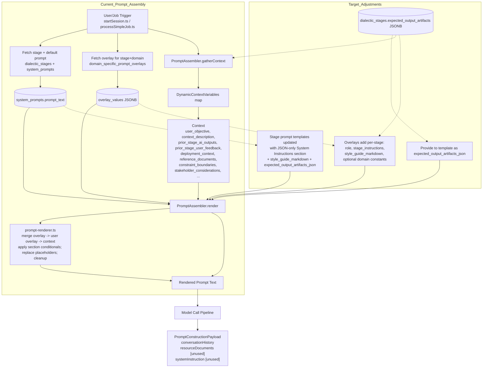

# Stage Prompt Optimization

## Problem Statement
- Stage prompts are not optimized for their expected utility. 
- The application does not provide a System Instructions prompt to ensure models provide desired documents. 
- Documents generated are not fully aligned to project needs & FAANG/startup documentation quality or ordering 

## Objectives
- Optimized stage prompts
- System Instructions detailing stage specific output artifacts 
- Formatting requirements for iteratable implementation plans 
    - High level milestones -> intermediate signposting / sprints -> low level checklist steps 
    - Phases & Milestones at the beginning, then is interpolated with signposts & sprints. 
    - At each iteration another signpost / sprint section is filled in with prompt checklists for implementation
    - This is iterated until the full project is complete

## Expected Outcome
- Stage prompts emulate a FAANG style production process optimized for startups / small teams / solo coders
- System Instructions explains to agent how to build artifacts for the stage
- Artifacts can be reprocessed for next iteration/phase 

## Prompt Assembly Data Flow (Current and Target)



### Where elements live
- Base prompt template: `system_prompts.prompt_text` (per stage).
- Stage-specific prompt inserts: provided by `overlay_values` keys `role`, `stage_instructions`.
- Stage/domain-specific overlay values: `domain_specific_prompt_overlays.overlay_values` (merged, then user project overlays if present).
- System instructions template: embedded in `system_prompts.prompt_text` as a JSON-only guidance section.
- System instructions inserts: `style_guide_markdown` sourced from overlays (stage-specific selection from the Style Guide).
- Stage-specific expected_output_artifacts: `dialectic_stages.expected_output_artifacts` (exposed to the template as `expected_output_artifacts_json`).

### Renderer-compatible canonical templates

The renderer supports single-brace placeholders `{key}` and conditional sections `{{#section:key}}...{{/section:key}}`. Keys come from:
- Overlays (merged first): `role`, `stage_instructions`, `style_guide_markdown`, domain constants.
- Dynamic context (overrides): `user_objective`, `context_description`, `prior_stage_ai_outputs`, `prior_stage_user_feedback`, `deployment_context`, `reference_documents`, `constraint_boundaries`, `stakeholder_considerations`, `deliverable_format`, and `expected_output_artifacts_json` (when provided by the stage).

#### Stage-agnostic Prompt Template (renderer-ready)
```text
You are a {role}. Your task is to {stage_instructions} produce the required outputs using the provided inputs and references.

User Objective:
- {user_objective}

{{#section:domain}}Domain: {domain}{{/section:domain}}
{{#section:deployment_context}}- Deployment Context: {deployment_context}{{/section:deployment_context}}

{{#section:reference_documents}}References:
- {reference_documents}{{/section:reference_documents}}


{{#section:constraint_boundaries}}Standards and Constraints:
- Constraints: {constraint_boundaries}{{/section:constraint_boundaries}}
{{#section:stakeholder_considerations}}- Stakeholders: {stakeholder_considerations}{{/section:stakeholder_considerations}}

{{#section:prior_stage_ai_outputs}}Prior Stage AI Outputs:
{prior_stage_ai_outputs}{{/section:prior_stage_ai_outputs}}

{{#section:prior_stage_user_feedback}}User Feedback:
{prior_stage_user_feedback}{{/section:prior_stage_user_feedback}}
```

#### Stage-agnostic System Instructions Template (JSON-only wrapper)
```text
SYSTEM: Your entire response for this stage MUST be a single, valid JSON object.
Strictly adhere to the JSON structure under 'Expected JSON Output Structure:'.
Populate all placeholders with your generated content. Do not include ANY content outside of the JSON.
The JSON must begin with '{' and end with '}'.

{{#section:style_guide_markdown}}{style_guide_markdown}{{/section:style_guide_markdown}}

{{#section:expected_output_artifacts_json}}Expected JSON Output Structure:
{expected_output_artifacts_json}{{/section:expected_output_artifacts_json}}

CRITICAL REMINDER: Ensure your response is ONLY the JSON object detailed above. End of Instructions.
```

Use these templates as the base for each stage. Provide `role` and `stage_instructions` via overlays (stage+domain), embed stage-specific style guide selections into `style_guide_markdown` via overlays, and source `expected_output_artifacts_json` from `dialectic_stages.expected_output_artifacts`.

# Proposal (Thesis) Stage
- Each agent generates a project proposal based on user's input

## Input
- User prompt
- System inputs (domain, prompt overlays, isntructions) 

## Output
- Business case w/ market opportunity, user problem validation, competitive analysis
- MVP feature specification with user stories
- High-level technical approach overview

# Review (Antithesis) Stage
- Each agent performs comparative analysis, feasibility analysis, and risk assessment of each proposal 

## Input
- Proposal (Thesis) outputs 
- User feedback
- System inputs

## Output
- Per-thesis criticism matrix for use in synthesis stage
- Technical feasibility assessment with identified risks & mitigation strategies 
- Risk register & non-functional requirements
- Dependency map 

# Refinement (Synthesis) Stage
- Each agent synthesizes multiple proposals into product requirements and draft technical plan

## Input
- All Proposals (Thesis), Reviews (Antithesis), and user feedback
- System inputs 

## Output
- A PRD with a revised MVP description, user stories, and feature specifications. 
- System architecture overview
- Tech stack recommendations 

# Planning (Parenthesis) Stage
- Each agent produces a TRD, project plan, and master plan for each proposal.  

## Input
- Refinement (Synthesis) stage outputs
- User feedback

## Output
- TRD incl. subsystem design, API, schema, proposed file tree, detailed technical architecture
- Project roadmap w/ milestones & dependencies that implements MVP PRD/TRD. 
- Master Plan for iterative generation & progress tracking

# Implementation (Paralysis) Stage
- Each agent generates a WBS, backlog, and master plan for each proposal. 

## Input
- Planning (Parenthesis) stage outputs 
- User feedback

## Output
- Work breakdown structure in the form of a checklist of prompts to feed to an agent / developer
-- Structured, dependency-ordered, TDD ordered, one-file-per-step.   
- Updated Master Plan reflecting WBS & backlog  

# Prompt Templating Examples

## Proposal/Thesis Prompt Inserts (stage-specific)
```json
{
  "role": "senior product strategist and technical architect",
  "stage_instructions": "establish the initial, comprehensive baseline; consider distinct perspectives that complement or improve standard practices; recommend the common approach when it clearly meets constraints and provides a superior benefit-cost profile versus alternatives;",
  "expected_output_artifacts_json": [
    "Business case with market opportunity, user problem validation, and competitive analysis",
    "MVP feature specification with user stories",
    "High-level technical approach overview"
  ]
}
```

## Proposal/Thesis Expected Output Artifacts (System Instructions Inserts)
```json
{
  "system_materials": {
    "executive_summary": "outline/index of all outputs in this response and how they connect to the objective",
    "input_artifacts_summary": "brief, faithful summary of user prompt and referenced materials",
    "stage_rationale": "why these choices align with constraints, standards, and stakeholder needs",
    "progress_update": "for continuation turns, summarize what is complete vs remaining; omit on first turn",
    "validation_checkpoint": [
      "requirements addressed",
      "best practices applied",
      "feasible & compliant",
      "references integrated"
    ],
    "quality_standards": [
      "security-first",
      "maintainable",
      "scalable",
      "performance-aware"
    ],
    "diversity_rubric": {
      "prefer_standards_when": "meet constraints, well-understood by team, minimize risk/time-to-market",
      "propose_alternates_when": "materially improve performance, security, maintainability, or total cost under constraints",
      "if_comparable": "present 1-2 viable options with concise trade-offs and a clear recommendation"
    }
  },
  "documents": [
    {
      "key": "business_case",
      "template_filename": "thesis_business_case.md",
      "content_to_include": {
        "market_opportunity": "placeholder",
        "user_problem_validation": "placeholder",
        "competitive_analysis": "placeholder"
      }
    },
    {
      "key": "mvp_feature_spec_with_user_stories",
      "template_filename": "thesis_mvp_feature_spec.md",
      "content_to_include": [
        {
          "feature_name": "placeholder",
          "user_stories": ["As a <role>, I want <goal> so that <reason>."]
        }
      ]
    },
    {
      "key": "high_level_technical_approach_overview",
      "template_filename": "thesis_technical_approach_overview.md",
      "content_to_include": "architecture, components, data, deployment, sequencing"
    },
    {
      "key": "success_metrics",
      "template_filename": "thesis_success_metrics.md",
      "content_to_include": ["placeholder metric 1", "placeholder metric 2"]
    }
  ],
  "files_to_generate": [
    {
      "template_filename": "thesis_product_requirements_document.md",
      "from_document_key": "mvp_feature_spec_with_user_stories"
    },
    {
      "template_filename": "thesis_implementation_plan_proposal.md",
      "from_document_key": "high_level_technical_approach_overview"
    }
  ]
}
```
---

# Review / Antithesis Templates

## Review/Antithesis Prompt Inserts (stage-specific)
```json
{
  "role": "senior reviewer and feasibility analyst",
  "stage_instructions": "for the provided proposal only, critically analyze against constraints, standards, and references; identify gaps, risks, inconsistencies, and integration issues; produce clear, actionable recommendations and normalized comparison signals for downstream synthesis;",
  "expected_output_artifacts_json": [
    "Per-proposal critique with strengths/weaknesses and actionable recommendations",
    "Technical feasibility assessment with identified risks and mitigation strategies",
    "Risk register and non-functional requirements",
    "Dependency map",
    "Comparison vector (normalized signals)"
  ]
}
```

## Review/Antithesis Expected Output Artifacts (System Instructions Inserts)
```json
{
  "system_materials": {
    "executive_summary": "concise overview of key findings across all proposals",
    "input_artifacts_summary": "summary of proposals and any user feedback included for review",
    "stage_rationale": "explain the review approach and criteria used",
    "progress_update": "for continuation turns, summarize completed vs pending review areas; omit on first turn",
    "validation_checkpoint": [
      "major technical concerns identified",
      "risk mitigation strategies proposed",
      "alternatives considered where applicable",
      "references and standards checked"
    ],
    "quality_standards": [
      "evidence-based",
      "actionable",
      "balanced",
      "complete"
    ]
  },
  "documents": [
    {
      "key": "per_proposal_critique",
      "template_filename": "antithesis_per_proposal_critique.md",
      "content_to_include": {
        "proposal_id": "placeholder",
        "model_id": "placeholder",
        "strengths": ["placeholder"],
        "weaknesses": ["placeholder"],
        "recommendations": ["placeholder"],
        "notes": ["placeholder"]
      }
    },
    {
      "key": "technical_feasibility_assessment",
      "template_filename": "antithesis_feasibility_assessment.md",
      "content_to_include": "feasibility across constraints (team, timeline, cost), integration with existing systems, and compliance"
    },
    {
      "key": "risk_register",
      "template_filename": "antithesis_risk_register.md",
      "content_to_include": [
        { "risk": "placeholder", "impact": "placeholder", "likelihood": "placeholder", "mitigation": "placeholder" }
      ]
    },
    {
      "key": "non_functional_requirements",
      "template_filename": "antithesis_non_functional_requirements.md",
      "content_to_include": ["security", "performance", "reliability", "scalability", "maintainability", "compliance"]
    },
    {
      "key": "dependency_map",
      "template_filename": "antithesis_dependency_map.md",
      "content_to_include": "mapping of major components and their inter-dependencies; highlight conflicts and sequencing concerns"
    },
    {
      "key": "comparison_vector",
      "template_filename": "antithesis_comparison_vector.json",
      "content_to_include": {
        "proposal_id": "placeholder",
        "dimensions": {
          "feasibility": { "score": 3, "rationale": "placeholder" },
          "complexity": { "score": 3, "rationale": "placeholder" },
          "security": { "score": 3, "rationale": "placeholder" },
          "performance": { "score": 3, "rationale": "placeholder" },
          "maintainability": { "score": 3, "rationale": "placeholder" },
          "scalability": { "score": 3, "rationale": "placeholder" },
          "cost": { "score": 3, "rationale": "placeholder" },
          "time_to_market": { "score": 3, "rationale": "placeholder" },
          "compliance_risk": { "score": 3, "rationale": "placeholder" },
          "alignment_with_constraints": { "score": 3, "rationale": "placeholder" }
        }
      }
    }
  ],
  "files_to_generate": [
    { "template_filename": "antithesis_per_proposal_critique.md", "from_document_key": "per_proposal_critique" },
    { "template_filename": "antithesis_feasibility_assessment.md", "from_document_key": "technical_feasibility_assessment" },
    { "template_filename": "antithesis_risk_register.md", "from_document_key": "risk_register" },
    { "template_filename": "antithesis_non_functional_requirements.md", "from_document_key": "non_functional_requirements" },
    { "template_filename": "antithesis_dependency_map.md", "from_document_key": "dependency_map" },
    { "template_filename": "antithesis_comparison_vector.json", "from_document_key": "comparison_vector" }
  ]
}
```
---

# Synthesis / Refinement Templates

## Synthesis/Refinement Prompt Inserts (stage-specific)
```json
{
  "role": "senior systems architect and product planner",
  "stage_instructions": "synthesize multiple prior proposals with their per-proposal critiques and comparison vectors plus user feedback into a single, unified and optimized plan; use the normalized signals (feasibility, complexity, security, performance, maintainability, scalability, cost, time_to_market, compliance_risk, alignment_with_constraints) to drive comparative assessment and selection; resolve conflicts, integrate complementary strengths, fill gaps identified by reviews, and document key decisions and trade-offs; recommend standard approaches when they best meet constraints, and propose alternates only when they materially improve critical dimensions under current constraints;",
  "expected_output_artifacts_json": [
    "Revised PRD with MVP description, user stories, and feature specifications",
    "System architecture overview",
    "Tech stack recommendations"
  ]
}
```

## Synthesis/Refinement Expected Output Artifacts (System Instructions Inserts)
```json
{
  "system_materials": {
    "executive_summary": "outline/index of all outputs in this response and how they connect to the objective",
    "input_artifacts_summary": "succinct summary of prior proposals, critiques, and user feedback included in this synthesis",
    "stage_rationale": "decision record explaining how signals and critiques informed selections, how conflicts were resolved, gaps were filled, and why chosen approaches best meet constraints",
    "progress_update": "for continuation turns, summarize what is complete vs remaining; omit on first turn",
    "signal_sources": ["per_proposal_critique", "comparison_vector"],
    "decision_criteria": [
      "feasibility",
      "complexity",
      "security",
      "performance",
      "maintainability",
      "scalability",
      "cost",
      "time_to_market",
      "compliance_risk",
      "alignment_with_constraints"
    ],
    "validation_checkpoint": [
      "requirements addressed",
      "best practices applied",
      "feasible & compliant",
      "references integrated"
    ],
    "quality_standards": [
      "security-first",
      "maintainable",
      "scalable",
      "performance-aware"
    ],
    "diversity_rubric": {
      "prefer_standards_when": "meet constraints, well-understood by team, minimize risk/time-to-market",
      "propose_alternates_when": "materially improve performance, security, maintainability, or total cost under constraints",
      "if_comparable": "present 1-2 viable options with concise trade-offs and a clear recommendation"
    }
  },
  "documents": [
    {
      "key": "prd",
      "template_filename": "synthesis_product_requirements_document.md",
      "content_to_include": {
        "mvp_description": "placeholder",
        "user_stories": ["As a <role>, I want <goal> so that <reason>."],
        "feature_specifications": ["placeholder feature spec 1", "placeholder feature spec 2"]
      }
    },
    {
      "key": "system_architecture_overview",
      "template_filename": "synthesis_system_architecture_overview.md",
      "content_to_include": "diagrams/description of services, data flows, storage, auth, and integrations; include rationale for chosen patterns"
    },
    {
      "key": "tech_stack_recommendations",
      "template_filename": "synthesis_tech_stack_recommendations.md",
      "content_to_include": [
        {
          "component": "placeholder (e.g., database)",
          "recommended": "placeholder (e.g., Postgres)",
          "alternatives": ["alt1", "alt2"],
          "tradeoffs": "brief pros/cons with selection rationale"
        }
      ]
    }
  ],
  "files_to_generate": [
    { "template_filename": "synthesis_product_requirements_document.md", "from_document_key": "prd" },
    { "template_filename": "synthesis_system_architecture_overview.md", "from_document_key": "system_architecture_overview" },
    { "template_filename": "synthesis_tech_stack_recommendations.md", "from_document_key": "tech_stack_recommendations" }
  ]
}
```
---
# Planning / Parenthesis Templates

## Parenthesis/Planning Prompt Inserts (stage-specific)
```json
{
  "role": "principal technical planner and delivery architect",
  "stage_instructions": "formalize the synthesized solution into an executable plan centered on a persistent Master Plan. Create a high-level, dependency-ordered roadmap of milestones (Master Plan) and define a milestone schema that will be expanded in the next stage. Do not deeply detail implementation steps here; instead, ensure ordering, scope, and acceptance criteria are unambiguous, and align with the style guide for standardized structure.",
  "expected_output_artifacts_json": [
    "Tech Requirements Document (TRD): subsystem design, API surfaces, schema outlines, proposed file tree, and detailed technical architecture",
    "Project roadmap with milestones and interdependencies (Master Plan)",
    "Milestone schema definition and example instances (to be expanded next stage)"
  ]
}
```

## Parenthesis/Planning Expected Output Artifacts (System Instructions Inserts)
```json
{
  "system_materials": {
    "executive_summary": "overview of formalization scope and how the Master Plan will drive iterative execution",
    "input_artifacts_summary": "succinct recap of synthesis outputs informing this plan",
    "stage_rationale": "why the chosen milestone breakdown, ordering, and architecture structure best fit constraints and objectives",
    "progress_update": "for continuation turns, summarize Master Plan changes since last iteration; omit on first turn",
    "validation_checkpoint": [
      "complete coverage of synthesized scope",
      "dependency ordering validated",
      "milestone acceptance criteria present",
      "style guide structure applied"
    ],
    "quality_standards": [
      "consistent formatting",
      "explicit ordering",
      "clear acceptance criteria",
      "testability of milestones"
    ]
  },
  "documents": [
    {
      "key": "trd",
      "template_filename": "parenthesis_trd.md",
      "content_to_include": {
        "subsystems": ["placeholder"],
        "apis": ["placeholder"],
        "schemas": ["placeholder"],
        "proposed_file_tree": "placeholder",
        "architecture_overview": "placeholder"
      }
    },
    {
      "key": "master_plan",
      "template_filename": "parenthesis_master_plan.md",
      "content_to_include": {
        "phases": [
          {
            "name": "placeholder",
            "milestones": [
              {
                "id": "M1",
                "title": "placeholder",
                "objective": "placeholder",
                "dependencies": ["none"],
                "acceptance_criteria": ["placeholder"],
                "status": "[ ]"
              }
            ]
          }
        ]
      }
    },
    {
      "key": "milestone_schema",
      "template_filename": "parenthesis_milestone_schema.md",
      "content_to_include": {
        "fields": [
          "id",
          "title",
          "objective",
          "dependencies",
          "acceptance_criteria",
          "status"
        ],
        "style_guide_notes": "Use standardized checklist markers, component labels when relevant, and keep scope at milestone granularity; detailed steps belong to next stage."
      }
    }
  ],
  "files_to_generate": [
    { "template_filename": "parenthesis_trd.md", "from_document_key": "trd" },
    { "template_filename": "parenthesis_master_plan.md", "from_document_key": "master_plan" },
    { "template_filename": "parenthesis_milestone_schema.md", "from_document_key": "milestone_schema" }
  ]
}
```
---

# Implementation / Paralysis Templates

## Paralysis/Implementation Prompt Inserts (stage-specific)
```json
{
  "role": "implementation planner and TDD workflow author",
  "stage_instructions": "using the TRD, Master Plan, and selected milestones, generate a dependency-ordered, fine-grained, high-detail checklist of implementation prompts that follow the style guide (status markers, numbering 1/a/i, component labels). Process documents sequentially: generate one document per turn. If the current document would exceed limits, stop at the boundary and return continuation flags; do not start the next document until the current one is complete. For this iteration, fully detail only the next uncompleted milestone(s) and return an updated Master Plan marking those milestones as [🚧].",
  "expected_output_artifacts_json": [
    "Actionable implementation checklist (low-level prompts)",
    "Updated Master Plan (milestones just detailed set to [🚧])"
  ]
}
```

## Paralysis/Implementation Expected Output Artifacts (System Instructions Inserts)
```json
{
  "system_materials": {
    "executive_summary": "summary of which milestones are detailed in this iteration and why",
    "input_artifacts_summary": "TRD sections used, Master Plan phase/milestone references",
    "stage_rationale": "explain ordering, TDD emphasis, and how checklist conforms to style guide",
    "progress_update": "summarize completed vs remaining milestones; denote updated statuses in Master Plan",
    "generation_limits": { "max_steps": 200, "target_steps": "120-180", "max_output_lines": "600-800" },
    "document_order": ["actionable_checklist","updated_master_plan"],
    "current_document": "actionable_checklist",
    "continuation_policy": "stop-at-boundary; one-document-per-turn; resume where left off",
    "exhaustiveness_requirement": "extreme detail; no summaries; each step includes inputs, outputs, validation; 1/a/i numbering; component labels",
    "validation_checkpoint": [
      "checklist uses style guide (status, numbering, labels)",
      "steps are atomic and testable",
      "dependency ordering enforced",
      "coverage aligns to milestone acceptance criteria"
    ],
    "quality_standards": [
      "TDD sequence present",
      "no missing dependencies",
      "no speculative steps beyond selected milestones",
      "clear file-by-file prompts"
    ]
  },
  "documents": [
    {
      "key": "actionable_checklist",
      "template_filename": "paralysis_actionable_checklist.md",
      "content_to_include": "full low-level checklist using style guide: status markers, 1/a/i numbering, component labels; each step contains inputs, outputs, validation; one-file-per-step prompts"
    },
    {
      "key": "updated_master_plan",
      "template_filename": "paralysis_updated_master_plan.md",
      "content_to_include": "copy of Master Plan with the detailed milestones set to [🚧], others unchanged"
    }
  ],
  "files_to_generate": [
    { "template_filename": "paralysis_actionable_checklist.md", "from_document_key": "actionable_checklist" },
    { "template_filename": "paralysis_updated_master_plan.md", "from_document_key": "updated_master_plan" }
  ]
}
```

---

# Stage Agnostic "Advisor" Process

{
  "system_materials": {
    "executive_summary": "",
    "decision_criteria": ["feasibility","complexity","security","performance","maintainability","scalability","cost","time_to_market","compliance_risk","alignment_with_constraints"],
    "validation_checkpoint": ["criteria applied","constraints respected","references integrated","feasible & compliant"]
  },
  "documents": [
    {
      "key": "comparison_matrix",
      "template_filename": "advisor_comparison_matrix.md",
      "content_to_include": [
        {"option_id": "placeholder","scores": {"feasibility": 4,"cost": 3}, "rationales": {"feasibility": "…","cost": "…"}}
      ]
    },
    {
      "key": "comparative_analysis",
      "template_filename": "advisor_comparative_analysis.md",
      "content_to_include": "brief synthesis of key differences and trade-offs"
    },
    {
      "key": "recommendations",
      "template_filename": "advisor_recommendations.md",
      "content_to_include": [
        {"rank": 1,"option_id": "placeholder","why": "…","when_to_choose": "…"}
      ]
    },
    {
      "key": "selection_rationale",
      "template_filename": "advisor_selection_rationale.md",
      "content_to_include": "tie-breakers, risk posture, sensitivity to constraints"
    }
  ],
  "files_to_generate": [
    {"template_filename": "advisor_comparison_matrix.md", "from_document_key": "comparison_matrix"},
    {"template_filename": "advisor_comparative_analysis.md", "from_document_key": "comparative_analysis"},
    {"template_filename": "advisor_recommendations.md", "from_document_key": "recommendations"},
    {"template_filename": "advisor_selection_rationale.md", "from_document_key": "selection_rationale"}
  ]
}