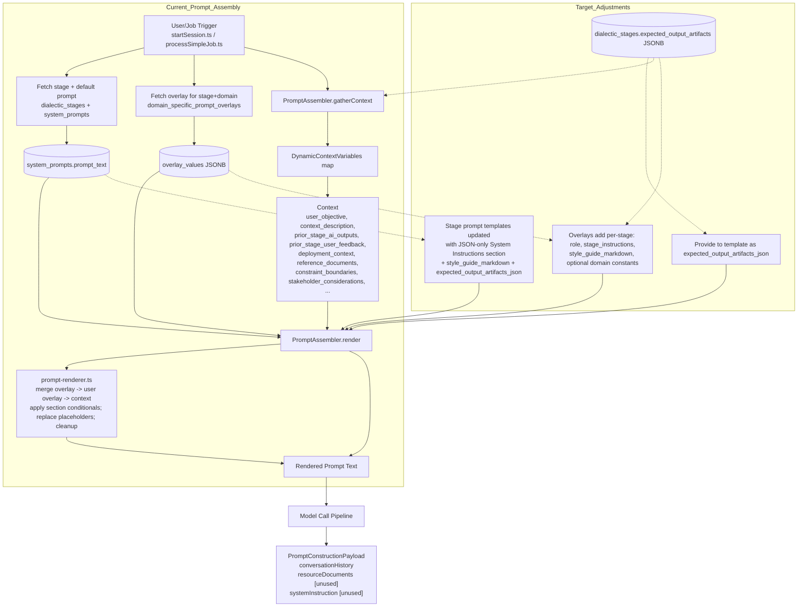

# Stage Prompt Optimization

## Problem Statement
- Stage prompts are not optimized for their expected utility. 
- The application does not provide a System Instructions prompt to ensure models provide desired documents. 
- Documents generated are not fully aligned to project needs & FAANG/startup documentation quality or ordering 

## Objectives
- Optimized stage prompts
- System Instructions detailing stage specific output artifacts 
- Formatting requirements for iteratable implementation plans 
    - High level milestones -> intermediate signposting / sprints -> low level checklist steps 
    - Phases & Milestones at the beginning, then is interpolated with signposts & sprints. 
    - At each iteration another signpost / sprint section is filled in with prompt checklists for implementation
    - This is iterated until the full project is complete

## Expected Outcome
- Stage prompts emulate a FAANG style production process optimized for startups / small teams / solo coders
- System Instructions explains to agent how to build artifacts for the stage
- Artifacts can be reprocessed for next iteration/phase 

## Prompt Assembly Data Flow (Current and Target)



### Where elements live
- Base prompt template: `system_prompts.prompt_text` (per stage).
- Stage-specific prompt inserts: provided by `overlay_values` keys `role`, `stage_instructions`.
- Stage/domain-specific overlay values: `domain_specific_prompt_overlays.overlay_values` (merged, then user project overlays if present).
- System instructions template: embedded in `system_prompts.prompt_text` as a JSON-only guidance section.
- System instructions inserts: `style_guide_markdown` sourced from overlays (stage-specific selection from the Style Guide).
- Stage-specific expected_output_artifacts: `dialectic_stages.expected_output_artifacts` (exposed to the template as `expected_output_artifacts_json`).

### Renderer-compatible canonical templates

The renderer supports single-brace placeholders `{key}` and conditional sections `{{#section:key}}...{{/section:key}}`. Keys come from:
- Overlays (merged first): `role`, `stage_instructions`, `style_guide_markdown`, domain constants.
- Dynamic context (overrides): `user_objective`, `context_description`, `prior_stage_ai_outputs`, `prior_stage_user_feedback`, `deployment_context`, `reference_documents`, `constraint_boundaries`, `stakeholder_considerations`, `deliverable_format`, and `expected_output_artifacts_json` (when provided by the stage).

#### Stage-agnostic Prompt Template (renderer-ready)
```text
You are a {role}. Your task is to {stage_instructions} produce the required outputs using the provided inputs and references.

User Objective:
- {user_objective}

{{#section:domain}}Domain: {domain}{{/section:domain}}
{{#section:deployment_context}}- Deployment Context: {deployment_context}{{/section:deployment_context}}

{{#section:reference_documents}}References:
- {reference_documents}{{/section:reference_documents}}


{{#section:constraint_boundaries}}Standards and Constraints:
- Constraints: {constraint_boundaries}{{/section:constraint_boundaries}}
{{#section:stakeholder_considerations}}- Stakeholders: {stakeholder_considerations}{{/section:stakeholder_considerations}}

{{#section:prior_stage_ai_outputs}}Prior Stage AI Outputs:
{prior_stage_ai_outputs}{{/section:prior_stage_ai_outputs}}

{{#section:prior_stage_user_feedback}}User Feedback:
{prior_stage_user_feedback}{{/section:prior_stage_user_feedback}}
```

#### Stage-agnostic System Instructions Template (JSON-only wrapper)
```text
SYSTEM: Your entire response for this stage MUST be a single, valid JSON object.
Strictly adhere to the JSON structure under 'Expected JSON Output Structure:'.
Populate all placeholders with your generated content. Do not include ANY content outside of the JSON.
The JSON must begin with '{' and end with '}'.

{{#section:style_guide_markdown}}{style_guide_markdown}{{/section:style_guide_markdown}}

{{#section:expected_output_artifacts_json}}Expected JSON Output Structure:
{expected_output_artifacts_json}{{/section:expected_output_artifacts_json}}

CRITICAL REMINDER: Ensure your response is ONLY the JSON object detailed above. End of Instructions.
```

Use these templates as the base for each stage. Provide `role` and `stage_instructions` via overlays (stage+domain), embed stage-specific style guide selections into `style_guide_markdown` via overlays, and source `expected_output_artifacts_json` from `dialectic_stages.expected_output_artifacts`.

# Proposal (Thesis) Stage
- Each agent generates a project proposal based on user's input

## Input
- User prompt
- System inputs (domain, prompt overlays, isntructions) 

## Output
- Business case w/ market opportunity, user problem validation, competitive analysis
- MVP feature specification with user stories
- High-level technical approach overview

# Review (Antithesis) Stage
- Each agent performs comparative analysis, feasibility analysis, and risk assessment of each proposal 

## Input
- Proposal (Thesis) outputs 
- User feedback
- System inputs

## Output
- Per-thesis criticism matrix for use in synthesis stage
- Technical feasibility assessment with identified risks & mitigation strategies 
- Risk register & non-functional requirements
- Dependency map 

# Refinement (Synthesis) Stage
- Each agent synthesizes multiple proposals into product requirements and draft technical plan

## Input
- All Proposals (Thesis), Reviews (Antithesis), and user feedback
- System inputs 

## Output
- A PRD with a revised MVP description, user stories, and feature specifications. 
- System architecture overview
- Tech stack recommendations 

# Planning (Parenthesis) Stage
- Each agent produces a TRD, project plan, and master plan for each proposal.  

## Input
- Refinement (Synthesis) stage outputs
- User feedback

## Output
- TRD incl. subsystem design, API, schema, proposed file tree, detailed technical architecture
- Project roadmap w/ milestones & dependencies that implements MVP PRD/TRD. 
- Master Plan for iterative generation & progress tracking

# Implementation (Paralysis) Stage
- Each agent generates a WBS, backlog, and master plan for each proposal. 

## Input
- Planning (Parenthesis) stage outputs 
- User feedback

## Output
- Work breakdown structure in the form of a checklist of prompts to feed to an agent / developer
-- Structured, dependency-ordered, TDD ordered, one-file-per-step.   
- Updated Master Plan reflecting WBS & backlog  

# Prompt Templating Examples

## Proposal/Thesis Prompt Inserts (stage-specific)
```json
{
  "role": "senior product strategist and technical architect",
  "stage_instructions": "establish the initial, comprehensive baseline; consider distinct perspectives that complement or improve standard practices; recommend the common approach when it clearly meets constraints and provides a superior benefit-cost profile versus alternatives;",
  "expected_output_artifacts_json": [
    "Business case with market opportunity, user problem validation, and competitive analysis",
    "MVP feature specification with user stories",
    "High-level technical approach overview"
  ]
}
```

## Proposal/Thesis Expected Output Artifacts (System Instructions Inserts)
```json
{
  "system_materials": {
    "executive_summary": "outline/index of all outputs in this response and how they connect to the objective",
    "input_artifacts_summary": "brief, faithful summary of user prompt and referenced materials",
    "stage_rationale": "why these choices align with constraints, standards, and stakeholder needs",
    "progress_update": "for continuation turns, summarize what is complete vs remaining; omit on first turn",
    "validation_checkpoint": [
      "requirements addressed",
      "best practices applied",
      "feasible & compliant",
      "references integrated"
    ],
    "quality_standards": [
      "security-first",
      "maintainable",
      "scalable",
      "performance-aware"
    ],
    "diversity_rubric": {
      "prefer_standards_when": "meet constraints, well-understood by team, minimize risk/time-to-market",
      "propose_alternates_when": "materially improve performance, security, maintainability, or total cost under constraints",
      "if_comparable": "present 1-2 viable options with concise trade-offs and a clear recommendation"
    }
  },
  "context_for_documents": [
    {
      "document_key": "business_case",
      "content_to_include": {
        "market_opportunity": "placeholder",
        "user_problem_validation": "placeholder",
        "competitive_analysis": "placeholder"
      }
    },
    {
      "document_key": "feature_spec",
      "content_to_include": [
        {
          "feature_name": "placeholder",
          "user_stories": [
            "As a <role>, I want <goal> so that <reason>."
          ]
        }
      ]
    },
    {
      "document_key": "technical_approach",
      "content_to_include": "architecture, components, data, deployment, sequencing"
    },
    {
      "document_key": "success_metrics",
      "content_to_include": [
        "placeholder metric 1",
        "placeholder metric 2"
      ]
    }
  ]
}
```
---

# Review / Antithesis Templates

The Antithesis stage now uses a recipe-based system with seven sequential steps executed once per proposal. For complete recipe specifications including detailed schemas, input requirements, and output structures, see [`antithesis-review-recipe.md`](2-Antithesis-Review/antithesis-review-recipe.md).

## Antithesis Recipe Overview

The `antithesis_v1` recipe consists of seven steps:

1. **Prepare Proposal Review Plan** (`antithesis_planner_review_v1`) - Planner template that creates per-proposal header context
2. **Generate Review Documents** (6 parallel turns):
   - `antithesis_business_case_critique_turn_v1` - Business case critique with SWOT analysis
   - `antithesis_feasibility_assessment_turn_v1` - Technical feasibility assessment
   - `antithesis_risk_register_turn_v1` - Risk register with impact/likelihood/mitigation
   - `antithesis_non_functional_requirements_turn_v1` - Non-functional requirements evaluation
   - `antithesis_dependency_map_turn_v1` - Dependency mapping and conflict analysis
   - `antithesis_comparison_vector_turn_v1` - Normalized comparison vector for synthesis

## Antithesis Artifacts

The recipe produces six main artifacts per proposal:
- `business_case_critique` - Business case analysis with strengths, weaknesses, opportunities, threats
- `technical_feasibility_assessment` - Technical feasibility across team, timeline, cost, integration, compliance
- `risk_register` - Structured risk register with impact, likelihood, and mitigation strategies
- `non_functional_requirements` - Non-functional requirements evaluation (security, performance, reliability, etc.)
- `dependency_map` - Component dependencies, integration points, and conflict analysis
- `comparison_vector` - Normalized comparison signals across 10 dimensions for synthesis

## Overlay Configuration

The Antithesis stage overlay now references the recipe's `outputs_required` data instead of the deprecated `expected_output_artifacts_json` field. Key overlay values include:

```json
{
  "role": "senior reviewer and feasibility analyst",
  "stage_instructions": "for the provided proposal only, critically analyze against constraints, standards, and references; identify gaps, risks, inconsistencies, and integration issues; produce clear, actionable recommendations and normalized comparison signals for downstream synthesis",
  "continuation_policy": "single-proposal review; continue until all artifacts for this proposal are complete",
  "style_guide_markdown": "<see StyleGuide.md for style guide specifications>",
  "exhaustiveness_requirement": "extreme detail; no summaries; each step includes inputs, outputs, validation; follow the style guide exactly"
}
```

For complete recipe specifications, input requirements, output schemas, and continuation policies, refer to [`antithesis-review-recipe.md`](2-Antithesis-Review/antithesis-review-recipe.md).
---

# Synthesis / Refinement Templates

The Synthesis stage now uses a complex recipe-based system with five sequential phases and multiple parallel processing steps. For complete recipe specifications including detailed schemas, input requirements, and output structures, see [`synthesis-refinement-recipe.md`](3-Synthesis-Refinement/synthesis-refinement-recipe.md).

## Synthesis Recipe Overview

The `synthesis_v1` recipe consists of five phases:

1. **Prepare Pairwise Synthesis Header** (`synthesis_pairwise_header_planner_v1`) - Planner template that creates header context for pairwise processing
2. **Pairwise Synthesis** (4 parallel turns):
   - `synthesis_pairwise_business_case_turn_v1` - Business case synthesis
   - `synthesis_pairwise_feature_spec_turn_v1` - Feature specification synthesis
   - `synthesis_pairwise_technical_approach_turn_v1` - Technical approach synthesis
   - `synthesis_pairwise_success_metrics_turn_v1` - Success metrics synthesis
3. **Document-Level Consolidation** (4 parallel turns):
   - `synthesis_document_business_case_turn_v1` - Consolidate business cases
   - `synthesis_document_feature_spec_turn_v1` - Consolidate feature specs
   - `synthesis_document_technical_approach_turn_v1` - Consolidate technical approaches
   - `synthesis_document_success_metrics_turn_v1` - Consolidate success metrics
4. **Generate Final Synthesis Header** (`synthesis_final_header_planner_v1`) - Planner template for final deliverables
5. **Final Deliverable Rendering** (3 parallel turns):
   - `synthesis_product_requirements_turn_v1` - Product Requirements Document
   - `synthesis_system_architecture_turn_v1` - System Architecture Overview
   - `synthesis_tech_stack_turn_v1` - Tech Stack Recommendations

## Synthesis Artifacts

The recipe produces three main final artifacts:
- `product_requirements` - Product Requirements Document with MVP, user stories, and features
- `system_architecture` - System architecture with services, data flows, and integrations
- `tech_stack` - Technology stack recommendations with component analysis

## Overlay Configuration

The Synthesis stage overlay now references the recipe's `outputs_required` data instead of the deprecated `expected_output_artifacts_json` field. Key overlay values include:

```json
{
  "role": "senior systems architect and product planner",
  "stage_instructions": "synthesize multiple prior proposals with their per-proposal critiques and comparison vectors plus user feedback into a single, unified and optimized plan; use the normalized signals (feasibility, complexity, security, performance, maintainability, scalability, cost, time_to_market, compliance_risk, alignment_with_constraints) to drive comparative assessment and selection; resolve conflicts, integrate complementary strengths, fill gaps identified by reviews, and document key decisions and trade-offs; recommend standard approaches when they best meet constraints, and propose alternates only when they materially improve critical dimensions under current constraints;",
  "style_guide_markdown": "<see StyleGuide.md for style guide specifications>",
  "exhaustiveness_requirement": "extreme detail; no summaries; each step includes inputs, outputs, validation; follow the style guide exactly"
}
```

For complete recipe specifications, input requirements, output schemas, and continuation policies, refer to [`synthesis-refinement-recipe.md`](3-Synthesis-Refinement/synthesis-refinement-recipe.md).
---
# Planning / Parenthesis Templates

The Parenthesis stage now uses a recipe-based system with four sequential steps. For complete recipe specifications including detailed schemas, input requirements, and output structures, see [`parenthesis-planning-recipe.md`](4-Parenthesis-Planning/parenthesis-planning-recipe.md).

## Parenthesis Recipe Overview

The `parenthesis_v1` recipe consists of four steps:

1. **Build Planning Header** (`parenthesis_planner_header_v1`) - Planner template that creates header context
2. **Generate Technical Requirements Document** (`parenthesis_trd_turn_v1`) - Turn template for TRD generation
3. **Generate Master Plan** (`parenthesis_master_plan_turn_v1`) - Turn template for dependency-ordered master plan
4. **Generate Milestone Schema** (`parenthesis_milestone_schema_turn_v1`) - Turn template for milestone field definitions

## Parenthesis Artifacts

The recipe produces three main artifacts:
- `trd` - Technical Requirements Document with subsystems, APIs, schemas, and architecture
- `master_plan` - Dependency-ordered master plan with phases and milestones
- `milestone_schema` - Reusable milestone field schema for the next stage

## Overlay Configuration

The Parenthesis stage overlay now references the recipe's `outputs_required` data instead of the deprecated `expected_output_artifacts_json` field. Key overlay values include:

```json
{
  "role": "principal technical planner and delivery architect",
  "stage_instructions": "formalize the synthesized solution into an executable plan centered on a persistent Master Plan. Create a high-level, dependency-ordered roadmap of milestones (Master Plan) and define a milestone schema that will be expanded in the next stage. Do not deeply detail implementation steps here; instead, ensure ordering, scope, and acceptance criteria are unambiguous, and align with the style guide for standardized structure.",
  "generation_limits": { "max_steps": 200, "target_steps": "120-180", "max_output_lines": "600-800" },
  "style_guide_markdown": "<see StyleGuide.md for style guide specifications>",
  "exhaustiveness_requirement": "extreme detail; no summaries; each step includes inputs, outputs, validation; follow the style guide exactly"
}
```

## Parenthesis Expected Output Artifacts (System Instructions Inserts)
```json
{
  "content": {
    "index": ["M1"],
    "pipeline_context": "Decomposing dependency frontier into architectural work nodes",
    "selection_criteria": "dependency frontier: only milestones whose deps are [✅] or in current batch",
    "shared_infrastructure": [],
    "milestones": [
      {
        "id": "M1",
        "title": "Core Authentication",
        "status": "pending",
        "objective": "Implement secure user authentication",
        "nodes": [
          {
            "path": "supabase/functions/auth",
            "title": "Auth Helpers",
            "objective": "Centralize auth logic",
            "role": "Shared Utility",
            "module": "Auth",
            "deps": ["supabase-js"],
            "provides": ["getUser", "signIn"],
            "directionality": "Infrastructure",
            "requirements": ["Handle JWT", "Refresh tokens"]
          }
        ]
      }
    ],
    "iteration_semantics": "replace, don't extend; reference prior schema for continuity",
    "executive_summary": "Milestone 1 focuses on establishing the core authentication infrastructure."
  }
}
```

For complete recipe specifications, input requirements, output schemas, and continuation policies, refer to [`parenthesis-planning-recipe.md`](4-Parenthesis-Planning/parenthesis-planning-recipe.md).
---

# Implementation / Paralysis Templates

The Paralysis stage now uses a recipe-based system with four sequential steps. For complete recipe specifications including detailed schemas, input requirements, and output structures, see [`paralysis-planning-recipe.md`](5-Paralysis-Implementation/paralysis-planning-recipe.md).

## Paralysis Recipe Overview

The `paralysis_v1` recipe consists of four steps:

1. **Build Implementation Header** (`paralysis_planner_header_v1`) - Planner template that creates header context
2. **Generate Actionable Checklist** (`paralysis_actionable_checklist_turn_v1`) - Turn template for detailed implementation checklist
3. **Generate Updated Master Plan** (`paralysis_updated_master_plan_turn_v1`) - Turn template for updated master plan
4. **Generate Advisor Recommendations** (`paralysis_advisor_recommendations_turn_v1`) - Turn template for consolidated advisor analysis

## Paralysis Artifacts

The recipe produces three main artifacts:
- `actionable_checklist` - Detailed implementation checklist with TDD sequences
- `updated_master_plan` - Updated master plan with milestone status changes
- `advisor_recommendations` - Consolidated advisor analysis (replaces previous multiple advisor artifacts)

## Overlay Configuration

The Paralysis stage overlay now references the recipe's `outputs_required` data instead of the deprecated `expected_output_artifacts_json` field. Key overlay values include:

```json
{
  "role": "implementation planner and TDD workflow author",
  "stage_instructions": "using the TRD, Master Plan, and selected milestones, generate a dependency-ordered, fine-grained, high-detail checklist of implementation prompts that follow the style guide (status markers, numbering 1/a/i, component labels). Process documents sequentially: generate one document per turn. If the current document would exceed limits, stop at the boundary and return continuation flags; do not start the next document until the current one is complete. For this iteration, fully detail only the next uncompleted milestone(s) and return an updated Master Plan marking those milestones as [🚧].",
  "generation_limits": { "max_steps": 200, "target_steps": "120-180", "max_output_lines": "600-800" },
  "style_guide_markdown": "<see StyleGuide.md for style guide specifications>",
  "exhaustiveness_requirement": "extreme detail; no summaries; each step includes inputs, outputs, validation; follow the style guide exactly"
}
```

## Paralysis Expected Output Artifacts (System Instructions Inserts)
```json
{
  "content": {
    "milestone_ids": ["M1"],
    "index": ["M1"],
    "milestone_reference": {
      "id": "M1",
      "phase": "Foundation",
      "dependencies": "None"
    },
    "nodes": [
      {
        "path": "supabase/functions/auth/utils.ts",
        "title": "Auth Utilities",
        "objective": [
          "Implement JWT validation",
          "Implement token refresh"
        ],
        "role": [
          "Infrastructure Utility"
        ],
        "module": [
          "Authentication"
        ],
        "deps": [
          "supabase-js - External Lib - Infrastructure - Auth Client"
        ],
        "context_slice": [
          "SupabaseClient interface",
          "UserSession type"
        ],
        "interface": [
          "interface IAuthUtils { validateToken(token: string): Promise<boolean>; }"
        ],
        "interface_tests": [
          "should return true for valid token",
          "should return false for expired token"
        ],
        "interface_guards": [
          "isAuthError(error: unknown): error is AuthError"
        ],
        "unit_tests": [
          "validateToken returns true when supabase client returns user"
        ],
        "construction": [
          "export const createAuthUtils = (client: SupabaseClient) => IAuthUtils"
        ],
        "source": [
          "Implementation of validateToken using supabase.auth.getUser"
        ],
        "provides": [
          "validateToken",
          "refreshToken"
        ],
        "mocks": [
          "mockAuthUtils - intercepts validateToken"
        ],
        "integration_tests": [
          "validateToken integrates with real Supabase instance"
        ],
        "directionality": [
          "Infrastructure Layer",
          "Depends on: supabase-js",
          "Provides to: Domain/App Layers"
        ],
        "requirements": [
          "Must handle network errors gracefully",
          "Must support Bearer token format"
        ],
        "commit": [
          "feat(auth): implement auth utility functions"
        ]
      }
    ],
    "milestone_summary": "Implemented core authentication utilities required for downstream features."
  }
}
```

For complete recipe specifications, input requirements, output schemas, and continuation policies, refer to [`paralysis-planning-recipe.md`](5-Paralysis-Implementation/paralysis-planning-recipe.md).
