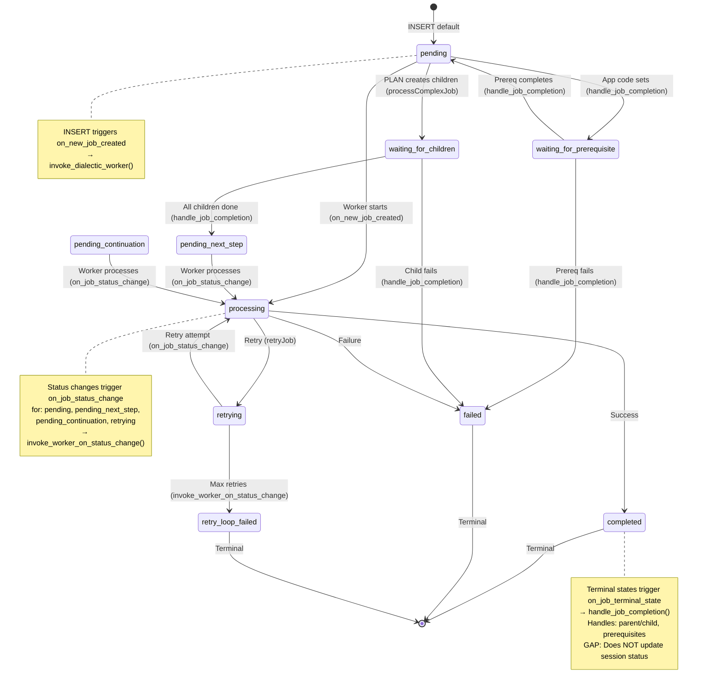
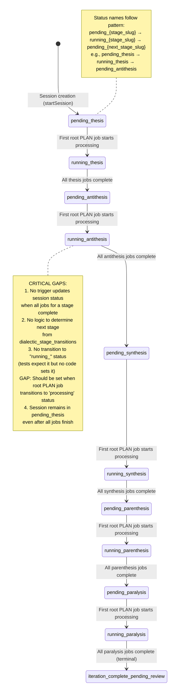
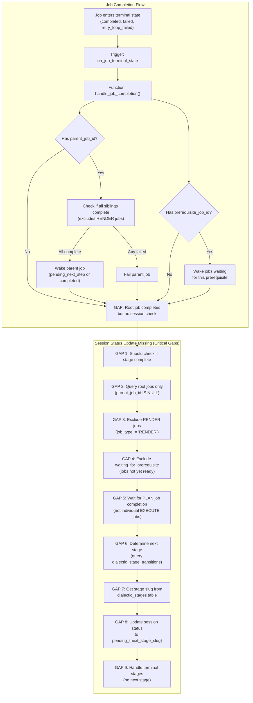
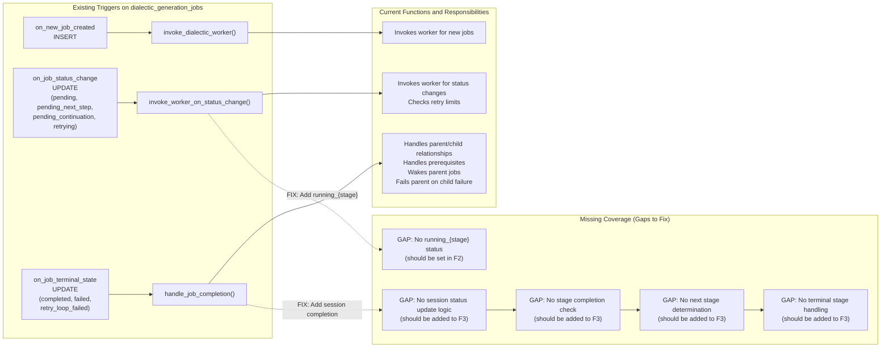

```mermaid
graph TD
    subgraph "User & API"
        A["User Clicks 'Generate'"] --> B["API: Creates 'Parent' Job"]
    end

    subgraph "Database (dialectic_generation_jobs)"
        B -- "INSERT" --> C(("<font size=5><b>Jobs Table</b></font><br/>id, parent_id, status,<br/><b>payload (prompt, metadata)</b>"))
        L -- "UPDATE status='completed'" --> C
        M -- "INSERT new job<br/>(status='pending_continuation')" --> C
        L2 -- "UPDATE status='waiting_for_children'" --> C
        S -- "UPDATE status='pending_next_step'" --> C
        D((Webhook)) -- "triggers on INSERT/UPDATE" --> E
        C -- "triggers" --> D
    end

    subgraph "Dialectic Worker (Orchestrator)"
        E["Worker Fetches Job"] --> F{"Strategy Router"}
        
        F -- "Simple Stage" --> G["<b>processSimpleJob</b>"]
        F -- "Complex Stage" --> H["<b>Plan Job</b><br/>(Task Isolator)"]

        G --> G1{"Is this a<br/>Continuation Job?"}
        G1 -- No --> G2["<b>Assemble PromptPayload for New Job</b><br/>- currentUserPrompt<br/>- resourceDocuments"]
        G1 -- Yes --> G3["<b>Assemble PromptPayload for Continuation</b><br/>- currentUserPrompt ('continue')<br/>- resourceDocuments<br/>- conversationHistory"]
        
        G2 --> G4_PAYLOAD["PromptPayload Object"]
        G3 --> G4_PAYLOAD

        G4_PAYLOAD -- " " --> G4_ENTRY
        
        subgraph "G4: executeModelCallAndSave (Central Assembler)"
            direction TB
            G4_ENTRY["PromptPayload"] --> TOKEN_CHECK_1{"Initial Token Check"}
            TOKEN_CHECK_1 -- "Fits" --> FINAL_ASSEMBLY["<b>Final Assembly Stage</b>"]
            TOKEN_CHECK_1 -- "Oversized" --> COMPRESSION_LOOP["<b>Context Compression Loop</b>"]

            subgraph COMPRESSION_LOOP
                direction TB
                LOOP_START("Start Loop") --> BUILD_CANDIDATES["<b>2. Build & Score RAG Candidates</b><br/>- Isolate Middle History (by index)<br/>- Score Resources (by relevance)"]
                BUILD_CANDIDATES --> PICK_CANDIDATE{"<b>3. Pick Lowest-Value<br/>Un-indexed Candidate</b>"}
                PICK_CANDIDATE -- "None Left" --> G5_FAIL["Fail Job<br/>(ContextWindowError)"]
                PICK_CANDIDATE -- "Candidate Found" --> RAG_PREFLIGHT["<b>4. Financial Pre-flight</b><br/>- Estimate embedding cost<br/>- Check wallet balance"]
                RAG_PREFLIGHT -- "Insufficient Balance" --> G5_FAIL
                RAG_PREFLIGHT -- "Checks Pass" --> RAG_EMBED["<b>5. rag_service (on single candidate)</b>"]
                RAG_EMBED --> RAG_DEBIT["<b>6. debitTokens</b><br/>- Charge wallet for embedding"]
                RAG_DEBIT --> RECONSTRUCT["<b>7. Reconstruct Context</b><br/>- Replace original item with summary"]
                RECONSTRUCT --> TOKEN_CHECK_LOOP{"<b>8. Recalculate Tokens</b>"}
                TOKEN_CHECK_LOOP -- "Still Oversized" --> LOOP_START
            end

            TOKEN_CHECK_LOOP -- "Fits" --> FINAL_ASSEMBLY
            
            subgraph FINAL_ASSEMBLY
                direction TB
                FA_1["<b>9. Assemble Final User Message</b><br/>(currentUserPrompt + Compressed Resource Context)"] --> FA_2
                FA_2["<b>10. Construct Final Message Array</b><br/>(Compressed History + Final User Message)"] --> FA_3
                FA_3["<b>11. Wrap with System Prompt</b><br/>Creates final 'AssembledRequest' object"] --> FA_4
                FA_4{"<b>12. Final Sanity Check</b><br/>(Should always pass if loop is correct)"}
            end
        end

        FA_4 -- "Checks Pass" --> G7_CALL["Call Chat Service for AI Response"]
        FA_4 -- "Checks Fail" --> G5_FAIL


        I2 -- "Success (finish_reason='stop')" --> L["<b>Finalize Job</b><br/>- Save full contribution<br/>- Mark job 'completed'"]
        
        I2 -- "Needs Continuation<br/>(finish_reason='length'/'max_tokens')" --> I1["<b>Save Partial Result</b><br/>- Append new content to existing contribution"]
        I1 --> M["<b>continueJob</b><br/>Enqueues NEW job with<br/>target_contribution_id pointing<br/>to the updated contribution"]
        
        H --> J["<b>1. Generate Child Job Payloads</b><br/>- Calls refactored PromptAssembler<br/>- <u>Dynamically generates a specific prompt for each child</u>"]
        J --> K["<b>2. Enqueue Child Jobs</b><br/>(Each with its own custom prompt)"]
        K --> L2["Finalize Parent Job"]
    end

    subgraph "Chat Service (/chat endpoint)"
        G7["<b>handleDialecticPath<br/>- Pre-flight: Check Wallet Balance<br/>- AI Model Call"]
        G7 --> I["<b>debitTokens (for AI Call)</b><br/>- Post-flight: Charge Wallet"]
    end
    
    G7_CALL -- " " --> G7
    I -- " " --> I2

    subgraph "DB Trigger (on Job status='completed')"
        C -- on UPDATE --> Q{"Job has a parent_id?"}
        Q -- Yes --> R{"Are all sibling jobs done?"}
        R -- Yes --> S["Wake up Parent Job"]
        R -- No --> T["End"]
        Q -- No --> T
    end
```

## Document Creation Cycle (Target State)

```mermaid
graph TD
    subgraph "1. AI Response & JSON Processing (executeModelCallAndSave)"
        A1["AI Model Returns Response<br/>(UnifiedAIResponse)"] --> A2["sanitizeJsonContent()<br/>- Remove backticks, quotes, whitespace<br/>- Fix structural issues (missing braces)"]
        A2 --> A3["JSON.parse()<br/>- Validate sanitized JSON<br/>- Parse to object"]
        A3 --> A4{"Parse Successful?"}
        A4 -- "No" --> A5["Retry Job<br/>(Malformed JSON)"]
        A4 -- "Yes" --> A6["Extract contentForStorage<br/>= sanitizationResult.sanitized<br/>(Validated JSON string)"]
    end

    subgraph "2. File Storage (file_manager.uploadAndRegisterFile)"
        A6 --> B1["Construct PathContext<br/>- documentKey from job.payload<br/>- modelSlug, attemptCount, stageSlug"]
        B1 --> B2{"isModelContributionContext<br/>& fileContent missing?"}
        B2 -- "Yes" --> B3["Skip main content upload<br/>(No contribution file)"]
        B2 -- "No" --> B4["Upload fileContent<br/>(Legacy path - backward compat)"]
        B3 --> B5["Upload rawJsonResponseContent<br/>to *_raw.json<br/>(FileType.ModelContributionRawJson)"]
        B4 --> B5
        B5 --> B6["Create Contribution Record<br/>- storage_path/file_name → *_raw.json<br/>- raw_response_storage_path → *_raw.json<br/>- All point to same file"]
    end

    subgraph "3. Render Job Decision (shouldEnqueueRenderJob)"
        B6 --> C1["shouldEnqueueRenderJob()<br/>- Query dialectic_stages<br/>- Query recipe steps<br/>- Check if outputType is markdown document"]
        C1 --> C2{"Should Render?"}
        C2 -- "No (JSON-only artifact)" --> C3["Skip RENDER job<br/>(e.g., header_context, assembled_json)"]
        C2 -- "Yes (Markdown document)" --> C4["Extract documentIdentity<br/>from document_relationships<br/>(root contribution ID)"]
    end

    subgraph "4. RENDER Job Enqueueing"
        C4 --> D1["Insert RENDER Job<br/>- job_type: 'RENDER'<br/>- status: 'pending'<br/>- payload: {documentIdentity, documentKey, ...}"]
        D1 --> D2["Database Trigger<br/>on_new_job_created<br/>(Fires on INSERT)"]
        D2 --> D3["invoke_dialectic_worker()<br/>- HTTP POST to worker endpoint"]
    end

    subgraph "5. RENDER Job Processing (processRenderJob)"
        D3 --> E1["Worker Receives RENDER Job"] --> E2["processRenderJob()<br/>- Validate payload<br/>- Extract params"]
        E2 --> E3["Call document_renderer.renderDocument()"]
    end

    subgraph "6. Document Rendering (document_renderer.renderDocument)"
        E3 --> F1["Query dialectic_contributions<br/>- Filter by document_relationships<br/>- Match documentIdentity<br/>- Order by edit_version, created_at"]
        F1 --> F2["Deduplicate Chunks<br/>- Prefer latest user edits<br/>- Handle continuation chains"]
        F2 --> F3["Parse Path from Base Chunk<br/>- Extract modelSlug, attemptCount<br/>- deconstructStoragePath()"]
        F3 --> F4["Query dialectic_document_templates<br/>- Match stage_slug + document_key<br/>- Get template storage path"]
        F4 --> F5["Download Template<br/>- From template storage bucket<br/>- Decode template markdown"]
        F5 --> F6["For Each Chunk:<br/>Download *_raw.json<br/>from raw_response_storage_path"]
        F6 --> F7["Parse JSON Content<br/>- JSON.parse() each chunk<br/>- Extract 'content' field<br/>- Convert \\n to newlines"]
        F7 --> F8["Merge Chunk Content<br/>- Join all extracted content<br/>- Preserve order"]
        F8 --> F9["Render Template<br/>- Replace {{title}}<br/>- Replace {{content}}<br/>- Generate final markdown"]
    end

    subgraph "7. Save Rendered Document (file_manager.uploadAndRegisterFile)"
        F9 --> G1["Construct PathContext<br/>- FileType.RenderedDocument<br/>- Same documentKey, modelSlug, attemptCount<br/>- ONE canonical path"]
        G1 --> G2["Upload Rendered Markdown<br/>- Upsert behavior (overwrite)<br/>- Same path on each chunk render"]
        G2 --> G3{"Save Target?"}
        G3 -- "dialectic_contributions" --> G4["Update Contribution Record<br/>- Replace storage_path/file_name<br/>- Keep raw_response_storage_path<br/>- Upsert by documentKey"]
        G3 -- "dialectic_project_resources" --> G5["Create Resource Record<br/>- source_contribution_id → contribution.id<br/>- Upsert by storage path"]
    end

    subgraph "8. Document Consumption (gatherInputsForStage)"
        G4 --> H1["gatherInputsForStage()<br/>Query for input documents"]
        G5 --> H1
        H1 --> H2["Query dialectic_contributions<br/>- Filter by stage, iteration<br/>- is_latest_edit = true"]
        H2 --> H3["Query dialectic_project_resources<br/>- Filter by stage_slug, iteration_number<br/>- Match document_key"]
        H3 --> H4["Download from storage_path/file_name<br/>- Contributions: rendered markdown OR raw JSON<br/>- Resources: rendered markdown<br/>- source_contribution_id links them"]
        H4 --> H5["Return GatheredRecipeContext<br/>- sourceDocuments array<br/>- Ready for prompt assembly"]
    end

    subgraph "9. Notifications"
        B6 --> I1["document_chunk_completed<br/>(On each chunk save)"]
        G4 --> I2["render_completed<br/>(After render success)"]
        G5 --> I2
        A5 --> I3["contribution_generation_failed<br/>(On retry/error)"]
    end

    style A2 fill:#e1f5ff
    style A3 fill:#e1f5ff
    style B5 fill:#fff4e1
    style C1 fill:#e8f5e9
    style D2 fill:#f3e5f5
    style E2 fill:#f3e5f5
    style F7 fill:#ffe1f5
    style G2 fill:#fff4e1
    style H1 fill:#e8f5e9
```



## Abstract Data Flow Model (CoW DAG)

This diagram shows the abstract data flow pattern that all recipe stages follow. Documents generated in one stage become inputs for subsequent stages, creating a dependency graph across the entire recipe pipeline. The model is abstract—it describes the pattern that all concrete stages (thesis, antithesis, synthesis, parenthesis, paralysis) map to.

```mermaid
graph TD
    subgraph "Abstract Stage Pattern"
        direction TB
        
        subgraph "Input Gathering Phase"
            IN1["User Input<br/>(seed_prompt)"] 
            IN2["Prior Stage Documents<br/>(from previous stages)"] 
            IN3["Optional Feedback<br/>(user review on prior documents)"] 
            IN4["Optional Continuation Context<br/>(previous versions of same document)"] 
        end
        
        subgraph "Header Context Generation (PLAN Job)"
            PLAN_IN["Assemble Inputs<br/>- seed_prompt<br/>- prior documents<br/>- feedback<br/>- continuation context"] 
            PLAN_IN --> PLAN_PROMPT["Generate HeaderContext Prompt<br/>(Planner template)"] 
            PLAN_PROMPT --> PLAN_AI["AI Model Call<br/>(Returns JSON)"] 
            PLAN_AI --> PLAN_VALIDATE["Validate & Parse JSON<br/>(sanitizeJsonContent)"] 
            PLAN_VALIDATE --> PLAN_SAVE["Save header_context<br/>(*_raw.json only<br/>NO rendering)"] 
        end
        
        subgraph "Document Generation (EXECUTE Jobs)"
            EXEC_IN["Assemble Inputs<br/>- header_context<br/>- prior documents<br/>- feedback<br/>- continuation context"] 
            EXEC_IN --> EXEC_PROMPT["Generate Document Prompt<br/>(Turn template)"] 
            EXEC_PROMPT --> EXEC_AI["AI Model Call<br/>(Returns JSON)"] 
            EXEC_AI --> EXEC_VALIDATE["Validate & Parse JSON<br/>(sanitizeJsonContent)"] 
            EXEC_VALIDATE --> EXEC_SAVE["Save Validated JSON<br/>(*_raw.json)"] 
            EXEC_SAVE --> EXEC_RENDER{"Should Render?<br/>(outputType check)"} 
            EXEC_RENDER -- "Yes (markdown document)" --> EXEC_RENDER_JOB["Enqueue RENDER Job<br/>(async, non-blocking)"] 
            EXEC_RENDER -- "No (JSON artifact)" --> EXEC_OUT_JSON["Output: JSON Artifact<br/>(e.g., header_context,<br/>assembled_json)"] 
            EXEC_RENDER_JOB --> EXEC_RENDER_PROC["RENDER Job Processes<br/>(document_renderer)"] 
            EXEC_RENDER_PROC --> EXEC_OUT_MD["Output: Rendered Markdown<br/>(Canonical document path)"] 
        end
        
        subgraph "User Review & Feedback Loop"
            EXEC_OUT_JSON --> USER_REVIEW
            EXEC_OUT_MD --> USER_REVIEW["Present Documents to User<br/>(via API/UI)"] 
            USER_REVIEW --> USER_FEEDBACK{"User Provides Feedback?"} 
            USER_FEEDBACK -- "Yes" --> FEEDBACK_SAVE["Store Feedback<br/>(linked to document)"] 
            USER_FEEDBACK -- "No" --> NEXT_STAGE
            FEEDBACK_SAVE --> NEXT_STAGE
        end
        
        subgraph "Cross-Stage Document Flow"
            EXEC_OUT_JSON --> DOC_STORAGE["Document Storage<br/>(dialectic_contributions<br/>or dialectic_project_resources)"] 
            EXEC_OUT_MD --> DOC_STORAGE
            DOC_STORAGE --> DOC_QUERY["gatherInputsForStage()<br/>- Query both tables<br/>- Match by stage_slug,<br/>  document_key, iteration<br/>- Use source_contribution_id<br/>  for linking"] 
            DOC_QUERY --> DOC_DOWNLOAD["Download Documents<br/>(from storage_path/file_name)<br/>- Rendered markdown for<br/>  user-facing documents<br/>- Raw JSON for<br/>  header_context artifacts"] 
            DOC_DOWNLOAD --> NEXT_STAGE_IN["Next Stage Inputs<br/>(Ready for prompt assembly)"] 
        end
        
        subgraph "Next Stage (Recursive Pattern)"
            NEXT_STAGE_IN --> NEXT_STAGE["Next Stage Begins<br/>(Same abstract pattern)<br/>- PLAN: Generate new header_context<br/>- EXECUTE: Generate new documents<br/>- Uses prior stage outputs as inputs"] 
        end
    end
    
    IN1 --> PLAN_IN
    IN2 --> PLAN_IN
    IN3 --> PLAN_IN
    IN4 --> PLAN_IN
    
    PLAN_SAVE --> EXEC_IN
    IN2 --> EXEC_IN
    IN3 --> EXEC_IN
    IN4 --> EXEC_IN
    
    NEXT_STAGE -.->|"Documents flow<br/>as inputs"| IN2
    
    style PLAN_SAVE fill:#2196F3,color:#fff
    style EXEC_SAVE fill:#ff9800,color:#fff
    style EXEC_OUT_JSON fill:#4caf50,color:#fff
    style EXEC_OUT_MD fill:#4caf50,color:#fff
    style DOC_STORAGE fill:#9c27b0,color:#fff
    style DOC_QUERY fill:#e91e63,color:#fff
    style USER_REVIEW fill:#ffc107,color:#000
```



### Functions Referenced in Abstract Data Flow Model

The following functions are referenced in the Abstract Data Flow Model graph above. Each function's key functional requirements, inputs, and outputs will be documented below.

#### 1. `sanitizeJsonContent`

**Key Functional Requirements:**
- Accepts raw JSON string content that may be wrapped in common AI response formatting patterns (triple backticks, quotes, whitespace)
- Removes wrapper patterns in order: triple backticks (with optional `json`/`JSON` tag) → single quotes → double quotes (only if wrapping valid JSON structure) → leading/trailing whitespace
- Handles nested wrapper patterns by iterating until no more removals are possible
- Attempts structural fixes for simple missing braces/brackets if content is not already valid JSON
- Preserves valid JSON content that does not require sanitization
- Returns sanitized content with flags indicating what operations were performed

**Input:**
- `rawContent: string` - The raw JSON string content, potentially wrapped in backticks, quotes, or whitespace

**Output:**
- Returns `JsonSanitizationResult` containing:
  - `sanitized: string` - The sanitized JSON string content
  - `wasSanitized: boolean` - Flag indicating whether any sanitization operations were performed (removal of wrappers, trimming, structural fixes)
  - `wasStructurallyFixed: boolean` - Flag indicating whether structural fixes were applied (adding missing braces/brackets)
  - `originalLength: number` - The original content length before sanitization for debugging/logging purposes

#### 2. `gatherInputsForStage`

**Key Functional Requirements:**
- Parses input rules from `stage.recipe_step.inputs_required` to determine what documents and feedback are needed
- Queries `dialectic_contributions` table for document-type inputs matching the specified stage slug, session ID, iteration number, and `is_latest_edit = true`
- Queries `dialectic_feedback` table for feedback-type inputs from the previous iteration (or iteration 1 if current iteration is 1)
- Downloads document content from storage using `storage_path` and `file_name` from contribution records
- Downloads feedback content from storage using `storage_path` and `file_name` from feedback records
- Validates that required inputs are present and throws errors if required inputs are missing
- Fetches display names for stages from `dialectic_stages` table for user-friendly metadata
- Constructs `AssemblerSourceDocument` objects with content, metadata, and type information
- Returns gathered context with source documents and recipe step information

**Input:**
- `dbClient: SupabaseClient<Database>` - Database client for querying contributions, feedback, and stages
- `downloadFromStorageFn: (bucket: string, path: string) => Promise<DownloadStorageResult>` - Function to download files from storage
- `stage: StageContext` - Stage context containing `recipe_step` with `inputs_required` array
- `project: ProjectContext` - Project context containing project metadata
- `session: SessionContext` - Session context containing `id` and other session metadata
- `iterationNumber: number` - The iteration number for which to gather inputs

**Output:**
- Returns `Promise<GatheredRecipeContext>` containing:
  - `sourceDocuments: AssemblerSourceDocument[]` - Array of gathered documents and feedback with:
    - `id: string` - Contribution or feedback record ID
    - `type: 'document' | 'feedback'` - Type of source document
    - `content: string` - Decoded text content from storage
    - `metadata: { displayName: string, modelName?: string, header?: string }` - Metadata for prompt assembly
  - `recipeStep: DialecticRecipeStep` - The recipe step that defines the input requirements

#### 3. `document_renderer.renderDocument`

**Key Functional Requirements:**
- Queries `dialectic_contributions` table to find all contribution chunks for a document chain using `document_relationships` containing the `documentIdentity` (stage key)
- Filters contributions by `session_id`, `iteration_number`, and orders by `edit_version` and `created_at`
- Deduplicates chunks by `file_name`, preferring user edits over model chunks when duplicates exist
- Extracts `modelSlug` and `attemptCount` from the base chunk's storage path using path deconstruction
- Queries `dialectic_document_templates` table to find the template for the given `stageSlug` and `documentKey`
- Downloads the template file from storage using the template's `storage_bucket`, `storage_path`, and `file_name`
- Downloads raw JSON content from each chunk's `raw_response_storage_path`
- Parses JSON content and extracts the `content` field from each chunk, handling escaped newlines
- Joins all chunk content into a single merged body string
- Renders the template by replacing `{{title}}` with a title derived from `documentKey` and `{{content}}` with the merged body
- Constructs `PathContext` for `FileType.RenderedDocument` with project, session, stage, document, and model information
- Uploads the rendered markdown document using `fileManager.uploadAndRegisterFile` with `mimeType: "text/markdown"`
- Sends a `render_completed` notification via `notificationService` if available
- Returns the path context and rendered bytes

**Input:**
- `dbClient: SupabaseClient<Database>` - Database client for querying contributions and templates
- `deps: DocumentRendererDeps` - Dependencies containing:
  - `downloadFromStorage: DownloadFromStorageFn` - Function to download files from storage
  - `fileManager: IFileManager` - File manager for uploading rendered documents
  - `notificationService: NotificationServiceType` - Service for sending notifications
  - `notifyUserId: string` - User ID to notify
  - `logger: ILogger` - Logger for logging operations
- `params: RenderDocumentParams` - Parameters containing:
  - `projectId: string` - Project ID
  - `sessionId: string` - Session ID
  - `iterationNumber: number` - Iteration number
  - `stageSlug: string` - Stage slug (e.g., "thesis", "antithesis")
  - `documentIdentity: string` - True-root ID for the document chain (used in `document_relationships`)
  - `documentKey: FileType` - Document key (e.g., `FileType.business_case`)
  - `sourceContributionId: string` - Source contribution ID

**Output:**
- Returns `Promise<RenderDocumentResult>` containing:
  - `pathContext: PathContext` - Path context for the rendered document with project, session, stage, document, model, and source contribution information
  - `renderedBytes: Uint8Array` - The rendered markdown document as bytes

#### 4. `executeModelCallAndSave`

**Key Functional Requirements:**
- Validates that the job payload is a valid `DialecticExecuteJobPayload` with required fields (stageSlug, walletId, etc.)
- Fetches full provider details and model configuration from `ai_providers` table
- Validates wallet presence and fetches wallet balance for affordability checks
- Gathers input documents from `dialectic_contributions` and `dialectic_feedback` tables based on `inputsRequired` rules
- Counts tokens for the assembled prompt including system instruction, messages, and resource documents
- Performs affordability preflight checks: validates sufficient wallet balance, computes output token budget, reserves headroom for provider limits
- Handles oversized prompts: if initial token count exceeds model context window, applies RAG compression using `compressionStrategy`, validates compression affordability, and re-sizes the prompt
- Constructs `ChatApiRequest` with sanitized messages, resource documents, and token limits
- Calls `callUnifiedAIModel` to execute the AI model call and measures processing time
- Handles AI response errors by triggering retry via `retryJob`
- Sanitizes AI response content using `sanitizeJsonContent` to remove wrapper patterns (backticks, quotes, whitespace)
- Parses sanitized JSON content and validates it's a valid JSON object
- Determines finish reason from AI response (stop, length, continuation, error)
- Checks for continuation needs based on finish reason and parsed content flags
- Validates required path parameters for document file types (projectId, sessionId, iterationNumber, stageSlug, document_key, etc.)
- Constructs `ModelContributionUploadContext` with path context, sanitized JSON content, metadata (tokens, processing time, relationships), and raw provider response
- Saves contribution via `fileManager.uploadAndRegisterFile`, which uploads to storage and creates `dialectic_contributions` record
- Conditionally enqueues RENDER job by calling `shouldEnqueueRenderJob` to check if output type requires rendering, then inserts RENDER job into `dialectic_generation_jobs` table
- Updates `dialectic_project_resources.source_contribution_id` to link prompt resource back to contribution
- Initializes or updates `document_relationships` on contribution record (root relationships for first chunk, full relationships for continuations)
- Handles continuation flow: if `continueUntilComplete` is true and finish reason indicates continuation, calls `continueJob` to enqueue continuation job
- Updates job status to 'completed' with model processing results
- Sends notifications: `document_chunk_completed` for continuation chunks, `document_completed` for final chunks, `contribution_received`, `contribution_generation_complete`, `contribution_generation_continued`
- Calls `fileManager.assembleAndSaveFinalDocument` for final chunks to assemble complete document

**Input:**
- `params: ExecuteModelCallAndSaveParams` - Parameters containing:
  - `dbClient: SupabaseClient<Database>` - Database client for querying and updating records
  - `deps: IDialecticJobDeps` - Dependencies including `callUnifiedAIModel`, `fileManager`, `logger`, `notificationService`, `continueJob`, `retryJob`, `countTokens`, `tokenWalletService`, `compressionStrategy`, `ragService`, `embeddingClient`, etc.
  - `authToken: string` - User authentication token
  - `job: DialecticJobRow` - Job record with `payload: DialecticExecuteJobPayload` containing job type, stage info, model ID, output type, path params, etc.
  - `projectOwnerUserId: string` - User ID of the project owner
  - `providerDetails: SelectedAiProvider` - Provider information with `id`, `api_identifier`, `name`
  - `promptConstructionPayload: PromptConstructionPayload` - Assembled prompt with system instruction, conversation history, resource documents, current user prompt, `source_prompt_resource_id`
  - `sessionData: DialecticSession` - Session information
  - `compressionStrategy: ICompressionStrategy` - Strategy for compressing oversized prompts
  - `inputsRelevance?: RelevanceRule[]` - Optional relevance rules for RAG prioritization
  - `inputsRequired?: InputRule[]` - Optional input rules for document gathering

**Output:**
- Returns `Promise<void>` - Function completes successfully or throws errors for fatal conditions
- Side effects:
  - Creates `dialectic_contributions` record via `fileManager.uploadAndRegisterFile`
  - May create `dialectic_generation_jobs` record for RENDER job
  - Updates `dialectic_generation_jobs` status to 'completed'
  - Updates `dialectic_project_resources.source_contribution_id`
  - Updates `dialectic_contributions.document_relationships`
  - May enqueue continuation job via `continueJob`
  - Sends various notifications via `notificationService`

#### 5. `file_manager.uploadAndRegisterFile`

**Key Functional Requirements:**
- Constructs storage path and filename using `constructStoragePath` based on `pathContext` (project, session, stage, iteration, file type, model slug, attempt count, document key, etc.)
- Handles continuation path context: if `isModelContributionContext` and `isContinuation` is true, modifies path context to include `isContinuation: true` and `turnIndex`
- Handles filename collisions for model contributions: retries upload with incremented `attemptCount` (up to `MAX_UPLOAD_ATTEMPTS`) if upload fails with "resource already exists" error (409 status)
- Uploads main content file to Supabase Storage bucket using `storage.upload()` with content type and upsert policy (upsert: false for contributions to detect collisions, upsert: true for resources)
- Conditionally uploads raw JSON response: if `isModelContributionContext` and `rawJsonResponseContent` is provided, constructs path for `FileType.ModelContributionRawJson` and uploads JSON stringified raw provider response with `contentType: 'application/json'` and `upsert: true`
- Validates required metadata before database insertion: checks for `sessionId`, `iterationNumber`, `stageSlug` for contributions; `projectId`, `userId`, `stageSlug`, `iteration`, `sessionId` for feedback
- Enforces continuation lineage: for continuation contributions, validates that `target_contribution_id` is present and non-empty, otherwise cleans up uploaded files and returns error
- Creates database record based on context type:
  - **Resource context** (`isResourceContext`): Inserts/upserts into `dialectic_project_resources` table with project, session, user, stage, iteration, resource type, file metadata, and `source_contribution_id`. Uses upsert on `(storage_bucket, storage_path, file_name)` unique constraint.
  - **Model contribution context** (`isModelContributionContext`): Inserts into `dialectic_contributions` table with session, model, user, stage, iteration, file metadata, `raw_response_storage_path`, tokens, processing time, `target_contribution_id`, `document_relationships`, edit version, `is_latest_edit`, etc. If `target_contribution_id` is present, updates parent contribution's `is_latest_edit` to `false`.
  - **User feedback context** (`isUserFeedbackContext`): Inserts into `dialectic_feedback` table with project, session, user, stage, iteration, file metadata, and `feedback_type`.
- Performs cleanup on errors: if database insertion fails, removes uploaded files from storage to prevent orphaned files
- Returns `FileManagerResponse` with either the created database record or an error

**Input:**
- `context: UploadContext` - Union type containing:
  - `pathContext: PathContext` - Path construction parameters (projectId, fileType, sessionId, iteration, stageSlug, modelSlug, attemptCount, documentKey, etc.)
  - `fileContent: Buffer | ArrayBuffer | string` - File content to upload
  - `mimeType: string` - MIME type of the file
  - `sizeBytes: number` - Size of the file in bytes
  - `userId: string | null` - User ID who owns the file
  - `description: string` - Description of the file
  - Plus context-specific fields:
    - **ModelContributionUploadContext**: `contributionMetadata` with sessionId, modelIdUsed, modelNameDisplay, stageSlug, iterationNumber, contributionType, `rawJsonResponseContent`, tokensUsedInput, tokensUsedOutput, processingTimeMs, source_prompt_resource_id, target_contribution_id, document_relationships, isIntermediate, isContinuation, turnIndex, etc.
    - **UserFeedbackUploadContext**: `feedbackTypeForDb`, `resourceDescriptionForDb`
    - **ResourceUploadContext**: `resourceTypeForDb`

**Output:**
- Returns `Promise<FileManagerResponse>` which is either:
  - `{ record: FileRecord, error: null }` - Success case with the created database record (from `dialectic_project_resources`, `dialectic_contributions`, or `dialectic_feedback` table)
  - `{ record: null, error: ServiceError }` - Error case with error message and optional details/status

#### 6. `shouldEnqueueRenderJob`

**Key Functional Requirements:**
- Queries `dialectic_stages` table to get `active_recipe_instance_id` for the given `stageSlug`
- Returns `false` if stage is not found or has no active recipe instance
- Queries `dialectic_stage_recipe_instances` table to check if the recipe instance `is_cloned`
- Queries recipe steps based on clone status:
  - If `is_cloned === true`: Queries `dialectic_stage_recipe_steps` table where `instance_id` matches the active recipe instance ID
  - If `is_cloned === false`: Queries `dialectic_recipe_template_steps` table where `template_id` matches the instance's template ID
- Returns `false` if recipe steps are not found or empty
- For each recipe step, extracts markdown document keys from the `outputs_required` JSONB field:
  - Parses `outputs_required` as JSON if it's a string
  - Converts to plain array (handles single objects, arrays, null/undefined)
  - Recursively extracts document keys from `outputs_required` structure by looking for objects with `file_type: 'markdown'` or template filenames ending in `.md`
  - Collects all extracted document keys into a `Set<string>`
- Returns `true` if the provided `outputType` matches any extracted markdown document key, `false` otherwise

**Input:**
- `deps: ShouldEnqueueRenderJobDeps` - Dependencies containing:
  - `dbClient: SupabaseClient<Database>` - Database client for querying stages, recipe instances, and recipe steps
- `params: ShouldEnqueueRenderJobParams` - Parameters containing:
  - `outputType: string` - The output type to check if it requires rendering (e.g., `'business_case'`, `'header_context'`)
  - `stageSlug: string` - The slug of the stage to query recipe steps from (e.g., `'thesis'`, `'antithesis'`)

**Output:**
- Returns `Promise<boolean>` - `true` if a render job should be enqueued for the given output type (i.e., the output type corresponds to a markdown document in the recipe), `false` otherwise

#### 7. `processRenderJob`

**Key Functional Requirements:**
- Validates that job payload is a record (object) - Supabase may return JSON as string
- Extracts required parameters from job payload: `projectId`, `sessionId`, `iterationNumber`, `stageSlug`, `documentIdentity`, `documentKey`, `sourceContributionId`
- Validates all required parameters are present and of correct types:
  - `projectId`, `sessionId`, `stageSlug`, `documentIdentity`, `sourceContributionId` must be strings
  - `iterationNumber` must be a number
  - `documentKey` must be a valid `FileType`
  - `sourceContributionId` is the actual `contribution.id` of the contribution being rendered (used for foreign key constraints)
  - `documentIdentity` is the semantic identifier from `document_relationships[stageSlug]` used to group all chunks in a document chain
  - Relationship between `sourceContributionId` and `documentIdentity`:
    - For root chunks (first chunk, no continuation): `documentIdentity` is extracted from `document_relationships[stageSlug]` which was set to `contribution.id` during initialization (see executeModelCallAndSave.ts line 1327), so `sourceContributionId === documentIdentity` (both are the root's contribution.id)
    - For continuation chunks: `documentIdentity` is extracted from `document_relationships[stageSlug]` which contains the root's contribution.id (inherited from job payload), while `sourceContributionId` is this chunk's contribution.id, so `sourceContributionId !== documentIdentity` (sourceContributionId is this chunk's ID, documentIdentity is the root's ID)
  - `sourceContributionId` must always be a valid contribution.id for foreign key constraints, never use the semantic identifier from document_relationships when it differs from contribution.id
- Constructs `RenderDocumentParams` from validated payload parameters
- Constructs `DocumentRendererDeps` from `IRenderJobDeps` (maps `downloadFromStorage`, `fileManager`, `notificationService`, `logger`, and sets `notifyUserId` to `projectOwnerUserId`)
- Calls `documentRenderer.renderDocument()` with database client, renderer dependencies, and render parameters
- Extracts `pathContext` from render result and serializes it to JSON (excluding functions, keeping only serializable fields)
- Updates job status to 'completed' with `completed_at` timestamp and `results` containing the serialized `pathContext`
- Handles errors: if rendering fails, updates job status to 'failed' with `completed_at` timestamp and `error_details` containing the error message
- Sends `job_failed` notification via `notificationService` if rendering fails, extracting session, stage, iteration, and document key from job payload for the notification payload

**Input:**
- `dbClient: SupabaseClient<Database>` - Database client for querying contributions and updating job status
- `job: DialecticJobRow` - Job record with `job_type: 'RENDER'` and `payload` containing:
  - `projectId: string` - Project ID
  - `sessionId: string` - Session ID
  - `iterationNumber: number` - Iteration number
  - `stageSlug: string` - Stage slug (e.g., "thesis", "antithesis")
  - `documentIdentity: string` - Semantic identifier for grouping document chains (extracted from `document_relationships[stageSlug]`)
    - For root chunks: equals the root's `contribution.id` (because `document_relationships[stageSlug]` is initialized to `contribution.id` at line 1327 of executeModelCallAndSave.ts)
    - For continuation chunks: equals the root's `contribution.id` (inherited from job payload's `document_relationships[stageSlug]`)
    - Used by `renderDocument` to query for all contributions in the document chain via `.contains("document_relationships", { [stageKey]: documentIdentity })` (see document_renderer.ts line 51)
    - Used to find the root contribution of the chain (see document_renderer.ts line 102)
  - `documentKey: FileType` - Document key (e.g., `FileType.business_case`)
  - `sourceContributionId: string` - Source contribution ID (the actual `contribution.id` of the contribution being rendered)
    - Always set to `contribution.id` (the actual contribution ID, not the semantic identifier from document_relationships)
    - Used for foreign key constraints (e.g., `dialectic_project_resources.source_contribution_id`)
    - Relationship with `documentIdentity`:
      - For root chunks: `sourceContributionId === documentIdentity` (both are the root's contribution.id)
      - For continuation chunks: `sourceContributionId !== documentIdentity` (sourceContributionId is this chunk's contribution.id, documentIdentity is the root's contribution.id from document_relationships)
    - Must never be set to the semantic identifier from `document_relationships` when it differs from `contribution.id`
- `projectOwnerUserId: string` - User ID of the project owner (for notifications)
- `deps: IRenderJobDeps` - Dependencies containing:
  - `documentRenderer: IDocumentRenderer` - Document renderer service with `renderDocument` method
  - `logger: ILogger` - Logger for logging operations
  - `downloadFromStorage: DownloadFromStorageFn` - Function to download files from storage
  - `fileManager: IFileManager` - File manager for uploading rendered documents
  - `notificationService: NotificationServiceType` - Service for sending notifications
- `_authToken: string` - Authentication token (unused in current implementation)

**Output:**
- Returns `Promise<void>` - Function completes successfully or throws errors for fatal conditions
- Side effects:
  - Updates `dialectic_generation_jobs` status to 'completed' with render results, or 'failed' with error details
  - May create/update rendered document via `documentRenderer.renderDocument()` → `fileManager.uploadAndRegisterFile()`
  - May send `job_failed` notification via `notificationService` if rendering fails

### Key Abstract Flow Patterns

1. **Input Assembly**: Each stage gathers inputs from multiple sources:
   - `seed_prompt`: Original user request (flows through all stages)
   - Prior stage documents: Outputs from previous stages (thesis → antithesis → synthesis → parenthesis → paralysis)
   - Optional feedback: User-provided feedback on any document
   - Optional continuation context: Previous versions of the same document (for iterative updates)

2. **Header Context Pattern**: Every stage starts with a PLAN job that:
   - Takes assembled inputs (seed_prompt + prior documents + feedback)
   - Generates a `header_context` JSON artifact that orchestrates all downstream document generation
   - Saves as `*_raw.json` only (NO rendering—it's an intermediate artifact)
   - Becomes a required input for all EXECUTE jobs in that stage

3. **Document Generation Pattern**: EXECUTE jobs:
   - Take `header_context` + prior documents + feedback
   - Generate validated JSON responses
   - Save to `*_raw.json` (canonical contribution)
   - Conditionally render to markdown if `outputType` indicates a user-facing document
   - JSON-only artifacts (like `header_context`, `assembled_json`) skip rendering

4. **Document-to-Document Flow**: 
   - Documents saved in one stage become inputs for the next stage
   - `gatherInputsForStage()` queries both `dialectic_contributions` and `dialectic_project_resources`
   - Uses `source_contribution_id` to link resources back to contributions
   - Downloads rendered markdown for user-facing documents, raw JSON for artifacts

5. **Feedback Integration**: 
   - Finished documents are presented to users for review
   - User feedback is stored and linked to specific documents
   - Feedback flows into the next stage's input assembly
   - Incorporated into both PLAN and EXECUTE job prompts

6. **Iterative Updates**: 
   - Some stages can consume their own previous outputs (e.g., `master_plan` → `updated_master_plan`)
   - Continuation turns append to existing contributions
   - Rendered documents are upserted (overwritten) on each chunk completion
   - Ensures users always see the latest version

7. **Parallel vs Sequential Execution**:
   - PLAN jobs are typically `all_to_one` (single header_context for the stage)
   - EXECUTE jobs can be `per_source_document` (parallel generation) or sequential
   - Synthesis stage demonstrates complex patterns: pairwise (parallel) → consolidation (parallel) → final deliverables (parallel)

8. **Intermediate Artifacts**: 
   - Some stages produce intermediate JSON artifacts that are NOT rendered
   - These artifacts flow as inputs to subsequent steps within the same stage
   - Example: Synthesis produces `synthesis_pairwise_*` JSON → `synthesis_document_*` JSON → final rendered markdown

### Concrete Stage Mappings

- **Thesis**: seed_prompt → header_context → 4 parallel documents (business_case, feature_spec, technical_approach, success_metrics)
- **Antithesis**: seed_prompt + thesis documents + feedback → header_context → 6 parallel critiques (5 markdown + 1 JSON comparison_vector)
- **Synthesis**: seed_prompt + thesis + antithesis + feedback → header_context_pairwise → pairwise JSON → document JSON → final header_context → 3 final markdown deliverables
- **Parenthesis**: seed_prompt + synthesis documents + feedback + optional master_plan → header_context → 3 sequential planning documents
- **Paralysis**: seed_prompt + parenthesis documents + feedback + optional checklist/plan → header_context → 3 sequential implementation documents

All stages follow the same abstract pattern, with variations in:
- Number of PLAN/EXECUTE steps
- Parallel vs sequential execution
- Whether intermediate artifacts are rendered
- Which prior stage documents are consumed

## State Management Map

This section documents the state transitions for `dialectic_generation_jobs` and `dialectic_sessions` tables, including which triggers and functions manage each transition. This map helps identify gaps, overlaps, and race conditions in state management.

### Job Status Lifecycle (`dialectic_generation_jobs.status`)



### Session Status Lifecycle (`dialectic_sessions.status`)



### Cross-Table State Dependencies



### Trigger Coverage Matrix



### Current State Summary

**Job State Management: ✅ Working**
- All job status transitions are properly managed by triggers
- Parent/child relationships are handled correctly
- Prerequisite dependencies are handled correctly
- RENDER jobs are correctly excluded from blocking logic

**Session State Management: ❌ Broken**
- No trigger or function updates `dialectic_sessions.status` when stages complete
- No logic sets `running_{stage}` status when root PLAN jobs start processing
- Session status remains in initial state (`pending_thesis`) even after all jobs complete
- This prevents automatic progression to next stage
- Tests expect `pending_antithesis` but get `pending_thesis`
- Tests expect `running_thesis` but no code sets it

**Required Fix:**

The fix requires:
1. Adding `running_{stage}` status transition logic to `invoke_worker_on_status_change()` (existing function, no new trigger needed)
2. Adding session completion check logic to `handle_job_completion()` (existing function, no new trigger needed)

Both fixes use existing triggers and functions only. No new triggers or functions should be created.

### 1. When to Check Session Completion

Session status should only be checked when:
- A root job (no `parent_job_id`) enters a terminal state AND it's a PLAN job that's `completed`, OR
- After handling parent/child relationships, if a root PLAN job is now `completed`

**Critical Consideration: Stages with Multiple PLAN Jobs**

Some stages (e.g., synthesis) have multiple PLAN jobs that execute sequentially:
- **Synthesis stage example**:
  - PLAN job 1 (pairwise header) → creates EXECUTE children → completes when children done
  - PLAN job 2 (final header) → creates EXECUTE children → completes when children done
  - Stage is complete only when ALL root PLAN jobs are `completed`

The completion check must verify that **ALL root PLAN jobs** for the stage are `completed`, not just one. This is handled by the completion detection logic (section 2) which queries all root jobs for the stage and ensures they're all in terminal states.

This ensures:
- PLAN jobs coordinate all stage work through child EXECUTE jobs
- Session status updates only when the entire stage (ALL PLAN jobs + all their EXECUTE children) is complete
- Individual EXECUTE job completions don't trigger premature session updates
- Multi-phase stages (like synthesis) are correctly handled by checking all PLAN jobs

### 2. Stage Completion Detection Logic

The completion check must:

a. **Query only root jobs** for the session/stage/iteration:
   ```sql
   WHERE parent_job_id IS NULL
   AND session_id = v_session_id
   AND stage_slug = v_stage_slug
   AND COALESCE(iteration_number, 1) = v_iteration_number
   ```
   
   **CRITICAL**: Use direct columns (`session_id`, `stage_slug`, `iteration_number`) from `dialectic_generation_jobs` table, NOT `payload->>'sessionId'`. These columns were added in migration `20250922165259_document_centric_generation.sql`.
   
   This query returns ALL root jobs for the stage, which may include:
   - Multiple PLAN jobs (for multi-phase stages like synthesis)
   - Root EXECUTE jobs (for simple stages without PLAN jobs, though rare in current architecture)

b. **Exclude RENDER jobs** (they are side-effects, never block completion):
   ```sql
   AND job_type != 'RENDER'
   ```

c. **Exclude jobs waiting for prerequisites** (they're not ready yet):
   ```sql
   AND status != 'waiting_for_prerequisite'
   ```

d. **Check that all root jobs are in terminal states**:
   ```sql
   AND status IN ('completed', 'failed', 'retry_loop_failed')
   ```
   
   This ensures no root jobs are still pending, processing, or waiting. All must have reached a terminal state.

e. **Verify ALL PLAN jobs are completed**: Filter the root jobs to only PLAN jobs and verify:
   ```sql
   -- After the main query, filter for PLAN jobs
   AND job_type = 'PLAN'
   AND status = 'completed'
   ```
   
   **Critical for multi-PLAN stages**: For stages like synthesis with multiple PLAN jobs:
   - ALL root PLAN jobs must be `completed` (not `failed` or `retry_loop_failed`)
   - If ANY PLAN job failed, the stage failed and session status should not advance
   - The count of completed PLAN jobs must equal the total count of root PLAN jobs
   
   **Why PLAN jobs specifically**: PLAN jobs orchestrate the entire stage through their child EXECUTE jobs. When a PLAN job completes, it means all its children completed successfully. Therefore, all PLAN jobs completing = entire stage complete.

f. **Handle root EXECUTE jobs** (if any exist): If the stage has root EXECUTE jobs (not children of PLAN jobs), they must also be `completed`:
   ```sql
   -- Filter for root EXECUTE jobs
   AND job_type = 'EXECUTE'
   AND parent_job_id IS NULL
   AND status = 'completed'
   ```
   
   Note: In the current doc-centric architecture, most EXECUTE jobs are children of PLAN jobs. Root EXECUTE jobs are rare but possible for simple stages.

### 3. Next Stage Determination

After confirming stage completion, determine the next stage:

a. **Get current stage ID**: Query `dialectic_stages` using `stage_slug` from job table column (NOT payload) to get `stage.id`:
   ```sql
   SELECT id INTO v_current_stage_id
   FROM dialectic_stages
   WHERE slug = v_stage_slug;
   ```

b. **Get process template ID**: Join through `dialectic_sessions` → `dialectic_projects` → `process_template_id`:
   ```sql
   SELECT p.process_template_id INTO v_process_template_id
   FROM dialectic_sessions s
   JOIN dialectic_projects p ON s.project_id = p.id
   WHERE s.id = v_session_id;
   ```

c. **Query stage transitions**: Find next stage via:
   ```sql
   SELECT dst.target_stage_id, ds.slug as next_stage_slug
   INTO v_target_stage_id, v_next_stage_slug
   FROM dialectic_stage_transitions dst
   JOIN dialectic_stages ds ON dst.target_stage_id = ds.id
   WHERE dst.source_stage_id = v_current_stage_id
   AND dst.process_template_id = v_process_template_id
   LIMIT 1;
   ```

d. **Handle terminal stages**: If no transition exists (`v_next_stage_slug IS NULL`), the stage is terminal. Set status to `iteration_complete_pending_review` (as done in `submitStageResponses.ts`).

e. **Build next status**: If `v_next_stage_slug` is not null, construct `pending_{next_stage_slug}` (e.g., `pending_antithesis`):
   ```sql
   v_next_status := 'pending_' || v_next_stage_slug;
   ```

### 4. Implementation Strategy

**Key Principle**: Use existing triggers and functions only. Do NOT create new triggers or functions. All fixes must be made within `handle_job_completion()` and `invoke_worker_on_status_change()`.

#### 4.1 Add `running_{stage}` Status Transition

**Location**: Modify `invoke_worker_on_status_change()` function (called by `on_job_status_change` trigger)

**When**: When a root PLAN job transitions from `pending` to `processing` status

**Implementation**: Add logic to `invoke_worker_on_status_change()` to:
1. Check if job is root PLAN job: `NEW.parent_job_id IS NULL AND NEW.job_type = 'PLAN'`
2. Check if status transition is `pending` → `processing`: `OLD.status = 'pending' AND NEW.status = 'processing'`
3. Extract `session_id`, `stage_slug` from job table columns (NOT payload)
4. Update session status to `running_{stage_slug}` if current status is `pending_{stage_slug}`:
   ```sql
   UPDATE dialectic_sessions
   SET status = 'running_' || NEW.stage_slug,
       updated_at = now()
   WHERE id = NEW.session_id
   AND status = 'pending_' || NEW.stage_slug;
   ```

**Why in existing trigger**: The `on_job_status_change` trigger already fires when jobs transition to `processing`, so we can piggyback on this existing mechanism without creating new triggers.

#### 4.2 Add Session Completion Check to `handle_job_completion()`

**Location**: Add new Part 3 to `handle_job_completion()` function (called by `on_job_terminal_state` trigger)

**When**: After Part 2 (parent/child handling) completes:
- If a root PLAN job was just marked as `completed` (either directly or via parent/child logic), OR
- If a root job (no parent) enters a terminal state AND it's a PLAN job that's `completed`

**Implementation**: Add Part 3 to `handle_job_completion()`:

1. **Extract identifiers from job table columns** (NOT payload):
   ```sql
   v_session_id := NEW.session_id;
   v_stage_slug := NEW.stage_slug;
   v_iteration_number := COALESCE(NEW.iteration_number, 1);
   ```

2. **Check if this is a root PLAN job completion**:
   ```sql
   IF NEW.parent_job_id IS NULL AND NEW.job_type = 'PLAN' AND NEW.status = 'completed' THEN
       -- Proceed with session completion check
   END IF;
   ```

3. **Query root jobs for stage completion** (using direct columns):
   ```sql
   SELECT 
       COUNT(*) FILTER (WHERE job_type = 'PLAN' AND status = 'completed') as completed_plans,
       COUNT(*) FILTER (WHERE job_type = 'PLAN') as total_plans,
       COUNT(*) FILTER (WHERE job_type != 'RENDER' AND status NOT IN ('completed', 'failed', 'retry_loop_failed') AND status != 'waiting_for_prerequisite') as incomplete_jobs
   INTO v_completed_plans, v_total_plans, v_incomplete_jobs
   FROM dialectic_generation_jobs
   WHERE parent_job_id IS NULL
     AND session_id = v_session_id
     AND stage_slug = v_stage_slug
     AND COALESCE(iteration_number, 1) = v_iteration_number
     AND job_type != 'RENDER'
     AND status != 'waiting_for_prerequisite'
   FOR UPDATE;  -- Lock rows to prevent race conditions
   ```

4. **Check completion condition**:
   ```sql
   IF v_completed_plans = v_total_plans AND v_total_plans > 0 AND v_incomplete_jobs = 0 THEN
       -- Stage is complete, determine next stage
   END IF;
   ```

5. **Determine next stage** (as described in section 3)

6. **Update session status synchronously** (in same transaction):
   ```sql
   UPDATE dialectic_sessions
   SET status = CASE 
       WHEN v_next_stage_slug IS NOT NULL THEN 'pending_' || v_next_stage_slug
       ELSE 'iteration_complete_pending_review'
   END,
   updated_at = now()
   WHERE id = v_session_id;
   ```

**Transaction Safety**: All updates happen in the same database transaction. The trigger function runs within a transaction, so job status and session status updates are atomic.

### 5. Edge Cases to Handle

- **Failed PLAN jobs**: If ANY PLAN job fails (`status = 'failed'` or `'retry_loop_failed'`), don't advance session status (stage failed, not complete). The completion check requires ALL PLAN jobs to be `completed`.
- **Failed EXECUTE jobs**: If any EXECUTE job fails, PLAN job should fail (handled in Part 2), so session won't advance.
- **RENDER job failures**: RENDER job failures don't block stage completion (RENDER jobs excluded from checks). RENDER jobs are side-effects and never block stage progression.
- **Prerequisites**: Jobs in `waiting_for_prerequisite` are excluded from completion checks (they're not ready). These jobs will be woken up when prerequisites complete (handled in Part 1).
- **Terminal stages**: If no next stage transition exists (`v_next_stage_slug IS NULL`), set status to `iteration_complete_pending_review`.
- **Race conditions**: Use `SELECT ... FOR UPDATE` when querying jobs to lock rows during the check, preventing concurrent updates from causing inconsistent states. All updates happen in the same transaction.
- **Multi-PLAN stages**: For stages like synthesis with multiple PLAN jobs, ALL root PLAN jobs must be `completed` before stage is considered complete. The query counts completed vs total PLAN jobs to handle this.
- **Root EXECUTE jobs**: If stage has root EXECUTE jobs (not children of PLAN jobs), they must also be `completed`. The completion check includes these in the `incomplete_jobs` count.
- **Retry cycle**: Jobs go through retry cycle (`retrying` → `processing`) until max retries reached, then marked `retry_loop_failed`. This is handled by existing `invoke_worker_on_status_change()` function.

### 6. Testing Requirements

The fix must be proven to work with:
- Test 21.b.i: Session status advances to `pending_antithesis` after all thesis jobs complete.
- Test 21.b.iv: Session status advances when all EXECUTE and RENDER jobs complete.
- Test 21.b.v: Session status does NOT advance when RENDER jobs are stuck (RENDER jobs excluded).
- Verify `running_thesis` status is set when first root PLAN job starts processing.
- Verify PLAN job completion triggers session update.
- Verify terminal stages set correct status (`iteration_complete_pending_review`).
- Verify failed stages don't advance session (failed PLAN jobs block progression).
- Verify multi-PLAN stages (synthesis) require ALL PLAN jobs to complete.
- Verify transaction safety: job status and session status updated atomically.

## Document Storage Architecture

### Target Architecture

**dialectic_contributions table:**
- Stores raw model output chunks (one row per chunk)
- Contains validated JSON from AI responses
- Each chunk has its own row with `raw_response_storage_path` pointing to `*_raw.json`
- Used for: Raw chunks, header_context artifacts, intermediate JSON artifacts

**dialectic_project_resources table:**
- Stores final rendered documents (latest version only)
- Contains rendered markdown documents produced from chunks
- Upserted on each chunk completion to always show latest version
- Used for: Finished markdown documents ready for user consumption and downstream stages

### Current State vs Target State

**Where Rendered Documents Are Saved (Current - Correct):**
- `document_renderer.renderDocument()` saves to `dialectic_project_resources` via `FileType.RenderedDocument` → `ResourceUploadContext` ✅
- `saveContributionEdit.ts` also saves edited documents to `dialectic_project_resources` ✅

**Where Documents Are Queried (Current - Inconsistent):**
- `gatherInputsForStage.ts`: **ONLY queries `dialectic_contributions`** ❌
  - Problem: Expects finished documents in contributions, but they're saved to resources
  - Impact: Breaks document retrieval for subsequent stages
- `task_isolator.ts`: Queries **BOTH** tables ⚠️
  - Works but inefficient, queries both unnecessarily
- `executeModelCallAndSave.ts`: Queries **BOTH** tables ⚠️
  - Works but inefficient, queries both unnecessarily
- `listStageDocuments.ts`: Queries `dialectic_project_resources` ✅
  - Correctly queries resources table

### Required Changes

To align with target architecture, the following functions must be updated to query `dialectic_project_resources` for finished rendered documents:

1. **gatherInputsForStage.ts**:
   - Add query to `dialectic_project_resources` for `resource_type = 'rendered_document'`
   - Query by `session_id`, `iteration_number`, `stage_slug`, and `document_key` (from path deconstruction)
   - Prefer resources over contributions for finished document inputs
   - Keep contributions query only for intermediate artifacts (header_context, assembled_json)

2. **task_isolator.ts** (findSourceDocuments):
   - Optimize to query `dialectic_project_resources` first for finished documents
   - Only query `dialectic_contributions` for intermediate artifacts
   - Remove redundant contributions query for finished documents

3. **executeModelCallAndSave.ts** (gatherArtifacts):
   - Similar optimization: prefer resources for finished documents
   - Keep contributions query only for intermediate artifacts

### Key Principles

- **Raw chunks** → `dialectic_contributions` (one row per chunk, audit trail)
- **Finished documents** → `dialectic_project_resources` (one canonical version, upserted)
- **Link between them**: `dialectic_project_resources.source_contribution_id` points to root contribution ID
- **Query strategy**: Check resources first for finished documents, contributions only for raw/intermediate artifacts

## State Management Fix Summary

### Current State (Broken)

1. **Session Status Never Updates**: Session remains in `pending_thesis` even after all jobs complete
2. **No `running_{stage}` Status**: Tests expect `running_thesis` but no code sets it
3. **No Stage Completion Detection**: No logic checks if all PLAN jobs for a stage are complete
4. **No Next Stage Determination**: No logic queries `dialectic_stage_transitions` to find next stage
5. **Incorrect Column Usage**: Proposed solutions incorrectly use `payload->>'sessionId'` instead of direct `session_id` column

### Target State (Fixed)

1. **Session Status Updates Automatically**: When all root PLAN jobs for a stage complete, session status advances to `pending_{next_stage_slug}`
2. **`running_{stage}` Status Set**: When first root PLAN job starts processing, session status transitions from `pending_{stage_slug}` to `running_{stage_slug}`
3. **Stage Completion Detected**: Logic checks that ALL root PLAN jobs are `completed` (not `failed` or `retry_loop_failed`)
4. **Next Stage Determined**: Logic queries `dialectic_stage_transitions` to find next stage, or sets `iteration_complete_pending_review` for terminal stages
5. **Correct Column Usage**: All queries use direct columns (`session_id`, `stage_slug`, `iteration_number`) from `dialectic_generation_jobs` table

### Implementation Approach

**CRITICAL**: Use existing triggers and functions only. Do NOT create new triggers or functions.

1. **Fix `invoke_worker_on_status_change()`** (existing function):
   - Add logic to set `running_{stage_slug}` when root PLAN job transitions `pending` → `processing`
   - Uses existing `on_job_status_change` trigger (no new trigger needed)

2. **Fix `handle_job_completion()`** (existing function):
   - Add Part 3: Session completion check
   - Extract identifiers from job table columns (NOT payload)
   - Query root PLAN jobs for stage completion
   - Determine next stage from `dialectic_stage_transitions`
   - Update session status synchronously in same transaction
   - Uses existing `on_job_terminal_state` trigger (no new trigger needed)

### Key Corrections from Analysis

1. **Table Columns**: `dialectic_generation_jobs` has direct columns `session_id`, `stage_slug`, `iteration_number` (added in migration `20250922165259_document_centric_generation.sql`). Use these, NOT `payload->>'sessionId'`.

2. **Multi-PLAN Stages**: Query ALL root PLAN jobs, count completed vs total. Stage complete only when `completed_plans = total_plans AND total_plans > 0`.

3. **Transaction Safety**: Use `SELECT ... FOR UPDATE` to lock rows, ensure all updates happen in same transaction.

4. **Synchronous Updates**: All status updates happen synchronously in the same database transaction. No async job enqueueing for status updates.

5. **Retry Cycle**: Jobs exhaust retry cycle (`retrying` → `processing`) before being marked `retry_loop_failed`. This is already handled correctly by existing `invoke_worker_on_status_change()` function.