# Dialectic Worker: Orchestrator for AI Generation

The Dialectic Worker is a core component of the Paynless Framework's AI processing pipeline. It is a Supabase Edge Function responsible for orchestrating the generation of AI content by processing jobs from the `dialectic_generation_jobs` table. Triggered by database webhooks on inserts or updates, the worker dynamically handles tasks ranging from simple, single-prompt generations to complex, multi-step workflows defined by declarative "recipes".

This document provides a comprehensive overview of the worker's architecture, core concepts, and a detailed breakdown of its constituent files.

## Core Concepts

### 1. The Job Lifecycle

The entire process is driven by records in the `dialectic_generation_jobs` table. A job represents a request to generate a piece of AI content (a "contribution").

- **Creation**: A user action in the front-end API triggers the creation of a "parent" job in the database.
- **Trigger**: A database webhook fires on this new record, invoking the Dialectic Worker.
- **Processing**: The worker fetches the job, validates it, and updates its status from `pending` to `processing`.
- **Execution**: The worker executes the job's instructions, which may involve calling an AI model, processing files, or breaking the job into smaller child jobs.
- **Completion/Failure**: Upon finishing, the worker updates the job's status to `completed`, `failed`, or another terminal state. It also handles sending real-time notifications to the user about the job's progress.

### 2. Simple vs. Complex Jobs

The worker uses a sophisticated routing mechanism to distinguish between two primary types of jobs based on the job's `payload` and the configuration of its associated `dialectic_stage`.

-   **Simple Jobs (`processSimpleJob`)**: These are single-shot tasks. The worker assembles a prompt from conversation history and source documents, calls the AI model once, and saves the result. This is used for straightforward generation steps.
-   **Complex Jobs (`processComplexJob`)**: These are multi-step workflows orchestrated by a **Recipe**. The parent job acts as a planner, generating and enqueuing a series of child jobs for each step. When all children of a step are complete, a database trigger "wakes up" the parent to plan the next step. This allows for sophisticated, dependent chains of AI generation, such as generating critiques of a thesis and then synthesizing them.

### 3. Recipes & Granularity Strategies

Complex jobs are governed by a "recipe" defined in the `input_artifact_rules` of a `dialectic_stage`. A recipe is a JSON object that outlines the steps to be taken. A key component of a recipe step is the `granularity_strategy`, which dictates how the workload should be broken down.

For example, the `per_source_document` strategy will create one child job for each input document, whereas the `pairwise_by_origin` strategy will create jobs for pairs of related documents (e.g., a thesis and its corresponding antithesis). This strategic planning is handled by the `task_isolator`.

### 4. Context Compression Loop (`executeModelCallAndSave`)

To handle prompts that exceed an AI model's context window, the worker employs a dynamic compression loop.

1.  **Token Check**: Before calling the model, the worker calculates the total tokens in the assembled prompt.
2.  **Identify Victim**: If the token count is too high, it analyzes the context (conversation history and source documents) to identify the "least valuable" piece of information that hasn't been compressed yet.
3.  **Summarize (RAG)**: It sends this single piece of information to the `RagService` to be summarized via an embedding and retrieval process.
4.  **Reconstruct & Repeat**: The original content is replaced with its compressed summary, and the total token count is recalculated. This loop continues until the prompt fits within the model's limit.
5.  **Failure**: If the context cannot be compressed enough, the job fails with a `ContextWindowError`.

### 5. Continuation & Retries

-   **Continuation (`continueJob`)**: If an AI model's output is cut short (e.g., `finish_reason: 'length'`), the worker saves the partial result and enqueues a *new* continuation job. This new job inherits the context of the original and prompts the model to continue where it left off.
-   **Retries (`retryJob`)**: If an API call fails due to a transient error, the worker can update the job's status to `retrying`, allowing it to be picked up and re-processed, up to a `max_retries` limit.

## File-by-File Breakdown

This section details the purpose and functionality of each major file within the `supabase/functions/dialectic-worker/` directory.

---

### `index.ts`

-   **Role**: Entry Point & Dependency Injection Hub
-   **Description**: This file contains the main server setup for the Deno edge function. It receives the incoming webhook request, performs initial validation (e.g., checks for a valid auth token and job record), and instantiates and injects all necessary services and dependencies for the job processing logic. This includes creating clients for Supabase, and initializing services like `FileManagerService`, `NotificationService`, `RagService`, and `PromptAssembler`.
-   **Key Functions**:
    -   `serve()`: The main Deno function that handles the HTTP request.
    -   `handleJob()`: The primary handler that manages the job lifecycle, including status updates, notifications, and top-level error handling before delegating to `processJob`.

---

### `processJob.ts`

-   **Role**: Main Job Router
-   **Description**: This acts as the central router for the worker. It inspects the job's payload and the associated stage configuration to determine the correct processing path. It is the critical decision point that separates simple, single-call jobs from complex, multi-stage planning jobs.
-   **Key Functions**:
    -   `processJob()`: Takes a validated job and, based on its `job_type` and stage recipe, calls either `processSimpleJob` or `processComplexJob`. It can also transform a "plan" job for a simple stage into an in-memory "execute" job to avoid unnecessary complexity.

---

### `processSimpleJob.ts`

-   **Role**: Simple Job Executor
-   **Description**: Handles the execution of straightforward, single-step generation tasks. It is responsible for gathering all necessary context (like conversation history or source documents for a new prompt), assembling the prompt payload, and then passing control to `executeModelCallAndSave` for the final model call and result handling.
-   **Key Functions**:
    -   `processSimpleJob()`: Orchestrates the process of fetching data, assembling context, and delegating to the model execution function.

---

### `processComplexJob.ts`

-   **Role**: Complex Job Orchestrator
-   **Description**: Manages the lifecycle of a multi-step "plan" job. It reads the recipe from the job's stage, determines the current step, and delegates the planning for that step to `task_isolator`. After the planner enqueues the necessary child jobs, this function updates the parent job's status to `waiting_for_children`. It also handles "waking up" when a step is complete to proceed to the next one.
-   **Key Functions**:
    -   `processComplexJob()`: Executes the logic for a single step in a complex job's recipe.

---

### `task_isolator.ts`

-   **Role**: Child Job Planner for Complex Jobs
-   **Description**: This is the heart of the complex job planning process. It takes a parent job and a specific recipe step, finds all the required source documents, and then uses a `granularity_strategy` to determine how to break the work into smaller, executable child jobs. It also handles cases where the required context exceeds the model's token limit by invoking the RAG service for compression *before* planning the child jobs.
-   **Key Functions**:
    -   `planComplexStage()`: The main function that orchestrates finding documents, handling token limits, and delegating to a specific planner strategy to generate child job payloads.

---

### `executeModelCallAndSave.ts`

-   **Role**: Core Model Interaction & Context Management
-   **Description**: This is the final and most critical step in the execution pipeline for any "execute" job. It performs the final prompt assembly, runs the Context Compression Loop if necessary, makes the definitive call to the AI model, and saves the resulting contribution to storage. It is also responsible for initiating the continuation process if the model's response is incomplete.
-   **Key Functions**:
    -   `executeModelCallAndSave()`: A comprehensive function that manages prompt assembly, compression, the AI API call, saving the result, and handling potential continuation.

---

### `continueJob.ts` & `retryJob.ts`

-   **Role**: Job Lifecycle Management
-   **Description**:
    -   `continueJob`: When a job's output is truncated, this function creates and enqueues a new job with a `pending_continuation` status. The new job's payload is configured to pick up where the previous one left off, ensuring a seamless continuation of the generation.
    -   `retryJob`: When a job fails due to a potentially transient error, this function updates its status to `retrying` and increments its attempt counter, allowing the worker to process it again.

---

### `strategies/`

-   **Role**: Planning Logic for Complex Jobs
-   **Description**: This directory contains the concrete implementations of the `granularity_strategy` options.
    -   **`granularity.strategies.ts`**: A factory module that maps a strategy ID (e.g., `'per_source_document'`) to its corresponding planner function.
    -   **`planners/*.ts`**: Each file in this subdirectory contains a specific planning function. For example, `planPairwiseByOrigin.ts` contains the logic to create job pairs from related thesis and antithesis documents.
    -   **`canonical_context_builder.ts`**: A helper function used by planners to create a consistent and unique file path context (`CanonicalPathParams`) for generated artifacts, which is crucial for organization and retrieval.

## Process Diagram

```mermaid
graph TD
    subgraph "User & API"
        A["User Clicks 'Generate'"] --> B["API: Creates 'Parent' Job"]
    end

    subgraph "Database (dialectic_generation_jobs)"
        B -- "INSERT" --> C(("<font size=5><b>Jobs Table</b></font><br/>id, parent_id, status,<br/><b>payload (prompt, metadata)</b>"))
        L -- "UPDATE status='completed'" --> C
        M -- "INSERT new job<br/>(status='pending_continuation')" --> C
        L2 -- "UPDATE status='waiting_for_children'" --> C
        S -- "UPDATE status='pending_next_step'" --> C
        D((Webhook)) -- "triggers on INSERT/UPDATE" --> E
        C -- "triggers" --> D
    end

    subgraph "Dialectic Worker (Orchestrator)"
        E["Worker Fetches Job"] --> F{"Strategy Router"}
        
        F -- "Simple Stage" --> G["<b>processSimpleJob</b>"]
        F -- "Complex Stage" --> H["<b>Plan Job</b><br/>(Task Isolator)"]

        G --> G1{"Is this a<br/>Continuation Job?"}
        G1 -- No --> G2["<b>Assemble PromptPayload for New Job</b><br/>- currentUserPrompt<br/>- resourceDocuments"]
        G1 -- Yes --> G3["<b>Assemble PromptPayload for Continuation</b><br/>- currentUserPrompt ('continue')<br/>- resourceDocuments<br/>- conversationHistory"]
        
        G2 --> G4_PAYLOAD["PromptPayload Object"]
        G3 --> G4_PAYLOAD

        G4_PAYLOAD -- " " --> G4_ENTRY
        
        subgraph "G4: executeModelCallAndSave (Central Assembler)"
            direction TB
            G4_ENTRY["PromptPayload"] --> TOKEN_CHECK_1{"Initial Token Check"}
            TOKEN_CHECK_1 -- "Fits" --> FINAL_ASSEMBLY["<b>Final Assembly Stage</b>"]
            TOKEN_CHECK_1 -- "Oversized" --> COMPRESSION_LOOP["<b>Context Compression Loop</b>"]

            subgraph COMPRESSION_LOOP
                direction TB
                LOOP_START("Start Loop") --> BUILD_CANDIDATES["<b>2. Build & Score RAG Candidates</b><br/>- Isolate Middle History (by index)<br/>- Score Resources (by relevance)"]
                BUILD_CANDIDATES --> PICK_CANDIDATE{"<b>3. Pick Lowest-Value<br/>Un-indexed Candidate</b>"}
                PICK_CANDIDATE -- "None Left" --> G5_FAIL["Fail Job<br/>(ContextWindowError)"]
                PICK_CANDIDATE -- "Candidate Found" --> RAG_PREFLIGHT["<b>4. Financial Pre-flight</b><br/>- Estimate embedding cost<br/>- Check wallet balance"]
                RAG_PREFLIGHT -- "Insufficient Balance" --> G5_FAIL
                RAG_PREFLIGHT -- "Checks Pass" --> RAG_EMBED["<b>5. rag_service (on single candidate)</b>"]
                RAG_EMBED --> RAG_DEBIT["<b>6. debitTokens</b><br/>- Charge wallet for embedding"]
                RAG_DEBIT --> RECONSTRUCT["<b>7. Reconstruct Context</b><br/>- Replace original item with summary"]
                RECONSTRUCT --> TOKEN_CHECK_LOOP{"<b>8. Recalculate Tokens</b>"}
                TOKEN_CHECK_LOOP -- "Still Oversized" --> LOOP_START
            end

            TOKEN_CHECK_LOOP -- "Fits" --> FINAL_ASSEMBLY
            
            subgraph FINAL_ASSEMBLY
                direction TB
                FA_1["<b>9. Assemble Final User Message</b><br/>(currentUserPrompt + Compressed Resource Context)"] --> FA_2
                FA_2["<b>10. Construct Final Message Array</b><br/>(Compressed History + Final User Message)"] --> FA_3
                FA_3["<b>11. Wrap with System Prompt</b><br/>Creates final 'AssembledRequest' object"] --> FA_4
                FA_4{"<b>12. Final Sanity Check</b><br/>(Should always pass if loop is correct)"}
            end
        end

        FA_4 -- "Checks Pass" --> G7_CALL["Call Chat Service for AI Response"]
        FA_4 -- "Checks Fail" --> G5_FAIL


        I2 -- "Success (finish_reason='stop')" --> L["<b>Finalize Job</b><br/>- Save full contribution<br/>- Mark job 'completed'"]
        
        I2 -- "Needs Continuation<br/>(finish_reason='length'/'max_tokens')" --> I1["<b>Save Partial Result</b><br/>- Append new content to existing contribution"]
        I1 --> M["<b>continueJob</b><br/>Enqueues NEW job with<br/>target_contribution_id pointing<br/>to the updated contribution"]
        
        H --> J["<b>1. Generate Child Job Payloads</b><br/>- Calls refactored PromptAssembler<br/>- <u>Dynamically generates a specific prompt for each child</u>"]
        J --> K["<b>2. Enqueue Child Jobs</b><br/>(Each with its own custom prompt)"]
        K --> L2["Finalize Parent Job"]
    end

    subgraph "Chat Service (/chat endpoint)"
        G7["<b>handleDialecticPath<br/>- Pre-flight: Check Wallet Balance<br/>- AI Model Call"]
        G7 --> I["<b>debitTokens (for AI Call)</b><br/>- Post-flight: Charge Wallet"]
    end
    
    G7_CALL -- " " --> G7
    I -- " " --> I2

    subgraph "DB Trigger (on Job status='completed')"
        C -- on UPDATE --> Q{"Job has a parent_id?"}
        Q -- Yes --> R{"Are all sibling jobs done?"}
        R -- Yes --> S["Wake up Parent Job"]
        R -- No --> T["End"]
        Q -- No --> T
    end
```

